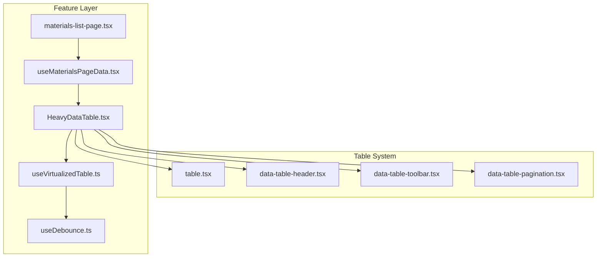
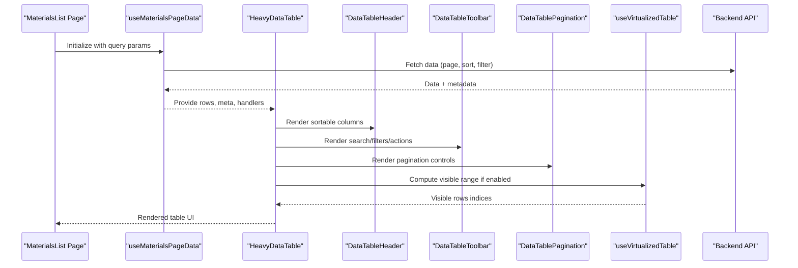
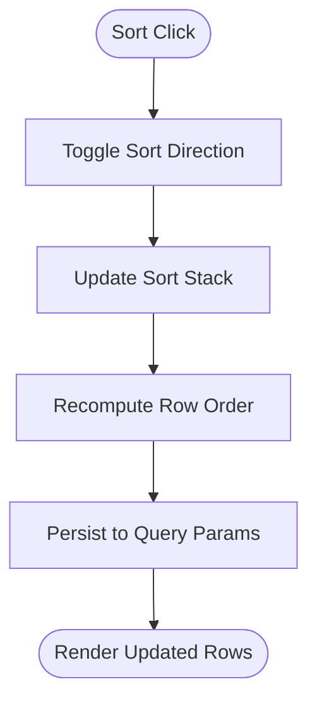
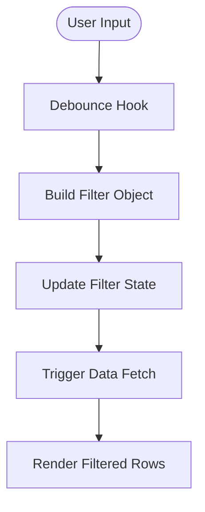
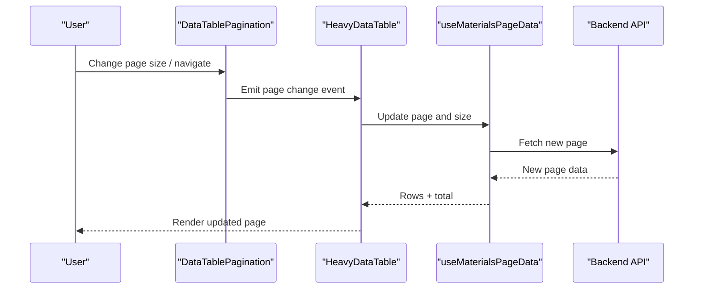
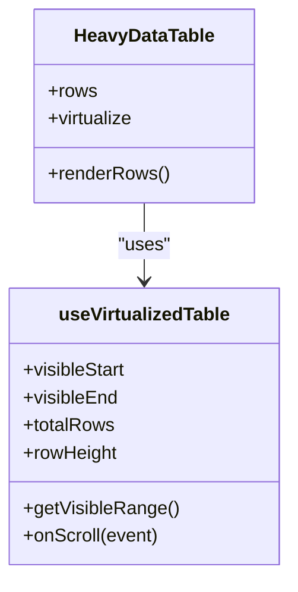
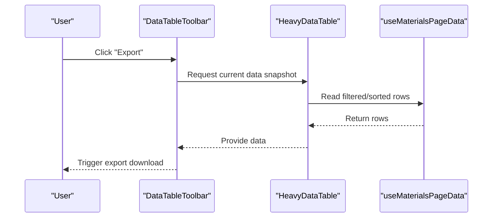
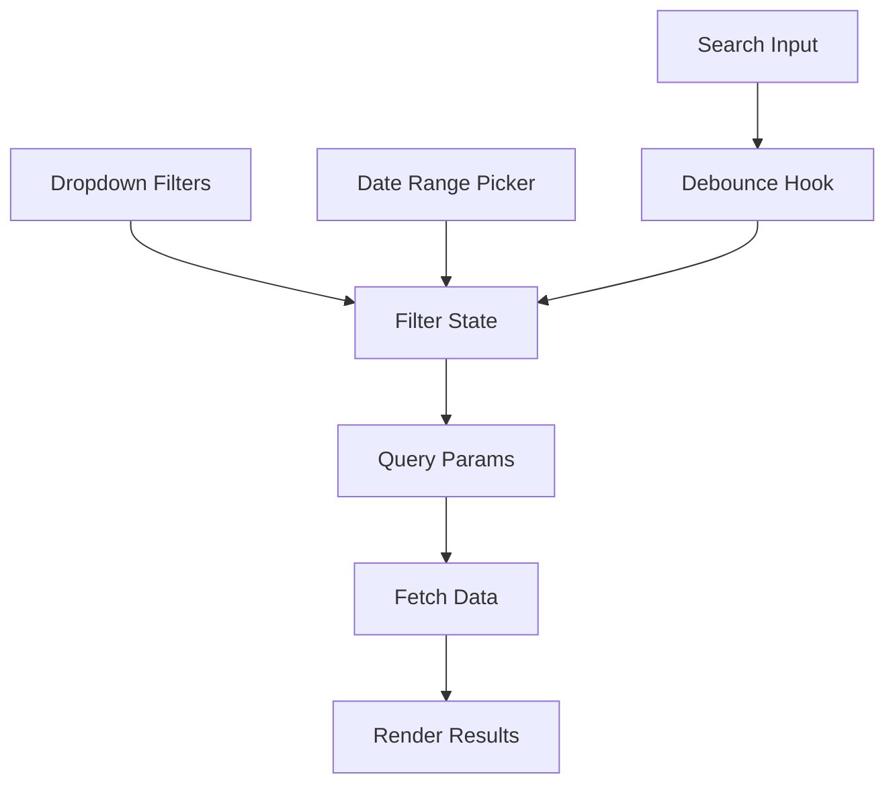
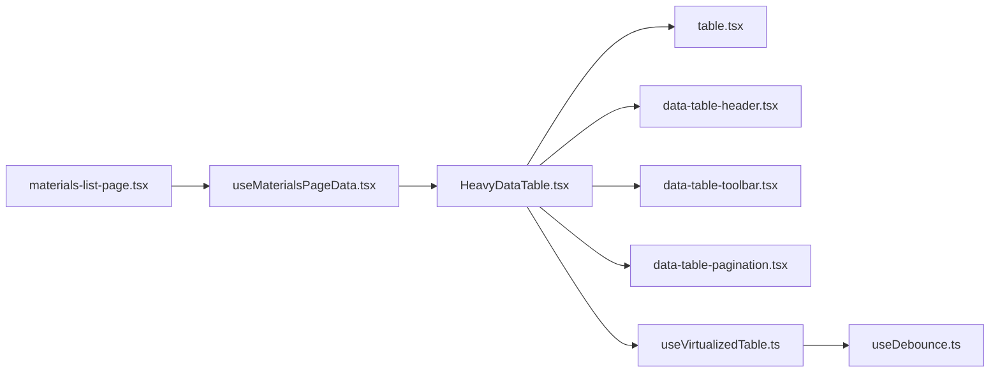

# Table Features & Functionality

<cite>
**Referenced Files in This Document**
- [table.tsx](file://table-system/components/ui/table/table.tsx)
- [data-table-header.tsx](file://table-system/components/ui/table/data-table-header.tsx)
- [data-table-toolbar.tsx](file://table-system/components/ui/table/data-table-toolbar.tsx)
- [data-table-pagination.tsx](file://table-system/components/ui/table/data-table-pagination.tsx)
- [HeavyDataTable.tsx](file://src/components/HeavyDataTable.tsx)
- [useVirtualizedTable.ts](file://src/hooks/useVirtualizedTable.ts)
- [useDebounce.ts](file://src/hooks/useDebounce.ts)
- [useMaterialsPageData.tsx](file://src/hooks/useMaterialsPageData.tsx)
- [materials-list-page.tsx](file://src/pages/MaterialsList.tsx)
</cite>

## Table of Contents
1. [Introduction](#introduction)
2. [Project Structure](#project-structure)
3. [Core Components](#core-components)
4. [Architecture Overview](#architecture-overview)
5. [Detailed Component Analysis](#detailed-component-analysis)
6. [Dependency Analysis](#dependency-analysis)
7. [Performance Considerations](#performance-considerations)
8. [Troubleshooting Guide](#troubleshooting-guide)
9. [Conclusion](#conclusion)

## Introduction
This document explains advanced table features implemented across the application, focusing on sorting, filtering, pagination, virtualization, and toolbar capabilities. It provides guidance for implementing multi-column sorting, custom sort functions, real-time search, dropdown filters, page size controls, infinite scrolling patterns, and export actions. The content is grounded in the existing table system components and hooks used by feature pages such as Materials List.

## Project Structure
The table system is organized into reusable UI primitives under a dedicated directory and consumed by feature pages via shared hooks and higher-order components.

**Diagram sources**
- [table.tsx](file://table-system/components/ui/table/table.tsx)
- [data-table-header.tsx](file://table-system/components/ui/table/data-table-header.tsx)
- [data-table-toolbar.tsx](file://table-system/components/ui/table/data-table-toolbar.tsx)
- [data-table-pagination.tsx](file://table-system/components/ui/table/data-table-pagination.tsx)
- [HeavyDataTable.tsx](file://src/components/HeavyDataTable.tsx)
- [useVirtualizedTable.ts](file://src/hooks/useVirtualizedTable.ts)
- [useDebounce.ts](file://src/hooks/useDebounce.ts)
- [useMaterialsPageData.tsx](file://src/hooks/useMaterialsPageData.tsx)
- [materials-list-page.tsx](file://src/pages/MaterialsList.tsx)

**Section sources**
- [table.tsx](file://table-system/components/ui/table/table.tsx)
- [data-table-header.tsx](file://table-system/components/ui/table/data-table-header.tsx)
- [data-table-toolbar.tsx](file://table-system/components/ui/table/data-table-toolbar.tsx)
- [data-table-pagination.tsx](file://table-system/components/ui/table/data-table-pagination.tsx)
- [HeavyDataTable.tsx](file://src/components/HeavyDataTable.tsx)
- [useVirtualizedTable.ts](file://src/hooks/useVirtualizedTable.ts)
- [useDebounce.ts](file://src/hooks/useDebounce.ts)
- [useMaterialsPageData.tsx](file://src/hooks/useMaterialsPageData.tsx)
- [materials-list-page.tsx](file://src/pages/MaterialsList.tsx)

## Core Components
- Base table primitive: Provides structural markup and styling for tables, rows, cells, and headers.
- Header component: Adds sortable column headers with visual indicators and supports custom renderers.
- Toolbar component: Hosts search input, dropdown filters, action buttons, and bulk operations.
- Pagination component: Renders page navigation and page size controls.
- Heavy data table wrapper: Orchestrates sorting, filtering, pagination, and optional virtualization for large datasets.
- Virtualization hook: Efficiently renders only visible rows to improve performance for large lists.
- Debounce hook: Throttles rapid user input (e.g., search) to reduce re-renders and network calls.
- Page data hook: Centralizes fetching, caching, and state synchronization for list data.

Key responsibilities:
- Sorting: Multi-column support with stable ordering and custom comparator functions.
- Filtering: Real-time text search and dropdown-based filters with debounced updates.
- Pagination: Server-driven or client-side paging with configurable page sizes.
- Toolbar: Action buttons, bulk selection, and export triggers.
- Performance: Virtualization and debouncing to maintain smooth interactions at scale.

**Section sources**
- [table.tsx](file://table-system/components/ui/table/table.tsx)
- [data-table-header.tsx](file://table-system/components/ui/table/data-table-header.tsx)
- [data-table-toolbar.tsx](file://table-system/components/ui/table/data-table-toolbar.tsx)
- [data-table-pagination.tsx](file://table-system/components/ui/table/data-table-pagination.tsx)
- [HeavyDataTable.tsx](file://src/components/HeavyDataTable.tsx)
- [useVirtualizedTable.ts](file://src/hooks/useVirtualizedTable.ts)
- [useDebounce.ts](file://src/hooks/useDebounce.ts)
- [useMaterialsPageData.tsx](file://src/hooks/useMaterialsPageData.tsx)

## Architecture Overview
The table architecture separates concerns between presentation, orchestration, and data access. Feature pages compose the heavy data table with configuration for columns, sorting, filtering, and pagination. The virtualization hook optimizes rendering when dataset sizes grow.

**Diagram sources**
- [materials-list-page.tsx](file://src/pages/MaterialsList.tsx)
- [useMaterialsPageData.tsx](file://src/hooks/useMaterialsPageData.tsx)
- [HeavyDataTable.tsx](file://src/components/HeavyDataTable.tsx)
- [data-table-header.tsx](file://table-system/components/ui/table/data-table-header.tsx)
- [data-table-toolbar.tsx](file://table-system/components/ui/table/data-table-toolbar.tsx)
- [data-table-pagination.tsx](file://table-system/components/ui/table/data-table-pagination.tsx)
- [useVirtualizedTable.ts](file://src/hooks/useVirtualizedTable.ts)

## Detailed Component Analysis

### Sorting Capabilities
- Multi-column sorting: Maintain an ordered list of active sort keys; each click toggles direction and adds/removes columns from the sort stack.
- Custom sort functions: Columns can provide comparators that handle locale-aware strings, numbers, dates, and nulls consistently.
- Stable ordering: Preserve original row order when primary keys are equal to avoid jumpy UI during re-renders.
- Integration points:
  - Header component exposes click handlers to update sort state.
  - Heavy data table aggregates sort state and passes it to data hooks.
  - Page data hook serializes sort state into query parameters for server-side sorting.

**Diagram sources**
- [data-table-header.tsx](file://table-system/components/ui/table/data-table-header.tsx)
- [HeavyDataTable.tsx](file://src/components/HeavyDataTable.tsx)
- [useMaterialsPageData.tsx](file://src/hooks/useMaterialsPageData.tsx)

**Section sources**
- [data-table-header.tsx](file://table-system/components/ui/table/data-table-header.tsx)
- [HeavyDataTable.tsx](file://src/components/HeavyDataTable.tsx)
- [useMaterialsPageData.tsx](file://src/hooks/useMaterialsPageData.tsx)

### Filtering Mechanisms
- Search: Text search across selected fields with debounced updates to minimize re-renders and network requests.
- Dropdown filters: Predefined options per column (e.g., status, category) with multi-select support and clear/reset actions.
- Real-time filtering: Debounced input drives immediate UI feedback while batching network calls.
- Complex scenarios: Combine multiple filters with AND/OR logic; persist filter state in URL for shareable links.

**Diagram sources**
- [useDebounce.ts](file://src/hooks/useDebounce.ts)
- [data-table-toolbar.tsx](file://table-system/components/ui/table/data-table-toolbar.tsx)
- [useMaterialsPageData.tsx](file://src/hooks/useMaterialsPageData.tsx)

**Section sources**
- [useDebounce.ts](file://src/hooks/useDebounce.ts)
- [data-table-toolbar.tsx](file://table-system/components/ui/table/data-table-toolbar.tsx)
- [useMaterialsPageData.tsx](file://src/hooks/useMaterialsPageData.tsx)

### Pagination Implementation
- Page size controls: Allow users to select rows per page; persists choice in query params.
- Navigation: Next/previous, first/last, and direct page jump with validation.
- Infinite scrolling pattern: For very large datasets, load additional pages as the user scrolls near the bottom; combine with virtualization for optimal performance.
- Server vs client: Prefer server-side pagination for large datasets; client-side pagination is acceptable for small, static lists.

**Diagram sources**
- [data-table-pagination.tsx](file://table-system/components/ui/table/data-table-pagination.tsx)
- [HeavyDataTable.tsx](file://src/components/HeavyDataTable.tsx)
- [useMaterialsPageData.tsx](file://src/hooks/useMaterialsPageData.tsx)

**Section sources**
- [data-table-pagination.tsx](file://table-system/components/ui/table/data-table-pagination.tsx)
- [HeavyDataTable.tsx](file://src/components/HeavyDataTable.tsx)
- [useMaterialsPageData.tsx](file://src/hooks/useMaterialsPageData.tsx)

### Virtualization for Large Datasets
- Visible window calculation: Only render rows within the viewport plus a buffer to ensure smooth scrolling.
- Height management: Use fixed row heights or measure dynamically to compute offsets accurately.
- Scroll handling: Attach scroll listeners efficiently and update visible indices without blocking the main thread.
- Integration: Virtualization hook returns slice indices; heavy data table maps these to rendered rows.

**Diagram sources**
- [useVirtualizedTable.ts](file://src/hooks/useVirtualizedTable.ts)
- [HeavyDataTable.tsx](file://src/components/HeavyDataTable.tsx)

**Section sources**
- [useVirtualizedTable.ts](file://src/hooks/useVirtualizedTable.ts)
- [HeavyDataTable.tsx](file://src/components/HeavyDataTable.tsx)

### Toolbar Functionality
- Action buttons: Primary actions like “Add”, “Import”, “Export” placed prominently in the toolbar.
- Bulk operations: Checkbox selection enables batch actions (delete, assign, export). Selection state is synchronized with row data.
- Export features: Generate CSV/Excel exports from current filtered/sorted view or entire dataset depending on requirements.
- Custom toolbar components: Compose specialized controls (date ranges, tags, advanced filters) inside the toolbar slot.

**Diagram sources**
- [data-table-toolbar.tsx](file://table-system/components/ui/table/data-table-toolbar.tsx)
- [HeavyDataTable.tsx](file://src/components/HeavyDataTable.tsx)
- [useMaterialsPageData.tsx](file://src/hooks/useMaterialsPageData.tsx)

**Section sources**
- [data-table-toolbar.tsx](file://table-system/components/ui/table/data-table-toolbar.tsx)
- [HeavyDataTable.tsx](file://src/components/HeavyDataTable.tsx)
- [useMaterialsPageData.tsx](file://src/hooks/useMaterialsPageData.tsx)

### Example Implementations

#### Complex Filtering Scenario
- Combine text search with dropdown filters and date range constraints.
- Persist combined filters in URL for deep linking and sharing.
- Debounce search input while applying dropdown changes immediately for responsiveness.

**Diagram sources**
- [useDebounce.ts](file://src/hooks/useDebounce.ts)
- [data-table-toolbar.tsx](file://table-system/components/ui/table/data-table-toolbar.tsx)
- [useMaterialsPageData.tsx](file://src/hooks/useMaterialsPageData.tsx)

**Section sources**
- [useDebounce.ts](file://src/hooks/useDebounce.ts)
- [data-table-toolbar.tsx](file://table-system/components/ui/table/data-table-toolbar.tsx)
- [useMaterialsPageData.tsx](file://src/hooks/useMaterialsPageData.tsx)

#### Custom Toolbar Component
- Create a composable toolbar slot that includes advanced filters, quick actions, and export buttons.
- Wire toolbar events to update shared state managed by the page data hook.
- Ensure accessibility with proper labels and keyboard navigation.

**Section sources**
- [data-table-toolbar.tsx](file://table-system/components/ui/table/data-table-toolbar.tsx)
- [HeavyDataTable.tsx](file://src/components/HeavyDataTable.tsx)
- [useMaterialsPageData.tsx](file://src/hooks/useMaterialsPageData.tsx)

## Dependency Analysis
The table system exhibits low coupling between presentation and orchestration layers. Heavy data table depends on header, toolbar, pagination, and virtualization utilities. Feature pages depend on page data hooks which encapsulate API interactions and state synchronization.

**Diagram sources**
- [materials-list-page.tsx](file://src/pages/MaterialsList.tsx)
- [useMaterialsPageData.tsx](file://src/hooks/useMaterialsPageData.tsx)
- [HeavyDataTable.tsx](file://src/components/HeavyDataTable.tsx)
- [table.tsx](file://table-system/components/ui/table/table.tsx)
- [data-table-header.tsx](file://table-system/components/ui/table/data-table-header.tsx)
- [data-table-toolbar.tsx](file://table-system/components/ui/table/data-table-toolbar.tsx)
- [data-table-pagination.tsx](file://table-system/components/ui/table/data-table-pagination.tsx)
- [useVirtualizedTable.ts](file://src/hooks/useVirtualizedTable.ts)
- [useDebounce.ts](file://src/hooks/useDebounce.ts)

**Section sources**
- [materials-list-page.tsx](file://src/pages/MaterialsList.tsx)
- [useMaterialsPageData.tsx](file://src/hooks/useMaterialsPageData.tsx)
- [HeavyDataTable.tsx](file://src/components/HeavyDataTable.tsx)
- [table.tsx](file://table-system/components/ui/table/table.tsx)
- [data-table-header.tsx](file://table-system/components/ui/table/data-table-header.tsx)
- [data-table-toolbar.tsx](file://table-system/components/ui/table/data-table-toolbar.tsx)
- [data-table-pagination.tsx](file://table-system/components/ui/table/data-table-pagination.tsx)
- [useVirtualizedTable.ts](file://src/hooks/useVirtualizedTable.ts)
- [useDebounce.ts](file://src/hooks/useDebounce.ts)

## Performance Considerations
- Prefer server-side sorting, filtering, and pagination for large datasets to minimize client processing.
- Use virtualization when rendering thousands of rows; ensure consistent row heights or implement dynamic measurement strategies.
- Debounce search inputs to reduce unnecessary re-renders and network calls.
- Avoid expensive computations in render paths; memoize derived values where appropriate.
- Limit bulk operation payloads; chunk large batches to prevent UI freezes.

[No sources needed since this section provides general guidance]

## Troubleshooting Guide
- Stale sort/filter state: Verify that sort and filter states are persisted in query parameters and rehydrated on mount.
- Pagination desync: Ensure page size changes trigger refetches and that total counts are refreshed after mutations.
- Virtualization glitches: Confirm row height consistency and that scroll container dimensions are correctly measured.
- Export failures: Validate that exported data reflects current filters and sorts; handle large exports asynchronously.
- Accessibility issues: Check that interactive elements have proper roles, labels, and keyboard support.

**Section sources**
- [HeavyDataTable.tsx](file://src/components/HeavyDataTable.tsx)
- [useMaterialsPageData.tsx](file://src/hooks/useMaterialsPageData.tsx)
- [useVirtualizedTable.ts](file://src/hooks/useVirtualizedTable.ts)

## Conclusion
The table system provides a robust foundation for advanced data presentation with sorting, filtering, pagination, virtualization, and rich toolbar capabilities. By composing the provided components and hooks, teams can build performant, accessible, and user-friendly data interfaces tailored to complex business needs.

[No sources needed since this section summarizes without analyzing specific files]