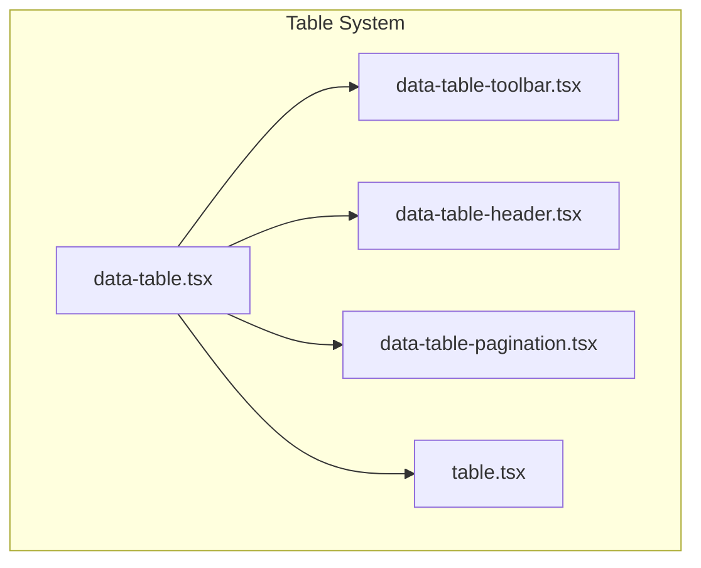
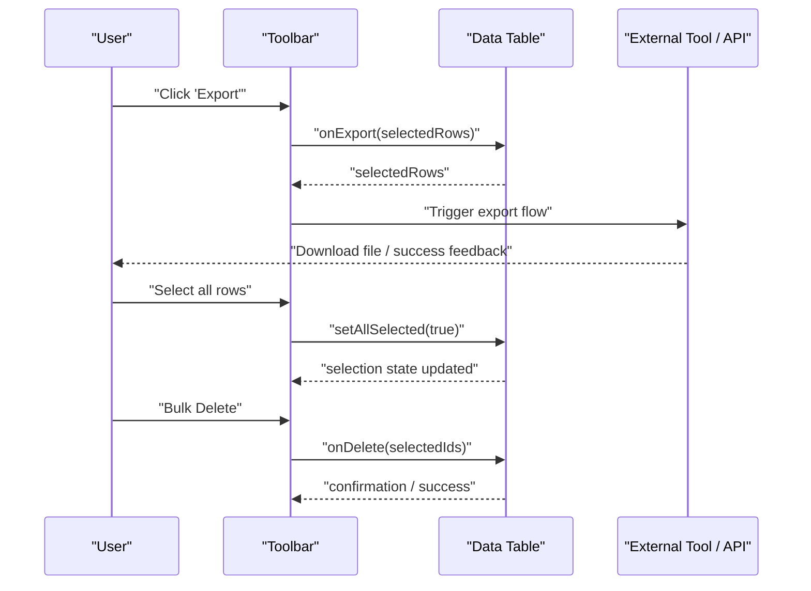
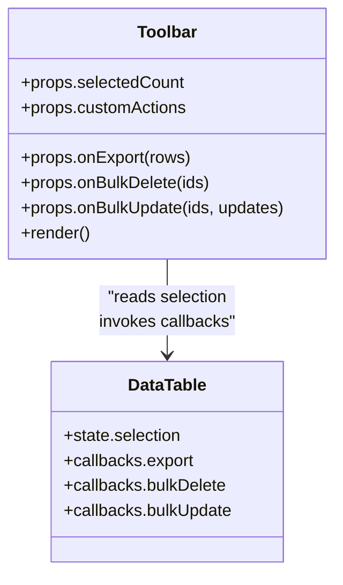
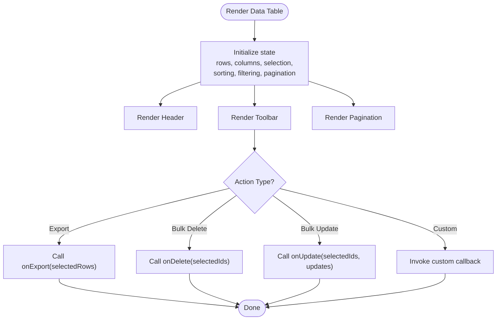
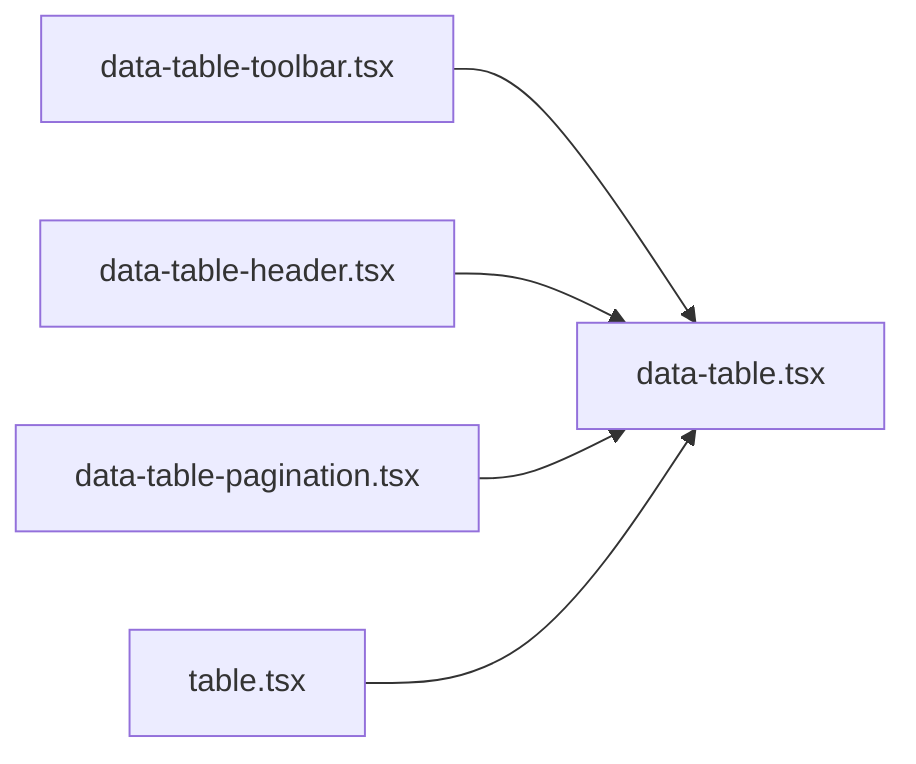

# Toolbar Functionality

<cite>
**Referenced Files in This Document**
- [data-table-toolbar.tsx](file://table-system/components/ui/table/data-table-toolbar.tsx)
- [data-table.tsx](file://table-system/components/ui/table/data-table.tsx)
- [data-table-header.tsx](file://table-system/components/ui/table/data-table-header.tsx)
- [data-table-pagination.tsx](file://table-system/components/ui/table/data-table-pagination.tsx)
- [table.tsx](file://table-system/components/ui/table/table.tsx)
</cite>

## Table of Contents
1. [Introduction](#introduction)
2. [Project Structure](#project-structure)
3. [Core Components](#core-components)
4. [Architecture Overview](#architecture-overview)
5. [Detailed Component Analysis](#detailed-component-analysis)
6. [Dependency Analysis](#dependency-analysis)
7. [Performance Considerations](#performance-considerations)
8. [Troubleshooting Guide](#troubleshooting-guide)
9. [Conclusion](#conclusion)
10. [Appendices](#appendices)

## Introduction
This document explains the table toolbar features implemented in the project’s table system. It covers action buttons, bulk operations handling, and export functionality integration. You will learn how to create customizable toolbar components, manage toolbar state, implement responsive layouts, add custom actions, implement bulk delete/update operations, integrate with external tools, and ensure accessibility and keyboard navigation across devices.

## Project Structure
The table UI is organized under a dedicated table system directory that provides reusable primitives for building data tables:
- A base table component
- A header component
- A pagination component
- A toolbar component designed to host search, filters, actions, and bulk controls
- The main data table component that composes these pieces together

**Diagram sources**
- [data-table.tsx](file://table-system/components/ui/table/data-table.tsx)
- [data-table-header.tsx](file://table-system/components/ui/table/data-table-header.tsx)
- [data-table-pagination.tsx](file://table-system/components/ui/table/data-table-pagination.tsx)
- [data-table-toolbar.tsx](file://table-system/components/ui/table/data-table-toolbar.tsx)
- [table.tsx](file://table-system/components/ui/table/table.tsx)

**Section sources**
- [data-table.tsx](file://table-system/components/ui/table/data-table.tsx)
- [data-table-header.tsx](file://table-system/components/ui/table/data-table-header.tsx)
- [data-table-pagination.tsx](file://table-system/components/ui/table/data-table-pagination.tsx)
- [data-table-toolbar.tsx](file://table-system/components/ui/table/data-table-toolbar.tsx)
- [table.tsx](file://table-system/components/ui/table/table.tsx)

## Core Components
- Data Table: Orchestrates state (rows, columns, sorting, filtering, selection, pagination), renders the table shell, and wires up child components.
- Table Header: Renders column headers, sort indicators, and integrates with the table’s sorting/filtering state.
- Pagination: Controls page size and current page, exposing handlers to update table state.
- Toolbar: Hosts search input, filter toggles, action buttons, bulk operation controls, and export triggers. Designed to be flexible and extensible.

Key responsibilities:
- Centralized state management for selection, sorting, filtering, and pagination
- Clear separation between presentation and behavior
- Extensibility points for adding custom actions and integrations

**Section sources**
- [data-table.tsx](file://table-system/components/ui/table/data-table.tsx)
- [data-table-header.tsx](file://table-system/components/ui/table/data-table-header.tsx)
- [data-table-pagination.tsx](file://table-system/components/ui/table/data-table-pagination.tsx)
- [data-table-toolbar.tsx](file://table-system/components/ui/table/data-table-toolbar.tsx)
- [table.tsx](file://table-system/components/ui/table/table.tsx)

## Architecture Overview
The toolbar sits at the top of the data table and communicates with the parent table via props and callbacks. Bulk operations are coordinated through selection state managed by the data table. Export actions can trigger client-side or server-side flows.

**Diagram sources**
- [data-table-toolbar.tsx](file://table-system/components/ui/table/data-table-toolbar.tsx)
- [data-table.tsx](file://table-system/components/ui/table/data-table.tsx)

## Detailed Component Analysis

### Toolbar Component
Responsibilities:
- Render search input and optional filter toggles
- Provide action buttons (e.g., Add, Edit, Delete)
- Expose bulk operation controls when items are selected
- Trigger export actions and integrate with external tools
- Maintain responsive layout for mobile and desktop

State and props:
- Selection state from the data table (selected rows/ids)
- Callbacks for actions (export, delete, update, custom)
- Optional configuration flags to show/hide specific controls

Accessibility:
- Use semantic button elements with descriptive labels
- Ensure focus order and visible focus styles
- Provide aria attributes for screen readers (e.g., aria-label, aria-live for results count)

Responsive design:
- Collapse secondary actions into an overflow menu on small screens
- Stack controls vertically on narrow viewports
- Keep primary actions always visible

**Diagram sources**
- [data-table-toolbar.tsx](file://table-system/components/ui/table/data-table-toolbar.tsx)
- [data-table.tsx](file://table-system/components/ui/table/data-table.tsx)

**Section sources**
- [data-table-toolbar.tsx](file://table-system/components/ui/table/data-table-toolbar.tsx)

### Data Table Component
Responsibilities:
- Manage core table state (rows, columns, sorting, filtering, selection, pagination)
- Compose header, toolbar, and pagination
- Provide context or props to children for consistent behavior

Integration points:
- Accepts toolbar configuration via props
- Emits events for bulk operations and exports
- Coordinates with pagination and header for consistent UX

**Diagram sources**
- [data-table.tsx](file://table-system/components/ui/table/data-table.tsx)
- [data-table-toolbar.tsx](file://table-system/components/ui/table/data-table-toolbar.tsx)

**Section sources**
- [data-table.tsx](file://table-system/components/ui/table/data-table.tsx)

### Header Component
Responsibilities:
- Render column headers with sort indicators
- Integrate with table’s sorting and filtering state
- Provide accessible labels and keyboard support

**Section sources**
- [data-table-header.tsx](file://table-system/components/ui/table/data-table-header.tsx)

### Pagination Component
Responsibilities:
- Display current page and total pages
- Allow changing page size and navigating pages
- Emit events to update table state

**Section sources**
- [data-table-pagination.tsx](file://table-system/components/ui/table/data-table-pagination.tsx)

### Base Table Component
Responsibilities:
- Provide foundational table markup and styling
- Serve as a building block for higher-level table components

**Section sources**
- [table.tsx](file://table-system/components/ui/table/table.tsx)

## Dependency Analysis
The toolbar depends on the data table for selection state and action callbacks. The data table composes header, pagination, and toolbar components. The base table provides shared structure and styles.

**Diagram sources**
- [data-table-toolbar.tsx](file://table-system/components/ui/table/data-table-toolbar.tsx)
- [data-table.tsx](file://table-system/components/ui/table/data-table.tsx)
- [data-table-header.tsx](file://table-system/components/ui/table/data-table-header.tsx)
- [data-table-pagination.tsx](file://table-system/components/ui/table/data-table-pagination.tsx)
- [table.tsx](file://table-system/components/ui/table/table.tsx)

**Section sources**
- [data-table-toolbar.tsx](file://table-system/components/ui/table/data-table-toolbar.tsx)
- [data-table.tsx](file://table-system/components/ui/table/data-table.tsx)
- [data-table-header.tsx](file://table-system/components/ui/table/data-table-header.tsx)
- [data-table-pagination.tsx](file://table-system/components/ui/table/data-table-pagination.tsx)
- [table.tsx](file://table-system/components/ui/table/table.tsx)

## Performance Considerations
- Avoid re-rendering heavy toolbars by memoizing components and stable callback references.
- Debounce search input to reduce frequent state updates.
- Limit bulk operation payloads; batch requests where possible.
- Use virtualization for large datasets to keep the UI responsive.
- Prefer client-side exports for small datasets; use server-side streaming for large exports.

[No sources needed since this section provides general guidance]

## Troubleshooting Guide
Common issues and resolutions:
- Action buttons not responding: Verify that callbacks are passed correctly from the data table to the toolbar and that event handlers are bound to stable references.
- Bulk operations not applying: Confirm that selection state is synchronized and that IDs used for bulk actions match the underlying row identifiers.
- Export not triggering: Check that the export callback receives the correct dataset and that external tool integration handles errors gracefully.
- Accessibility problems: Ensure all interactive elements have proper labels, roles, and keyboard support. Test with screen readers and keyboard-only navigation.

**Section sources**
- [data-table-toolbar.tsx](file://table-system/components/ui/table/data-table-toolbar.tsx)
- [data-table.tsx](file://table-system/components/ui/table/data-table.tsx)

## Conclusion
The table toolbar provides a flexible foundation for action buttons, bulk operations, and export integrations. By leveraging the data table’s state and callbacks, you can build responsive, accessible, and high-performance table experiences. Use the provided patterns to add custom actions, implement bulk workflows, and integrate with external tools while maintaining a consistent user experience across devices.

[No sources needed since this section summarizes without analyzing specific files]

## Appendices

### Creating Custom Toolbar Actions
- Extend the toolbar with additional buttons using the provided configuration interface.
- Wire custom callbacks to the data table’s event system.
- Ensure each action has clear labels and appropriate keyboard shortcuts.

**Section sources**
- [data-table-toolbar.tsx](file://table-system/components/ui/table/data-table-toolbar.tsx)

### Implementing Bulk Delete/Update Operations
- Use the selection state to gather target IDs.
- Show confirmation dialogs before destructive operations.
- Batch API calls and provide progress feedback.
- Refresh table data after successful operations.

**Section sources**
- [data-table-toolbar.tsx](file://table-system/components/ui/table/data-table-toolbar.tsx)
- [data-table.tsx](file://table-system/components/ui/table/data-table.tsx)

### Integrating with External Tools
- For exports, pass selected or filtered rows to the external service.
- Handle loading states and error notifications.
- Support both client-side generation and server-side streaming based on dataset size.

**Section sources**
- [data-table-toolbar.tsx](file://table-system/components/ui/table/data-table-toolbar.tsx)

### Accessibility and Keyboard Navigation
- Use native button elements with descriptive labels.
- Provide aria-live regions for dynamic content changes (e.g., selection counts).
- Ensure logical tab order and visible focus indicators.
- Test with assistive technologies.

**Section sources**
- [data-table-toolbar.tsx](file://table-system/components/ui/table/data-table-toolbar.tsx)

### Responsive Layout Patterns
- Collapse secondary actions into an overflow menu on small screens.
- Stack controls vertically on narrow viewports.
- Keep primary actions always visible and easily reachable.

**Section sources**
- [data-table-toolbar.tsx](file://table-system/components/ui/table/data-table-toolbar.tsx)