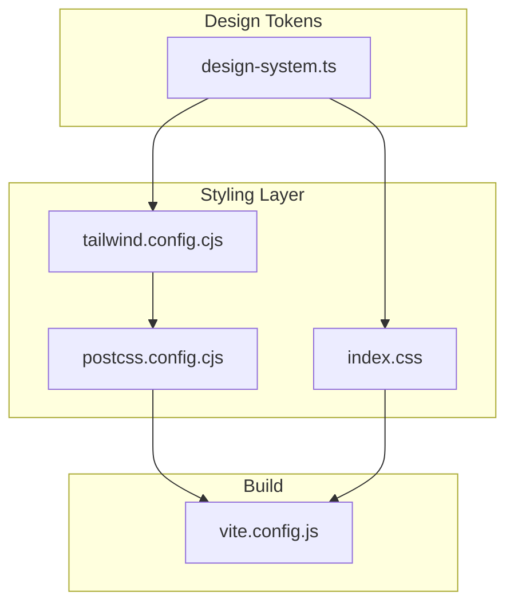
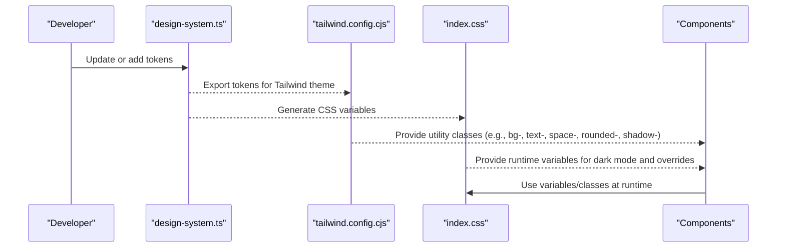
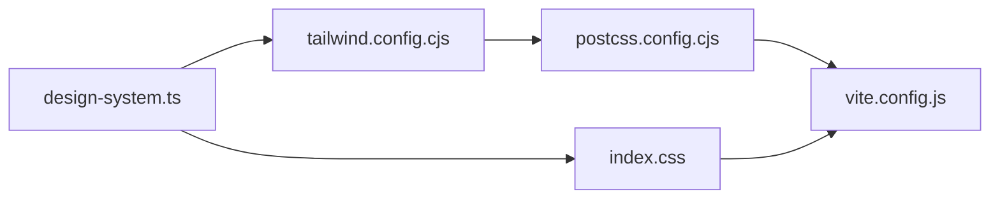

# Design System & Tokens

<cite>
**Referenced Files in This Document**
- [design-system.ts](file://src/design-system.ts)
- [tailwind.config.cjs](file://tailwind.config.cjs)
- [index.css](file://src/index.css)
- [components.json](file://components.json)
- [postcss.config.cjs](file://postcss.config.cjs)
- [vite.config.js](file://vite.config.js)
</cite>

## Table of Contents
1. [Introduction](#introduction)
2. [Project Structure](#project-structure)
3. [Core Components](#core-components)
4. [Architecture Overview](#architecture-overview)
5. [Detailed Component Analysis](#detailed-component-analysis)
6. [Dependency Analysis](#dependency-analysis)
7. [Performance Considerations](#performance-considerations)
8. [Troubleshooting Guide](#troubleshooting-guide)
9. [Conclusion](#conclusion)
10. [Appendices](#appendices)

## Introduction
This document describes the design system foundation and visual tokens used across the application. It covers color palettes, typography scales, spacing units, border radius values, and shadow definitions. It also explains the theme configuration system, how to customize design tokens, guidelines for maintaining visual consistency, examples of using tokens in custom components, responsive breakpoints, dark mode support, accessibility considerations, and how to extend the design system with new tokens while preserving consistency.

## Project Structure
The design system is implemented through a combination of:
- A centralized design token file that defines colors, typography, spacing, radii, shadows, and other tokens.
- A Tailwind CSS configuration that maps tokens to utility classes and theme variables.
- Global stylesheets that expose CSS custom properties for runtime theming (including dark mode).
- Build tooling (PostCSS and Vite) that compiles and optimizes styles.

**Diagram sources**
- [design-system.ts](file://src/design-system.ts)
- [tailwind.config.cjs](file://tailwind.config.cjs)
- [index.css](file://src/index.css)
- [postcss.config.cjs](file://postcss.config.cjs)
- [vite.config.js](file://vite.config.js)

**Section sources**
- [design-system.ts](file://src/design-system.ts)
- [tailwind.config.cjs](file://tailwind.config.cjs)
- [index.css](file://src/index.css)
- [postcss.config.cjs](file://postcss.config.cjs)
- [vite.config.js](file://vite.config.js)

## Core Components
- Centralized tokens: A single source of truth for all visual tokens (colors, typography, spacing, radii, shadows, etc.).
- Theme mapping: Tailwind theme configuration that exposes tokens as utilities and CSS variables.
- Global CSS variables: Runtime-accessible variables for dynamic theming and dark mode.
- Build pipeline: PostCSS and Vite integration to process and bundle styles efficiently.

Key responsibilities:
- Define tokens once and reuse them everywhere.
- Provide consistent naming and scaling across the app.
- Enable easy customization via theme overrides.
- Support dark mode and responsive behavior.

**Section sources**
- [design-system.ts](file://src/design-system.ts)
- [tailwind.config.cjs](file://tailwind.config.cjs)
- [index.css](file://src/index.css)

## Architecture Overview
The design system follows a layered architecture:
- Token layer: The canonical definition of design tokens.
- Theme layer: Maps tokens to Tailwind theme keys and CSS variables.
- Utility layer: Exposes tokens via Tailwind utilities and component classes.
- Runtime layer: Applies themes dynamically using CSS variables and media queries.

**Diagram sources**
- [design-system.ts](file://src/design-system.ts)
- [tailwind.config.cjs](file://tailwind.config.cjs)
- [index.css](file://src/index.css)

## Detailed Component Analysis

### Color Palette
- Purpose: Provide semantic and functional color tokens (e.g., primary, secondary, success, warning, error, neutral, surface, overlay).
- Usage: Apply via Tailwind utilities (backgrounds, text, borders) and CSS variables for runtime switching.
- Customization: Extend or override palette entries in the token file; ensure sufficient contrast for accessibility.

Guidelines:
- Prefer semantic names over literal hues.
- Maintain consistent luminance ratios for readability.
- Keep light/dark variants aligned for parity.

**Section sources**
- [design-system.ts](file://src/design-system.ts)
- [tailwind.config.cjs](file://tailwind.config.cjs)
- [index.css](file://src/index.css)

### Typography Scale
- Purpose: Define type scale (font families, sizes, line heights, weights) and semantic roles (heading, body, caption, label).
- Usage: Apply via Tailwind typography utilities and CSS variables for font stacks and sizing.
- Customization: Add new sizes or adjust scales in the token file; propagate to Tailwind theme.

Guidelines:
- Limit the number of distinct sizes to maintain rhythm.
- Ensure adequate line height for legibility.
- Use relative units where possible for scalability.

**Section sources**
- [design-system.ts](file://src/design-system.ts)
- [tailwind.config.cjs](file://tailwind.config.cjs)
- [index.css](file://src/index.css)

### Spacing Units
- Purpose: Standardize spacing (margins, paddings, gaps) using a consistent scale.
- Usage: Apply via Tailwind spacing utilities and CSS variables for layout tokens.
- Customization: Adjust base unit and scale increments in the token file.

Guidelines:
- Use multiples of a base unit to preserve rhythm.
- Avoid ad-hoc spacing values in components.

**Section sources**
- [design-system.ts](file://src/design-system.ts)
- [tailwind.config.cjs](file://tailwind.config.cjs)
- [index.css](file://src/index.css)

### Border Radius Values
- Purpose: Provide consistent corner rounding across surfaces, inputs, and overlays.
- Usage: Apply via Tailwind rounded utilities and CSS variables for dynamic adjustments.
- Customization: Add new radius steps or rename existing ones in the token file.

Guidelines:
- Align radius with brand personality (subtle vs. playful).
- Keep a small set of radii to reduce complexity.

**Section sources**
- [design-system.ts](file://src/design-system.ts)
- [tailwind.config.cjs](file://tailwind.config.cjs)
- [index.css](file://src/index.css)

### Shadow Definitions
- Purpose: Establish elevation levels and depth cues using standardized shadows.
- Usage: Apply via Tailwind shadow utilities and CSS variables for runtime control.
- Customization: Add or refine shadow tokens in the token file.

Guidelines:
- Use subtle shadows for low elevation and pronounced shadows for high elevation.
- Ensure shadows remain visible on both light and dark backgrounds.

**Section sources**
- [design-system.ts](file://src/design-system.ts)
- [tailwind.config.cjs](file://tailwind.config.cjs)
- [index.css](file://src/index.css)

### Theme Configuration System
- Central token file: Defines all tokens and exports them for Tailwind and CSS variables.
- Tailwind theme mapping: Connects tokens to theme keys so utilities can consume them.
- CSS variables: Expose tokens globally for runtime theming and dark mode.

How it works:
- Tokens are defined once and referenced by both Tailwind and CSS.
- Tailwind generates utilities based on the mapped theme.
- CSS variables enable dynamic updates without rebuilds.

**Section sources**
- [design-system.ts](file://src/design-system.ts)
- [tailwind.config.cjs](file://tailwind.config.cjs)
- [index.css](file://src/index.css)

### Responsive Breakpoints
- Purpose: Provide consistent breakpoints for responsive layouts.
- Usage: Reference breakpoint tokens in Tailwind utilities and media queries.
- Customization: Add or modify breakpoints in the token file and Tailwind config.

Guidelines:
- Follow common device widths and content flow patterns.
- Test components at each breakpoint to ensure usability.

**Section sources**
- [design-system.ts](file://src/design-system.ts)
- [tailwind.config.cjs](file://tailwind.config.cjs)
- [index.css](file://src/index.css)

### Dark Mode Support
- Purpose: Offer an alternate color scheme optimized for low-light environments.
- Usage: Toggle dark mode via class or attribute; tokens map to light/dark variants.
- Customization: Define dark variants for all relevant tokens.

Guidelines:
- Ensure WCAG contrast requirements in both modes.
- Validate interactive states (hover, focus, active) in dark mode.

**Section sources**
- [design-system.ts](file://src/design-system.ts)
- [tailwind.config.cjs](file://tailwind.config.cjs)
- [index.css](file://src/index.css)

### Accessibility Considerations
- Contrast: Verify minimum contrast ratios for text and interactive elements.
- Focus indicators: Provide clear focus styles using token-based colors.
- Motion: Respect reduced motion preferences when applying animations tied to tokens.
- Semantics: Use semantic tokens rather than hardcoded values to keep accessibility consistent.

**Section sources**
- [design-system.ts](file://src/design-system.ts)
- [tailwind.config.cjs](file://tailwind.config.cjs)
- [index.css](file://src/index.css)

### Using Design Tokens in Custom Components
Recommended approach:
- Import tokens from the central token file.
- Map tokens to Tailwind utilities or CSS variables within your component’s styling.
- For dynamic themes, rely on CSS variables exposed by the global stylesheet.

Example pattern (conceptual):
- Use background and text tokens for card surfaces and labels.
- Apply spacing tokens for padding and margins.
- Use radius and shadow tokens for elevation and shape.

**Section sources**
- [design-system.ts](file://src/design-system.ts)
- [tailwind.config.cjs](file://tailwind.config.cjs)
- [index.css](file://src/index.css)

### Extending the Design System with New Tokens
Steps:
1. Add the new token to the central token file.
2. Map the token in the Tailwind theme configuration if you need utility access.
3. Expose the token as a CSS variable if runtime usage is required.
4. Update documentation and component usage accordingly.

Consistency checks:
- Ensure naming conventions align with existing tokens.
- Validate contrast and accessibility implications.
- Confirm build output includes the new token.

**Section sources**
- [design-system.ts](file://src/design-system.ts)
- [tailwind.config.cjs](file://tailwind.config.cjs)
- [index.css](file://src/index.css)

## Dependency Analysis
The design system depends on the following build and styling tools:
- Tailwind CSS for generating utility classes from theme tokens.
- PostCSS for processing styles and enabling plugins.
- Vite for bundling and optimizing assets.

**Diagram sources**
- [design-system.ts](file://src/design-system.ts)
- [tailwind.config.cjs](file://tailwind.config.cjs)
- [index.css](file://src/index.css)
- [postcss.config.cjs](file://postcss.config.cjs)
- [vite.config.js](file://vite.config.js)

**Section sources**
- [tailwind.config.cjs](file://tailwind.config.cjs)
- [postcss.config.cjs](file://postcss.config.cjs)
- [vite.config.js](file://vite.config.js)

## Performance Considerations
- Minimize unused tokens: Only define tokens you use to keep generated CSS lean.
- Leverage CSS variables for runtime changes to avoid full rebuilds.
- Group related tokens to simplify maintenance and reduce duplication.
- Monitor bundle size impact of style generation and optimize Tailwind purge settings if needed.

[No sources needed since this section provides general guidance]

## Troubleshooting Guide
Common issues and resolutions:
- Token not applied: Ensure the token is exported from the central file and mapped in Tailwind theme.
- Dark mode not working: Verify CSS variables and Tailwind dark mode strategy are configured correctly.
- Inconsistent spacing/radius/shadows: Check that components reference tokens instead of hard-coded values.
- Build errors: Confirm PostCSS and Vite configurations include necessary plugins and paths.

Validation checklist:
- Run the build and inspect generated CSS for expected utilities and variables.
- Test components under light and dark modes.
- Audit contrast and focus styles for accessibility compliance.

**Section sources**
- [design-system.ts](file://src/design-system.ts)
- [tailwind.config.cjs](file://tailwind.config.cjs)
- [index.css](file://src/index.css)
- [postcss.config.cjs](file://postcss.config.cjs)
- [vite.config.js](file://vite.config.js)

## Conclusion
By centralizing design tokens and mapping them consistently into Tailwind and CSS variables, the application achieves visual coherence, maintainability, and flexibility. Following the guidelines for colors, typography, spacing, radii, shadows, responsiveness, dark mode, and accessibility ensures a robust and scalable design system. Extending the system should be done thoughtfully, with clear naming, proper mapping, and validation to preserve consistency.

[No sources needed since this section summarizes without analyzing specific files]

## Appendices

### Quick Start Checklist
- Define tokens in the central file.
- Map tokens to Tailwind theme keys.
- Expose tokens as CSS variables.
- Use tokens in components via utilities or variables.
- Validate in light and dark modes.
- Review accessibility and performance.

**Section sources**
- [design-system.ts](file://src/design-system.ts)
- [tailwind.config.cjs](file://tailwind.config.cjs)
- [index.css](file://src/index.css)