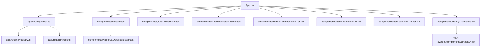
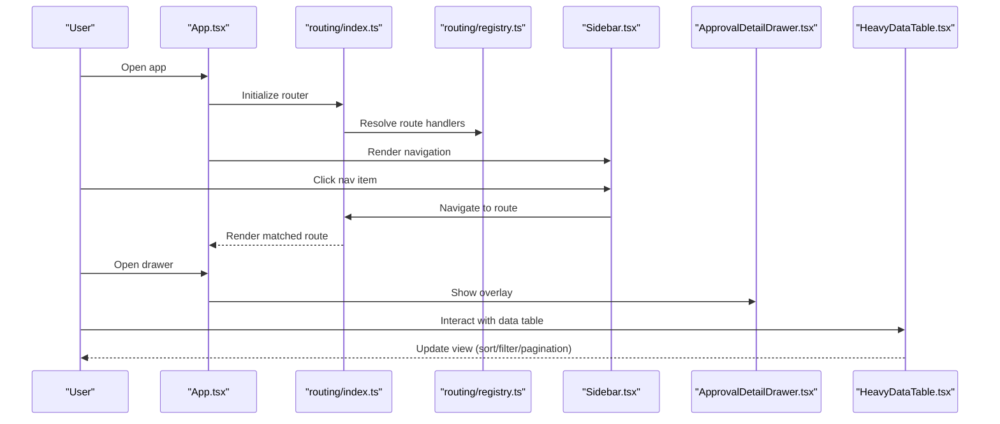
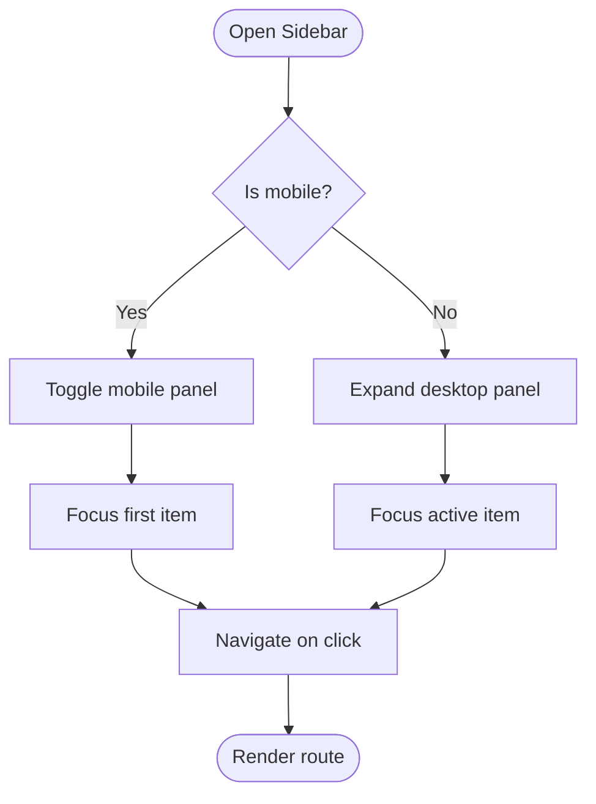
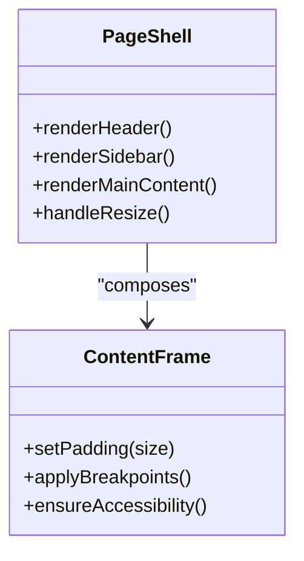
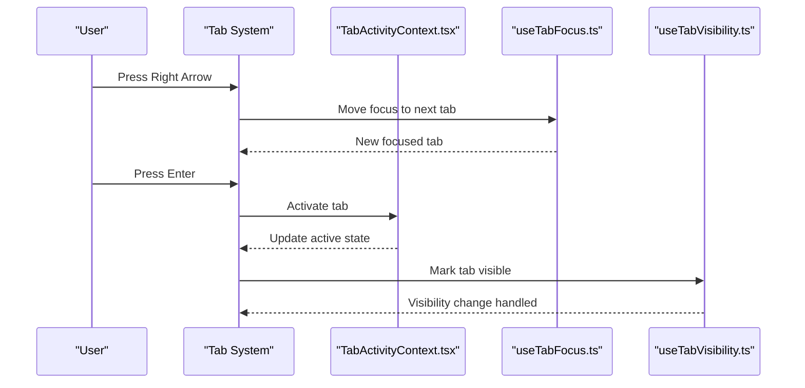
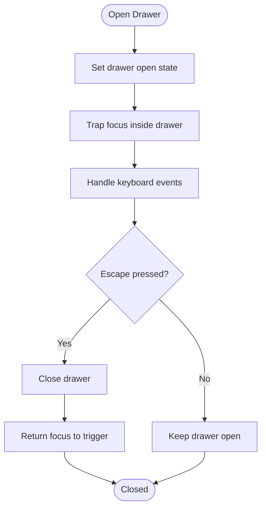
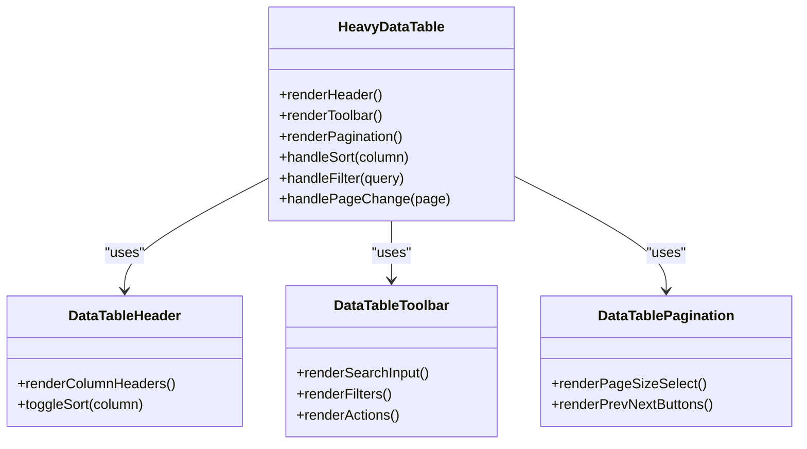
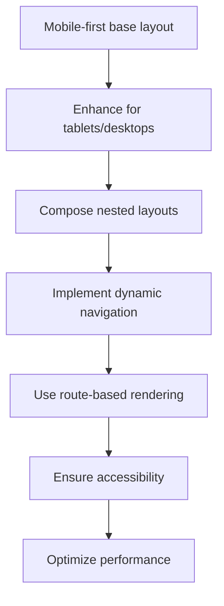
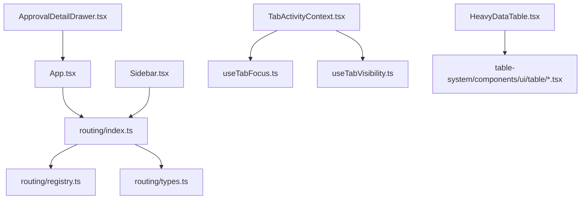

# Layout & Navigation Components

<cite>
**Referenced Files in This Document**
- [Sidebar.tsx](file://src/components/Sidebar.tsx)
- [Sidebar.backup.tsx](file://src/components/Sidebar.backup.tsx)
- [ApprovalDetailsSidebar.tsx](file://src/components/ApprovalDetailsSidebar.tsx)
- [ApprovalDetailDrawer.tsx](file://src/components/ApprovalDetailDrawer.tsx)
- [TermsConditionsDrawer.tsx](file://src/components/TermsConditionsDrawer.tsx)
- [ItemCreateDrawer.tsx](file://src/components/ItemCreateDrawer.tsx)
- [ItemSelectorDrawer.tsx](file://src/components/ItemSelectorDrawer.tsx)
- [QuickAccessBar.tsx](file://src/components/QuickAccessBar.tsx)
- [App.tsx](file://src/App.tsx)
- [index.ts](file://src/app/routing/index.ts)
- [registry.ts](file://src/app/routing/registry.ts)
- [types.ts](file://src/app/routing/types.ts)
- [TabActivityContext.tsx](file://src/hooks/TabActivityContext.tsx)
- [useTabFocus.ts](file://src/hooks/useTabFocus.ts)
- [useTabVisibility.ts](file://src/hooks/useTabVisibility.ts)
- [HeavyDataTable.tsx](file://src/components/HeavyDataTable.tsx)
- [table.tsx](file://table-system/components/ui/table/table.tsx)
- [data-table-header.tsx](file://table-system/components/ui/table/data-table-header.tsx)
- [data-table-toolbar.tsx](file://table-system/components/ui/table/data-table-toolbar.tsx)
- [data-table-pagination.tsx](file://table-system/components/ui/table/data-table-pagination.tsx)
</cite>

## Table of Contents
1. [Introduction](#introduction)
2. [Project Structure](#project-structure)
3. [Core Components](#core-components)
4. [Architecture Overview](#architecture-overview)
5. [Detailed Component Analysis](#detailed-component-analysis)
6. [Dependency Analysis](#dependency-analysis)
7. [Performance Considerations](#performance-considerations)
8. [Troubleshooting Guide](#troubleshooting-guide)
9. [Conclusion](#conclusion)

## Introduction
This document provides comprehensive documentation for layout and navigation components across the application, focusing on:
- Sidebar navigation
- Frame containers and page shells
- Card layouts and data tables
- Tab systems and tab-aware hooks
- Drawer components for side panels and modals
- Responsive behavior and mobile-first patterns
- Cross-device compatibility considerations
- Nested layouts and dynamic navigation
- Route-based rendering
- Accessibility features (keyboard navigation, focus management, screen reader support)
- Performance optimization strategies for large applications and lazy loading

The goal is to help developers implement consistent, accessible, and performant UI patterns that scale with application complexity.

## Project Structure
Layout and navigation are implemented through a combination of top-level shell components, reusable UI primitives, and routing configuration. The key areas include:
- Application shell and global navigation
- Sidebar and drawer overlays
- Tab system and tab state management
- Data table frame container and pagination
- Routing registry for route-based rendering

**Diagram sources**
- [App.tsx](file://src/App.tsx)
- [index.ts](file://src/app/routing/index.ts)
- [registry.ts](file://src/app/routing/registry.ts)
- [types.ts](file://src/app/routing/types.ts)
- [Sidebar.tsx](file://src/components/Sidebar.tsx)
- [ApprovalDetailsSidebar.tsx](file://src/components/ApprovalDetailsSidebar.tsx)
- [ApprovalDetailDrawer.tsx](file://src/components/ApprovalDetailDrawer.tsx)
- [TermsConditionsDrawer.tsx](file://src/components/TermsConditionsDrawer.tsx)
- [ItemCreateDrawer.tsx](file://src/components/ItemCreateDrawer.tsx)
- [ItemSelectorDrawer.tsx](file://src/components/ItemSelectorDrawer.tsx)
- [HeavyDataTable.tsx](file://src/components/HeavyDataTable.tsx)
- [table.tsx](file://table-system/components/ui/table/table.tsx)
- [data-table-header.tsx](file://table-system/components/ui/table/data-table-header.tsx)
- [data-table-toolbar.tsx](file://table-system/components/ui/table/data-table-toolbar.tsx)
- [data-table-pagination.tsx](file://table-system/components/ui/table/data-table-pagination.tsx)

**Section sources**
- [App.tsx](file://src/App.tsx)
- [index.ts](file://src/app/routing/index.ts)
- [registry.ts](file://src/app/routing/registry.ts)
- [types.ts](file://src/app/routing/types.ts)
- [Sidebar.tsx](file://src/components/Sidebar.tsx)
- [ApprovalDetailsSidebar.tsx](file://src/components/ApprovalDetailsSidebar.tsx)
- [ApprovalDetailDrawer.tsx](file://src/components/ApprovalDetailDrawer.tsx)
- [TermsConditionsDrawer.tsx](file://src/components/TermsConditionsDrawer.tsx)
- [ItemCreateDrawer.tsx](file://src/components/ItemCreateDrawer.tsx)
- [ItemSelectorDrawer.tsx](file://src/components/ItemSelectorDrawer.tsx)
- [HeavyDataTable.tsx](file://src/components/HeavyDataTable.tsx)
- [table.tsx](file://table-system/components/ui/table/table.tsx)
- [data-table-header.tsx](file://table-system/components/ui/table/data-table-header.tsx)
- [data-table-toolbar.tsx](file://table-system/components/ui/table/data-table-toolbar.tsx)
- [data-table-pagination.tsx](file://table-system/components/ui/table/data-table-pagination.tsx)

## Core Components
- Sidebar navigation: Provides primary navigation structure, supports nested sections, and integrates with routing. Includes responsive toggling for mobile.
- Frame containers: Page shells that wrap content with header, sidebar, and main area; ensure consistent spacing and layout constraints.
- Card layouts: Reusable card primitives used within pages and tables for grouping related information.
- Tab systems: Tabbed interfaces with keyboard navigation and focus management, backed by tab activity hooks.
- Drawer components: Side panels or overlays for secondary actions, detail views, and creation flows. They manage focus trapping and escape handling.
- Data table frame: A heavy-duty table container with header, toolbar, and pagination, optimized for large datasets.

Key responsibilities:
- Maintain consistent layout across routes
- Provide accessible navigation and focus management
- Support responsive behavior and mobile-first design
- Enable dynamic navigation and route-based rendering
- Offer performance optimizations for large datasets

**Section sources**
- [Sidebar.tsx](file://src/components/Sidebar.tsx)
- [ApprovalDetailsSidebar.tsx](file://src/components/ApprovalDetailsSidebar.tsx)
- [ApprovalDetailDrawer.tsx](file://src/components/ApprovalDetailDrawer.tsx)
- [TermsConditionsDrawer.tsx](file://src/components/TermsConditionsDrawer.tsx)
- [ItemCreateDrawer.tsx](file://src/components/ItemCreateDrawer.tsx)
- [ItemSelectorDrawer.tsx](file://src/components/ItemSelectorDrawer.tsx)
- [HeavyDataTable.tsx](file://src/components/HeavyDataTable.tsx)
- [table.tsx](file://table-system/components/ui/table/table.tsx)
- [data-table-header.tsx](file://table-system/components/ui/table/data-table-header.tsx)
- [data-table-toolbar.tsx](file://table-system/components/ui/table/data-table-toolbar.tsx)
- [data-table-pagination.tsx](file://table-system/components/ui/table/data-table-pagination.tsx)

## Architecture Overview
The layout architecture centers around an application shell that composes navigation, drawers, and content frames. Routing is configured via a registry and typed definitions, enabling dynamic and route-based rendering. Tabs and drawers coordinate focus and visibility states, while the data table frame encapsulates complex interactions like sorting, filtering, and pagination.

**Diagram sources**
- [App.tsx](file://src/App.tsx)
- [index.ts](file://src/app/routing/index.ts)
- [registry.ts](file://src/app/routing/registry.ts)
- [Sidebar.tsx](file://src/components/Sidebar.tsx)
- [ApprovalDetailDrawer.tsx](file://src/components/ApprovalDetailDrawer.tsx)
- [HeavyDataTable.tsx](file://src/components/HeavyDataTable.tsx)

## Detailed Component Analysis

### Sidebar Navigation
Responsibilities:
- Present hierarchical navigation items
- Highlight active routes
- Toggle visibility on small screens
- Integrate with routing for navigation

Responsive behavior:
- Collapses into a toggleable panel on mobile
- Uses media queries to switch between expanded and collapsed states
- Ensures touch-friendly targets and adequate spacing

Accessibility:
- Keyboard navigable with arrow keys and Enter/Space activation
- Focus management when opening/closing on mobile
- Proper ARIA roles and labels for navigation landmarks

Nested layouts:
- Supports nested submenus for grouped sections
- Maintains focus context when expanding/collapsing groups

Dynamic navigation:
- Renders items based on configuration or permissions
- Updates active state based on current route

Route-based rendering:
- Delegates navigation to the router registry
- Avoids direct DOM manipulation for route changes

**Diagram sources**
- [Sidebar.tsx](file://src/components/Sidebar.tsx)
- [index.ts](file://src/app/routing/index.ts)

**Section sources**
- [Sidebar.tsx](file://src/components/Sidebar.tsx)
- [Sidebar.backup.tsx](file://src/components/Sidebar.backup.tsx)
- [index.ts](file://src/app/routing/index.ts)

### Frame Containers and Page Shells
Responsibilities:
- Provide consistent layout boundaries
- Compose header, sidebar, and main content areas
- Manage padding, margins, and responsive breakpoints
- Ensure proper semantic structure for accessibility

Cross-device compatibility:
- Adapts layout for different viewport sizes
- Prevents horizontal overflow and ensures readable text sizes

Performance:
- Minimizes reflows by using stable layout structures
- Defers non-critical UI until after initial render

[No diagram sources since this diagram shows conceptual structure]

**Section sources**
- [App.tsx](file://src/App.tsx)

### Card Layouts
Responsibilities:
- Group related content visually
- Provide consistent spacing and typography
- Support hover/focus states for interactivity

Accessibility:
- Use semantic elements and ARIA attributes where needed
- Ensure sufficient color contrast and focus indicators

Responsive behavior:
- Stack cards vertically on narrow screens
- Arrange in grids on wider screens

**Section sources**
- [HeavyDataTable.tsx](file://src/components/HeavyDataTable.tsx)
- [table.tsx](file://table-system/components/ui/table/table.tsx)

### Tab Systems
Responsibilities:
- Switch between content panes
- Manage keyboard navigation and focus order
- Persist active tab state across interactions

Hooks integration:
- TabActivityContext tracks tab lifecycle and visibility
- useTabFocus manages focus movement between tabs
- useTabVisibility handles visibility events for performance

Keyboard navigation:
- Arrow keys move focus between tabs
- Enter/Space activates selected tab
- Escape closes overlays when applicable

Screen reader support:
- ARIA roles for tablist, tab, and tabpanel
- Live regions announce content changes

**Diagram sources**
- [TabActivityContext.tsx](file://src/hooks/TabActivityContext.tsx)
- [useTabFocus.ts](file://src/hooks/useTabFocus.ts)
- [useTabVisibility.ts](file://src/hooks/useTabVisibility.ts)

**Section sources**
- [TabActivityContext.tsx](file://src/hooks/TabActivityContext.tsx)
- [useTabFocus.ts](file://src/hooks/useTabFocus.ts)
- [useTabVisibility.ts](file://src/hooks/useTabVisibility.ts)

### Drawer Components
Responsibilities:
- Overlay side panels for details, creation, or settings
- Trap focus within the drawer when open
- Handle escape key to close
- Coordinate with routing and parent component state

Types:
- ApprovalDetailDrawer: Displays detailed approval information
- TermsConditionsDrawer: Shows terms and conditions content
- ItemCreateDrawer: Facilitates creating new items
- ItemSelectorDrawer: Allows selecting existing items

Accessibility:
- ARIA dialog roles and labels
- Focus trap and return focus to trigger element on close
- Screen reader announcements for open/close

Responsive behavior:
- Full-screen overlay on mobile
- Sliding panel on larger screens

**Diagram sources**
- [ApprovalDetailDrawer.tsx](file://src/components/ApprovalDetailDrawer.tsx)
- [TermsConditionsDrawer.tsx](file://src/components/TermsConditionsDrawer.tsx)
- [ItemCreateDrawer.tsx](file://src/components/ItemCreateDrawer.tsx)
- [ItemSelectorDrawer.tsx](file://src/components/ItemSelectorDrawer.tsx)

**Section sources**
- [ApprovalDetailDrawer.tsx](file://src/components/ApprovalDetailDrawer.tsx)
- [TermsConditionsDrawer.tsx](file://src/components/TermsConditionsDrawer.tsx)
- [ItemCreateDrawer.tsx](file://src/components/ItemCreateDrawer.tsx)
- [ItemSelectorDrawer.tsx](file://src/components/ItemSelectorDrawer.tsx)

### Data Table Frame Container
Responsibilities:
- Encapsulate table header, toolbar, and pagination
- Provide sorting, filtering, and search capabilities
- Optimize rendering for large datasets

Components:
- Header: Column headers with sort controls
- Toolbar: Filters, search, and actions
- Pagination: Page size control and navigation

Performance:
- Virtualization or windowing for large lists
- Debounced search input
- Lazy-loaded rows or columns

Accessibility:
- Keyboard navigation for sorting and pagination
- ARIA labels for interactive controls
- Announce updates via live regions

**Diagram sources**
- [HeavyDataTable.tsx](file://src/components/HeavyDataTable.tsx)
- [data-table-header.tsx](file://table-system/components/ui/table/data-table-header.tsx)
- [data-table-toolbar.tsx](file://table-system/components/ui/table/data-table-toolbar.tsx)
- [data-table-pagination.tsx](file://table-system/components/ui/table/data-table-pagination.tsx)

**Section sources**
- [HeavyDataTable.tsx](file://src/components/HeavyDataTable.tsx)
- [table.tsx](file://table-system/components/ui/table/table.tsx)
- [data-table-header.tsx](file://table-system/components/ui/table/data-table-header.tsx)
- [data-table-toolbar.tsx](file://table-system/components/ui/table/data-table-toolbar.tsx)
- [data-table-pagination.tsx](file://table-system/components/ui/table/data-table-pagination.tsx)

### Conceptual Overview
This section outlines general patterns not tied to specific files:
- Mobile-first design: Start with compact layouts and progressively enhance for larger screens
- Nested layouts: Combine sidebar, drawers, and content frames to create complex UIs
- Dynamic navigation: Build navigation from configuration and permissions
- Route-based rendering: Map routes to components for clean separation of concerns

[No sources needed since this diagram shows conceptual workflow, not actual code structure]

## Dependency Analysis
The layout and navigation components depend on routing configuration and shared hooks for tab behavior. The data table frame depends on UI primitives for table parts.

**Diagram sources**
- [App.tsx](file://src/App.tsx)
- [index.ts](file://src/app/routing/index.ts)
- [registry.ts](file://src/app/routing/registry.ts)
- [types.ts](file://src/app/routing/types.ts)
- [Sidebar.tsx](file://src/components/Sidebar.tsx)
- [ApprovalDetailDrawer.tsx](file://src/components/ApprovalDetailDrawer.tsx)
- [TabActivityContext.tsx](file://src/hooks/TabActivityContext.tsx)
- [useTabFocus.ts](file://src/hooks/useTabFocus.ts)
- [useTabVisibility.ts](file://src/hooks/useTabVisibility.ts)
- [HeavyDataTable.tsx](file://src/components/HeavyDataTable.tsx)
- [table.tsx](file://table-system/components/ui/table/table.tsx)
- [data-table-header.tsx](file://table-system/components/ui/table/data-table-header.tsx)
- [data-table-toolbar.tsx](file://table-system/components/ui/table/data-table-toolbar.tsx)
- [data-table-pagination.tsx](file://table-system/components/ui/table/data-table-pagination.tsx)

**Section sources**
- [App.tsx](file://src/App.tsx)
- [index.ts](file://src/app/routing/index.ts)
- [registry.ts](file://src/app/routing/registry.ts)
- [types.ts](file://src/app/routing/types.ts)
- [Sidebar.tsx](file://src/components/Sidebar.tsx)
- [ApprovalDetailDrawer.tsx](file://src/components/ApprovalDetailDrawer.tsx)
- [TabActivityContext.tsx](file://src/hooks/TabActivityContext.tsx)
- [useTabFocus.ts](file://src/hooks/useTabFocus.ts)
- [useTabVisibility.ts](file://src/hooks/useTabVisibility.ts)
- [HeavyDataTable.tsx](file://src/components/HeavyDataTable.tsx)
- [table.tsx](file://table-system/components/ui/table/table.tsx)
- [data-table-header.tsx](file://table-system/components/ui/table/data-table-header.tsx)
- [data-table-toolbar.tsx](file://table-system/components/ui/table/data-table-toolbar.tsx)
- [data-table-pagination.tsx](file://table-system/components/ui/table/data-table-pagination.tsx)

## Performance Considerations
- Lazy loading: Load heavy components (drawers, tables) only when needed
- Virtualization: Use virtualized lists for large datasets
- Debouncing: Debounce search inputs and filter operations
- Memoization: Memoize expensive computations and rendered fragments
- Code splitting: Split routes and components to reduce initial bundle size
- Rendering optimization: Minimize re-renders by stabilizing props and using context judiciously

[No sources needed since this section provides general guidance]

## Troubleshooting Guide
Common issues and resolutions:
- Focus not trapped in drawer: Verify focus trap implementation and ensure focus returns to trigger on close
- Keyboard navigation broken in tabs: Confirm ARIA roles and event handlers for arrow keys and activation
- Sidebar not responsive: Check media queries and toggle logic for mobile breakpoints
- Table performance degradation: Implement virtualization and debounced search; avoid unnecessary re-renders
- Route mismatch errors: Validate routing registry and type definitions for correct path mappings

**Section sources**
- [ApprovalDetailDrawer.tsx](file://src/components/ApprovalDetailDrawer.tsx)
- [TabActivityContext.tsx](file://src/hooks/TabActivityContext.tsx)
- [useTabFocus.ts](file://src/hooks/useTabFocus.ts)
- [HeavyDataTable.tsx](file://src/components/HeavyDataTable.tsx)
- [index.ts](file://src/app/routing/index.ts)
- [registry.ts](file://src/app/routing/registry.ts)
- [types.ts](file://src/app/routing/types.ts)

## Conclusion
The layout and navigation system provides a robust foundation for building scalable, accessible, and performant user interfaces. By adhering to mobile-first principles, leveraging routing and hooks for dynamic behavior, and optimizing for large datasets, teams can deliver consistent experiences across devices. Continuous attention to accessibility and performance will ensure long-term maintainability and user satisfaction.