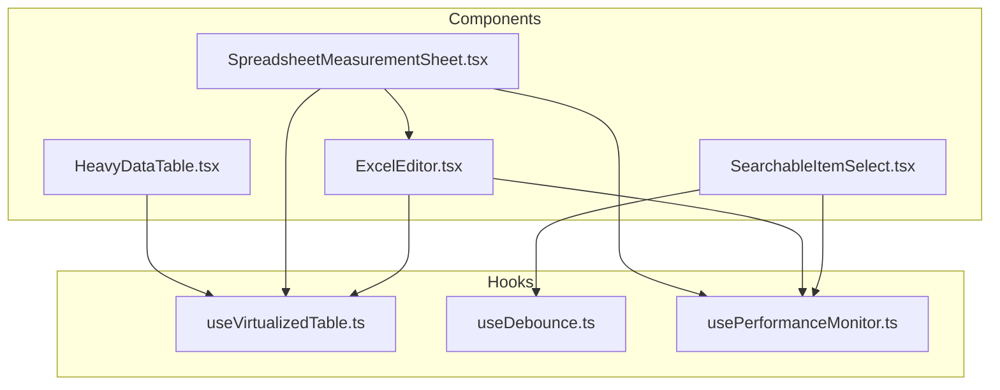
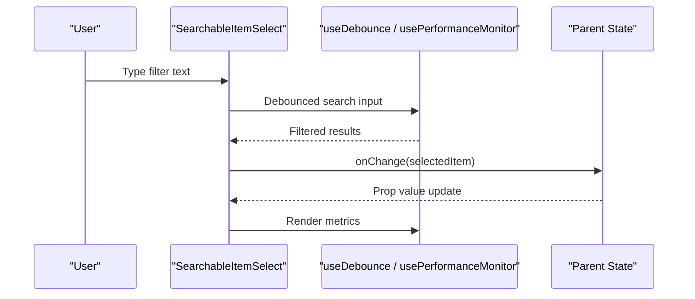
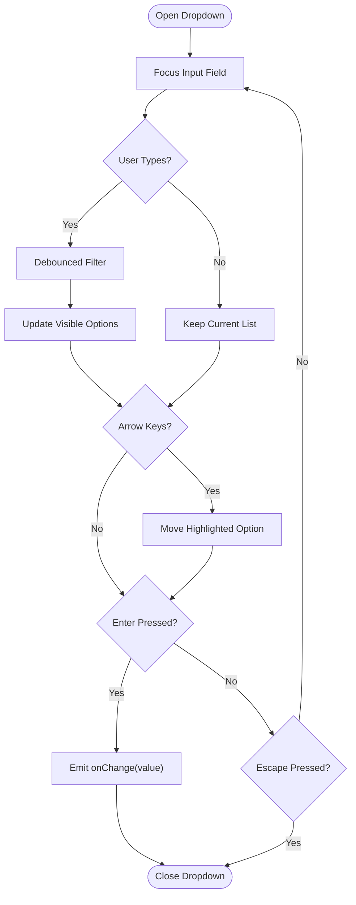
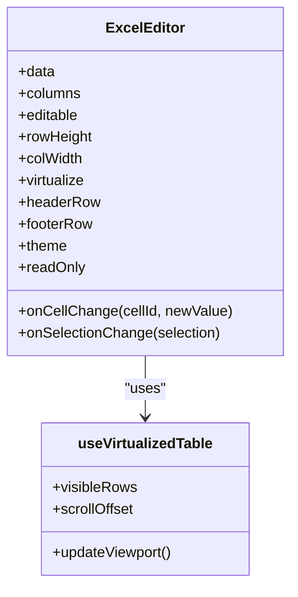
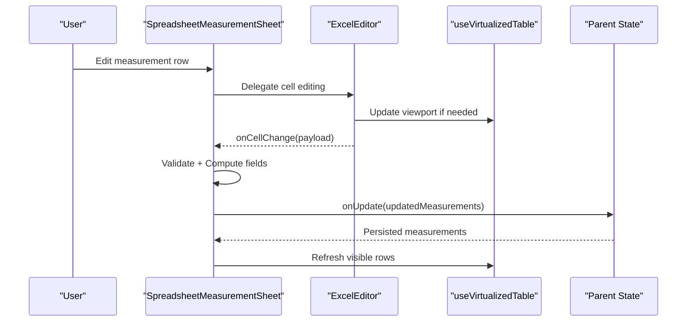
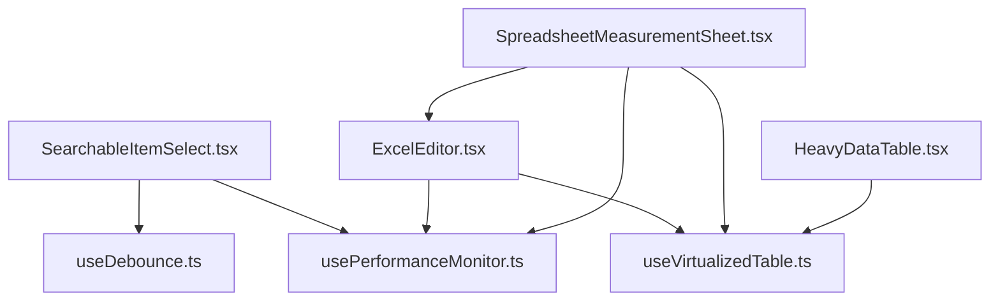

# Data Management Components

<cite>
**Referenced Files in This Document**
- [SearchableItemSelect.tsx](file://src/components/SearchableItemSelect.tsx)
- [ExcelEditor.tsx](file://src/components/ExcelEditor.tsx)
- [SpreadsheetMeasurementSheet.tsx](file://src/components/SpreadsheetMeasurementSheet.tsx)
- [useVirtualizedTable.ts](file://src/hooks/useVirtualizedTable.ts)
- [HeavyDataTable.tsx](file://src/components/HeavyDataTable.tsx)
- [useDebounce.ts](file://src/hooks/useDebounce.ts)
- [usePerformanceMonitor.ts](file://src/hooks/usePerformanceMonitor.ts)
</cite>

## Table of Contents
1. [Introduction](#introduction)
2. [Project Structure](#project-structure)
3. [Core Components](#core-components)
4. [Architecture Overview](#architecture-overview)
5. [Detailed Component Analysis](#detailed-component-analysis)
6. [Dependency Analysis](#dependency-analysis)
7. [Performance Considerations](#performance-considerations)
8. [Troubleshooting Guide](#troubleshooting-guide)
9. [Conclusion](#conclusion)

## Introduction
This document provides comprehensive documentation for three data management components: SearchableItemSelect, ExcelEditor, and SpreadsheetMeasurementSheet. It covers prop interfaces, data binding patterns, performance optimization techniques, memory management strategies, large dataset handling with virtualization, real-time synchronization considerations, keyboard navigation, accessibility features, and responsive design. The goal is to help developers implement efficient, accessible, and user-friendly data entry experiences.

## Project Structure
The components are located under src/components and rely on shared hooks for performance and interaction behaviors. Virtualization support is provided by a dedicated hook and a heavy-duty table component used as a foundation for large datasets. Debounce utilities and performance monitoring hooks complement these components to ensure smooth interactions.

**Diagram sources**
- [SearchableItemSelect.tsx](file://src/components/SearchableItemSelect.tsx)
- [ExcelEditor.tsx](file://src/components/ExcelEditor.tsx)
- [SpreadsheetMeasurementSheet.tsx](file://src/components/SpreadsheetMeasurementSheet.tsx)
- [HeavyDataTable.tsx](file://src/components/HeavyDataTable.tsx)
- [useVirtualizedTable.ts](file://src/hooks/useVirtualizedTable.ts)
- [useDebounce.ts](file://src/hooks/useDebounce.ts)
- [usePerformanceMonitor.ts](file://src/hooks/usePerformanceMonitor.ts)

**Section sources**
- [SearchableItemSelect.tsx](file://src/components/SearchableItemSelect.tsx)
- [ExcelEditor.tsx](file://src/components/ExcelEditor.tsx)
- [SpreadsheetMeasurementSheet.tsx](file://src/components/SpreadsheetMeasurementSheet.tsx)
- [HeavyDataTable.tsx](file://src/components/HeavyDataTable.tsx)
- [useVirtualizedTable.ts](file://src/hooks/useVirtualizedTable.ts)
- [useDebounce.ts](file://src/hooks/useDebounce.ts)
- [usePerformanceMonitor.ts](file://src/hooks/usePerformanceMonitor.ts)

## Core Components
- SearchableItemSelect: A searchable dropdown for selecting items from large lists. Supports filtering, keyboard navigation, and controlled/uncontrolled value patterns.
- ExcelEditor: A spreadsheet-like editor enabling cell editing, selection, and navigation. Integrates with virtualization for large grids and supports real-time updates via callbacks or state bindings.
- SpreadsheetMeasurementSheet: A measurement-focused spreadsheet sheet that binds rows/columns to measurement entities, providing validation, computed fields, and persistence integration.

Key responsibilities:
- Provide consistent prop interfaces for data binding
- Offer keyboard and accessibility features
- Support virtualization and performance optimizations
- Enable real-time synchronization through callbacks and state

**Section sources**
- [SearchableItemSelect.tsx](file://src/components/SearchableItemSelect.tsx)
- [ExcelEditor.tsx](file://src/components/ExcelEditor.tsx)
- [SpreadsheetMeasurementSheet.tsx](file://src/components/SpreadsheetMeasurementSheet.tsx)

## Architecture Overview
The components follow a layered architecture:
- UI layer: React components (SearchableItemSelect, ExcelEditor, SpreadsheetMeasurementSheet)
- Interaction layer: Keyboard handlers, focus management, selection logic
- Performance layer: Virtualization hook, debounce utilities, performance monitoring
- Data layer: Controlled props, callbacks, optional local caching

**Diagram sources**
- [SearchableItemSelect.tsx](file://src/components/SearchableItemSelect.tsx)
- [useDebounce.ts](file://src/hooks/useDebounce.ts)
- [usePerformanceMonitor.ts](file://src/hooks/usePerformanceMonitor.ts)

## Detailed Component Analysis

### SearchableItemSelect
Purpose:
- Provides an accessible, searchable item selector suitable for large option sets.

Prop interface highlights:
- value: Selected item identifier or object
- onChange: Callback invoked when selection changes
- options: Array of selectable items
- filterFn: Optional custom filter function
- placeholder: Input placeholder text
- disabled: Disables the control
- ariaLabel: Accessibility label
- renderOption: Custom renderer for each option
- maxVisibleOptions: Limits visible options for performance

Data binding patterns:
- Controlled mode: value + onChange for external state management
- Uncontrolled mode: defaultSelected + onChange for internal state

Keyboard navigation:
- Arrow keys to navigate options
- Enter to select
- Escape to close dropdown
- Tab to move focus out

Accessibility:
- ARIA roles and labels for listbox and combobox semantics
- Live region announcements for filtered results count
- Focus trapping within overlay when open

Performance considerations:
- Debounced filtering to reduce re-renders
- Virtualized option list when maxVisibleOptions is high
- Memoized option rendering via renderOption

Memory management:
- Avoid storing large objects in local state; prefer identifiers
- Clean up event listeners and timers on unmount

Large dataset handling:
- Use virtualization for long option lists
- Implement server-side filtering if needed

Real-time synchronization:
- Debounce rapid typing
- Use stable references for options to prevent unnecessary renders

Responsive design:
- Overlay positioning adapts to viewport size
- Touch-friendly sizing for mobile

**Diagram sources**
- [SearchableItemSelect.tsx](file://src/components/SearchableItemSelect.tsx)
- [useDebounce.ts](file://src/hooks/useDebounce.ts)

**Section sources**
- [SearchableItemSelect.tsx](file://src/components/SearchableItemSelect.tsx)
- [useDebounce.ts](file://src/hooks/useDebounce.ts)
- [usePerformanceMonitor.ts](file://src/hooks/usePerformanceMonitor.ts)

### ExcelEditor
Purpose:
- Delivers a spreadsheet-like editing experience with cell selection, keyboard navigation, and batch operations.

Prop interface highlights:
- data: Two-dimensional array or structured grid model
- columns: Column definitions including headers, types, validators
- editable: Boolean to enable/disable editing
- onCellChange: Callback for cell edits
- onSelectionChange: Callback for selection updates
- rowHeight, colWidth: Dimensions for layout
- virtualize: Boolean to enable virtualization
- headerRow: Boolean to show column headers
- footerRow: Boolean to show summary/footer
- theme: Styling configuration
- readOnly: Prevents editing while allowing navigation

Data binding patterns:
- Controlled data: data + onCellChange for external state
- Local draft: Internal draft buffer with commit strategy
- Batch updates: Group multiple cell changes before committing

Keyboard navigation:
- Arrow keys to move between cells
- Tab/Shift+Tab to navigate across columns
- Enter to edit, Esc to cancel
- Ctrl+A to select all, Ctrl+C/V for clipboard operations

Accessibility:
- ARIA grid role with row/cell semantics
- Announcements for current cell coordinates and content
- Focus indicators and skip links

Performance considerations:
- Virtualization for large grids using useVirtualizedTable
- Memoized cell renderers
- Debounced save operations

Memory management:
- Limit cached selections and drafts
- Release references on unmount

Large dataset handling:
- Virtualized rows and columns
- Lazy loading of off-screen cells
- Efficient diffing for updates

Real-time synchronization:
- Optimistic updates with rollback on failure
- WebSocket or polling integration via onCellChange

Responsive design:
- Adaptive column widths
- Scrollable panes for small screens

**Diagram sources**
- [ExcelEditor.tsx](file://src/components/ExcelEditor.tsx)
- [useVirtualizedTable.ts](file://src/hooks/useVirtualizedTable.ts)

**Section sources**
- [ExcelEditor.tsx](file://src/components/ExcelEditor.tsx)
- [useVirtualizedTable.ts](file://src/hooks/useVirtualizedTable.ts)
- [usePerformanceMonitor.ts](file://src/hooks/usePerformanceMonitor.ts)

### SpreadsheetMeasurementSheet
Purpose:
- Specialized spreadsheet for managing measurement data with domain-specific validations and computations.

Prop interface highlights:
- measurements: Array of measurement records
- onUpdate: Callback to persist changes
- validators: Per-field validation rules
- computedFields: Functions to compute derived values
- grouping: Row grouping options
- exportFn: Export to CSV/Excel
- importFn: Import from file
- syncStrategy: Real-time sync policy (optimistic/pessimistic)

Data binding patterns:
- Controlled measurements + onUpdate for external persistence
- Draft buffer with undo/redo stack
- Computed field pipeline for derived calculations

Keyboard navigation:
- Same as ExcelEditor with measurement-specific shortcuts
- Quick add new row via keyboard

Accessibility:
- ARIA descriptions for measurement context
- Screen reader friendly summaries

Performance considerations:
- Virtualization for large measurement tables
- Memoized computations
- Batched updates

Memory management:
- Clear undo/redo stacks on save
- Avoid deep cloning entire datasets

Large dataset handling:
- Pagination or infinite scroll for very large sheets
- Server-side computation for heavy formulas

Real-time synchronization:
- Optimistic updates with conflict resolution
- Presence awareness for collaborative editing

Responsive design:
- Collapsible sections for narrow viewports
- Touch gestures for quick actions

**Diagram sources**
- [SpreadsheetMeasurementSheet.tsx](file://src/components/SpreadsheetMeasurementSheet.tsx)
- [ExcelEditor.tsx](file://src/components/ExcelEditor.tsx)
- [useVirtualizedTable.ts](file://src/hooks/useVirtualizedTable.ts)

**Section sources**
- [SpreadsheetMeasurementSheet.tsx](file://src/components/SpreadsheetMeasurementSheet.tsx)
- [ExcelEditor.tsx](file://src/components/ExcelEditor.tsx)
- [useVirtualizedTable.ts](file://src/hooks/useVirtualizedTable.ts)
- [usePerformanceMonitor.ts](file://src/hooks/usePerformanceMonitor.ts)

## Dependency Analysis
The components depend on shared hooks and utilities to achieve performance and usability goals. HeavyDataTable can be used as a base for complex tabular data, leveraging virtualization.

**Diagram sources**
- [SearchableItemSelect.tsx](file://src/components/SearchableItemSelect.tsx)
- [ExcelEditor.tsx](file://src/components/ExcelEditor.tsx)
- [SpreadsheetMeasurementSheet.tsx](file://src/components/SpreadsheetMeasurementSheet.tsx)
- [HeavyDataTable.tsx](file://src/components/HeavyDataTable.tsx)
- [useVirtualizedTable.ts](file://src/hooks/useVirtualizedTable.ts)
- [useDebounce.ts](file://src/hooks/useDebounce.ts)
- [usePerformanceMonitor.ts](file://src/hooks/usePerformanceMonitor.ts)

**Section sources**
- [HeavyDataTable.tsx](file://src/components/HeavyDataTable.tsx)
- [useVirtualizedTable.ts](file://src/hooks/useVirtualizedTable.ts)

## Performance Considerations
- Virtualization: Use useVirtualizedTable for large grids to render only visible rows/columns.
- Debouncing: Apply debounced filtering in SearchableItemSelect to minimize re-renders.
- Memoization: Memoize expensive computations and render functions.
- Batch updates: Group multiple cell changes to reduce write overhead.
- Memory hygiene: Clear caches, undo/redo stacks, and event listeners on unmount.
- Monitoring: Integrate usePerformanceMonitor to track render times and identify bottlenecks.

[No sources needed since this section provides general guidance]

## Troubleshooting Guide
Common issues and resolutions:
- Slow rendering in large grids: Ensure virtualization is enabled and row heights are fixed or measured efficiently.
- Stale selections: Verify selection state is updated atomically and references are stable.
- Excessive re-renders: Check prop stability and avoid creating new objects/functions on each render.
- Accessibility regressions: Confirm ARIA roles and live regions are present and correctly announced.
- Memory leaks: Ensure cleanup of timers, intervals, and event listeners in useEffect.

**Section sources**
- [usePerformanceMonitor.ts](file://src/hooks/usePerformanceMonitor.ts)
- [useVirtualizedTable.ts](file://src/hooks/useVirtualizedTable.ts)

## Conclusion
These data management components provide robust, accessible, and performant solutions for item selection and spreadsheet-like editing. By leveraging virtualization, debouncing, memoization, and careful memory management, they scale well to large datasets and support real-time workflows. Adhering to the documented prop interfaces and best practices ensures maintainable and user-friendly implementations.

[No sources needed since this section summarizes without analyzing specific files]