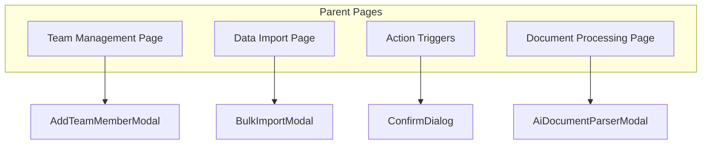
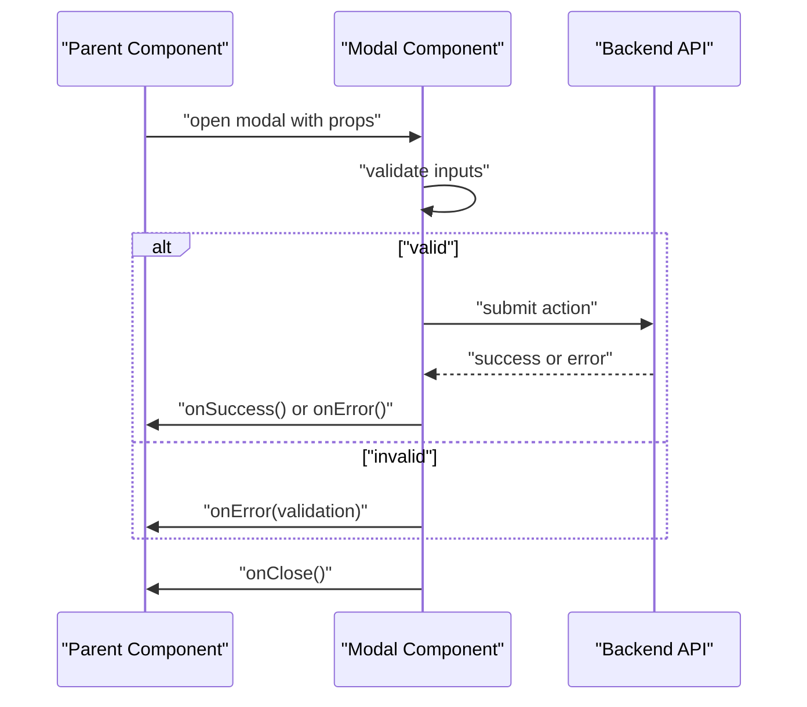
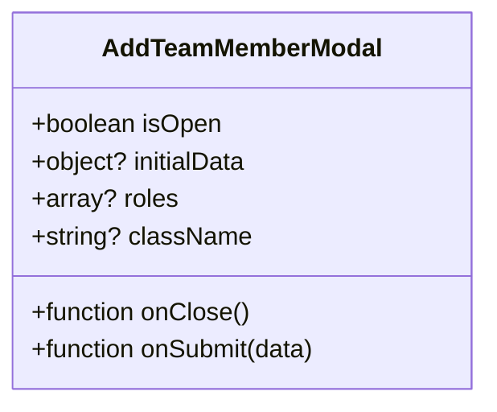
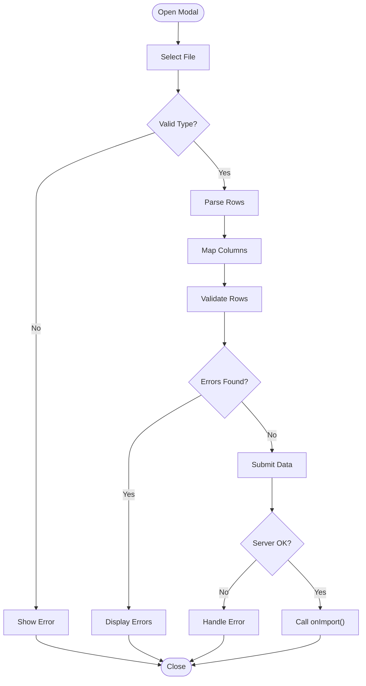
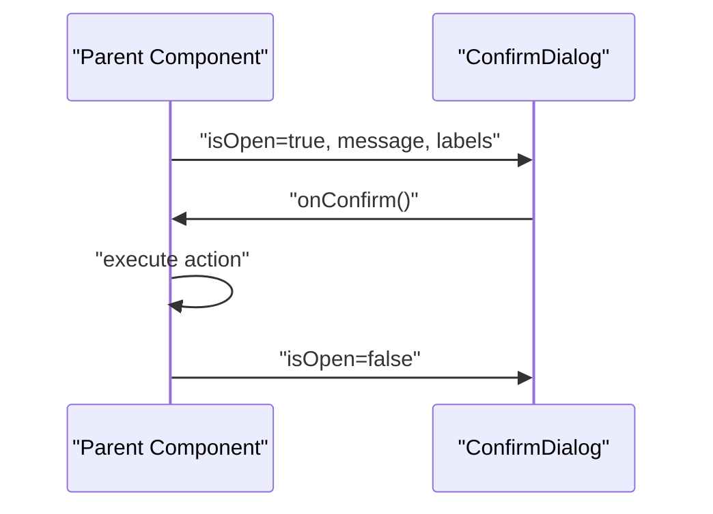
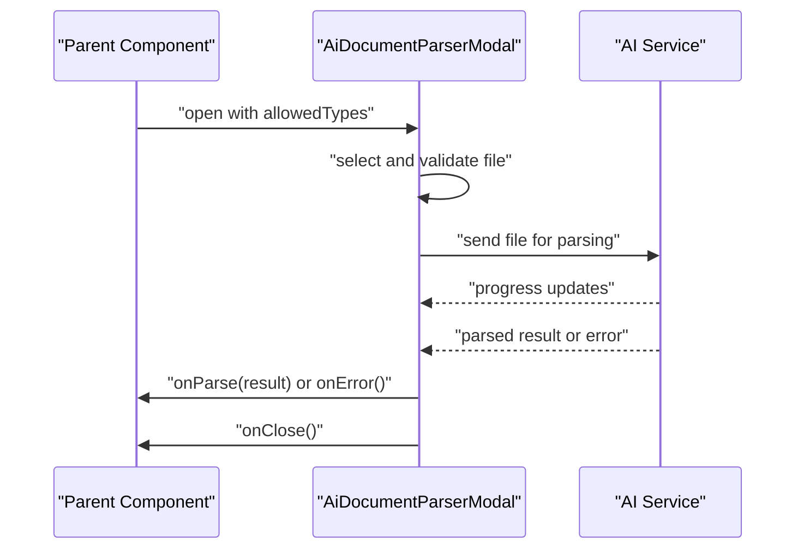
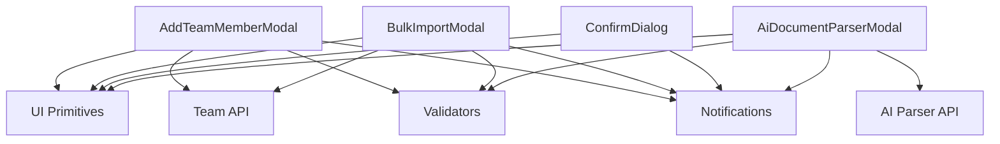

# Modal Components

<cite>
**Referenced Files in This Document**
- [AddTeamMemberModal.tsx](file://src/components/AddTeamMemberModal.tsx)
- [BulkImportModal.tsx](file://src/components/BulkImportModal.tsx)
- [ConfirmDialog.tsx](file://src/components/ConfirmDialog.tsx)
- [AiDocumentParserModal.tsx](file://src/components/AiDocumentParserModal.tsx)
</cite>

## Table of Contents
1. [Introduction](#introduction)
2. [Project Structure](#project-structure)
3. [Core Components](#core-components)
4. [Architecture Overview](#architecture-overview)
5. [Detailed Component Analysis](#detailed-component-analysis)
6. [Dependency Analysis](#dependency-analysis)
7. [Performance Considerations](#performance-considerations)
8. [Troubleshooting Guide](#troubleshooting-guide)
9. [Conclusion](#conclusion)

## Introduction
This document provides detailed documentation for four modal components used across the application:
- AddTeamMemberModal: Adds team members to a team or organization context.
- BulkImportModal: Imports data in bulk via file upload and mapping.
- ConfirmDialog: A generic confirmation dialog for destructive or important actions.
- AiDocumentParserModal: Parses documents using AI-powered processing.

The goal is to explain prop interfaces, event handlers, state management patterns, integration with parent components, common usage scenarios, customization options, accessibility considerations, error handling, loading states, and validation patterns.

## Project Structure
These modal components are located under src/components and follow a consistent pattern:
- Each component encapsulates its own local state (e.g., visibility, form fields, errors).
- Parent components control visibility and pass callbacks for success/failure.
- UI primitives and shared utilities are reused where applicable.

[No sources needed since this diagram shows conceptual workflow, not actual code structure]

## Core Components
- AddTeamMemberModal: Manages adding a new member by collecting user details, validating inputs, submitting to an API, and notifying the parent on success.
- BulkImportModal: Handles file selection, parsing, preview/mapping, validation, and submission; reports progress and errors.
- ConfirmDialog: Presents a simple yes/no confirmation with optional custom labels and icon variants.
- AiDocumentParserModal: Accepts a document, triggers AI parsing, displays results, and allows export or further actions.

Common patterns:
- Controlled visibility via props (e.g., isOpen).
- Callbacks for lifecycle events (onClose, onSuccess, onError).
- Local state for form fields, errors, and loading flags.
- Validation before submission.
- Accessible overlays with focus trapping and keyboard support.

**Section sources**
- [AddTeamMemberModal.tsx](file://src/components/AddTeamMemberModal.tsx)
- [BulkImportModal.tsx](file://src/components/BulkImportModal.tsx)
- [ConfirmDialog.tsx](file://src/components/ConfirmDialog.tsx)
- [AiDocumentParserModal.tsx](file://src/components/AiDocumentParserModal.tsx)

## Architecture Overview
Each modal follows a parent-controlled pattern:
- Parent toggles visibility and passes initial data.
- Modal manages internal state and calls back into parent on completion.
- Errors and loading states are surfaced to the parent via callbacks or props.

[No sources needed since this diagram shows conceptual workflow, not actual code structure]

## Detailed Component Analysis

### AddTeamMemberModal
Purpose:
- Collects member details and submits them to add a new team member.

Key responsibilities:
- Form field state (name, email, role, etc.).
- Input validation and inline error messages.
- Submission flow with loading indicator.
- Success/error notifications to parent.

Typical props:
- isOpen: boolean controlling visibility.
- onClose: callback to close the modal.
- onSubmit: callback invoked with validated payload on success.
- initialData?: optional pre-filled values.
- roles?: list of available roles.
- className?: additional styling.

Event handlers:
- onChange handlers update local state.
- onSubmit validates and calls parent’s onSubmit.
- onCancel/onClose resets state and closes.

State management:
- Local state for form fields, validation errors, and loading flag.
- Optional optimistic updates if supported by parent.

Integration:
- Parent controls open/close and handles side effects after success.
- Parent may refresh lists or show toast notifications.

Accessibility:
- Focus trap within modal.
- Escape key closes modal.
- Proper aria attributes for dialog and form fields.

Validation:
- Required fields, email format, duplicate checks (if provided by parent).

Error handling:
- Network errors surfaced via onError callback.
- User-friendly messages for invalid inputs.

Loading states:
- Disable submit while submitting.
- Show spinner or disabled button.

Customization:
- Custom labels, help text, and role options via props.
- Optional header/footer slots.

Common usage scenarios:
- Adding a member from a team settings page.
- Inviting a new collaborator from a project dashboard.

Example references:
- See [AddTeamMemberModal.tsx](file://src/components/AddTeamMemberModal.tsx) for implementation details.

**Section sources**
- [AddTeamMemberModal.tsx](file://src/components/AddTeamMemberModal.tsx)

#### Class-like Props Interface

**Diagram sources**
- [AddTeamMemberModal.tsx](file://src/components/AddTeamMemberModal.tsx)

### BulkImportModal
Purpose:
- Enables users to import data in bulk via file upload, mapping, validation, and submission.

Key responsibilities:
- File selection and type validation.
- Parsing and previewing rows/columns.
- Mapping columns to target fields.
- Validation and error reporting per row/column.
- Submitting parsed data to backend.

Typical props:
- isOpen: boolean controlling visibility.
- onClose: callback to close the modal.
- onImport: callback invoked with parsed data on success.
- schema?: expected column definitions and types.
- allowedTypes?: accepted file extensions.
- maxRows?: limit on rows to parse.
- className?: additional styling.

Event handlers:
- onFileChange: reads and parses file.
- onMapChange: updates column mappings.
- onValidate: runs validation rules.
- onSubmit: sends mapped data to backend.
- onCancel/onClose: resets state and closes.

State management:
- Local state for file, parsed rows, mappings, validation errors, and loading flags.
- Progress tracking for large imports.

Integration:
- Parent provides schema and receives imported records.
- Parent may trigger refresh or show summary of imported items.

Accessibility:
- Dialog semantics and focus management.
- Clear error announcements for screen readers.

Validation:
- File type and size checks.
- Row-level and cell-level validation against schema.
- Duplicate detection if required.

Error handling:
- Parse errors, network failures, and partial failure summaries.
- Downloadable error report option.

Loading states:
- Indeterminate progress during parsing and submission.
- Disabled controls while processing.

Customization:
- Custom headers, instructions, and mapping templates.
- Optional preview table configuration.

Common usage scenarios:
- Importing contacts, inventory, or financial entries.
- Bulk updating records via CSV/Excel.

Example references:
- See [BulkImportModal.tsx](file://src/components/BulkImportModal.tsx) for implementation details.

**Section sources**
- [BulkImportModal.tsx](file://src/components/BulkImportModal.tsx)

#### Flowchart: Import Pipeline

**Diagram sources**
- [BulkImportModal.tsx](file://src/components/BulkImportModal.tsx)

### ConfirmDialog
Purpose:
- Presents a simple confirmation prompt for destructive or important actions.

Key responsibilities:
- Display message and confirm/cancel actions.
- Support custom labels and optional icon variant.

Typical props:
- isOpen: boolean controlling visibility.
- onClose: callback to close without action.
- onConfirm: callback invoked when confirmed.
- title?: heading text.
- message?: body text.
- confirmLabel?: text for confirm button.
- cancelLabel?: text for cancel button.
- variant?: visual style (e.g., danger).
- className?: additional styling.

Event handlers:
- onConfirm: executes destructive action.
- onCancel/onClose: dismisses dialog.
- onKeyDown: supports Escape to cancel.

State management:
- Minimal local state; primarily controlled by props.

Integration:
- Parent toggles visibility and performs action on confirm.
- Often used for delete, archive, or reset operations.

Accessibility:
- Dialog role and focus management.
- Keyboard navigation and announcements.

Validation:
- None; purely a confirmation gate.

Error handling:
- Delegates to parent’s action handler.

Loading states:
- Typically none; parent can disable confirm while action is in flight.

Customization:
- Custom labels, message formatting, and variant styles.

Common usage scenarios:
- Deleting a record.
- Archiving a project.
- Resetting filters or settings.

Example references:
- See [ConfirmDialog.tsx](file://src/components/ConfirmDialog.tsx) for implementation details.

**Section sources**
- [ConfirmDialog.tsx](file://src/components/ConfirmDialog.tsx)

#### Sequence: Confirmation Flow

**Diagram sources**
- [ConfirmDialog.tsx](file://src/components/ConfirmDialog.tsx)

### AiDocumentParserModal
Purpose:
- Accepts a document and uses AI-powered parsing to extract structured information.

Key responsibilities:
- File selection and validation.
- Triggering AI parsing job.
- Displaying progress and results.
- Allowing export or further actions on parsed content.

Typical props:
- isOpen: boolean controlling visibility.
- onClose: callback to close the modal.
- onParse: callback invoked with parsed result on success.
- allowedTypes?: accepted file formats.
- maxFileSize?: size limit.
- className?: additional styling.

Event handlers:
- onFileChange: validates and prepares file for parsing.
- onParseStart: begins parsing process.
- onParseSuccess: forwards result to parent.
- onParseError: surfaces errors to parent.
- onCancel/onClose: aborts or closes.

State management:
- Local state for selected file, parsing status, progress, and errors.
- Result cache for display and export.

Integration:
- Parent provides parsing endpoint or delegates to service.
- Parent may store results or navigate to detail view.

Accessibility:
- Dialog semantics and live regions for progress updates.
- Clear error messaging.

Validation:
- File type and size constraints.
- Content readiness checks before parsing.

Error handling:
- Network timeouts, unsupported formats, and server errors.
- Retry option if appropriate.

Loading states:
- Indeterminate progress during parsing.
- Disabled controls while processing.

Customization:
- Custom headers, instructions, and result rendering options.
- Export formats (JSON, CSV, PDF).

Common usage scenarios:
- Extracting invoice details from uploaded PDFs.
- Parsing contracts to populate forms.

Example references:
- See [AiDocumentParserModal.tsx](file://src/components/AiDocumentParserModal.tsx) for implementation details.

**Section sources**
- [AiDocumentParserModal.tsx](file://src/components/AiDocumentParserModal.tsx)

#### Sequence: AI Parsing Flow

**Diagram sources**
- [AiDocumentParserModal.tsx](file://src/components/AiDocumentParserModal.tsx)

## Dependency Analysis
- Shared UI primitives: These modals likely reuse base overlay/dialog components and form controls.
- Validation utilities: Reusable validators for emails, file types, and schema-based checks.
- API clients: Backend endpoints for adding members, importing data, and AI parsing.
- Toast/notification services: For success and error feedback.

[No sources needed since this diagram shows conceptual dependencies, not actual code structure]

## Performance Considerations
- Debounce heavy operations (e.g., large file parsing) to avoid blocking UI.
- Stream or chunk uploads for large files.
- Lazy-load modal content when possible.
- Avoid unnecessary re-renders by memoizing callbacks and stable props.
- Use pagination or virtualization for large previews in import workflows.

[No sources needed since this section provides general guidance]

## Troubleshooting Guide
Common issues and resolutions:
- Modal does not close: Ensure parent sets isOpen correctly and onClose is wired.
- Validation errors not shown: Verify error state binding and that messages are rendered.
- Import fails silently: Check network requests and ensure onError is handled.
- AI parsing times out: Implement retry logic and inform users of progress.
- Accessibility problems: Confirm dialog roles, focus trapping, and keyboard support.

**Section sources**
- [AddTeamMemberModal.tsx](file://src/components/AddTeamMemberModal.tsx)
- [BulkImportModal.tsx](file://src/components/BulkImportModal.tsx)
- [ConfirmDialog.tsx](file://src/components/ConfirmDialog.tsx)
- [AiDocumentParserModal.tsx](file://src/components/AiDocumentParserModal.tsx)

## Conclusion
These modal components provide consistent, accessible, and extensible patterns for common workflows:
- AddTeamMemberModal streamlines team management.
- BulkImportModal simplifies complex data imports with robust validation and mapping.
- ConfirmDialog offers safe execution of critical actions.
- AiDocumentParserModal integrates AI-powered parsing with clear UX.

Adopting these patterns ensures predictable behavior, better error handling, and improved user experience across the application.