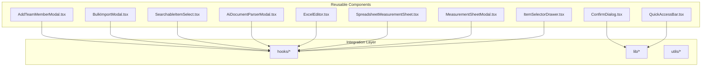
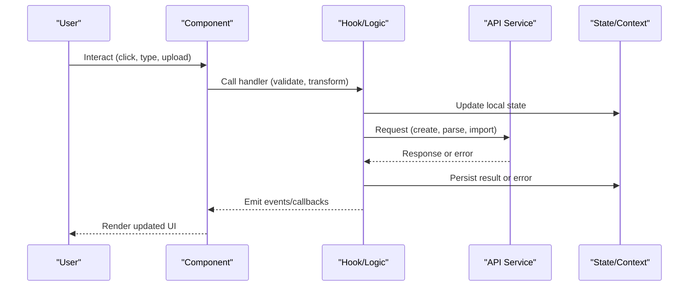
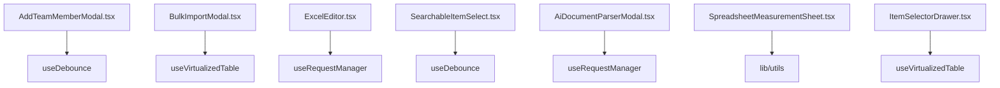

# Reusable Business Components

<cite>
**Referenced Files in This Document**
- [AddTeamMemberModal.tsx](file://src/components/AddTeamMemberModal.tsx)
- [BulkImportModal.tsx](file://src/components/BulkImportModal.tsx)
- [ConfirmDialog.tsx](file://src/components/ConfirmDialog.tsx)
- [QuickAccessBar.tsx](file://src/components/QuickAccessBar.tsx)
- [SearchableItemSelect.tsx](file://src/components/SearchableItemSelect.tsx)
- [AiDocumentParserModal.tsx](file://src/components/AiDocumentParserModal.tsx)
- [ExcelEditor.tsx](file://src/components/ExcelEditor.tsx)
- [SpreadsheetMeasurementSheet.tsx](file://src/components/SpreadsheetMeasurementSheet.tsx)
- [MeasurementSheetModal.tsx](file://src/components/MeasurementSheetModal.tsx)
- [ItemSelectorDrawer.tsx](file://src/components/ItemSelectorDrawer.tsx)
</cite>

## Table of Contents
1. [Introduction](#introduction)
2. [Project Structure](#project-structure)
3. [Core Components](#core-components)
4. [Architecture Overview](#architecture-overview)
5. [Detailed Component Analysis](#detailed-component-analysis)
6. [Dependency Analysis](#dependency-analysis)
7. [Performance Considerations](#performance-considerations)
8. [Troubleshooting Guide](#troubleshooting-guide)
9. [Conclusion](#conclusion)

## Introduction
This document provides comprehensive documentation for reusable business logic components used across the application. It focuses on team member modals, bulk import tools, confirmation dialogs, quick access bars, searchable item selectors, AI document parsers, Excel editors, and spreadsheet measurement sheets. For each component, we describe prop interfaces, event handlers, integration patterns, state management, data validation, error handling, performance considerations, and memory management strategies. The goal is to enable consistent usage and customization while maintaining high performance and reliability.

## Project Structure
The reusable components are located under src/components. They follow a feature-oriented organization with clear separation between UI primitives and domain-specific logic. Many components integrate with hooks and utilities for data fetching, validation, and performance optimization.

[No sources needed since this diagram shows conceptual structure]

## Core Components
This section summarizes the purpose and typical usage of each core component:

- AddTeamMemberModal: Adds new members to a team with role assignment and validation.
- BulkImportModal: Imports large datasets from files (e.g., CSV/Excel), validates rows, and reports errors.
- ConfirmDialog: Generic confirmation dialog for destructive or important actions.
- QuickAccessBar: Provides fast navigation shortcuts and frequently used actions.
- SearchableItemSelect: Typeahead/select component with search, filtering, and selection callbacks.
- AiDocumentParserModal: Uploads documents to an AI parser endpoint and displays parsed results.
- ExcelEditor: In-browser editor for spreadsheets with cell editing, formulas support, and export.
- SpreadsheetMeasurementSheet: Measurement sheet built on spreadsheet capabilities with row/column semantics.
- MeasurementSheetModal: Modal wrapper around measurement sheet creation/editing workflows.
- ItemSelectorDrawer: Drawer-based selector for items with search, pagination, and multi-select.

Common integration points include:
- State management via React state, context, or hooks.
- Data fetching via API calls or query clients.
- Validation using schema libraries or custom validators.
- Error handling with user-friendly feedback and retry options.

[No sources needed since this section provides general guidance]

## Architecture Overview
The components follow a layered architecture:
- Presentation layer: UI components that render forms, tables, drawers, and modals.
- Logic layer: Hooks and utilities encapsulating business rules, validation, and side effects.
- Integration layer: API clients and external services (AI parsing, file processing).

[No sources needed since this diagram shows conceptual workflow]

## Detailed Component Analysis

### Team Member Modal (AddTeamMemberModal)
Purpose:
- Invite or add team members with role and permission configuration.
- Validate inputs and handle success/error states.

Key props:
- isOpen: boolean controlling visibility.
- onClose: function to dismiss modal.
- onSubmit: callback receiving validated member data.
- roles: array of available roles.
- initialData: optional pre-filled data for edit flows.

Event handlers:
- onOpenChange: toggles modal visibility.
- onRoleChange: updates selected role.
- onEmailChange: handles email input changes.

State management:
- Local form state for fields.
- Validation state for errors.
- Loading state during submission.

Validation:
- Email format checks.
- Required field checks.
- Duplicate member detection.

Error handling:
- Network errors surfaced to user.
- Retry option for failed submissions.

Performance:
- Debounced validation for long-running checks.
- Memoized role lists.

Customization:
- Custom role list.
- Additional fields via extendable props.

Usage example:
- Open modal from a “Add Member” button.
- On submit, call onSubmit with payload.
- Close modal on success or cancel.

**Section sources**
- [AddTeamMemberModal.tsx](file://src/components/AddTeamMemberModal.tsx)

### Bulk Import Tool (BulkImportModal)
Purpose:
- Import large datasets from files.
- Validate rows and report per-row errors.
- Provide progress feedback and summary.

Key props:
- isOpen: boolean controlling visibility.
- onClose: function to dismiss modal.
- onImport: callback receiving processed data.
- templateUrl: optional URL to download import template.
- allowedFormats: array of supported file types.

Event handlers:
- onFileSelect: handles file selection and preview.
- onValidate: triggers validation and returns errors.
- onConfirm: submits import job.

State management:
- File buffer and preview table.
- Row-level validation errors.
- Progress tracking and completion status.

Validation:
- Schema-based row validation.
- Type coercion and normalization.
- Duplicate and constraint checks.

Error handling:
- Per-row error mapping.
- Aggregate error summary.
- Partial success reporting.

Performance:
- Chunked processing for large files.
- Web Workers for CPU-heavy tasks (if applicable).
- Virtualized preview table.

Memory management:
- Release file buffers after processing.
- Clear previews on close.

Customization:
- Custom validators.
- Column mapping configuration.
- Success/failure templates.

Usage example:
- Select file, preview rows, validate, then confirm import.
- Handle partial failures by downloading error report.

**Section sources**
- [BulkImportModal.tsx](file://src/components/BulkImportModal.tsx)

### Confirmation Dialog (ConfirmDialog)
Purpose:
- Present a simple confirmation prompt for destructive or important actions.

Key props:
- isOpen: boolean controlling visibility.
- title: string for dialog title.
- message: string for confirmation text.
- confirmLabel: string for confirm button label.
- cancelLabel: string for cancel button label.
- variant: optional style variant (danger, warning, info).

Event handlers:
- onConfirm: called when user confirms.
- onCancel: called when user cancels or closes.

State management:
- Minimal internal state; controlled by isOpen.

Validation:
- None required; purely presentational.

Error handling:
- Safe dismissal on outside clicks and Escape key.

Performance:
- Lightweight; no heavy computations.

Customization:
- Custom action buttons via slot props.
- Icon customization.

Usage example:
- Trigger on delete action.
- Show danger variant for destructive operations.

**Section sources**
- [ConfirmDialog.tsx](file://src/components/ConfirmDialog.tsx)

### Quick Access Bar (QuickAccessBar)
Purpose:
- Provide quick navigation and frequent actions at the top or sidebar.

Key props:
- items: array of quick actions with labels, icons, and onClick handlers.
- layout: horizontal or vertical arrangement.
- maxVisible: number of visible items before overflow menu.

Event handlers:
- onActionClick: invoked when an action is clicked.
- onMoreToggle: toggles overflow menu.

State management:
- Local state for active menu and hovered items.

Validation:
- Ensure unique keys for items.

Error handling:
- Graceful fallback if icon or label missing.

Performance:
- Memoize items list.
- Lazy load icons.

Customization:
- Custom icon renderer.
- Tooltip behavior.

Usage example:
- Define actions like “New Project”, “View Reports”.
- Clicking an action navigates or opens a modal.

**Section sources**
- [QuickAccessBar.tsx](file://src/components/QuickAccessBar.tsx)

### Searchable Item Selector (SearchableItemSelect)
Purpose:
- Typeahead select with search, filtering, and selection callbacks.

Key props:
- options: array of selectable items.
- value: selected item(s).
- onChange: callback with new selection.
- placeholder: string for empty state.
- filterFn: custom filter function.
- multiple: boolean for multi-select.
- loading: boolean for async loading.
- pageSize: number for virtualized pagination.

Event handlers:
- onSearchChange: triggered on input change.
- onSelect: invoked when an item is selected.
- onDeselect: invoked when an item is deselected (multi-select).

State management:
- Local search term.
- Filtered options cache.
- Pagination state.

Validation:
- Ensure options have stable identifiers.

Error handling:
- Display network errors during async fetch.
- Empty state messaging.

Performance:
- Debounced search input.
- Virtualized list for large option sets.
- Memoized filtered results.

Customization:
- Custom item renderer.
- Highlight matched text.

Usage example:
- Use in forms to pick an item from a large catalog.
- Support multi-select for tags or categories.

**Section sources**
- [SearchableItemSelect.tsx](file://src/components/SearchableItemSelect.tsx)

### AI Document Parser Modal (AiDocumentParserModal)
Purpose:
- Upload documents to an AI parser service and display structured results.

Key props:
- isOpen: boolean controlling visibility.
- onClose: function to dismiss modal.
- onParseSuccess: callback with parsed data.
- allowedTypes: array of accepted MIME types.
- maxSize: number for maximum file size.

Event handlers:
- onFileSelect: handles file selection and validation.
- onParse: initiates parsing request.
- onRetry: retries failed parse attempts.

State management:
- Upload progress.
- Parsing status.
- Parsed content preview.

Validation:
- File type and size checks.
- Content length limits.

Error handling:
- Network timeouts and retries.
- Parse failure messages.

Performance:
- Stream uploads for large files.
- Abort controller for cancellations.

Customization:
- Custom parser endpoints.
- Result rendering templates.

Usage example:
- Drag-and-drop PDF or DOCX.
- View extracted sections and metadata.

**Section sources**
- [AiDocumentParserModal.tsx](file://src/components/AiDocumentParserModal.tsx)

### Excel Editor (ExcelEditor)
Purpose:
- In-browser spreadsheet editor with cell editing, formulas, and export.

Key props:
- data: two-dimensional array or object map representing cells.
- onChange: callback with updated data.
- readOnly: boolean to disable editing.
- showGrid: boolean to toggle grid lines.
- formulaEngine: optional custom formula evaluator.
- exportFormat: supported formats (CSV, JSON).

Event handlers:
- onCellEdit: invoked on cell change.
- onRangeSelect: invoked when range is selected.
- onExport: triggered when exporting.

State management:
- Cell values and metadata.
- Undo/redo stack.
- Selection state.

Validation:
- Formula syntax validation.
- Circular reference detection.

Error handling:
- Invalid formula errors.
- Export failure notifications.

Performance:
- Virtualized rendering for large sheets.
- Incremental recalculation.
- Batch updates for bulk edits.

Memory management:
- Limit undo/redo history.
- Dispose resources on unmount.

Customization:
- Conditional formatting rules.
- Custom cell renderers.

Usage example:
- Edit pricing tables and export to CSV.
- Integrate with backend sync.

**Section sources**
- [ExcelEditor.tsx](file://src/components/ExcelEditor.tsx)

### Spreadsheet Measurement Sheet (SpreadsheetMeasurementSheet)
Purpose:
- Specialized spreadsheet view for measurement entries with domain-specific columns and calculations.

Key props:
- measurements: array of measurement records.
- onUpdate: callback with updated measurements.
- unitSystem: default units (metric/imperial).
- autoCalculate: boolean to enable automatic totals.
- readonly: boolean to lock editing.

Event handlers:
- onMeasureUpdate: invoked when a measurement changes.
- onTotalRecalculate: triggered after recalculation.
- onSave: persists changes.

State management:
- Local measurement cache.
- Calculation results.
- Change tracking.

Validation:
- Numeric constraints.
- Unit conversion consistency.

Error handling:
- Invalid numeric inputs.
- Calculation overflow warnings.

Performance:
- Efficient recalculation engine.
- Lazy evaluation for derived fields.

Customization:
- Custom column definitions.
- Domain-specific formulas.

Usage example:
- Track site measurements and compute totals automatically.

**Section sources**
- [SpreadsheetMeasurementSheet.tsx](file://src/components/SpreadsheetMeasurementSheet.tsx)

### Measurement Sheet Modal (MeasurementSheetModal)
Purpose:
- Modal wrapper orchestrating creation and editing of measurement sheets.

Key props:
- isOpen: boolean controlling visibility.
- onClose: function to dismiss modal.
- initialData: optional existing sheet data.
- onSave: callback with final sheet data.
- validators: array of validation functions.

Event handlers:
- onOpenChange: toggles modal visibility.
- onValidate: runs validations before save.
- onPreview: generates preview of sheet.

State management:
- Form state for sheet header and settings.
- Validation errors.
- Loading states for save operations.

Validation:
- Required fields and ranges.
- Cross-field constraints.

Error handling:
- Save failures with retry.
- Validation error summaries.

Performance:
- Debounced autosave drafts.
- Optimistic updates with rollback.

Customization:
- Custom header fields.
- Template presets.

Usage example:
- Create new measurement sheet, fill details, and save.

**Section sources**
- [MeasurementSheetModal.tsx](file://src/components/MeasurementSheetModal.tsx)

### Item Selector Drawer (ItemSelectorDrawer)
Purpose:
- Drawer-based interface for selecting items with search, filters, and pagination.

Key props:
- isOpen: boolean controlling visibility.
- onClose: function to dismiss drawer.
- onSelect: callback with selected item(s).
- searchQuery: controlled search term.
- filters: object with filter criteria.
- pageSize: number for pagination.
- loading: boolean for async loading.

Event handlers:
- onSearchChange: updates search term.
- onFilterChange: updates filter criteria.
- onPageChange: navigates pages.
- onItemSelect: selects an item.

State management:
- Local search and filter state.
- Selected items set.
- Pagination state.

Validation:
- Ensure stable item IDs.

Error handling:
- Network errors during fetch.
- Empty results messaging.

Performance:
- Infinite scroll or pagination.
- Debounced search.
- Memoized filtered lists.

Customization:
- Custom item renderer.
- Multi-select mode.

Usage example:
- Open drawer, search items, select multiple, and confirm.

**Section sources**
- [ItemSelectorDrawer.tsx](file://src/components/ItemSelectorDrawer.tsx)

## Dependency Analysis
Components depend on hooks and utilities for data fetching, validation, and performance. Common dependencies include:
- useDebounce: reduces input churn.
- useVirtualizedTable: renders large datasets efficiently.
- useRequestManager: manages API requests and caching.
- lib/utils: shared helpers for formatting and validation.

[No sources needed since this diagram shows conceptual relationships]

**Section sources**
- [ExcelEditor.tsx](file://src/components/ExcelEditor.tsx)
- [SpreadsheetMeasurementSheet.tsx](file://src/components/SpreadsheetMeasurementSheet.tsx)

## Performance Considerations
- Debounce user inputs to reduce re-renders and API calls.
- Use virtualization for large lists and tables.
- Implement chunked processing for bulk imports and parsing.
- Employ memoization for expensive computations and filtered lists.
- Limit undo/redo history and dispose resources on unmount.
- Use abort controllers to cancel in-flight requests.
- Prefer incremental recalculation over full recomputation.

[No sources needed since this section provides general guidance]

## Troubleshooting Guide
Common issues and resolutions:
- Validation errors not displayed: ensure error state is bound to UI controls.
- Large file import stalls: verify chunked processing and memory cleanup.
- AI parse failures: check network timeouts and retry logic.
- Spreadsheet performance degradation: enable virtualization and batch updates.
- Selection state inconsistencies: stabilize item IDs and avoid mutating arrays.

**Section sources**
- [BulkImportModal.tsx](file://src/components/BulkImportModal.tsx)
- [AiDocumentParserModal.tsx](file://src/components/AiDocumentParserModal.tsx)
- [ExcelEditor.tsx](file://src/components/ExcelEditor.tsx)

## Conclusion
These reusable business components provide robust, customizable building blocks for common workflows. By following the documented prop interfaces, event handlers, and integration patterns, teams can implement consistent experiences while optimizing for performance and maintainability. Adopting the recommended state management, validation, and error handling practices ensures reliability and scalability across the application.