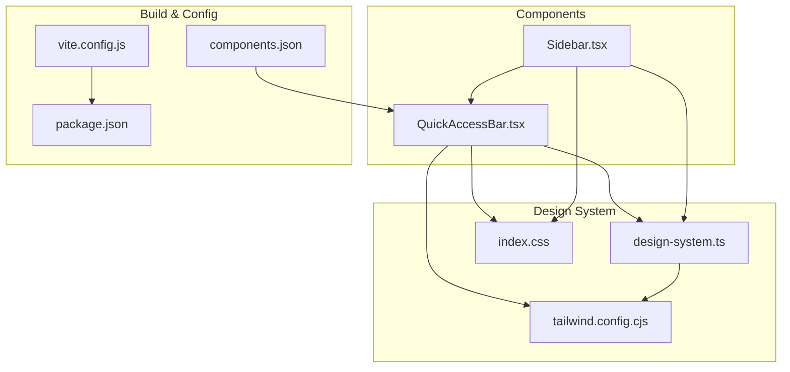
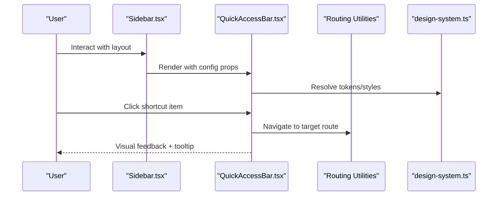
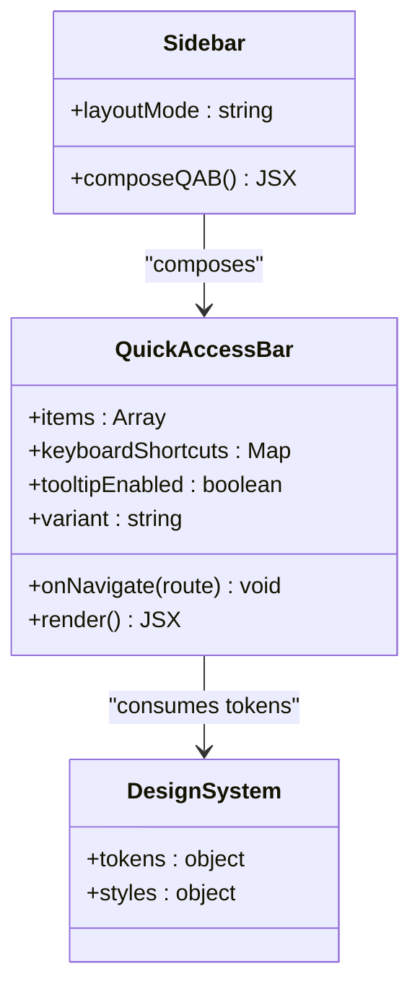
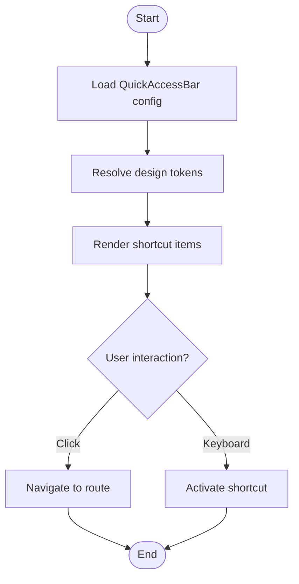
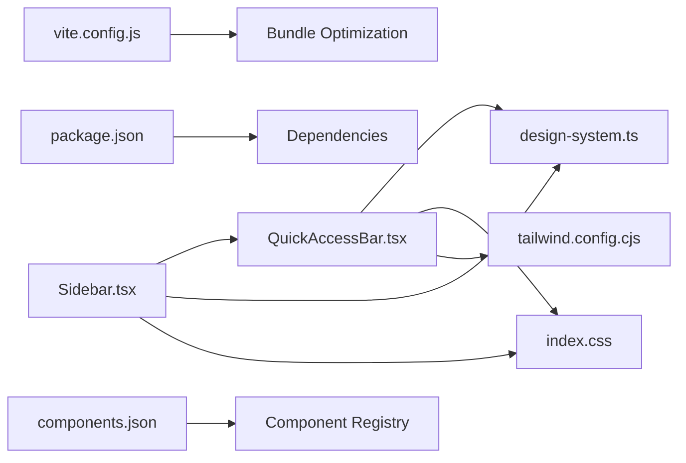

# Utility Components

<cite>
**Referenced Files in This Document**
- [QuickAccessBar.tsx](file://src/components/QuickAccessBar.tsx)
- [Sidebar.tsx](file://src/components/Sidebar.tsx)
- [design-system.ts](file://src/design-system.ts)
- [index.css](file://src/index.css)
- [tailwind.config.cjs](file://tailwind.config.cjs)
- [components.json](file://components.json)
- [package.json](file://package.json)
- [vite.config.js](file://vite.config.js)
</cite>

## Table of Contents
1. [Introduction](#introduction)
2. [Project Structure](#project-structure)
3. [Core Components](#core-components)
4. [Architecture Overview](#architecture-overview)
5. [Detailed Component Analysis](#detailed-component-analysis)
6. [Dependency Analysis](#dependency-analysis)
7. [Performance Considerations](#performance-considerations)
8. [Troubleshooting Guide](#troubleshooting-guide)
9. [Conclusion](#conclusion)
10. [Appendices](#appendices)

## Introduction
This document provides detailed documentation for utility components that provide common functionality across the application, with a focus on QuickAccessBar for navigation shortcuts and shared UI patterns. It covers component composition patterns, configuration options, styling customization, extending base components, creating themed variants, and integrating with the design system. It also includes performance considerations, bundle optimization, and lazy loading strategies for utility components.

## Project Structure
Utility components are primarily located under src/components. The QuickAccessBar is implemented as a standalone component and can be composed into layout shells such as Sidebar. Shared design tokens and styles are centralized in src/design-system.ts and src/index.css, while Tailwind configuration lives at tailwind.config.cjs. Build-time bundling and code-splitting behavior are influenced by vite.config.js and package.json.

**Diagram sources**
- [QuickAccessBar.tsx](file://src/components/QuickAccessBar.tsx)
- [Sidebar.tsx](file://src/components/Sidebar.tsx)
- [design-system.ts](file://src/design-system.ts)
- [index.css](file://src/index.css)
- [tailwind.config.cjs](file://tailwind.config.cjs)
- [components.json](file://components.json)
- [package.json](file://package.json)
- [vite.config.js](file://vite.config.js)

**Section sources**
- [QuickAccessBar.tsx](file://src/components/QuickAccessBar.tsx)
- [Sidebar.tsx](file://src/components/Sidebar.tsx)
- [design-system.ts](file://src/design-system.ts)
- [index.css](file://src/index.css)
- [tailwind.config.cjs](file://tailwind.config.cjs)
- [components.json](file://components.json)
- [package.json](file://package.json)
- [vite.config.js](file://vite.config.js)

## Core Components
- QuickAccessBar: A compact navigation bar providing quick access to frequently used actions or routes. It supports configurable items, keyboard shortcuts, tooltips, and theming via design tokens.
- Sidebar: Layout shell that composes QuickAccessBar alongside other navigation elements. It demonstrates composition patterns and responsive behavior.

Key responsibilities:
- QuickAccessBar: Rendering shortcut items, handling interactions (click, hover, keyboard), applying theme-aware styles, and delegating navigation.
- Sidebar: Orchestrating layout, composing QuickAccessBar, and managing global state like active route context.

**Section sources**
- [QuickAccessBar.tsx](file://src/components/QuickAccessBar.tsx)
- [Sidebar.tsx](file://src/components/Sidebar.tsx)

## Architecture Overview
The utility layer follows a composition-first approach:
- QuickAccessBar is a presentational component that consumes design tokens and optional routing utilities.
- Sidebar composes QuickAccessBar within a larger layout, passing configuration props and contextual data.
- Design tokens and Tailwind classes centralize visual consistency.

**Diagram sources**
- [Sidebar.tsx](file://src/components/Sidebar.tsx)
- [QuickAccessBar.tsx](file://src/components/QuickAccessBar.tsx)
- [design-system.ts](file://src/design-system.ts)

## Detailed Component Analysis

### QuickAccessBar
Purpose:
- Provide a consistent, accessible, and themeable set of navigation shortcuts.
- Support configuration-driven items and optional keyboard shortcuts.

Composition patterns:
- Props-driven configuration for items (label, icon, route/action, accessibility attributes).
- Optional slot-based content for custom actions or badges.
- Delegates navigation to routing utilities rather than implementing router-specific logic.

Configuration options:
- Items array: each item defines label, icon reference, destination, and optional metadata (e.g., badge count).
- Keyboard shortcuts: map keys to specific items for quick activation.
- Tooltip behavior: enable/disable and customize delay.
- Theming: consume tokens from design-system.ts for colors, spacing, typography, and elevation.

Styling customization:
- Use Tailwind utility classes for layout and spacing.
- Override default appearance via CSS variables exposed by design-system.ts.
- Apply variant classes for different contexts (compact, expanded, floating).

Accessibility:
- Semantic button elements with aria-labels and roles.
- Focus management and visible focus indicators.
- Keyboard support for activation and navigation.

Error handling:
- Graceful fallback when an item’s action is undefined.
- Safe rendering when icons or labels are missing.

Performance considerations:
- Memoize computed lists and avoid unnecessary re-renders.
- Lazy-load heavy icons if needed.
- Debounce rapid clicks to prevent duplicate navigations.

Extending base components:
- Create themed variants by wrapping QuickAccessBar with higher-order components that inject token overrides.
- Compose with reusable primitives (Button, Tooltip) for consistent UX.

Integration with design system:
- Import tokens and style helpers from design-system.ts.
- Align with Tailwind configuration for consistent spacing and color scales.

**Diagram sources**
- [QuickAccessBar.tsx](file://src/components/QuickAccessBar.tsx)
- [Sidebar.tsx](file://src/components/Sidebar.tsx)
- [design-system.ts](file://src/design-system.ts)

**Section sources**
- [QuickAccessBar.tsx](file://src/components/QuickAccessBar.tsx)
- [design-system.ts](file://src/design-system.ts)

### Sidebar
Purpose:
- Provide a layout container that composes QuickAccessBar and other navigation elements.
- Manage responsive behavior and active route highlighting.

Composition patterns:
- Accepts children and slots for dynamic sections.
- Passes configuration to QuickAccessBar based on current module or user permissions.

Theming and styling:
- Uses design tokens for background, borders, and typography.
- Applies Tailwind utilities for responsive breakpoints and transitions.

Performance considerations:
- Avoid re-rendering entire sidebar on minor updates; memoize sections.
- Lazy-load non-critical navigation groups.

**Section sources**
- [Sidebar.tsx](file://src/components/Sidebar.tsx)

### Conceptual Overview
The utility layer emphasizes small, focused components that compose into larger layouts. QuickAccessBar exemplifies this pattern by being configuration-driven, theme-aware, and accessible. Sidebar demonstrates how to orchestrate multiple utilities within a cohesive interface.

[No sources needed since this diagram shows conceptual workflow, not actual code structure]

## Dependency Analysis
- QuickAccessBar depends on:
  - design-system.ts for tokens and style helpers.
  - index.css for global styles and CSS variables.
  - Tailwind utilities defined in tailwind.config.cjs.
- Sidebar depends on:
  - QuickAccessBar for shortcut rendering.
  - design-system.ts and index.css for consistent styling.
- Build-time dependencies:
  - vite.config.js influences code splitting and asset handling.
  - package.json declares runtime and dev dependencies.
  - components.json may define registry entries for component discovery.

**Diagram sources**
- [QuickAccessBar.tsx](file://src/components/QuickAccessBar.tsx)
- [Sidebar.tsx](file://src/components/Sidebar.tsx)
- [design-system.ts](file://src/design-system.ts)
- [index.css](file://src/index.css)
- [tailwind.config.cjs](file://tailwind.config.cjs)
- [vite.config.js](file://vite.config.js)
- [package.json](file://package.json)
- [components.json](file://components.json)

**Section sources**
- [QuickAccessBar.tsx](file://src/components/QuickAccessBar.tsx)
- [Sidebar.tsx](file://src/components/Sidebar.tsx)
- [design-system.ts](file://src/design-system.ts)
- [index.css](file://src/index.css)
- [tailwind.config.cjs](file://tailwind.config.cjs)
- [vite.config.js](file://vite.config.js)
- [package.json](file://package.json)
- [components.json](file://components.json)

## Performance Considerations
- Code splitting:
  - Use dynamic imports for heavy icons or non-critical shortcut groups to reduce initial bundle size.
  - Configure lazy loading in vite.config.js for large assets.
- Memoization:
  - Memoize computed shortcut lists and derived props to minimize re-renders.
- Asset optimization:
  - Prefer SVG icons and inline critical ones; lazy-load others.
  - Leverage Tailwind’s purge strategy to remove unused styles.
- Bundle analysis:
  - Monitor bundle growth using build tools and analyze dependencies in package.json.
- Interaction efficiency:
  - Debounce click handlers and navigation calls to prevent redundant work.

[No sources needed since this section provides general guidance]

## Troubleshooting Guide
Common issues and resolutions:
- Shortcuts not navigating:
  - Verify routing utilities are correctly imported and configured.
  - Ensure item destinations are valid routes.
- Styling inconsistencies:
  - Confirm design tokens are loaded and CSS variables are applied.
  - Check Tailwind configuration for conflicting utilities.
- Accessibility problems:
  - Validate aria-labels and keyboard focus behavior.
  - Test with screen readers and keyboard-only navigation.
- Performance regressions:
  - Profile re-renders and identify unnecessary computations.
  - Inspect bundle size changes after adding new shortcuts or icons.

**Section sources**
- [QuickAccessBar.tsx](file://src/components/QuickAccessBar.tsx)
- [design-system.ts](file://src/design-system.ts)
- [index.css](file://src/index.css)
- [tailwind.config.cjs](file://tailwind.config.cjs)

## Conclusion
QuickAccessBar and related utility components follow a composition-first, theme-aware architecture that promotes reusability and consistency. By leveraging design tokens, Tailwind utilities, and thoughtful performance practices, these components integrate seamlessly into layouts like Sidebar and scale across the application. Extending them through wrappers and variants ensures alignment with the design system while maintaining flexibility.

[No sources needed since this section summarizes without analyzing specific files]

## Appendices

### Configuration Options Reference
- QuickAccessBar props:
  - items: Array of shortcut definitions
  - keyboardShortcuts: Map of key bindings
  - tooltipEnabled: Boolean toggle
  - variant: String for layout mode
  - onNavigate: Callback for route transitions
- Design tokens:
  - Colors, spacing, typography, elevation
- Tailwind utilities:
  - Spacing, colors, responsive breakpoints

**Section sources**
- [QuickAccessBar.tsx](file://src/components/QuickAccessBar.tsx)
- [design-system.ts](file://src/design-system.ts)
- [tailwind.config.cjs](file://tailwind.config.cjs)

### Styling Customization Examples
- Override CSS variables for brand colors.
- Apply variant classes for compact or expanded modes.
- Integrate with Tailwind plugins for advanced effects.

**Section sources**
- [index.css](file://src/index.css)
- [tailwind.config.cjs](file://tailwind.config.cjs)

### Bundle Optimization Checklist
- Enable dynamic imports for heavy assets.
- Purge unused Tailwind classes.
- Analyze bundle with build tools.
- Lazy-load non-critical shortcuts.

**Section sources**
- [vite.config.js](file://vite.config.js)
- [package.json](file://package.json)