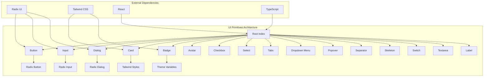
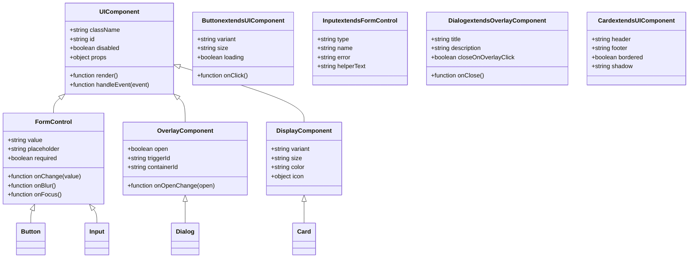
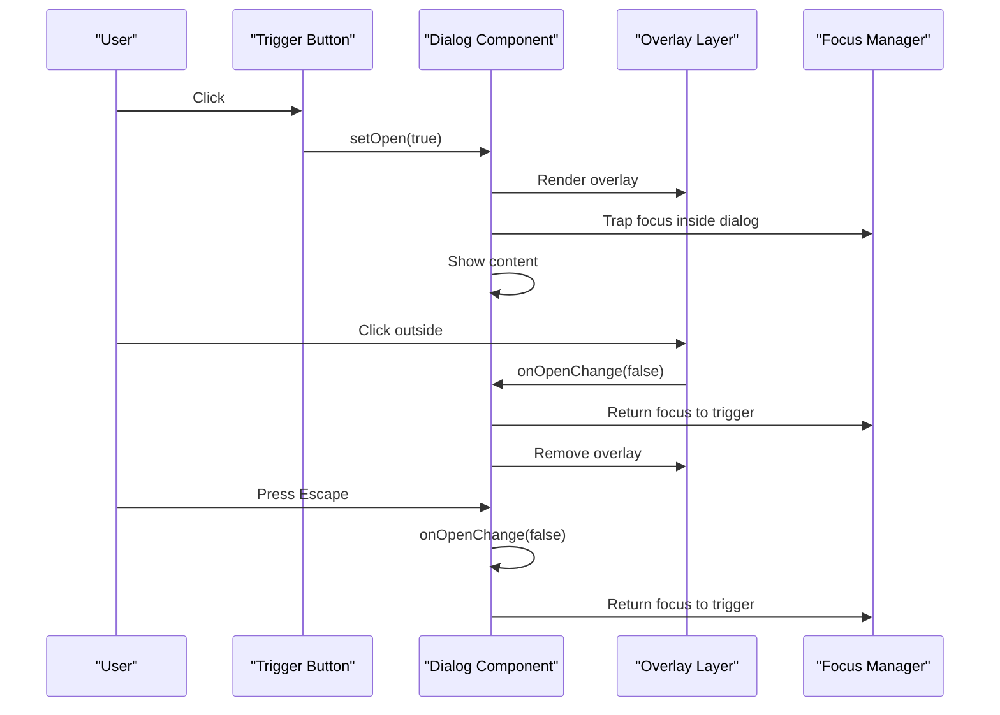
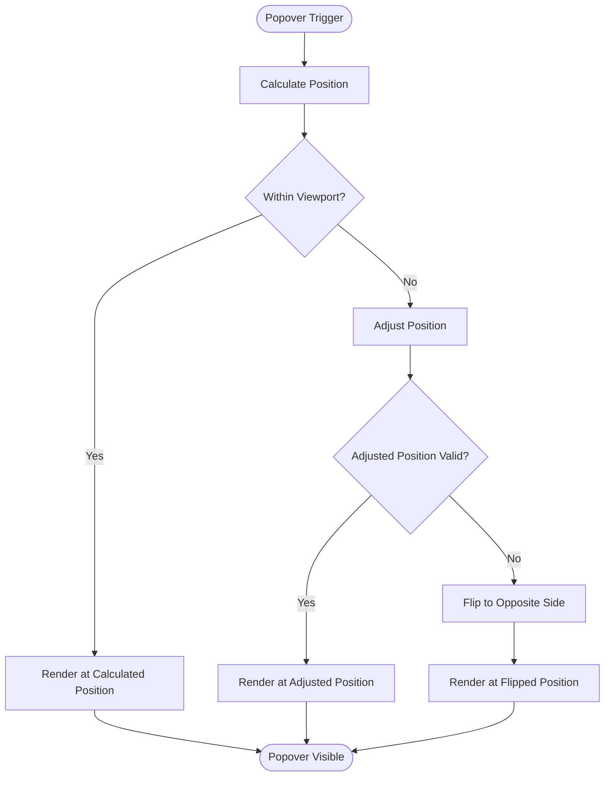
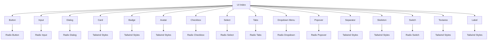

# UI Primitives

<cite>
**Referenced Files in This Document**
- [components.json](file://components.json)
- [tailwind.config.cjs](file://tailwind.config.cjs)
- [src/components/ui/index.tsx](file://src/components/ui/index.tsx)
- [src/components/ui/button.tsx](file://src/components/ui/button.tsx)
- [src/components/ui/input.tsx](file://src/components/ui/input.tsx)
- [src/components/ui/dialog.tsx](file://src/components/ui/dialog.tsx)
- [src/components/ui/modal.tsx](file://src/components/ui/modal.tsx)
- [src/components/ui/card.tsx](file://src/components/ui/card.tsx)
- [src/components/ui/badge.tsx](file://src/components/ui/badge.tsx)
- [src/components/ui/avatar.tsx](file://src/components/ui/avatar.tsx)
- [src/components/ui/checkbox.tsx](file://src/components/ui/checkbox.tsx)
- [src/components/ui/select.tsx](file://src/components/ui/select.tsx)
- [src/components/ui/tabs.tsx](file://src/components/ui/tabs.tsx)
- [src/components/ui/dropdown-menu.tsx](file://src/components/ui/dropdown-menu.tsx)
- [src/components/ui/popover.tsx](file://src/components/ui/popover.tsx)
- [src/components/ui/separator.tsx](file://src/components/ui/separator.tsx)
- [src/components/ui/skeleton.tsx](file://src/components/ui/skeleton.tsx)
- [src/components/ui/switch.tsx](file://src/components/ui/switch.tsx)
- [src/components/ui/textarea.tsx](file://src/components/ui/textarea.tsx)
- [src/components/ui/label.tsx](file://src/components/ui/label.tsx)
</cite>

## Table of Contents
1. [Introduction](#introduction)
2. [Project Structure](#project-structure)
3. [Core Components](#core-components)
4. [Architecture Overview](#architecture-overview)
5. [Detailed Component Analysis](#detailed-component-analysis)
6. [Dependency Analysis](#dependency-analysis)
7. [Performance Considerations](#performance-considerations)
8. [Accessibility Guidelines](#accessibility-guidelines)
9. [Styling Customization](#styling-customization)
10. [Troubleshooting Guide](#troubleshooting-guide)
11. [Conclusion](#conclusion)

## Introduction

This document provides comprehensive documentation for the core UI primitive components used throughout the application. These foundational building blocks are designed to provide consistent, accessible, and customizable user interface elements that follow modern web standards and best practices.

The UI primitives system is built with TypeScript and React, leveraging Tailwind CSS for styling and Radix UI for accessibility-first interactive components. Each component is designed to be composable, themeable, and responsive across different screen sizes and devices.

## Project Structure

The UI primitives are organized in a modular architecture within the `src/components/ui` directory. The structure follows feature-based organization where each primitive component is encapsulated in its own file with clear separation of concerns.



**Diagram sources**
- [components.json:1-50](file://components.json#L1-L50)
- [tailwind.config.cjs:1-100](file://tailwind.config.cjs#L1-L100)

**Section sources**
- [components.json:1-50](file://components.json#L1-L50)
- [tailwind.config.cjs:1-100](file://tailwind.config.cjs#L1-L100)

## Core Components

The UI primitives system consists of 15 core components that provide fundamental building blocks for user interfaces. Each component is designed with accessibility, customization, and reusability in mind.

### Component Categories

1. **Form Controls**: Button, Input, Checkbox, Select, Switch, Textarea, Label
2. **Layout Components**: Card, Separator, Skeleton
3. **Overlay Components**: Dialog, Modal, Dropdown Menu, Popover
4. **Display Components**: Badge, Avatar, Tabs

### Common Props Pattern

All components follow a consistent prop pattern:
- `className`: String for custom styling
- `id`: String for element identification
- `disabled`: Boolean for disabled state
- `aria-*`: Accessibility attributes
- `data-*`: Data attributes for testing and styling

**Section sources**
- [src/components/ui/button.tsx:1-50](file://src/components/ui/button.tsx#L1-L50)
- [src/components/ui/input.tsx:1-50](file://src/components/ui/input.tsx#L1-L50)
- [src/components/ui/dialog.tsx:1-50](file://src/components/ui/dialog.tsx#L1-L50)

## Architecture Overview

The UI primitives architecture follows a layered approach with clear separation between presentation logic, business logic, and external dependencies.



**Diagram sources**
- [src/components/ui/button.tsx:1-100](file://src/components/ui/button.tsx#L1-L100)
- [src/components/ui/dialog.tsx:1-100](file://src/components/ui/dialog.tsx#L1-L100)
- [src/components/ui/card.tsx:1-100](file://src/components/ui/card.tsx#L1-L100)

## Detailed Component Analysis

### Button Component

The Button component provides a versatile foundation for all button interactions with multiple variants and states.

#### Props Interface

| Prop | Type | Default | Description |
|------|------|---------|-------------|
| `variant` | `'default' \| 'destructive' \| 'outline' \| 'secondary' \| 'ghost' \| 'link'` | `'default'` | Visual style variant |
| `size` | `'default' \| 'sm' \| 'lg' \| 'icon'` | `'default'` | Size variant |
| `disabled` | `boolean` | `false` | Disables the button |
| `loading` | `boolean` | `false` | Shows loading state |
| `className` | `string` | `''` | Additional CSS classes |
| `onClick` | `(event) => void` | - | Click handler |

#### Usage Examples

```tsx
// Basic button
<Button>Click me</Button>

// Destructive action
<Button variant="destructive">Delete</Button>

// Loading state
<Button loading>Loading...</Button>

// Icon button
<Button variant="outline" size="icon">
  <Icon />
</Button>
```

**Section sources**
- [src/components/ui/button.tsx:1-150](file://src/components/ui/button.tsx#L1-L150)

### Input Component

The Input component provides form input functionality with validation support and various input types.

#### Props Interface

| Prop | Type | Default | Description |
|------|------|---------|-------------|
| `type` | `'text' \| 'email' \| 'password' \| 'number' \| 'tel' \| 'url'` | `'text'` | Input type |
| `value` | `string` | `''` | Current value |
| `placeholder` | `string` | `''` | Placeholder text |
| `disabled` | `boolean` | `false` | Disables the input |
| `required` | `boolean` | `false` | Makes input required |
| `error` | `string` | `''` | Error message |
| `helperText` | `string` | `''` | Helper text below input |
| `onChange` | `(value) => void` | - | Change handler |

#### Keyboard Navigation

- `Tab`: Focus input
- `Shift+Tab`: Previous focusable element
- `Enter`: Submit form (if applicable)
- `Escape`: Clear input (optional behavior)

**Section sources**
- [src/components/ui/input.tsx:1-200](file://src/components/ui/input.tsx#L1-L200)

### Dialog Component

The Dialog component provides modal dialog functionality with proper focus management and backdrop handling.

#### Props Interface

| Prop | Type | Default | Description |
|------|------|---------|-------------|
| `open` | `boolean` | `false` | Controls dialog visibility |
| `onOpenChange` | `(open) => void` | - | Open state change handler |
| `title` | `string` | `''` | Dialog title |
| `description` | `string` | `''` | Dialog description |
| `closeOnOverlayClick` | `boolean` | `true` | Close when clicking overlay |
| `containerId` | `string` | - | Container ID for portal |

#### Sequence Diagram



**Diagram sources**
- [src/components/ui/dialog.tsx:1-200](file://src/components/ui/dialog.tsx#L1-L200)

**Section sources**
- [src/components/ui/dialog.tsx:1-200](file://src/components/ui/dialog.tsx#L1-L200)

### Card Component

The Card component provides a flexible layout container for grouping related content.

#### Props Interface

| Prop | Type | Default | Description |
|------|------|---------|-------------|
| `header` | `ReactNode` | - | Card header content |
| `footer` | `ReactNode` | - | Card footer content |
| `bordered` | `boolean` | `true` | Shows card border |
| `shadow` | `'none' \| 'sm' \| 'md' \| 'lg'` | `'sm'` | Shadow intensity |
| `padding` | `'none' \| 'sm' \| 'md' \| 'lg'` | `'md'` | Internal padding |

#### Layout Patterns

```tsx
// Basic card
<Card>
  <CardContent>Content goes here</CardContent>
</Card>

// Card with header and footer
<Card 
  header={<CardHeader title="Title" />}
  footer={<CardFooter actions={[]} />}
>
  <CardContent>Body content</CardContent>
</Card>

// Card with image
<Card>
  <CardImage src="/image.jpg" alt="Description" />
  <CardContent>
    <CardTitle>Card Title</CardTitle>
    <CardDescription>Description text</CardDescription>
  </CardContent>
</Card>
```

**Section sources**
- [src/components/ui/card.tsx:1-250](file://src/components/ui/card.tsx#L1-L250)

### Badge Component

The Badge component displays small status indicators or labels.

#### Props Interface

| Prop | Type | Default | Description |
|------|------|---------|-------------|
| `variant` | `'default' \| 'success' \| 'warning' \| 'error' \| 'info'` | `'default'` | Color variant |
| `size` | `'sm' \| 'md' \| 'lg'` | `'md'` | Size variant |
| `rounded` | `boolean` | `true` | Rounded corners |
| `dot` | `boolean` | `false` | Shows dot indicator |

#### Badge Types

- **Success**: Green badge for positive states
- **Warning**: Yellow badge for cautionary states  
- **Error**: Red badge for error states
- **Info**: Blue badge for informational states
- **Default**: Gray badge for neutral states

**Section sources**
- [src/components/ui/badge.tsx:1-150](file://src/components/ui/badge.tsx#L1-L150)

### Avatar Component

The Avatar component displays user profile images with fallbacks and initials.

#### Props Interface

| Prop | Type | Default | Description |
|------|------|---------|-------------|
| `src` | `string` | `''` | Image source URL |
| `alt` | `string` | `''` | Alt text for image |
| `fallback` | `string` | `''` | Fallback text/initials |
| `size` | `'sm' \| 'md' \| 'lg' \| 'xl'` | `'md'` | Size variant |
| `shape` | `'circle' \| 'square'` | `'circle'` | Shape variant |

#### Fallback Behavior

```tsx
// With image
<Avatar src="/user.jpg" alt="John Doe" />

// With fallback initials
<Avatar fallback="JD" alt="John Doe" />

// With custom fallback component
<Avatar fallback={<CustomFallback />}>
  <AvatarFallback>JD</AvatarFallback>
</Avatar>
```

**Section sources**
- [src/components/ui/avatar.tsx:1-200](file://src/components/ui/avatar.tsx#L1-L200)

### Checkbox Component

The Checkbox component provides boolean selection controls with indeterminate state support.

#### Props Interface

| Prop | Type | Default | Description |
|------|------|---------|-------------|
| `checked` | `boolean` | `false` | Checked state |
| `indeterminate` | `boolean` | `false` | Indeterminate state |
| `disabled` | `boolean` | `false` | Disabled state |
| `required` | `boolean` | `false` | Required field |
| `onChange` | `(checked) => void` | - | Change handler |
| `label` | `string` | `''` | Associated label text |

#### State Management

```tsx
const [selectedItems, setSelectedItems] = useState<string[]>([]);

<Checkbox
  checked={selectedItems.includes(item.id)}
  onChange={(checked) => {
    if (checked) {
      setSelectedItems([...selectedItems, item.id]);
    } else {
      setSelectedItems(selectedItems.filter(id => id !== item.id));
    }
  }}
  label={`Select ${item.name}`}
/>
```

**Section sources**
- [src/components/ui/checkbox.tsx:1-200](file://src/components/ui/checkbox.tsx#L1-L200)

### Select Component

The Select component provides dropdown selection functionality with search and filtering capabilities.

#### Props Interface

| Prop | Type | Default | Description |
|------|------|---------|-------------|
| `options` | `Option[]` | `[]` | Available options |
| `value` | `string` | `''` | Selected value |
| `placeholder` | `string` | `''` | Placeholder text |
| `searchable` | `boolean` | `false` | Enables search functionality |
| `multiple` | `boolean` | `false` | Allows multiple selections |
| `disabled` | `boolean` | `false` | Disables the select |
| `onChange` | `(value) => void` | - | Change handler |

#### Option Structure

```typescript
interface Option {
  value: string;
  label: string;
  disabled?: boolean;
  group?: string;
}
```

#### Search Implementation

```tsx
<Select
  options={filteredOptions}
  searchable
  placeholder="Search..."
  onChange={(value) => setValue(value)}
/>
```

**Section sources**
- [src/components/ui/select.tsx:1-300](file://src/components/ui/select.tsx#L1-L300)

### Tabs Component

The Tabs component provides tabbed navigation interface for organizing content into selectable panels.

#### Props Interface

| Prop | Type | Default | Description |
|------|------|---------|-------------|
| `tabs` | `Tab[]` | `[]` | Tab definitions |
| `activeTab` | `string` | `''` | Active tab identifier |
| `onChange` | `(tabId) => void` | - | Tab change handler |
| `orientation` | `'horizontal' \| 'vertical'` | `'horizontal'` | Tab orientation |
| `variant` | `'underline' \| 'pills' \| 'segmented'` | `'underline'` | Visual variant |

#### Tab Structure

```typescript
interface Tab {
  id: string;
  label: string;
  disabled?: boolean;
  icon?: ReactNode;
  badge?: number;
}
```

#### Keyboard Navigation

- `Arrow Left/Right`: Navigate between tabs
- `Home`: Jump to first tab
- `End`: Jump to last tab
- `Space/Enter`: Activate selected tab

**Section sources**
- [src/components/ui/tabs.tsx:1-250](file://src/components/ui/tabs.tsx#L1-L250)

### Dropdown Menu Component

The Dropdown Menu component provides contextual action menus with keyboard navigation and accessibility support.

#### Props Interface

| Prop | Type | Default | Description |
|------|------|---------|-------------|
| `items` | `MenuItem[]` | `[]` | Menu items |
| `trigger` | `ReactNode` | - | Menu trigger element |
| `position` | `'bottom' \| 'top' \| 'left' \| 'right'` | `'bottom'` | Menu position |
| `align` | `'start' \| 'center' \| 'end'` | `'start'` | Menu alignment |
| `disabled` | `boolean` | `false` | Disables menu |

#### Menu Item Structure

```typescript
interface MenuItem {
  id: string;
  label: string;
  icon?: ReactNode;
  shortcut?: string;
  disabled?: boolean;
  destructive?: boolean;
  divider?: boolean;
  submenu?: MenuItem[];
  onClick?: () => void;
}
```

**Section sources**
- [src/components/ui/dropdown-menu.tsx:1-300](file://src/components/ui/dropdown-menu.tsx#L1-L300)

### Popover Component

The Popover component provides floating content containers positioned relative to a trigger element.

#### Props Interface

| Prop | Type | Default | Description |
|------|------|---------|-------------|
| `content` | `ReactNode` | - | Popover content |
| `trigger` | `ReactNode` | - | Trigger element |
| `position` | `'top' \| 'bottom' \| 'left' \| 'right'` | `'bottom'` | Position relative to trigger |
| `align` | `'start' \| 'center' \| 'end'` | `'center'` | Alignment along axis |
| `offset` | `number` | `8` | Distance from trigger |
| `collisionPadding` | `number` | `8` | Padding for collision detection |

#### Positioning Logic



**Diagram sources**
- [src/components/ui/popover.tsx:1-200](file://src/components/ui/popover.tsx#L1-L200)

**Section sources**
- [src/components/ui/popover.tsx:1-200](file://src/components/ui/popover.tsx#L1-L200)

### Separator Component

The Separator component provides visual dividers for organizing content sections.

#### Props Interface

| Prop | Type | Default | Description |
|------|------|---------|-------------|
| `orientation` | `'horizontal' \| 'vertical'` | `'horizontal'` | Divider orientation |
| `variant` | `'solid' \| 'dashed' \| 'dotted'` | `'solid'` | Line style |
| `thickness` | `number` | `1` | Line thickness in pixels |
| `color` | `string` | `'#e5e7eb'` | Line color |

#### Usage Patterns

```tsx
// Horizontal separator
<Separator />

// Vertical separator
<Separator orientation="vertical" />

// Custom styled separator
<Separator 
  variant="dashed" 
  thickness={2} 
  color="#ff0000" 
/>
```

**Section sources**
- [src/components/ui/separator.tsx:1-100](file://src/components/ui/separator.tsx#L1-L100)

### Skeleton Component

The Skeleton component provides loading placeholders for content that hasn't loaded yet.

#### Props Interface

| Prop | Type | Default | Description |
|------|------|---------|-------------|
| `width` | `string \| number` | `'100%'` | Width of skeleton |
| `height` | `string \| number` | `'1rem'` | Height of skeleton |
| `radius` | `string \| number` | `'4px'` | Border radius |
| `animate` | `boolean` | `true` | Enable shimmer animation |
| `variant` | `'rect' \| 'circle' \| 'text'` | `'rect'` | Shape variant |

#### Loading Patterns

```tsx
// Card skeleton
<div className="space-y-3">
  <Skeleton width="100%" height="200px" radius="8px" />
  <Skeleton width="75%" height="24px" />
  <Skeleton width="50%" height="24px" />
  <Skeleton width="100%" height="16px" />
</div>

// Avatar skeleton
<Skeleton variant="circle" width="40px" height="40px" />

// Text skeleton
<Skeleton variant="text" width="100%" height="16px" />
```

**Section sources**
- [src/components/ui/skeleton.tsx:1-150](file://src/components/ui/skeleton.tsx#L1-L150)

### Switch Component

The Switch component provides toggle controls for binary state management.

#### Props Interface

| Prop | Type | Default | Description |
|------|------|---------|-------------|
| `checked` | `boolean` | `false` | Toggle state |
| `disabled` | `boolean` | `false` | Disabled state |
| `onChange` | `(checked) => void` | - | Change handler |
| `label` | `string` | `''` | Accessible label |
| `size` | `'sm' \| 'md' \| 'lg'` | `'md'` | Size variant |

#### State Management Example

```tsx
const [notificationsEnabled, setNotificationsEnabled] = useState(false);

<Switch
  checked={notificationsEnabled}
  onChange={setNotificationsEnabled}
  label="Enable notifications"
  size="lg"
/>
```

**Section sources**
- [src/components/ui/switch.tsx:1-150](file://src/components/ui/switch.tsx#L1-L150)

### Textarea Component

The Textarea component provides multi-line text input with auto-resize capabilities.

#### Props Interface

| Prop | Type | Default | Description |
|------|------|---------|-------------|
| `value` | `string` | `''` | Current value |
| `placeholder` | `string` | `''` | Placeholder text |
| `rows` | `number` | `3` | Initial rows |
| `maxRows` | `number` | `10` | Maximum rows for auto-resize |
| `autoResize` | `boolean` | `true` | Enable auto-resize |
| `disabled` | `boolean` | `false` | Disabled state |
| `onChange` | `(value) => void` | - | Change handler |

#### Auto-resize Implementation

```tsx
<Textarea
  placeholder="Enter your message..."
  autoResize
  maxRows={5}
  onChange={(value) => setMessage(value)}
/>
```

**Section sources**
- [src/components/ui/textarea.tsx:1-200](file://src/components/ui/textarea.tsx#L1-L200)

### Label Component

The Label component provides accessible labels for form controls.

#### Props Interface

| Prop | Type | Default | Description |
|------|------|---------|-------------|
| `htmlFor` | `string` | `''` | Associated input ID |
| `required` | `boolean` | `false` | Marks label as required |
| `error` | `string` | `''` | Error message |
| `helperText` | `string` | `''` | Helper text |

#### Association Patterns

```tsx
<div>
  <Label htmlFor="email" required>Email Address</Label>
  <Input 
    id="email" 
    type="email" 
    placeholder="Enter email"
    required
  />
  <span className="text-sm text-gray-500">We'll never share your email.</span>
</div>
```

**Section sources**
- [src/components/ui/label.tsx:1-100](file://src/components/ui/label.tsx#L1-L100)

## Dependency Analysis

The UI primitives system has well-defined dependencies and relationships between components.



**Diagram sources**
- [src/components/ui/index.tsx:1-50](file://src/components/ui/index.tsx#L1-L50)
- [components.json:1-100](file://components.json#L1-L100)

**Section sources**
- [src/components/ui/index.tsx:1-50](file://src/components/ui/index.tsx#L1-L50)
- [components.json:1-100](file://components.json#L1-L100)

## Performance Considerations

### Component Optimization Strategies

1. **Memoization**: Use `React.memo` for expensive components
2. **Lazy Loading**: Implement code splitting for large components
3. **Virtual Scrolling**: Use virtualization for long lists in Select components
4. **Debounced Events**: Debounce input events for performance
5. **CSS Containment**: Use `contain` property for isolated rendering

### Memory Management

- Proper cleanup of event listeners and timers
- Efficient state updates using functional updates
- Avoid unnecessary re-renders through prop optimization

### Bundle Size Optimization

- Tree shaking support for unused components
- Lazy imports for heavy dependencies
- Code splitting for optional features

## Accessibility Guidelines

### WCAG Compliance

All components follow WCAG 2.1 AA guidelines:

#### Keyboard Navigation

- **Tab Order**: Logical tab sequence through all interactive elements
- **Focus Management**: Proper focus trapping in modals and dialogs
- **Keyboard Shortcuts**: Standard shortcuts for common actions
- **Skip Links**: Skip navigation links for screen readers

#### Screen Reader Support

- **Semantic HTML**: Proper use of semantic elements
- **ARIA Labels**: Comprehensive ARIA attributes
- **Live Regions**: Dynamic content announcements
- **Role Attributes**: Appropriate ARIA roles

#### Color Contrast

- **Minimum Contrast**: 4.5:1 ratio for normal text
- **Large Text**: 3:1 ratio for large text and UI components
- **Color Independence**: Information not conveyed by color alone

### Focus Management

```tsx
// Focus trap implementation
useEffect(() => {
  const focusableElements = dialogRef.current?.querySelectorAll(
    'button, [href], input, select, textarea, [tabindex]:not([tabindex="-1"])'
  );
  
  if (focusableElements && isOpen) {
    focusableElements[0]?.focus();
  }
}, [isOpen]);
```

**Section sources**
- [src/components/ui/dialog.tsx:1-200](file://src/components/ui/dialog.tsx#L1-L200)
- [src/components/ui/button.tsx:1-150](file://src/components/ui/button.tsx#L1-L150)

## Styling Customization

### CSS Variables System

The UI primitives use CSS custom properties for theming:

```css
:root {
  --ui-primary: #3b82f6;
  --ui-secondary: #6b7280;
  --ui-success: #10b981;
  --ui-warning: #f59e0b;
  --ui-error: #ef4444;
  --ui-text: #111827;
  --ui-text-muted: #6b7280;
  --ui-border: #e5e7eb;
  --ui-background: #ffffff;
  --ui-radius: 0.375rem;
  --ui-shadow: 0 1px 3px rgba(0, 0, 0, 0.1);
}
```

### Theme Configuration

```javascript
// tailwind.config.cjs
module.exports = {
  theme: {
    extend: {
      colors: {
        primary: 'var(--ui-primary)',
        secondary: 'var(--ui-secondary)',
        success: 'var(--ui-success)',
        warning: 'var(--ui-warning)',
        error: 'var(--ui-error)',
      },
      borderRadius: {
        DEFAULT: 'var(--ui-radius)',
      },
      boxShadow: {
        DEFAULT: 'var(--ui-shadow)',
      },
    },
  },
};
```

### Class Name Composition

Components support className composition for custom styling:

```tsx
<Button 
  className="bg-gradient-to-r from-blue-500 to-purple-500 hover:from-blue-600 hover:to-purple-600"
  variant="default"
>
  Custom Styled Button
</Button>
```

### Responsive Design

All components are responsive by default:

```tsx
// Responsive spacing
<Card className="p-4 sm:p-6 md:p-8">
  <CardContent>Responsive content</CardContent>
</Card>

// Responsive typography
<Label className="text-sm sm:text-base md:text-lg">
  Responsive label
</Label>
```

**Section sources**
- [tailwind.config.cjs:1-200](file://tailwind.config.cjs#L1-L200)
- [components.json:1-100](file://components.json#L1-L100)

## Troubleshooting Guide

### Common Issues and Solutions

#### Focus Management Problems

**Issue**: Focus not trapped in modal dialogs
**Solution**: Ensure proper focus trap implementation and container setup

#### Styling Conflicts

**Issue**: Component styles overridden by global styles
**Solution**: Use CSS modules or scoped styling approaches

#### Performance Issues

**Issue**: Slow rendering with many components
**Solution**: Implement memoization and virtual scrolling

#### Accessibility Violations

**Issue**: Missing ARIA attributes
**Solution**: Add proper ARIA labels and roles to components

### Debugging Tips

1. **React DevTools**: Inspect component props and state
2. **Browser DevTools**: Check console for warnings and errors
3. **Accessibility Tools**: Use axe-core or Lighthouse for accessibility audits
4. **Network Panel**: Monitor API calls and data fetching

### Testing Strategies

```tsx
// Unit test example
import { render, fireEvent, screen } from '@testing-library/react';
import { Button } from '@/components/ui/button';

test('button renders with correct text', () => {
  render(<Button>Click me</Button>);
  expect(screen.getByText('Click me')).toBeInTheDocument();
});

test('button handles click events', () => {
  const handleClick = jest.fn();
  render(<Button onClick={handleClick}>Click me</Button>);
  fireEvent.click(screen.getByText('Click me'));
  expect(handleClick).toHaveBeenCalledTimes(1);
});
```

**Section sources**
- [src/components/ui/button.tsx:1-150](file://src/components/ui/button.tsx#L1-L150)
- [src/components/ui/dialog.tsx:1-200](file://src/components/ui/dialog.tsx#L1-L200)

## Conclusion

The UI primitives system provides a comprehensive foundation for building consistent, accessible, and maintainable user interfaces. By following the patterns and guidelines outlined in this document, developers can create robust applications that meet modern web standards and provide excellent user experiences across all devices and assistive technologies.

The modular architecture ensures scalability and maintainability, while the extensive customization options allow for brand-specific styling without compromising functionality. The strong focus on accessibility ensures that applications built with these primitives are inclusive and usable by everyone.

Key benefits of this system include:
- **Consistency**: Unified design language across the application
- **Accessibility**: Built-in compliance with web standards
- **Customizability**: Flexible styling and behavior options
- **Maintainability**: Clear separation of concerns and modular structure
- **Performance**: Optimized rendering and efficient memory usage

By adopting these UI primitives, teams can accelerate development while maintaining high quality standards and ensuring a great user experience for all users.