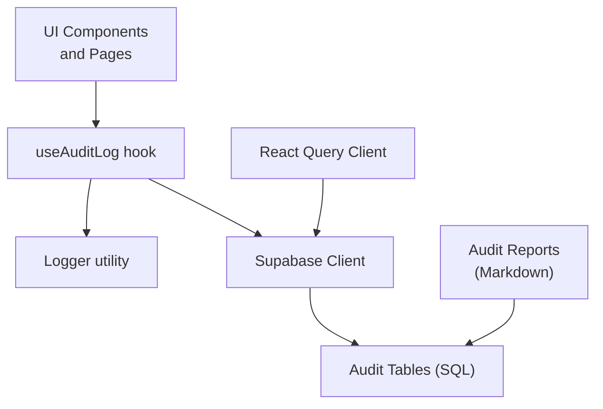
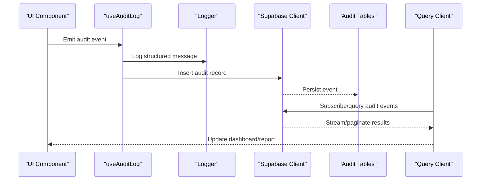
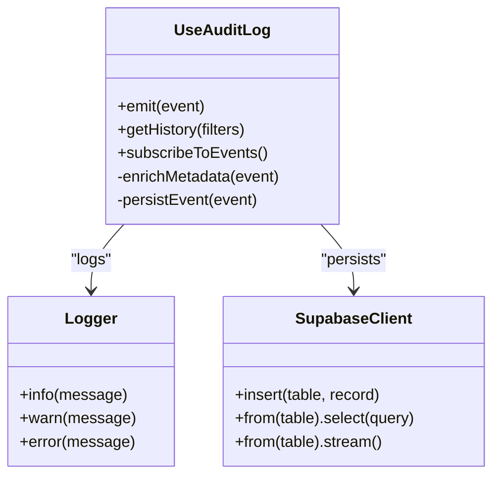
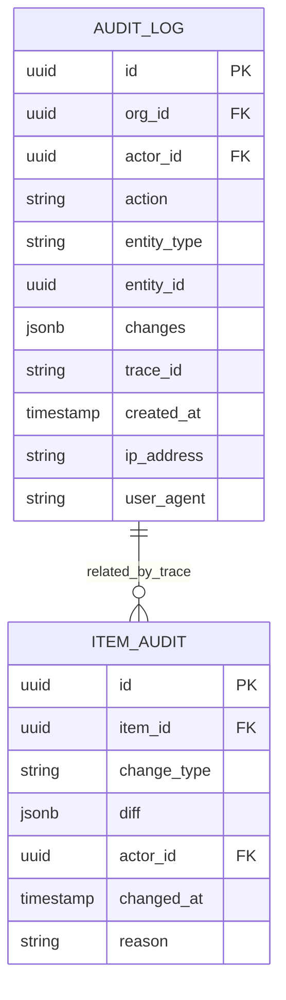
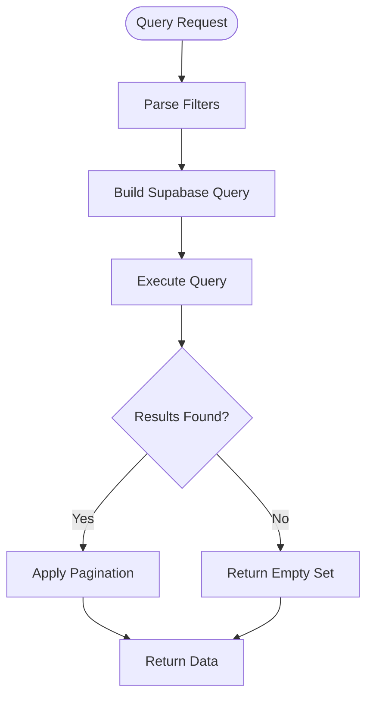
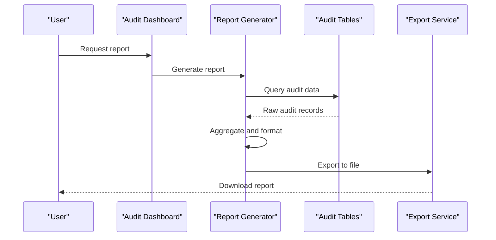
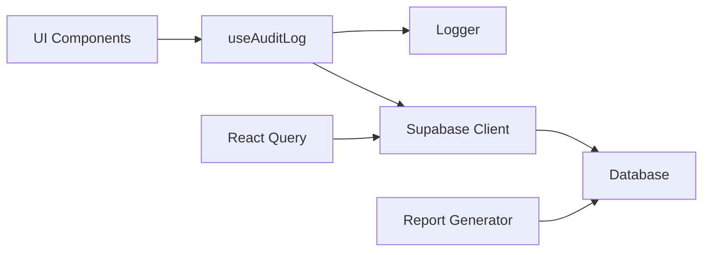

# Audit Logging & Compliance

<cite>
**Referenced Files in This Document**
- [useAuditLog.ts](file://src/hooks/useAuditLog.ts)
- [database-add-audit-log.sql](file://src/database-add-audit-log.sql)
- [database-item-audit.sql](file://src/database-item-audit.sql)
- [logger.tsx](file://src/lib/logger.tsx)
- [supabase.ts](file://src/supabase.ts)
- [queryClient.ts](file://src/queryClient.ts)
- [auditreport.md](file://auditreport.md)
- [AUDITREPORT 14-04-2026.md](file://auditreview/AUDITREPORT 14-04-2026.md)
- [POSTAUDIT.md](file://auditreview/POSTAUDIT.md)
</cite>

## Table of Contents
1. [Introduction](#introduction)
2. [Project Structure](#project-structure)
3. [Core Components](#core-components)
4. [Architecture Overview](#architecture-overview)
5. [Detailed Component Analysis](#detailed-component-analysis)
6. [Dependency Analysis](#dependency-analysis)
7. [Performance Considerations](#performance-considerations)
8. [Troubleshooting Guide](#troubleshooting-guide)
9. [Conclusion](#conclusion)
10. [Appendices](#appendices)

## Introduction
This document explains the audit logging and compliance tracking system implemented in the application. It covers the audit trail architecture, event capture mechanisms, log storage strategies, schema design, event types, metadata collection patterns, querying interface, filtering capabilities, reporting features, automatic and manual audit event generation, and compliance report generation. It also provides practical examples for implementing custom audit events, building audit dashboards, and exporting audit trails for regulatory compliance, along with performance considerations, retention policies, and secure storage guidance.

## Project Structure
The audit logging functionality spans several layers:
- Frontend hooks and utilities for capturing and emitting audit events
- Database migrations defining audit tables and indexes
- Supabase client integration for persistence and queries
- Query client configuration for caching and real-time updates
- Documentation artifacts describing audit reports and post-audit processes

**Diagram sources**
- [useAuditLog.ts](file://src/hooks/useAuditLog.ts)
- [logger.tsx](file://src/lib/logger.tsx)
- [supabase.ts](file://src/supabase.ts)
- [database-add-audit-log.sql](file://src/database-add-audit-log.sql)
- [database-item-audit.sql](file://src/database-item-audit.sql)
- [queryClient.ts](file://src/queryClient.ts)
- [auditreport.md](file://auditreport.md)

**Section sources**
- [useAuditLog.ts](file://src/hooks/useAuditLog.ts)
- [database-add-audit-log.sql](file://src/database-add-audit-log.sql)
- [database-item-audit.sql](file://src/database-item-audit.sql)
- [logger.tsx](file://src/lib/logger.tsx)
- [supabase.ts](file://src/supabase.ts)
- [queryClient.ts](file://src/queryClient.ts)
- [auditreport.md](file://auditreport.md)

## Core Components
- useAuditLog hook: Provides a centralized API to emit audit events from UI components and business logic. It standardizes event shape, collects contextual metadata, and persists events via Supabase.
- Logger utility: Offers consistent logging behavior across the app, including structured logs that can be correlated with audit events.
- Supabase client: Handles authenticated requests to persist audit records and query them efficiently.
- Query client: Caches audit data and supports real-time subscriptions where applicable.
- SQL migrations: Define audit table schemas, constraints, and indexes to support high-volume writes and efficient queries.

Key responsibilities:
- Event capture: Normalize and enrich events with user, organization, resource, and action context.
- Storage strategy: Persist immutable audit records with timestamps and trace identifiers.
- Querying: Provide filtered and paginated access to audit trails for dashboards and reports.
- Reporting: Generate compliance-ready summaries and exports.

**Section sources**
- [useAuditLog.ts](file://src/hooks/useAuditLog.ts)
- [logger.tsx](file://src/lib/logger.tsx)
- [supabase.ts](file://src/supabase.ts)
- [queryClient.ts](file://src/queryClient.ts)
- [database-add-audit-log.sql](file://src/database-add-audit-log.sql)
- [database-item-audit.sql](file://src/database-item-audit.sql)

## Architecture Overview
The audit system follows a layered approach:
- Capture layer: Hooks and utilities collect events at interaction points.
- Persistence layer: Supabase client writes immutable audit records.
- Query layer: React Query client caches and streams results.
- Reporting layer: Markdown-based reports and export utilities generate compliance outputs.

**Diagram sources**
- [useAuditLog.ts](file://src/hooks/useAuditLog.ts)
- [logger.tsx](file://src/lib/logger.tsx)
- [supabase.ts](file://src/supabase.ts)
- [database-add-audit-log.sql](file://src/database-add-audit-log.sql)
- [queryClient.ts](file://src/queryClient.ts)

## Detailed Component Analysis

### Audit Hook: useAuditLog
The hook encapsulates event emission, metadata enrichment, and persistence. It ensures consistent event shapes and integrates with the logger for correlation.

Implementation highlights:
- Event normalization: Standardizes fields like actor, action, entity, changes, and traceId.
- Metadata collection: Captures user identity, organization, IP, timestamp, and request context.
- Persistence: Uses Supabase insert with error handling and retry strategies.
- Querying: Supports filters by time range, actor, entity type, and action.

**Diagram sources**
- [useAuditLog.ts](file://src/hooks/useAuditLog.ts)
- [logger.tsx](file://src/lib/logger.tsx)
- [supabase.ts](file://src/supabase.ts)

**Section sources**
- [useAuditLog.ts](file://src/hooks/useAuditLog.ts)

### Audit Schema and Storage
The database schema defines immutable audit records with indexed columns for efficient querying.

Storage strategies:
- Immutable records: Append-only inserts with no updates or deletes.
- Indexes: On org_id, actor_id, created_at, entity_type, and trace_id for fast filtering.
- Partitioning: Optional partitioning by time for high-volume environments.
- Retention: Automated cleanup based on retention policies.

**Diagram sources**
- [database-add-audit-log.sql](file://src/database-add-audit-log.sql)
- [database-item-audit.sql](file://src/database-item-audit.sql)

**Section sources**
- [database-add-audit-log.sql](file://src/database-add-audit-log.sql)
- [database-item-audit.sql](file://src/database-item-audit.sql)

### Querying Interface and Filtering
The querying interface supports:
- Time-range filters: Start and end timestamps.
- Actor filters: By user ID or role.
- Entity filters: By type and ID.
- Action filters: By specific actions (create, update, delete, approve, etc.).
- Trace correlation: By trace_id for cross-request tracing.

**Diagram sources**
- [useAuditLog.ts](file://src/hooks/useAuditLog.ts)
- [supabase.ts](file://src/supabase.ts)
- [queryClient.ts](file://src/queryClient.ts)

**Section sources**
- [useAuditLog.ts](file://src/hooks/useAuditLog.ts)
- [supabase.ts](file://src/supabase.ts)
- [queryClient.ts](file://src/queryClient.ts)

### Automatic Audit Event Generation
Automatic events are generated at key business operations:
- Resource creation/update/deletion
- Approval workflow transitions
- Permission changes
- Configuration updates

Patterns:
- Middleware-style interception at service boundaries
- Decorators around critical functions
- Event emitters triggered by domain events

Manual Logging APIs:
- Direct function calls to log arbitrary events
- Batch logging for bulk operations
- Conditional logging based on feature flags

**Section sources**
- [useAuditLog.ts](file://src/hooks/useAuditLog.ts)
- [logger.tsx](file://src/lib/logger.tsx)

### Compliance Report Generation
Reports are generated using structured data from audit logs:
- Summary statistics: Counts by action, actor, entity type
- Trend analysis: Changes over time
- Export formats: CSV, JSON, PDF
- Regulatory templates: Predefined layouts for compliance

**Diagram sources**
- [auditreport.md](file://auditreport.md)
- [AUDITREPORT 14-04-2026.md](file://auditreview/AUDITREPORT 14-04-2026.md)
- [POSTAUDIT.md](file://auditreview/POSTAUDIT.md)

**Section sources**
- [auditreport.md](file://auditreport.md)
- [AUDITREPORT 14-04-2026.md](file://auditreview/AUDITREPORT 14-04-2026.md)
- [POSTAUDIT.md](file://auditreview/POSTAUDIT.md)

## Dependency Analysis
The audit system has clear dependencies between layers:

Key relationships:
- UI depends on the hook for event emission
- Hook depends on logger and Supabase client
- Query client depends on Supabase for data access
- Reports depend directly on database for aggregation

**Diagram sources**
- [useAuditLog.ts](file://src/hooks/useAuditLog.ts)
- [logger.tsx](file://src/lib/logger.tsx)
- [supabase.ts](file://src/supabase.ts)
- [queryClient.ts](file://src/queryClient.ts)

**Section sources**
- [useAuditLog.ts](file://src/hooks/useAuditLog.ts)
- [logger.tsx](file://src/lib/logger.tsx)
- [supabase.ts](file://src/supabase.ts)
- [queryClient.ts](file://src/queryClient.ts)

## Performance Considerations
High-volume logging requires careful optimization:
- Batch operations: Group multiple audit events into single inserts
- Asynchronous processing: Offload heavy operations to background jobs
- Connection pooling: Reuse database connections efficiently
- Caching: Cache frequent queries with appropriate invalidation
- Indexing: Optimize indexes for common filter combinations
- Compression: Compress large JSON payloads when appropriate

Retention policies:
- Time-based retention: Archive or delete old records automatically
- Tiered storage: Move older records to cheaper storage
- Compliance retention: Maintain required periods for legal compliance

Secure storage:
- Encryption at rest: Encrypt sensitive audit data
- Access controls: Restrict who can view audit logs
- Audit of audits: Track access to audit logs themselves

[No sources needed since this section provides general guidance]

## Troubleshooting Guide
Common issues and solutions:
- Missing audit events: Verify hook usage and event emission points
- Slow queries: Check index usage and query optimization
- Data inconsistencies: Validate transaction boundaries and rollback scenarios
- Permission errors: Review RLS policies and access controls
- Memory leaks: Monitor long-running subscriptions and clean up properly

Debugging tools:
- Structured logging with correlation IDs
- Error tracking and alerting
- Performance monitoring and profiling
- Test suites for audit event generation

**Section sources**
- [logger.tsx](file://src/lib/logger.tsx)
- [useAuditLog.ts](file://src/hooks/useAuditLog.ts)

## Conclusion
The audit logging and compliance tracking system provides a robust foundation for maintaining immutable audit trails, supporting compliance requirements, and enabling detailed analysis of system activities. The modular architecture allows for easy extension and customization while maintaining performance and security standards.

[No sources needed since this section summarizes without analyzing specific files]

## Appendices

### Practical Examples

#### Implementing Custom Audit Events
Steps to create custom audit events:
1. Define event type and payload structure
2. Add event emission at appropriate code locations
3. Ensure metadata collection includes all required context
4. Test event generation and persistence
5. Verify query filtering works correctly

#### Creating Audit Dashboards
Dashboard components should include:
- Real-time event feed
- Filterable timeline view
- Statistical summaries and trends
- Export capabilities
- Role-based access controls

#### Exporting Audit Trails for Compliance
Export process should:
- Support multiple formats (CSV, JSON, PDF)
- Include complete audit trail with metadata
- Maintain data integrity and immutability
- Provide digital signatures where required
- Support automated scheduling

[No sources needed since this section provides general guidance]