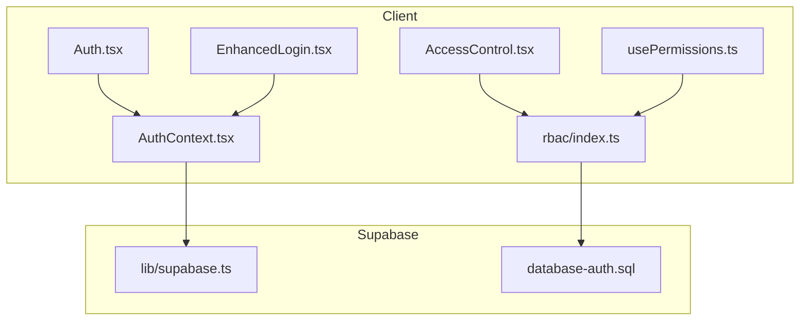
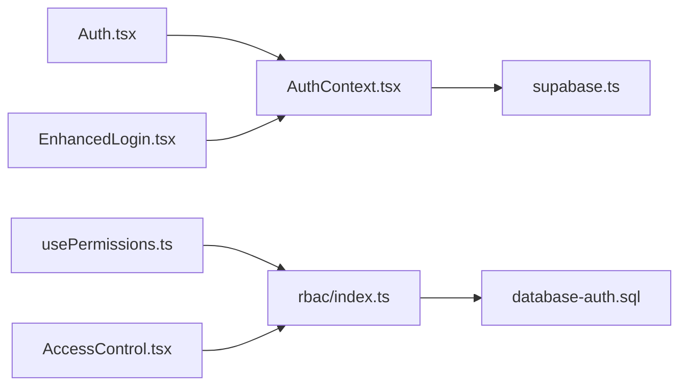

# Authentication & Authorization

<cite>
**Referenced Files in This Document**
- [AuthContext.tsx](file://src/contexts/AuthContext.tsx)
- [supabase.ts](file://src/lib/supabase.ts)
- [Auth.tsx](file://src/pages/Auth.tsx)
- [EnhancedLogin.tsx](file://src/pages/EnhancedLogin.tsx)
- [AccessControl.tsx](file://src/pages/AccessControl.tsx)
- [usePermissions.ts](file://src/hooks/usePermissions.ts)
- [rbac/index.ts](file://src/rbac/index.ts)
- [database-auth.sql](file://src/database-auth.sql)
- [GOOGLE_OAUTH_SETUP.md](file://docs/GOOGLE_OAUTH_SETUP.md)
</cite>

## Table of Contents
1. [Introduction](#introduction)
2. [Project Structure](#project-structure)
3. [Core Components](#core-components)
4. [Architecture Overview](#architecture-overview)
5. [Detailed Component Analysis](#detailed-component-analysis)
6. [Dependency Analysis](#dependency-analysis)
7. [Performance Considerations](#performance-considerations)
8. [Troubleshooting Guide](#troubleshooting-guide)
9. [Conclusion](#conclusion)
10. [Appendices](#appendices)

## Introduction
This document explains the authentication and authorization system used by the MEP Project ERP web application. It focuses on the Supabase-based identity layer, session management, token handling, and server-side security policies. It also covers client-side permission checks, role validation, protected routes, middleware guards, and conditional rendering patterns. Practical guidance is provided for implementing custom flows, extending roles, integrating external identity providers, and applying security best practices including password policies and multi-factor authentication considerations.

## Project Structure
The authentication and authorization features are implemented across a small set of focused modules:
- Client-side auth context and hooks
- Supabase client configuration
- Auth pages (login, enhanced login)
- Access control components and RBAC utilities
- Database migrations and RLS policies for server-side enforcement
- Documentation for third-party provider setup



**Diagram sources**
- [AuthContext.tsx](file://src/contexts/AuthContext.tsx)
- [supabase.ts](file://src/lib/supabase.ts)
- [Auth.tsx](file://src/pages/Auth.tsx)
- [EnhancedLogin.tsx](file://src/pages/EnhancedLogin.tsx)
- [AccessControl.tsx](file://src/pages/AccessControl.tsx)
- [usePermissions.ts](file://src/hooks/usePermissions.ts)
- [rbac/index.ts](file://src/rbac/index.ts)
- [database-auth.sql](file://src/database-auth.sql)

**Section sources**
- [AuthContext.tsx](file://src/contexts/AuthContext.tsx)
- [supabase.ts](file://src/lib/supabase.ts)
- [Auth.tsx](file://src/pages/Auth.tsx)
- [EnhancedLogin.tsx](file://src/pages/EnhancedLogin.tsx)
- [AccessControl.tsx](file://src/pages/AccessControl.tsx)
- [usePermissions.ts](file://src/hooks/usePermissions.ts)
- [rbac/index.ts](file://src/rbac/index.ts)
- [database-auth.sql](file://src/database-auth.sql)

## Core Components
- Supabase client initialization and configuration
- Auth context providing user state and session lifecycle
- Permission hooks and RBAC utilities for role/permission checks
- Protected route wrappers and access control components
- Server-side database policies for data-level security

Key responsibilities:
- Initialize and configure the Supabase client with environment variables
- Maintain current user and session state in React context
- Expose typed helpers to check permissions and roles
- Provide UI guards and route protection based on permissions
- Enforce row-level security via SQL policies

**Section sources**
- [supabase.ts](file://src/lib/supabase.ts)
- [AuthContext.tsx](file://src/contexts/AuthContext.tsx)
- [usePermissions.ts](file://src/hooks/usePermissions.ts)
- [rbac/index.ts](file://src/rbac/index.ts)
- [AccessControl.tsx](file://src/pages/AccessControl.tsx)
- [database-auth.sql](file://src/database-auth.sql)

## Architecture Overview
The system follows a layered approach:
- Frontend uses a React context to manage auth state and expose helpers
- Supabase client handles tokens, sessions, and real-time events
- Server-side RLS policies enforce fine-grained access at the database level
- RBAC utilities centralize role and permission logic for reuse

```mermaid
sequenceDiagram
participant U as "User"
participant UI as "Auth Page / EnhancedLogin"
participant CTX as "AuthContext"
participant SB as "Supabase Client"
participant DB as "Postgres + RLS Policies"
U->>UI : "Enter credentials or use SSO"
UI->>SB : "Sign in / Link provider"
SB-->>CTX : "Session + User event"
CTX-->>UI : "Update user/session state"
UI->>DB : "Data queries with Supabase client"
DB-->>UI : "Rows filtered by RLS"
Note over CTX,DB : "RBAC checks run client-side; RLS enforces server-side"
```

**Diagram sources**
- [Auth.tsx](file://src/pages/Auth.tsx)
- [EnhancedLogin.tsx](file://src/pages/EnhancedLogin.tsx)
- [AuthContext.tsx](file://src/contexts/AuthContext.tsx)
- [supabase.ts](file://src/lib/supabase.ts)
- [database-auth.sql](file://src/database-auth.sql)

## Detailed Component Analysis

### Supabase Client Configuration
- Initializes the Supabase client using environment variables
- Configures persistence and default options for sessions
- Provides a single source of truth for all authenticated requests

Best practices:
- Store secrets securely in deployment environments
- Avoid hardcoding endpoints or keys
- Ensure consistent client usage across the app

**Section sources**
- [supabase.ts](file://src/lib/supabase.ts)

### Auth Context and Session Management
- Wraps the app with an auth provider that exposes user and session state
- Subscribes to Supabase auth changes to keep UI in sync
- Offers helper methods for sign-in, sign-out, and session refresh
- Centralizes error handling and redirects during auth transitions

Patterns:
- Use context consumers or hooks to read user/session
- Guard navigation based on auth state
- Persist session automatically via Supabase storage

**Section sources**
- [AuthContext.tsx](file://src/contexts/AuthContext.tsx)

### Login Flow and Token Handling
- The login page orchestrates credential-based or provider-based sign-in
- On success, Supabase updates the session and emits events
- The auth context reacts to these events and updates global state
- Tokens are managed by Supabase and attached to subsequent requests

Flow overview:
- User submits credentials or selects a provider
- App calls Supabase auth methods
- Supabase returns a session and persists it
- UI re-renders with updated user state and grants access to protected routes

**Section sources**
- [Auth.tsx](file://src/pages/Auth.tsx)
- [EnhancedLogin.tsx](file://src/pages/EnhancedLogin.tsx)
- [AuthContext.tsx](file://src/contexts/AuthContext.tsx)
- [supabase.ts](file://src/lib/supabase.ts)

### Permissions, Roles, and RBAC Utilities
- Centralized RBAC module defines roles and permission rules
- Hook provides convenient checks like hasRole or canAccess
- Encourages declarative permission checks in components and hooks

Implementation notes:
- Keep role definitions close to policy definitions
- Prefer explicit permission checks over implicit trust
- Combine client-side checks with server-side RLS

**Section sources**
- [rbac/index.ts](file://src/rbac/index.ts)
- [usePermissions.ts](file://src/hooks/usePermissions.ts)

### Protected Routes and Middleware Guards
- Access control component wraps sections requiring specific roles/permissions
- Route-level guards redirect unauthenticated users or those lacking permissions
- Conditional rendering hides sensitive UI elements when not authorized

Guidelines:
- Always pair UI guards with server-side policies
- Fail closed by default
- Log denied attempts for auditability

**Section sources**
- [AccessControl.tsx](file://src/pages/AccessControl.tsx)
- [usePermissions.ts](file://src/hooks/usePermissions.ts)

### Server-Side Security Policies (RLS)
- Database policies restrict reads/writes based on user identity and organization context
- Policies should align with RBAC roles and business rules
- Use functions or claims where appropriate to simplify policy expressions

Policy design tips:
- Scope by organization/user id
- Validate ownership and relationships
- Keep policies readable and testable

**Section sources**
- [database-auth.sql](file://src/database-auth.sql)

### Third-Party Identity Providers
- Provider-specific setup documentation exists for Google OAuth
- Configure provider in Supabase dashboard and frontend client
- Handle provider callbacks and link accounts if needed

Integration steps:
- Enable provider in Supabase
- Set redirect URLs and scopes
- Update client configuration and handle post-login flows

**Section sources**
- [GOOGLE_OAUTH_SETUP.md](file://docs/GOOGLE_OAUTH_SETUP.md)
- [supabase.ts](file://src/lib/supabase.ts)

## Dependency Analysis
The following diagram shows how key modules depend on each other:



**Diagram sources**
- [AuthContext.tsx](file://src/contexts/AuthContext.tsx)
- [supabase.ts](file://src/lib/supabase.ts)
- [Auth.tsx](file://src/pages/Auth.tsx)
- [EnhancedLogin.tsx](file://src/pages/EnhancedLogin.tsx)
- [usePermissions.ts](file://src/hooks/usePermissions.ts)
- [rbac/index.ts](file://src/rbac/index.ts)
- [AccessControl.tsx](file://src/pages/AccessControl.tsx)
- [database-auth.sql](file://src/database-auth.sql)

**Section sources**
- [AuthContext.tsx](file://src/contexts/AuthContext.tsx)
- [supabase.ts](file://src/lib/supabase.ts)
- [Auth.tsx](file://src/pages/Auth.tsx)
- [EnhancedLogin.tsx](file://src/pages/EnhancedLogin.tsx)
- [usePermissions.ts](file://src/hooks/usePermissions.ts)
- [rbac/index.ts](file://src/rbac/index.ts)
- [AccessControl.tsx](file://src/pages/AccessControl.tsx)
- [database-auth.sql](file://src/database-auth.sql)

## Performance Considerations
- Minimize re-renders by memoizing permission checks and derived values
- Debounce heavy operations triggered by auth state changes
- Cache frequently accessed profile or role data locally when safe
- Leverage Supabase real-time subscriptions judiciously to avoid excessive network traffic

[No sources needed since this section provides general guidance]

## Troubleshooting Guide
Common issues and resolutions:
- Session not persisting across reloads
  - Verify Supabase client configuration and storage settings
  - Check browser privacy settings and cookie/storage policies
- Redirect loops after login
  - Ensure correct post-login routing and guard conditions
  - Confirm that required roles/permissions are present before granting access
- RLS blocking legitimate requests
  - Review policy expressions and ensure user/org scoping matches expectations
  - Test queries with the active session in a SQL editor
- Provider sign-in failures
  - Validate redirect URIs, scopes, and secrets in Supabase dashboard
  - Inspect console logs for provider-specific errors

Operational tips:
- Add structured logging around auth transitions and permission denials
- Include user-friendly error messages for failed sign-ins
- Monitor session expiration and implement silent refresh where supported

**Section sources**
- [AuthContext.tsx](file://src/contexts/AuthContext.tsx)
- [Auth.tsx](file://src/pages/Auth.tsx)
- [EnhancedLogin.tsx](file://src/pages/EnhancedLogin.tsx)
- [database-auth.sql](file://src/database-auth.sql)

## Conclusion
The MEP Project ERP’s authentication and authorization stack combines a robust Supabase-backed identity layer with clear client-side RBAC utilities and strict server-side RLS policies. By centralizing auth state, enforcing permissions consistently, and validating access at the database boundary, the system achieves both developer ergonomics and strong security guarantees. Extending roles, adding new providers, and implementing custom flows should follow the established patterns documented here.

[No sources needed since this section summarizes without analyzing specific files]

## Appendices

### Implementing Custom Authentication Flows
- Create a dedicated page or modal for the custom flow
- Call Supabase auth methods from the page and update the auth context
- After successful authentication, navigate to the intended destination
- Ensure any side effects (e.g., feature flags, analytics) are handled post-login

**Section sources**
- [Auth.tsx](file://src/pages/Auth.tsx)
- [EnhancedLogin.tsx](file://src/pages/EnhancedLogin.tsx)
- [AuthContext.tsx](file://src/contexts/AuthContext.tsx)

### Extending User Roles and Permissions
- Define new roles and permissions in the RBAC module
- Update permission hooks to recognize new checks
- Adjust UI guards and protected routes accordingly
- Align database policies with new roles and scoping rules

**Section sources**
- [rbac/index.ts](file://src/rbac/index.ts)
- [usePermissions.ts](file://src/hooks/usePermissions.ts)
- [AccessControl.tsx](file://src/pages/AccessControl.tsx)
- [database-auth.sql](file://src/database-auth.sql)

### Integrating External Identity Providers
- Follow provider-specific setup instructions (e.g., Google OAuth)
- Configure redirect URLs and scopes in the identity provider and Supabase
- Handle provider callbacks and account linking if applicable
- Test end-to-end sign-in and session persistence

**Section sources**
- [GOOGLE_OAUTH_SETUP.md](file://docs/GOOGLE_OAUTH_SETUP.md)
- [supabase.ts](file://src/lib/supabase.ts)

### Security Best Practices
- Password policies
  - Enforce complexity and length requirements at the provider level
  - Consider periodic rotation reminders and breach detection integrations
- Multi-factor authentication (MFA)
  - Enable MFA in Supabase and guide users through enrollment
  - Protect high-risk actions with step-up verification
- Token and session hygiene
  - Use short-lived tokens where possible
  - Implement secure logout and session invalidation
- Data protection
  - Apply least-privilege RLS policies
  - Audit sensitive operations and log access denials

[No sources needed since this section provides general guidance]