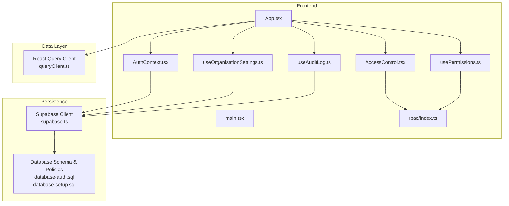
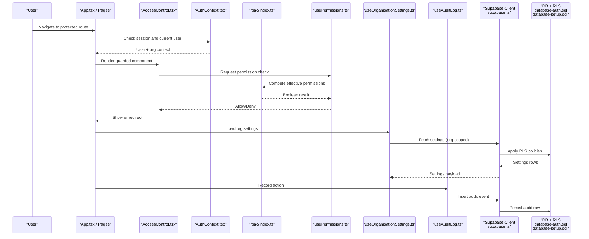
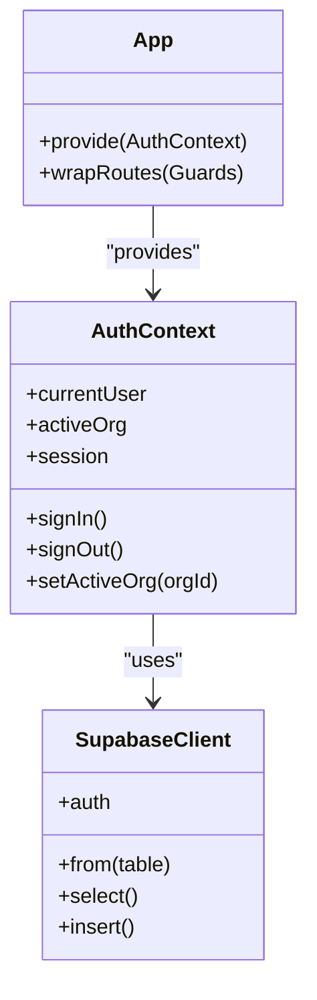
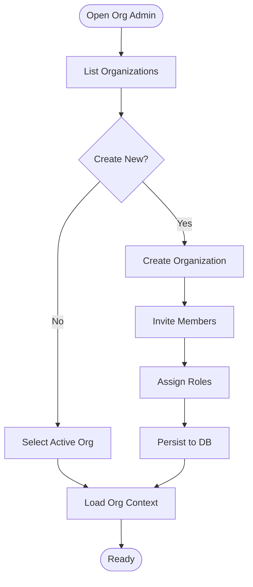
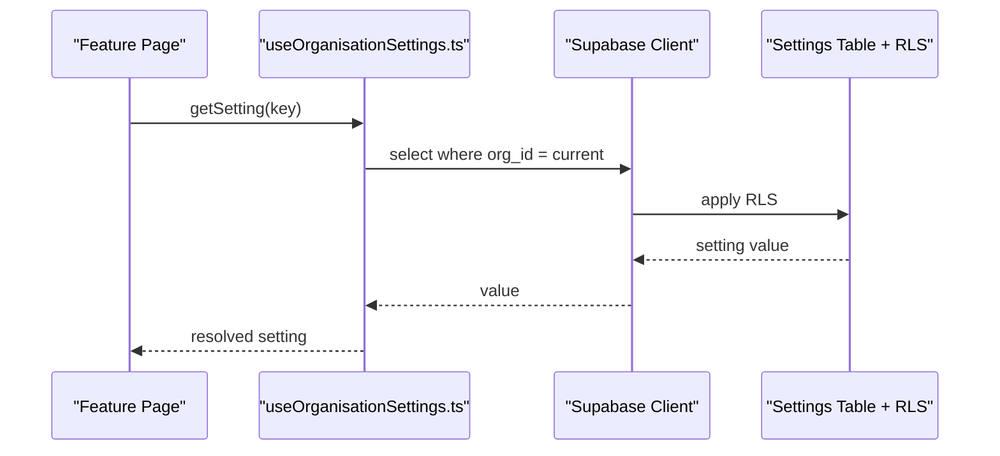
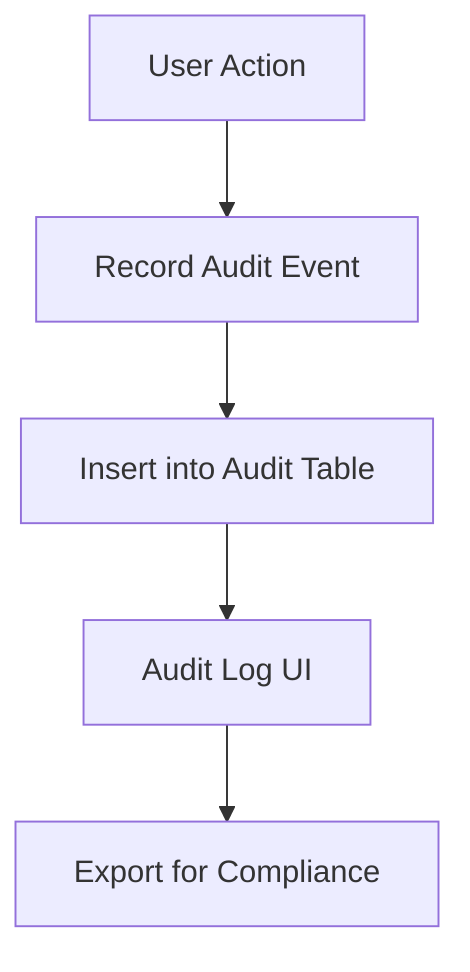
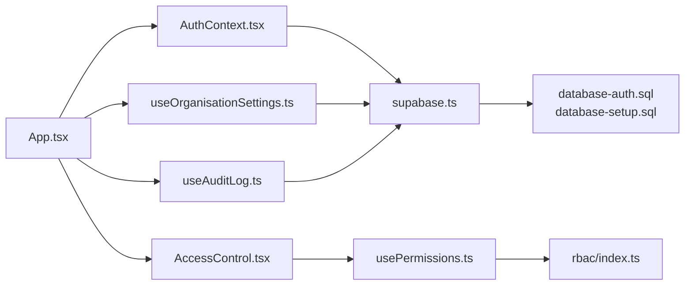

# Core Platform

<cite>
**Referenced Files in This Document**
- [AuthContext.tsx](file://src/contexts/AuthContext.tsx)
- [AccessControl.tsx](file://src/pages/AccessControl.tsx)
- [Organisation.tsx](file://src/pages/Organisation.tsx)
- [OrganizationManagement.tsx](file://src/pages/OrganizationManagement.tsx)
- [usePermissions.ts](file://src/hooks/usePermissions.ts)
- [useOrganisationSettings.ts](file://src/hooks/useOrganisationSettings.ts)
- [useAuditLog.ts](file://src/hooks/useAuditLog.ts)
- [rbac/index.ts](file://src/rbac/index.ts)
- [database-auth.sql](file://src/database-auth.sql)
- [database-setup.sql](file://src/database-setup.sql)
- [supabase.ts](file://src/supabase.ts)
- [queryClient.ts](file://src/queryClient.ts)
- [App.tsx](file://src/App.tsx)
- [main.tsx](file://src/main.tsx)
</cite>

## Table of Contents
1. [Introduction](#introduction)
2. [Project Structure](#project-structure)
3. [Core Components](#core-components)
4. [Architecture Overview](#architecture-overview)
5. [Detailed Component Analysis](#detailed-component-analysis)
6. [Dependency Analysis](#dependency-analysis)
7. [Performance Considerations](#performance-considerations)
8. [Troubleshooting Guide](#troubleshooting-guide)
9. [Conclusion](#conclusion)
10. [Appendices](#appendices)

## Introduction
This document describes the core platform functionality of the MEP Project ERP system with a focus on multi-tenant organization management, user authentication and authorization, role-based access control (RBAC), permissions, settings and configuration, audit logging, session management, security policies, and compliance features. It also provides practical guidance for extending permissions, creating custom roles, and implementing organization-specific configurations while addressing data isolation and scalability patterns suitable for enterprise deployments.

## Project Structure
The core platform spans several layers:
- Frontend context and hooks for auth, permissions, settings, and audit logs
- RBAC utilities and guards
- Database schema and RLS policies for tenant isolation and security
- Supabase client integration for persistence and real-time capabilities
- App bootstrap and routing that wires contexts and guards



**Diagram sources**
- [App.tsx](file://src/App.tsx)
- [main.tsx](file://src/main.tsx)
- [AuthContext.tsx](file://src/contexts/AuthContext.tsx)
- [AccessControl.tsx](file://src/pages/AccessControl.tsx)
- [usePermissions.ts](file://src/hooks/usePermissions.ts)
- [useOrganisationSettings.ts](file://src/hooks/useOrganisationSettings.ts)
- [useAuditLog.ts](file://src/hooks/useAuditLog.ts)
- [rbac/index.ts](file://src/rbac/index.ts)
- [supabase.ts](file://src/supabase.ts)
- [database-auth.sql](file://src/database-auth.sql)
- [database-setup.sql](file://src/database-setup.sql)
- [queryClient.ts](file://src/queryClient.ts)

**Section sources**
- [App.tsx](file://src/App.tsx)
- [main.tsx](file://src/main.tsx)
- [AuthContext.tsx](file://src/contexts/AuthContext.tsx)
- [AccessControl.tsx](file://src/pages/AccessControl.tsx)
- [usePermissions.ts](file://src/hooks/usePermissions.ts)
- [useOrganisationSettings.ts](file://src/hooks/useOrganisationSettings.ts)
- [useAuditLog.ts](file://src/hooks/useAuditLog.ts)
- [rbac/index.ts](file://src/rbac/index.ts)
- [supabase.ts](file://src/supabase.ts)
- [database-auth.sql](file://src/database-auth.sql)
- [database-setup.sql](file://src/database-setup.sql)
- [queryClient.ts](file://src/queryClient.ts)

## Core Components
- Authentication and Session Management
  - Centralized auth state via a React context that manages sign-in/out, token refresh, and current user identity.
  - Integrates with Supabase to persist sessions and handle provider flows.
- Multi-Tenant Organization Management
  - UI and logic for creating, switching, and managing organizations; membership and roles are scoped per organization.
- Role-Based Access Control (RBAC) and Permissions
  - RBAC utilities compute effective permissions from roles and explicit grants.
  - Permission checks are used by guards and feature toggles across the app.
- Settings and Configuration
  - Organization-scoped settings persisted through Supabase and consumed via hooks.
- Audit Logging
  - Hooks and UI for recording and viewing audit events tied to users and organizations.

**Section sources**
- [AuthContext.tsx](file://src/contexts/AuthContext.tsx)
- [Organisation.tsx](file://src/pages/Organisation.tsx)
- [OrganizationManagement.tsx](file://src/pages/OrganizationManagement.tsx)
- [usePermissions.ts](file://src/hooks/usePermissions.ts)
- [useOrganisationSettings.ts](file://src/hooks/useOrganisationSettings.ts)
- [useAuditLog.ts](file://src/hooks/useAuditLog.ts)
- [rbac/index.ts](file://src/rbac/index.ts)
- [supabase.ts](file://src/supabase.ts)
- [database-auth.sql](file://src/database-auth.sql)
- [database-setup.sql](file://src/database-setup.sql)

## Architecture Overview
The platform follows a layered architecture:
- Presentation layer: pages and components consume contexts and hooks.
- Authorization layer: RBAC utilities and guards enforce access decisions.
- Data layer: Supabase client performs authenticated queries with Row-Level Security (RLS).
- Persistence layer: database schema defines tenants, users, memberships, roles, permissions, settings, and audit logs.



**Diagram sources**
- [App.tsx](file://src/App.tsx)
- [AccessControl.tsx](file://src/pages/AccessControl.tsx)
- [AuthContext.tsx](file://src/contexts/AuthContext.tsx)
- [usePermissions.ts](file://src/hooks/usePermissions.ts)
- [rbac/index.ts](file://src/rbac/index.ts)
- [useOrganisationSettings.ts](file://src/hooks/useOrganisationSettings.ts)
- [useAuditLog.ts](file://src/hooks/useAuditLog.ts)
- [supabase.ts](file://src/supabase.ts)
- [database-auth.sql](file://src/database-auth.sql)
- [database-setup.sql](file://src/database-setup.sql)

## Detailed Component Analysis

### Authentication and Session Management
- Responsibilities
  - Initialize Supabase client and manage auth state.
  - Provide current user, active organization, and session lifecycle methods.
  - Handle redirects and error states during login/logout.
- Integration Points
  - Consumed by App bootstrap and all protected routes.
  - Used by RBAC and permission hooks to scope decisions.
- Security Considerations
  - Tokens are managed by Supabase; ensure secure storage and refresh strategies.
  - Enforce minimum session lifetime and idle timeouts at the application level if required.



**Diagram sources**
- [AuthContext.tsx](file://src/contexts/AuthContext.tsx)
- [supabase.ts](file://src/supabase.ts)
- [App.tsx](file://src/App.tsx)

**Section sources**
- [AuthContext.tsx](file://src/contexts/AuthContext.tsx)
- [supabase.ts](file://src/supabase.ts)
- [App.tsx](file://src/App.tsx)

### Multi-Tenant Organization Management
- Responsibilities
  - Create and manage organizations.
  - Manage memberships and assign roles within an organization.
  - Switch active organization context for the current user.
- Data Isolation
  - All queries include organization scoping; RLS enforces tenant boundaries at the database layer.
- UI Entry Points
  - Dedicated pages for organization administration and member management.



**Diagram sources**
- [Organisation.tsx](file://src/pages/Organisation.tsx)
- [OrganizationManagement.tsx](file://src/pages/OrganizationManagement.tsx)
- [database-setup.sql](file://src/database-setup.sql)

**Section sources**
- [Organisation.tsx](file://src/pages/Organisation.tsx)
- [OrganizationManagement.tsx](file://src/pages/OrganizationManagement.tsx)
- [database-setup.sql](file://src/database-setup.sql)

### Role-Based Access Control (RBAC) and Permissions
- Responsibilities
  - Define roles and permissions model.
  - Compute effective permissions for a user within the active organization.
  - Provide utility functions for permission checks used by guards and UI.
- Implementation Patterns
  - Centralized RBAC module exposes helpers for checking permissions.
  - Permission hook aggregates roles, explicit grants, and inherited permissions.
- Guarding Routes and Features
  - Access control wrapper prevents rendering unauthorized content and redirects appropriately.

```mermaid
classDiagram
class RBAC {
+hasPermission(userRoles, permission)
+getEffectivePermissions(userId, orgId)
}
class UsePermissions {
+check(permission) bool
+can(action, resource) bool
}
class AccessControl {
+Guard({requiredPermissions})
}
UsePermissions --> RBAC : "delegates"
AccessControl --> UsePermissions : "consumes"
```

**Diagram sources**
- [rbac/index.ts](file://src/rbac/index.ts)
- [usePermissions.ts](file://src/hooks/usePermissions.ts)
- [AccessControl.tsx](file://src/pages/AccessControl.tsx)

**Section sources**
- [rbac/index.ts](file://src/rbac/index.ts)
- [usePermissions.ts](file://src/hooks/usePermissions.ts)
- [AccessControl.tsx](file://src/pages/AccessControl.tsx)

### Settings and Configuration Management
- Responsibilities
  - Store and retrieve organization-specific settings.
  - Expose typed hooks for consuming settings throughout the app.
- Data Flow
  - Settings are fetched from Supabase with org scoping and cached via React Query.
- Extensibility
  - Add new setting keys and validation rules; expose them via the settings hook.



**Diagram sources**
- [useOrganisationSettings.ts](file://src/hooks/useOrganisationSettings.ts)
- [supabase.ts](file://src/supabase.ts)
- [database-setup.sql](file://src/database-setup.sql)

**Section sources**
- [useOrganisationSettings.ts](file://src/hooks/useOrganisationSettings.ts)
- [supabase.ts](file://src/supabase.ts)
- [database-setup.sql](file://src/database-setup.sql)

### Audit Logging Mechanisms
- Responsibilities
  - Record user actions and system events with context such as actor, organization, timestamp, and metadata.
  - Provide hooks and UI to view audit trails for compliance and troubleshooting.
- Data Model
  - Audit entries are stored in a dedicated table with RLS ensuring only authorized actors can read/write.
- Usage Pattern
  - Wrap critical mutations with audit logging calls to capture before/after state when needed.



**Diagram sources**
- [useAuditLog.ts](file://src/hooks/useAuditLog.ts)
- [database-setup.sql](file://src/database-setup.sql)

**Section sources**
- [useAuditLog.ts](file://src/hooks/useAuditLog.ts)
- [database-setup.sql](file://src/database-setup.sql)

## Dependency Analysis
Key dependencies and relationships:
- App bootstraps contexts and providers.
- AuthContext depends on Supabase client for session and identity.
- RBAC and permissions depend on user roles and organization membership data.
- Settings and audit hooks depend on Supabase and RLS policies.



**Diagram sources**
- [App.tsx](file://src/App.tsx)
- [AuthContext.tsx](file://src/contexts/AuthContext.tsx)
- [AccessControl.tsx](file://src/pages/AccessControl.tsx)
- [usePermissions.ts](file://src/hooks/usePermissions.ts)
- [rbac/index.ts](file://src/rbac/index.ts)
- [useOrganisationSettings.ts](file://src/hooks/useOrganisationSettings.ts)
- [useAuditLog.ts](file://src/hooks/useAuditLog.ts)
- [supabase.ts](file://src/supabase.ts)
- [database-auth.sql](file://src/database-auth.sql)
- [database-setup.sql](file://src/database-setup.sql)

**Section sources**
- [App.tsx](file://src/App.tsx)
- [AuthContext.tsx](file://src/contexts/AuthContext.tsx)
- [AccessControl.tsx](file://src/pages/AccessControl.tsx)
- [usePermissions.ts](file://src/hooks/usePermissions.ts)
- [rbac/index.ts](file://src/rbac/index.ts)
- [useOrganisationSettings.ts](file://src/hooks/useOrganisationSettings.ts)
- [useAuditLog.ts](file://src/hooks/useAuditLog.ts)
- [supabase.ts](file://src/supabase.ts)
- [database-auth.sql](file://src/database-auth.sql)
- [database-setup.sql](file://src/database-setup.sql)

## Performance Considerations
- Cache settings and permissions using React Query to reduce network overhead.
- Defer heavy permission computations until after the active organization is set.
- Paginate and filter audit logs to avoid large payloads.
- Use minimal re-renders by memoizing permission checks and settings selectors.
- Prefer server-side filtering and RLS over client-side post-processing.

[No sources needed since this section provides general guidance]

## Troubleshooting Guide
Common issues and resolutions:
- Unauthorized access errors
  - Verify user roles and membership in the active organization.
  - Ensure RBAC definitions include the required permissions.
- Missing organization settings
  - Confirm settings exist for the active organization and RLS allows reads.
- Audit log gaps
  - Check that audit logging is invoked around critical mutations and that insert policies allow writes.
- Session expiration
  - Inspect Supabase session state and refresh behavior; confirm token handling in the auth context.

**Section sources**
- [AccessControl.tsx](file://src/pages/AccessControl.tsx)
- [usePermissions.ts](file://src/hooks/usePermissions.ts)
- [useOrganisationSettings.ts](file://src/hooks/useOrganisationSettings.ts)
- [useAuditLog.ts](file://src/hooks/useAuditLog.ts)
- [AuthContext.tsx](file://src/contexts/AuthContext.tsx)
- [database-auth.sql](file://src/database-auth.sql)
- [database-setup.sql](file://src/database-setup.sql)

## Conclusion
The core platform provides a robust foundation for multi-tenant operations, secure authentication, fine-grained RBAC, configurable settings, and comprehensive auditability. By leveraging Supabase’s RLS and a clear separation between presentation, authorization, and data layers, the system supports scalable enterprise deployments with strong data isolation and compliance capabilities.

[No sources needed since this section summarizes without analyzing specific files]

## Appendices

### Practical Examples

- Extending Permissions
  - Add a new permission key in the RBAC module and update permission checks in relevant hooks and guards.
  - Reference paths:
    - [rbac/index.ts](file://src/rbac/index.ts)
    - [usePermissions.ts](file://src/hooks/usePermissions.ts)
    - [AccessControl.tsx](file://src/pages/AccessControl.tsx)

- Creating Custom Roles
  - Define a new role in the organization membership model and assign it to users.
  - Ensure RLS policies reference the role for appropriate access.
  - Reference paths:
    - [OrganizationManagement.tsx](file://src/pages/OrganizationManagement.tsx)
    - [database-setup.sql](file://src/database-setup.sql)
    - [database-auth.sql](file://src/database-auth.sql)

- Implementing Organization-Specific Configurations
  - Add new setting keys and default values; expose them via the settings hook.
  - Validate inputs and persist changes with proper org scoping.
  - Reference paths:
    - [useOrganisationSettings.ts](file://src/hooks/useOrganisationSettings.ts)
    - [database-setup.sql](file://src/database-setup.sql)

- Adding Audit Events
  - Wrap critical mutations with audit logging calls including actor, organization, and metadata.
  - Reference paths:
    - [useAuditLog.ts](file://src/hooks/useAuditLog.ts)
    - [database-setup.sql](file://src/database-setup.sql)

**Section sources**
- [rbac/index.ts](file://src/rbac/index.ts)
- [usePermissions.ts](file://src/hooks/usePermissions.ts)
- [AccessControl.tsx](file://src/pages/AccessControl.tsx)
- [OrganizationManagement.tsx](file://src/pages/OrganizationManagement.tsx)
- [useOrganisationSettings.ts](file://src/hooks/useOrganisationSettings.ts)
- [useAuditLog.ts](file://src/hooks/useAuditLog.ts)
- [database-setup.sql](file://src/database-setup.sql)
- [database-auth.sql](file://src/database-auth.sql)