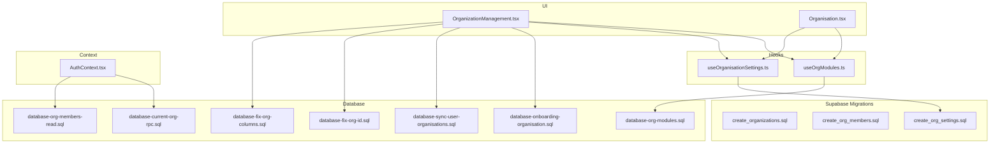
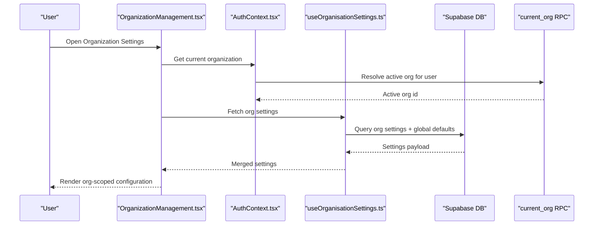
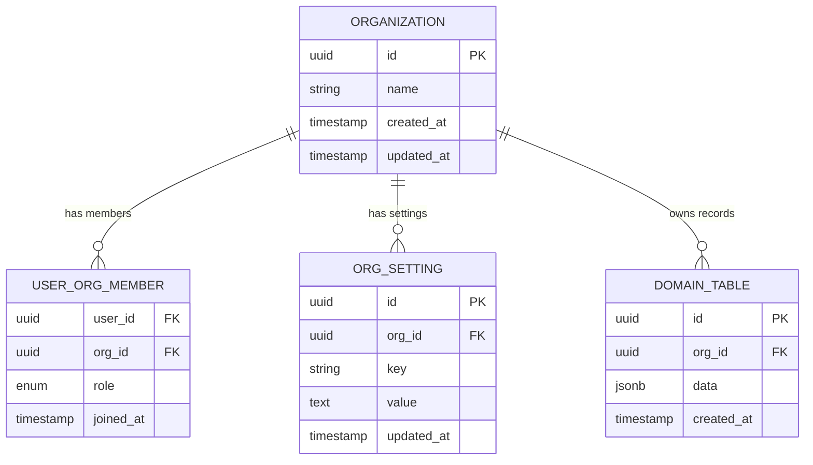
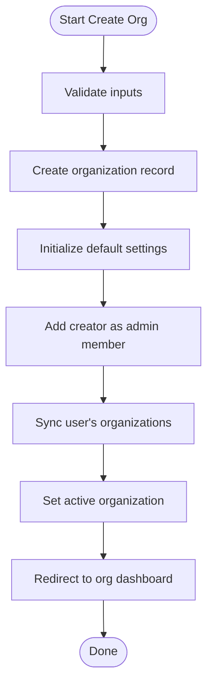
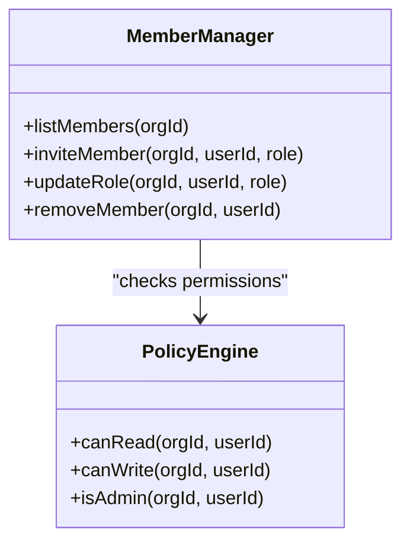
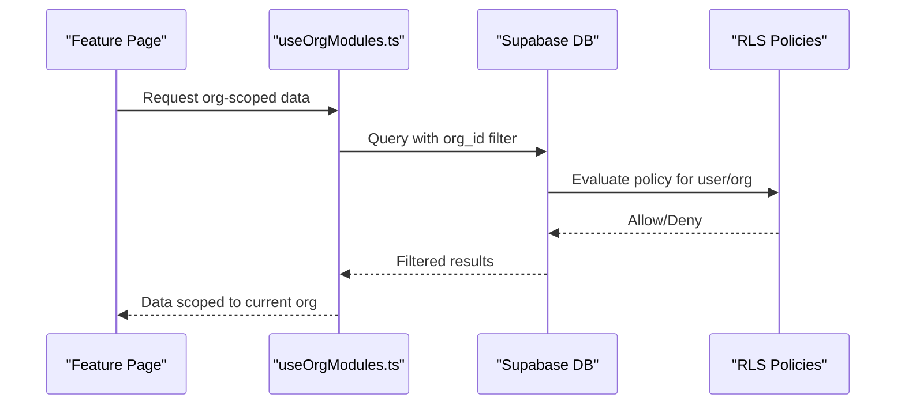
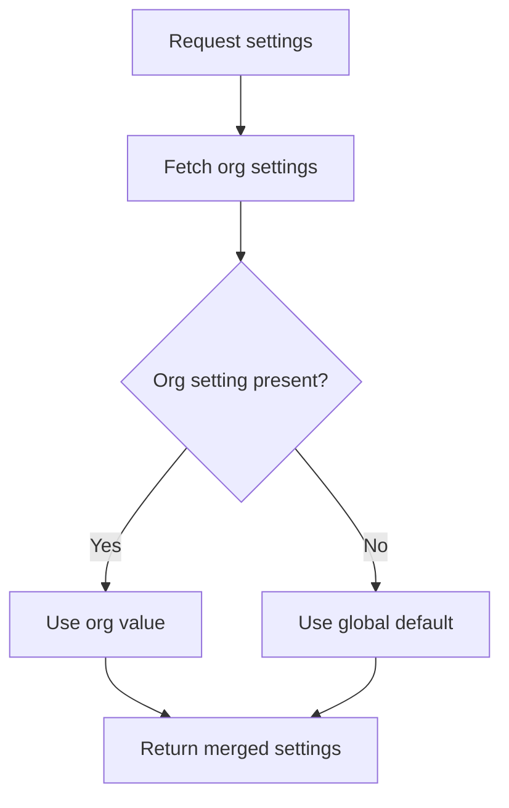
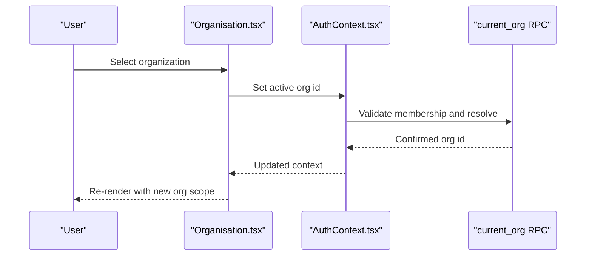
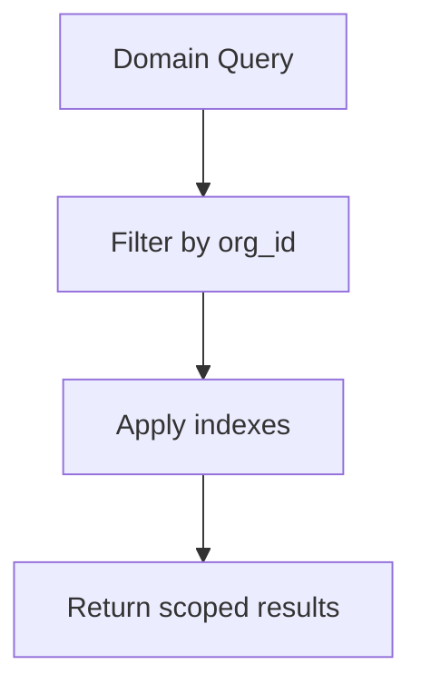
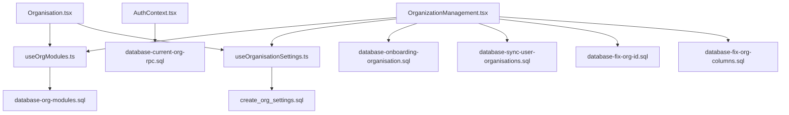

# Organization Management

<cite>
**Referenced Files in This Document**
- [OrganizationManagement.tsx](file://src/pages/OrganizationManagement.tsx)
- [Organisation.tsx](file://src/pages/Organisation.tsx)
- [AuthContext.tsx](file://src/contexts/AuthContext.tsx)
- [useOrgModules.ts](file://src/hooks/useOrgModules.ts)
- [useOrganisationSettings.ts](file://src/hooks/useOrganisationSettings.ts)
- [database-current-org-rpc.sql](file://src/database-current-org-rpc.sql)
- [database-onboarding-organisation.sql](file://src/database-onboarding-organisation.sql)
- [database-fix-org-columns.sql](file://src/database-fix-org-columns.sql)
- [database-fix-org-id.sql](file://src/database-fix-org-id.sql)
- [database-org-members-read.sql](file://src/database-org-members-read.sql)
- [database-org-modules.sql](file://src/database-org-modules.sql)
- [database-sync-user-organisations.sql](file://src/database-sync-user-organisations.sql)
- [migrations/add-organisation-to-po-and-clients.sql](file://migrations/add-organisation-to-po-and-clients.sql)
- [supabase/migrations/20240101000000_create_organizations.sql](file://supabase/migrations/20240101000000_create_organizations.sql)
- [supabase/migrations/20240101000001_create_org_members.sql](file://supabase/migrations/20240101000001_create_org_members.sql)
- [supabase/migrations/20240101000002_create_org_settings.sql](file://supabase/migrations/20240101000002_create_org_settings.sql)
</cite>

## Table of Contents
1. [Introduction](#introduction)
2. [Project Structure](#project-structure)
3. [Core Components](#core-components)
4. [Architecture Overview](#architecture-overview)
5. [Detailed Component Analysis](#detailed-component-analysis)
6. [Dependency Analysis](#dependency-analysis)
7. [Performance Considerations](#performance-considerations)
8. [Troubleshooting Guide](#troubleshooting-guide)
9. [Conclusion](#conclusion)
10. [Appendices](#appendices)

## Introduction
This document explains the multi-tenant organization management system implemented in the application. It covers the organizational hierarchy, tenant isolation patterns, data segregation strategies, and the end-to-end workflows for creating organizations, managing members and roles, and controlling cross-organization access. It also documents settings inheritance (global defaults vs. organization-specific overrides), context providers for switching organizations, and how data is filtered by organization ID. Practical examples are provided to guide implementation of organization-scoped features, along with scalability considerations for enterprise deployments and migration strategies between organizations.

## Project Structure
The organization feature spans UI pages, hooks, contexts, database migrations, and SQL utilities:
- Pages: Organization creation and management interfaces
- Hooks: Organization modules and settings retrieval
- Context: Authentication and current organization context
- Database: Migrations and RPCs for organization membership, settings, and current org resolution
- Migrations: Backfilling organization IDs into existing tables

**Diagram sources**
- [OrganizationManagement.tsx](file://src/pages/OrganizationManagement.tsx)
- [Organisation.tsx](file://src/pages/Organisation.tsx)
- [useOrgModules.ts](file://src/hooks/useOrgModules.ts)
- [useOrganisationSettings.ts](file://src/hooks/useOrganisationSettings.ts)
- [AuthContext.tsx](file://src/contexts/AuthContext.tsx)
- [database-current-org-rpc.sql](file://src/database-current-org-rpc.sql)
- [database-onboarding-organisation.sql](file://src/database-onboarding-organisation.sql)
- [database-fix-org-columns.sql](file://src/database-fix-org-columns.sql)
- [database-fix-org-id.sql](file://src/database-fix-org-id.sql)
- [database-org-members-read.sql](file://src/database-org-members-read.sql)
- [database-org-modules.sql](file://src/database-org-modules.sql)
- [database-sync-user-organisations.sql](file://src/database-sync-user-organisations.sql)
- [supabase/migrations/20240101000000_create_organizations.sql](file://supabase/migrations/20240101000000_create_organizations.sql)
- [supabase/migrations/20240101000001_create_org_members.sql](file://supabase/migrations/20240101000001_create_org_members.sql)
- [supabase/migrations/20240101000002_create_org_settings.sql](file://supabase/migrations/20240101000002_create_org_settings.sql)

**Section sources**
- [OrganizationManagement.tsx](file://src/pages/OrganizationManagement.tsx)
- [Organisation.tsx](file://src/pages/Organisation.tsx)
- [useOrgModules.ts](file://src/hooks/useOrgModules.ts)
- [useOrganisationSettings.ts](file://src/hooks/useOrganisationSettings.ts)
- [AuthContext.tsx](file://src/contexts/AuthContext.tsx)
- [database-current-org-rpc.sql](file://src/database-current-org-rpc.sql)
- [database-onboarding-organisation.sql](file://src/database-onboarding-organisation.sql)
- [database-fix-org-columns.sql](file://src/database-fix-org-columns.sql)
- [database-fix-org-id.sql](file://src/database-fix-org-id.sql)
- [database-org-members-read.sql](file://src/database-org-members-read.sql)
- [database-org-modules.sql](file://src/database-org-modules.sql)
- [database-sync-user-organisations.sql](file://src/database-sync-user-organisations.sql)
- [supabase/migrations/20240101000000_create_organizations.sql](file://supabase/migrations/20240101000000_create_organizations.sql)
- [supabase/migrations/20240101000001_create_org_members.sql](file://supabase/migrations/20240101000001_create_org_members.sql)
- [supabase/migrations/20240101000002_create_org_settings.sql](file://supabase/migrations/20240101000002_create_org_settings.sql)

## Core Components
- Organization Creation Workflow: Orchestrated from the organization management page, invoking onboarding scripts and syncing user memberships.
- Member Management Interfaces: Lists members, invites, updates roles, and enforces read/write policies via database-level RLS.
- Settings Inheritance Model: Global defaults are merged with organization-specific overrides; organization values take precedence.
- Organization Switching: Auth context resolves the active organization per session using an RPC and persists it for subsequent requests.
- Data Filtering: All domain queries include organization_id filters to ensure tenant isolation.

Key responsibilities:
- UI orchestration and user flows
- Hook-based data fetching and caching
- Context-driven current organization selection
- Database schema and policies for isolation

**Section sources**
- [OrganizationManagement.tsx](file://src/pages/OrganizationManagement.tsx)
- [Organisation.tsx](file://src/pages/Organisation.tsx)
- [useOrgModules.ts](file://src/hooks/useOrgModules.ts)
- [useOrganisationSettings.ts](file://src/hooks/useOrganisationSettings.ts)
- [AuthContext.tsx](file://src/contexts/AuthContext.tsx)
- [database-current-org-rpc.sql](file://src/database-current-org-rpc.sql)
- [database-onboarding-organisation.sql](file://src/database-onboarding-organisation.sql)
- [database-org-members-read.sql](file://src/database-org-members-read.sql)
- [database-org-modules.sql](file://src/database-org-modules.sql)
- [database-sync-user-organisations.sql](file://src/database-sync-user-organisations.sql)

## Architecture Overview
The system follows a clear separation of concerns:
- UI layer manages user interactions and state
- Hooks encapsulate data fetching and business logic
- Context provides global current organization and auth state
- Database layer enforces tenant isolation through foreign keys, RLS policies, and helper functions/RPCs

**Diagram sources**
- [OrganizationManagement.tsx](file://src/pages/OrganizationManagement.tsx)
- [AuthContext.tsx](file://src/contexts/AuthContext.tsx)
- [useOrganisationSettings.ts](file://src/hooks/useOrganisationSettings.ts)
- [database-current-org-rpc.sql](file://src/database-current-org-rpc.sql)

## Detailed Component Analysis

### Organizational Hierarchy and Tenant Isolation
- Hierarchy: Organizations contain users and resources. Users can belong to multiple organizations with distinct roles.
- Isolation Patterns:
  - Foreign key constraints on all domain tables reference organization_id
  - Row-Level Security (RLS) policies restrict reads/writes to the current organization
  - Queries always filter by organization_id at the API or hook level
  - Current organization resolution uses an RPC that validates user membership

**Diagram sources**
- [supabase/migrations/20240101000000_create_organizations.sql](file://supabase/migrations/20240101000000_create_organizations.sql)
- [supabase/migrations/20240101000001_create_org_members.sql](file://supabase/migrations/20240101000001_create_org_members.sql)
- [supabase/migrations/20240101000002_create_org_settings.sql](file://supabase/migrations/20240101000002_create_org_settings.sql)
- [database-org-members-read.sql](file://src/database-org-members-read.sql)

**Section sources**
- [supabase/migrations/20240101000000_create_organizations.sql](file://supabase/migrations/20240101000000_create_organizations.sql)
- [supabase/migrations/20240101000001_create_org_members.sql](file://supabase/migrations/20240101000001_create_org_members.sql)
- [supabase/migrations/20240101000002_create_org_settings.sql](file://supabase/migrations/20240101000002_create_org_settings.sql)
- [database-org-members-read.sql](file://src/database-org-members-read.sql)

### Organization Creation Workflow
- Entry point: Organization management page orchestrates creation
- Steps:
  - Validate input and create organization record
  - Initialize default settings for the new organization
  - Add creator as admin member
  - Sync user’s organization list and set active organization
  - Redirect to organization dashboard

**Diagram sources**
- [OrganizationManagement.tsx](file://src/pages/OrganizationManagement.tsx)
- [database-onboarding-organisation.sql](file://src/database-onboarding-organisation.sql)
- [database-sync-user-organisations.sql](file://src/database-sync-user-organisations.sql)

**Section sources**
- [OrganizationManagement.tsx](file://src/pages/OrganizationManagement.tsx)
- [database-onboarding-organisation.sql](file://src/database-onboarding-organisation.sql)
- [database-sync-user-organisations.sql](file://src/database-sync-user-organisations.sql)

### Member Management Interfaces
- Capabilities:
  - List members with roles
  - Invite new members
  - Update or remove roles
  - Enforce permissions based on roles
- Implementation highlights:
  - Read-only policy for non-admins where applicable
  - Admin-only mutation endpoints
  - Membership table stores user_id, org_id, and role

**Diagram sources**
- [database-org-members-read.sql](file://src/database-org-members-read.sql)
- [supabase/migrations/20240101000001_create_org_members.sql](file://supabase/migrations/20240101000001_create_org_members.sql)

**Section sources**
- [database-org-members-read.sql](file://src/database-org-members-read.sql)
- [supabase/migrations/20240101000001_create_org_members.sql](file://supabase/migrations/20240101000001_create_org_members.sql)

### Cross-Organization Data Access Controls
- Rules:
  - All domain queries must include organization_id filter
  - RLS policies enforce tenant isolation at the database level
  - Cross-org access requires explicit permission or admin role
- Enforcement:
  - Hooks automatically inject organization_id into queries
  - RPCs validate membership before returning data

**Diagram sources**
- [useOrgModules.ts](file://src/hooks/useOrgModules.ts)
- [database-org-members-read.sql](file://src/database-org-members-read.sql)

**Section sources**
- [useOrgModules.ts](file://src/hooks/useOrgModules.ts)
- [database-org-members-read.sql](file://src/database-org-members-read.sql)

### Settings Inheritance Model
- Global defaults are defined centrally
- Organization-specific settings override global defaults
- Resolution order:
  - If org setting exists, use it
  - Else fall back to global default
- Implementation:
  - Hook merges settings from org and global tables
  - UI consumes merged settings for behavior customization

**Diagram sources**
- [useOrganisationSettings.ts](file://src/hooks/useOrganisationSettings.ts)
- [supabase/migrations/20240101000002_create_org_settings.sql](file://supabase/migrations/20240101000002_create_org_settings.sql)

**Section sources**
- [useOrganisationSettings.ts](file://src/hooks/useOrganisationSettings.ts)
- [supabase/migrations/20240101000002_create_org_settings.sql](file://supabase/migrations/20240101000002_create_org_settings.sql)

### Organization Switching and Context Providers
- Current organization resolution:
  - Auth context calls an RPC to determine the active organization for the logged-in user
  - The resolved org id is stored in context and used across the app
- Switching flow:
  - User selects a different organization
  - Context updates active org id
  - Subsequent queries re-run with the new org_id filter

**Diagram sources**
- [Organisation.tsx](file://src/pages/Organisation.tsx)
- [AuthContext.tsx](file://src/contexts/AuthContext.tsx)
- [database-current-org-rpc.sql](file://src/database-current-org-rpc.sql)

**Section sources**
- [Organisation.tsx](file://src/pages/Organisation.tsx)
- [AuthContext.tsx](file://src/contexts/AuthContext.tsx)
- [database-current-org-rpc.sql](file://src/database-current-org-rpc.sql)

### Data Filtering by Organization ID
- Strategy:
  - Every domain query includes organization_id
  - Hooks centralize filtering logic to avoid duplication
  - Database indexes on organization_id improve performance
- Examples:
  - Projects, clients, purchase orders, quotations, and other entities are scoped to organization_id

**Diagram sources**
- [useOrgModules.ts](file://src/hooks/useOrgModules.ts)
- [migrations/add-organisation-to-po-and-clients.sql](file://migrations/add-organisation-to-po-and-clients.sql)
- [database-fix-org-id.sql](file://src/database-fix-org-id.sql)
- [database-fix-org-columns.sql](file://src/database-fix-org-columns.sql)

**Section sources**
- [useOrgModules.ts](file://src/hooks/useOrgModules.ts)
- [migrations/add-organisation-to-po-and-clients.sql](file://migrations/add-organisation-to-po-and-clients.sql)
- [database-fix-org-id.sql](file://src/database-fix-org-id.sql)
- [database-fix-org-columns.sql](file://src/database-fix-org-columns.sql)

### Practical Examples

#### Creating a New Organization
- Steps:
  - Navigate to organization management
  - Fill required fields (name, description)
  - Submit form to create organization
  - System initializes default settings and adds creator as admin
  - Redirect to organization dashboard

**Section sources**
- [OrganizationManagement.tsx](file://src/pages/OrganizationManagement.tsx)
- [database-onboarding-organisation.sql](file://src/database-onboarding-organisation.sql)

#### Managing Members and Roles
- Actions:
  - View member list with roles
  - Invite new members via email or user id
  - Update roles (admin, manager, member)
  - Remove members when necessary
- Permissions:
  - Only admins can manage members
  - Non-admins have read-only access to member lists

**Section sources**
- [database-org-members-read.sql](file://src/database-org-members-read.sql)
- [supabase/migrations/20240101000001_create_org_members.sql](file://supabase/migrations/20240101000001_create_org_members.sql)

#### Implementing Organization-Scoped Features
- Pattern:
  - Use hooks to fetch data filtered by current organization
  - Ensure mutations include organization_id
  - Leverage RLS policies for security
- Example modules:
  - Materials, projects, invoices, tasks

**Section sources**
- [useOrgModules.ts](file://src/hooks/useOrgModules.ts)
- [database-org-modules.sql](file://src/database-org-modules.sql)

## Dependency Analysis
The following diagram shows key dependencies among components:

**Diagram sources**
- [OrganizationManagement.tsx](file://src/pages/OrganizationManagement.tsx)
- [Organisation.tsx](file://src/pages/Organisation.tsx)
- [useOrgModules.ts](file://src/hooks/useOrgModules.ts)
- [useOrganisationSettings.ts](file://src/hooks/useOrganisationSettings.ts)
- [AuthContext.tsx](file://src/contexts/AuthContext.tsx)
- [database-current-org-rpc.sql](file://src/database-current-org-rpc.sql)
- [database-onboarding-organisation.sql](file://src/database-onboarding-organisation.sql)
- [database-fix-org-columns.sql](file://src/database-fix-org-columns.sql)
- [database-fix-org-id.sql](file://src/database-fix-org-id.sql)
- [database-org-modules.sql](file://src/database-org-modules.sql)
- [database-sync-user-organisations.sql](file://src/database-sync-user-organisations.sql)
- [supabase/migrations/20240101000002_create_org_settings.sql](file://supabase/migrations/20240101000002_create_org_settings.sql)

**Section sources**
- [OrganizationManagement.tsx](file://src/pages/OrganizationManagement.tsx)
- [Organisation.tsx](file://src/pages/Organisation.tsx)
- [useOrgModules.ts](file://src/hooks/useOrgModules.ts)
- [useOrganisationSettings.ts](file://src/hooks/useOrganisationSettings.ts)
- [AuthContext.tsx](file://src/contexts/AuthContext.tsx)
- [database-current-org-rpc.sql](file://src/database-current-org-rpc.sql)
- [database-onboarding-organisation.sql](file://src/database-onboarding-organisation.sql)
- [database-fix-org-columns.sql](file://src/database-fix-org-columns.sql)
- [database-fix-org-id.sql](file://src/database-fix-org-id.sql)
- [database-org-modules.sql](file://src/database-org-modules.sql)
- [database-sync-user-organisations.sql](file://src/database-sync-user-organisations.sql)
- [supabase/migrations/20240101000002_create_org_settings.sql](file://supabase/migrations/20240101000002_create_org_settings.sql)

## Performance Considerations
- Indexes:
  - Ensure organization_id is indexed on all domain tables
  - Composite indexes for frequently queried combinations (e.g., org_id + status)
- Query Optimization:
  - Prefer server-side filtering with organization_id
  - Avoid client-side filtering to reduce payload size
- Caching:
  - Cache organization settings and module flags
  - Invalidate caches on settings changes
- Scalability:
  - Partition large tables by organization_id if needed
  - Use connection pooling and read replicas for heavy workloads
- RLS Efficiency:
  - Keep policies simple and indexed
  - Avoid complex joins in policies

[No sources needed since this section provides general guidance]

## Troubleshooting Guide
Common issues and resolutions:
- Missing organization_id in queries:
  - Verify hooks inject org_id filters
  - Check database migrations added organization columns
- RLS Denials:
  - Confirm user membership in the target organization
  - Review policy definitions for correct conditions
- Settings Not Overriding:
  - Ensure org settings exist for the key
  - Validate fallback to global defaults
- Current Org Resolution Failures:
  - Inspect RPC logic for membership validation
  - Check context updates after switching organizations

**Section sources**
- [database-fix-org-id.sql](file://src/database-fix-org-id.sql)
- [database-fix-org-columns.sql](file://src/database-fix-org-columns.sql)
- [database-current-org-rpc.sql](file://src/database-current-org-rpc.sql)
- [AuthContext.tsx](file://src/contexts/AuthContext.tsx)

## Conclusion
The multi-tenant organization management system provides robust tenant isolation through database constraints, RLS policies, and consistent filtering by organization_id. The architecture separates UI, hooks, context, and database layers for clarity and maintainability. Settings inheritance ensures flexibility while preserving global defaults. For enterprise scale, focus on indexing, partitioning, caching, and efficient RLS policies. Migration strategies should backfill organization_id across existing tables and validate data integrity post-migration.

[No sources needed since this section summarizes without analyzing specific files]

## Appendices

### Data Models Reference
- Organizations: Core tenant entity
- Organization Members: User membership and roles
- Organization Settings: Key-value overrides for global defaults
- Domain Tables: All feature tables include organization_id

**Section sources**
- [supabase/migrations/20240101000000_create_organizations.sql](file://supabase/migrations/20240101000000_create_organizations.sql)
- [supabase/migrations/20240101000001_create_org_members.sql](file://supabase/migrations/20240101000001_create_org_members.sql)
- [supabase/migrations/20240101000002_create_org_settings.sql](file://supabase/migrations/20240101000002_create_org_settings.sql)

### Migration Strategies Between Organizations
- Export data scoped to source organization
- Transform identifiers and references
- Import into target organization with updated organization_id
- Validate referential integrity and run consistency checks
- Update memberships and permissions in target organization

**Section sources**
- [migrations/add-organisation-to-po-and-clients.sql](file://migrations/add-organisation-to-po-and-clients.sql)
- [database-sync-user-organisations.sql](file://src/database-sync-user-organisations.sql)