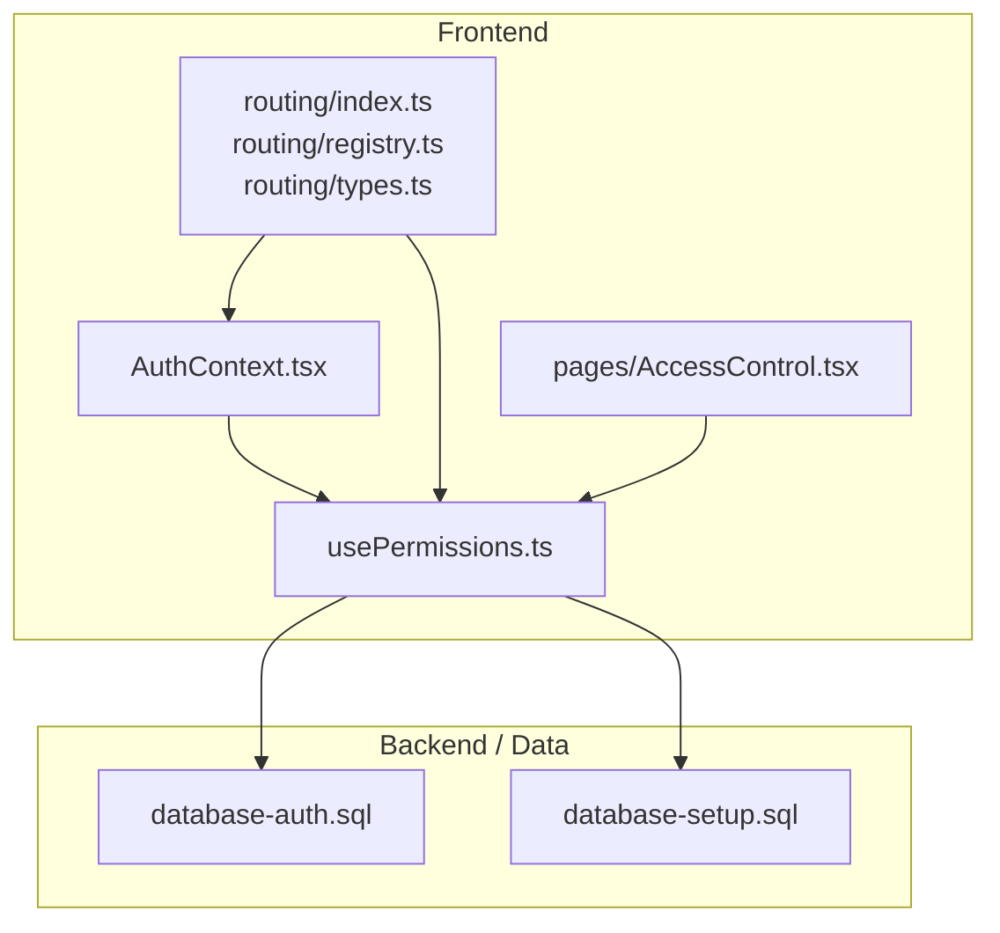
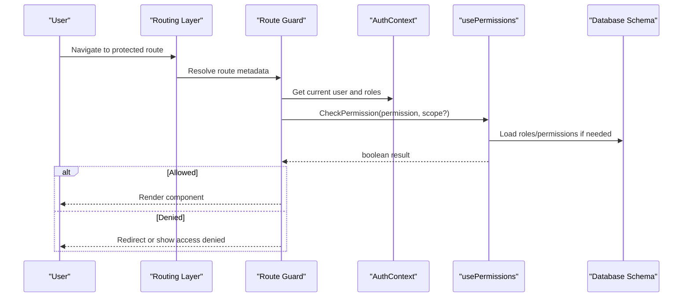
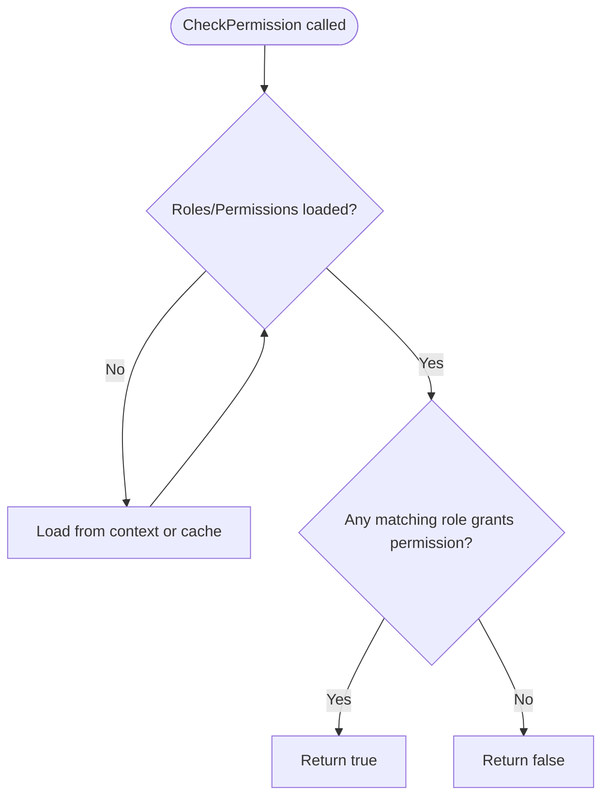
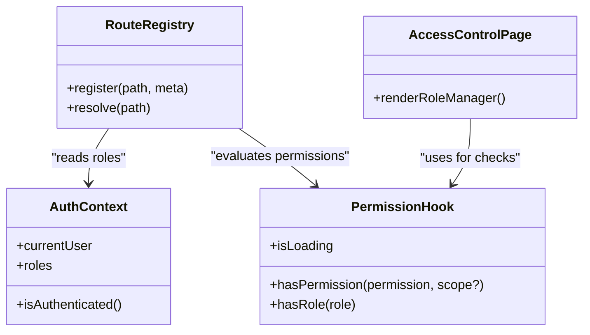
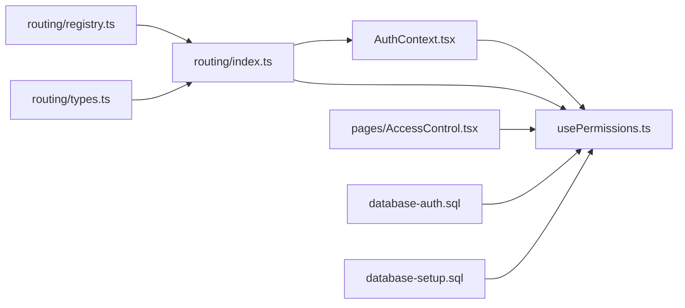

# Role-Based Access Control (RBAC)

<cite>
**Referenced Files in This Document**
- [usePermissions.ts](file://src/hooks/usePermissions.ts)
- [AuthContext.tsx](file://src/contexts/AuthContext.tsx)
- [AccessControl.tsx](file://src/pages/AccessControl.tsx)
- [index.ts](file://src/app/routing/index.ts)
- [registry.ts](file://src/app/routing/registry.ts)
- [types.ts](file://src/app/routing/types.ts)
- [database-auth.sql](file://src/database-auth.sql)
- [database-setup.sql](file://src/database-setup.sql)
</cite>

## Table of Contents
1. [Introduction](#introduction)
2. [Project Structure](#project-structure)
3. [Core Components](#core-components)
4. [Architecture Overview](#architecture-overview)
5. [Detailed Component Analysis](#detailed-component-analysis)
6. [Dependency Analysis](#dependency-analysis)
7. [Performance Considerations](#performance-considerations)
8. [Troubleshooting Guide](#troubleshooting-guide)
9. [Conclusion](#conclusion)

## Introduction
This document explains the Role-Based Access Control (RBAC) system implemented in the application. It covers the permission model architecture, role definitions, and inheritance patterns; the permission catalog and dynamic evaluation; runtime access control mechanisms; usage of PermissionGuard-like components and hook-based checks; declarative access control patterns; creating custom permissions and role hierarchies; fine-grained controls; protecting routes, components, and API endpoints; performance optimization for permission checks; caching strategies; and audit logging for access decisions.

## Project Structure
The RBAC implementation spans several layers:
- Authentication context that provides user identity and roles
- A dedicated hook for permission evaluation
- Routing configuration with guarded routes
- UI-level guards and pages for access management
- Database schema files defining roles, permissions, and relationships

**Diagram sources**
- [AuthContext.tsx](file://src/contexts/AuthContext.tsx)
- [usePermissions.ts](file://src/hooks/usePermissions.ts)
- [index.ts](file://src/app/routing/index.ts)
- [registry.ts](file://src/app/routing/registry.ts)
- [types.ts](file://src/app/routing/types.ts)
- [AccessControl.tsx](file://src/pages/AccessControl.tsx)
- [database-auth.sql](file://src/database-auth.sql)
- [database-setup.sql](file://src/database-setup.sql)

**Section sources**
- [AuthContext.tsx](file://src/contexts/AuthContext.tsx)
- [usePermissions.ts](file://src/hooks/usePermissions.ts)
- [index.ts](file://src/app/routing/index.ts)
- [registry.ts](file://src/app/routing/registry.ts)
- [types.ts](file://src/app/routing/types.ts)
- [AccessControl.tsx](file://src/pages/AccessControl.tsx)
- [database-auth.sql](file://src/database-auth.sql)
- [database-setup.sql](file://src/database-setup.sql)

## Core Components
- AuthContext: Provides authenticated user information and current roles to the app.
- usePermissions: Hook that evaluates whether a user has a given permission or role, including inheritance logic.
- Routing layer: Guards route registration and navigation based on required permissions.
- AccessControl page: Centralized UI for managing roles and permissions.

Key responsibilities:
- Centralize identity and role state
- Expose a consistent API for permission checks
- Enforce access at routing boundaries
- Provide UI for administration of roles and permissions

**Section sources**
- [AuthContext.tsx](file://src/contexts/AuthContext.tsx)
- [usePermissions.ts](file://src/hooks/usePermissions.ts)
- [index.ts](file://src/app/routing/index.ts)
- [registry.ts](file://src/app/routing/registry.ts)
- [types.ts](file://src/app/routing/types.ts)
- [AccessControl.tsx](file://src/pages/AccessControl.tsx)

## Architecture Overview
The RBAC architecture follows a layered approach:
- Identity and roles are provided by the authentication context
- Permission evaluation is centralized in a hook that can incorporate role inheritance and resource scoping
- Routes declare required permissions via registry types and guard during navigation
- Admin UI allows configuring roles and permissions

**Diagram sources**
- [index.ts](file://src/app/routing/index.ts)
- [registry.ts](file://src/app/routing/registry.ts)
- [types.ts](file://src/app/routing/types.ts)
- [AuthContext.tsx](file://src/contexts/AuthContext.tsx)
- [usePermissions.ts](file://src/hooks/usePermissions.ts)
- [database-auth.sql](file://src/database-auth.sql)
- [database-setup.sql](file://src/database-setup.sql)

## Detailed Component Analysis

### Permission Model and Inheritance
- Roles define sets of permissions.
- Permissions may be hierarchical or grouped by domain (e.g., materials, invoices).
- Role inheritance allows higher-level roles to include all permissions of lower-level roles.
- Resource-scoped permissions enable fine-grained control (e.g., per organization or project).

Implementation guidance:
- Define canonical permission identifiers and group them logically.
- Represent role-to-permission mappings centrally.
- Implement inheritance by composing parent role permissions into child roles.

**Section sources**
- [usePermissions.ts](file://src/hooks/usePermissions.ts)
- [database-auth.sql](file://src/database-auth.sql)
- [database-setup.sql](file://src/database-setup.sql)

### Permission Catalog System
- Maintain a single source of truth for available permissions.
- Group permissions by feature/module to simplify maintenance.
- Export typed constants or enums for compile-time safety.

Best practices:
- Avoid ad-hoc strings; prefer centralized catalogs.
- Keep descriptions and tags for UI rendering and audits.

**Section sources**
- [usePermissions.ts](file://src/hooks/usePermissions.ts)

### Dynamic Permission Evaluation
- The permission hook should support:
  - Direct permission checks
  - Role-based checks
  - Optional resource scoping parameters
  - Fallbacks when data is not yet loaded
- Evaluate results quickly by leveraging cached role/permission sets.

**Diagram sources**
- [usePermissions.ts](file://src/hooks/usePermissions.ts)

**Section sources**
- [usePermissions.ts](file://src/hooks/usePermissions.ts)

### Runtime Access Control Mechanisms
- Route-level guards enforce access before rendering.
- Component-level guards hide or disable UI elements.
- API-level enforcement ensures server-side authorization.

**Diagram sources**
- [AuthContext.tsx](file://src/contexts/AuthContext.tsx)
- [usePermissions.ts](file://src/hooks/usePermissions.ts)
- [index.ts](file://src/app/routing/index.ts)
- [registry.ts](file://src/app/routing/registry.ts)
- [types.ts](file://src/app/routing/types.ts)
- [AccessControl.tsx](file://src/pages/AccessControl.tsx)

**Section sources**
- [AuthContext.tsx](file://src/contexts/AuthContext.tsx)
- [usePermissions.ts](file://src/hooks/usePermissions.ts)
- [index.ts](file://src/app/routing/index.ts)
- [registry.ts](file://src/app/routing/registry.ts)
- [types.ts](file://src/app/routing/types.ts)
- [AccessControl.tsx](file://src/pages/AccessControl.tsx)

### PermissionGuard Component Usage
- Wrap sensitive UI sections with a guard component that renders children only if the user has required permissions.
- Support both permission and role variants.
- Provide fallback UI for unauthorized users.

Usage patterns:
- Declarative wrapping around components
- Conditional rendering of actions and buttons
- Integration with layout components to hide entire sections

**Section sources**
- [usePermissions.ts](file://src/hooks/usePermissions.ts)
- [AccessControl.tsx](file://src/pages/AccessControl.tsx)

### Hook-Based Permission Checking
- Use the permission hook within components to decide visibility and behavior.
- Combine multiple checks using logical composition.
- Leverage loading states to avoid flicker while permissions resolve.

**Section sources**
- [usePermissions.ts](file://src/hooks/usePermissions.ts)

### Declarative Access Control Patterns
- Declare required permissions in route metadata.
- Centralize policy definitions near features.
- Prefer explicit over implicit checks to improve readability and testability.

**Section sources**
- [index.ts](file://src/app/routing/index.ts)
- [registry.ts](file://src/app/routing/registry.ts)
- [types.ts](file://src/app/routing/types.ts)

### Creating Custom Permissions
- Add new permission identifiers to the central catalog.
- Map permissions to roles in the admin UI or database.
- Update route metadata and component checks accordingly.

**Section sources**
- [usePermissions.ts](file://src/hooks/usePermissions.ts)
- [AccessControl.tsx](file://src/pages/AccessControl.tsx)
- [database-auth.sql](file://src/database-auth.sql)

### Defining Role Hierarchies
- Establish base roles with minimal permissions.
- Create derived roles by inheriting from base roles.
- Ensure hierarchy resolution is handled by the permission evaluation logic.

**Section sources**
- [usePermissions.ts](file://src/hooks/usePermissions.ts)
- [database-auth.sql](file://src/database-auth.sql)

### Fine-Grained Access Controls
- Extend permission checks with resource scoping (e.g., organization, project).
- Validate ownership or assignment at runtime.
- Combine role-based and attribute-based checks for precision.

**Section sources**
- [usePermissions.ts](file://src/hooks/usePermissions.ts)

### Protecting Routes, Components, and API Endpoints
- Routes: Attach required permissions to route definitions; guard navigation.
- Components: Wrap UI with guards or conditionally render actions.
- API: Enforce authorization on the server side using the same permission model.

**Section sources**
- [index.ts](file://src/app/routing/index.ts)
- [registry.ts](file://src/app/routing/registry.ts)
- [types.ts](file://src/app/routing/types.ts)
- [usePermissions.ts](file://src/hooks/usePermissions.ts)

## Dependency Analysis
The following diagram shows how core modules depend on each other:

**Diagram sources**
- [AuthContext.tsx](file://src/contexts/AuthContext.tsx)
- [usePermissions.ts](file://src/hooks/usePermissions.ts)
- [index.ts](file://src/app/routing/index.ts)
- [registry.ts](file://src/app/routing/registry.ts)
- [types.ts](file://src/app/routing/types.ts)
- [AccessControl.tsx](file://src/pages/AccessControl.tsx)
- [database-auth.sql](file://src/database-auth.sql)
- [database-setup.sql](file://src/database-setup.sql)

**Section sources**
- [AuthContext.tsx](file://src/contexts/AuthContext.tsx)
- [usePermissions.ts](file://src/hooks/usePermissions.ts)
- [index.ts](file://src/app/routing/index.ts)
- [registry.ts](file://src/app/routing/registry.ts)
- [types.ts](file://src/app/routing/types.ts)
- [AccessControl.tsx](file://src/pages/AccessControl.tsx)
- [database-auth.sql](file://src/database-auth.sql)
- [database-setup.sql](file://src/database-setup.sql)

## Performance Considerations
- Cache resolved roles and permissions in memory to avoid repeated lookups.
- Defer heavy permission computations until necessary.
- Batch permission checks where possible to reduce re-renders.
- Use memoization for derived permission flags in components.
- Preload common permission sets during authentication.

[No sources needed since this section provides general guidance]

## Troubleshooting Guide
Common issues and resolutions:
- Missing permissions after login: ensure roles are loaded before guards run.
- Flickering UI on permission changes: handle loading states consistently.
- Incorrect inheritance: verify role hierarchy resolution logic.
- Unauthorized API calls: confirm server-side enforcement aligns with client policies.

Operational tips:
- Log permission check outcomes for diagnostics.
- Provide clear error messages for denied access.
- Audit critical permission changes through the admin UI.

**Section sources**
- [usePermissions.ts](file://src/hooks/usePermissions.ts)
- [AccessControl.tsx](file://src/pages/AccessControl.tsx)

## Conclusion
The RBAC system integrates identity, role-based permissions, and route/component guards to provide a cohesive access control strategy. By centralizing permission evaluation, supporting inheritance and scoping, and enforcing checks across the stack, the application achieves secure, maintainable, and performant access control. Adopting the patterns outlined here will help extend and evolve the system as requirements grow.