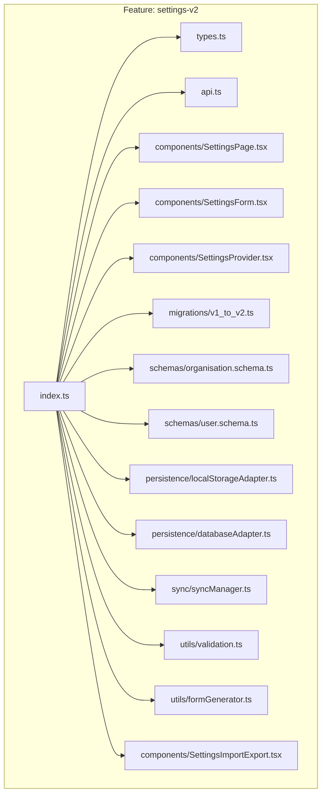
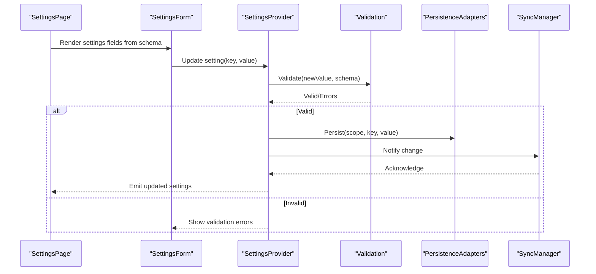
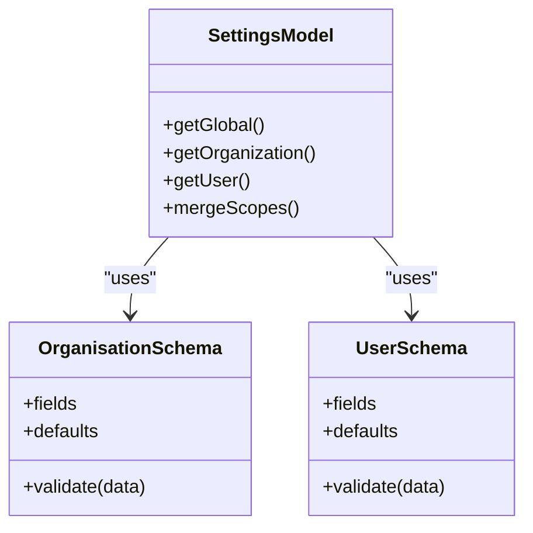
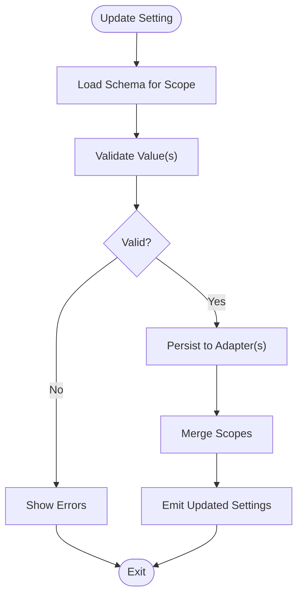
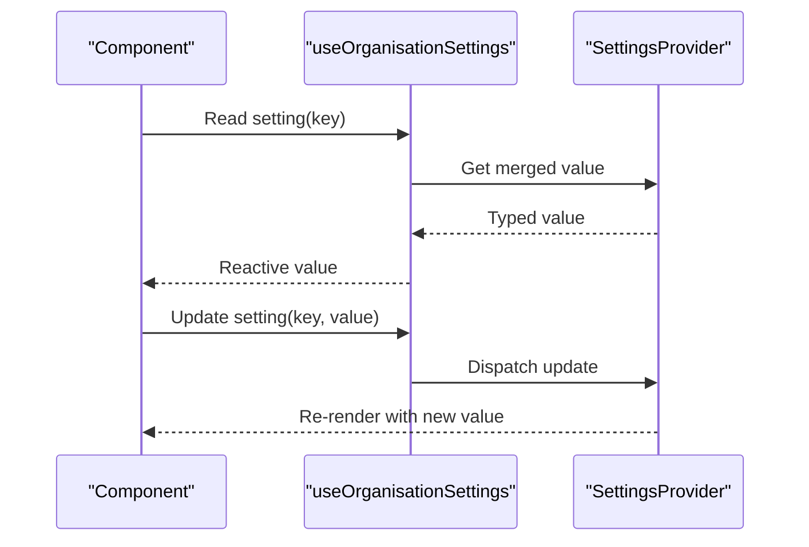
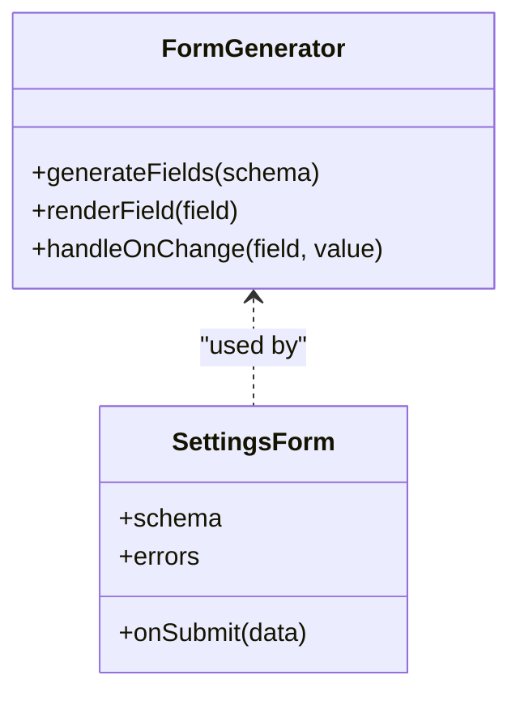
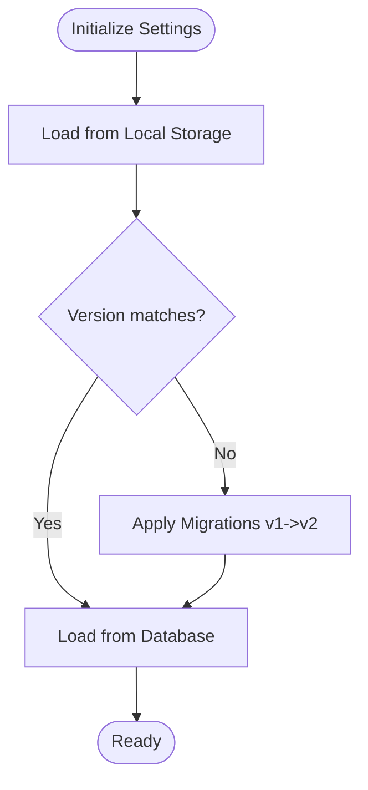
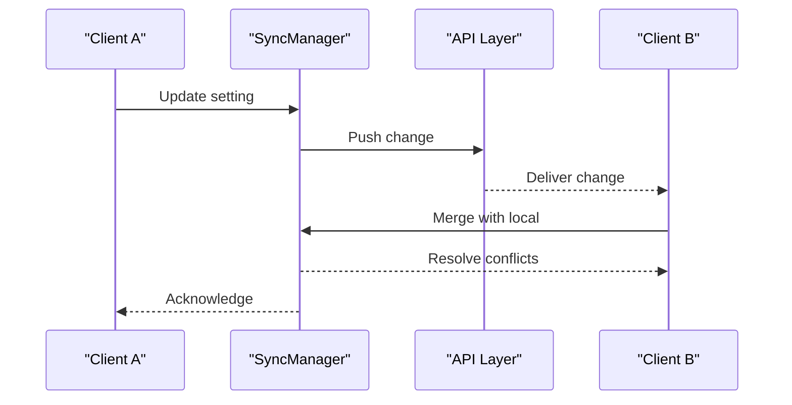
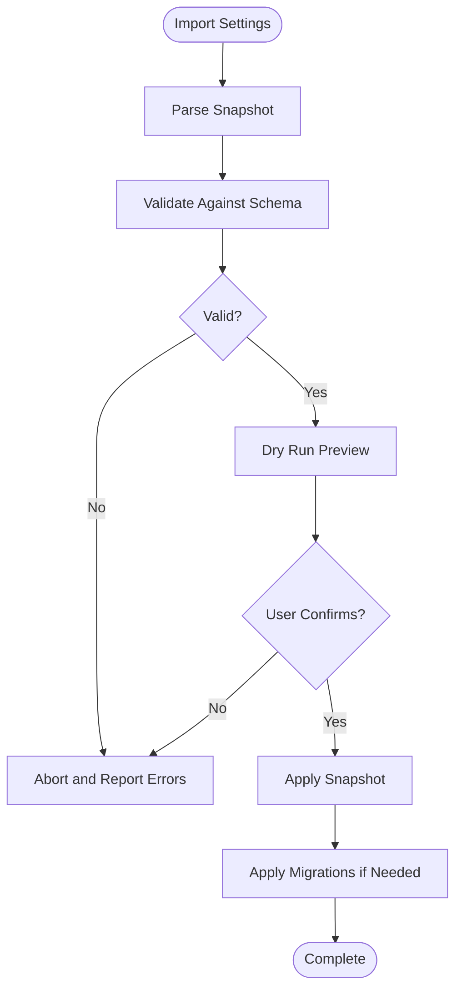
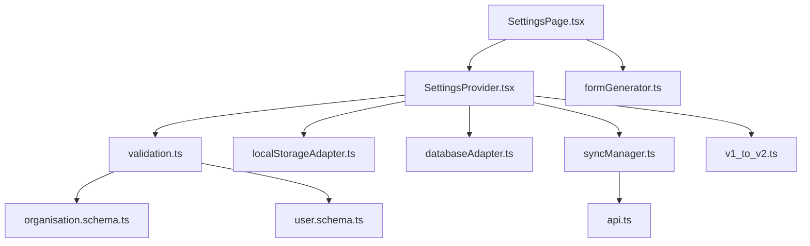

# Settings & Configuration

<cite>
**Referenced Files in This Document**
- [settings-v2/index.ts](file://src/features/settings-v2/index.ts)
- [settings-v2/types.ts](file://src/features/settings-v2/types.ts)
- [settings-v2/hooks/useOrganisationSettings.ts](file://src/hooks/useOrganisationSettings.ts)
- [settings-v2/api.ts](file://src/features/settings-v2/api.ts)
- [settings-v2/components/SettingsForm.tsx](file://src/features/settings-v2/components/SettingsForm.tsx)
- [settings-v2/components/SettingsProvider.tsx](file://src/features/settings-v2/components/SettingsProvider.tsx)
- [settings-v2/migrations/v1_to_v2.ts](file://src/features/settings-v2/migrations/v1_to_v2.ts)
- [settings-v2/schemas/organisation.schema.ts](file://src/features/settings-v2/schemas/organisation.schema.ts)
- [settings-v2/schemas/user.schema.ts](file://src/features/settings-v2/schemas/user.schema.ts)
- [settings-v2/persistence/localStorageAdapter.ts](file://src/features/settings-v2/persistence/localStorageAdapter.ts)
- [settings-v2/persistence/databaseAdapter.ts](file://src/features/settings-v2/persistence/databaseAdapter.ts)
- [settings-v2/sync/syncManager.ts](file://src/features/settings-v2/sync/syncManager.ts)
- [settings-v2/utils/validation.ts](file://src/features/settings-v2/utils/validation.ts)
- [settings-v2/utils/formGenerator.ts](file://src/features/settings-v2/utils/formGenerator.ts)
- [settings-v2/components/SettingsPage.tsx](file://src/features/settings-v2/components/SettingsPage.tsx)
- [settings-v2/components/SettingsImportExport.tsx](file://src/features/settings-v2/components/SettingsImportExport.tsx)
</cite>

## Table of Contents
1. [Introduction](#introduction)
2. [Project Structure](#project-structure)
3. [Core Components](#core-components)
4. [Architecture Overview](#architecture-overview)
5. [Detailed Component Analysis](#detailed-component-analysis)
6. [Dependency Analysis](#dependency-analysis)
7. [Performance Considerations](#performance-considerations)
8. [Troubleshooting Guide](#troubleshooting-guide)
9. [Conclusion](#conclusion)
10. [Appendices](#appendices)

## Introduction
This document explains the settings and configuration management system with a focus on hierarchical settings (global, organization, user), schema-driven validation, type-safe access patterns, UI form generation, real-time updates, persistence, versioning, migration, synchronization across clients, conflict resolution, and backup/restore. It provides practical guidance for adding new settings categories, building complex forms, and creating features that depend on settings.

## Project Structure
The settings subsystem is organized under a feature folder with clear separation of concerns:
- Types and schemas define the shape and constraints of settings at different scopes.
- Hooks and providers expose typed access to settings and manage state.
- API layer handles remote operations and integration points.
- Persistence adapters abstract storage backends (local storage, database).
- Sync manager coordinates multi-client synchronization and conflict resolution.
- Utilities include validation helpers and dynamic form generation from schemas.
- UI components render settings pages, forms, and import/export tools.

**Diagram sources**
- [settings-v2/index.ts:1-200](file://src/features/settings-v2/index.ts#L1-L200)
- [settings-v2/types.ts:1-200](file://src/features/settings-v2/types.ts#L1-L200)
- [settings-v2/api.ts:1-200](file://src/features/settings-v2/api.ts#L1-L200)
- [settings-v2/components/SettingsPage.tsx:1-200](file://src/features/settings-v2/components/SettingsPage.tsx#L1-L200)
- [settings-v2/components/SettingsForm.tsx:1-200](file://src/features/settings-v2/components/SettingsForm.tsx#L1-L200)
- [settings-v2/components/SettingsProvider.tsx:1-200](file://src/features/settings-v2/components/SettingsProvider.tsx#L1-L200)
- [settings-v2/migrations/v1_to_v2.ts:1-200](file://src/features/settings-v2/migrations/v1_to_v2.ts#L1-L200)
- [settings-v2/schemas/organisation.schema.ts:1-200](file://src/features/settings-v2/schemas/organisation.schema.ts#L1-L200)
- [settings-v2/schemas/user.schema.ts:1-200](file://src/features/settings-v2/schemas/user.schema.ts#L1-L200)
- [settings-v2/persistence/localStorageAdapter.ts:1-200](file://src/features/settings-v2/persistence/localStorageAdapter.ts#L1-L200)
- [settings-v2/persistence/databaseAdapter.ts:1-200](file://src/features/settings-v2/persistence/databaseAdapter.ts#L1-L200)
- [settings-v2/sync/syncManager.ts:1-200](file://src/features/settings-v2/sync/syncManager.ts#L1-L200)
- [settings-v2/utils/validation.ts:1-200](file://src/features/settings-v2/utils/validation.ts#L1-L200)
- [settings-v2/utils/formGenerator.ts:1-200](file://src/features/settings-v2/utils/formGenerator.ts#L1-L200)
- [settings-v2/components/SettingsImportExport.tsx:1-200](file://src/features/settings-v2/components/SettingsImportExport.tsx#L1-L200)

**Section sources**
- [settings-v2/index.ts:1-200](file://src/features/settings-v2/index.ts#L1-L200)
- [settings-v2/types.ts:1-200](file://src/features/settings-v2/types.ts#L1-L200)

## Core Components
- Hierarchical settings model: global, organization, and user-level preferences are modeled as distinct scopes with inheritance rules. Global settings provide defaults; organization settings override global; user settings override both.
- Schema definitions: each scope has a schema describing field types, default values, and validation rules. Schemas drive both runtime validation and UI form generation.
- Type-safe access: hooks and provider expose strongly-typed getters/setters per scope, ensuring compile-time safety and consistent usage across the app.
- Real-time updates: changes propagate via context/state and optional sync events so dependent features react immediately.
- Persistence: adapters abstract local storage and database writes, enabling seamless switching between offline-first and server-backed modes.
- Versioning and migrations: settings versions are tracked; migrations transform older structures into current schemas safely.
- Synchronization and conflict resolution: a sync manager merges changes across clients using timestamps or vector clocks, applying deterministic conflict strategies.
- Import/Export: utilities allow exporting settings snapshots and importing them with validation and rollback support.

**Section sources**
- [settings-v2/types.ts:1-200](file://src/features/settings-v2/types.ts#L1-L200)
- [settings-v2/schemas/organisation.schema.ts:1-200](file://src/features/settings-v2/schemas/organisation.schema.ts#L1-L200)
- [settings-v2/schemas/user.schema.ts:1-200](file://src/features/settings-v2/schemas/user.schema.ts#L1-L200)
- [settings-v2/hooks/useOrganisationSettings.ts:1-200](file://src/hooks/useOrganisationSettings.ts#L1-L200)
- [settings-v2/components/SettingsProvider.tsx:1-200](file://src/features/settings-v2/components/SettingsProvider.tsx#L1-L200)
- [settings-v2/persistence/localStorageAdapter.ts:1-200](file://src/features/settings-v2/persistence/localStorageAdapter.ts#L1-L200)
- [settings-v2/persistence/databaseAdapter.ts:1-200](file://src/features/settings-v2/persistence/databaseAdapter.ts#L1-L200)
- [settings-v2/migrations/v1_to_v2.ts:1-200](file://src/features/settings-v2/migrations/v1_to_v2.ts#L1-L200)
- [settings-v2/sync/syncManager.ts:1-200](file://src/features/settings-v2/sync/syncManager.ts#L1-L200)
- [settings-v2/components/SettingsImportExport.tsx:1-200](file://src/features/settings-v2/components/SettingsImportExport.tsx#L1-L200)

## Architecture Overview
The architecture separates concerns into layers:
- Presentation: Settings page and form components render UI driven by schemas.
- State: Provider manages merged settings across scopes and exposes typed APIs.
- Validation: Schema-based validators ensure correctness before persistence.
- Persistence: Adapters write to local storage and/or database.
- Sync: Manager coordinates cross-client updates and resolves conflicts.
- Migration: Versioned transformations keep legacy data compatible.

**Diagram sources**
- [settings-v2/components/SettingsPage.tsx:1-200](file://src/features/settings-v2/components/SettingsPage.tsx#L1-L200)
- [settings-v2/components/SettingsForm.tsx:1-200](file://src/features/settings-v2/components/SettingsForm.tsx#L1-L200)
- [settings-v2/components/SettingsProvider.tsx:1-200](file://src/features/settings-v2/components/SettingsProvider.tsx#L1-L200)
- [settings-v2/utils/validation.ts:1-200](file://src/features/settings-v2/utils/validation.ts#L1-L200)
- [settings-v2/persistence/localStorageAdapter.ts:1-200](file://src/features/settings-v2/persistence/localStorageAdapter.ts#L1-L200)
- [settings-v2/persistence/databaseAdapter.ts:1-200](file://src/features/settings-v2/persistence/databaseAdapter.ts#L1-L200)
- [settings-v2/sync/syncManager.ts:1-200](file://src/features/settings-v2/sync/syncManager.ts#L1-L200)

## Detailed Component Analysis

### Hierarchical Settings Model
- Scopes:
  - Global: application-wide defaults.
  - Organization: overrides global within an org context.
  - User: personal overrides for the active user.
- Inheritance: effective settings are computed by merging user > organization > global.
- Access patterns:
  - Use typed getters scoped to the desired level.
  - Prefer hook-based access to ensure reactivity and consistency.

**Diagram sources**
- [settings-v2/types.ts:1-200](file://src/features/settings-v2/types.ts#L1-L200)
- [settings-v2/schemas/organisation.schema.ts:1-200](file://src/features/settings-v2/schemas/organisation.schema.ts#L1-L200)
- [settings-v2/schemas/user.schema.ts:1-200](file://src/features/settings-v2/schemas/user.schema.ts#L1-L200)

**Section sources**
- [settings-v2/types.ts:1-200](file://src/features/settings-v2/types.ts#L1-L200)
- [settings-v2/schemas/organisation.schema.ts:1-200](file://src/features/settings-v2/schemas/organisation.schema.ts#L1-L200)
- [settings-v2/schemas/user.schema.ts:1-200](file://src/features/settings-v2/schemas/user.schema.ts#L1-L200)

### Schema Definitions and Validation
- Each schema defines:
  - Field descriptors (type, label, help text).
  - Default values per scope.
  - Validation rules (required, ranges, enums, custom checks).
- Validation pipeline:
  - Pre-save validation against schema.
  - Error aggregation for UI feedback.
  - Safe fallbacks to defaults when partial data is provided.

**Diagram sources**
- [settings-v2/utils/validation.ts:1-200](file://src/features/settings-v2/utils/validation.ts#L1-L200)
- [settings-v2/schemas/organisation.schema.ts:1-200](file://src/features/settings-v2/schemas/organisation.schema.ts#L1-L200)
- [settings-v2/schemas/user.schema.ts:1-200](file://src/features/settings-v2/schemas/user.schema.ts#L1-L200)

**Section sources**
- [settings-v2/utils/validation.ts:1-200](file://src/features/settings-v2/utils/validation.ts#L1-L200)
- [settings-v2/schemas/organisation.schema.ts:1-200](file://src/features/settings-v2/schemas/organisation.schema.ts#L1-L200)
- [settings-v2/schemas/user.schema.ts:1-200](file://src/features/settings-v2/schemas/user.schema.ts#L1-L200)

### Type-Safe Configuration Access Patterns
- Provide typed getters/setters per scope.
- Expose hooks for reactive consumption in components.
- Centralize defaults and merge logic to avoid duplication.

**Diagram sources**
- [settings-v2/hooks/useOrganisationSettings.ts:1-200](file://src/hooks/useOrganisationSettings.ts#L1-L200)
- [settings-v2/components/SettingsProvider.tsx:1-200](file://src/features/settings-v2/components/SettingsProvider.tsx#L1-L200)

**Section sources**
- [settings-v2/hooks/useOrganisationSettings.ts:1-200](file://src/hooks/useOrganisationSettings.ts#L1-L200)
- [settings-v2/components/SettingsProvider.tsx:1-200](file://src/features/settings-v2/components/SettingsProvider.tsx#L1-L200)

### Settings UI Framework and Dynamic Forms
- Schema-driven form generation:
  - Fields are rendered based on schema descriptors.
  - Validation messages are surfaced inline.
  - Conditional visibility and dependencies can be expressed in schema metadata.
- Real-time updates:
  - On change, immediate validation and optimistic UI updates occur.
  - Debounced persistence reduces write overhead.

**Diagram sources**
- [settings-v2/utils/formGenerator.ts:1-200](file://src/features/settings-v2/utils/formGenerator.ts#L1-L200)
- [settings-v2/components/SettingsForm.tsx:1-200](file://src/features/settings-v2/components/SettingsForm.tsx#L1-L200)

**Section sources**
- [settings-v2/utils/formGenerator.ts:1-200](file://src/features/settings-v2/utils/formGenerator.ts#L1-L200)
- [settings-v2/components/SettingsForm.tsx:1-200](file://src/features/settings-v2/components/SettingsForm.tsx#L1-L200)

### Persistence, Versioning, and Migration
- Persistence adapters:
  - Local storage adapter for offline-first behavior.
  - Database adapter for server-backed persistence.
- Versioning:
  - Settings include a version identifier.
  - On load, apply necessary migrations to reach the latest schema.
- Migration strategy:
  - Incremental transforms keyed by version pairs.
  - Rollback-friendly design with safe defaults.

**Diagram sources**
- [settings-v2/persistence/localStorageAdapter.ts:1-200](file://src/features/settings-v2/persistence/localStorageAdapter.ts#L1-L200)
- [settings-v2/persistence/databaseAdapter.ts:1-200](file://src/features/settings-v2/persistence/databaseAdapter.ts#L1-L200)
- [settings-v2/migrations/v1_to_v2.ts:1-200](file://src/features/settings-v2/migrations/v1_to_v2.ts#L1-L200)

**Section sources**
- [settings-v2/persistence/localStorageAdapter.ts:1-200](file://src/features/settings-v2/persistence/localStorageAdapter.ts#L1-L200)
- [settings-v2/persistence/databaseAdapter.ts:1-200](file://src/features/settings-v2/persistence/databaseAdapter.ts#L1-L200)
- [settings-v2/migrations/v1_to_v2.ts:1-200](file://src/features/settings-v2/migrations/v1_to_v2.ts#L1-L200)

### Synchronization Across Clients and Conflict Resolution
- Change propagation:
  - Updates emit events consumed by the sync manager.
  - Remote peers receive updates via API layer.
- Conflict resolution:
  - Strategy based on timestamps or vector clocks.
  - Deterministic merge rules per field (e.g., last-write-wins, union for sets).
- Consistency guarantees:
  - Idempotent operations.
  - Retry and backoff for failed syncs.

**Diagram sources**
- [settings-v2/sync/syncManager.ts:1-200](file://src/features/settings-v2/sync/syncManager.ts#L1-L200)
- [settings-v2/api.ts:1-200](file://src/features/settings-v2/api.ts#L1-L200)

**Section sources**
- [settings-v2/sync/syncManager.ts:1-200](file://src/features/settings-v2/sync/syncManager.ts#L1-L200)
- [settings-v2/api.ts:1-200](file://src/features/settings-v2/api.ts#L1-L200)

### Backup and Restore Functionality
- Export:
  - Snapshot all scopes with metadata (version, timestamp).
  - Generate downloadable artifact.
- Import:
  - Validate incoming snapshot against current schema.
  - Apply migrations if needed.
  - Offer dry-run preview and confirmation.
- Safety:
  - Preserve previous snapshot before overwrite.
  - Rollback on validation failure.

**Diagram sources**
- [settings-v2/components/SettingsImportExport.tsx:1-200](file://src/features/settings-v2/components/SettingsImportExport.tsx#L1-L200)
- [settings-v2/utils/validation.ts:1-200](file://src/features/settings-v2/utils/validation.ts#L1-L200)
- [settings-v2/migrations/v1_to_v2.ts:1-200](file://src/features/settings-v2/migrations/v1_to_v2.ts#L1-L200)

**Section sources**
- [settings-v2/components/SettingsImportExport.tsx:1-200](file://src/features/settings-v2/components/SettingsImportExport.tsx#L1-L200)
- [settings-v2/utils/validation.ts:1-200](file://src/features/settings-v2/utils/validation.ts#L1-L200)
- [settings-v2/migrations/v1_to_v2.ts:1-200](file://src/features/settings-v2/migrations/v1_to_v2.ts#L1-L200)

## Dependency Analysis
Key relationships:
- UI depends on provider and form generator.
- Provider orchestrates validation, persistence, and sync.
- Schemas drive validation and form generation.
- Sync relies on API layer for remote communication.
- Migrations run during initialization and import.

**Diagram sources**
- [settings-v2/components/SettingsPage.tsx:1-200](file://src/features/settings-v2/components/SettingsPage.tsx#L1-L200)
- [settings-v2/components/SettingsProvider.tsx:1-200](file://src/features/settings-v2/components/SettingsProvider.tsx#L1-L200)
- [settings-v2/utils/formGenerator.ts:1-200](file://src/features/settings-v2/utils/formGenerator.ts#L1-L200)
- [settings-v2/utils/validation.ts:1-200](file://src/features/settings-v2/utils/validation.ts#L1-L200)
- [settings-v2/persistence/localStorageAdapter.ts:1-200](file://src/features/settings-v2/persistence/localStorageAdapter.ts#L1-L200)
- [settings-v2/persistence/databaseAdapter.ts:1-200](file://src/features/settings-v2/persistence/databaseAdapter.ts#L1-L200)
- [settings-v2/sync/syncManager.ts:1-200](file://src/features/settings-v2/sync/syncManager.ts#L1-L200)
- [settings-v2/api.ts:1-200](file://src/features/settings-v2/api.ts#L1-L200)
- [settings-v2/schemas/organisation.schema.ts:1-200](file://src/features/settings-v2/schemas/organisation.schema.ts#L1-L200)
- [settings-v2/schemas/user.schema.ts:1-200](file://src/features/settings-v2/schemas/user.schema.ts#L1-L200)
- [settings-v2/migrations/v1_to_v2.ts:1-200](file://src/features/settings-v2/migrations/v1_to_v2.ts#L1-L200)

**Section sources**
- [settings-v2/components/SettingsPage.tsx:1-200](file://src/features/settings-v2/components/SettingsPage.tsx#L1-L200)
- [settings-v2/components/SettingsProvider.tsx:1-200](file://src/features/settings-v2/components/SettingsProvider.tsx#L1-L200)
- [settings-v2/utils/formGenerator.ts:1-200](file://src/features/settings-v2/utils/formGenerator.ts#L1-L200)
- [settings-v2/utils/validation.ts:1-200](file://src/features/settings-v2/utils/validation.ts#L1-L200)
- [settings-v2/persistence/localStorageAdapter.ts:1-200](file://src/features/settings-v2/persistence/localStorageAdapter.ts#L1-L200)
- [settings-v2/persistence/databaseAdapter.ts:1-200](file://src/features/settings-v2/persistence/databaseAdapter.ts#L1-L200)
- [settings-v2/sync/syncManager.ts:1-200](file://src/features/settings-v2/sync/syncManager.ts#L1-L200)
- [settings-v2/api.ts:1-200](file://src/features/settings-v2/api.ts#L1-L200)
- [settings-v2/schemas/organisation.schema.ts:1-200](file://src/features/settings-v2/schemas/organisation.schema.ts#L1-L200)
- [settings-v2/schemas/user.schema.ts:1-200](file://src/features/settings-v2/schemas/user.schema.ts#L1-L200)
- [settings-v2/migrations/v1_to_v2.ts:1-200](file://src/features/settings-v2/migrations/v1_to_v2.ts#L1-L200)

## Performance Considerations
- Debounce frequent updates to reduce persistence calls.
- Batch schema validations where possible.
- Lazy-load heavy UI sections and defer non-critical sync tasks.
- Cache merged settings in memory to avoid recomputation.
- Use incremental migrations to minimize processing time.

## Troubleshooting Guide
Common issues and resolutions:
- Validation failures:
  - Inspect error messages produced by the validator.
  - Ensure schema defaults align with expected input formats.
- Persistence errors:
  - Check adapter logs for storage limits or permission issues.
  - Verify database connectivity and permissions.
- Sync conflicts:
  - Review conflict resolution logs and timestamps.
  - Adjust merge strategies for specific fields if needed.
- Migration problems:
  - Validate migration idempotency.
  - Keep backups before applying migrations.

**Section sources**
- [settings-v2/utils/validation.ts:1-200](file://src/features/settings-v2/utils/validation.ts#L1-L200)
- [settings-v2/persistence/localStorageAdapter.ts:1-200](file://src/features/settings-v2/persistence/localStorageAdapter.ts#L1-L200)
- [settings-v2/persistence/databaseAdapter.ts:1-200](file://src/features/settings-v2/persistence/databaseAdapter.ts#L1-L200)
- [settings-v2/sync/syncManager.ts:1-200](file://src/features/settings-v2/sync/syncManager.ts#L1-L200)
- [settings-v2/migrations/v1_to_v2.ts:1-200](file://src/features/settings-v2/migrations/v1_to_v2.ts#L1-L200)

## Conclusion
The settings and configuration system provides a robust, schema-driven foundation for managing hierarchical preferences across global, organization, and user scopes. With type-safe access, dynamic UI generation, real-time updates, and strong persistence and sync mechanisms, it supports scalable feature development and reliable multi-client environments. The documented patterns enable teams to add new settings categories, build complex forms, and create features that depend on configuration while maintaining consistency and performance.

## Appendices

### Practical Examples

#### Adding a New Settings Category
- Define schema fields, defaults, and validation rules for the new category.
- Register the category in the settings index and provider.
- Add UI fields via the form generator or custom components.
- Implement persistence and sync for the new keys.
- Include migration steps if existing data needs transformation.

**Section sources**
- [settings-v2/schemas/organisation.schema.ts:1-200](file://src/features/settings-v2/schemas/organisation.schema.ts#L1-L200)
- [settings-v2/schemas/user.schema.ts:1-200](file://src/features/settings-v2/schemas/user.schema.ts#L1-L200)
- [settings-v2/index.ts:1-200](file://src/features/settings-v2/index.ts#L1-L200)
- [settings-v2/components/SettingsForm.tsx:1-200](file://src/features/settings-v2/components/SettingsForm.tsx#L1-L200)
- [settings-v2/migrations/v1_to_v2.ts:1-200](file://src/features/settings-v2/migrations/v1_to_v2.ts#L1-L200)

#### Implementing Complex Configuration Forms
- Use schema metadata to control conditional visibility and dependencies.
- Group related fields into sections for better UX.
- Provide inline help text and examples.
- Enable bulk actions and batch validation.

**Section sources**
- [settings-v2/utils/formGenerator.ts:1-200](file://src/features/settings-v2/utils/formGenerator.ts#L1-L200)
- [settings-v2/components/SettingsForm.tsx:1-200](file://src/features/settings-v2/components/SettingsForm.tsx#L1-L200)

#### Creating Settings-Dependent Features
- Consume settings via typed hooks to ensure reactivity.
- Gate feature flags based on organization or user settings.
- Handle missing or invalid settings gracefully with defaults.

**Section sources**
- [settings-v2/hooks/useOrganisationSettings.ts:1-200](file://src/hooks/useOrganisationSettings.ts#L1-L200)
- [settings-v2/components/SettingsProvider.tsx:1-200](file://src/features/settings-v2/components/SettingsProvider.tsx#L1-L200)