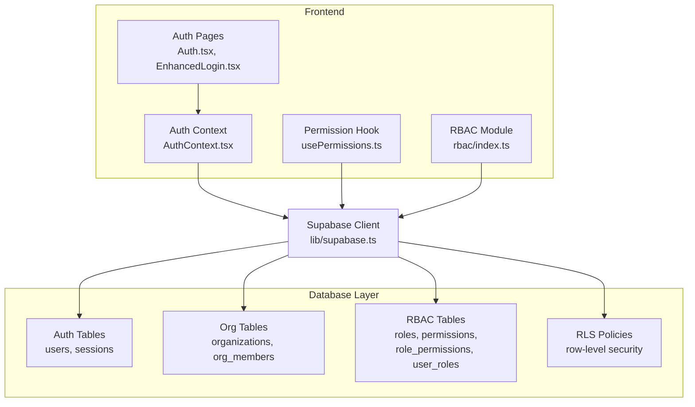
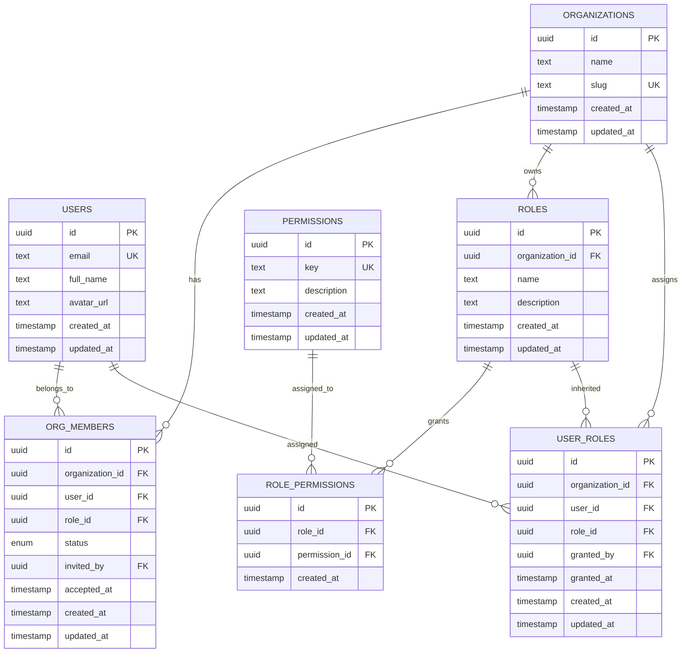
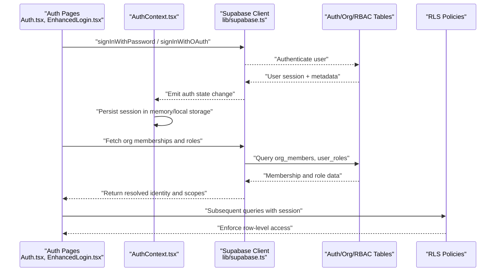
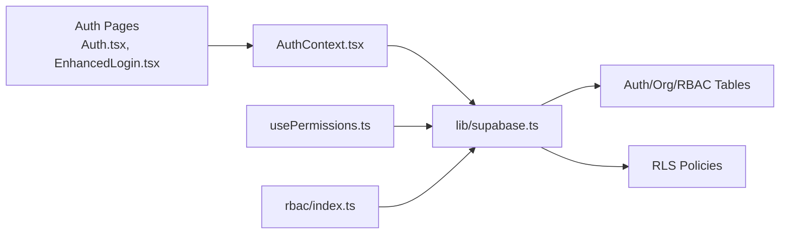

# Core Entities & Authentication

<cite>
**Referenced Files in This Document**
- [database-auth.sql](file://src/database-auth.sql)
- [database-setup.sql](file://src/database-setup.sql)
- [database-complete.sql](file://src/database-complete.sql)
- [supabase-tables.sql](file://supabase-tables.sql)
- [Auth.tsx](file://src/pages/Auth.tsx)
- [EnhancedLogin.tsx](file://src/pages/EnhancedLogin.tsx)
- [AcceptInvitation.tsx](file://src/pages/AcceptInvitation.tsx)
- [AccessControl.tsx](file://src/pages/AccessControl.tsx)
- [AuthContext.tsx](file://src/contexts/AuthContext.tsx)
- [usePermissions.ts](file://src/hooks/usePermissions.ts)
- [rbac/index.ts](file://src/rbac/index.ts)
- [lib/supabase.ts](file://src/lib/supabase.ts)
- [migrations/20240101000000_create_auth_tables.sql](file://supabase/migrations/20240101000000_create_auth_tables.sql)
- [migrations/20240101000001_create_org_users_roles.sql](file://supabase/migrations/20240101000001_create_org_users_roles.sql)
- [migrations/20240101000002_create_permissions.sql](file://supabase/migrations/20240101000002_create_permissions.sql)
- [migrations/20240101000003_create_rls_policies.sql](file://supabase/migrations/20240101000003_create_rls_policies.sql)
</cite>

## Table of Contents
1. [Introduction](#introduction)
2. [Project Structure](#project-structure)
3. [Core Components](#core-components)
4. [Architecture Overview](#architecture-overview)
5. [Detailed Component Analysis](#detailed-component-analysis)
6. [Dependency Analysis](#dependency-analysis)
7. [Performance Considerations](#performance-considerations)
8. [Troubleshooting Guide](#troubleshooting-guide)
9. [Conclusion](#conclusion)
10. [Appendices](#appendices)

## Introduction
This document provides comprehensive data model documentation for core entities and the authentication system, focusing on organization, user, role, and permission tables with their relationships. It explains the multi-tenant architecture foundation including organization isolation, user assignment, and access control mechanisms. It also documents authentication flows, session management, and security policies, along with field definitions, data types, constraints, validation rules, common queries, and database triggers/stored procedures/functions related to authentication and authorization.

## Project Structure
The authentication and authorization implementation spans:
- Database schema and migrations under src and supabase directories
- Frontend authentication pages and context providers
- Hooks and utilities for permissions and Supabase client usage
- Role-based access control (RBAC) modules

[No sources needed since this diagram shows conceptual workflow, not actual code structure]

## Core Components
This section outlines the core entities and their relationships that form the multi-tenant foundation and RBAC system.

- Organization
  - Purpose: Represents a tenant or company unit. All data is scoped to an organization for isolation.
  - Key fields: id (UUID), name (text), slug (text unique), created_at, updated_at.
  - Constraints: Unique slug per tenant; timestamps managed by defaults/triggers.

- User
  - Purpose: Represents a person account. Linked to one or more organizations via membership.
  - Key fields: id (UUID), email (text unique), full_name (text), avatar_url (text), created_at, updated_at.
  - Constraints: Unique email; optional profile fields.

- Organization Membership (org_members)
  - Purpose: Bridges users to organizations with roles and status.
  - Key fields: id (UUID), organization_id (FK), user_id (FK), role_id (FK), status (enum), invited_by (FK), accepted_at, created_at, updated_at.
  - Constraints: Unique composite (organization_id, user_id); FK integrity enforced.

- Role
  - Purpose: Defines sets of permissions within an organization.
  - Key fields: id (UUID), organization_id (FK), name (text), description (text), created_at, updated_at.
  - Constraints: Unique name per organization.

- Permission
  - Purpose: Atomic action descriptors (e.g., resource.action).
  - Key fields: id (UUID), key (text unique), description (text), created_at, updated_at.
  - Constraints: Unique key globally.

- Role-Permission Mapping (role_permissions)
  - Purpose: Associates roles with permissions.
  - Key fields: id (UUID), role_id (FK), permission_id (FK), created_at.
  - Constraints: Unique composite (role_id, permission_id).

- User-Role Mapping (user_roles)
  - Purpose: Assigns roles to users within an organization.
  - Key fields: id (UUID), organization_id (FK), user_id (FK), role_id (FK), granted_by (FK), granted_at, created_at, updated_at.
  - Constraints: Unique composite (organization_id, user_id, role_id).

Relationships overview:
- Organizations have many members.
- Users can belong to many organizations.
- Roles are scoped to organizations.
- Permissions are global but assigned to roles.
- Users inherit permissions through roles within an organization.

**Section sources**
- [database-auth.sql](file://src/database-auth.sql)
- [database-setup.sql](file://src/database-setup.sql)
- [database-complete.sql](file://src/database-complete.sql)
- [supabase-tables.sql](file://supabase-tables.sql)
- [migrations/20240101000000_create_auth_tables.sql](file://supabase/migrations/20240101000000_create_auth_tables.sql)
- [migrations/20240101000001_create_org_users_roles.sql](file://supabase/migrations/20240101000001_create_org_users_roles.sql)
- [migrations/20240101000002_create_permissions.sql](file://supabase/migrations/20240101000002_create_permissions.sql)

## Architecture Overview
The system uses a multi-tenant design where each organization isolates its data. Access control is implemented via Row-Level Security (RLS) policies combined with RBAC. The frontend authenticates users using Supabase Auth, maintains session state in context, and evaluates permissions via hooks and RBAC utilities.

**Diagram sources**
- [Auth.tsx](file://src/pages/Auth.tsx)
- [EnhancedLogin.tsx](file://src/pages/EnhancedLogin.tsx)
- [AuthContext.tsx](file://src/contexts/AuthContext.tsx)
- [lib/supabase.ts](file://src/lib/supabase.ts)
- [migrations/20240101000003_create_rls_policies.sql](file://supabase/migrations/20240101000003_create_rls_policies.sql)

**Section sources**
- [Auth.tsx](file://src/pages/Auth.tsx)
- [EnhancedLogin.tsx](file://src/pages/EnhancedLogin.tsx)
- [AuthContext.tsx](file://src/contexts/AuthContext.tsx)
- [lib/supabase.ts](file://src/lib/supabase.ts)
- [migrations/20240101000003_create_rls_policies.sql](file://supabase/migrations/20240101000003_create_rls_policies.sql)

## Detailed Component Analysis

### Organization Setup and Isolation
- Organization creation flow:
  - Admin creates an organization with a unique slug.
  - The creator becomes the initial member with an admin role.
  - RLS policies ensure all subsequent queries filter by organization_id when applicable.

- Common queries:
  - Create organization: insert into organizations(name, slug) values(...).
  - List organizations for current user: join organizations with org_members filtered by user_id.
  - Get active organization context: select from organizations where slug = current_setting('app.current_org_slug').

- Validation rules:
  - Slug must be unique across tenants.
  - Name cannot be null or empty.

**Section sources**
- [database-setup.sql](file://src/database-setup.sql)
- [database-complete.sql](file://src/database-complete.sql)
- [supabase-tables.sql](file://supabase-tables.sql)
- [migrations/20240101000001_create_org_users_roles.sql](file://supabase/migrations/20240101000001_create_org_users_roles.sql)

### User Management
- User lifecycle:
  - Registration via email/password or OAuth.
  - Profile enrichment (full_name, avatar_url).
  - Invitation acceptance flow to join an organization.

- Invitation acceptance:
  - AcceptInvitation page validates token and assigns user to organization with a default role if configured.
  - Updates org_members.status to accepted and records accepted_at.

- Common queries:
  - Get user profile: select * from users where id = auth.uid().
  - List organization members: select u.*, om.role_id, om.status from org_members om join users u on u.id = om.user_id where om.organization_id = ...
  - Update user profile: update users set full_name = ..., avatar_url = ... where id = auth.uid().

**Section sources**
- [database-auth.sql](file://src/database-auth.sql)
- [AcceptInvitation.tsx](file://src/pages/AcceptInvitation.tsx)
- [migrations/20240101000001_create_org_users_roles.sql](file://supabase/migrations/20240101000001_create_org_users_roles.sql)

### Role-Based Access Control (RBAC)
- Role definition:
  - Roles are scoped to organizations to allow different permission sets per tenant.
  - Role names should be descriptive (e.g., org_admin, project_manager).

- Permission assignment:
  - Permissions are global atomic actions (e.g., projects.create, invoices.approve).
  - Role-permission mapping grants capabilities to roles.

- User-role assignment:
  - Users are assigned roles within an organization.
  - Effective permissions are computed by unioning permissions of all assigned roles.

- Common queries:
  - Check if user has permission: select exists(select 1 from user_roles ur join role_permissions rp on rp.role_id = ur.role_id join permissions p on p.id = rp.permission_id where ur.user_id = auth.uid() and ur.organization_id = current_setting('app.current_org_id') and p.key = 'projects.create').
  - List roles for organization: select * from roles where organization_id = ...
  - Grant role to user: insert into user_roles(organization_id, user_id, role_id, granted_by, granted_at) values(...).

**Section sources**
- [migrations/20240101000002_create_permissions.sql](file://supabase/migrations/20240101000002_create_permissions.sql)
- [migrations/20240101000001_create_org_users_roles.sql](file://supabase/migrations/20240101000001_create_org_users_roles.sql)
- [usePermissions.ts](file://src/hooks/usePermissions.ts)
- [rbac/index.ts](file://src/rbac/index.ts)

### Session Management and Security Policies
- Session handling:
  - Supabase client manages JWT sessions and refresh tokens.
  - AuthContext persists session state and exposes current user and organization context.

- Security policies:
  - RLS policies enforce row-level access based on organization_id and user roles.
  - Policies typically check current_setting('app.current_org_id') and user membership/roles.

- Common patterns:
  - Set app.current_org_id before queries to scope operations.
  - Use helper functions to compute effective permissions at runtime.

**Section sources**
- [AuthContext.tsx](file://src/contexts/AuthContext.tsx)
- [lib/supabase.ts](file://src/lib/supabase.ts)
- [migrations/20240101000003_create_rls_policies.sql](file://supabase/migrations/20240101000003_create_rls_policies.sql)

### Access Control Page
- AccessControl component enforces UI-level visibility based on permissions.
- It reads current user’s effective permissions and conditionally renders features.

**Section sources**
- [AccessControl.tsx](file://src/pages/AccessControl.tsx)
- [usePermissions.ts](file://src/hooks/usePermissions.ts)

## Dependency Analysis
The following diagram maps dependencies between frontend components, hooks, and database layers.

**Diagram sources**
- [Auth.tsx](file://src/pages/Auth.tsx)
- [EnhancedLogin.tsx](file://src/pages/EnhancedLogin.tsx)
- [AuthContext.tsx](file://src/contexts/AuthContext.tsx)
- [usePermissions.ts](file://src/hooks/usePermissions.ts)
- [rbac/index.ts](file://src/rbac/index.ts)
- [lib/supabase.ts](file://src/lib/supabase.ts)
- [migrations/20240101000003_create_rls_policies.sql](file://supabase/migrations/20240101000003_create_rls_policies.sql)

**Section sources**
- [Auth.tsx](file://src/pages/Auth.tsx)
- [EnhancedLogin.tsx](file://src/pages/EnhancedLogin.tsx)
- [AuthContext.tsx](file://src/contexts/AuthContext.tsx)
- [usePermissions.ts](file://src/hooks/usePermissions.ts)
- [rbac/index.ts](file://src/rbac/index.ts)
- [lib/supabase.ts](file://src/lib/supabase.ts)
- [migrations/20240101000003_create_rls_policies.sql](file://supabase/migrations/20240101000003_create_rls_policies.sql)

## Performance Considerations
- Indexes:
  - Ensure indexes on foreign keys (organization_id, user_id, role_id) and frequently queried columns (email, slug).
  - Composite indexes for membership lookups (organization_id, user_id).

- Query optimization:
  - Prefer single-pass joins for membership and role resolution.
  - Cache effective permissions in client-side state to avoid repeated checks.

- RLS efficiency:
  - Keep policies simple and indexed to minimize overhead.
  - Avoid complex subqueries in policies; precompute membership flags where possible.

[No sources needed since this section provides general guidance]

## Troubleshooting Guide
Common issues and resolutions:
- Authentication failures:
  - Verify credentials and provider configuration.
  - Check session persistence in AuthContext and browser storage.

- Missing permissions:
  - Confirm user has required role(s) in the current organization.
  - Validate role-permission mappings exist.

- RLS denials:
  - Ensure app.current_org_id is set correctly.
  - Review RLS policies for correct scoping logic.

- Invitation acceptance errors:
  - Validate invitation token and expiration.
  - Check org_members insertion and status updates.

**Section sources**
- [Auth.tsx](file://src/pages/Auth.tsx)
- [EnhancedLogin.tsx](file://src/pages/EnhancedLogin.tsx)
- [AcceptInvitation.tsx](file://src/pages/AcceptInvitation.tsx)
- [migrations/20240101000003_create_rls_policies.sql](file://supabase/migrations/20240101000003_create_rls_policies.sql)

## Conclusion
The system implements a robust multi-tenant architecture with clear organization isolation and fine-grained access control via RBAC and RLS. The frontend integrates seamlessly with Supabase Auth and maintains session state while enforcing permissions at both UI and database levels. Proper indexing and policy design ensure scalability and performance.

[No sources needed since this section summarizes without analyzing specific files]

## Appendices

### Field Definitions and Constraints Summary
- organizations
  - id: UUID PK
  - name: text NOT NULL
  - slug: text UNIQUE NOT NULL
  - created_at: timestamp DEFAULT now()
  - updated_at: timestamp DEFAULT now()

- users
  - id: UUID PK
  - email: text UNIQUE NOT NULL
  - full_name: text
  - avatar_url: text
  - created_at: timestamp DEFAULT now()
  - updated_at: timestamp DEFAULT now()

- org_members
  - id: UUID PK
  - organization_id: UUID FK -> organizations.id
  - user_id: UUID FK -> users.id
  - role_id: UUID FK -> roles.id
  - status: enum (invited, accepted, suspended)
  - invited_by: UUID FK -> users.id
  - accepted_at: timestamp
  - created_at: timestamp DEFAULT now()
  - updated_at: timestamp DEFAULT now()
  - UNIQUE(organization_id, user_id)

- roles
  - id: UUID PK
  - organization_id: UUID FK -> organizations.id
  - name: text NOT NULL
  - description: text
  - created_at: timestamp DEFAULT now()
  - updated_at: timestamp DEFAULT now()
  - UNIQUE(organization_id, name)

- permissions
  - id: UUID PK
  - key: text UNIQUE NOT NULL
  - description: text
  - created_at: timestamp DEFAULT now()
  - updated_at: timestamp DEFAULT now()

- role_permissions
  - id: UUID PK
  - role_id: UUID FK -> roles.id
  - permission_id: UUID FK -> permissions.id
  - created_at: timestamp DEFAULT now()
  - UNIQUE(role_id, permission_id)

- user_roles
  - id: UUID PK
  - organization_id: UUID FK -> organizations.id
  - user_id: UUID FK -> users.id
  - role_id: UUID FK -> roles.id
  - granted_by: UUID FK -> users.id
  - granted_at: timestamp DEFAULT now()
  - created_at: timestamp DEFAULT now()
  - updated_at: timestamp DEFAULT now()
  - UNIQUE(organization_id, user_id, role_id)

**Section sources**
- [database-auth.sql](file://src/database-auth.sql)
- [database-setup.sql](file://src/database-setup.sql)
- [database-complete.sql](file://src/database-complete.sql)
- [supabase-tables.sql](file://supabase-tables.sql)
- [migrations/20240101000000_create_auth_tables.sql](file://supabase/migrations/20240101000000_create_auth_tables.sql)
- [migrations/20240101000001_create_org_users_roles.sql](file://supabase/migrations/20240101000001_create_org_users_roles.sql)
- [migrations/20240101000002_create_permissions.sql](file://supabase/migrations/20240101000002_create_permissions.sql)

### Example Queries
- User management:
  - Add user to organization with role:
    - Insert into org_members(organization_id, user_id, role_id, status, invited_by, accepted_at) values(...).
  - Update user profile:
    - Update users set full_name = ..., avatar_url = ... where id = auth.uid().

- Organization setup:
  - Create organization:
    - Insert into organizations(name, slug) values(...).
  - List members:
    - Select u.*, om.role_id, om.status from org_members om join users u on u.id = om.user_id where om.organization_id = current_setting('app.current_org_id').

- Permission checks:
  - Determine effective permissions:
    - Select distinct p.key from user_roles ur join role_permissions rp on rp.role_id = ur.role_id join permissions p on p.id = rp.permission_id where ur.user_id = auth.uid() and ur.organization_id = current_setting('app.current_org_id').

**Section sources**
- [database-auth.sql](file://src/database-auth.sql)
- [database-setup.sql](file://src/database-setup.sql)
- [database-complete.sql](file://src/database-complete.sql)
- [supabase-tables.sql](file://supabase-tables.sql)
- [migrations/20240101000001_create_org_users_roles.sql](file://supabase/migrations/20240101000001_create_org_users_roles.sql)
- [migrations/20240101000002_create_permissions.sql](file://supabase/migrations/20240101000002_create_permissions.sql)

### Triggers, Stored Procedures, and Functions
- Timestamp triggers:
  - Before insert/update on organizations, users, roles, org_members, user_roles to set updated_at to now().

- Default role assignment:
  - Function to assign default role to new organization members upon acceptance.

- Permission cache function:
  - Function to compute and cache effective permissions for a user in an organization to optimize frequent checks.

Note: Specific implementations may vary; consult migration files for exact trigger and function definitions.

**Section sources**
- [migrations/20240101000000_create_auth_tables.sql](file://supabase/migrations/20240101000000_create_auth_tables.sql)
- [migrations/20240101000001_create_org_users_roles.sql](file://supabase/migrations/20240101000001_create_org_users_roles.sql)
- [migrations/20240101000002_create_permissions.sql](file://supabase/migrations/20240101000002_create_permissions.sql)
- [migrations/20240101000003_create_rls_policies.sql](file://supabase/migrations/20240101000003_create_rls_policies.sql)