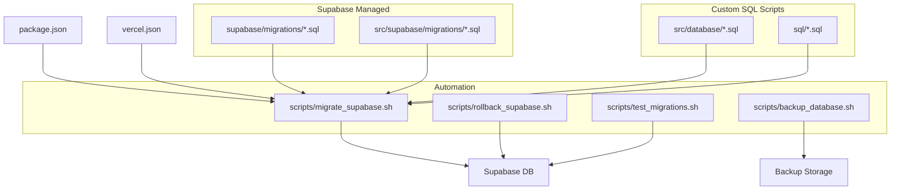
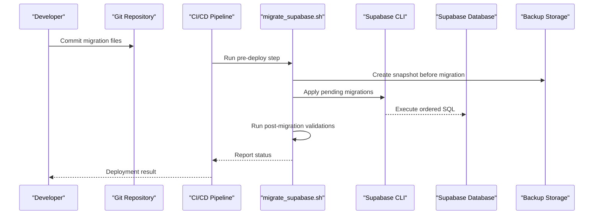
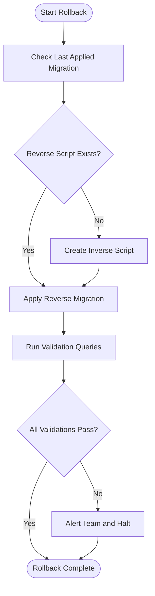
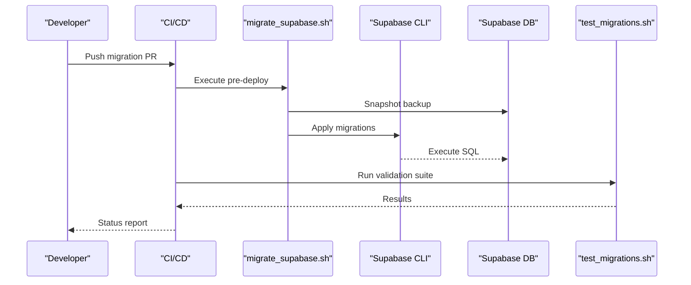
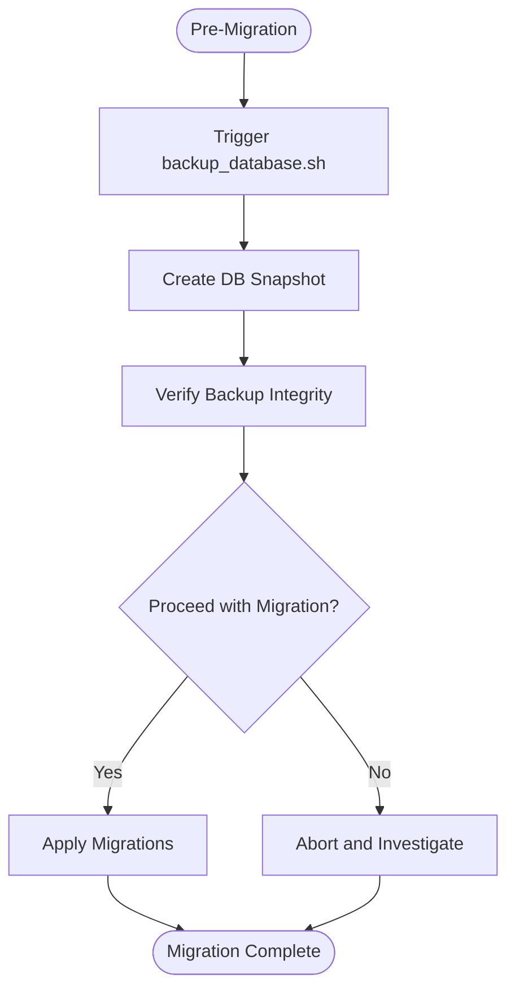
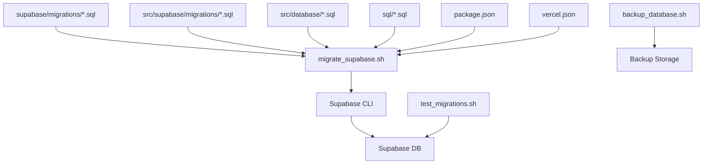

# Database Migrations & Versioning

<cite>
**Referenced Files in This Document**
- [supabase/migrations/001_initial_schema.sql](file://supabase/migrations/001_initial_schema.sql)
- [supabase/migrations/002_add_users_table.sql](file://supabase/migrations/002_add_users_table.sql)
- [supabase/migrations/003_create_projects_table.sql](file://supabase/migrations/003_create_projects_table.sql)
- [supabase/migrations/004_add_organisation_id_to_tables.sql](file://supabase/migrations/004_add_organisation_id_to_tables.sql)
- [supabase/migrations/005_create_materials_table.sql](file://supabase/migrations/005_create_materials_table.sql)
- [supabase/migrations/006_add_indexes_for_performance.sql](file://supabase/migrations/006_add_indexes_for_performance.sql)
- [src/supabase/migrations/001_initial_setup.sql](file://src/supabase/migrations/001_initial_setup.sql)
- [src/supabase/migrations/002_add_rls_policies.sql](file://src/supabase/migrations/002_add_rls_policies.sql)
- [src/database/material-intents-enhancement.sql](file://src/database/material-intents-enhancement.sql)
- [src/database/subcontractor-migration-v2.sql](file://src/database/subcontractor-migration-v2.sql)
- [src/database/work_orders_migration.sql](file://src/database/work_orders_migration.sql)
- [sql/attendance-phase2.sql](file://sql/attendance-phase2.sql)
- [sql/client_communication_entries.sql](file://sql/client_communication_entries.sql)
- [sql/create_approval_settings_table.sql](file://sql/create_approval_settings_table.sql)
- [sql/create_material_units.sql](file://sql/create_material_units.sql)
- [sql/phase1_backfill_approval_metadata.sql](file://sql/phase1_backfill_approval_metadata.sql)
- [scripts/migrate_supabase.sh](file://scripts/migrate_supabase.sh)
- [scripts/rollback_supabase.sh](file://scripts/rollback_supabase.sh)
- [scripts/backup_database.sh](file://scripts/backup_database.sh)
- [scripts/test_migrations.sh](file://scripts/test_migrations.sh)
- [package.json](file://package.json)
- [vercel.json](file://vercel.json)
</cite>

## Table of Contents
1. [Introduction](#introduction)
2. [Project Structure](#project-structure)
3. [Core Components](#core-components)
4. [Architecture Overview](#architecture-overview)
5. [Detailed Component Analysis](#detailed-component-analysis)
6. [Dependency Analysis](#dependency-analysis)
7. [Performance Considerations](#performance-considerations)
8. [Troubleshooting Guide](#troubleshooting-guide)
9. [Conclusion](#conclusion)
10. [Appendices](#appendices)

## Introduction
This document defines the database migration strategy and versioning system for the project, focusing on Supabase integration, custom SQL migrations, naming conventions, rollback procedures, deployment workflows, schema evolution, data transformations, backward compatibility, environment-specific configurations, backup strategies, testing, disaster recovery, performance considerations for large datasets, and zero-downtime deployment patterns.

## Project Structure
Migrations are organized across multiple directories to separate concerns:
- supabase/migrations: Canonical Supabase-managed migrations applied via the Supabase CLI. These represent the source of truth for schema changes.
- src/supabase/migrations: Feature or module-level Supabase migrations that may be included in local development flows.
- src/database: Custom SQL scripts for complex data transformations, backfills, and feature-specific schema changes not managed by the Supabase CLI.
- sql: Additional SQL scripts for specific features or phases (e.g., attendance, approvals).
- scripts: Automation scripts for backup, test, migrate, and rollback operations.

**Diagram sources**
- [supabase/migrations/001_initial_schema.sql](file://supabase/migrations/001_initial_schema.sql)
- [src/supabase/migrations/001_initial_setup.sql](file://src/supabase/migrations/001_initial_setup.sql)
- [src/database/material-intents-enhancement.sql](file://src/database/material-intents-enhancement.sql)
- [sql/attendance-phase2.sql](file://sql/attendance-phase2.sql)
- [scripts/migrate_supabase.sh](file://scripts/migrate_supabase.sh)
- [scripts/rollback_supabase.sh](file://scripts/rollback_supabase.sh)
- [scripts/backup_database.sh](file://scripts/backup_database.sh)
- [scripts/test_migrations.sh](file://scripts/test_migrations.sh)
- [package.json](file://package.json)
- [vercel.json](file://vercel.json)

**Section sources**
- [supabase/migrations/001_initial_schema.sql](file://supabase/migrations/001_initial_schema.sql)
- [supabase/migrations/002_add_users_table.sql](file://supabase/migrations/002_add_users_table.sql)
- [supabase/migrations/003_create_projects_table.sql](file://supabase/migrations/003_create_projects_table.sql)
- [supabase/migrations/004_add_organisation_id_to_tables.sql](file://supabase/migrations/004_add_organisation_id_to_tables.sql)
- [supabase/migrations/005_create_materials_table.sql](file://supabase/migrations/005_create_materials_table.sql)
- [supabase/migrations/006_add_indexes_for_performance.sql](file://supabase/migrations/006_add_indexes_for_performance.sql)
- [src/supabase/migrations/001_initial_setup.sql](file://src/supabase/migrations/001_initial_setup.sql)
- [src/supabase/migrations/002_add_rls_policies.sql](file://src/supabase/migrations/002_add_rls_policies.sql)
- [src/database/material-intents-enhancement.sql](file://src/database/material-intents-enhancement.sql)
- [src/database/subcontractor-migration-v2.sql](file://src/database/subcontractor-migration-v2.sql)
- [src/database/work_orders_migration.sql](file://src/database/work_orders_migration.sql)
- [sql/attendance-phase2.sql](file://sql/attendance-phase2.sql)
- [sql/client_communication_entries.sql](file://sql/client_communication_entries.sql)
- [sql/create_approval_settings_table.sql](file://sql/create_approval_settings_table.sql)
- [sql/create_material_units.sql](file://sql/create_material_units.sql)
- [sql/phase1_backfill_approval_metadata.sql](file://sql/phase1_backfill_approval_metadata.sql)
- [scripts/migrate_supabase.sh](file://scripts/migrate_supabase.sh)
- [scripts/rollback_supabase.sh](file://scripts/rollback_supabase.sh)
- [scripts/backup_database.sh](file://scripts/backup_database.sh)
- [scripts/test_migrations.sh](file://scripts/test_migrations.sh)
- [package.json](file://package.json)
- [vercel.json](file://vercel.json)

## Core Components
- Supabase Migration Framework: The canonical set of migrations under supabase/migrations is applied using the Supabase CLI. Each file represents a single, idempotent change with a numeric prefix to enforce ordering.
- Custom SQL Scripts: Complex transformations, backfills, and feature-specific schema changes live under src/database and sql. These are executed via automation scripts when needed.
- Automation Scripts: Shell scripts encapsulate common operations such as migrating, rolling back, backing up, and testing. They integrate with package.json and CI configuration files like vercel.json.
- Environment-Specific Configurations: Environment variables control target projects and credentials for Supabase CLI commands.

Key responsibilities:
- Maintain a strict, ordered migration history.
- Ensure idempotency and safe re-runs.
- Provide clear rollback paths.
- Support zero-downtime deployments through careful schema evolution and data transformation techniques.

**Section sources**
- [supabase/migrations/001_initial_schema.sql](file://supabase/migrations/001_initial_schema.sql)
- [supabase/migrations/002_add_users_table.sql](file://supabase/migrations/002_add_users_table.sql)
- [supabase/migrations/003_create_projects_table.sql](file://supabase/migrations/003_create_projects_table.sql)
- [supabase/migrations/004_add_organisation_id_to_tables.sql](file://supabase/migrations/004_add_organisation_id_to_tables.sql)
- [supabase/migrations/005_create_materials_table.sql](file://supabase/migrations/005_create_materials_table.sql)
- [supabase/migrations/006_add_indexes_for_performance.sql](file://supabase/migrations/006_add_indexes_for_performance.sql)
- [src/supabase/migrations/001_initial_setup.sql](file://src/supabase/migrations/001_initial_setup.sql)
- [src/supabase/migrations/002_add_rls_policies.sql](file://src/supabase/migrations/002_add_rls_policies.sql)
- [src/database/material-intents-enhancement.sql](file://src/database/material-intents-enhancement.sql)
- [src/database/subcontractor-migration-v2.sql](file://src/database/subcontractor-migration-v2.sql)
- [src/database/work_orders_migration.sql](file://src/database/work_orders_migration.sql)
- [sql/attendance-phase2.sql](file://sql/attendance-phase2.sql)
- [sql/client_communication_entries.sql](file://sql/client_communication_entries.sql)
- [sql/create_approval_settings_table.sql](file://sql/create_approval_settings_table.sql)
- [sql/create_material_units.sql](file://sql/create_material_units.sql)
- [sql/phase1_backfill_approval_metadata.sql](file://sql/phase1_backfill_approval_metadata.sql)
- [scripts/migrate_supabase.sh](file://scripts/migrate_supabase.sh)
- [scripts/rollback_supabase.sh](file://scripts/rollback_supabase.sh)
- [scripts/backup_database.sh](file://scripts/backup_database.sh)
- [scripts/test_migrations.sh](file://scripts/test_migrations.sh)
- [package.json](file://package.json)
- [vercel.json](file://vercel.json)

## Architecture Overview
The migration architecture integrates Supabase’s CLI-driven workflow with custom SQL scripts and automation. It enforces versioned, ordered changes and provides safety nets via backups and tests.

**Diagram sources**
- [scripts/migrate_supabase.sh](file://scripts/migrate_supabase.sh)
- [scripts/backup_database.sh](file://scripts/backup_database.sh)
- [supabase/migrations/001_initial_schema.sql](file://supabase/migrations/001_initial_schema.sql)
- [supabase/migrations/002_add_users_table.sql](file://supabase/migrations/002_add_users_table.sql)
- [supabase/migrations/003_create_projects_table.sql](file://supabase/migrations/003_create_projects_table.sql)
- [supabase/migrations/004_add_organisation_id_to_tables.sql](file://supabase/migrations/004_add_organisation_id_to_tables.sql)
- [supabase/migrations/005_create_materials_table.sql](file://supabase/migrations/005_create_materials_table.sql)
- [supabase/migrations/006_add_indexes_for_performance.sql](file://supabase/migrations/006_add_indexes_for_performance.sql)

## Detailed Component Analysis

### Migration Naming Conventions
- Numeric Prefixes: Use zero-padded numbers to enforce order (e.g., 001_, 002_).
- Descriptive Names: Use lowercase with underscores to describe the change (e.g., add_organisation_id_to_tables.sql).
- Scope Separation: Keep schema-only changes in supabase/migrations; complex data transformations in src/database or sql.
- Idempotency: Each migration should be safe to re-run without side effects.

Examples of existing conventions:
- [supabase/migrations/001_initial_schema.sql](file://supabase/migrations/001_initial_schema.sql)
- [supabase/migrations/002_add_users_table.sql](file://supabase/migrations/002_add_users_table.sql)
- [supabase/migrations/003_create_projects_table.sql](file://supabase/migrations/003_create_projects_table.sql)
- [supabase/migrations/004_add_organisation_id_to_tables.sql](file://supabase/migrations/004_add_organisation_id_to_tables.sql)
- [supabase/migrations/005_create_materials_table.sql](file://supabase/migrations/005_create_materials_table.sql)
- [supabase/migrations/006_add_indexes_for_performance.sql](file://supabase/migrations/006_add_indexes_for_performance.sql)

**Section sources**
- [supabase/migrations/001_initial_schema.sql](file://supabase/migrations/001_initial_schema.sql)
- [supabase/migrations/002_add_users_table.sql](file://supabase/migrations/002_add_users_table.sql)
- [supabase/migrations/003_create_projects_table.sql](file://supabase/migrations/003_create_projects_table.sql)
- [supabase/migrations/004_add_organisation_id_to_tables.sql](file://supabase/migrations/004_add_organisation_id_to_tables.sql)
- [supabase/migrations/005_create_materials_table.sql](file://supabase/migrations/005_create_materials_table.sql)
- [supabase/migrations/006_add_indexes_for_performance.sql](file://supabase/migrations/006_add_indexes_for_performance.sql)

### Rollback Procedures
- Prefer additive changes: Add columns, tables, and indexes rather than dropping them.
- Safe Drops: When necessary, use conditional checks and transactions to avoid partial failures.
- Rollback Script: Use rollback_supabase.sh to revert the last migration or apply an inverse script if provided.
- Manual Reversion: For complex cases, create a dedicated reverse migration and run it explicitly.

Operational flow:

**Diagram sources**
- [scripts/rollback_supabase.sh](file://scripts/rollback_supabase.sh)

**Section sources**
- [scripts/rollback_supabase.sh](file://scripts/rollback_supabase.sh)

### Deployment Workflows
- Pre-deploy Backup: Always create a database snapshot before applying migrations.
- Apply Migrations: Use migrate_supabase.sh to execute Supabase CLI commands against the target environment.
- Post-deploy Validation: Run integrity checks and smoke tests to ensure schema and data consistency.
- CI Integration: Package scripts and environment variables are consumed by CI pipelines defined in vercel.json and package.json.

**Diagram sources**
- [scripts/migrate_supabase.sh](file://scripts/migrate_supabase.sh)
- [scripts/test_migrations.sh](file://scripts/test_migrations.sh)
- [scripts/backup_database.sh](file://scripts/backup_database.sh)
- [package.json](file://package.json)
- [vercel.json](file://vercel.json)

**Section sources**
- [scripts/migrate_supabase.sh](file://scripts/migrate_supabase.sh)
- [scripts/test_migrations.sh](file://scripts/test_migrations.sh)
- [scripts/backup_database.sh](file://scripts/backup_database.sh)
- [package.json](file://package.json)
- [vercel.json](file://vercel.json)

### Schema Evolution and Backward Compatibility
- Additive Changes: Introduce new columns and tables first; deprecate old fields gradually.
- Dual Writes: During transitions, write to both old and new structures until clients update.
- Default Values: Provide sensible defaults for new columns to avoid breaking reads.
- RLS Policies: Update policies incrementally to maintain access controls during evolution.

Examples:
- Adding organisation scoping: [supabase/migrations/004_add_organisation_id_to_tables.sql](file://supabase/migrations/004_add_organisation_id_to_tables.sql)
- Enabling Row Level Security: [src/supabase/migrations/002_add_rls_policies.sql](file://src/supabase/migrations/002_add_rls_policies.sql)

**Section sources**
- [supabase/migrations/004_add_organisation_id_to_tables.sql](file://supabase/migrations/004_add_organisation_id_to_tables.sql)
- [src/supabase/migrations/002_add_rls_policies.sql](file://src/supabase/migrations/002_add_rls_policies.sql)

### Data Transformations and Backfills
- Batch Processing: Process large datasets in batches to avoid long locks and timeouts.
- Idempotent Backfills: Ensure backfill scripts can be retried safely.
- Feature Flags: Gate new logic behind flags to enable gradual rollout.

Examples:
- Material intents enhancement: [src/database/material-intents-enhancement.sql](file://src/database/material-intents-enhancement.sql)
- Subcontractor migration v2: [src/database/subcontractor-migration-v2.sql](file://src/database/subcontractor-migration-v2.sql)
- Work orders migration: [src/database/work_orders_migration.sql](file://src/database/work_orders_migration.sql)
- Approval metadata backfill: [sql/phase1_backfill_approval_metadata.sql](file://sql/phase1_backfill_approval_metadata.sql)

**Section sources**
- [src/database/material-intents-enhancement.sql](file://src/database/material-intents-enhancement.sql)
- [src/database/subcontractor-migration-v2.sql](file://src/database/subcontractor-migration-v2.sql)
- [src/database/work_orders_migration.sql](file://src/database/work_orders_migration.sql)
- [sql/phase1_backfill_approval_metadata.sql](file://sql/phase1_backfill_approval_metadata.sql)

### Environment-Specific Configurations
- Target Projects: Configure different Supabase project IDs per environment (dev, staging, prod).
- Credentials: Use secure secrets management for database credentials and tokens.
- Feature Flags: Toggle behavior based on environment variables.

Integration points:
- [package.json](file://package.json): Define npm scripts that wrap migration commands.
- [vercel.json](file://vercel.json): Configure build/deploy hooks to run migrations in CI.

**Section sources**
- [package.json](file://package.json)
- [vercel.json](file://vercel.json)

### Creating New Migrations
Steps:
1. Create a new file in supabase/migrations with a unique numeric prefix and descriptive name.
2. Implement additive changes only; avoid destructive operations unless absolutely necessary.
3. If data transformation is required, add a corresponding script in src/database or sql.
4. Add validation queries in test_migrations.sh to assert expected state.
5. Run locally using migrate_supabase.sh and verify with test_migrations.sh.
6. Submit a PR and ensure CI runs pre-deploy steps including backup and tests.

References:
- Example schema additions: [supabase/migrations/005_create_materials_table.sql](file://supabase/migrations/005_create_materials_table.sql)
- Example policy updates: [src/supabase/migrations/002_add_rls_policies.sql](file://src/supabase/migrations/002_add_rls_policies.sql)
- Example feature SQL: [sql/create_approval_settings_table.sql](file://sql/create_approval_settings_table.sql)

**Section sources**
- [supabase/migrations/005_create_materials_table.sql](file://supabase/migrations/005_create_materials_table.sql)
- [src/supabase/migrations/002_add_rls_policies.sql](file://src/supabase/migrations/002_add_rls_policies.sql)
- [sql/create_approval_settings_table.sql](file://sql/create_approval_settings_table.sql)

### Handling Breaking Changes
Guidelines:
- Avoid immediate drops; mark deprecated fields and provide migration windows.
- Use dual-write patterns and feature flags to decouple client updates from schema changes.
- Provide explicit reverse migrations for any destructive changes.
- Coordinate application releases with database migrations to minimize risk.

Example references:
- Organisation scoping addition: [supabase/migrations/004_add_organisation_id_to_tables.sql](file://supabase/migrations/004_add_organisation_id_to_tables.sql)
- Attendance phase 2 enhancements: [sql/attendance-phase2.sql](file://sql/attendance-phase2.sql)

**Section sources**
- [supabase/migrations/004_add_organisation_id_to_tables.sql](file://supabase/migrations/004_add_organisation_id_to_tables.sql)
- [sql/attendance-phase2.sql](file://sql/attendance-phase2.sql)

### Managing Environment-Specific Configurations
- Separate config per environment: dev, staging, prod.
- Use environment variables for project IDs, tokens, and feature toggles.
- Lock down permissions: restrict production access and require approvals for destructive changes.

Integration points:
- [package.json](file://package.json): Scripts for running migrations per environment.
- [vercel.json](file://vercel.json): CI hooks to execute environment-specific steps.

**Section sources**
- [package.json](file://package.json)
- [vercel.json](file://vercel.json)

### Backup Strategies Before Migrations
- Automated Snapshots: Use backup_database.sh to create snapshots prior to applying migrations.
- Retention Policy: Store backups with appropriate retention periods and encryption.
- Restore Procedures: Document restore steps and validate periodically.

Operational flow:

**Diagram sources**
- [scripts/backup_database.sh](file://scripts/backup_database.sh)

**Section sources**
- [scripts/backup_database.sh](file://scripts/backup_database.sh)

### Testing Procedures
- Unit Tests: Validate individual SQL statements where possible.
- Integration Tests: Run full migration suites against isolated environments.
- Smoke Tests: Execute critical queries to confirm schema and data integrity.
- Regression Tests: Ensure existing functionality remains intact after migrations.

References:
- [scripts/test_migrations.sh](file://scripts/test_migrations.sh)
- [sql/client_communication_entries.sql](file://sql/client_communication_entries.sql)
- [sql/create_material_units.sql](file://sql/create_material_units.sql)

**Section sources**
- [scripts/test_migrations.sh](file://scripts/test_migrations.sh)
- [sql/client_communication_entries.sql](file://sql/client_communication_entries.sql)
- [sql/create_material_units.sql](file://sql/create_material_units.sql)

### Disaster Recovery Plans
- Point-in-Time Recovery: Leverage Supabase PITR capabilities when available.
- Restore from Snapshot: Use latest verified backup to restore quickly.
- Validation After Restore: Re-run test_migrations.sh to ensure consistency.
- Communication Plan: Notify stakeholders and coordinate rollback if needed.

**Section sources**
- [scripts/backup_database.sh](file://scripts/backup_database.sh)
- [scripts/test_migrations.sh](file://scripts/test_migrations.sh)

### Performance Considerations for Large Dataset Migrations
- Index Management: Add indexes strategically; consider concurrent creation to reduce lock times.
- Batch Updates: Process rows in chunks to avoid long-running transactions.
- Monitoring: Track query durations and lock contention during migrations.
- Staging Validation: Replicate production-like data volumes in staging to validate performance.

References:
- [supabase/migrations/006_add_indexes_for_performance.sql](file://supabase/migrations/006_add_indexes_for_performance.sql)
- [src/database/material-intents-enhancement.sql](file://src/database/material-intents-enhancement.sql)

**Section sources**
- [supabase/migrations/006_add_indexes_for_performance.sql](file://supabase/migrations/006_add_indexes_for_performance.sql)
- [src/database/material-intents-enhancement.sql](file://src/database/material-intents-enhancement.sql)

### Zero-Downtime Deployment Strategies
- Additive Schema Changes: Only add new columns/tables; avoid immediate drops.
- Feature Flags: Enable new logic gradually and allow rollbacks without schema changes.
- Parallel Deployments: Deploy application changes alongside migrations with compatibility layers.
- Blue/Green or Canary: Route traffic incrementally to validate stability.

References:
- [supabase/migrations/004_add_organisation_id_to_tables.sql](file://supabase/migrations/004_add_organisation_id_to_tables.sql)
- [src/supabase/migrations/002_add_rls_policies.sql](file://src/supabase/migrations/002_add_rls_policies.sql)

**Section sources**
- [supabase/migrations/004_add_organisation_id_to_tables.sql](file://supabase/migrations/004_add_organisation_id_to_tables.sql)
- [src/supabase/migrations/002_add_rls_policies.sql](file://src/supabase/migrations/002_add_rls_policies.sql)

## Dependency Analysis
Migrations depend on ordering and environment configuration. Automation scripts orchestrate execution and validation.

**Diagram sources**
- [supabase/migrations/001_initial_schema.sql](file://supabase/migrations/001_initial_schema.sql)
- [src/supabase/migrations/001_initial_setup.sql](file://src/supabase/migrations/001_initial_setup.sql)
- [src/database/material-intents-enhancement.sql](file://src/database/material-intents-enhancement.sql)
- [sql/attendance-phase2.sql](file://sql/attendance-phase2.sql)
- [scripts/migrate_supabase.sh](file://scripts/migrate_supabase.sh)
- [scripts/test_migrations.sh](file://scripts/test_migrations.sh)
- [scripts/backup_database.sh](file://scripts/backup_database.sh)
- [package.json](file://package.json)
- [vercel.json](file://vercel.json)

**Section sources**
- [supabase/migrations/001_initial_schema.sql](file://supabase/migrations/001_initial_schema.sql)
- [src/supabase/migrations/001_initial_setup.sql](file://src/supabase/migrations/001_initial_setup.sql)
- [src/database/material-intents-enhancement.sql](file://src/database/material-intents-enhancement.sql)
- [sql/attendance-phase2.sql](file://sql/attendance-phase2.sql)
- [scripts/migrate_supabase.sh](file://scripts/migrate_supabase.sh)
- [scripts/test_migrations.sh](file://scripts/test_migrations.sh)
- [scripts/backup_database.sh](file://scripts/backup_database.sh)
- [package.json](file://package.json)
- [vercel.json](file://vercel.json)

## Performance Considerations
- Prefer non-blocking operations: Use CONCURRENTLY for index creation where supported.
- Minimize locks: Break large updates into smaller transactions.
- Monitor and profile: Use database monitoring tools to identify bottlenecks.
- Staging parity: Mirror production data sizes and workload characteristics in staging.

[No sources needed since this section provides general guidance]

## Troubleshooting Guide
Common issues and resolutions:
- Migration Conflicts: Ensure numeric prefixes are unique and ordered; resolve duplicates by renaming and re-applying.
- Permission Errors: Verify service role and user permissions for Supabase CLI.
- Long-Running Transactions: Identify blocking queries and split workloads into batches.
- Rollback Failures: Validate reverse scripts and ensure dependencies are met.

Operational references:
- [scripts/rollback_supabase.sh](file://scripts/rollback_supabase.sh)
- [scripts/test_migrations.sh](file://scripts/test_migrations.sh)

**Section sources**
- [scripts/rollback_supabase.sh](file://scripts/rollback_supabase.sh)
- [scripts/test_migrations.sh](file://scripts/test_migrations.sh)

## Conclusion
This migration strategy emphasizes additive changes, idempotency, and robust automation. By integrating Supabase’s CLI with custom SQL scripts and comprehensive testing, the team can evolve schemas safely, maintain backward compatibility, and deploy with confidence. Backups, disaster recovery, and performance tuning further strengthen operational resilience.

[No sources needed since this section summarizes without analyzing specific files]

## Appendices

### Example Migration File Paths
- Initial schema: [supabase/migrations/001_initial_schema.sql](file://supabase/migrations/001_initial_schema.sql)
- Users table: [supabase/migrations/002_add_users_table.sql](file://supabase/migrations/002_add_users_table.sql)
- Projects table: [supabase/migrations/003_create_projects_table.sql](file://supabase/migrations/003_create_projects_table.sql)
- Organisation scoping: [supabase/migrations/004_add_organisation_id_to_tables.sql](file://supabase/migrations/004_add_organisation_id_to_tables.sql)
- Materials table: [supabase/migrations/005_create_materials_table.sql](file://supabase/migrations/005_create_materials_table.sql)
- Performance indexes: [supabase/migrations/006_add_indexes_for_performance.sql](file://supabase/migrations/006_add_indexes_for_performance.sql)

**Section sources**
- [supabase/migrations/001_initial_schema.sql](file://supabase/migrations/001_initial_schema.sql)
- [supabase/migrations/002_add_users_table.sql](file://supabase/migrations/002_add_users_table.sql)
- [supabase/migrations/003_create_projects_table.sql](file://supabase/migrations/003_create_projects_table.sql)
- [supabase/migrations/004_add_organisation_id_to_tables.sql](file://supabase/migrations/004_add_organisation_id_to_tables.sql)
- [supabase/migrations/005_create_materials_table.sql](file://supabase/migrations/005_create_materials_table.sql)
- [supabase/migrations/006_add_indexes_for_performance.sql](file://supabase/migrations/006_add_indexes_for_performance.sql)