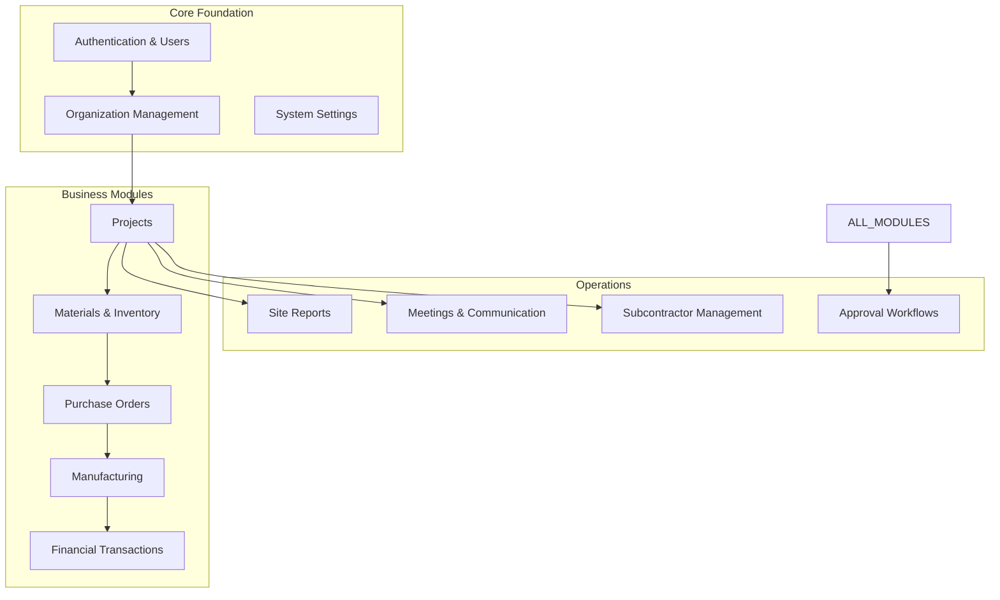
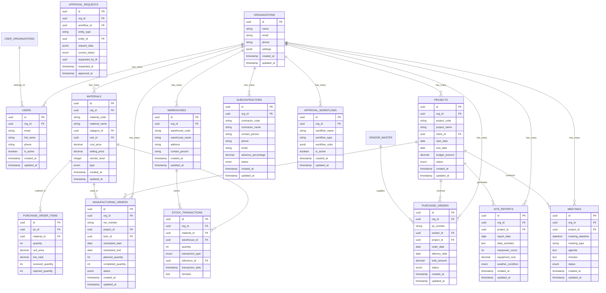
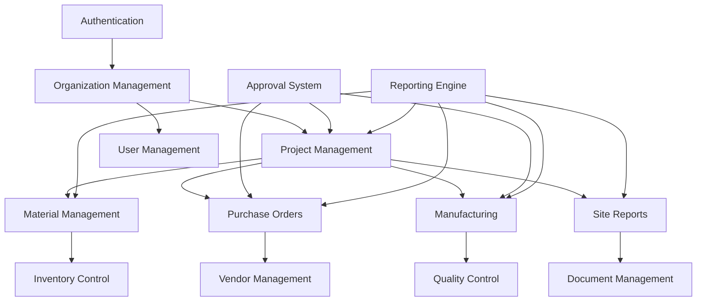

# Database Schema

<cite>
**Referenced Files in This Document**
- [database-complete.sql](file://src/database-complete.sql)
- [database-setup.sql](file://src/database-setup.sql)
- [database-tables.sql](file://src/database-tables.sql)
- [supabase-tables.sql](file://supabase-tables.sql)
- [database-indexes.sql](file://database-indexes.sql)
- [database-materials.sql](file://src/database-materials.sql)
- [database-inventory.sql](file://src/database-inventory.sql)
- [database-quotation.sql](file://src/database-quotation.sql)
- [database-purchase-module.sql](file://src/database-purchase-module.sql)
- [database-manufacturing.sql](file://src/database-manufacturing.sql)
- [database-site-reports.sql](file://src/database-site-reports.sql)
- [database-meetings.sql](file://src/database-meetings.sql)
- [database-subcontractors.sql](file://src/database-subcontractors.sql)
- [database-project-enhancement.sql](file://src/database-project-enhancement.sql)
- [database-auth.sql](file://src/database-auth.sql)
- [database-approval.sql](file://src/database-approval.sql)
</cite>

## Table of Contents
1. [Introduction](#introduction)
2. [Project Structure](#project-structure)
3. [Core Components](#core-components)
4. [Architecture Overview](#architecture-overview)
5. [Detailed Component Analysis](#detailed-component-analysis)
6. [Dependency Analysis](#dependency-analysis)
7. [Performance Considerations](#performance-considerations)
8. [Troubleshooting Guide](#troubleshooting-guide)
9. [Conclusion](#conclusion)
10. [Appendices](#appendices)

## Introduction

The MEP Project ERP system is a comprehensive enterprise resource planning solution designed for Mechanical, Electrical, and Plumbing (MEP) contractors and construction companies. The system manages end-to-end business operations including project management, material procurement, inventory control, manufacturing processes, financial transactions, and client communications.

This document provides a comprehensive overview of the database schema architecture, entity relationships, data structures, and business logic implementation across all modules of the ERP system.

## Project Structure

The database schema is organized into modular components that align with the business domains of the MEP industry:

**Diagram sources**
- [database-complete.sql](file://src/database-complete.sql)
- [database-setup.sql](file://src/database-setup.sql)

## Core Components

### Authentication and User Management

The authentication system provides secure user access control with role-based permissions and multi-organization support.

**Key Tables:**
- `users` - Core user account information
- `organizations` - Multi-tenant organization structure
- `user_organizations` - Many-to-many relationship between users and organizations
- `roles` - Role definitions and permissions
- `permissions` - Granular permission system

**Section sources**
- [database-auth.sql](file://src/database-auth.sql)
- [database-setup.sql](file://src/database-setup.sql)

### Organization Management

Multi-tenant architecture supporting multiple organizations with hierarchical structures and shared resources.

**Key Tables:**
- `organizations` - Primary organization entities
- `organization_settings` - Configuration per organization
- `org_members` - Membership management
- `org_modules` - Feature toggles per organization

**Section sources**
- [database-setup.sql](file://src/database-setup.sql)

### Project Management

Comprehensive project lifecycle management from initiation to completion with milestone tracking and resource allocation.

**Key Tables:**
- `projects` - Main project entities
- `project_milestones` - Timeline and deliverable tracking
- `project_team` - Team member assignments
- `project_documents` - Document management
- `project_budgets` - Financial planning and tracking

**Section sources**
- [database-project-enhancement.sql](file://src/database-project-enhancement.sql)

### Materials and Inventory Management

Complete material lifecycle management including procurement, stock control, and consumption tracking.

**Key Tables:**
- `materials` - Material master data
- `material_categories` - Classification hierarchy
- `warehouses` - Storage location management
- `stock_transactions` - Movement tracking
- `material_units` - Unit of measurement conversions

**Section sources**
- [database-materials.sql](file://src/database-materials.sql)
- [database-inventory.sql](file://src/database-inventory.sql)

### Purchase Order Management

End-to-end procurement workflow from requisition to payment processing.

**Key Tables:**
- `purchase_orders` - PO header information
- `purchase_order_items` - Line item details
- `vendor_master` - Supplier information
- `purchase_requisitions` - Internal requests
- `payment_terms` - Payment scheduling

**Section sources**
- [database-purchase-module.sql](file://src/database-purchase-module.sql)

### Manufacturing Module

Production planning and execution tracking for fabrication and assembly processes.

**Key Tables:**
- `manufacturing_orders` - Production job cards
- `bill_of_materials` - BOM structure
- `production_entries` - Daily production tracking
- `quality_checks` - Quality assurance records
- `equipment_management` - Machine utilization

**Section sources**
- [database-manufacturing.sql](file://src/database-manufacturing.sql)

### Site Reporting and Field Operations

Field data collection and site progress tracking for construction activities.

**Key Tables:**
- `site_reports` - Daily site activity logs
- `site_photos` - Visual documentation
- `work_stoppages` - Delay tracking
- `measurement_sheets` - Quantity verification
- `daily_updates` - Progress reporting

**Section sources**
- [database-site-reports.sql](file://src/database-site-reports.sql)

### Meeting and Communication Management

Structured communication tracking and meeting management system.

**Key Tables:**
- `meetings` - Meeting schedules and minutes
- `meeting_attendees` - Participant tracking
- `client_communications` - Client interaction logs
- `communication_attachments` - Document storage references

**Section sources**
- [database-meetings.sql](file://src/database-meetings.sql)

### Subcontractor Management

Vendor and subcontractor relationship management with performance tracking.

**Key Tables:**
- `subcontractors` - Vendor master data
- `subcontractor_work_orders` - Work assignment tracking
- `subcontractor_payments` - Payment processing
- `performance_ratings` - Quality assessment

**Section sources**
- [database-subcontractors.sql](file://src/database-subcontractors.sql)

### Approval Workflow System

Configurable approval workflows for various business processes.

**Key Tables:**
- `approval_workflows` - Workflow definitions
- `approval_requests` - Pending approvals
- `approval_history` - Audit trail
- `approval_settings` - Configuration rules

**Section sources**
- [database-approval.sql](file://src/database-approval.sql)

## Architecture Overview

The database architecture follows a normalized relational model with strategic denormalization for performance optimization.

**Diagram sources**
- [database-complete.sql](file://src/database-complete.sql)
- [supabase-tables.sql](file://supabase-tables.sql)

## Detailed Component Analysis

### Entity Relationship Complexity Analysis

The database design implements sophisticated relationship patterns to support complex business scenarios:

#### Multi-Tenant Architecture Pattern
- **Organization Isolation**: All business entities are scoped to organizations using foreign key constraints
- **Shared Reference Data**: Some tables like materials and units can be shared across organizations
- **Hierarchical Permissions**: Role-based access control with organization-level scoping

#### Transactional Integrity Patterns
- **ACID Compliance**: Complex financial transactions use database-level constraints
- **Audit Trails**: Comprehensive change tracking through audit tables
- **Soft Deletes**: Logical deletion pattern for data preservation and recovery

#### Performance Optimization Strategies
- **Strategic Indexing**: Composite indexes on frequently queried columns
- **Denormalization Points**: Calculated fields for common aggregations
- **Partitioning Strategy**: Time-based partitioning for large transaction tables

**Section sources**
- [database-complete.sql](file://src/database-complete.sql)
- [database-indexes.sql](file://database-indexes.sql)

### Data Validation and Business Rules

#### Constraint Implementation
- **Referential Integrity**: Foreign key constraints ensure data consistency
- **Check Constraints**: Business rule validation at database level
- **Unique Constraints**: Prevent duplicate entries for critical identifiers
- **Default Values**: Consistent initialization of new records

#### Trigger-Based Automation
- **Audit Logging**: Automatic creation of audit records on data changes
- **Stock Updates**: Real-time inventory adjustments on transactions
- **Status Propagation**: Cascading status updates across related entities
- **Calculation Triggers**: Automated computation of derived values

**Section sources**
- [database-materials.sql](file://src/database-materials.sql)
- [database-inventory.sql](file://src/database-inventory.sql)

### Security and Access Control

#### Row-Level Security (RLS)
- **Organization Scoping**: Users can only access their organization's data
- **Role-Based Access**: Fine-grained permissions based on user roles
- **Data Masking**: Sensitive field protection for non-privileged users

#### Audit and Compliance
- **Change Tracking**: Complete audit trail for all data modifications
- **Access Logging**: User activity monitoring and compliance reporting
- **Data Retention**: Configurable retention policies for different data types

**Section sources**
- [database-auth.sql](file://src/database-auth.sql)
- [database-approval.sql](file://src/database-approval.sql)

## Dependency Analysis

### Module Interdependencies

**Diagram sources**
- [database-complete.sql](file://src/database-complete.sql)

### Critical Path Dependencies

The system identifies several critical dependency chains that require careful management:

1. **Organization → Projects → Materials**: Core business flow requiring consistent data integrity
2. **Purchase Orders → Inventory**: Stock availability depends on purchase fulfillment
3. **Manufacturing Orders → Material Consumption**: Production requires material availability
4. **Site Reports → Project Progress**: Field data drives project status updates

**Section sources**
- [database-project-enhancement.sql](file://src/database-project-enhancement.sql)
- [database-manufacturing.sql](file://src/database-manufacturing.sql)

## Performance Considerations

### Indexing Strategy

The database employs a comprehensive indexing strategy optimized for common query patterns:

- **Primary Key Indexes**: Automatic clustering on primary keys
- **Foreign Key Indexes**: Optimized join performance across relationships
- **Composite Indexes**: Multi-column indexes for complex filtering scenarios
- **Partial Indexes**: Conditional indexes for frequently accessed subsets
- **Covering Indexes**: Include commonly selected columns to avoid table lookups

### Query Optimization

- **Materialized Views**: Pre-computed aggregations for reporting queries
- **Connection Pooling**: Efficient database connection management
- **Query Plan Analysis**: Regular monitoring and optimization of slow queries
- **Caching Strategy**: Application-level caching for reference data

### Scalability Considerations

- **Horizontal Scaling**: Read replicas for reporting workloads
- **Vertical Scaling**: Resource allocation based on workload patterns
- **Partitioning**: Large tables partitioned by time or organization
- **Archival Strategy**: Historical data archiving for performance maintenance

## Troubleshooting Guide

### Common Database Issues

#### Performance Problems
- **Slow Queries**: Use query plan analysis to identify bottlenecks
- **Lock Contention**: Monitor long-running transactions and deadlocks
- **Index Fragmentation**: Regular index maintenance and rebuilding
- **Statistics Outdated**: Update table statistics after bulk operations

#### Data Integrity Issues
- **Constraint Violations**: Check referential integrity before bulk operations
- **Duplicate Records**: Implement deduplication strategies during migrations
- **Orphaned Records**: Clean up orphaned data using cleanup scripts
- **Data Type Mismatches**: Validate data types during import operations

#### Connection and Access Issues
- **Connection Limits**: Monitor and adjust connection pool settings
- **Permission Errors**: Verify RLS policies and role assignments
- **Timeout Issues**: Optimize long-running queries and increase timeouts
- **Deadlock Resolution**: Identify and resolve circular dependencies

### Monitoring and Alerting

- **Query Performance**: Track slow query metrics and alert on thresholds
- **Storage Growth**: Monitor database size growth trends
- **Connection Usage**: Alert on connection pool exhaustion
- **Error Rates**: Monitor database error rates and patterns

**Section sources**
- [database-indexes.sql](file://database-indexes.sql)

## Conclusion

The MEP Project ERP database schema represents a comprehensive, well-architected solution for managing complex construction and manufacturing operations. The design balances normalization principles with practical performance considerations, implementing robust security measures and scalability patterns.

Key strengths include:
- **Modular Architecture**: Clear separation of concerns across business domains
- **Multi-Tenant Support**: Secure isolation of organizational data
- **Comprehensive Audit Trail**: Complete data lineage and compliance support
- **Performance Optimization**: Strategic indexing and query optimization
- **Security Framework**: Layered security with role-based access control

The schema provides a solid foundation for continued development and scaling as business requirements evolve.

## Appendices

### Migration Strategy

#### Version Control Approach
- **Migration Files**: Incremental SQL migration files for schema evolution
- **Rollback Scripts**: Companion rollback scripts for each migration
- **Data Migration Tools**: Automated tools for data transformation during upgrades
- **Testing Framework**: Comprehensive testing suite for migration validation

#### Backup and Recovery
- **Automated Backups**: Scheduled full and incremental backups
- **Point-in-Time Recovery**: Continuous WAL archiving for granular recovery
- **Disaster Recovery**: Cross-region replication and failover procedures
- **Backup Validation**: Regular backup integrity testing and restoration drills

### Compliance and Security

#### Regulatory Compliance
- **Data Privacy**: GDPR and local privacy regulation compliance
- **Audit Requirements**: Comprehensive audit logging for regulatory reporting
- **Data Retention**: Configurable retention policies aligned with legal requirements
- **Access Controls**: Principle of least privilege enforcement

#### Security Measures
- **Encryption**: Data encryption at rest and in transit
- **Access Logging**: Comprehensive audit trails for security monitoring
- **Vulnerability Scanning**: Regular security assessments and penetration testing
- **Incident Response**: Automated security incident detection and response