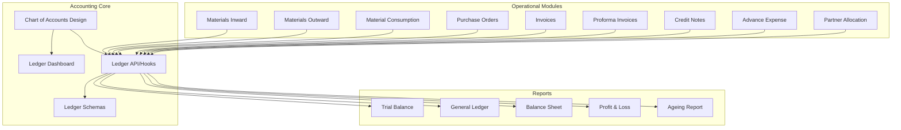
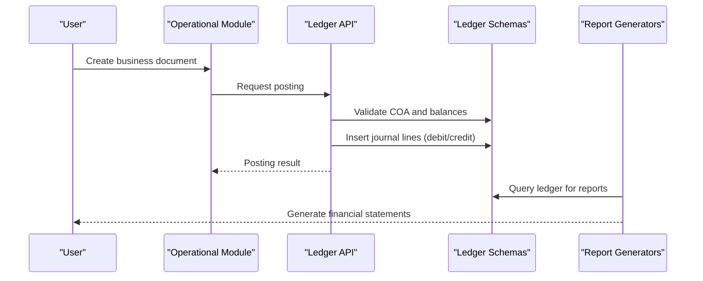
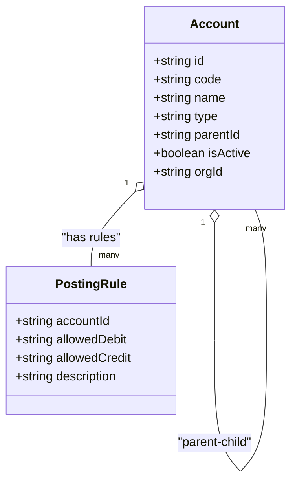
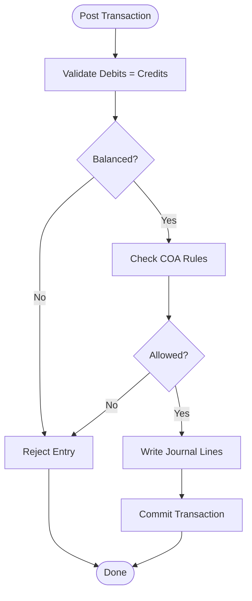
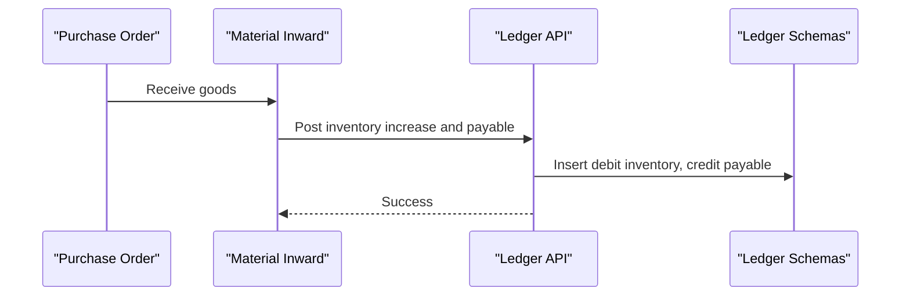
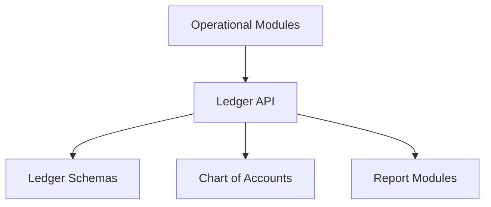
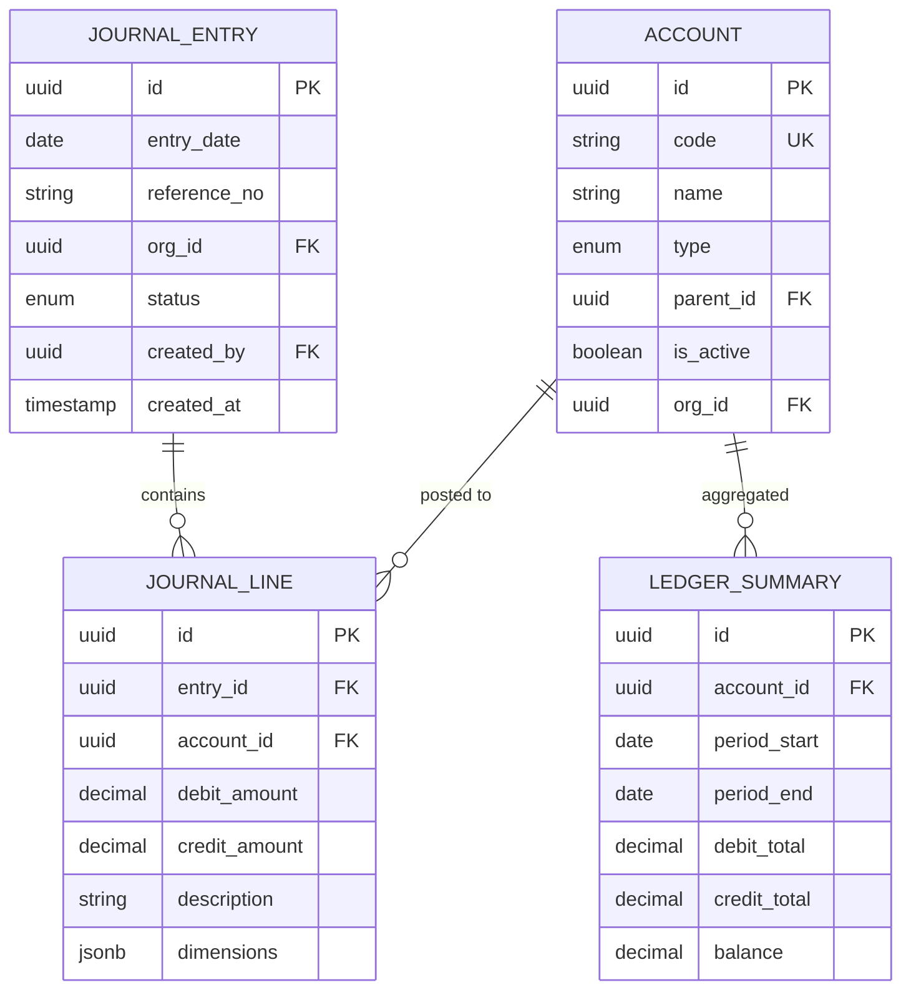

# Accounting Entries & Journal System

<cite>
**Referenced Files in This Document**
- [ACCOUNTING_COA_DESIGN.md](file://ACCOUNTING_COA_DESIGN.md)
- [src/pages/accounting/index.tsx](file://src/pages/accounting/index.tsx)
- [src/ledger/LedgerDashboard.tsx](file://src/ledger/LedgerDashboard.tsx)
- [src/ledger/api.ts](file://src/ledger/api.ts)
- [src/ledger/hooks.ts](file://src/ledger/hooks.ts)
- [src/ledger/schemas.ts](file://src/ledger/schemas.ts)
- [src/ledger/utils.ts](file://src/ledger/utils.ts)
- [src/database/subcontractor_ledger_complete.sql](file://src/database/subcontractor_ledger_complete.sql)
- [src/database/measurement_sheet_system.sql](file://src/database/measurement_sheet_system.sql)
- [src/database/work_orders_migration.sql](file://src/database/work_orders_migration.sql)
- [src/types/ledger.types.ts](file://src/types/ledger.types.ts)
- [src/features/materials/inward/api.ts](file://src/features/materials/inward/api.ts)
- [src/features/materials/outward/api.ts](file://src/features/materials/outward/api.ts)
- [src/features/materials/consumption/api.ts](file://src/features/materials/consumption/api.ts)
- [src/features/purchase/orders/api.ts](file://src/features/purchase/orders/api.ts)
- [src/features/invoices/api.ts](file://src/features/invoices/api.ts)
- [src/features/proforma-invoices/api.ts](file://src/features/proforma-invoices/api.ts)
- [src/features/credit-notes/api.ts](file://src/features/credit-notes/api.ts)
- [src/features/advance-expense/api.ts](file://src/features/advance-expense/api.ts)
- [src/features/partner-allocation/api.ts](file://src/features/partner-allocation/api.ts)
- [src/reports/trial-balance.ts](file://src/reports/trial-balance.ts)
- [src/reports/balance-sheet.ts](file://src/reports/balance-sheet.ts)
- [src/reports/profit-loss.ts](file://src/reports/profit-loss.ts)
- [src/reports/general-ledger.ts](file://src/reports/general-ledger.ts)
- [src/reports/ageing-report.ts](file://src/reports/ageing-report.ts)
- [src/lib/currency.ts](file://src/lib/currency.ts)
- [src/lib/supabase.ts](file://src/lib/supabase.ts)
</cite>

## Table of Contents
1. [Introduction](#introduction)
2. [Project Structure](#project-structure)
3. [Core Components](#core-components)
4. [Architecture Overview](#architecture-overview)
5. [Detailed Component Analysis](#detailed-component-analysis)
6. [Dependency Analysis](#dependency-analysis)
7. [Performance Considerations](#performance-considerations)
8. [Troubleshooting Guide](#troubleshooting-guide)
9. [Conclusion](#conclusion)
10. [Appendices](#appendices)

## Introduction
This document provides comprehensive data model documentation for the accounting entries and journal system, focusing on chart of accounts structure, journal entry tables, and double-entry bookkeeping implementation. It explains account hierarchies, transaction posting flows, financial statement generation, trial balance calculations, ledger maintenance, and period-end closing procedures. It also includes examples of accounting queries, balance sheet generation, profit/loss calculations, regulatory compliance considerations, audit requirements, and multi-entity accounting support.

The system is designed to integrate with operational modules (materials, purchase orders, invoices, credit notes, advance expenses, partner allocations) to post standardized accounting entries while maintaining a consistent chart of accounts and robust reporting capabilities.

## Project Structure
The accounting subsystem spans UI pages, ledger utilities, database schemas, and report generators:
- Chart of Accounts design and policies are defined in a dedicated design document.
- Ledger UI and API hooks provide user-facing functionality for viewing and managing ledgers.
- Database migrations define core schema elements for ledger-related entities.
- Report modules implement trial balance, general ledger, balance sheet, profit/loss, and ageing reports.
- Operational module APIs trigger accounting postings through shared ledger logic.

[No sources needed since this diagram shows conceptual workflow, not actual code structure]

## Core Components
- Chart of Accounts (COA): Hierarchical account definitions with types, parent-child relationships, and posting rules.
- Journal Entry Tables: Atomic records capturing debit/credit lines, references to source documents, and metadata for auditability.
- Double-Entry Posting Engine: Validates debits equal credits, enforces account constraints, and writes balanced entries.
- Ledger Maintenance: Aggregates balances by account, supports opening balances, reversals, and adjustments.
- Financial Statements: Generates trial balance, general ledger, balance sheet, profit/loss, and ageing reports from posted entries.
- Period-End Closing: Locks periods, prevents retroactive changes, and ensures accurate roll-forward of balances.

Key responsibilities:
- Maintain COA hierarchy and validation rules.
- Ensure every transaction posts balanced journal entries.
- Provide queryable ledger views for reporting and analysis.
- Support multi-entity isolation via organization identifiers.

**Section sources**
- [ACCOUNTING_COA_DESIGN.md](file://ACCOUNTING_COA_DESIGN.md)
- [src/ledger/LedgerDashboard.tsx](file://src/ledger/LedgerDashboard.tsx)
- [src/ledger/api.ts](file://src/ledger/api.ts)
- [src/ledger/hooks.ts](file://src/ledger/hooks.ts)
- [src/ledger/schemas.ts](file://src/ledger/schemas.ts)
- [src/ledger/utils.ts](file://src/ledger/utils.ts)

## Architecture Overview
The accounting architecture integrates operational modules with a centralized ledger engine. Each business event triggers posting routines that create journal entries adhering to the chart of accounts. Reports consume these entries to produce financial statements.

**Diagram sources**
- [src/ledger/api.ts](file://src/ledger/api.ts)
- [src/ledger/schemas.ts](file://src/ledger/schemas.ts)
- [src/reports/trial-balance.ts](file://src/reports/trial-balance.ts)
- [src/reports/balance-sheet.ts](file://src/reports/balance-sheet.ts)
- [src/reports/profit-loss.ts](file://src/reports/profit-loss.ts)

## Detailed Component Analysis

### Chart of Accounts (COA)
The COA defines hierarchical accounts with attributes such as type (asset, liability, equity, income, expense), parent-child relationships, and posting constraints. It governs which accounts can be used for specific transactions and how balances roll up.

Key aspects:
- Hierarchy: Root accounts group related sub-accounts; leaf accounts hold balances.
- Types: Enforce normal balances (debits vs credits) and reporting categories.
- Validation: Prevent posting to restricted or non-existent accounts.
- Multi-entity: Accounts may be scoped per organization for isolation.

**Diagram sources**
- [ACCOUNTING_COA_DESIGN.md](file://ACCOUNTING_COA_DESIGN.md)

**Section sources**
- [ACCOUNTING_COA_DESIGN.md](file://ACCOUNTING_COA_DESIGN.md)

### Journal Entry Tables
Journal entries capture each transaction’s debit and credit lines, ensuring double-entry integrity. They include references to source documents, timestamps, and audit metadata.

Core fields:
- Entry header: unique identifier, date, reference number, organization, status.
- Line items: account ID, debit amount, credit amount, description, dimension tags.
- Audit trail: created_by, updated_at, reversal flags.

Posting flow:
- Validate total debits equal total credits.
- Check account permissions and restrictions.
- Persist entries atomically within a transaction.

**Diagram sources**
- [src/ledger/api.ts](file://src/ledger/api.ts)
- [src/ledger/schemas.ts](file://src/ledger/schemas.ts)

**Section sources**
- [src/ledger/schemas.ts](file://src/ledger/schemas.ts)
- [src/ledger/utils.ts](file://src/ledger/utils.ts)

### Double-Entry Bookkeeping Implementation
The posting engine enforces double-entry principles:
- Every transaction must have at least one debit and one credit.
- Sum of debits equals sum of credits.
- Account types determine whether increases are debits or credits.
- Reversal entries are supported for corrections.

Integration points:
- Operational modules call ledger APIs to post entries.
- Reports read ledger data to compute balances and statements.

**Section sources**
- [src/ledger/api.ts](file://src/ledger/api.ts)
- [src/ledger/hooks.ts](file://src/ledger/hooks.ts)

### Account Hierarchies
Hierarchical accounts enable roll-up reporting and structured navigation:
- Parent accounts aggregate child balances.
- Leaf accounts store transactional detail.
- Reporting tools traverse hierarchy to generate consolidated views.

Best practices:
- Use consistent numbering schemes for readability.
- Restrict posting to leaf accounts where appropriate.
- Maintain active/inactive flags for lifecycle management.

**Section sources**
- [ACCOUNTING_COA_DESIGN.md](file://ACCOUNTING_COA_DESIGN.md)

### Transaction Posting
Posting workflows vary by module but share common steps:
- Build journal lines based on business logic.
- Validate against COA and posting rules.
- Execute atomic write operations.
- Return confirmation and IDs for traceability.

Examples:
- Material inward posts inventory and vendor payables.
- Invoice posts revenue and receivables.
- Credit note reverses prior revenue or payables.

**Diagram sources**
- [src/features/materials/inward/api.ts](file://src/features/materials/inward/api.ts)
- [src/ledger/api.ts](file://src/ledger/api.ts)
- [src/ledger/schemas.ts](file://src/ledger/schemas.ts)

**Section sources**
- [src/features/materials/inward/api.ts](file://src/features/materials/inward/api.ts)
- [src/features/materials/outward/api.ts](file://src/features/materials/outward/api.ts)
- [src/features/materials/consumption/api.ts](file://src/features/materials/consumption/api.ts)
- [src/features/purchase/orders/api.ts](file://src/features/purchase/orders/api.ts)
- [src/features/invoices/api.ts](file://src/features/invoices/api.ts)
- [src/features/proforma-invoices/api.ts](file://src/features/proforma-invoices/api.ts)
- [src/features/credit-notes/api.ts](file://src/features/credit-notes/api.ts)
- [src/features/advance-expense/api.ts](file://src/features/advance-expense/api.ts)
- [src/features/partner-allocation/api.ts](file://src/features/partner-allocation/api.ts)

### Financial Statement Generation
Financial statements are generated from posted ledger entries:
- Trial Balance: Summarizes account balances at a point in time.
- General Ledger: Lists all transactions per account with running totals.
- Balance Sheet: Assets = Liabilities + Equity snapshot.
- Profit & Loss: Income minus expenses over a period.
- Ageing Report: Receivable/payable buckets by due dates.

Implementation approach:
- Aggregate ledger lines by account and period.
- Apply currency conversions using configured rates.
- Format outputs for display and export.

**Section sources**
- [src/reports/trial-balance.ts](file://src/reports/trial-balance.ts)
- [src/reports/general-ledger.ts](file://src/reports/general-ledger.ts)
- [src/reports/balance-sheet.ts](file://src/reports/balance-sheet.ts)
- [src/reports/profit-loss.ts](file://src/reports/profit-loss.ts)
- [src/reports/ageing-report.ts](file://src/reports/ageing-report.ts)
- [src/lib/currency.ts](file://src/lib/currency.ts)

### Trial Balance Calculations
Trial balance computation:
- For each account, sum debits and credits across selected period(s).
- Compute net balance per account based on type.
- Verify overall equality of total debits and credits.

Query example pattern:
- Select ledger lines grouped by account and period.
- Filter by organization and date range.
- Aggregate amounts and format results.

**Section sources**
- [src/reports/trial-balance.ts](file://src/reports/trial-balance.ts)
- [src/ledger/api.ts](file://src/ledger/api.ts)

### Ledger Maintenance
Ledger maintenance tasks include:
- Opening balances setup for new periods.
- Adjustments and accruals posting.
- Reversals for corrections.
- Period locking to prevent retroactive edits.

Operational hooks:
- UI components allow authorized users to perform maintenance actions.
- API enforces validation and audit logging.

**Section sources**
- [src/ledger/LedgerDashboard.tsx](file://src/ledger/LedgerDashboard.tsx)
- [src/ledger/hooks.ts](file://src/ledger/hooks.ts)
- [src/ledger/utils.ts](file://src/ledger/utils.ts)

### Period-End Closing Procedures
Period-end closing ensures accurate financial snapshots:
- Lock closed periods to prevent modifications.
- Roll forward balances into next period.
- Generate closing reports for review and approval.
- Audit trail captures who performed closing actions.

Controls:
- Role-based access to closing functions.
- Mandatory reconciliation checks before lock.

**Section sources**
- [src/ledger/api.ts](file://src/ledger/api.ts)
- [src/ledger/utils.ts](file://src/ledger/utils.ts)

### Examples of Accounting Queries
Common query patterns:
- List all journal entries for an account within a date range.
- Calculate cumulative balances by month.
- Retrieve source-linked entries for audit trails.
- Summarize income and expenses by category.

These patterns are implemented in report modules and ledger APIs.

**Section sources**
- [src/reports/general-ledger.ts](file://src/reports/general-ledger.ts)
- [src/reports/profit-loss.ts](file://src/reports/profit-loss.ts)
- [src/ledger/api.ts](file://src/ledger/api.ts)

### Balance Sheet Generation
Balance sheet generation:
- Aggregate asset, liability, and equity account balances.
- Present current vs non-current classifications.
- Ensure assets equal liabilities plus equity.

Implementation details:
- Use COA types to classify accounts.
- Apply currency conversion for multi-currency scenarios.

**Section sources**
- [src/reports/balance-sheet.ts](file://src/reports/balance-sheet.ts)
- [ACCOUNTING_COA_DESIGN.md](file://ACCOUNTING_COA_DESIGN.md)

### Profit & Loss Calculations
Profit & loss calculation:
- Sum income and expense accounts for the period.
- Compute gross profit, operating profit, and net profit.
- Compare against prior periods for variance analysis.

**Section sources**
- [src/reports/profit-loss.ts](file://src/reports/profit-loss.ts)

### Regulatory Compliance and Audit Requirements
Compliance features:
- Immutable audit logs for all postings and adjustments.
- Segregation of duties via role-based access controls.
- Traceability from financial statements back to source documents.
- Retention policies aligned with local regulations.

Audit readiness:
- Exportable reports with full lineage.
- Controlled period locks and change approvals.

**Section sources**
- [src/ledger/api.ts](file://src/ledger/api.ts)
- [src/ledger/utils.ts](file://src/ledger/utils.ts)

### Multi-Entity Accounting Support
Multi-entity isolation:
- Organization-scoped accounts and entries.
- Separate ledgers per entity with consolidated reporting options.
- Cross-entity eliminations handled during consolidation.

Implementation:
- Include organization ID in all accounting records.
- Filter queries by organization for entity-specific views.

**Section sources**
- [src/ledger/schemas.ts](file://src/ledger/schemas.ts)
- [src/ledger/api.ts](file://src/ledger/api.ts)

## Dependency Analysis
The accounting system depends on operational modules for transaction initiation and on report modules for output generation. The ledger API acts as the central integration point.

**Diagram sources**
- [src/ledger/api.ts](file://src/ledger/api.ts)
- [src/ledger/schemas.ts](file://src/ledger/schemas.ts)
- [ACCOUNTING_COA_DESIGN.md](file://ACCOUNTING_COA_DESIGN.md)
- [src/reports/trial-balance.ts](file://src/reports/trial-balance.ts)
- [src/reports/balance-sheet.ts](file://src/reports/balance-sheet.ts)
- [src/reports/profit-loss.ts](file://src/reports/profit-loss.ts)

**Section sources**
- [src/ledger/api.ts](file://src/ledger/api.ts)
- [src/ledger/schemas.ts](file://src/ledger/schemas.ts)
- [ACCOUNTING_COA_DESIGN.md](file://ACCOUNTING_COA_DESIGN.md)

## Performance Considerations
- Indexing: Ensure indexes on organization, account, and date columns for fast aggregation.
- Batch Posting: Group multiple journal lines into single transactions to reduce overhead.
- Caching: Cache frequently accessed COA structures and account hierarchies.
- Pagination: Implement pagination for large ledger exports.
- Concurrency: Use optimistic locking to prevent conflicting updates during period-end closing.

[No sources needed since this section provides general guidance]

## Troubleshooting Guide
Common issues and resolutions:
- Unbalanced entries: Validate debit/credit sums before posting.
- Invalid account codes: Cross-check COA existence and activity status.
- Currency mismatches: Confirm exchange rates and base currency settings.
- Period locks: Verify period status and authorization levels.

Debugging utilities:
- Ledger dashboard filters for isolating problematic entries.
- API response inspection for error messages and stack traces.

**Section sources**
- [src/ledger/LedgerDashboard.tsx](file://src/ledger/LedgerDashboard.tsx)
- [src/ledger/api.ts](file://src/ledger/api.ts)
- [src/ledger/utils.ts](file://src/ledger/utils.ts)

## Conclusion
The accounting entries and journal system provides a robust foundation for double-entry bookkeeping, integrating seamlessly with operational modules and generating comprehensive financial reports. By enforcing strict validation, maintaining detailed audit trails, and supporting multi-entity isolation, the system meets regulatory compliance and audit requirements. Continuous improvements in performance and usability will further enhance its effectiveness.

[No sources needed since this section summarizes without analyzing specific files]

## Appendices

### Data Model Diagram

**Diagram sources**
- [ACCOUNTING_COA_DESIGN.md](file://ACCOUNTING_COA_DESIGN.md)
- [src/ledger/schemas.ts](file://src/ledger/schemas.ts)

### Database Schema References
- Subcontractor ledger schema for detailed party tracking.
- Measurement sheet system integration for project-based accounting.
- Work order migration for manufacturing cost postings.

**Section sources**
- [src/database/subcontractor_ledger_complete.sql](file://src/database/subcontractor_ledger_complete.sql)
- [src/database/measurement_sheet_system.sql](file://src/database/measurement_sheet_system.sql)
- [src/database/work_orders_migration.sql](file://src/database/work_orders_migration.sql)

### Type Definitions
Ledger types define structures for entries, lines, and summaries used across APIs and reports.

**Section sources**
- [src/types/ledger.types.ts](file://src/types/ledger.types.ts)

### Integration Points
- Supabase client configuration for database connectivity.
- Currency utilities for multi-currency support.

**Section sources**
- [src/lib/supabase.ts](file://src/lib/supabase.ts)
- [src/lib/currency.ts](file://src/lib/currency.ts)