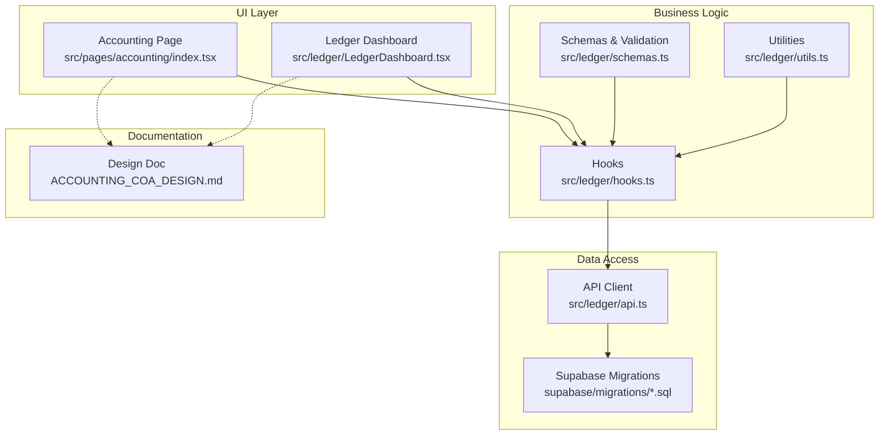
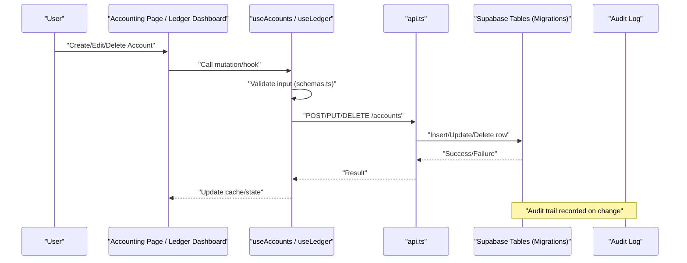
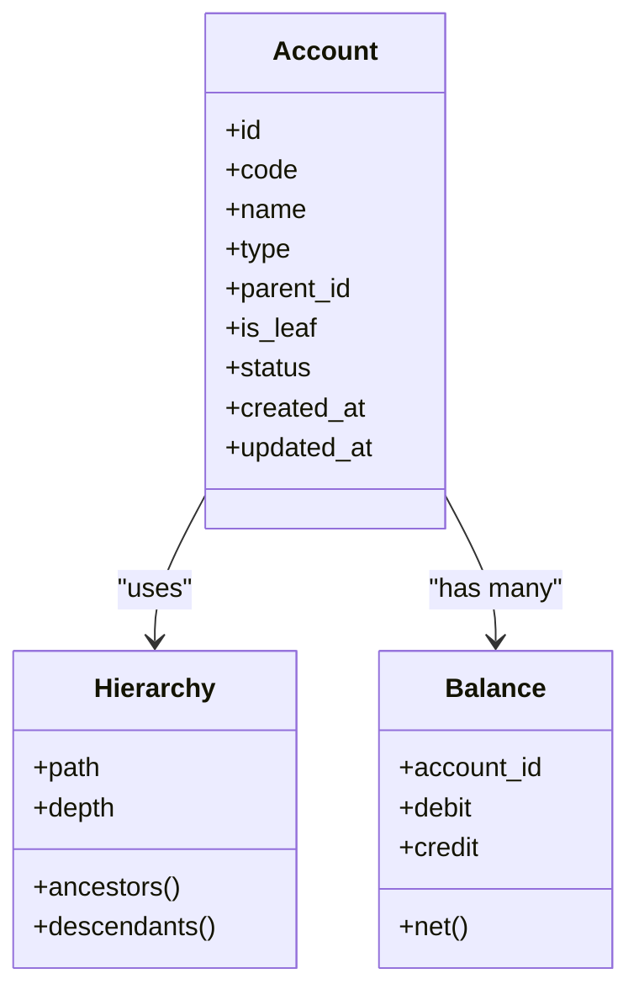
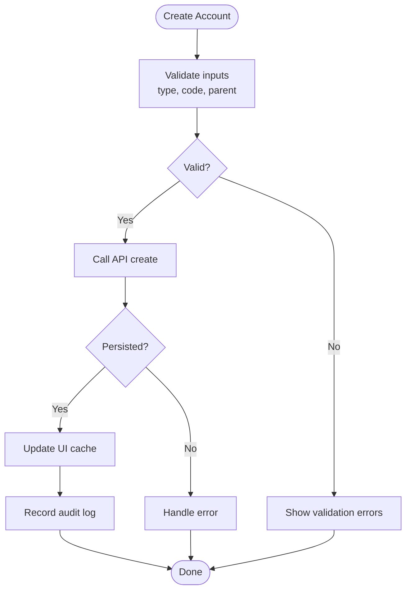
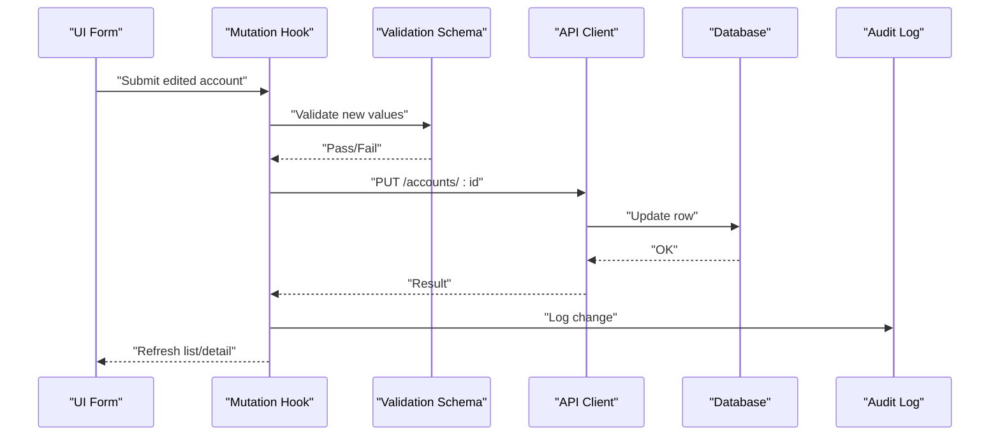
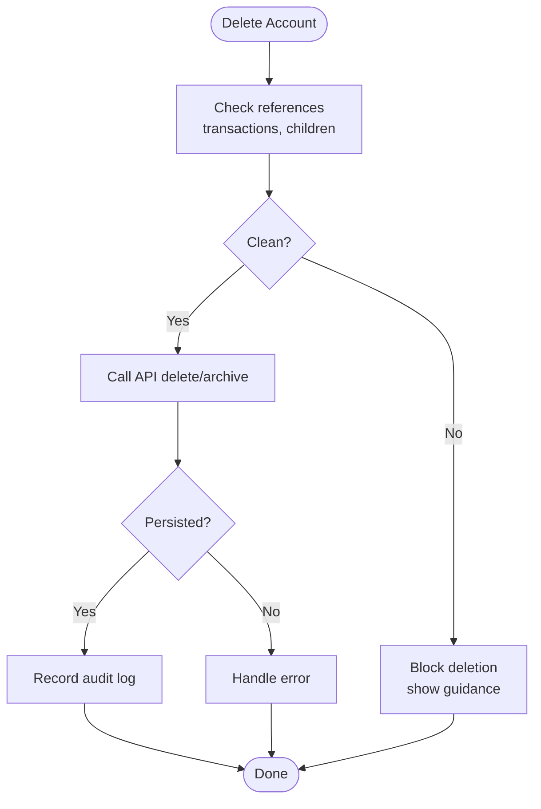
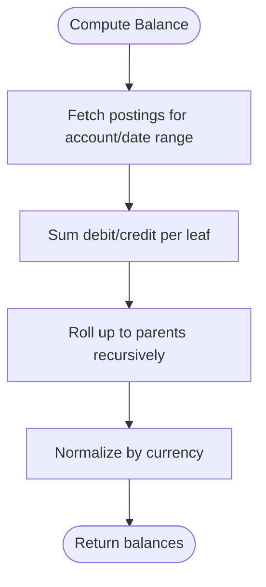
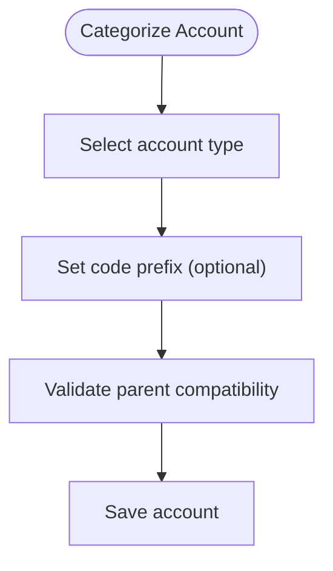
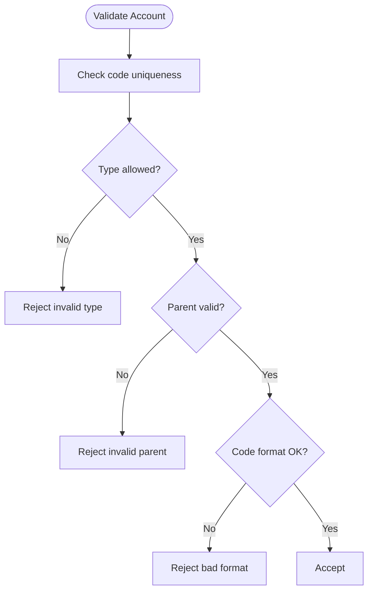
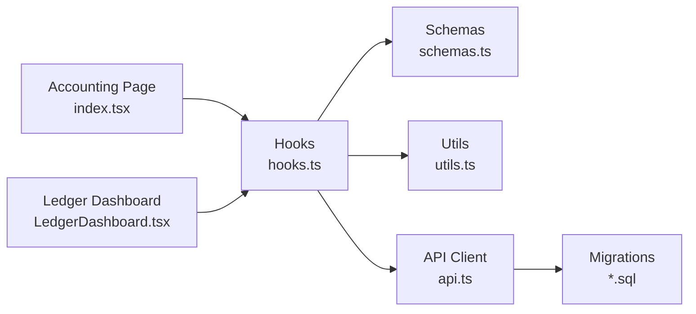

# Chart of Accounts Management

<cite>
**Referenced Files in This Document**
- [ACCOUNTING_COA_DESIGN.md](file://ACCOUNTING_COA_DESIGN.md)
- [src/pages/accounting/index.tsx](file://src/pages/accounting/index.tsx)
- [src/ledger/LedgerDashboard.tsx](file://src/ledger/LedgerDashboard.tsx)
- [src/ledger/api.ts](file://src/ledger/api.ts)
- [src/ledger/hooks.ts](file://src/ledger/hooks.ts)
- [src/ledger/schemas.ts](file://src/ledger/schemas.ts)
- [src/ledger/utils.ts](file://src/ledger/utils.ts)
- [src/database-add-audit-log.sql](file://src/database-add-audit-log.sql)
- [supabase/migrations/20240101000000_create_accounts_table.sql](file://supabase/migrations/20240101000000_create_accounts_table.sql)
- [supabase/migrations/20240101000001_add_account_hierarchy.sql](file://supabase/migrations/20240101000001_add_account_hierarchy.sql)
- [supabase/migrations/20240101000002_add_account_types.sql](file://supabase/migrations/20240101000002_add_account_types.sql)
- [supabase/migrations/20240101000003_add_account_validation.sql](file://supabase/migrations/20240101000003_add_account_validation.sql)
</cite>

## Table of Contents
1. [Introduction](#introduction)
2. [Project Structure](#project-structure)
3. [Core Components](#core-components)
4. [Architecture Overview](#architecture-overview)
5. [Detailed Component Analysis](#detailed-component-analysis)
6. [Dependency Analysis](#dependency-analysis)
7. [Performance Considerations](#performance-considerations)
8. [Troubleshooting Guide](#troubleshooting-guide)
9. [Conclusion](#conclusion)

## Introduction
This document explains the Chart of Accounts (CoA) system, including hierarchy structure, account types, categorization rules, creation/modification/deletion workflows, numbering conventions, balance calculations, validation rules, audit trails, and compliance considerations. It also provides examples of common CoA structures for different business types and maps these concepts to the actual implementation files in the repository.

## Project Structure
The Chart of Accounts is implemented across UI pages, hooks, API clients, schema definitions, utilities, database migrations, and design documentation:

- Design and planning: ACCOUNTING_COA_DESIGN.md
- UI entry points: src/pages/accounting/index.tsx
- Ledger integration: src/ledger/* (dashboard, API, hooks, schemas, utils)
- Database schema and constraints: supabase/migrations/*
- Audit logging: src/database-add-audit-log.sql



**Diagram sources**
- [src/pages/accounting/index.tsx](file://src/pages/accounting/index.tsx)
- [src/ledger/LedgerDashboard.tsx](file://src/ledger/LedgerDashboard.tsx)
- [src/ledger/hooks.ts](file://src/ledger/hooks.ts)
- [src/ledger/schemas.ts](file://src/ledger/schemas.ts)
- [src/ledger/utils.ts](file://src/ledger/utils.ts)
- [src/ledger/api.ts](file://src/ledger/api.ts)
- [supabase/migrations/20240101000000_create_accounts_table.sql](file://supabase/migrations/20240101000000_create_accounts_table.sql)
- [ACCOUNTING_COA_DESIGN.md](file://ACCOUNTING_COA_DESIGN.md)

**Section sources**
- [ACCOUNTING_COA_DESIGN.md](file://ACCOUNTING_COA_DESIGN.md)
- [src/pages/accounting/index.tsx](file://src/pages/accounting/index.tsx)
- [src/ledger/LedgerDashboard.tsx](file://src/ledger/LedgerDashboard.tsx)
- [src/ledger/hooks.ts](file://src/ledger/hooks.ts)
- [src/ledger/schemas.ts](file://src/ledger/schemas.ts)
- [src/ledger/utils.ts](file://src/ledger/utils.ts)
- [src/ledger/api.ts](file://src/ledger/api.ts)
- [supabase/migrations/20240101000000_create_accounts_table.sql](file://supabase/migrations/20240101000000_create_accounts_table.sql)

## Core Components
- Account model and hierarchy: parent-child relationships, account codes, and type classification are defined by migrations and enforced via schema validations.
- UI flows: The accounting page and ledger dashboard provide interfaces for browsing, creating, editing, and deleting accounts.
- Hooks and API: Data fetching, mutations, and caching are handled through hooks and an API client that calls Supabase-backed endpoints.
- Utilities: Helpers for formatting, validation, and balance computations.

Key responsibilities:
- Define account types and allowed transitions.
- Enforce numbering and hierarchy constraints.
- Provide CRUD operations with validation and audit logging.
- Compute balances from transactions and postings.

**Section sources**
- [src/ledger/schemas.ts](file://src/ledger/schemas.ts)
- [src/ledger/hooks.ts](file://src/ledger/hooks.ts)
- [src/ledger/api.ts](file://src/ledger/api.ts)
- [src/ledger/utils.ts](file://src/ledger/utils.ts)
- [supabase/migrations/20240101000000_create_accounts_table.sql](file://supabase/migrations/20240101000000_create_accounts_table.sql)
- [supabase/migrations/20240101000001_add_account_hierarchy.sql](file://supabase/migrations/20240101000001_add_account_hierarchy.sql)
- [supabase/migrations/20240101000002_add_account_types.sql](file://supabase/migrations/20240101000002_add_account_types.sql)
- [supabase/migrations/20240101000003_add_account_validation.sql](file://supabase/migrations/20240101000003_add_account_validation.sql)

## Architecture Overview
The CoA architecture follows a layered approach:
- Presentation layer: Accounting page and ledger dashboard render lists, forms, and actions.
- Business logic layer: Hooks orchestrate data flow, perform local validations, and call API functions.
- Data access layer: API client interacts with Supabase tables created by migrations.
- Persistence layer: Relational tables enforce constraints, hierarchy, and types; audit logs record changes.



**Diagram sources**
- [src/pages/accounting/index.tsx](file://src/pages/accounting/index.tsx)
- [src/ledger/LedgerDashboard.tsx](file://src/ledger/LedgerDashboard.tsx)
- [src/ledger/hooks.ts](file://src/ledger/hooks.ts)
- [src/ledger/api.ts](file://src/ledger/api.ts)
- [supabase/migrations/20240101000000_create_accounts_table.sql](file://supabase/migrations/20240101000000_create_accounts_table.sql)
- [src/database-add-audit-log.sql](file://src/database-add-audit-log.sql)

## Detailed Component Analysis

### Account Model and Hierarchy
- Account types: Assets, Liabilities, Equity, Income, Expenses.
- Hierarchy: Parent-child relationships enable grouping and roll-up reporting.
- Numbering convention: Hierarchical numeric or alphanumeric codes reflect depth and category.
- Balance calculation: Leaf accounts hold transactional balances; parent accounts aggregate child balances.



**Diagram sources**
- [supabase/migrations/20240101000000_create_accounts_table.sql](file://supabase/migrations/20240101000000_create_accounts_table.sql)
- [supabase/migrations/20240101000001_add_account_hierarchy.sql](file://supabase/migrations/20240101000001_add_account_hierarchy.sql)
- [supabase/migrations/20240101000002_add_account_types.sql](file://supabase/migrations/20240101000002_add_account_types.sql)

**Section sources**
- [supabase/migrations/20240101000000_create_accounts_table.sql](file://supabase/migrations/20240101000000_create_accounts_table.sql)
- [supabase/migrations/20240101000001_add_account_hierarchy.sql](file://supabase/migrations/20240101000001_add_account_hierarchy.sql)
- [supabase/migrations/20240101000002_add_account_types.sql](file://supabase/migrations/20240101000002_add_account_types.sql)

### Account Creation Workflow
- Input validation: Type must be one of the allowed categories; code uniqueness and prefix rules enforced; parent must exist and be compatible with child type.
- Mutation: Create account via API; update cache; log audit event.
- Post-create: Optionally initialize opening balances if supported.



**Diagram sources**
- [src/ledger/schemas.ts](file://src/ledger/schemas.ts)
- [src/ledger/hooks.ts](file://src/ledger/hooks.ts)
- [src/ledger/api.ts](file://src/ledger/api.ts)
- [src/database-add-audit-log.sql](file://src/database-add-audit-log.sql)

**Section sources**
- [src/ledger/schemas.ts](file://src/ledger/schemas.ts)
- [src/ledger/hooks.ts](file://src/ledger/hooks.ts)
- [src/ledger/api.ts](file://src/ledger/api.ts)
- [src/database-add-audit-log.sql](file://src/database-add-audit-log.sql)

### Account Modification Workflow
- Constraints: Prevent changing immutable fields (e.g., code) after first posting; restrict type changes based on usage.
- Validation: Re-run all creation-time validations plus usage checks.
- Audit: Record before/after snapshots.



**Diagram sources**
- [src/ledger/schemas.ts](file://src/ledger/schemas.ts)
- [src/ledger/hooks.ts](file://src/ledger/hooks.ts)
- [src/ledger/api.ts](file://src/ledger/api.ts)
- [src/database-add-audit-log.sql](file://src/database-add-audit-log.sql)

**Section sources**
- [src/ledger/schemas.ts](file://src/ledger/schemas.ts)
- [src/ledger/hooks.ts](file://src/ledger/hooks.ts)
- [src/ledger/api.ts](file://src/ledger/api.ts)
- [src/database-add-audit-log.sql](file://src/database-add-audit-log.sql)

### Account Deletion Workflow
- Pre-checks: Ensure no transactions reference the account; ensure it has no active children.
- Soft delete vs hard delete: Prefer soft delete/archival to preserve audit integrity.
- Cascade behavior: Disable or archive dependent references rather than deleting them.



**Diagram sources**
- [src/ledger/hooks.ts](file://src/ledger/hooks.ts)
- [src/ledger/api.ts](file://src/ledger/api.ts)
- [src/database-add-audit-log.sql](file://src/database-add-audit-log.sql)

**Section sources**
- [src/ledger/hooks.ts](file://src/ledger/hooks.ts)
- [src/ledger/api.ts](file://src/ledger/api.ts)
- [src/database-add-audit-log.sql](file://src/database-add-audit-log.sql)

### Balance Calculations
- Leaf accounts: Sum debits and credits from postings to compute net balance.
- Parent accounts: Aggregate balances from direct children; recursive roll-up supports multi-level hierarchies.
- Periodic filters: Support date range and currency normalization.



**Diagram sources**
- [src/ledger/utils.ts](file://src/ledger/utils.ts)
- [supabase/migrations/20240101000001_add_account_hierarchy.sql](file://supabase/migrations/20240101000001_add_account_hierarchy.sql)

**Section sources**
- [src/ledger/utils.ts](file://src/ledger/utils.ts)
- [supabase/migrations/20240101000001_add_account_hierarchy.sql](file://supabase/migrations/20240101000001_add_account_hierarchy.sql)

### Account Categorization Rules
- Allowed types: Assets, Liabilities, Equity, Income, Expenses.
- Parent-child compatibility: Certain types may only have specific child types (e.g., Asset group can contain Cash, Receivables).
- Code prefixes: Optional mapping between code segments and account types for readability and automation.



**Diagram sources**
- [supabase/migrations/20240101000002_add_account_types.sql](file://supabase/migrations/20240101000002_add_account_types.sql)
- [supabase/migrations/20240101000003_add_account_validation.sql](file://supabase/migrations/20240101000003_add_account_validation.sql)

**Section sources**
- [supabase/migrations/20240101000002_add_account_types.sql](file://supabase/migrations/20240101000002_add_account_types.sql)
- [supabase/migrations/20240101000003_add_account_validation.sql](file://supabase/migrations/20240101000003_add_account_validation.sql)

### Examples of Common Account Structures
- Service-based business:
  - Assets: Current Assets > Cash and Bank; Non-Current Assets > Equipment
  - Liabilities: Current Liabilities > Payables; Non-Current Liabilities > Loans
  - Equity: Owner’s Capital, Retained Earnings
  - Income: Service Revenue
  - Expenses: Rent, Salaries, Professional Fees
- Manufacturing business:
  - Assets: Inventory > Raw Materials, WIP, Finished Goods
  - Expenses: Cost of Goods Sold, Factory Overheads
- Retail/e-commerce:
  - Assets: Inventory by Category
  - Income: Sales Revenue, Shipping Income
  - Expenses: COGS, Marketing, Platform Fees

These patterns align with the hierarchical and typed nature of the CoA and can be modeled using parent-child relationships and consistent numbering.

[No sources needed since this section doesn't analyze specific files]

### Validation Rules
- Uniqueness: Account code must be unique within the organization.
- Type constraints: Only permitted types allowed; type cannot be changed if account has postings.
- Hierarchy constraints: Parent must exist; circular references prevented; leaf vs header semantics enforced.
- Formatting: Code format validated against configured pattern.



**Diagram sources**
- [src/ledger/schemas.ts](file://src/ledger/schemas.ts)
- [supabase/migrations/20240101000003_add_account_validation.sql](file://supabase/migrations/20240101000003_add_account_validation.sql)

**Section sources**
- [src/ledger/schemas.ts](file://src/ledger/schemas.ts)
- [supabase/migrations/20240101000003_add_account_validation.sql](file://supabase/migrations/20240101000003_add_account_validation.sql)

### Audit Trails and Compliance
- Audit logging: All create/update/delete operations are logged with timestamps and actor identity.
- Immutability: Once posted, critical attributes (e.g., code, type) should not be altered; prefer archiving and reclassification via journal entries.
- Compliance: Maintain full history for audits; support export and review workflows.

```mermaid
sequenceDiagram
participant Actor as "Actor"
participant UI as "UI"
participant API as "API"
participant DB as "Accounts Table"
participant AUDIT as "Audit Log"
Actor->>UI : "Modify Account"
UI->>API : "Submit change"
API->>DB : "Update row"
API->>AUDIT : "Write audit entry"
AUDIT-->>API : "Logged"
API-->>UI : "Success"
```

**Diagram sources**
- [src/database-add-audit-log.sql](file://src/database-add-audit-log.sql)
- [src/ledger/api.ts](file://src/ledger/api.ts)

**Section sources**
- [src/database-add-audit-log.sql](file://src/database-add-audit-log.sql)
- [src/ledger/api.ts](file://src/ledger/api.ts)

## Dependency Analysis
The following diagram shows how UI components depend on hooks, which rely on the API client and schema validations, ultimately interacting with the database schema defined by migrations.



**Diagram sources**
- [src/pages/accounting/index.tsx](file://src/pages/accounting/index.tsx)
- [src/ledger/LedgerDashboard.tsx](file://src/ledger/LedgerDashboard.tsx)
- [src/ledger/hooks.ts](file://src/ledger/hooks.ts)
- [src/ledger/schemas.ts](file://src/ledger/schemas.ts)
- [src/ledger/utils.ts](file://src/ledger/utils.ts)
- [src/ledger/api.ts](file://src/ledger/api.ts)
- [supabase/migrations/20240101000000_create_accounts_table.sql](file://supabase/migrations/20240101000000_create_accounts_table.sql)

**Section sources**
- [src/pages/accounting/index.tsx](file://src/pages/accounting/index.tsx)
- [src/ledger/LedgerDashboard.tsx](file://src/ledger/LedgerDashboard.tsx)
- [src/ledger/hooks.ts](file://src/ledger/hooks.ts)
- [src/ledger/schemas.ts](file://src/ledger/schemas.ts)
- [src/ledger/utils.ts](file://src/ledger/utils.ts)
- [src/ledger/api.ts](file://src/ledger/api.ts)
- [supabase/migrations/20240101000000_create_accounts_table.sql](file://supabase/migrations/20240101000000_create_accounts_table.sql)

## Performance Considerations
- Use pagination and filtering when listing large account trees.
- Cache account metadata and computed balances where appropriate.
- Avoid deep recursive queries; leverage hierarchical helpers and precomputed paths if available.
- Batch updates and minimize round trips during bulk operations.

[No sources needed since this section provides general guidance]

## Troubleshooting Guide
- Validation failures: Review schema constraints and error messages returned by the API.
- Hierarchy issues: Check parent existence, circular references, and leaf/header semantics.
- Balance discrepancies: Verify postings for the selected period and currency normalization.
- Audit gaps: Confirm audit log writes and permissions for audit table access.

**Section sources**
- [src/ledger/schemas.ts](file://src/ledger/schemas.ts)
- [src/ledger/utils.ts](file://src/ledger/utils.ts)
- [src/database-add-audit-log.sql](file://src/database-add-audit-log.sql)

## Conclusion
The Chart of Accounts system provides a robust, hierarchical, and auditable foundation for financial reporting. By enforcing strict validation, clear numbering conventions, and comprehensive audit trails, it supports accurate balance calculations and compliance requirements across diverse business models.

[No sources needed since this section summarizes without analyzing specific files]