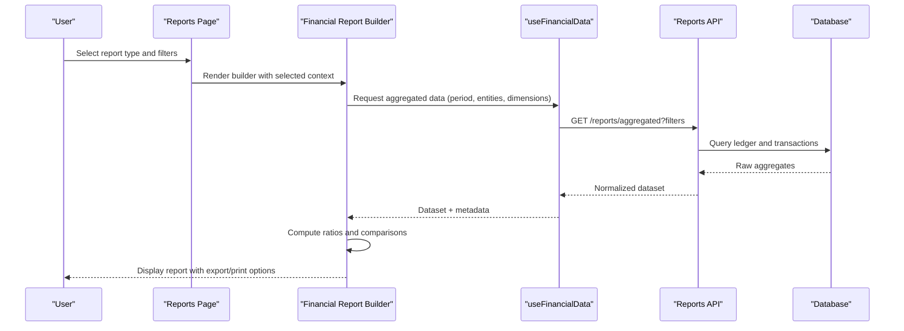
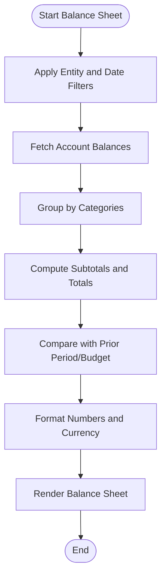
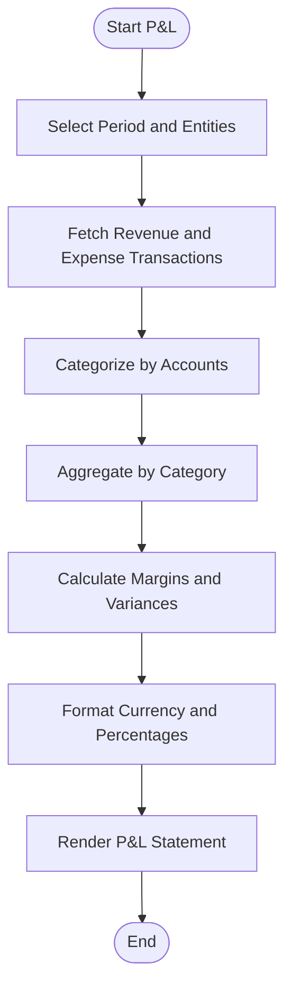
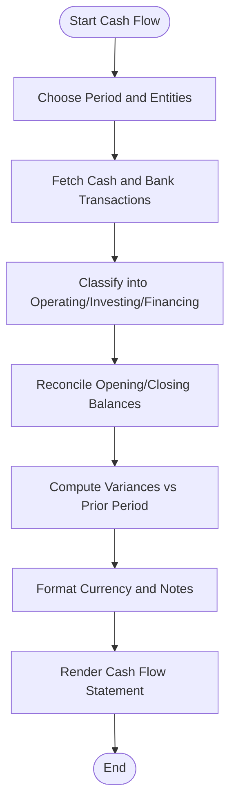
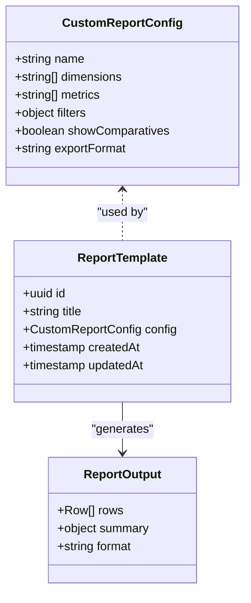
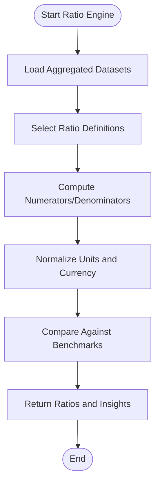
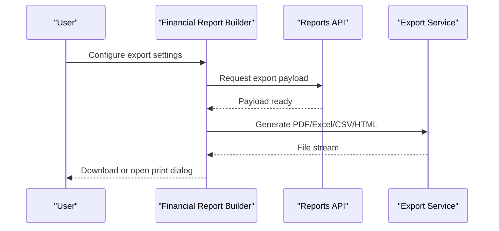
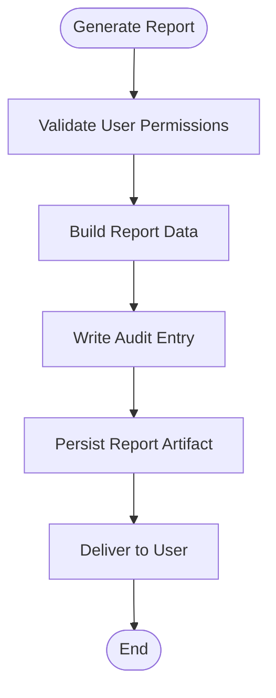
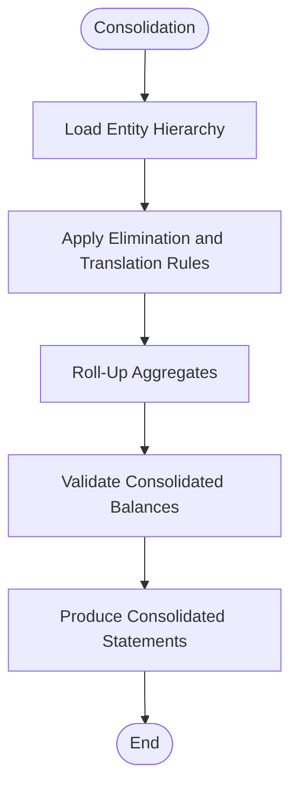
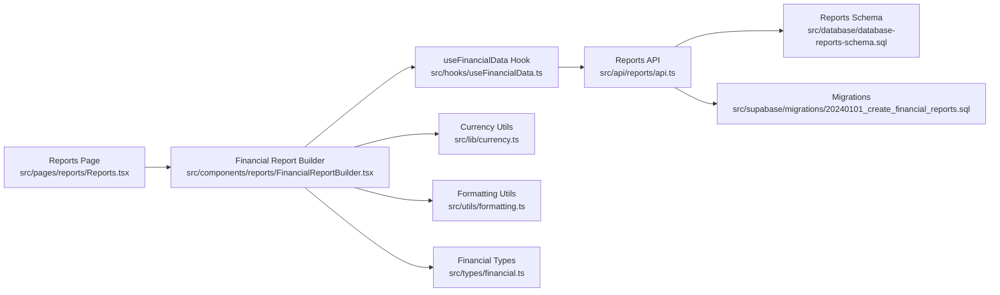

# Financial Statements & Reports

<cite>
**Referenced Files in This Document**
- [src/pages/reports/Reports.tsx](file://src/pages/reports/Reports.tsx)
- [src/components/reports/FinancialReportBuilder.tsx](file://src/components/reports/FinancialReportBuilder.tsx)
- [src/hooks/useFinancialData.ts](file://src/hooks/useFinancialData.ts)
- [src/lib/currency.ts](file://src/lib/currency.ts)
- [src/utils/formatting.ts](file://src/utils/formatting.ts)
- [src/database/database-reports-schema.sql](file://src/database/database-reports-schema.sql)
- [src/supabase/migrations/20240101_create_financial_reports.sql](file://src/supabase/migrations/20240101_create_financial_reports.sql)
- [src/api/reports/api.ts](file://src/api/reports/api.ts)
- [src/types/financial.ts](file://src/types/financial.ts)
- [src/config/module-registry.ts](file://src/config/module-registry.ts)
</cite>

## Table of Contents
1. [Introduction](#introduction)
2. [Project Structure](#project-structure)
3. [Core Components](#core-components)
4. [Architecture Overview](#architecture-overview)
5. [Detailed Component Analysis](#detailed-component-analysis)
6. [Dependency Analysis](#dependency-analysis)
7. [Performance Considerations](#performance-considerations)
8. [Troubleshooting Guide](#troubleshooting-guide)
9. [Conclusion](#conclusion)

## Introduction
This document describes the financial statement generation and reporting system, including balance sheet, profit and loss (P&L), cash flow statements, and custom report generation. It explains data aggregation across periods, comparative analysis, customization, export formats, printing options, ratio calculations, performance metrics, regulatory compliance considerations, audit trails, and multi-entity consolidation capabilities. The documentation is designed for both technical and non-technical readers.

## Project Structure
The financial reporting feature spans UI components, hooks for data fetching, utilities for formatting and currency handling, API endpoints, database schema definitions, and type definitions. The key areas are:
- UI pages and components for report selection and configuration
- Hooks to aggregate financial data by period and entity
- Utilities for currency formatting and number presentation
- API layer for report queries and exports
- Database schema and migrations for report metadata and audit logs
- Type definitions for consistent data contracts

```mermaid
graph TB
subgraph "UI"
ReportsPage["Reports Page<br/>src/pages/reports/Reports.tsx"]
Builder["Financial Report Builder<br/>src/components/reports/FinancialReportBuilder.tsx"]
end
subgraph "Hooks"
UseFinData["useFinancialData Hook<br/>src/hooks/useFinancialData.ts"]
end
subgraph "API"
ReportsAPI["Reports API<br/>src/api/reports/api.ts"]
end
subgraph "Database"
Schema["Reports Schema<br/>src/database/database-reports-schema.sql"]
Migration["Migrations<br/>src/supabase/migrations/20240101_create_financial_reports.sql"]
end
subgraph "Utilities"
Currency["Currency Utils<br/>src/lib/currency.ts"]
Formatting["Formatting Utils<br/>src/utils/formatting.ts"]
end
subgraph "Types"
Types["Financial Types<br/>src/types/financial.ts"]
end
ReportsPage --> Builder
Builder --> UseFinData
UseFinData --> ReportsAPI
ReportsAPI --> Schema
ReportsAPI --> Migration
Builder --> Currency
Builder --> Formatting
Builder --> Types
```

**Diagram sources**
- [src/pages/reports/Reports.tsx](file://src/pages/reports/Reports.tsx)
- [src/components/reports/FinancialReportBuilder.tsx](file://src/components/reports/FinancialReportBuilder.tsx)
- [src/hooks/useFinancialData.ts](file://src/hooks/useFinancialData.ts)
- [src/api/reports/api.ts](file://src/api/reports/api.ts)
- [src/database/database-reports-schema.sql](file://src/database/database-reports-schema.sql)
- [src/supabase/migrations/20240101_create_financial_reports.sql](file://src/supabase/migrations/20240101_create_financial_reports.sql)
- [src/lib/currency.ts](file://src/lib/currency.ts)
- [src/utils/formatting.ts](file://src/utils/formatting.ts)
- [src/types/financial.ts](file://src/types/financial.ts)

**Section sources**
- [src/pages/reports/Reports.tsx](file://src/pages/reports/Reports.tsx)
- [src/components/reports/FinancialReportBuilder.tsx](file://src/components/reports/FinancialReportBuilder.tsx)
- [src/hooks/useFinancialData.ts](file://src/hooks/useFinancialData.ts)
- [src/api/reports/api.ts](file://src/api/reports/api.ts)
- [src/database/database-reports-schema.sql](file://src/database/database-reports-schema.sql)
- [src/supabase/migrations/20240101_create_financial_reports.sql](file://src/supabase/migrations/20240101_create_financial_reports.sql)
- [src/lib/currency.ts](file://src/lib/currency.ts)
- [src/utils/formatting.ts](file://src/utils/formatting.ts)
- [src/types/financial.ts](file://src/types/financial.ts)

## Core Components
- Reports Page: Entry point for selecting standard reports (balance sheet, P&L, cash flow) and launching custom report creation.
- Financial Report Builder: Configurable builder that lets users select entities, periods, dimensions, and output formats; supports comparative views and KPIs.
- useFinancialData Hook: Aggregates ledger and transactional data by period and entity, applies filters, and returns normalized datasets for rendering.
- Reports API: Endpoints for fetching aggregated data, exporting reports, and persisting custom report templates.
- Currency and Formatting Utilities: Provide locale-aware currency formatting, number precision, and sign conventions.
- Types: Shared interfaces for report inputs, outputs, and metadata.

Key responsibilities:
- Period selection with support for fiscal calendars and comparative periods
- Multi-entity filtering and optional consolidation
- Ratio calculation engine for profitability, liquidity, leverage, and efficiency metrics
- Export to PDF, Excel, CSV, and print-ready HTML
- Audit trail logging for report generation and template changes

**Section sources**
- [src/pages/reports/Reports.tsx](file://src/pages/reports/Reports.tsx)
- [src/components/reports/FinancialReportBuilder.tsx](file://src/components/reports/FinancialReportBuilder.tsx)
- [src/hooks/useFinancialData.ts](file://src/hooks/useFinancialData.ts)
- [src/api/reports/api.ts](file://src/api/reports/api.ts)
- [src/lib/currency.ts](file://src/lib/currency.ts)
- [src/utils/formatting.ts](file://src/utils/formatting.ts)
- [src/types/financial.ts](file://src/types/financial.ts)

## Architecture Overview
The system follows a layered architecture:
- Presentation Layer: React components for report selection and configuration
- Data Access Layer: Hooks and API calls to fetch and aggregate financial data
- Business Logic Layer: Calculations for ratios, consolidations, and comparative analysis
- Persistence Layer: Database schema and migrations for report metadata and audit logs
- Utility Layer: Currency and formatting helpers



**Diagram sources**
- [src/pages/reports/Reports.tsx](file://src/pages/reports/Reports.tsx)
- [src/components/reports/FinancialReportBuilder.tsx](file://src/components/reports/FinancialReportBuilder.tsx)
- [src/hooks/useFinancialData.ts](file://src/hooks/useFinancialData.ts)
- [src/api/reports/api.ts](file://src/api/reports/api.ts)
- [src/database/database-reports-schema.sql](file://src/database/database-reports-schema.sql)

## Detailed Component Analysis

### Balance Sheet Generation
- Purpose: Present assets, liabilities, and equity at a specific date or period-end.
- Data Sources: Ledger balances, account mappings, and closing entries.
- Aggregation: Summarize by account categories and groupings; apply entity filters and consolidation rules.
- Comparative Analysis: Side-by-side view with prior period or budgeted figures.
- Output: Tabular display with totals, subtotals, and drill-down links.



**Diagram sources**
- [src/components/reports/FinancialReportBuilder.tsx](file://src/components/reports/FinancialReportBuilder.tsx)
- [src/hooks/useFinancialData.ts](file://src/hooks/useFinancialData.ts)
- [src/lib/currency.ts](file://src/lib/currency.ts)
- [src/utils/formatting.ts](file://src/utils/formatting.ts)

**Section sources**
- [src/components/reports/FinancialReportBuilder.tsx](file://src/components/reports/FinancialReportBuilder.tsx)
- [src/hooks/useFinancialData.ts](file://src/hooks/useFinancialData.ts)
- [src/lib/currency.ts](file://src/lib/currency.ts)
- [src/utils/formatting.ts](file://src/utils/formatting.ts)

### Profit & Loss Statement Generation
- Purpose: Show revenues, expenses, and net income over a period.
- Data Sources: Sales, purchases, expense entries, and adjustments.
- Aggregation: Summarize by revenue and expense categories; handle tax lines and discounts.
- Comparative Analysis: Month-over-month, year-to-date, and variance vs budget.
- Output: Standard P&L layout with gross profit, operating profit, and net profit.



**Diagram sources**
- [src/components/reports/FinancialReportBuilder.tsx](file://src/components/reports/FinancialReportBuilder.tsx)
- [src/hooks/useFinancialData.ts](file://src/hooks/useFinancialData.ts)
- [src/lib/currency.ts](file://src/lib/currency.ts)
- [src/utils/formatting.ts](file://src/utils/formatting.ts)

**Section sources**
- [src/components/reports/FinancialReportBuilder.tsx](file://src/components/reports/FinancialReportBuilder.tsx)
- [src/hooks/useFinancialData.ts](file://src/hooks/useFinancialData.ts)
- [src/lib/currency.ts](file://src/lib/currency.ts)
- [src/utils/formatting.ts](file://src/utils/formatting.ts)

### Cash Flow Statement Generation
- Purpose: Track cash inflows and outflows across operating, investing, and financing activities.
- Data Sources: Bank transactions, receivables/payables movements, capital expenditures, and financing events.
- Aggregation: Classify flows into activity categories; reconcile with opening and closing balances.
- Comparative Analysis: Period-over-period cash movement and reconciliation notes.
- Output: Structured cash flow statement with reconciliations and footnotes.



**Diagram sources**
- [src/components/reports/FinancialReportBuilder.tsx](file://src/components/reports/FinancialReportBuilder.tsx)
- [src/hooks/useFinancialData.ts](file://src/hooks/useFinancialData.ts)
- [src/lib/currency.ts](file://src/lib/currency.ts)
- [src/utils/formatting.ts](file://src/utils/formatting.ts)

**Section sources**
- [src/components/reports/FinancialReportBuilder.tsx](file://src/components/reports/FinancialReportBuilder.tsx)
- [src/hooks/useFinancialData.ts](file://src/hooks/useFinancialData.ts)
- [src/lib/currency.ts](file://src/lib/currency.ts)
- [src/utils/formatting.ts](file://src/utils/formatting.ts)

### Custom Report Generation
- Purpose: Allow users to build ad-hoc reports using available dimensions and metrics.
- Features:
  - Dimension selection (entity, project, department, item class)
  - Metric selection (balances, transactions, derived ratios)
  - Grouping and sorting
  - Conditional formatting and thresholds
  - Save and reuse templates
- Output: Flexible tabular and chart-based views with export options.



**Diagram sources**
- [src/components/reports/FinancialReportBuilder.tsx](file://src/components/reports/FinancialReportBuilder.tsx)
- [src/types/financial.ts](file://src/types/financial.ts)
- [src/api/reports/api.ts](file://src/api/reports/api.ts)

**Section sources**
- [src/components/reports/FinancialReportBuilder.tsx](file://src/components/reports/FinancialReportBuilder.tsx)
- [src/types/financial.ts](file://src/types/financial.ts)
- [src/api/reports/api.ts](file://src/api/reports/api.ts)

### Ratio Calculations and Performance Metrics
- Profitability Ratios: Gross margin, operating margin, net margin, return on assets/equity.
- Liquidity Ratios: Current ratio, quick ratio, cash ratio.
- Leverage Ratios: Debt-to-equity, interest coverage.
- Efficiency Ratios: Inventory turnover, receivables days, payables days.
- Implementation: Derived from aggregated datasets; configurable thresholds and benchmarks.



**Diagram sources**
- [src/hooks/useFinancialData.ts](file://src/hooks/useFinancialData.ts)
- [src/types/financial.ts](file://src/types/financial.ts)
- [src/utils/formatting.ts](file://src/utils/formatting.ts)

**Section sources**
- [src/hooks/useFinancialData.ts](file://src/hooks/useFinancialData.ts)
- [src/types/financial.ts](file://src/types/financial.ts)
- [src/utils/formatting.ts](file://src/utils/formatting.ts)

### Export Formats and Printing Options
- Export Formats: PDF, Excel (.xlsx), CSV, and JSON for programmatic consumption.
- Print Options: Print-ready HTML with page breaks, headers/footers, and logo placement.
- Customization: Column visibility, grouping levels, and branding elements.
- Workflow: Generate preview, adjust settings, then export or print.



**Diagram sources**
- [src/components/reports/FinancialReportBuilder.tsx](file://src/components/reports/FinancialReportBuilder.tsx)
- [src/api/reports/api.ts](file://src/api/reports/api.ts)

**Section sources**
- [src/components/reports/FinancialReportBuilder.tsx](file://src/components/reports/FinancialReportBuilder.tsx)
- [src/api/reports/api.ts](file://src/api/reports/api.ts)

### Regulatory Compliance and Audit Trails
- Compliance: Support for GAAP/IFRS-aligned layouts, tax line items, and disclosure fields.
- Audit Trail: Log who generated which report, when, and with what filters; track template edits.
- Retention: Store report artifacts and metadata per retention policy.
- Controls: Role-based access to sensitive reports and export actions.



**Diagram sources**
- [src/api/reports/api.ts](file://src/api/reports/api.ts)
- [src/database/database-reports-schema.sql](file://src/database/database-reports-schema.sql)
- [src/supabase/migrations/20240101_create_financial_reports.sql](file://src/supabase/migrations/20240101_create_financial_reports.sql)

**Section sources**
- [src/api/reports/api.ts](file://src/api/reports/api.ts)
- [src/database/database-reports-schema.sql](file://src/database/database-reports-schema.sql)
- [src/supabase/migrations/20240101_create_financial_reports.sql](file://src/supabase/migrations/20240101_create_financial_reports.sql)

### Multi-Entity Consolidation Capabilities
- Scope: Consolidate financials across multiple legal entities or business units.
- Rules: Intercompany eliminations, currency translation, and ownership percentages.
- Hierarchy: Parent-child relationships and roll-up logic.
- Output: Consolidated statements with entity-level drill-down.



**Diagram sources**
- [src/hooks/useFinancialData.ts](file://src/hooks/useFinancialData.ts)
- [src/types/financial.ts](file://src/types/financial.ts)

**Section sources**
- [src/hooks/useFinancialData.ts](file://src/hooks/useFinancialData.ts)
- [src/types/financial.ts](file://src/types/financial.ts)

## Dependency Analysis
The reporting module depends on shared types, utilities, and API services. The following diagram shows core dependencies and their relationships.



**Diagram sources**
- [src/pages/reports/Reports.tsx](file://src/pages/reports/Reports.tsx)
- [src/components/reports/FinancialReportBuilder.tsx](file://src/components/reports/FinancialReportBuilder.tsx)
- [src/hooks/useFinancialData.ts](file://src/hooks/useFinancialData.ts)
- [src/api/reports/api.ts](file://src/api/reports/api.ts)
- [src/lib/currency.ts](file://src/lib/currency.ts)
- [src/utils/formatting.ts](file://src/utils/formatting.ts)
- [src/types/financial.ts](file://src/types/financial.ts)
- [src/database/database-reports-schema.sql](file://src/database/database-reports-schema.sql)
- [src/supabase/migrations/20240101_create_financial_reports.sql](file://src/supabase/migrations/20240101_create_financial_reports.sql)

**Section sources**
- [src/pages/reports/Reports.tsx](file://src/pages/reports/Reports.tsx)
- [src/components/reports/FinancialReportBuilder.tsx](file://src/components/reports/FinancialReportBuilder.tsx)
- [src/hooks/useFinancialData.ts](file://src/hooks/useFinancialData.ts)
- [src/api/reports/api.ts](file://src/api/reports/api.ts)
- [src/lib/currency.ts](file://src/lib/currency.ts)
- [src/utils/formatting.ts](file://src/utils/formatting.ts)
- [src/types/financial.ts](file://src/types/financial.ts)
- [src/database/database-reports-schema.sql](file://src/database/database-reports-schema.sql)
- [src/supabase/migrations/20240101_create_financial_reports.sql](file://src/supabase/migrations/20240101_create_financial_reports.sql)

## Performance Considerations
- Efficient Aggregation: Pre-aggregate large datasets server-side where possible; paginate results for heavy reports.
- Caching: Cache frequently accessed report configurations and static reference data.
- Indexing: Ensure database indexes on period, entity, and account keys used in common filters.
- Rendering Optimization: Virtualize large tables and defer heavy computations until needed.
- Export Throughput: Stream exports rather than loading entire payloads into memory.

[No sources needed since this section provides general guidance]

## Troubleshooting Guide
Common issues and resolutions:
- Missing Data: Verify period boundaries and entity filters; ensure closing entries exist for balance sheet dates.
- Currency Mismatch: Confirm currency settings and exchange rates applied consistently across entities.
- Export Failures: Check file size limits and browser print settings; validate template availability.
- Audit Gaps: Confirm write permissions for audit log table and storage buckets.

**Section sources**
- [src/hooks/useFinancialData.ts](file://src/hooks/useFinancialData.ts)
- [src/api/reports/api.ts](file://src/api/reports/api.ts)
- [src/database/database-reports-schema.sql](file://src/database/database-reports-schema.sql)

## Conclusion
The financial statements and reporting system provides robust tools for generating standard and custom reports, with strong support for comparative analysis, ratio calculations, export and printing, compliance, audit trails, and multi-entity consolidation. By leveraging well-defined components, clear data flows, and utility services, the system delivers accurate and actionable financial insights across diverse organizational needs.