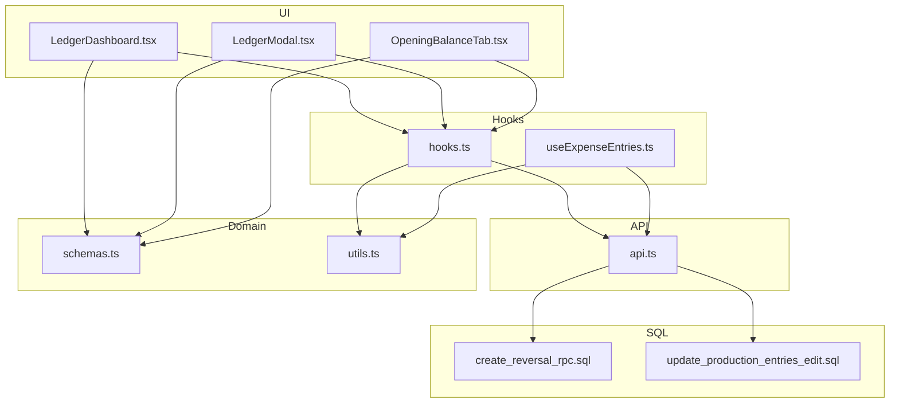
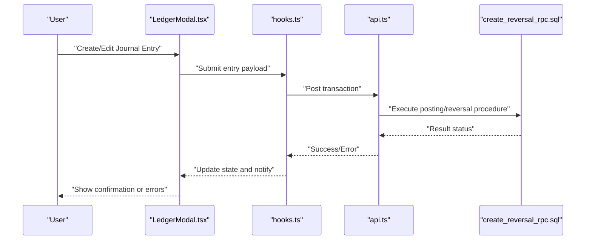
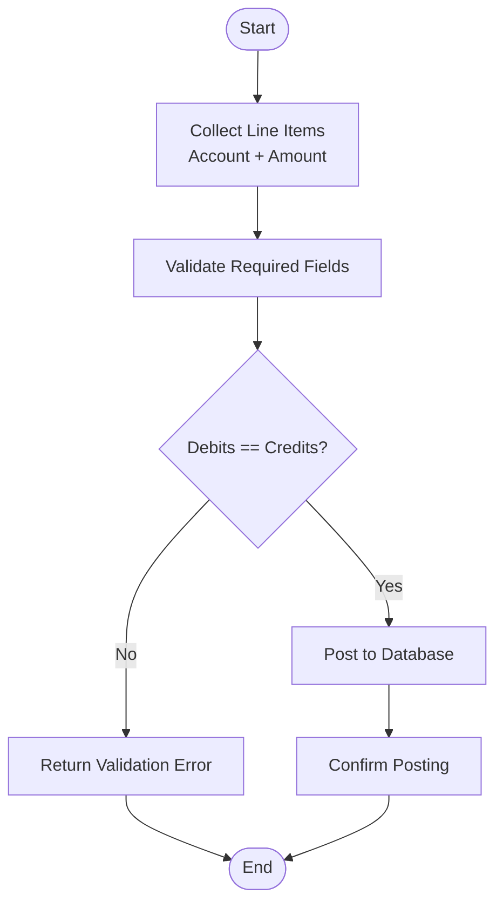
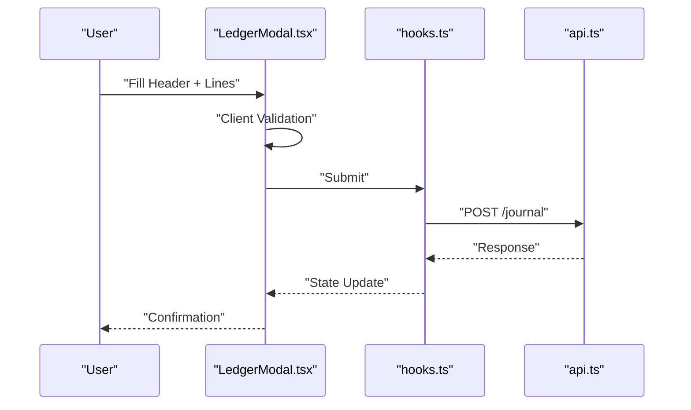
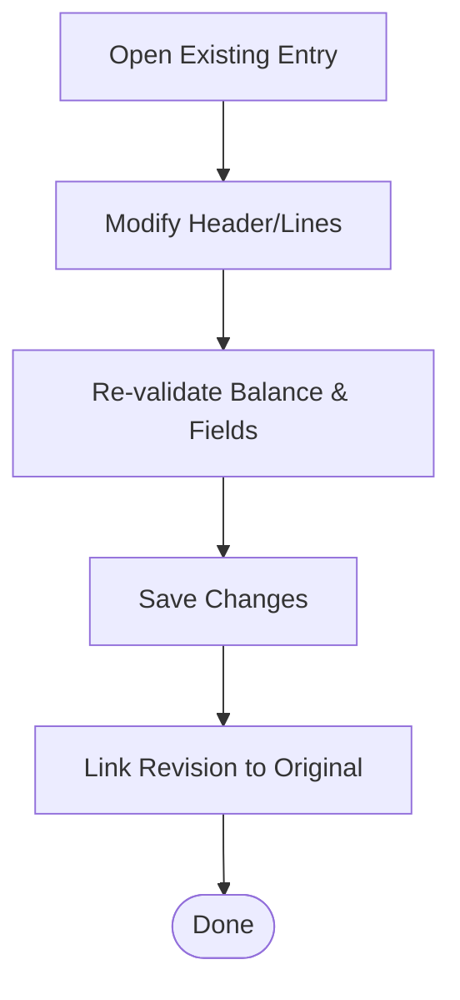
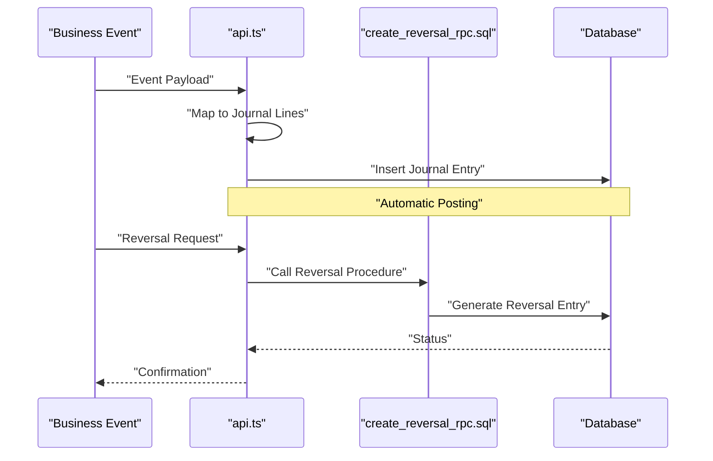
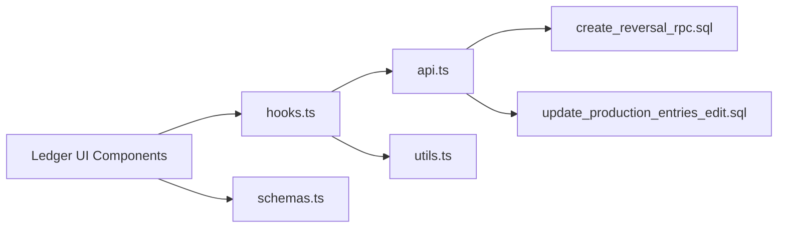

# Journal Entries & Transaction Posting

<cite>
**Referenced Files in This Document**
- [LedgerDashboard.tsx](file://src/ledger/LedgerDashboard.tsx)
- [LedgerModal.tsx](file://src/ledger/LedgerModal.tsx)
- [OpeningBalanceTab.tsx](file://src/ledger/OpeningBalanceTab.tsx)
- [api.ts](file://src/ledger/api.ts)
- [hooks.ts](file://src/ledger/hooks.ts)
- [schemas.ts](file://src/ledger/schemas.ts)
- [utils.ts](file://src/ledger/utils.ts)
- [useExpenseEntries.ts](file://src/hooks/useExpenseEntries.ts)
- [create_reversal_rpc.sql](file://sql/create_reversal_rpc.sql)
- [update_production_entries_edit.sql](file://sql/update_production_entries_edit.sql)
- [ACCOUNTING_COA_DESIGN.md](file://ACCOUNTING_COA_DESIGN.md)
</cite>

## Table of Contents
1. [Introduction](#introduction)
2. [Project Structure](#project-structure)
3. [Core Components](#core-components)
4. [Architecture Overview](#architecture-overview)
5. [Detailed Component Analysis](#detailed-component-analysis)
6. [Dependency Analysis](#dependency-analysis)
7. [Performance Considerations](#performance-considerations)
8. [Troubleshooting Guide](#troubleshooting-guide)
9. [Conclusion](#conclusion)
10. [Appendices](#appendices)

## Introduction
This document explains the journal entries and transaction posting system, focusing on double-entry bookkeeping mechanics, debit/credit rules, validation, and workflows for creating, editing, and posting transactions. It also covers transaction types, automatic postings, manual adjustments, balancing checks, error handling, and rollback mechanisms. The goal is to provide both a conceptual overview and code-level insights for developers and accountants working with the system.

## Project Structure
The accounting subsystem is primarily implemented under the ledger module and related hooks and SQL utilities:
- Ledger UI components for dashboards, modals, and opening balance setup
- API layer for persistence and integration
- Hooks for data fetching and mutations
- Schemas and utilities for validation and formatting
- SQL scripts for reversal RPCs and production entry updates

**Diagram sources**
- [LedgerDashboard.tsx](file://src/ledger/LedgerDashboard.tsx)
- [LedgerModal.tsx](file://src/ledger/LedgerModal.tsx)
- [OpeningBalanceTab.tsx](file://src/ledger/OpeningBalanceTab.tsx)
- [hooks.ts](file://src/ledger/hooks.ts)
- [useExpenseEntries.ts](file://src/hooks/useExpenseEntries.ts)
- [api.ts](file://src/ledger/api.ts)
- [schemas.ts](file://src/ledger/schemas.ts)
- [utils.ts](file://src/ledger/utils.ts)
- [create_reversal_rpc.sql](file://sql/create_reversal_rpc.sql)
- [update_production_entries_edit.sql](file://sql/update_production_entries_edit.sql)

**Section sources**
- [LedgerDashboard.tsx](file://src/ledger/LedgerDashboard.tsx)
- [LedgerModal.tsx](file://src/ledger/LedgerModal.tsx)
- [OpeningBalanceTab.tsx](file://src/ledger/OpeningBalanceTab.tsx)
- [hooks.ts](file://src/ledger/hooks.ts)
- [useExpenseEntries.ts](file://src/hooks/useExpenseEntries.ts)
- [api.ts](file://src/ledger/api.ts)
- [schemas.ts](file://src/ledger/schemas.ts)
- [utils.ts](file://src/ledger/utils.ts)
- [create_reversal_rpc.sql](file://sql/create_reversal_rpc.sql)
- [update_production_entries_edit.sql](file://sql/update_production_entries_edit.sql)

## Core Components
- Ledger Dashboard: Provides an overview of journal entries and balances, enabling navigation to create or view details.
- Ledger Modal: Supports creation and editing of journal entries with line items, ensuring debits equal credits before submission.
- Opening Balance Tab: Allows initial setup of opening balances while enforcing double-entry constraints.
- Hooks: Encapsulate data fetching, mutation flows, and state management for journal entries and expense-related operations.
- API: Handles persistence, validation, and orchestration of posting logic, including calls to SQL-based procedures.
- Schemas: Define validation rules for journal entries, line items, and related fields.
- Utilities: Provide helpers for currency formatting, date handling, and other domain-specific transformations.

Key responsibilities:
- Enforce double-entry bookkeeping (sum of debits equals sum of credits).
- Validate required fields and account mappings.
- Support automatic postings triggered by business events.
- Enable manual adjustments and reversals.

**Section sources**
- [LedgerDashboard.tsx](file://src/ledger/LedgerDashboard.tsx)
- [LedgerModal.tsx](file://src/ledger/LedgerModal.tsx)
- [OpeningBalanceTab.tsx](file://src/ledger/OpeningBalanceTab.tsx)
- [hooks.ts](file://src/ledger/hooks.ts)
- [useExpenseEntries.ts](file://src/hooks/useExpenseEntries.ts)
- [api.ts](file://src/ledger/api.ts)
- [schemas.ts](file://src/ledger/schemas.ts)
- [utils.ts](file://src/ledger/utils.ts)

## Architecture Overview
The system follows a layered architecture:
- UI Layer: React components render forms and lists, collect user input, and display results.
- Hook Layer: Manages data access, caching, and mutation lifecycles.
- API Layer: Orchestrates business logic, validates inputs, and persists data via database procedures.
- SQL Layer: Implements core posting routines, including reversal RPCs and production entry updates.

**Diagram sources**
- [LedgerModal.tsx](file://src/ledger/LedgerModal.tsx)
- [hooks.ts](file://src/ledger/hooks.ts)
- [api.ts](file://src/ledger/api.ts)
- [create_reversal_rpc.sql](file://sql/create_reversal_rpc.sql)

## Detailed Component Analysis

### Double-Entry Bookkeeping Mechanics
- Debit/Credit Rules: Each journal line item must specify an account and amount; total debits must equal total credits across all lines.
- Validation: Schemas enforce presence of required fields, numeric amounts, and balanced totals.
- Posting: On successful validation, the API posts entries atomically to ensure consistency.

**Diagram sources**
- [schemas.ts](file://src/ledger/schemas.ts)
- [api.ts](file://src/ledger/api.ts)

**Section sources**
- [schemas.ts](file://src/ledger/schemas.ts)
- [api.ts](file://src/ledger/api.ts)

### Journal Entry Creation Workflow
- UI collects header info (date, reference, description) and line items.
- Client-side validation ensures completeness and balance.
- Hook triggers mutation to API.
- API persists entries and returns result.
- UI updates list and shows feedback.

**Diagram sources**
- [LedgerModal.tsx](file://src/ledger/LedgerModal.tsx)
- [hooks.ts](file://src/ledger/hooks.ts)
- [api.ts](file://src/ledger/api.ts)

**Section sources**
- [LedgerModal.tsx](file://src/ledger/LedgerModal.tsx)
- [hooks.ts](file://src/ledger/hooks.ts)
- [api.ts](file://src/ledger/api.ts)

### Journal Entry Editing and Revisions
- Editing allows modifying existing entries if permitted by policy.
- Revisions may be handled via new entries referencing originals or through update procedures.
- Auditability is maintained by preserving history and linking revisions.

**Diagram sources**
- [LedgerModal.tsx](file://src/ledger/LedgerModal.tsx)
- [api.ts](file://src/ledger/api.ts)

**Section sources**
- [LedgerModal.tsx](file://src/ledger/LedgerModal.tsx)
- [api.ts](file://src/ledger/api.ts)

### Automatic Postings and Manual Adjustments
- Automatic Postings: Triggered by business events (e.g., sales, purchases), generating corresponding journal lines.
- Manual Adjustments: Accountants can create direct journal entries for corrections or accruals.
- Reversals: Use dedicated SQL procedures to reverse prior postings safely.

**Diagram sources**
- [api.ts](file://src/ledger/api.ts)
- [create_reversal_rpc.sql](file://sql/create_reversal_rpc.sql)

**Section sources**
- [api.ts](file://src/ledger/api.ts)
- [create_reversal_rpc.sql](file://sql/create_reversal_rpc.sql)

### Transaction Types and Examples
Common transaction types include:
- Sales: Debit Accounts Receivable, Credit Revenue accounts.
- Purchases: Debit Inventory/Expense accounts, Credit Accounts Payable.
- Payments: Debit Accounts Payable, Credit Cash/Bank.
- Receipts: Debit Cash/Bank, Credit Accounts Receivable.
- Manual Adjustments: Debit/Credit appropriate accounts to correct balances.

These examples are reflected in how line items are constructed and validated within the ledger components and schemas.

**Section sources**
- [LedgerModal.tsx](file://src/ledger/LedgerModal.tsx)
- [schemas.ts](file://src/ledger/schemas.ts)

### Opening Balances Setup
- OpeningBalanceTab enables initial setup of account balances at go-live.
- Ensures that opening entries are balanced and auditable.
- Integrates with the same posting pipeline as regular journal entries.

**Section sources**
- [OpeningBalanceTab.tsx](file://src/ledger/OpeningBalanceTab.tsx)
- [api.ts](file://src/ledger/api.ts)

### Expense Entries Integration
- useExpenseEntries hook provides functionality for managing expense-related journal entries.
- Seamlessly integrates with ledger posting and validation.

**Section sources**
- [useExpenseEntries.ts](file://src/hooks/useExpenseEntries.ts)
- [hooks.ts](file://src/ledger/hooks.ts)

## Dependency Analysis
The ledger module depends on:
- UI components for user interaction
- Hooks for data flow and state
- API for persistence and orchestration
- SQL scripts for specialized operations like reversals and production entry updates

**Diagram sources**
- [LedgerDashboard.tsx](file://src/ledger/LedgerDashboard.tsx)
- [LedgerModal.tsx](file://src/ledger/LedgerModal.tsx)
- [OpeningBalanceTab.tsx](file://src/ledger/OpeningBalanceTab.tsx)
- [hooks.ts](file://src/ledger/hooks.ts)
- [api.ts](file://src/ledger/api.ts)
- [schemas.ts](file://src/ledger/schemas.ts)
- [utils.ts](file://src/ledger/utils.ts)
- [create_reversal_rpc.sql](file://sql/create_reversal_rpc.sql)
- [update_production_entries_edit.sql](file://sql/update_production_entries_edit.sql)

**Section sources**
- [hooks.ts](file://src/ledger/hooks.ts)
- [api.ts](file://src/ledger/api.ts)
- [create_reversal_rpc.sql](file://sql/create_reversal_rpc.sql)
- [update_production_entries_edit.sql](file://sql/update_production_entries_edit.sql)

## Performance Considerations
- Batch Operations: Prefer batching multiple journal lines into a single transaction to reduce round trips.
- Validation Early: Perform client-side validation to avoid unnecessary server calls.
- Indexing: Ensure database indexes support frequent queries on dates, accounts, and references.
- Caching: Leverage hook-level caching for read-heavy operations like ledger listings.

[No sources needed since this section provides general guidance]

## Troubleshooting Guide
Common issues and resolutions:
- Unbalanced Entries: Ensure total debits equal total credits; review schema validation messages.
- Missing References: Verify required header fields such as date and reference number.
- Posting Failures: Check API responses and SQL procedure logs for errors; confirm permissions and account mappings.
- Reversal Errors: Confirm original entry exists and is eligible for reversal; inspect reversal procedure outputs.

Operational tips:
- Use the dashboard to locate problematic entries quickly.
- Inspect modal validation errors for precise field issues.
- Review SQL reversal logs when troubleshooting post-reversal discrepancies.

**Section sources**
- [LedgerDashboard.tsx](file://src/ledger/LedgerDashboard.tsx)
- [LedgerModal.tsx](file://src/ledger/LedgerModal.tsx)
- [schemas.ts](file://src/ledger/schemas.ts)
- [api.ts](file://src/ledger/api.ts)
- [create_reversal_rpc.sql](file://sql/create_reversal_rpc.sql)

## Conclusion
The journal entries and transaction posting system enforces robust double-entry bookkeeping through clear validation, structured workflows, and reliable posting mechanisms. By combining UI-driven interactions, hook-managed state, API orchestration, and SQL-backed procedures, it supports both automated and manual accounting operations while maintaining auditability and integrity.

[No sources needed since this section summarizes without analyzing specific files]

## Appendices

### Accounting COA Design Reference
For chart of accounts design principles and mapping guidelines, refer to the dedicated design document.

**Section sources**
- [ACCOUNTING_COA_DESIGN.md](file://ACCOUNTING_COA_DESIGN.md)