# Ledgers & Trial Balance

<cite>
**Referenced Files in This Document**
- [LedgerDashboard.tsx](file://src/ledger/LedgerDashboard.tsx)
- [LedgerModal.tsx](file://src/ledger/LedgerModal.tsx)
- [OpeningBalanceTab.tsx](file://src/ledger/OpeningBalanceTab.tsx)
- [api.ts](file://src/ledger/api.ts)
- [hooks.ts](file://src/ledger/hooks.ts)
- [schemas.ts](file://src/ledger/schemas.ts)
- [utils.ts](file://src/ledger/utils.ts)
- [SubcontractorLedger.tsx](file://src/components/SubcontractorLedger.tsx)
- [useSubcontractorLedger.ts](file://src/hooks/useSubcontractorLedger.ts)
- [subcontractor_ledger_complete.sql](file://src/database/subcontractor_ledger_complete.sql)
- [currency.ts](file://src/lib/currency.ts)
- [database-hsn-tax.sql](file://src/database-hsn-tax.sql)
- [reports.ts](file://src/reports/reports.ts)
</cite>

## Table of Contents
1. [Introduction](#introduction)
2. [Project Structure](#project-structure)
3. [Core Components](#core-components)
4. [Architecture Overview](#architecture-overview)
5. [Detailed Component Analysis](#detailed-component-analysis)
6. [Dependency Analysis](#dependency-analysis)
7. [Performance Considerations](#performance-considerations)
8. [Troubleshooting Guide](#troubleshooting-guide)
9. [Conclusion](#conclusion)
10. [Appendices](#appendices)

## Introduction
This document explains how the application maintains ledgers and generates trial balance reports. It covers general ledger, subsidiary ledgers (including subcontractors), account-specific ledgers, trial balance calculation and verification, period-end closing, carry-forward balances, opening balance setup, multi-currency support, tax calculations, and regulatory reporting requirements. It also provides examples of ledger queries, balance reporting, and reconciliation procedures.

## Project Structure
The ledger functionality is implemented primarily under src/ledger with supporting UI components and hooks for specialized ledgers. Database schemas and utilities are located in src/database and src/lib respectively. Reports are provided via a dedicated module.

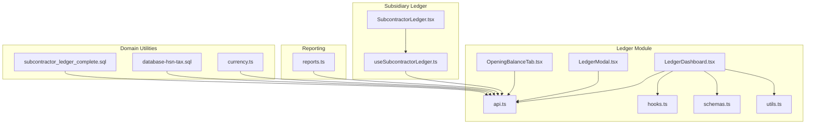

**Diagram sources**
- [LedgerDashboard.tsx](file://src/ledger/LedgerDashboard.tsx)
- [LedgerModal.tsx](file://src/ledger/LedgerModal.tsx)
- [OpeningBalanceTab.tsx](file://src/ledger/OpeningBalanceTab.tsx)
- [api.ts](file://src/ledger/api.ts)
- [hooks.ts](file://src/ledger/hooks.ts)
- [schemas.ts](file://src/ledger/schemas.ts)
- [utils.ts](file://src/ledger/utils.ts)
- [SubcontractorLedger.tsx](file://src/components/SubcontractorLedger.tsx)
- [useSubcontractorLedger.ts](file://src/hooks/useSubcontractorLedger.ts)
- [currency.ts](file://src/lib/currency.ts)
- [database-hsn-tax.sql](file://src/database-hsn-tax.sql)
- [subcontractor_ledger_complete.sql](file://src/database/subcontractor_ledger_complete.sql)
- [reports.ts](file://src/reports/reports.ts)

**Section sources**
- [LedgerDashboard.tsx](file://src/ledger/LedgerDashboard.tsx)
- [LedgerModal.tsx](file://src/ledger/LedgerModal.tsx)
- [OpeningBalanceTab.tsx](file://src/ledger/OpeningBalanceTab.tsx)
- [api.ts](file://src/ledger/api.ts)
- [hooks.ts](file://src/ledger/hooks.ts)
- [schemas.ts](file://src/ledger/schemas.ts)
- [utils.ts](file://src/ledger/utils.ts)
- [SubcontractorLedger.tsx](file://src/components/SubcontractorLedger.tsx)
- [useSubcontractorLedger.ts](file://src/hooks/useSubcontractorLedger.ts)
- [currency.ts](file://src/lib/currency.ts)
- [database-hsn-tax.sql](file://src/database-hsn-tax.sql)
- [subcontractor_ledger_complete.sql](file://src/database/subcontractor_ledger_complete.sql)
- [reports.ts](file://src/reports/reports.ts)

## Core Components
- General Ledger Dashboard: Provides overview, navigation to account-specific views, filters by period, currency, and entity; triggers trial balance generation and exports.
- Account Ledger Modal: Displays detailed transactions for an account with drill-down capabilities and reconciliation helpers.
- Opening Balance Tab: Manages initial balances for accounts at go-live or period start; supports validation and auditability.
- API Layer: Encapsulates ledger queries, trial balance computation endpoints, and data mutations.
- Hooks: Provide reactive access to ledger data, pagination, and filtering.
- Schemas: Define input/output contracts for ledger entries, trial balance rows, and filters.
- Utilities: Implement formatting, rounding, currency conversion, and date range helpers.

Key responsibilities:
- Data retrieval and caching for performance
- Validation of inputs and outputs
- Multi-currency handling and normalization
- Tax-aware computations where applicable
- Export and report integration

**Section sources**
- [LedgerDashboard.tsx](file://src/ledger/LedgerDashboard.tsx)
- [LedgerModal.tsx](file://src/ledger/LedgerModal.tsx)
- [OpeningBalanceTab.tsx](file://src/ledger/OpeningBalanceTab.tsx)
- [api.ts](file://src/ledger/api.ts)
- [hooks.ts](file://src/ledger/hooks.ts)
- [schemas.ts](file://src/ledger/schemas.ts)
- [utils.ts](file://src/ledger/utils.ts)

## Architecture Overview
The ledger system follows a layered architecture:
- Presentation layer: React components for dashboards and modals
- Business logic layer: Hooks and utilities orchestrate queries and transformations
- Data access layer: API functions call backend services or database RPCs
- Domain utilities: Currency conversion and tax configuration
- Reporting: Report generators consume normalized ledger data

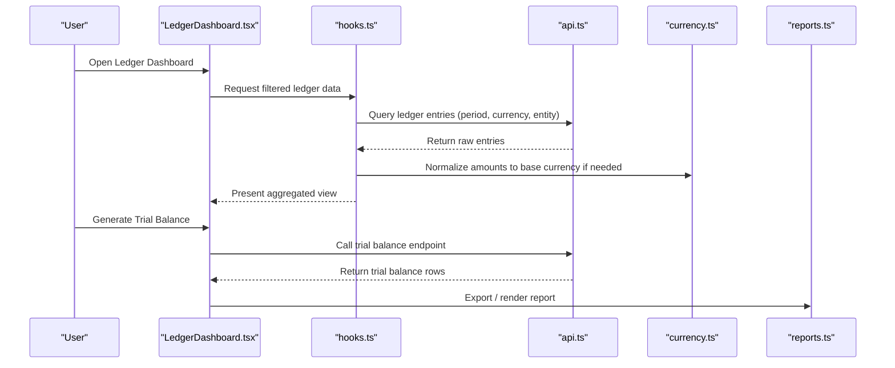

**Diagram sources**
- [LedgerDashboard.tsx](file://src/ledger/LedgerDashboard.tsx)
- [hooks.ts](file://src/ledger/hooks.ts)
- [api.ts](file://src/ledger/api.ts)
- [currency.ts](file://src/lib/currency.ts)
- [reports.ts](file://src/reports/reports.ts)

## Detailed Component Analysis

### General Ledger Dashboard
- Purpose: Central hub for viewing consolidated ledger activity, generating trial balance, and exporting reports.
- Key features:
  - Period selection and filters
  - Currency selector with live conversion
  - Aggregated totals and drill-down links
  - Trial balance generation and export
- Integration points:
  - Uses hooks for data fetching and caching
  - Calls API for trial balance computation
  - Leverages currency utilities for normalization
  - Integrates with reporting module for exports

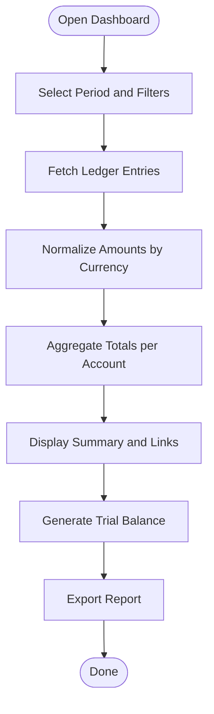

**Diagram sources**
- [LedgerDashboard.tsx](file://src/ledger/LedgerDashboard.tsx)
- [hooks.ts](file://src/ledger/hooks.ts)
- [api.ts](file://src/ledger/api.ts)
- [currency.ts](file://src/lib/currency.ts)
- [reports.ts](file://src/reports/reports.ts)

**Section sources**
- [LedgerDashboard.tsx](file://src/ledger/LedgerDashboard.tsx)
- [hooks.ts](file://src/ledger/hooks.ts)
- [api.ts](file://src/ledger/api.ts)
- [currency.ts](file://src/lib/currency.ts)
- [reports.ts](file://src/reports/reports.ts)

### Account Ledger Modal
- Purpose: Show detailed transactions for a selected account with reconciliation aids.
- Key features:
  - Transaction list with sorting and filtering
  - Drill-down to source documents
  - Reconciliation helpers (matching, notes)
- Integration points:
  - Uses API to fetch account-specific entries
  - Applies currency normalization
  - Supports export of account statements

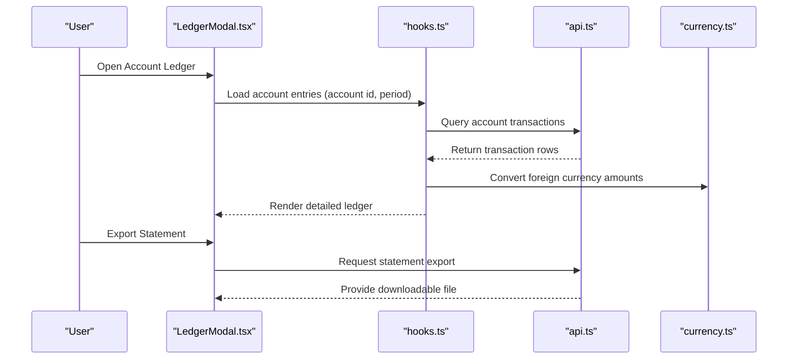

**Diagram sources**
- [LedgerModal.tsx](file://src/ledger/LedgerModal.tsx)
- [hooks.ts](file://src/ledger/hooks.ts)
- [api.ts](file://src/ledger/api.ts)
- [currency.ts](file://src/lib/currency.ts)

**Section sources**
- [LedgerModal.tsx](file://src/ledger/LedgerModal.tsx)
- [hooks.ts](file://src/ledger/hooks.ts)
- [api.ts](file://src/ledger/api.ts)
- [currency.ts](file://src/lib/currency.ts)

### Opening Balance Setup
- Purpose: Configure opening balances for accounts at period start or go-live.
- Key features:
  - Entry form with validation rules
  - Audit trail fields and versioning
  - Cross-check against expected totals
- Integration points:
  - Persists opening balances via API
  - Validates against schema constraints
  - Triggers recalculations for affected periods

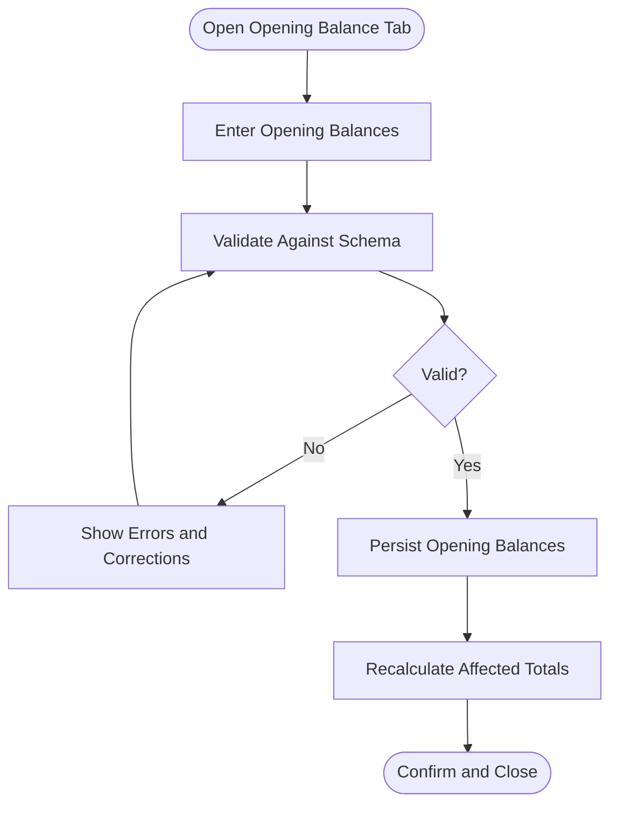

**Diagram sources**
- [OpeningBalanceTab.tsx](file://src/ledger/OpeningBalanceTab.tsx)
- [schemas.ts](file://src/ledger/schemas.ts)
- [api.ts](file://src/ledger/api.ts)

**Section sources**
- [OpeningBalanceTab.tsx](file://src/ledger/OpeningBalanceTab.tsx)
- [schemas.ts](file://src/ledger/schemas.ts)
- [api.ts](file://src/ledger/api.ts)

### Subsidiary Ledger: Subcontractors
- Purpose: Maintain detailed records for subcontractor transactions and balances.
- Key features:
  - Dedicated UI component for subcontractor ledger
  - Hook-based data access with efficient pagination
  - Database schema optimized for subcontractor operations
- Integration points:
  - Uses shared API patterns for consistency
  - Aligns with general ledger posting rules

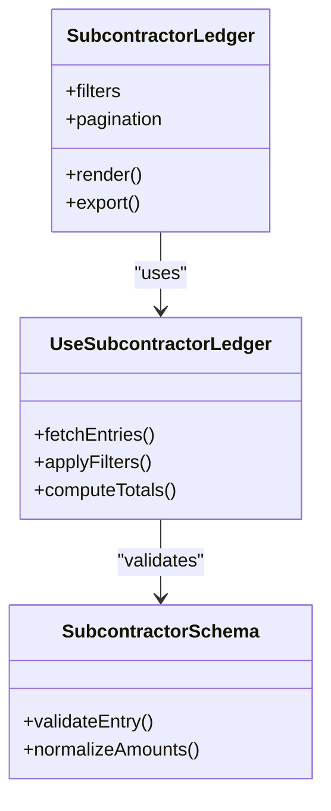

**Diagram sources**
- [SubcontractorLedger.tsx](file://src/components/SubcontractorLedger.tsx)
- [useSubcontractorLedger.ts](file://src/hooks/useSubcontractorLedger.ts)
- [subcontractor_ledger_complete.sql](file://src/database/subcontractor_ledger_complete.sql)

**Section sources**
- [SubcontractorLedger.tsx](file://src/components/SubcontractorLedger.tsx)
- [useSubcontractorLedger.ts](file://src/hooks/useSubcontractorLedger.ts)
- [subcontractor_ledger_complete.sql](file://src/database/subcontractor_ledger_complete.sql)

### Trial Balance Calculation and Verification
- Calculation steps:
  - Gather all posted entries within the selected period
  - Normalize amounts to base currency using configured rates
  - Sum debits and credits per account
  - Compute net balances and verify equality
- Verification:
  - Ensure total debits equal total credits
  - Flag discrepancies and provide drill-down details
  - Support adjustments with audit trails

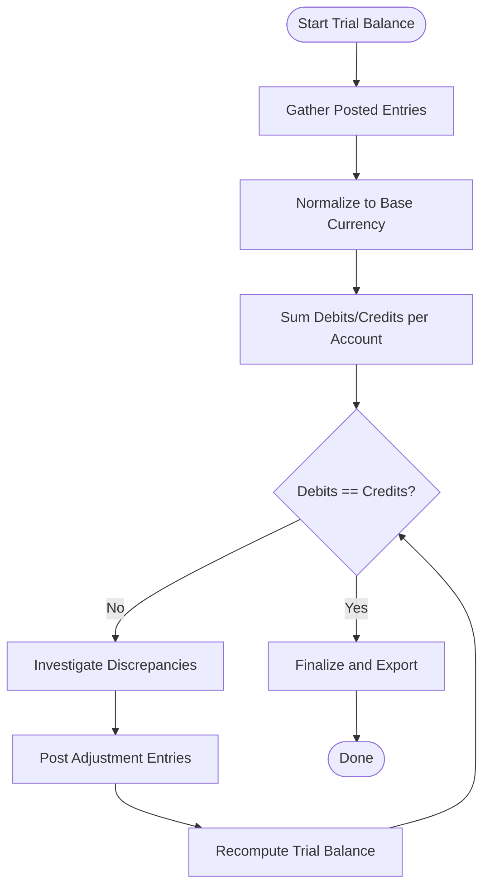

**Diagram sources**
- [api.ts](file://src/ledger/api.ts)
- [hooks.ts](file://src/ledger/hooks.ts)
- [currency.ts](file://src/lib/currency.ts)
- [reports.ts](file://src/reports/reports.ts)

**Section sources**
- [api.ts](file://src/ledger/api.ts)
- [hooks.ts](file://src/ledger/hooks.ts)
- [currency.ts](file://src/lib/currency.ts)
- [reports.ts](file://src/reports/reports.ts)

### Period-End Closing and Carry-Forward
- Process:
  - Lock closed periods to prevent edits
  - Calculate closing balances per account
  - Carry forward balances to next period
  - Generate closing journal entries as required
- Controls:
  - Role-based permissions for closing actions
  - Audit logs for all closing activities
  - Rollback procedures for corrections

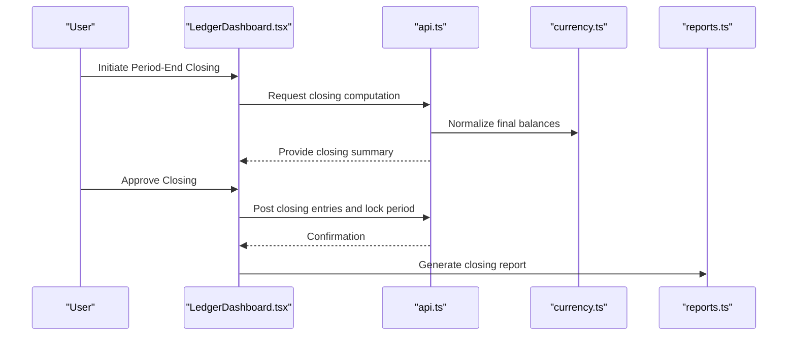

**Diagram sources**
- [LedgerDashboard.tsx](file://src/ledger/LedgerDashboard.tsx)
- [api.ts](file://src/ledger/api.ts)
- [currency.ts](file://src/lib/currency.ts)
- [reports.ts](file://src/reports/reports.ts)

**Section sources**
- [LedgerDashboard.tsx](file://src/ledger/LedgerDashboard.tsx)
- [api.ts](file://src/ledger/api.ts)
- [currency.ts](file://src/lib/currency.ts)
- [reports.ts](file://src/reports/reports.ts)

### Multi-Currency Support
- Features:
  - Configurable exchange rates and effective dates
  - Automatic conversion to base currency for reporting
  - Retention of original currency amounts for traceability
- Implementation:
  - Currency utility functions handle conversions and rounding
  - API layers accept currency context and apply normalization
  - Reports display both original and converted amounts

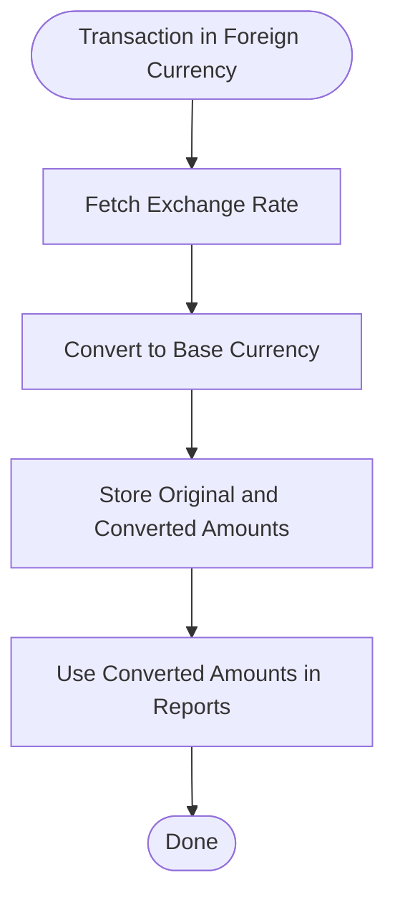

**Diagram sources**
- [currency.ts](file://src/lib/currency.ts)
- [api.ts](file://src/ledger/api.ts)
- [reports.ts](file://src/reports/reports.ts)

**Section sources**
- [currency.ts](file://src/lib/currency.ts)
- [api.ts](file://src/ledger/api.ts)
- [reports.ts](file://src/reports/reports.ts)

### Tax Calculations and Regulatory Reporting
- Tax handling:
  - HSN/SAC codes and tax rates applied at line level
  - Aggregation of tax amounts per account and period
  - Compliance checks for thresholds and exemptions
- Regulatory reporting:
  - Export formats aligned with statutory requirements
  - Audit-ready trails for tax postings and adjustments
  - Periodic consolidation for filings

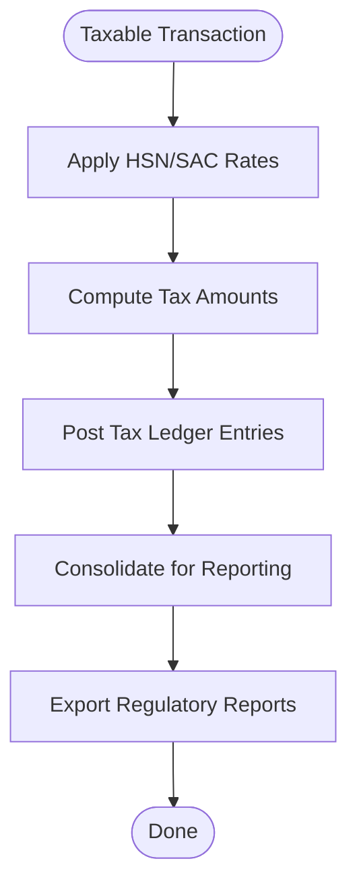

**Diagram sources**
- [database-hsn-tax.sql](file://src/database-hsn-tax.sql)
- [api.ts](file://src/ledger/api.ts)
- [reports.ts](file://src/reports/reports.ts)

**Section sources**
- [database-hsn-tax.sql](file://src/database-hsn-tax.sql)
- [api.ts](file://src/ledger/api.ts)
- [reports.ts](file://src/reports/reports.ts)

## Dependency Analysis
The ledger module depends on shared utilities and reporting infrastructure. The following diagram shows key dependencies among core files.

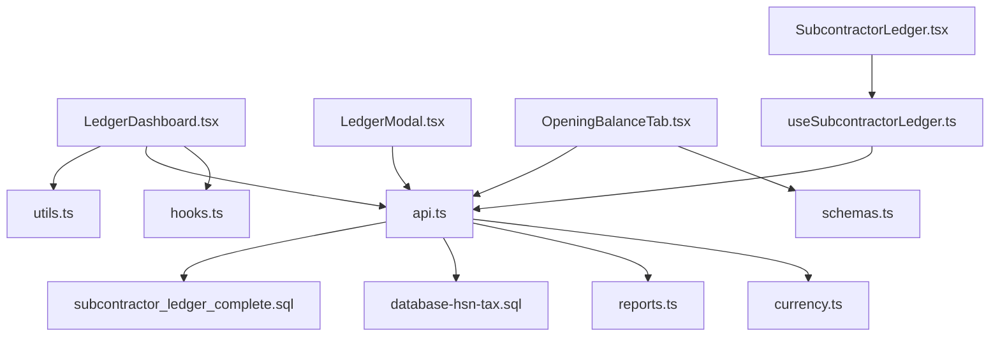

**Diagram sources**
- [LedgerDashboard.tsx](file://src/ledger/LedgerDashboard.tsx)
- [LedgerModal.tsx](file://src/ledger/LedgerModal.tsx)
- [OpeningBalanceTab.tsx](file://src/ledger/OpeningBalanceTab.tsx)
- [hooks.ts](file://src/ledger/hooks.ts)
- [api.ts](file://src/ledger/api.ts)
- [schemas.ts](file://src/ledger/schemas.ts)
- [utils.ts](file://src/ledger/utils.ts)
- [SubcontractorLedger.tsx](file://src/components/SubcontractorLedger.tsx)
- [useSubcontractorLedger.ts](file://src/hooks/useSubcontractorLedger.ts)
- [currency.ts](file://src/lib/currency.ts)
- [reports.ts](file://src/reports/reports.ts)
- [database-hsn-tax.sql](file://src/database-hsn-tax.sql)
- [subcontractor_ledger_complete.sql](file://src/database/subcontractor_ledger_complete.sql)

**Section sources**
- [LedgerDashboard.tsx](file://src/ledger/LedgerDashboard.tsx)
- [LedgerModal.tsx](file://src/ledger/LedgerModal.tsx)
- [OpeningBalanceTab.tsx](file://src/ledger/OpeningBalanceTab.tsx)
- [hooks.ts](file://src/ledger/hooks.ts)
- [api.ts](file://src/ledger/api.ts)
- [schemas.ts](file://src/ledger/schemas.ts)
- [utils.ts](file://src/ledger/utils.ts)
- [SubcontractorLedger.tsx](file://src/components/SubcontractorLedger.tsx)
- [useSubcontractorLedger.ts](file://src/hooks/useSubcontractorLedger.ts)
- [currency.ts](file://src/lib/currency.ts)
- [reports.ts](file://src/reports/reports.ts)
- [database-hsn-tax.sql](file://src/database-hsn-tax.sql)
- [subcontractor_ledger_complete.sql](file://src/database/subcontractor_ledger_complete.sql)

## Performance Considerations
- Efficient querying:
  - Use server-side pagination and filtering for large datasets
  - Cache frequently accessed aggregates and exchange rates
- Normalization overhead:
  - Minimize repeated currency conversions by batching rate lookups
- Export performance:
  - Stream large reports and avoid loading entire datasets into memory
- Indexing:
  - Ensure database indexes on period, account, and entity columns for fast aggregation

[No sources needed since this section provides general guidance]

## Troubleshooting Guide
Common issues and resolutions:
- Trial balance mismatch:
  - Verify all entries are posted and not locked
  - Check currency conversion rates for the period
  - Review adjustment entries for completeness
- Opening balance errors:
  - Validate schema constraints and ensure required fields
  - Cross-check totals against source documents
- Subsidiary ledger inconsistencies:
  - Confirm alignment with general ledger posting rules
  - Inspect database schema for missing relationships
- Tax reporting discrepancies:
  - Validate HSN/SAC mappings and tax rates
  - Re-run tax consolidation and compare with prior runs

**Section sources**
- [api.ts](file://src/ledger/api.ts)
- [hooks.ts](file://src/ledger/hooks.ts)
- [schemas.ts](file://src/ledger/schemas.ts)
- [currency.ts](file://src/lib/currency.ts)
- [database-hsn-tax.sql](file://src/database-hsn-tax.sql)
- [subcontractor_ledger_complete.sql](file://src/database/subcontractor_ledger_complete.sql)

## Conclusion
The ledger system provides robust tools for maintaining general and subsidiary ledgers, computing trial balances, and generating compliant reports. With strong multi-currency support, tax-aware calculations, and clear controls for period-end closing, it enables accurate financial reporting and reconciliation. Following the procedures outlined here will help ensure data integrity and regulatory compliance.

[No sources needed since this section summarizes without analyzing specific files]

## Appendices

### Example Ledger Queries
- Retrieve account transactions for a period:
  - Use the API function that accepts account ID, start date, and end date
  - Apply filters for currency and entity
  - Sort by date and reference number
- Aggregate balances:
  - Sum debits and credits per account
  - Normalize to base currency before aggregation
- Export statements:
  - Trigger export from the account modal or dashboard
  - Choose format aligned with reporting needs

**Section sources**
- [api.ts](file://src/ledger/api.ts)
- [hooks.ts](file://src/ledger/hooks.ts)
- [LedgerModal.tsx](file://src/ledger/LedgerModal.tsx)
- [LedgerDashboard.tsx](file://src/ledger/LedgerDashboard.tsx)

### Reconciliation Procedures
- Match transactions to source documents
- Resolve discrepancies by posting adjustments
- Document reasons and approvals
- Re-run trial balance to confirm resolution

**Section sources**
- [LedgerModal.tsx](file://src/ledger/LedgerModal.tsx)
- [api.ts](file://src/ledger/api.ts)
- [hooks.ts](file://src/ledger/hooks.ts)