# Financial Operations & Accounting

<cite>
**Referenced Files in This Document**
- [ACCOUNTING_COA_DESIGN.md](file://ACCOUNTING_COA_DESIGN.md)
- [database-complete.sql](file://src/database-complete.sql)
- [database-quotation.sql](file://src/database-quotation.sql)
- [database-proforma-invoices.sql](file://src/database-proforma-invoices.sql)
- [database-purchase-module.sql](file://src/database-purchase-module.sql)
- [database-hsn-tax.sql](file://src/database-hsn-tax.sql)
- [database-document-series.sql](file://src/database-document-series.sql)
- [database-setup.sql](file://src/database-setup.sql)
- [database-tables.sql](file://src/database-tables.sql)
- [supabase-tables.sql](file://supabase-tables.sql)
- [src/invoices/types.ts](file://src/invoices/types.ts)
- [src/invoices/logic.ts](file://src/invoices/logic.ts)
- [src/credit-notes/types.ts](file://src/credit-notes/types.ts)
- [src/credit-notes/logic.ts](file://src/credit-notes/logic.ts)
- [src/proforma-invoices/types.ts](file://src/proforma-invoices/types.ts)
- [src/quotation/types.ts](file://src/quotation/types.ts)
- [src/modules/Purchase/types.ts](file://src/modules/Purchase/types.ts)
- [src/ledger/api.ts](file://src/ledger/api.ts)
- [src/ledger/hooks.ts](file://src/ledger/hooks.ts)
- [src/ledger/utils.ts](file://src/ledger/utils.ts)
- [src/lib/currency.ts](file://src/lib/currency.ts)
- [src/lib/quotation-workflow.ts](file://src/lib/quotation-workflow.ts)
- [src/pages/CreatePO.tsx](file://src/pages/CreatePO.tsx)
- [src/pages/CreateQuotation.tsx](file://src/pages/CreateQuotation.tsx)
- [src/pages/CreateProjectInvoiceModal.tsx](file://src/pages/CreateProjectInvoiceModal.tsx)
- [src/pages/POList.tsx](file://src/pages/POList.tsx)
- [src/pages/QuotationList.tsx](file://src/pages/QuotationList.tsx)
- [src/pages/InvoiceA4Template.tsx](file://src/pages/InvoiceA4Template.tsx)
- [src/pages/QuotationTallyTemplate.tsx](file://src/pages/QuotationTallyTemplate.tsx)
- [src/pages/DCConsolidation.tsx](file://src/pages/DCConsolidation.tsx)
- [src/pages/MaterialInward.tsx](file://src/pages/MaterialInward.tsx)
- [src/pages/MaterialOutward.tsx](file://src/pages/MaterialOutward.tsx)
- [src/pages/StockAdjustment.tsx](file://src/pages/StockAdjustment.tsx)
- [src/pages/SubcontractorLedger.tsx](file://src/pages/SubcontractorLedger.tsx)
- [src/pages/TDSPaymentPanel.tsx](file://src/pages/TDSPaymentPanel.tsx)
- [src/pages/RetentionReleasePanel.tsx](file://src/pages/RetentionReleasePanel.tsx)
- [src/pages/TransactionNumberSeries.tsx](file://src/pages/TransactionNumberSeries.tsx)
- [src/pages/Reports.tsx](file://src/pages/Reports.tsx)
- [src/reports/index.ts](file://src/reports/index.ts)
- [src/hooks/useAuditLog.ts](file://src/hooks/useAuditLog.ts)
- [src/database-add-audit-log.sql](file://src/database-add-audit-log.sql)
- [sql/create_reversal_rpc.sql](file://sql/create_reversal_rpc.sql)
</cite>

## Table of Contents
1. Introduction
2. Project Structure
3. Core Components
4. Architecture Overview
5. Detailed Component Analysis
6. Dependency Analysis
7. Performance Considerations
8. Troubleshooting Guide
9. Conclusion
10. Appendices

## Introduction
This document provides comprehensive data model and lifecycle documentation for financial operations and accounting within the system. It covers quotations, invoices, proforma invoices, purchase orders, and credit notes; explains the chart of accounts structure, journal entries, and reporting foundations; details payment processing, tax calculations, and compliance requirements; and maps relationships between sales documents, purchase orders, and accounting entries. It also includes examples of financial queries, balance calculations, audit trail generation, and guidance on data integrity, regulatory compliance, and performance optimization for high-volume transactions.

## Project Structure
The financial and accounting capabilities are implemented across database migrations, TypeScript types and logic modules, UI pages, and ledger/reporting utilities:
- Database schema and migrations define core tables (quotation, invoice, proforma invoice, purchase order, credit note), series numbering, tax configuration, and supporting entities.
- TypeScript modules encapsulate domain types and business logic for each document type.
- Ledger utilities provide account balances, transaction aggregation, and report helpers.
- Pages implement user workflows for creating and managing documents and payments.
- Audit logging and reversal RPC support compliance and correction processes.

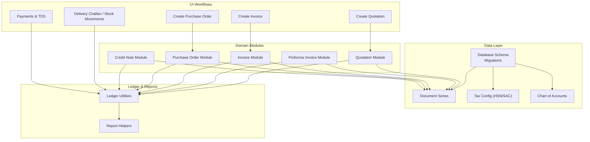

[No sources needed since this diagram shows conceptual workflow, not actual code structure]

## Core Components
- Quotation: Sales offer with line items, taxes, discounts, and conversion to proforma/invoice.
- Proforma Invoice: Pre-invoice used for advance booking or export documentation; convertible to invoice.
- Invoice: Final sales document triggering receivables, revenue recognition, and stock deduction (if applicable).
- Purchase Order: Procurement commitment against vendors; links to material inward and payable accruals.
- Credit Note: Reductions to sales/purchases; reverses prior postings and adjusts balances.
- Chart of Accounts: Hierarchical accounts enabling double-entry bookkeeping and reporting.
- Journal Entries: Atomic debits/credits posted from documents and adjustments.
- Payment Processing: Receipts/payments linked to invoices/POs with TDS handling and retention.
- Tax Calculations: HSN/SAC-based GST computation at document level.
- Reporting Foundations: Trial balance, P&L, balance sheet, receivables/payables aging, and custom reports.

**Section sources**
- [database-quotation.sql](file://src/database-quotation.sql)
- [database-proforma-invoices.sql](file://src/database-proforma-invoices.sql)
- [database-purchase-module.sql](file://src/database-purchase-module.sql)
- [database-hsn-tax.sql](file://src/database-hsn-tax.sql)
- [database-document-series.sql](file://src/database-document-series.sql)
- [database-complete.sql](file://src/database-complete.sql)
- [ACCOUNTING_COA_DESIGN.md](file://ACCOUNTING_COA_DESIGN.md)

## Architecture Overview
The system follows a document-driven accounting architecture:
- Documents (quotations, proformas, invoices, POs, credit notes) capture commercial terms and line items.
- Each document triggers journal entries that post to the chart of accounts.
- Series management ensures unique, sequential numbering per organization and document type.
- Tax engine computes GST using HSN/SAC mappings.
- Ledger utilities aggregate postings for balances and reports.
- Payments reconcile outstanding balances and apply TDS/retention rules.

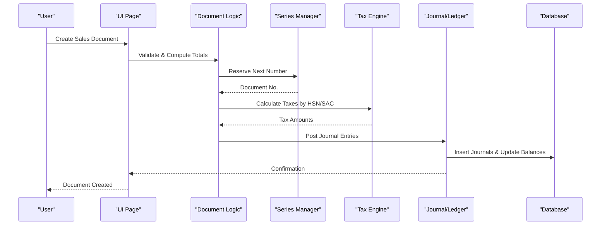

**Diagram sources**
- [database-document-series.sql](file://src/database-document-series.sql)
- [database-hsn-tax.sql](file://src/database-hsn-tax.sql)
- [database-complete.sql](file://src/database-complete.sql)

**Section sources**
- [database-document-series.sql](file://src/database-document-series.sql)
- [database-hsn-tax.sql](file://src/database-hsn-tax.sql)
- [database-complete.sql](file://src/database-complete.sql)

## Detailed Component Analysis

### Quotation Lifecycle and Data Model
- Creation: Define client, project, items, rates, discounts, taxes, validity, and remarks.
- Revisions: Track version history and approvals if configured.
- Conversion: Convert to proforma invoice or direct invoice; preserve lineage.
- Status Flow: Draft → Approved → Converted → Closed/Expired.
- Accounting Impact: Typically no posting until conversion; optional reservation entries may be supported via journals.

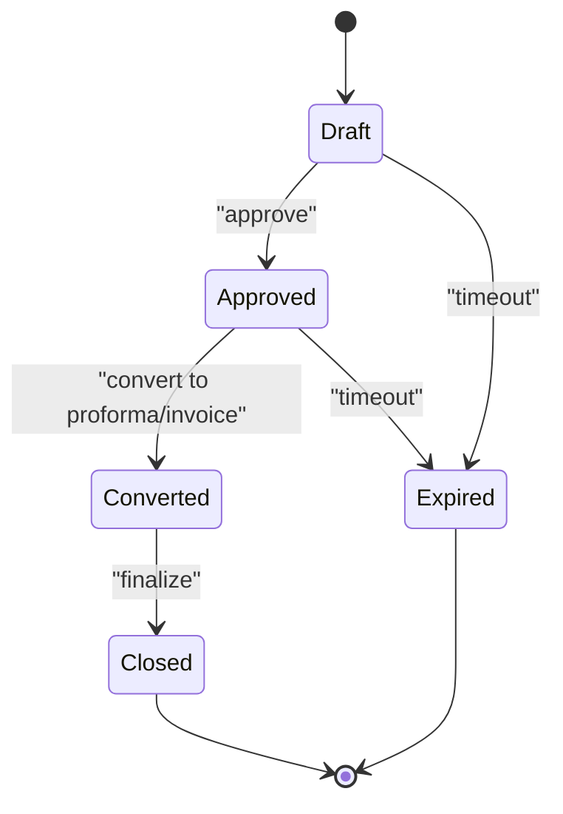

**Diagram sources**
- [src/lib/quotation-workflow.ts](file://src/lib/quotation-workflow.ts)
- [src/pages/CreateQuotation.tsx](file://src/pages/CreateQuotation.tsx)
- [src/pages/QuotationList.tsx](file://src/pages/QuotationList.tsx)
- [src/database-quotation.sql](file://src/database-quotation.sql)

**Section sources**
- [src/database-quotation.sql](file://src/database-quotation.sql)
- [src/lib/quotation-workflow.ts](file://src/lib/quotation-workflow.ts)
- [src/pages/CreateQuotation.tsx](file://src/pages/CreateQuotation.tsx)
- [src/pages/QuotationList.tsx](file://src/pages/QuotationList.tsx)

### Proforma Invoice Lifecycle and Data Model
- Purpose: Pre-invoice for advance bookings, export docs, or customer confirmation.
- Creation: Derived from quotation or created independently; supports same line item model.
- Conversion: Converts to invoice; preserves reference chain.
- Status Flow: Draft → Issued → Converted → Cancelled.
- Accounting Impact: Usually no posting; upon conversion, invoice posts receivables and revenue.

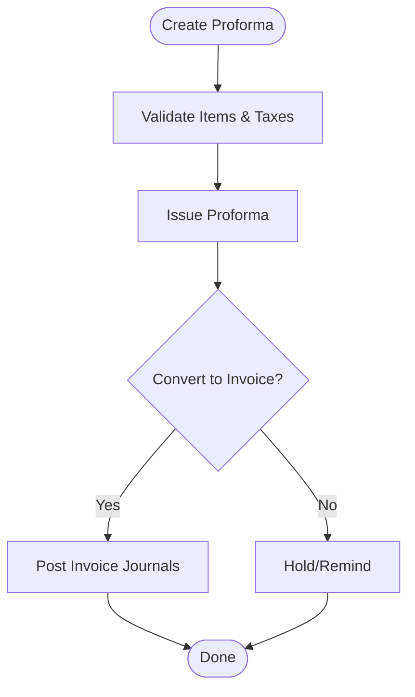

**Diagram sources**
- [src/database-proforma-invoices.sql](file://src/database-proforma-invoices.sql)
- [src/proforma-invoices/types.ts](file://src/proforma-invoices/types.ts)

**Section sources**
- [src/database-proforma-invoices.sql](file://src/database-proforma-invoices.sql)
- [src/proforma-invoices/types.ts](file://src/proforma-invoices/types.ts)

### Invoice Lifecycle and Data Model
- Creation: From proforma or directly; supports project linkage and delivery challan references.
- Posting: Generates receivable entries, revenue recognition, and stock deductions (if applicable).
- Payments: Partial/full payments reduce receivables; TDS applied where required.
- Status Flow: Draft → Issued → Partially Paid → Fully Paid → Cancelled.
- Accounting Impact: Debit Receivables, Credit Revenue; debit Cost of Goods Sold, credit Inventory when stock is deducted.

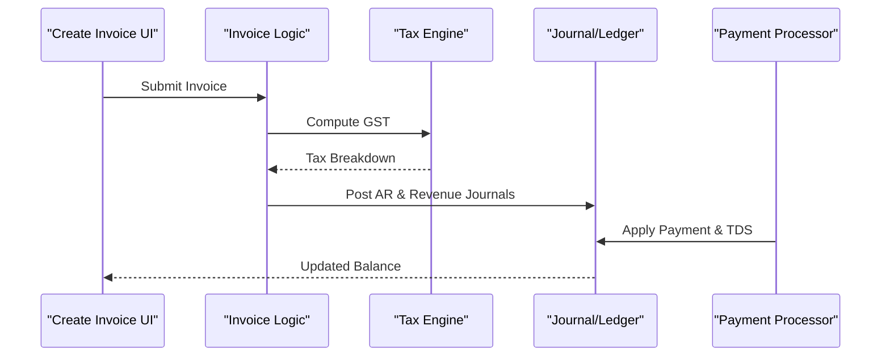

**Diagram sources**
- [src/invoices/types.ts](file://src/invoices/types.ts)
- [src/invoices/logic.ts](file://src/invoices/logic.ts)
- [src/pages/CreateProjectInvoiceModal.tsx](file://src/pages/CreateProjectInvoiceModal.tsx)
- [src/pages/InvoiceA4Template.tsx](file://src/pages/InvoiceA4Template.tsx)
- [src/pages/TDSPaymentPanel.tsx](file://src/pages/TDSPaymentPanel.tsx)

**Section sources**
- [src/invoices/types.ts](file://src/invoices/types.ts)
- [src/invoices/logic.ts](file://src/invoices/logic.ts)
- [src/pages/CreateProjectInvoiceModal.tsx](file://src/pages/CreateProjectInvoiceModal.tsx)
- [src/pages/InvoiceA4Template.tsx](file://src/pages/InvoiceA4Template.tsx)
- [src/pages/TDSPaymentPanel.tsx](file://src/pages/TDSPaymentPanel.tsx)

### Purchase Order Lifecycle and Data Model
- Creation: Against vendor, with items, rates, taxes, delivery dates, and payment terms.
- Linkages: Links to material inward and subcontractor work orders; supports project allocation.
- Status Flow: Draft → Confirmed → Partially Received → Fully Received → Cancelled.
- Accounting Impact: On receipt, debit Inventory/Work-in-Progress, credit Accrued Payables; on payment, debit Payables, credit Bank/Cash; TDS applies to vendor payments.

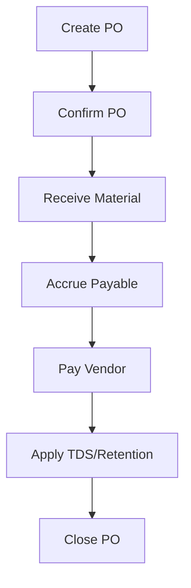

**Diagram sources**
- [src/database-purchase-module.sql](file://src/database-purchase-module.sql)
- [src/modules/Purchase/types.ts](file://src/modules/Purchase/types.ts)
- [src/pages/CreatePO.tsx](file://src/pages/CreatePO.tsx)
- [src/pages/MaterialInward.tsx](file://src/pages/MaterialInward.tsx)
- [src/pages/TDSPaymentPanel.tsx](file://src/pages/TDSPaymentPanel.tsx)

**Section sources**
- [src/database-purchase-module.sql](file://src/database-purchase-module.sql)
- [src/modules/Purchase/types.ts](file://src/modules/Purchase/types.ts)
- [src/pages/CreatePO.tsx](file://src/pages/CreatePO.tsx)
- [src/pages/MaterialInward.tsx](file://src/pages/MaterialInward.tsx)
- [src/pages/TDSPaymentPanel.tsx](file://src/pages/TDSPaymentPanel.tsx)

### Credit Note Lifecycle and Data Model
- Purpose: Adjustments for returns, pricing corrections, or service reductions.
- Types: Sales credit note (reduces receivables/revenue), purchase credit note (reduces payables/inventory cost).
- Posting: Reverses original postings proportionally; updates balances and aging.
- Status Flow: Draft → Posted → Reversed.

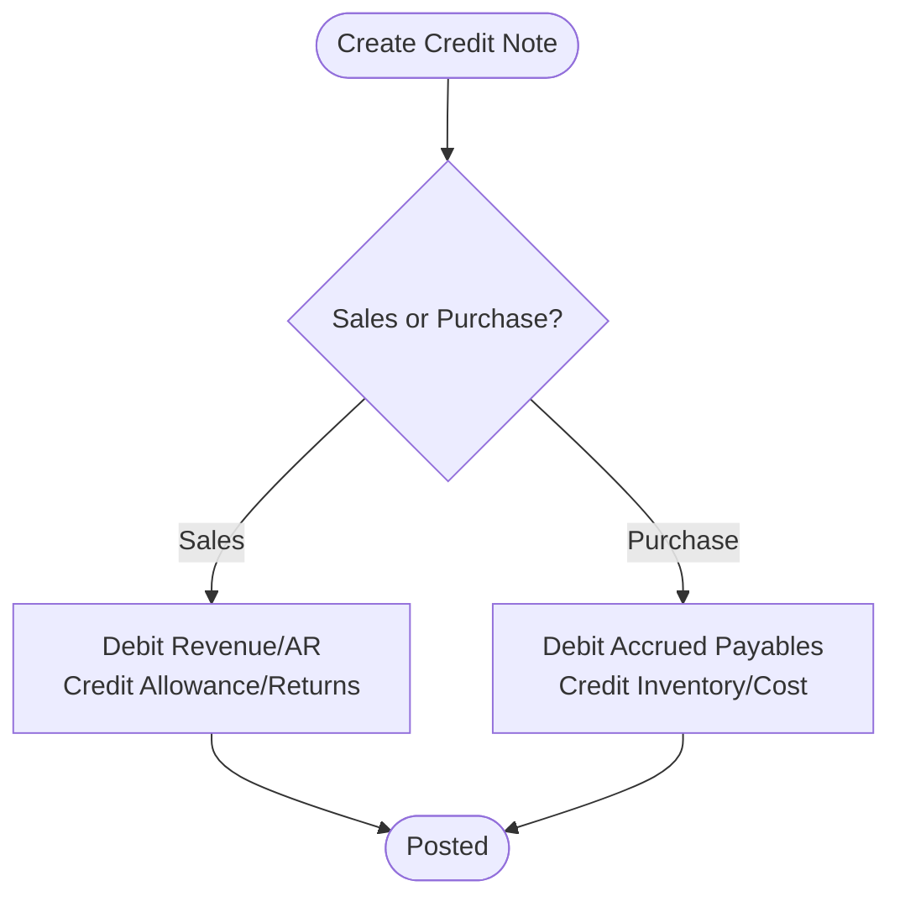

**Diagram sources**
- [src/credit-notes/types.ts](file://src/credit-notes/types.ts)
- [src/credit-notes/logic.ts](file://src/credit-notes/logic.ts)

**Section sources**
- [src/credit-notes/types.ts](file://src/credit-notes/types.ts)
- [src/credit-notes/logic.ts](file://src/credit-notes/logic.ts)

### Chart of Accounts Structure and Journal Entries
- Structure: Hierarchical accounts grouped into Assets, Liabilities, Equity, Income, Expenses; supports dimensions like project, department, location.
- Double-Entry: Every journal entry has balanced debits and credits; postings originate from documents and manual adjustments.
- Posting Rules:
  - Sales Invoice: Debit Receivables, Credit Revenue; Debit COGS, Credit Inventory.
  - Purchase Receipt: Debit Inventory/WIP, Credit Accrued Payables.
  - Payment: Debit Payables/Receivables, Credit Bank/Cash; Debit TDS Expense, Credit TDS Payable.
- Reversals: Use reversal RPC to undo erroneous postings while preserving audit trail.

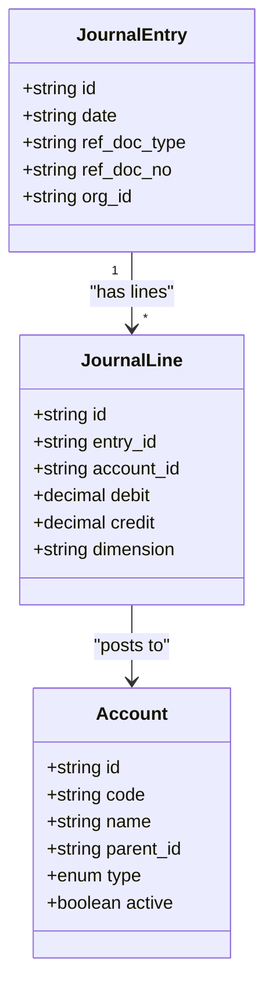

**Diagram sources**
- [ACCOUNTING_COA_DESIGN.md](file://ACCOUNTING_COA_DESIGN.md)
- [database-complete.sql](file://src/database-complete.sql)
- [sql/create_reversal_rpc.sql](file://sql/create_reversal_rpc.sql)

**Section sources**
- [ACCOUNTING_COA_DESIGN.md](file://ACCOUNTING_COA_DESIGN.md)
- [database-complete.sql](file://src/database-complete.sql)
- [sql/create_reversal_rpc.sql](file://sql/create_reversal_rpc.sql)

### Payment Processing, TDS, and Retention
- Receipts/Payments: Linked to invoices/POs; partial payments tracked; aging computed.
- TDS: Deducted at source based on vendor/customer classification and thresholds; posted to TDS expense and TDS payable accounts.
- Retention: Percentage withheld on payments; released later via retention release panel.
- Reconciliation: Payments reconcile outstanding balances; unmatched payments flagged for review.

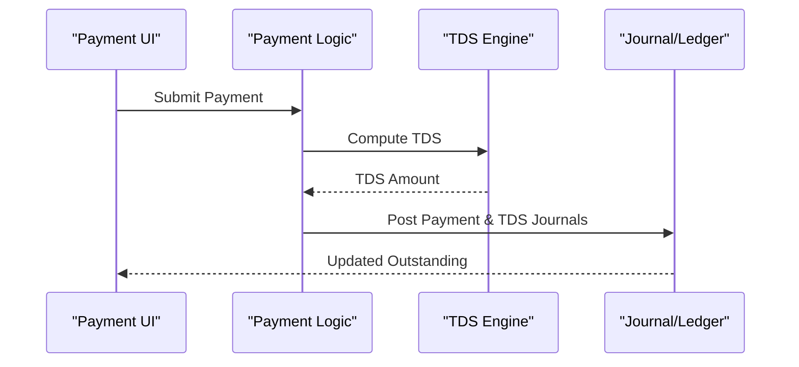

**Diagram sources**
- [src/pages/TDSPaymentPanel.tsx](file://src/pages/TDSPaymentPanel.tsx)
- [src/pages/RetentionReleasePanel.tsx](file://src/pages/RetentionReleasePanel.tsx)
- [src/ledger/api.ts](file://src/ledger/api.ts)

**Section sources**
- [src/pages/TDSPaymentPanel.tsx](file://src/pages/TDSPaymentPanel.tsx)
- [src/pages/RetentionReleasePanel.tsx](file://src/pages/RetentionReleasePanel.tsx)
- [src/ledger/api.ts](file://src/ledger/api.ts)

### Tax Calculations (HSN/SAC)
- Configuration: HSN/SAC codes mapped to tax rates; document-level tax breakdown computed.
- Computation: Line-item taxable value multiplied by applicable rate(s); totals aggregated at header.
- Compliance: Supports multi-component GST (CGST/SGST/IGST) and rounding rules.

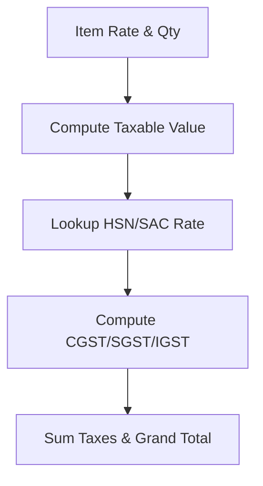

**Diagram sources**
- [src/database-hsn-tax.sql](file://src/database-hsn-tax.sql)
- [src/invoices/logic.ts](file://src/invoices/logic.ts)

**Section sources**
- [src/database-hsn-tax.sql](file://src/database-hsn-tax.sql)
- [src/invoices/logic.ts](file://src/invoices/logic.ts)

### Relationships Between Sales Documents, Purchase Orders, and Accounting Entries
- Sales Chain: Quotation → Proforma → Invoice → Payment; each step may post journals.
- Procurement Chain: Purchase Order → Material Inward → Accrued Payable → Payment; TDS applied.
- Cross-References: Delivery challans link to invoices; projects allocate costs and revenues; inventory movements reflect stock changes.

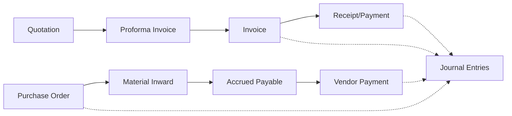

**Diagram sources**
- [src/database-quotation.sql](file://src/database-quotation.sql)
- [src/database-proforma-invoices.sql](file://src/database-proforma-invoices.sql)
- [src/database-purchase-module.sql](file://src/database-purchase-module.sql)
- [src/database-complete.sql](file://src/database-complete.sql)

**Section sources**
- [src/database-quotation.sql](file://src/database-quotation.sql)
- [src/database-proforma-invoices.sql](file://src/database-proforma-invoices.sql)
- [src/database-purchase-module.sql](file://src/database-purchase-module.sql)
- [src/database-complete.sql](file://src/database-complete.sql)

## Dependency Analysis
Key dependencies among modules and files:
- Document modules depend on series manager and tax engine for numbering and computations.
- Ledger utilities depend on chart of accounts and journal entries for balances and reports.
- UI pages orchestrate workflows and call domain logic and ledger APIs.
- Audit log captures changes for compliance and traceability.

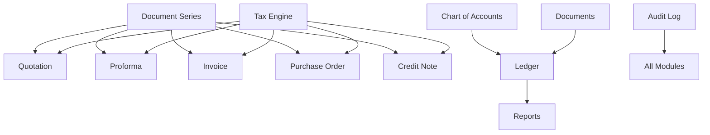

**Diagram sources**
- [database-document-series.sql](file://src/database-document-series.sql)
- [database-hsn-tax.sql](file://src/database-hsn-tax.sql)
- [ACCOUNTING_COA_DESIGN.md](file://ACCOUNTING_COA_DESIGN.md)
- [src/database-add-audit-log.sql](file://src/database-add-audit-log.sql)

**Section sources**
- [database-document-series.sql](file://src/database-document-series.sql)
- [database-hsn-tax.sql](file://src/database-hsn-tax.sql)
- [ACCOUNTING_COA_DESIGN.md](file://ACCOUNTING_COA_DESIGN.md)
- [src/database-add-audit-log.sql](file://src/database-add-audit-log.sql)

## Performance Considerations
- Indexing: Ensure indexes on foreign keys (org_id, project_id, party_id), document numbers, dates, and status fields.
- Batch Posting: For high-volume transactions, batch journal insertions and use transactions to maintain consistency.
- Aggregation Queries: Use materialized views or summary tables for aging and trial balance to avoid heavy joins.
- Pagination & Virtualization: Implement server-side pagination and virtualized lists for large datasets.
- Caching: Cache static lookups (tax rates, account hierarchies) and frequently accessed master data.
- Concurrency Control: Use optimistic locking or row-level locks for critical updates (series reservation, payment reconciliation).

[No sources needed since this section provides general guidance]

## Troubleshooting Guide
- Unbalanced Journals: Validate sum(debits) equals sum(credits) before committing; enforce constraints at DB level.
- Missing Series Numbers: Check series reservations and rollback policies; ensure atomic increments.
- Tax Mismatches: Verify HSN/SAC mappings and rounding rules; compare computed vs posted amounts.
- Payment Reconciliation Failures: Inspect outstanding balances and partial payments; check TDS/retention application.
- Audit Trail Gaps: Confirm audit log inserts on create/update/delete; verify RLS policies allow necessary writes.

**Section sources**
- [src/database-add-audit-log.sql](file://src/database-add-audit-log.sql)
- [src/hooks/useAuditLog.ts](file://src/hooks/useAuditLog.ts)
- [sql/create_reversal_rpc.sql](file://sql/create_reversal_rpc.sql)

## Conclusion
The financial operations and accounting system integrates document-driven workflows with robust double-entry accounting, tax computation, and compliance features. By adhering to the documented lifecycles, relationships, and best practices, teams can maintain data integrity, meet regulatory requirements, and scale efficiently for high-volume transactions.

[No sources needed since this section summarizes without analyzing specific files]

## Appendices

### Example Financial Queries and Balance Calculations
- Receivables Aging: Sum outstanding invoice amounts by due date buckets.
- Payables Aging: Sum outstanding PO-related accruals minus payments by due date buckets.
- Trial Balance: Aggregate journal line debits and credits per account for a period.
- P&L Summary: Sum income and expense accounts over fiscal periods.
- Inventory Valuation: Weighted average cost or FIFO depending on policy; adjust via stock adjustments.

[No sources needed since this section provides general guidance]

### Regulatory Compliance Notes
- GST Compliance: Maintain HSN/SAC mappings, tax breakdowns, and e-invoicing readiness.
- TDS Compliance: Track deductee details, sections, and thresholds; generate TDS statements.
- Audit Readiness: Preserve full audit trails, reversal logs, and approval histories.

[No sources needed since this section provides general guidance]