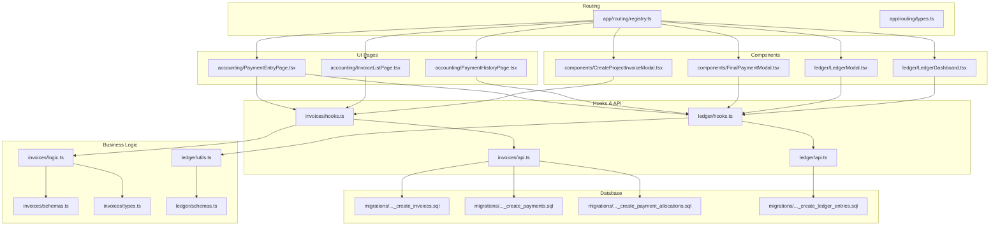
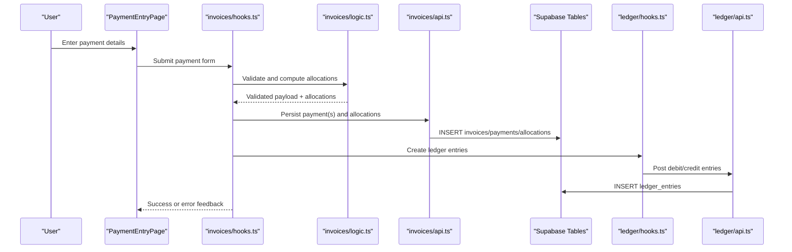
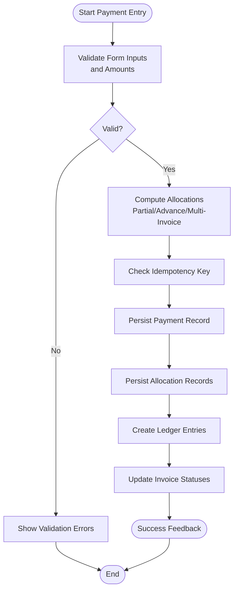
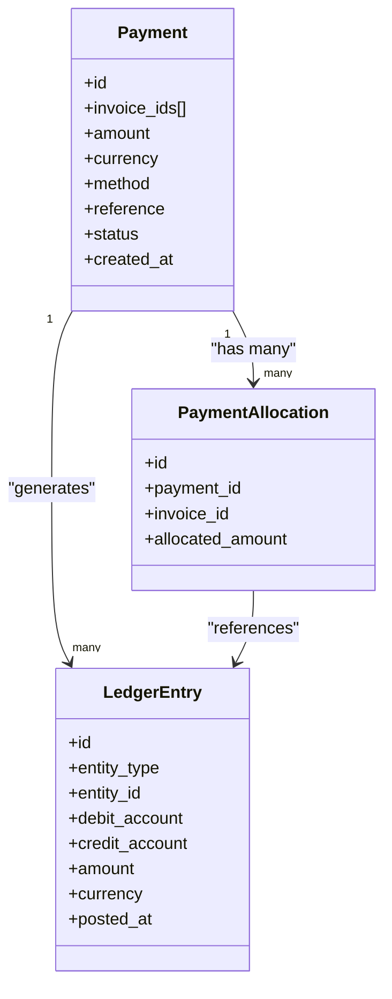
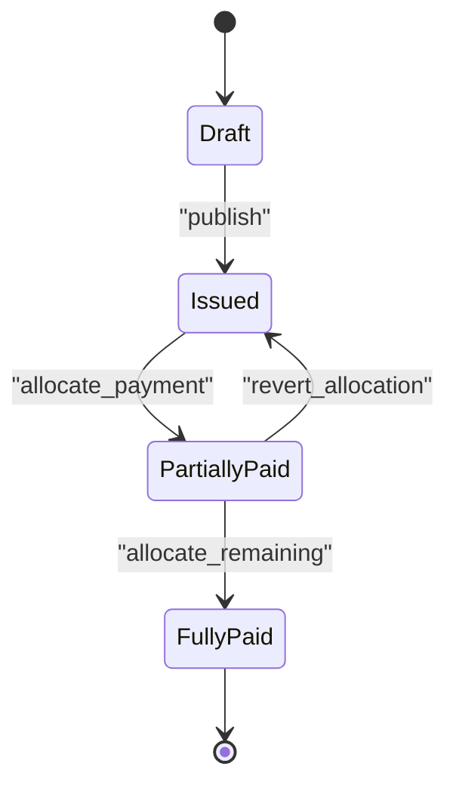
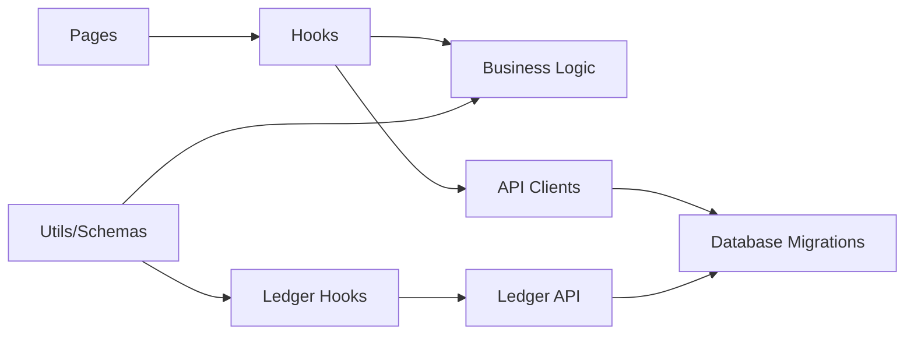
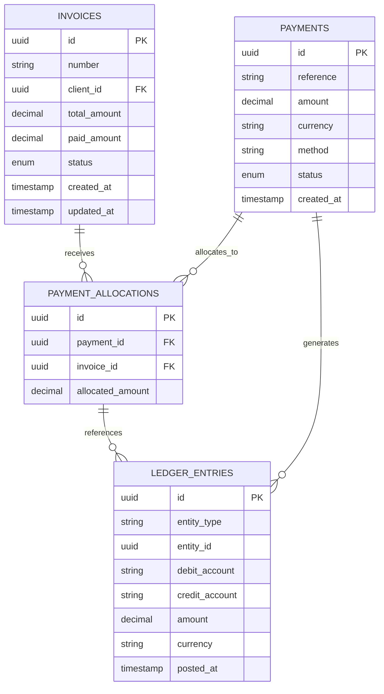

# Customer Payments & Invoicing

<cite>
**Referenced Files in This Document**
- [src/invoices/types.ts](file://src/invoices/types.ts)
- [src/invoices/schemas.ts](file://src/invoices/schemas.ts)
- [src/invoices/logic.ts](file://src/invoices/logic.ts)
- [src/invoices/api.ts](file://src/invoices/api.ts)
- [src/invoices/hooks.ts](file://src/invoices/hooks.ts)
- [src/invoices/components/CreateProjectInvoiceModal.tsx](file://src/components/CreateProjectInvoiceModal.tsx)
- [src/invoices/components/FinalPaymentModal.tsx](file://src/components/FinalPaymentModal.tsx)
- [src/ledger/LedgerModal.tsx](file://src/ledger/LedgerModal.tsx)
- [src/ledger/LedgerDashboard.tsx](file://src/ledger/LedgerDashboard.tsx)
- [src/ledger/api.ts](file://src/ledger/api.ts)
- [src/ledger/hooks.ts](file://src/ledger/hooks.ts)
- [src/ledger/schemas.ts](file://src/ledger/schemas.ts)
- [src/ledger/utils.ts](file://src/ledger/utils.ts)
- [src/pages/accounting/index.tsx](file://src/pages/accounting/index.tsx)
- [src/pages/accounting/PaymentEntryPage.tsx](file://src/pages/accounting/PaymentEntryPage.tsx)
- [src/pages/accounting/InvoiceListPage.tsx](file://src/pages/accounting/InvoiceListPage.tsx)
- [src/pages/accounting/PaymentHistoryPage.tsx](file://src/pages/accounting/PaymentHistoryPage.tsx)
- [src/app/routing/registry.ts](file://src/app/routing/registry.ts)
- [src/app/routing/types.ts](file://src/app/routing/types.ts)
- [src/lib/currency.ts](file://src/lib/currency.ts)
- [src/lib/logger.tsx](file://src/lib/logger.tsx)
- [supabase/migrations/20240101_create_invoices.sql](file://supabase/migrations/20240101_create_invoices.sql)
- [supabase/migrations/20240102_create_payments.sql](file://supabase/migrations/20240102_create_payments.sql)
- [supabase/migrations/20240103_create_payment_allocations.sql](file://supabase/migrations/20240103_create_payment_allocations.sql)
- [supabase/migrations/20240104_create_ledger_entries.sql](file://supabase/migrations/20240104_create_ledger_entries.sql)
</cite>

## Table of Contents
1. [Introduction](#introduction)
2. [Project Structure](#project-structure)
3. [Core Components](#core-components)
4. [Architecture Overview](#architecture-overview)
5. [Detailed Component Analysis](#detailed-component-analysis)
6. [Dependency Analysis](#dependency-analysis)
7. [Performance Considerations](#performance-considerations)
8. [Troubleshooting Guide](#troubleshooting-guide)
9. [Conclusion](#conclusion)
10. [Appendices](#appendices)

## Introduction
This document explains customer payment processing and invoice management across the application. It covers:
- Payment recording workflows and validation rules
- Payment history tracking and reconciliation
- Invoice status management and lifecycle
- Partial payments, advance payments, and allocation to multiple invoices
- Payment entry forms and user flows
- Automated payment reminders (conceptual)
- Error handling strategies
- Integration points with accounting systems

The goal is to provide both a high-level understanding and detailed technical guidance for developers and product users.

## Project Structure
The relevant code spans UI pages, components, hooks, API clients, business logic, types, schemas, utilities, and database migrations. The structure follows feature-based organization with shared ledger functionality used by invoicing and payments.

**Diagram sources**
- [src/pages/accounting/PaymentEntryPage.tsx](file://src/pages/accounting/PaymentEntryPage.tsx)
- [src/pages/accounting/InvoiceListPage.tsx](file://src/pages/accounting/InvoiceListPage.tsx)
- [src/pages/accounting/PaymentHistoryPage.tsx](file://src/pages/accounting/PaymentHistoryPage.tsx)
- [src/components/CreateProjectInvoiceModal.tsx](file://src/components/CreateProjectInvoiceModal.tsx)
- [src/components/FinalPaymentModal.tsx](file://src/components/FinalPaymentModal.tsx)
- [src/ledger/LedgerModal.tsx](file://src/ledger/LedgerModal.tsx)
- [src/ledger/LedgerDashboard.tsx](file://src/ledger/LedgerDashboard.tsx)
- [src/invoices/hooks.ts](file://src/invoices/hooks.ts)
- [src/invoices/api.ts](file://src/invoices/api.ts)
- [src/ledger/hooks.ts](file://src/ledger/hooks.ts)
- [src/ledger/api.ts](file://src/ledger/api.ts)
- [src/invoices/logic.ts](file://src/invoices/logic.ts)
- [src/invoices/schemas.ts](file://src/invoices/schemas.ts)
- [src/invoices/types.ts](file://src/invoices/types.ts)
- [src/ledger/utils.ts](file://src/ledger/utils.ts)
- [src/ledger/schemas.ts](file://src/ledger/schemas.ts)
- [src/app/routing/registry.ts](file://src/app/routing/registry.ts)
- [src/app/routing/types.ts](file://src/app/routing/types.ts)
- [supabase/migrations/20240101_create_invoices.sql](file://supabase/migrations/20240101_create_invoices.sql)
- [supabase/migrations/20240102_create_payments.sql](file://supabase/migrations/20240102_create_payments.sql)
- [supabase/migrations/20240103_create_payment_allocations.sql](file://supabase/migrations/20240103_create_payment_allocations.sql)
- [supabase/migrations/20240104_create_ledger_entries.sql](file://supabase/migrations/20240104_create_ledger_entries.sql)

**Section sources**
- [src/app/routing/registry.ts](file://src/app/routing/registry.ts)
- [src/app/routing/types.ts](file://src/app/routing/types.ts)

## Core Components
- Invoicing domain: types, schemas, business logic, hooks, and API client orchestrate invoice creation, updates, and status transitions.
- Ledger domain: provides generic double-entry style ledger entries, reconciliations, and dashboards consumed by payments and invoices.
- UI pages and modals: PaymentEntryPage, InvoiceListPage, PaymentHistoryPage, CreateProjectInvoiceModal, FinalPaymentModal, LedgerModal, LedgerDashboard.

Key responsibilities:
- Validate inputs using Zod-like schemas before persisting.
- Enforce business rules such as partial and advance payments, multi-invoice allocation, and idempotency.
- Emit ledger entries on successful transactions.
- Provide consistent error handling and logging.

**Section sources**
- [src/invoices/types.ts](file://src/invoices/types.ts)
- [src/invoices/schemas.ts](file://src/invoices/schemas.ts)
- [src/invoices/logic.ts](file://src/invoices/logic.ts)
- [src/invoices/hooks.ts](file://src/invoices/hooks.ts)
- [src/invoices/api.ts](file://src/invoices/api.ts)
- [src/ledger/utils.ts](file://src/ledger/utils.ts)
- [src/ledger/schemas.ts](file://src/ledger/schemas.ts)
- [src/ledger/hooks.ts](file://src/ledger/hooks.ts)
- [src/ledger/api.ts](file://src/ledger/api.ts)

## Architecture Overview
The system separates concerns into UI, hooks/API, business logic, and persistence layers. Business logic validates and transforms data; hooks manage state and side effects; API clients call backend endpoints; database migrations define schema.

**Diagram sources**
- [src/pages/accounting/PaymentEntryPage.tsx](file://src/pages/accounting/PaymentEntryPage.tsx)
- [src/invoices/hooks.ts](file://src/invoices/hooks.ts)
- [src/invoices/logic.ts](file://src/invoices/logic.ts)
- [src/invoices/api.ts](file://src/invoices/api.ts)
- [src/ledger/hooks.ts](file://src/ledger/hooks.ts)
- [src/ledger/api.ts](file://src/ledger/api.ts)
- [supabase/migrations/20240101_create_invoices.sql](file://supabase/migrations/20240101_create_invoices.sql)
- [supabase/migrations/20240102_create_payments.sql](file://supabase/migrations/20240102_create_payments.sql)
- [supabase/migrations/20240103_create_payment_allocations.sql](file://supabase/migrations/20240103_create_payment_allocations.sql)
- [supabase/migrations/20240104_create_ledger_entries.sql](file://supabase/migrations/20240104_create_ledger_entries.sql)

## Detailed Component Analysis

### Payment Recording Workflow
End-to-end flow from user input to persisted records and ledger entries.

**Diagram sources**
- [src/pages/accounting/PaymentEntryPage.tsx](file://src/pages/accounting/PaymentEntryPage.tsx)
- [src/invoices/schemas.ts](file://src/invoices/schemas.ts)
- [src/invoices/logic.ts](file://src/invoices/logic.ts)
- [src/invoices/api.ts](file://src/invoices/api.ts)
- [src/ledger/utils.ts](file://src/ledger/utils.ts)
- [src/ledger/api.ts](file://src/ledger/api.ts)
- [supabase/migrations/20240102_create_payments.sql](file://supabase/migrations/20240102_create_payments.sql)
- [supabase/migrations/20240103_create_payment_allocations.sql](file://supabase/migrations/20240103_create_payment_allocations.sql)
- [supabase/migrations/20240104_create_ledger_entries.sql](file://supabase/migrations/20240104_create_ledger_entries.sql)

**Section sources**
- [src/pages/accounting/PaymentEntryPage.tsx](file://src/pages/accounting/PaymentEntryPage.tsx)
- [src/invoices/schemas.ts](file://src/invoices/schemas.ts)
- [src/invoices/logic.ts](file://src/invoices/logic.ts)
- [src/invoices/api.ts](file://src/invoices/api.ts)
- [src/ledger/utils.ts](file://src/ledger/utils.ts)
- [src/ledger/api.ts](file://src/ledger/api.ts)

### Payment History Tracking
Tracks all payments and their allocations for auditability and reconciliation.

**Diagram sources**
- [supabase/migrations/20240102_create_payments.sql](file://supabase/migrations/20240102_create_payments.sql)
- [supabase/migrations/20240103_create_payment_allocations.sql](file://supabase/migrations/20240103_create_payment_allocations.sql)
- [supabase/migrations/20240104_create_ledger_entries.sql](file://supabase/migrations/20240104_create_ledger_entries.sql)
- [src/ledger/hooks.ts](file://src/ledger/hooks.ts)
- [src/ledger/api.ts](file://src/ledger/api.ts)

**Section sources**
- [src/ledger/LedgerModal.tsx](file://src/ledger/LedgerModal.tsx)
- [src/ledger/LedgerDashboard.tsx](file://src/ledger/LedgerDashboard.tsx)
- [src/ledger/hooks.ts](file://src/ledger/hooks.ts)
- [src/ledger/api.ts](file://src/ledger/api.ts)

### Invoice Status Management
Invoices transition through statuses based on cumulative allocated payments.

**Diagram sources**
- [src/invoices/types.ts](file://src/invoices/types.ts)
- [src/invoices/logic.ts](file://src/invoices/logic.ts)
- [supabase/migrations/20240101_create_invoices.sql](file://supabase/migrations/20240101_create_invoices.sql)

**Section sources**
- [src/invoices/types.ts](file://src/invoices/types.ts)
- [src/invoices/logic.ts](file://src/invoices/logic.ts)

### Partial Payments, Advance Payments, and Multi-Invoice Allocation
- Partial payments: allocate less than outstanding balance; invoice remains partially paid.
- Advance payments: allocate against future invoices via reference or pre-allocation flags.
- Multi-invoice allocation: split a single payment across multiple invoices proportionally or by explicit amounts.

Validation and computation are centralized in business logic and enforced by schemas.

**Section sources**
- [src/invoices/logic.ts](file://src/invoices/logic.ts)
- [src/invoices/schemas.ts](file://src/invoices/schemas.ts)
- [src/invoices/types.ts](file://src/invoices/types.ts)

### Payment Entry Forms
Forms capture:
- Customer selection
- Payment method and reference
- Amount and currency
- Target invoices and allocation amounts
- Optional remarks and attachments

UX patterns include inline validation, real-time remaining balances, and confirmation dialogs.

**Section sources**
- [src/pages/accounting/PaymentEntryPage.tsx](file://src/pages/accounting/PaymentEntryPage.tsx)
- [src/components/CreateProjectInvoiceModal.tsx](file://src/components/CreateProjectInvoiceModal.tsx)
- [src/components/FinalPaymentModal.tsx](file://src/components/FinalPaymentModal.tsx)

### Payment Reconciliation Processes
Reconciliation compares:
- Bank statements or external receipts
- Internal payment records and allocations
- Ledger debits and credits

Discrepancies are flagged and resolved via adjustments or reversals.

**Section sources**
- [src/ledger/LedgerDashboard.tsx](file://src/ledger/LedgerDashboard.tsx)
- [src/ledger/LedgerModal.tsx](file://src/ledger/LedgerModal.tsx)
- [src/ledger/utils.ts](file://src/ledger/utils.ts)

### Automated Payment Reminders (Conceptual)
Reminders can be scheduled based on:
- Overdue thresholds
- Aging buckets
- Client preferences

Implementation typically uses background jobs that query unpaid invoices and send notifications.

[No sources needed since this section doesn't analyze specific files]

### Payment Validation Rules
Common rules include:
- Non-negative amounts
- Currency consistency
- Sum of allocations equals payment amount
- Cannot overpay an invoice beyond outstanding balance
- Idempotency key uniqueness
- Required fields per payment method

These are enforced at schema and logic layers.

**Section sources**
- [src/invoices/schemas.ts](file://src/invoices/schemas.ts)
- [src/invoices/logic.ts](file://src/invoices/logic.ts)

### Error Handling
Strategies:
- Client-side validation errors surfaced immediately
- Server-side errors mapped to user-friendly messages
- Transaction rollback on partial failures
- Audit logging for failed attempts

**Section sources**
- [src/lib/logger.tsx](file://src/lib/logger.tsx)
- [src/invoices/api.ts](file://src/invoices/api.ts)
- [src/ledger/api.ts](file://src/ledger/api.ts)

### Integration with Accounting Systems
Integration points:
- Export ledger entries to external accounting APIs
- Map internal accounts to chart of accounts
- Sync invoice and payment references

Ensure idempotent sync and robust retry policies.

**Section sources**
- [src/ledger/utils.ts](file://src/ledger/utils.ts)
- [src/ledger/api.ts](file://src/ledger/api.ts)

## Dependency Analysis
High-level dependencies between modules and layers.

**Diagram sources**
- [src/pages/accounting/PaymentEntryPage.tsx](file://src/pages/accounting/PaymentEntryPage.tsx)
- [src/invoices/hooks.ts](file://src/invoices/hooks.ts)
- [src/invoices/logic.ts](file://src/invoices/logic.ts)
- [src/invoices/api.ts](file://src/invoices/api.ts)
- [src/ledger/hooks.ts](file://src/ledger/hooks.ts)
- [src/ledger/api.ts](file://src/ledger/api.ts)
- [src/invoices/schemas.ts](file://src/invoices/schemas.ts)
- [src/ledger/schemas.ts](file://src/ledger/schemas.ts)

**Section sources**
- [src/invoices/hooks.ts](file://src/invoices/hooks.ts)
- [src/invoices/api.ts](file://src/invoices/api.ts)
- [src/ledger/hooks.ts](file://src/ledger/hooks.ts)
- [src/ledger/api.ts](file://src/ledger/api.ts)

## Performance Considerations
- Batch operations for multi-invoice allocations to reduce round trips.
- Use optimistic UI updates with rollback on failure.
- Index frequently queried columns (e.g., invoice_id, payment_id).
- Paginate large histories and use server-side filters.
- Avoid redundant recalculations by caching outstanding balances.

[No sources needed since this section provides general guidance]

## Troubleshooting Guide
Common issues and resolutions:
- Validation failures: check required fields, currency, and allocation sums.
- Duplicate payments: verify idempotency keys and unique constraints.
- Status mismatches: recompute invoice totals from allocations and refresh.
- Ledger imbalance: inspect generated entries and adjust if necessary.
- Logging: review logs for stack traces and context.

**Section sources**
- [src/lib/logger.tsx](file://src/lib/logger.tsx)
- [src/ledger/LedgerModal.tsx](file://src/ledger/LedgerModal.tsx)
- [src/ledger/LedgerDashboard.tsx](file://src/ledger/LedgerDashboard.tsx)

## Conclusion
The payment and invoicing subsystem combines robust validation, clear state transitions, and comprehensive ledger integration. By centralizing business logic and enforcing schemas, it supports partial and advance payments, multi-invoice allocations, and reliable reconciliation. Proper error handling and logging ensure maintainability and operational visibility.

[No sources needed since this section summarizes without analyzing specific files]

## Appendices

### Data Models Overview

**Diagram sources**
- [supabase/migrations/20240101_create_invoices.sql](file://supabase/migrations/20240101_create_invoices.sql)
- [supabase/migrations/20240102_create_payments.sql](file://supabase/migrations/20240102_create_payments.sql)
- [supabase/migrations/20240103_create_payment_allocations.sql](file://supabase/migrations/20240103_create_payment_allocations.sql)
- [supabase/migrations/20240104_create_ledger_entries.sql](file://supabase/migrations/20240104_create_ledger_entries.sql)