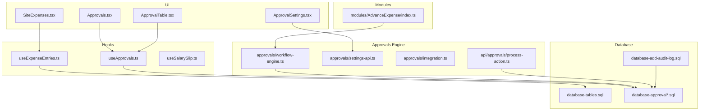
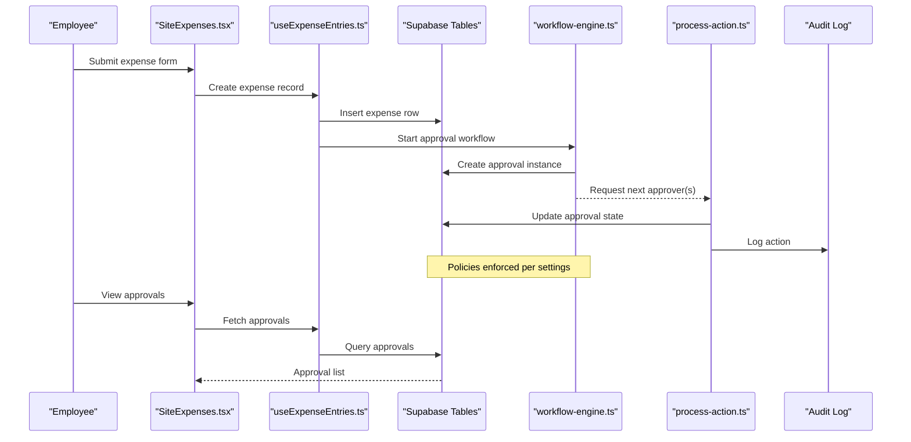
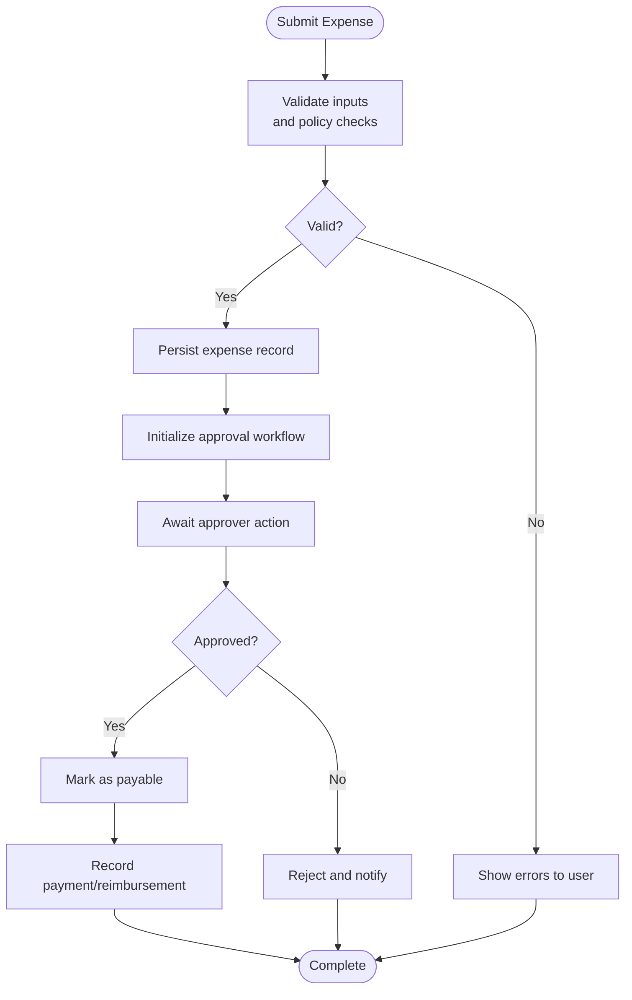
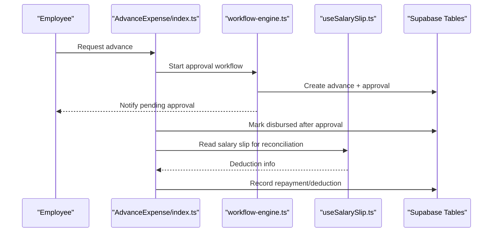
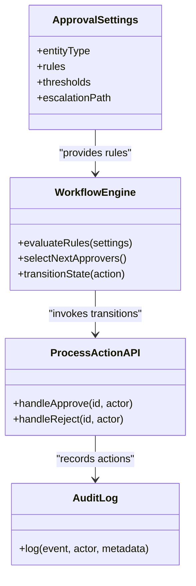
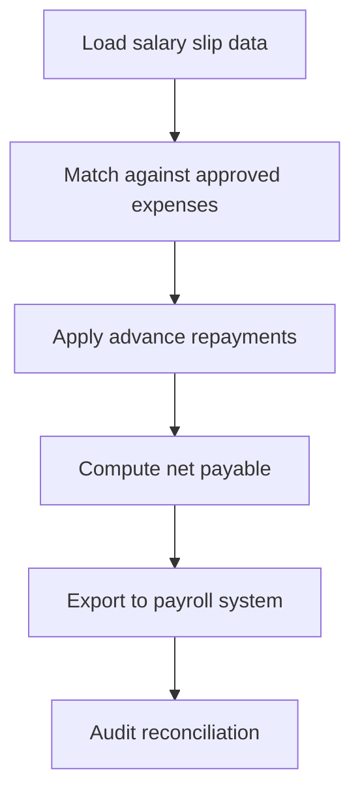
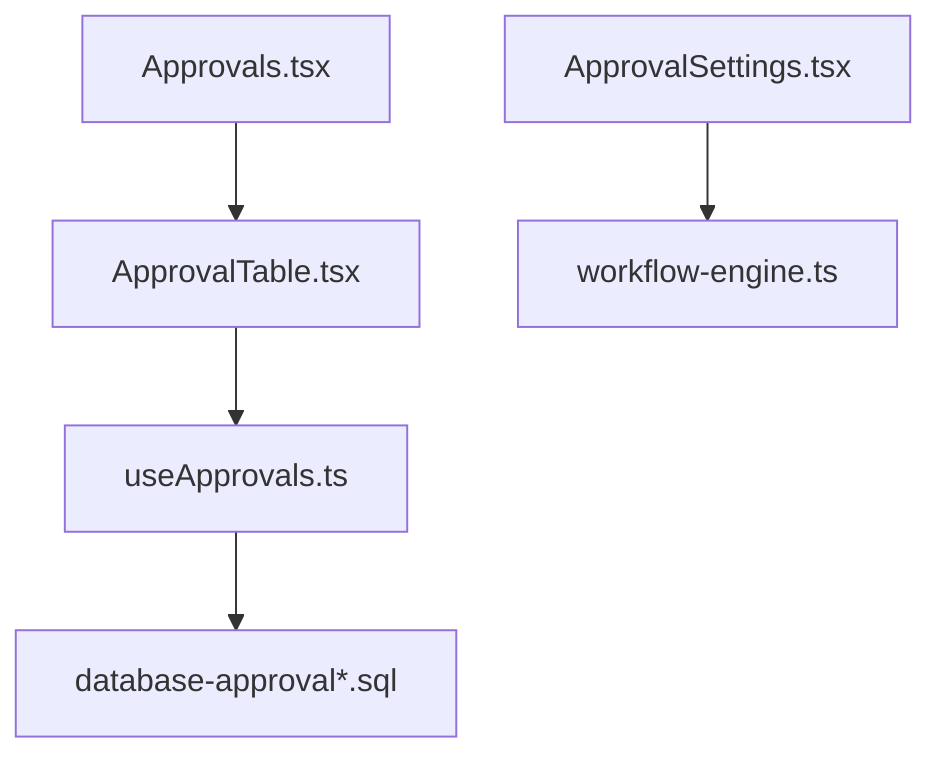
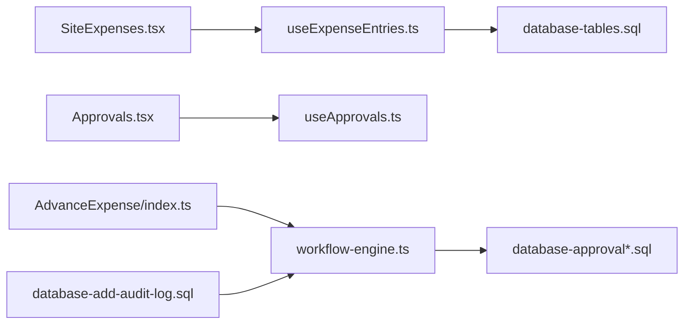

# Employee Expenses & Advances

<cite>
**Referenced Files in This Document**
- [SiteExpenses.tsx](file://src/pages/SiteExpenses.tsx)
- [useExpenseEntries.ts](file://src/hooks/useExpenseEntries.ts)
- [AdvanceExpense/index.ts](file://src/modules/AdvanceExpense/index.ts)
- [database-complete.sql](file://src/database-complete.sql)
- [database-setup.sql](file://src/database-setup.sql)
- [database-tables.sql](file://src/database-tables.sql)
- [database-approval.sql](file://src/database-approval.sql)
- [database-approvals.sql](file://src/database-approvals.sql)
- [database-approval-workflows-fix-fk.sql](file://src/database-approval-workflows-fix-fk.sql)
- [database-approval-workflows-rls.sql](file://src/database-approval-workflows-rls.sql)
- [database-site-report-approval.sql](file://src/database-site-report-approval.sql)
- [database-audit-log.sql](file://src/database-add-audit-log.sql)
- [useApprovals.ts](file://src/hooks/useApprovals.ts)
- [api/approvals/process-action.ts](file://src/api/approvals/process-action.ts)
- [approvals/workflow-engine.ts](file://src/approvals/workflow-engine.ts)
- [approvals/settings-api.ts](file://src/approvals/settings-api.ts)
- [approvals/integration.ts](file://src/approvals/integration.ts)
- [pages/Approvals.tsx](file://src/pages/Approvals.tsx)
- [components/ApprovalTable.tsx](file://src/components/ApprovalTable.tsx)
- [components/ApprovalSettings.tsx](file://src/components/ApprovalSettings.tsx)
- [hooks/useSalarySlip.ts](file://src/hooks/useSalarySlip.ts)
</cite>

## Table of Contents
1. [Introduction](#introduction)
2. [Project Structure](#project-structure)
3. [Core Components](#core-components)
4. [Architecture Overview](#architecture-overview)
5. [Detailed Component Analysis](#detailed-component-analysis)
6. [Dependency Analysis](#dependency-analysis)
7. [Performance Considerations](#performance-considerations)
8. [Troubleshooting Guide](#troubleshooting-guide)
9. [Conclusion](#conclusion)
10. [Appendices](#appendices)

## Introduction
This document explains how employee expenses and advance salary processing are implemented and integrated within the application. It covers expense claim workflows, advance disbursement, reimbursement tracking, categorization, approval hierarchies, policy enforcement, payroll integration points, limits, tax implications, and audit trail requirements. The goal is to provide both a high-level understanding and detailed technical references for developers and administrators.

## Project Structure
The expense and advance functionality spans UI pages, hooks, modules, approvals infrastructure, and database migrations:
- Expense entry and listing: SiteExpenses page and useExpenseEntries hook
- Advance module: AdvanceExpense module with its own index entry point
- Approvals engine and settings: reusable workflow engine, API actions, and settings UI
- Database schema: tables and RLS policies for approvals and audit logs
- Payroll integration: salary slip hook used by payroll-related flows

**Diagram sources**
- [SiteExpenses.tsx](file://src/pages/SiteExpenses.tsx)
- [useExpenseEntries.ts](file://src/hooks/useExpenseEntries.ts)
- [modules/AdvanceExpense/index.ts](file://src/modules/AdvanceExpense/index.ts)
- [approvals/workflow-engine.ts](file://src/approvals/workflow-engine.ts)
- [approvals/settings-api.ts](file://src/approvals/settings-api.ts)
- [approvals/integration.ts](file://src/approvals/integration.ts)
- [api/approvals/process-action.ts](file://src/api/approvals/process-action.ts)
- [database-tables.sql](file://src/database-tables.sql)
- [database-approval.sql](file://src/database-approval.sql)
- [database-approvals.sql](file://src/database-approvals.sql)
- [database-approval-workflows-fix-fk.sql](file://src/database-approval-workflows-fix-fk.sql)
- [database-approval-workflows-rls.sql](file://src/database-approval-workflows-rls.sql)
- [database-site-report-approval.sql](file://src/database-site-report-approval.sql)
- [database-add-audit-log.sql](file://src/database-add-audit-log.sql)

**Section sources**
- [SiteExpenses.tsx](file://src/pages/SiteExpenses.tsx)
- [useExpenseEntries.ts](file://src/hooks/useExpenseEntries.ts)
- [modules/AdvanceExpense/index.ts](file://src/modules/AdvanceExpense/index.ts)
- [approvals/workflow-engine.ts](file://src/approvals/workflow-engine.ts)
- [approvals/settings-api.ts](file://src/approvals/settings-api.ts)
- [approvals/integration.ts](file://src/approvals/integration.ts)
- [api/approvals/process-action.ts](file://src/api/approvals/process-action.ts)
- [database-tables.sql](file://src/database-tables.sql)
- [database-approval.sql](file://src/database-approval.sql)
- [database-approvals.sql](file://src/database-approvals.sql)
- [database-approval-workflows-fix-fk.sql](file://src/database-approval-workflows-fix-fk.sql)
- [database-approval-workflows-rls.sql](file://src/database-approval-workflows-rls.sql)
- [database-site-report-approval.sql](file://src/database-site-report-approval.sql)
- [database-add-audit-log.sql](file://src/database-add-audit-log.sql)

## Core Components
- Expense Entry and Listing
  - SiteExpenses page provides the user interface for submitting site expenses and viewing entries.
  - useExpenseEntries hook encapsulates data fetching and mutations for expense records.
- Advance Module
  - AdvanceExpense module exposes an entry point for managing employee advances (disbursements and repayments).
- Approval Workflow Engine
  - Reusable approval engine orchestrates multi-step approvals, enforces policies, and integrates with notifications and PDF generation.
  - Settings API allows configuring approval rules per entity type and organization.
- Payroll Integration
  - Salary slip hook supports reading payroll data; expense reimbursements and advances can be reconciled against payroll outputs.

Key responsibilities:
- Data persistence via Supabase tables defined in database migrations
- Policy enforcement through approval settings and RLS policies
- Auditability via dedicated audit log table
- UI-driven workflows for submission, review, approval, and payment/reimbursement

**Section sources**
- [SiteExpenses.tsx](file://src/pages/SiteExpenses.tsx)
- [useExpenseEntries.ts](file://src/hooks/useExpenseEntries.ts)
- [modules/AdvanceExpense/index.ts](file://src/modules/AdvanceExpense/index.ts)
- [approvals/workflow-engine.ts](file://src/approvals/workflow-engine.ts)
- [approvals/settings-api.ts](file://src/approvals/settings-api.ts)
- [useSalarySlip.ts](file://src/hooks/useSalarySlip.ts)

## Architecture Overview
The system follows a layered architecture:
- Presentation Layer: Pages and components render forms, lists, and approval dashboards.
- Business Logic Layer: Hooks and modules implement domain logic such as validation, calculations, and state management.
- Workflow Layer: Approval engine manages states, transitions, and policy checks.
- Persistence Layer: Supabase tables store entities, approvals, and audit events.
- Integration Layer: Optional integrations for notifications and payroll.

**Diagram sources**
- [SiteExpenses.tsx](file://src/pages/SiteExpenses.tsx)
- [useExpenseEntries.ts](file://src/hooks/useExpenseEntries.ts)
- [approvals/workflow-engine.ts](file://src/approvals/workflow-engine.ts)
- [api/approvals/process-action.ts](file://src/api/approvals/process-action.ts)
- [database-add-audit-log.sql](file://src/database-add-audit-log.sql)

## Detailed Component Analysis

### Expense Submission and Tracking
- Purpose: Allow employees to submit expenses, attach details, and track status through approvals and payments.
- Key elements:
  - Form fields include category, amount, date, project linkage, description, and attachments.
  - Validation includes required fields, numeric constraints, and policy checks (e.g., per-category limits).
  - Status lifecycle: Draft -> Submitted -> Approved -> Paid/Reimbursed or Cancelled.
- Data model:
  - Expense header and line items stored in dedicated tables.
  - Linkage to employee, project, and approval instances.
- Example submission flow:
  - Employee fills out the expense form and submits.
  - System persists the record and triggers the approval workflow.
  - Approvers review and act (approve/reject) via the approvals dashboard.
  - Upon final approval, finance marks it paid; reimbursement is recorded.

**Diagram sources**
- [SiteExpenses.tsx](file://src/pages/SiteExpenses.tsx)
- [useExpenseEntries.ts](file://src/hooks/useExpenseEntries.ts)
- [approvals/workflow-engine.ts](file://src/approvals/workflow-engine.ts)

**Section sources**
- [SiteExpenses.tsx](file://src/pages/SiteExpenses.tsx)
- [useExpenseEntries.ts](file://src/hooks/useExpenseEntries.ts)

### Advance Salary Disbursement and Repayment
- Purpose: Manage employee cash advances, track outstanding balances, and reconcile repayments.
- Key elements:
  - Advance creation with purpose, amount, repayment schedule, and linked employee.
  - Status lifecycle: Requested -> Approved -> Disbursed -> Repaid/Closed.
  - Deductions can be aligned with payroll cycles where applicable.
- Integration points:
  - Use salary slip data to reconcile deductions and outstanding balances.
  - Approval workflow ensures authorization before disbursement.

**Diagram sources**
- [modules/AdvanceExpense/index.ts](file://src/modules/AdvanceExpense/index.ts)
- [approvals/workflow-engine.ts](file://src/approvals/workflow-engine.ts)
- [useSalarySlip.ts](file://src/hooks/useSalarySlip.ts)

**Section sources**
- [modules/AdvanceExpense/index.ts](file://src/modules/AdvanceExpense/index.ts)
- [useSalarySlip.ts](file://src/hooks/useSalarySlip.ts)

### Approval Hierarchies and Policy Enforcement
- Purpose: Enforce configurable approval chains based on entity type, amount thresholds, department, and other attributes.
- Key elements:
  - Approval settings define rules and routing.
  - Workflow engine evaluates conditions and selects next approvers.
  - Actions (approve/reject) are processed via API and logged.
- Configuration:
  - Admins configure rules using settings UI and API.
  - Rules may include per-category expense limits and escalation paths.

**Diagram sources**
- [approvals/settings-api.ts](file://src/approvals/settings-api.ts)
- [approvals/workflow-engine.ts](file://src/approvals/workflow-engine.ts)
- [api/approvals/process-action.ts](file://src/api/approvals/process-action.ts)
- [database-add-audit-log.sql](file://src/database-add-audit-log.sql)

**Section sources**
- [approvals/settings-api.ts](file://src/approvals/settings-api.ts)
- [approvals/workflow-engine.ts](file://src/approvals/workflow-engine.ts)
- [api/approvals/process-action.ts](file://src/api/approvals/process-action.ts)

### Payroll Integration and Reconciliation
- Purpose: Align expense reimbursements and advance repayments with payroll outputs.
- Key elements:
  - Salary slip hook provides current and historical payroll data.
  - Reconciliation logic matches approved expenses and deducted advances to pay periods.
  - Adjustments and corrections are audited.

**Diagram sources**
- [useSalarySlip.ts](file://src/hooks/useSalarySlip.ts)

**Section sources**
- [useSalarySlip.ts](file://src/hooks/useSalarySlip.ts)

### UI Components for Approvals
- Approvals Dashboard: Centralized view for pending and completed approvals.
- Approval Table: Tabular display with filters, sorting, and actions.
- Approval Settings: Configure rules and thresholds.

**Diagram sources**
- [pages/Approvals.tsx](file://src/pages/Approvals.tsx)
- [components/ApprovalTable.tsx](file://src/components/ApprovalTable.tsx)
- [hooks/useApprovals.ts](file://src/hooks/useApprovals.ts)
- [database-approval.sql](file://src/database-approval.sql)
- [database-approvals.sql](file://src/database-approvals.sql)

**Section sources**
- [pages/Approvals.tsx](file://src/pages/Approvals.tsx)
- [components/ApprovalTable.tsx](file://src/components/ApprovalTable.tsx)
- [hooks/useApprovals.ts](file://src/hooks/useApprovals.ts)

## Dependency Analysis
- UI dependencies:
  - SiteExpenses depends on useExpenseEntries for data operations.
  - Approvals pages depend on useApprovals and the approval engine.
- Business logic dependencies:
  - Advance module uses the workflow engine for approvals and the salary slip hook for reconciliation.
- Data dependencies:
  - All components rely on Supabase tables defined in database migrations.
  - Approval workflows depend on approval tables and RLS policies.
  - Audit logging depends on the audit log table.

**Diagram sources**
- [SiteExpenses.tsx](file://src/pages/SiteExpenses.tsx)
- [useExpenseEntries.ts](file://src/hooks/useExpenseEntries.ts)
- [pages/Approvals.tsx](file://src/pages/Approvals.tsx)
- [hooks/useApprovals.ts](file://src/hooks/useApprovals.ts)
- [modules/AdvanceExpense/index.ts](file://src/modules/AdvanceExpense/index.ts)
- [approvals/workflow-engine.ts](file://src/approvals/workflow-engine.ts)
- [database-tables.sql](file://src/database-tables.sql)
- [database-approval.sql](file://src/database-approval.sql)
- [database-approvals.sql](file://src/database-approvals.sql)
- [database-add-audit-log.sql](file://src/database-add-audit-log.sql)

**Section sources**
- [SiteExpenses.tsx](file://src/pages/SiteExpenses.tsx)
- [useExpenseEntries.ts](file://src/hooks/useExpenseEntries.ts)
- [pages/Approvals.tsx](file://src/pages/Approvals.tsx)
- [hooks/useApprovals.ts](file://src/hooks/useApprovals.ts)
- [modules/AdvanceExpense/index.ts](file://src/modules/AdvanceExpense/index.ts)
- [approvals/workflow-engine.ts](file://src/approvals/workflow-engine.ts)
- [database-tables.sql](file://src/database-tables.sql)
- [database-approval.sql](file://src/database-approval.sql)
- [database-approvals.sql](file://src/database-approvals.sql)
- [database-add-audit-log.sql](file://src/database-add-audit-log.sql)

## Performance Considerations
- Batch operations: Prefer batch inserts/updates for bulk expense submissions and approval actions.
- Indexing: Ensure indexes on frequently queried columns (employee_id, project_id, created_at, status).
- Pagination: Implement server-side pagination for large approval lists and expense histories.
- Caching: Cache static approval settings and category configurations to reduce repeated reads.
- Optimistic updates: Apply optimistic UI updates for approvals to improve responsiveness, with rollback on failure.

[No sources needed since this section provides general guidance]

## Troubleshooting Guide
Common issues and resolutions:
- Approval not progressing:
  - Verify approval settings and rule evaluation in the workflow engine.
  - Check RLS policies to ensure actors have permissions to act on the approval instance.
- Missing audit entries:
  - Confirm audit log table exists and write operations are invoked during approval actions.
- Expense submission failures:
  - Inspect validation errors and policy checks; ensure required fields and limits are satisfied.
- Payroll mismatch:
  - Reconcile salary slip data with approved expenses and advance repayments; verify deduction mappings.

Operational checks:
- Review approval history and audit logs for discrepancies.
- Validate RLS policies and foreign key constraints in approval workflows.
- Confirm that settings changes propagate to the workflow engine.

**Section sources**
- [api/approvals/process-action.ts](file://src/api/approvals/process-action.ts)
- [database-approval-workflows-rls.sql](file://src/database-approval-workflows-rls.sql)
- [database-approval-workflows-fix-fk.sql](file://src/database-approval-workflows-fix-fk.sql)
- [database-add-audit-log.sql](file://src/database-add-audit-log.sql)

## Conclusion
The expense and advance systems integrate tightly with a configurable approval engine and robust audit capabilities. By leveraging structured data models, policy-driven workflows, and payroll reconciliation, the application ensures compliance, transparency, and operational efficiency. Administrators should regularly review approval settings and audit logs to maintain governance and accuracy.

[No sources needed since this section summarizes without analyzing specific files]

## Appendices

### Expense Categorization and Limits
- Categories: Define expense categories (travel, meals, supplies, etc.) with associated policies.
- Limits: Configure per-category and per-employee limits; enforce at submission time.
- Examples:
  - Travel allowance capped per day and destination.
  - Meals limited to a daily maximum.

[No sources needed since this section provides general guidance]

### Tax Implications
- GST/TDS handling:
  - Capture tax codes and rates on expense lines when applicable.
  - Generate reports for tax filings and compliance.
- Documentation:
  - Attach invoices and receipts to support tax claims.

[No sources needed since this section provides general guidance]

### Audit Trail Requirements
- Required fields:
  - Actor identity, timestamp, action type, target entity, and metadata.
- Retention:
  - Maintain immutable audit records for compliance and investigations.
- Access:
  - Restrict audit log access to authorized roles.

**Section sources**
- [database-add-audit-log.sql](file://src/database-add-audit-log.sql)

### Approval Workflows Reference
- Entities supported:
  - Expenses, advances, and related documents.
- States:
  - Draft, Submitted, In Review, Approved, Rejected, Paid/Disbursed, Closed.
- Transitions:
  - Governed by workflow engine and settings.

**Section sources**
- [database-approval.sql](file://src/database-approval.sql)
- [database-approvals.sql](file://src/database-approvals.sql)
- [database-site-report-approval.sql](file://src/database-site-report-approval.sql)
- [approvals/workflow-engine.ts](file://src/approvals/workflow-engine.ts)