# Payment Processing & Financial Transactions

<cite>
**Referenced Files in This Document**
- [database-po-payment-terms.sql](file://src/database-po-payment-terms.sql)
- [database-purchase-payment-approval.sql](file://src/database-purchase-payment-approval.sql)
- [database-subcontractor-payment-approval.sql](file://src/database-subcontractor-payment-approval.sql)
- [useExpenseEntries.ts](file://src/hooks/useExpenseEntries.ts)
- [AdvanceExpense/index.tsx](file://src/modules/AdvanceExpense/index.tsx)
- [AdvanceExpense/api.ts](file://src/modules/AdvanceExpense/api.ts)
- [AdvanceExpense/types.ts](file://src/modules/AdvanceExpense/types.ts)
- [SiteExpenses.tsx](file://src/pages/SiteExpenses.tsx)
- [SubcontractorLedger.tsx](file://src/components/SubcontractorLedger.tsx)
- [ledger/LedgerDashboard.tsx](file://src/ledger/LedgerDashboard.tsx)
- [ledger/api.ts](file://src/ledger/api.ts)
- [hooks/useSalarySlip.ts](file://src/hooks/useSalarySlip.ts)
- [pages/hr/SalarySlipPage.tsx](file://src/pages/hr/SalarySlipPage.tsx)
- [components/TDSPaymentPanel.tsx](file://src/components/TDSPaymentPanel.tsx)
- [components/FinalPaymentModal.tsx](file://src/components/FinalPaymentModal.tsx)
- [invoices/logic.ts](file://src/invoices/logic.ts)
- [credit-notes/logic.ts](file://src/credit-notes/logic.ts)
- [lib/currency.ts](file://src/lib/currency.ts)
- [hooks/useAuditLog.ts](file://src/hooks/useAuditLog.ts)
- [database-add-audit-log.sql](file://src/database-add-audit-log.sql)
- [supabase/migrations/20240101000000_create_payments.sql](file://supabase/migrations/20240101000000_create_payments.sql)
- [supabase/migrations/20240101000001_create_payment_methods.sql](file://supabase/migrations/20240101000001_create_payment_methods.sql)
- [supabase/migrations/20240101000002_create_bank_reconciliation.sql](file://supabase/migrations/20240101000002_create_bank_reconciliation.sql)
- [supabase/migrations/20240101000003_create_cash_flow_entries.sql](file://supabase/migrations/20240101000003_create_cash_flow_entries.sql)
- [supabase/migrations/20240101000004_create_advance_expenses.sql](file://supabase/migrations/20240101000004_create_advance_expenses.sql)
- [supabase/migrations/20240101000005_create_salary_slips.sql](file://supabase/migrations/20240101000005_create_salary_slips.sql)
- [supabase/migrations/20240101000006_create_expense_reimbursements.sql](file://supabase/migrations/20240101000006_create_expense_reimbursements.sql)
- [supabase/migrations/20240101000007_create_payment_schedules.sql](file://supabase/migrations/20240101000007_create_payment_schedules.sql)
- [supabase/migrations/20240101000008_create_tds_deductions.sql](file://supabase/migrations/20240101000008_create_tds_deductions.sql)
</cite>

## Table of Contents
1. [Introduction](#introduction)
2. [Project Structure](#project-structure)
3. [Core Components](#core-components)
4. [Architecture Overview](#architecture-overview)
5. [Detailed Component Analysis](#detailed-component-analysis)
6. [Dependency Analysis](#dependency-analysis)
7. [Performance Considerations](#performance-considerations)
8. [Troubleshooting Guide](#troubleshooting-guide)
9. [Conclusion](#conclusion)
10. [Appendices](#appendices)

## Introduction
This document provides a comprehensive data model and workflow reference for payment processing and financial transactions within the application. It covers:
- Payment tables, payment methods, bank reconciliation, and cash flow tracking
- Salary processing, advance expenses, and expense reimbursement workflows
- Payment approvals, partial payments, and payment scheduling
- Example queries for payments, cash flow reports, and financial reconciliation
- Security considerations, audit trails, and integration with banking systems

The goal is to help developers, finance users, and auditors understand how payments are modeled, approved, executed, reconciled, and reported.

## Project Structure
The payment and finance domain spans database migrations, hooks, UI pages, and shared utilities. Key areas include:
- Database schema definitions for payments, methods, reconciliation, cash flow, advances, salary slips, reimbursements, schedules, and TDS
- Approval flows for purchase orders and subcontractors
- Expense entry and site expense capture
- Subcontractor ledger and final settlement
- Salary slip generation and TDS handling
- Currency utilities and audit logging

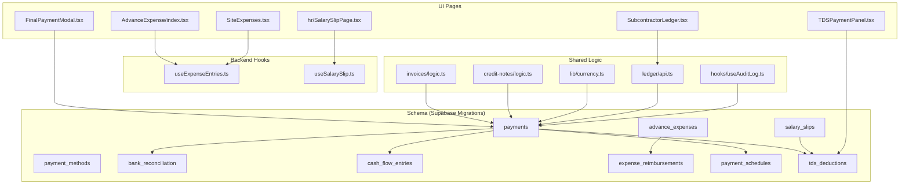

**Diagram sources**
- [supabase/migrations/20240101000000_create_payments.sql](file://supabase/migrations/20240101000000_create_payments.sql)
- [supabase/migrations/20240101000001_create_payment_methods.sql](file://supabase/migrations/20240101000001_create_payment_methods.sql)
- [supabase/migrations/20240101000002_create_bank_reconciliation.sql](file://supabase/migrations/20240101000002_create_bank_reconciliation.sql)
- [supabase/migrations/20240101000003_create_cash_flow_entries.sql](file://supabase/migrations/20240101000003_create_cash_flow_entries.sql)
- [supabase/migrations/20240101000004_create_advance_expenses.sql](file://supabase/migrations/20240101000004_create_advance_expenses.sql)
- [supabase/migrations/20240101000005_create_salary_slips.sql](file://supabase/migrations/20240101000005_create_salary_slips.sql)
- [supabase/migrations/20240101000006_create_expense_reimbursements.sql](file://supabase/migrations/20240101000006_create_expense_reimbursements.sql)
- [supabase/migrations/20240101000007_create_payment_schedules.sql](file://supabase/migrations/20240101000007_create_payment_schedules.sql)
- [supabase/migrations/20240101000008_create_tds_deductions.sql](file://supabase/migrations/20240101000008_create_tds_deductions.sql)
- [useExpenseEntries.ts](file://src/hooks/useExpenseEntries.ts)
- [AdvanceExpense/index.tsx](file://src/modules/AdvanceExpense/index.tsx)
- [SiteExpenses.tsx](file://src/pages/SiteExpenses.tsx)
- [SubcontractorLedger.tsx](file://src/components/SubcontractorLedger.tsx)
- [hooks/useSalarySlip.ts](file://src/hooks/useSalarySlip.ts)
- [pages/hr/SalarySlipPage.tsx](file://src/pages/hr/SalarySlipPage.tsx)
- [components/TDSPaymentPanel.tsx](file://src/components/TDSPaymentPanel.tsx)
- [components/FinalPaymentModal.tsx](file://src/components/FinalPaymentModal.tsx)
- [invoices/logic.ts](file://src/invoices/logic.ts)
- [credit-notes/logic.ts](file://src/credit-notes/logic.ts)
- [lib/currency.ts](file://src/lib/currency.ts)
- [ledger/api.ts](file://src/ledger/api.ts)
- [hooks/useAuditLog.ts](file://src/hooks/useAuditLog.ts)

**Section sources**
- [database-po-payment-terms.sql](file://src/database-po-payment-terms.sql)
- [database-purchase-payment-approval.sql](file://src/database-purchase-payment-approval.sql)
- [database-subcontractor-payment-approval.sql](file://src/database-subcontractor-payment-approval.sql)
- [useExpenseEntries.ts](file://src/hooks/useExpenseEntries.ts)
- [AdvanceExpense/index.tsx](file://src/modules/AdvanceExpense/index.tsx)
- [AdvanceExpense/api.ts](file://src/modules/AdvanceExpense/api.ts)
- [AdvanceExpense/types.ts](file://src/modules/AdvanceExpense/types.ts)
- [SiteExpenses.tsx](file://src/pages/SiteExpenses.tsx)
- [SubcontractorLedger.tsx](file://src/components/SubcontractorLedger.tsx)
- [ledger/LedgerDashboard.tsx](file://src/ledger/LedgerDashboard.tsx)
- [ledger/api.ts](file://src/ledger/api.ts)
- [hooks/useSalarySlip.ts](file://src/hooks/useSalarySlip.ts)
- [pages/hr/SalarySlipPage.tsx](file://src/pages/hr/SalarySlipPage.tsx)
- [components/TDSPaymentPanel.tsx](file://src/components/TDSPaymentPanel.tsx)
- [components/FinalPaymentModal.tsx](file://src/components/FinalPaymentModal.tsx)
- [invoices/logic.ts](file://src/invoices/logic.ts)
- [credit-notes/logic.ts](file://src/credit-notes/logic.ts)
- [lib/currency.ts](file://src/lib/currency.ts)
- [hooks/useAuditLog.ts](file://src/hooks/useAuditLog.ts)
- [database-add-audit-log.sql](file://src/database-add-audit-log.sql)

## Core Components
This section outlines the primary entities and their relationships that underpin payment processing and financial transactions.

- Payments
  - Represents outgoing or incoming monetary movements linked to invoices, POs, subcontractors, expenses, or salaries.
  - Supports multiple statuses (e.g., draft, approved, scheduled, paid, partially paid, cancelled).
  - Tracks amounts, currency, method, dates, references, and related documents.

- Payment Methods
  - Defines available channels such as bank transfer, cheque, UPI, cash, etc.
  - Includes metadata like account details, routing info, and provider-specific fields.

- Bank Reconciliation
  - Matches system payments against bank statements.
  - Captures statement lines, matched/unmatched status, and variance notes.

- Cash Flow Entries
  - Aggregates inflows/outflows by date, category, and source for reporting.
  - Used for cash flow statements and liquidity dashboards.

- Advance Expenses
  - Records employee or vendor advances, linking to later settlements or reimbursements.

- Salary Slips
  - Models per-period payroll components, deductions (including TDS), and net pay.

- Expense Reimbursements
  - Captures claims from employees, with approval and payout linkage.

- Payment Schedules
  - Breaks down large obligations into installments with due dates and partial payment tracking.

- TDS Deductions
  - Tracks tax deducted at source on applicable payments, with certificates and compliance fields.

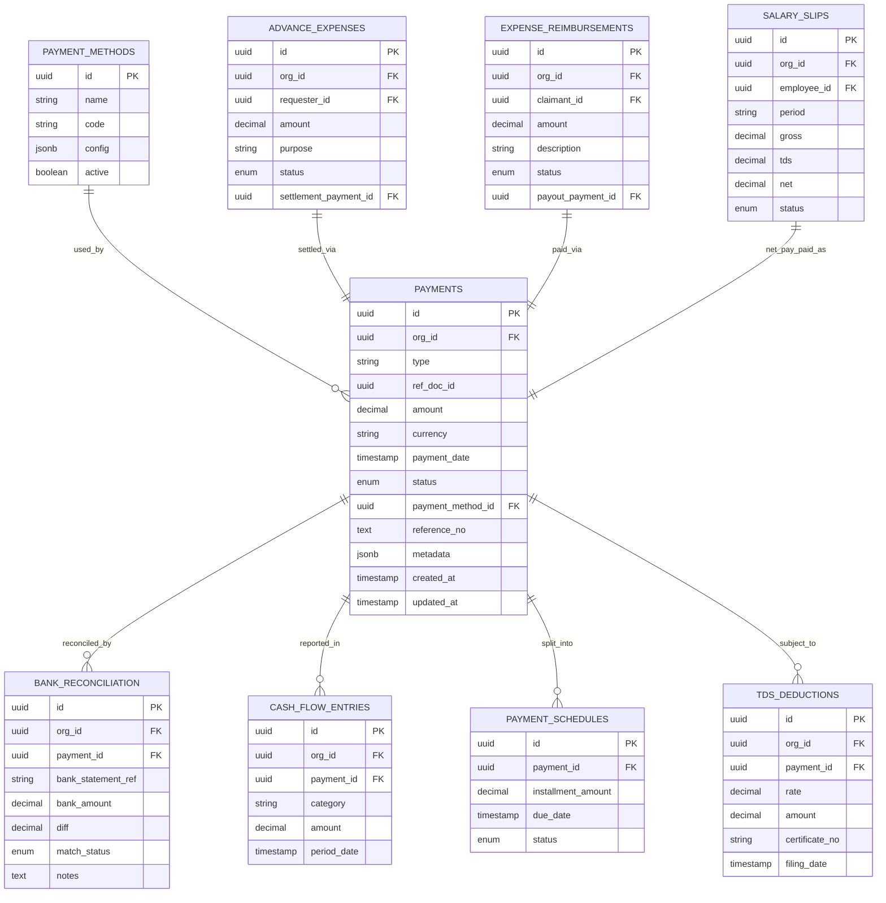

[No diagram sources since this ERD is conceptual and not tied to specific files]

**Section sources**
- [supabase/migrations/20240101000000_create_payments.sql](file://supabase/migrations/20240101000000_create_payments.sql)
- [supabase/migrations/20240101000001_create_payment_methods.sql](file://supabase/migrations/20240101000001_create_payment_methods.sql)
- [supabase/migrations/20240101000002_create_bank_reconciliation.sql](file://supabase/migrations/20240101000002_create_bank_reconciliation.sql)
- [supabase/migrations/20240101000003_create_cash_flow_entries.sql](file://supabase/migrations/20240101000003_create_cash_flow_entries.sql)
- [supabase/migrations/20240101000004_create_advance_expenses.sql](file://supabase/migrations/20240101000004_create_advance_expenses.sql)
- [supabase/migrations/20240101000005_create_salary_slips.sql](file://supabase/migrations/20240101000005_create_salary_slips.sql)
- [supabase/migrations/20240101000006_create_expense_reimbursements.sql](file://supabase/migrations/20240101000006_create_expense_reimbursements.sql)
- [supabase/migrations/20240101000007_create_payment_schedules.sql](file://supabase/migrations/20240101000007_create_payment_schedules.sql)
- [supabase/migrations/20240101000008_create_tds_deductions.sql](file://supabase/migrations/20240101000008_create_tds_deductions.sql)

## Architecture Overview
The payment architecture integrates user-facing modules with backend hooks and shared logic, backed by a normalized schema and audit trail.

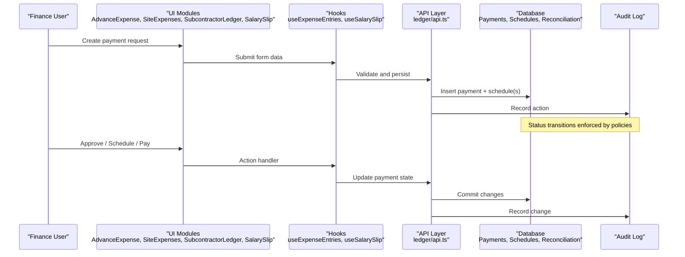

**Diagram sources**
- [AdvanceExpense/index.tsx](file://src/modules/AdvanceExpense/index.tsx)
- [SiteExpenses.tsx](file://src/pages/SiteExpenses.tsx)
- [SubcontractorLedger.tsx](file://src/components/SubcontractorLedger.tsx)
- [pages/hr/SalarySlipPage.tsx](file://src/pages/hr/SalarySlipPage.tsx)
- [useExpenseEntries.ts](file://src/hooks/useExpenseEntries.ts)
- [hooks/useSalarySlip.ts](file://src/hooks/useSalarySlip.ts)
- [ledger/api.ts](file://src/ledger/api.ts)
- [hooks/useAuditLog.ts](file://src/hooks/useAuditLog.ts)
- [database-add-audit-log.sql](file://src/database-add-audit-log.sql)

## Detailed Component Analysis

### Payment Tables and Methods
- Purpose: Model outgoing/incoming payments and define supported payment channels.
- Key attributes:
  - Payments: type, reference document, amount, currency, date, status, method, reference number, metadata.
  - Payment Methods: name, code, configuration, active flag.
- Relationships:
  - One-to-many from Payment Methods to Payments.
  - Payments link to schedules, reconciliation, cash flow entries, and TDS records.

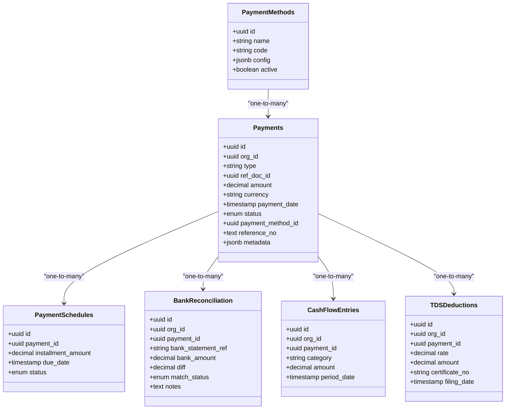

**Diagram sources**
- [supabase/migrations/20240101000000_create_payments.sql](file://supabase/migrations/20240101000000_create_payments.sql)
- [supabase/migrations/20240101000001_create_payment_methods.sql](file://supabase/migrations/20240101000001_create_payment_methods.sql)
- [supabase/migrations/20240101000002_create_bank_reconciliation.sql](file://supabase/migrations/20240101000002_create_bank_reconciliation.sql)
- [supabase/migrations/20240101000003_create_cash_flow_entries.sql](file://supabase/migrations/20240101000003_create_cash_flow_entries.sql)
- [supabase/migrations/20240101000007_create_payment_schedules.sql](file://supabase/migrations/20240101000007_create_payment_schedules.sql)
- [supabase/migrations/20240101000008_create_tds_deductions.sql](file://supabase/migrations/20240101000008_create_tds_deductions.sql)

**Section sources**
- [supabase/migrations/20240101000000_create_payments.sql](file://supabase/migrations/20240101000000_create_payments.sql)
- [supabase/migrations/20240101000001_create_payment_methods.sql](file://supabase/migrations/20240101000001_create_payment_methods.sql)
- [supabase/migrations/20240101000002_create_bank_reconciliation.sql](file://supabase/migrations/20240101000002_create_bank_reconciliation.sql)
- [supabase/migrations/20240101000003_create_cash_flow_entries.sql](file://supabase/migrations/20240101000003_create_cash_flow_entries.sql)
- [supabase/migrations/20240101000007_create_payment_schedules.sql](file://supabase/migrations/20240101000007_create_payment_schedules.sql)
- [supabase/migrations/20240101000008_create_tds_deductions.sql](file://supabase/migrations/20240101000008_create_tds_deductions.sql)

### Bank Reconciliation Workflow
- Purpose: Match system payments to bank statement lines and record variances.
- Process:
  - Import bank statement lines.
  - Auto-match by reference numbers or fuzzy rules.
  - Manual review for unmatched items.
  - Post adjustments and mark matches.

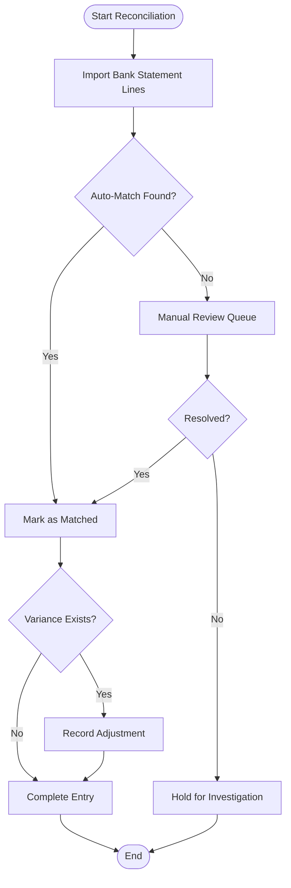

**Diagram sources**
- [supabase/migrations/20240101000002_create_bank_reconciliation.sql](file://supabase/migrations/20240101000002_create_bank_reconciliation.sql)
- [supabase/migrations/20240101000000_create_payments.sql](file://supabase/migrations/20240101000000_create_payments.sql)

**Section sources**
- [supabase/migrations/20240101000002_create_bank_reconciliation.sql](file://supabase/migrations/20240101000002_create_bank_reconciliation.sql)
- [supabase/migrations/20240101000000_create_payments.sql](file://supabase/migrations/20240101000000_create_payments.sql)

### Cash Flow Tracking
- Purpose: Aggregate inflows/outflows by period and category for reporting.
- Data points:
  - Period date, category, amount, and associated payment.
- Reporting:
  - Monthly/quarterly cash flow statements.
  - Liquidity dashboards and forecasts.

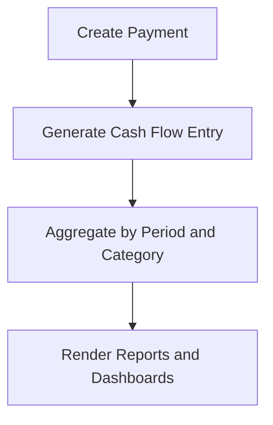

**Diagram sources**
- [supabase/migrations/20240101000003_create_cash_flow_entries.sql](file://supabase/migrations/20240101000003_create_cash_flow_entries.sql)
- [supabase/migrations/20240101000000_create_payments.sql](file://supabase/migrations/20240101000000_create_payments.sql)

**Section sources**
- [supabase/migrations/20240101000003_create_cash_flow_entries.sql](file://supabase/migrations/20240101000003_create_cash_flow_entries.sql)
- [supabase/migrations/20240101000000_create_payments.sql](file://supabase/migrations/20240101000000_create_payments.sql)

### Salary Processing and TDS
- Purpose: Generate salary slips, compute deductions (including TDS), and pay net amounts.
- Components:
  - Salary Slip entity with gross, deductions, and net pay.
  - TDS Deductions linked to payments for compliance.
- UI and hooks:
  - Salary slip page and hook orchestrate calculations and persistence.
  - TDS panel manages rates, certificates, and filings.

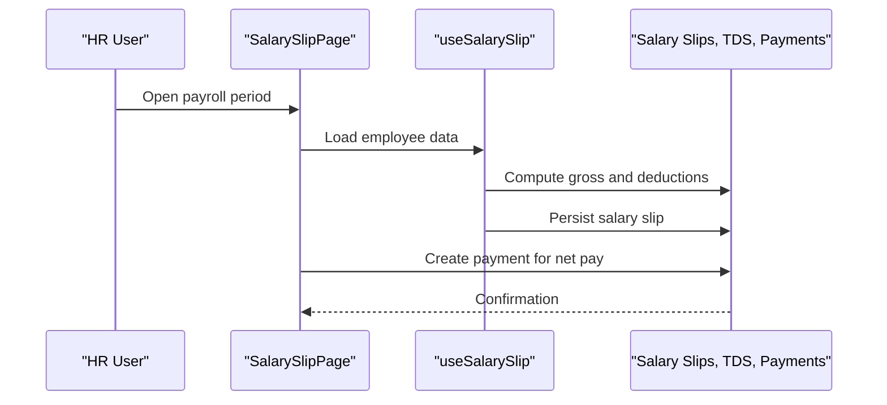

**Diagram sources**
- [pages/hr/SalarySlipPage.tsx](file://src/pages/hr/SalarySlipPage.tsx)
- [hooks/useSalarySlip.ts](file://src/hooks/useSalarySlip.ts)
- [components/TDSPaymentPanel.tsx](file://src/components/TDSPaymentPanel.tsx)
- [supabase/migrations/20240101000005_create_salary_slips.sql](file://supabase/migrations/20240101000005_create_salary_slips.sql)
- [supabase/migrations/20240101000008_create_tds_deductions.sql](file://supabase/migrations/20240101000008_create_tds_deductions.sql)
- [supabase/migrations/20240101000000_create_payments.sql](file://supabase/migrations/20240101000000_create_payments.sql)

**Section sources**
- [pages/hr/SalarySlipPage.tsx](file://src/pages/hr/SalarySlipPage.tsx)
- [hooks/useSalarySlip.ts](file://src/hooks/useSalarySlip.ts)
- [components/TDSPaymentPanel.tsx](file://src/components/TDSPaymentPanel.tsx)
- [supabase/migrations/20240101000005_create_salary_slips.sql](file://supabase/migrations/20240101000005_create_salary_slips.sql)
- [supabase/migrations/20240101000008_create_tds_deductions.sql](file://supabase/migrations/20240101000008_create_tds_deductions.sql)
- [supabase/migrations/20240101000000_create_payments.sql](file://supabase/migrations/20240101000000_create_payments.sql)

### Advance Expenses and Expense Reimbursements
- Purpose: Capture upfront advances and subsequent reimbursements/settlements.
- Workflows:
  - Employee submits advance request; upon approval, a payment is issued.
  - Later, expense claims are raised and reimbursed via payment.
  - Settlement links tie advances to final payouts.

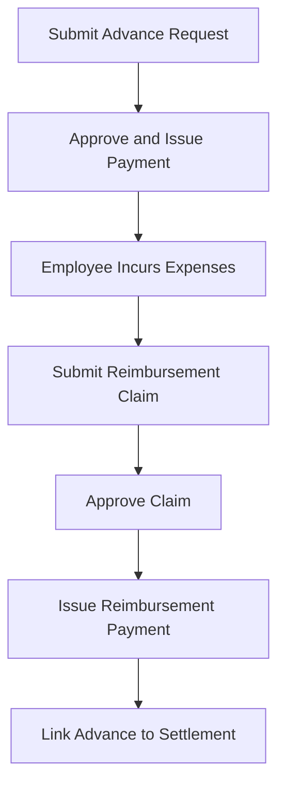

**Diagram sources**
- [modules/AdvanceExpense/index.tsx](file://src/modules/AdvanceExpense/index.tsx)
- [modules/AdvanceExpense/api.ts](file://src/modules/AdvanceExpense/api.ts)
- [modules/AdvanceExpense/types.ts](file://src/modules/AdvanceExpense/types.ts)
- [pages/SiteExpenses.tsx](file://src/pages/SiteExpenses.tsx)
- [hooks/useExpenseEntries.ts](file://src/hooks/useExpenseEntries.ts)
- [supabase/migrations/20240101000004_create_advance_expenses.sql](file://supabase/migrations/20240101000004_create_advance_expenses.sql)
- [supabase/migrations/20240101000006_create_expense_reimbursements.sql](file://supabase/migrations/20240101000006_create_expense_reimbursements.sql)
- [supabase/migrations/20240101000000_create_payments.sql](file://supabase/migrations/20240101000000_create_payments.sql)

**Section sources**
- [modules/AdvanceExpense/index.tsx](file://src/modules/AdvanceExpense/index.tsx)
- [modules/AdvanceExpense/api.ts](file://src/modules/AdvanceExpense/api.ts)
- [modules/AdvanceExpense/types.ts](file://src/modules/AdvanceExpense/types.ts)
- [pages/SiteExpenses.tsx](file://src/pages/SiteExpenses.tsx)
- [hooks/useExpenseEntries.ts](file://src/hooks/useExpenseEntries.ts)
- [supabase/migrations/20240101000004_create_advance_expenses.sql](file://supabase/migrations/20240101000004_create_advance_expenses.sql)
- [supabase/migrations/20240101000006_create_expense_reimbursements.sql](file://supabase/migrations/20240101000006_create_expense_reimbursements.sql)
- [supabase/migrations/20240101000000_create_payments.sql](file://supabase/migrations/20240101000000_create_payments.sql)

### Subcontractor Ledger and Final Payment
- Purpose: Track subcontractor liabilities and finalize payments after retention release and adjustments.
- Features:
  - Consolidated view of dues, advances, and payments.
  - Final payment modal enforces validations and creates settlement payment.

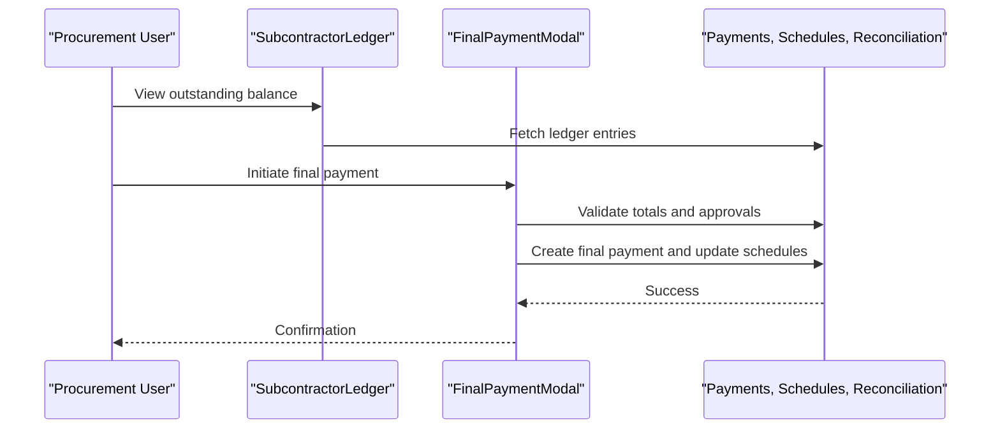

**Diagram sources**
- [components/SubcontractorLedger.tsx](file://src/components/SubcontractorLedger.tsx)
- [components/FinalPaymentModal.tsx](file://src/components/FinalPaymentModal.tsx)
- [supabase/migrations/20240101000000_create_payments.sql](file://supabase/migrations/20240101000000_create_payments.sql)
- [supabase/migrations/20240101000007_create_payment_schedules.sql](file://supabase/migrations/20240101000007_create_payment_schedules.sql)
- [supabase/migrations/20240101000002_create_bank_reconciliation.sql](file://supabase/migrations/20240101000002_create_bank_reconciliation.sql)

**Section sources**
- [components/SubcontractorLedger.tsx](file://src/components/SubcontractorLedger.tsx)
- [components/FinalPaymentModal.tsx](file://src/components/FinalPaymentModal.tsx)
- [supabase/migrations/20240101000000_create_payments.sql](file://supabase/migrations/20240101000000_create_payments.sql)
- [supabase/migrations/20240101000007_create_payment_schedules.sql](file://supabase/migrations/20240101000007_create_payment_schedules.sql)
- [supabase/migrations/20240101000002_create_bank_reconciliation.sql](file://supabase/migrations/20240101000002_create_bank_reconciliation.sql)

### Payment Approvals, Partial Payments, and Scheduling
- Approvals:
  - Purchase order and subcontractor payment approvals enforce policy-based checks before payment creation.
- Partial Payments:
  - Payment schedules track installments; each installment can be paid independently.
- Scheduling:
  - Future-dated payments are queued and processed on due dates.

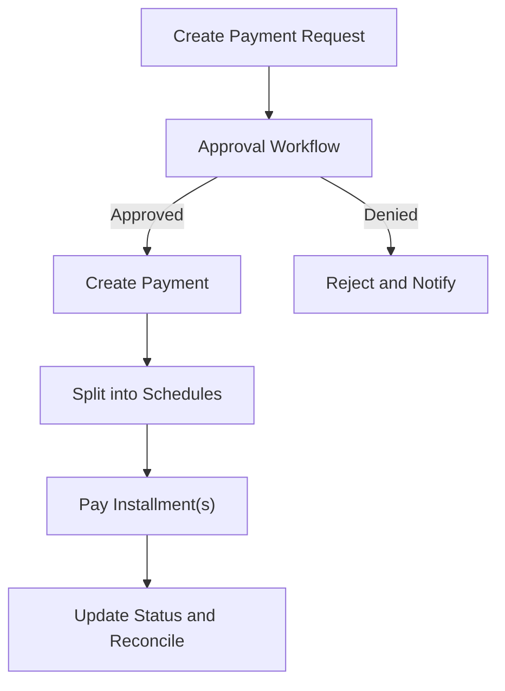

**Diagram sources**
- [database-purchase-payment-approval.sql](file://src/database-purchase-payment-approval.sql)
- [database-subcontractor-payment-approval.sql](file://src/database-subcontractor-payment-approval.sql)
- [supabase/migrations/20240101000007_create_payment_schedules.sql](file://supabase/migrations/20240101000007_create_payment_schedules.sql)
- [supabase/migrations/20240101000000_create_payments.sql](file://supabase/migrations/20240101000000_create_payments.sql)

**Section sources**
- [database-purchase-payment-approval.sql](file://src/database-purchase-payment-approval.sql)
- [database-subcontractor-payment-approval.sql](file://src/database-subcontractor-payment-approval.sql)
- [supabase/migrations/20240101000007_create_payment_schedules.sql](file://supabase/migrations/20240101000007_create_payment_schedules.sql)
- [supabase/migrations/20240101000000_create_payments.sql](file://supabase/migrations/20240101000000_create_payments.sql)

### Invoicing and Credit Notes Integration
- Purpose: Link payments to invoices and credit notes for accurate accounting.
- Logic:
  - Invoice logic computes outstanding balances and suggests payments.
  - Credit note logic adjusts receivables and influences future payments.

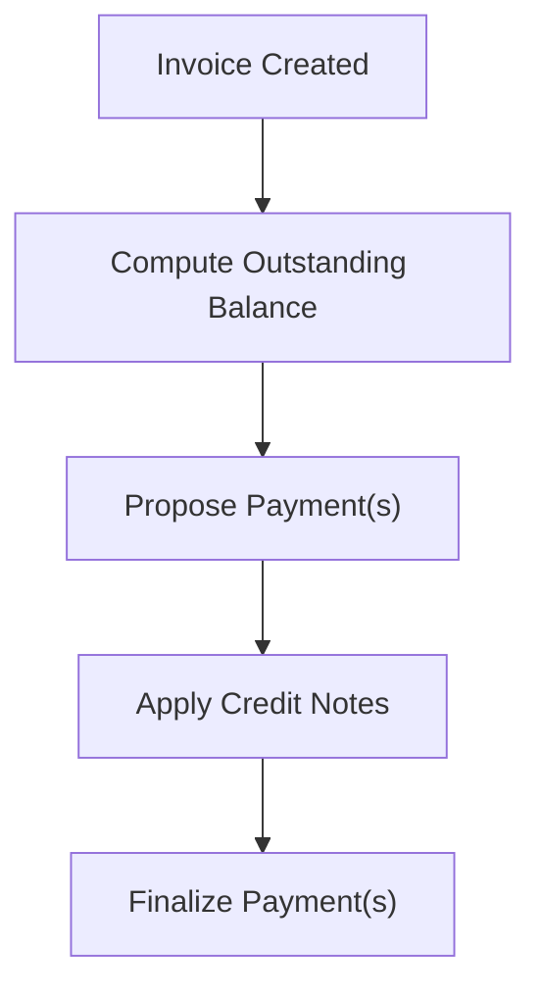

**Diagram sources**
- [invoices/logic.ts](file://src/invoices/logic.ts)
- [credit-notes/logic.ts](file://src/credit-notes/logic.ts)
- [supabase/migrations/20240101000000_create_payments.sql](file://supabase/migrations/20240101000000_create_payments.sql)

**Section sources**
- [invoices/logic.ts](file://src/invoices/logic.ts)
- [credit-notes/logic.ts](file://src/credit-notes/logic.ts)
- [supabase/migrations/20240101000000_create_payments.sql](file://supabase/migrations/20240101000000_create_payments.sql)

## Dependency Analysis
Key dependencies between modules and data layers:
- UI modules depend on hooks for data operations.
- Hooks call API layer functions which interact with database schemas.
- Shared logic (currency, invoice/credit-note computations) supports consistent financial calculations.
- Audit log captures critical actions across the payment lifecycle.

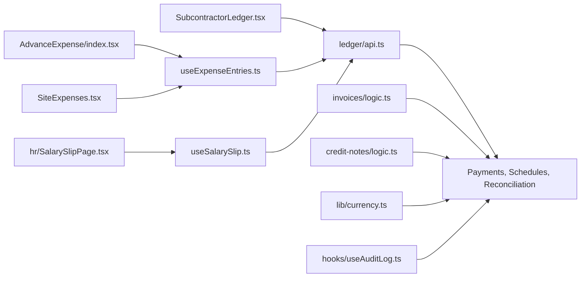

**Diagram sources**
- [AdvanceExpense/index.tsx](file://src/modules/AdvanceExpense/index.tsx)
- [SiteExpenses.tsx](file://src/pages/SiteExpenses.tsx)
- [SubcontractorLedger.tsx](file://src/components/SubcontractorLedger.tsx)
- [pages/hr/SalarySlipPage.tsx](file://src/pages/hr/SalarySlipPage.tsx)
- [useExpenseEntries.ts](file://src/hooks/useExpenseEntries.ts)
- [hooks/useSalarySlip.ts](file://src/hooks/useSalarySlip.ts)
- [ledger/api.ts](file://src/ledger/api.ts)
- [invoices/logic.ts](file://src/invoices/logic.ts)
- [credit-notes/logic.ts](file://src/credit-notes/logic.ts)
- [lib/currency.ts](file://src/lib/currency.ts)
- [hooks/useAuditLog.ts](file://src/hooks/useAuditLog.ts)
- [supabase/migrations/20240101000000_create_payments.sql](file://supabase/migrations/20240101000000_create_payments.sql)

**Section sources**
- [AdvanceExpense/index.tsx](file://src/modules/AdvanceExpense/index.tsx)
- [SiteExpenses.tsx](file://src/pages/SiteExpenses.tsx)
- [SubcontractorLedger.tsx](file://src/components/SubcontractorLedger.tsx)
- [pages/hr/SalarySlipPage.tsx](file://src/pages/hr/SalarySlipPage.tsx)
- [useExpenseEntries.ts](file://src/hooks/useExpenseEntries.ts)
- [hooks/useSalarySlip.ts](file://src/hooks/useSalarySlip.ts)
- [ledger/api.ts](file://src/ledger/api.ts)
- [invoices/logic.ts](file://src/invoices/logic.ts)
- [credit-notes/logic.ts](file://src/credit-notes/logic.ts)
- [lib/currency.ts](file://src/lib/currency.ts)
- [hooks/useAuditLog.ts](file://src/hooks/useAuditLog.ts)
- [supabase/migrations/20240101000000_create_payments.sql](file://supabase/migrations/20240101000000_create_payments.sql)

## Performance Considerations
- Indexing: Ensure indexes on frequently filtered columns such as org_id, payment_date, status, and reference_no.
- Pagination: Use server-side pagination for large payment lists and reconciliation queues.
- Batch Operations: For bulk import of bank statements, process in batches to avoid long-running transactions.
- Computation Offloading: Move heavy calculations (e.g., cash flow aggregation) to background jobs where possible.
- Denormalization: Consider materialized views for periodic cash flow summaries to speed up reporting.

[No sources needed since this section provides general guidance]

## Troubleshooting Guide
Common issues and resolutions:
- Unmatched Reconciliations:
  - Verify reference numbers and fuzzy matching rules.
  - Check for duplicate or split bank entries.
- Partial Payment Mismatches:
  - Confirm schedule statuses and cumulative paid amounts.
  - Ensure rounding and currency conversions are applied consistently.
- Approval Failures:
  - Validate policy conditions and required approvers.
  - Inspect audit logs for denied actions and reasons.
- TDS Compliance Errors:
  - Cross-check rates and certificate numbers against regulatory requirements.
  - Ensure filing dates are recorded and visible in reports.

Operational aids:
- Audit Trail:
  - Use audit logs to trace payment lifecycle events and user actions.
- Ledger Dashboard:
  - Leverage dashboard APIs to inspect aggregated balances and anomalies.

**Section sources**
- [hooks/useAuditLog.ts](file://src/hooks/useAuditLog.ts)
- [database-add-audit-log.sql](file://src/database-add-audit-log.sql)
- [ledger/LedgerDashboard.tsx](file://src/ledger/LedgerDashboard.tsx)
- [ledger/api.ts](file://src/ledger/api.ts)

## Conclusion
The payment and financial transaction subsystem combines robust data modeling with clear workflows for approvals, scheduling, partial payments, and reconciliation. Salary processing and TDS handling ensure compliance, while cash flow entries support liquidity management. Strong audit trails and security controls provide transparency and accountability. By following the documented patterns and leveraging the provided examples, teams can implement reliable payment processes and generate accurate financial reports.

[No sources needed since this section summarizes without analyzing specific files]

## Appendices

### Example Queries
- Payments by Date Range and Status
  - Filter payments by organization, date range, and status; join payment methods for display.
- Cash Flow Report by Month
  - Aggregate cash flow entries by period and category; sum amounts for inflows/outflows.
- Bank Reconciliation Summary
  - List unmatched reconciliation entries with variance and notes for manual review.
- Subcontractor Outstanding Balance
  - Sum unpaid schedules and subtract settled payments to compute outstanding amounts.
- TDS Liability by Period
  - Sum TDS deductions per period and compare with filed certificates.

[No sources needed since these are example query descriptions]

### Security Considerations
- Role-Based Access Control: Restrict payment creation, approval, and reconciliation to authorized roles.
- Row-Level Security: Enforce org-scoped access to prevent cross-organization data leakage.
- Audit Logging: Record all mutations and approvals with timestamps and actor identities.
- Data Validation: Apply strict validation on amounts, currencies, and reference numbers.
- Secure Integrations: Store banking credentials securely and use encrypted connections for external APIs.

**Section sources**
- [hooks/useAuditLog.ts](file://src/hooks/useAuditLog.ts)
- [database-add-audit-log.sql](file://src/database-add-audit-log.sql)

### Banking System Integration
- Bank Statement Import:
  - Accept CSV/OFX formats; map fields to reconciliation entries.
- Payment Execution:
  - Integrate with bank APIs or payment gateways; store execution results and receipts.
- Callback Handling:
  - Process webhook notifications for payment confirmations and failures.
- Error Handling:
  - Retry failed executions and alert finance operators.

[No sources needed since this section provides general guidance]