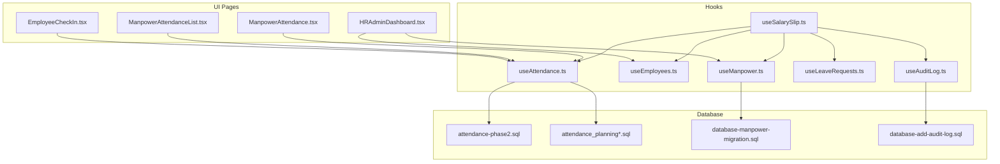
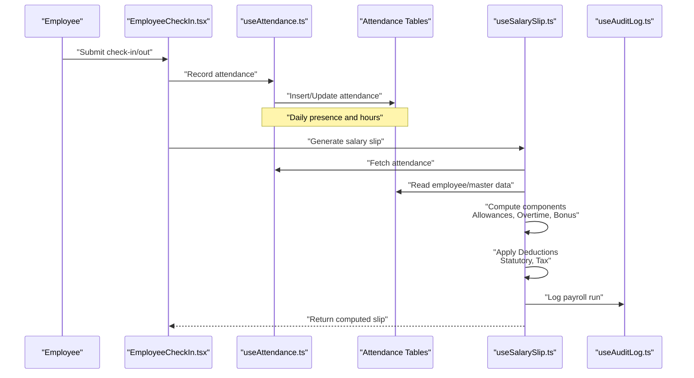
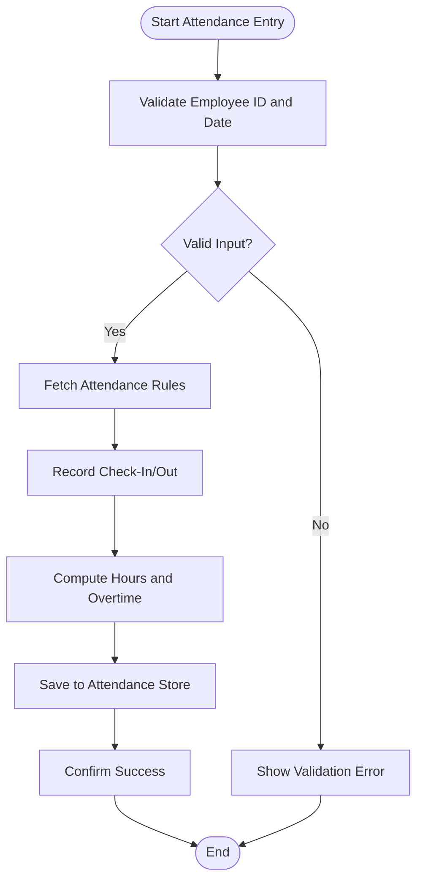
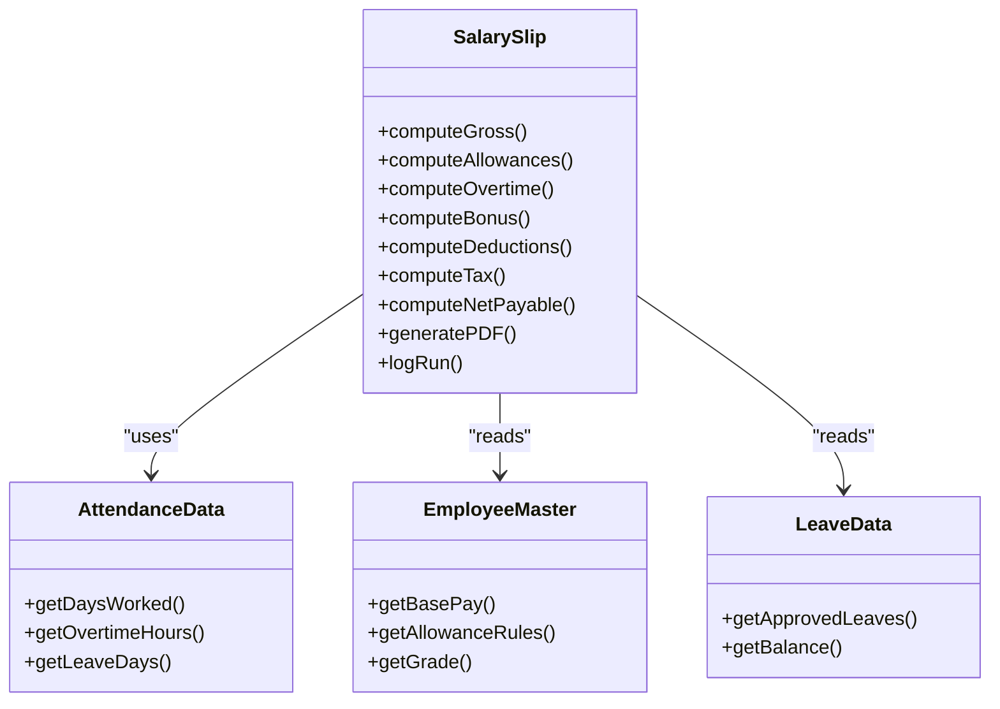
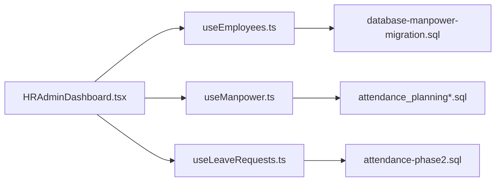
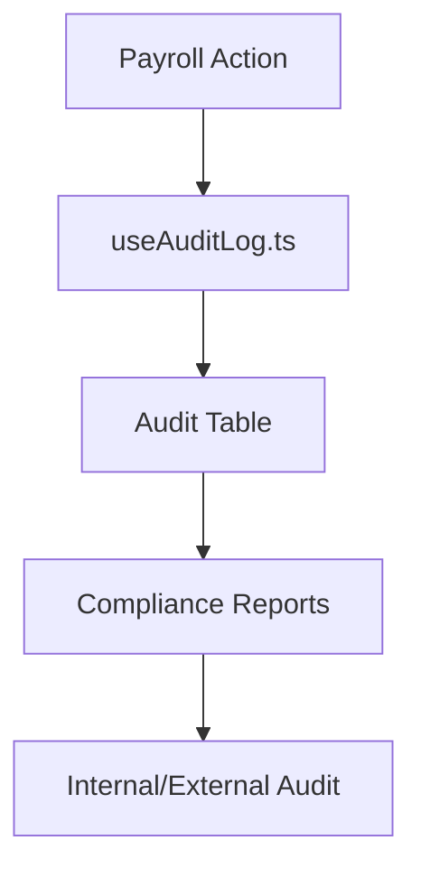
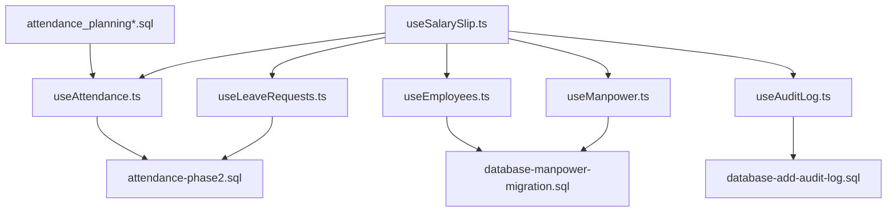

# Payroll Processing & Salary Management

<cite>
**Referenced Files in This Document**
- [useSalarySlip.ts](file://src/hooks/useSalarySlip.ts)
- [EmployeeCheckIn.tsx](file://src/pages/EmployeeCheckIn.tsx)
- [ManpowerAttendance.tsx](file://src/pages/ManpowerAttendance.tsx)
- [ManpowerAttendanceList.tsx](file://src/pages/ManpowerAttendanceList.tsx)
- [useAttendance.ts](file://src/hooks/useAttendance.ts)
- [useManpower.ts](file://src/hooks/useManpower.ts)
- [database-manpower-migration.sql](file://src/database-manpower-migration.sql)
- [attendance-phase2.sql](file://sql/attendance-phase2.sql)
- [attendance_planning.sql](file://sql/attendance_planning.sql)
- [attendance_planning_v2.sql](file://sql/attendance_planning_v2.sql)
- [HRAdminDashboard.tsx](file://src/pages/HRAdminDashboard.tsx)
- [useEmployees.ts](file://src/hooks/useEmployees.ts)
- [useLeaveRequests.ts](file://src/hooks/useLeaveRequests.ts)
- [useAuditLog.ts](file://src/hooks/useAuditLog.ts)
- [database-add-audit-log.sql](file://src/database-add-audit-log.sql)
</cite>

## Table of Contents
1. [Introduction](#introduction)
2. [Project Structure](#project-structure)
3. [Core Components](#core-components)
4. [Architecture Overview](#architecture-overview)
5. [Detailed Component Analysis](#detailed-component-analysis)
6. [Dependency Analysis](#dependency-analysis)
7. [Performance Considerations](#performance-considerations)
8. [Troubleshooting Guide](#troubleshooting-guide)
9. [Conclusion](#conclusion)
10. [Appendices](#appendices)

## Introduction
This document explains payroll processing and salary slip management as implemented in the project. It covers how attendance data is captured, how salary components are configured and calculated, statutory deductions and tax computations, bonus logic, bulk payroll processing, year-end reporting, compliance and audit trails, and integration points for bank disbursement. The goal is to make the system understandable to both technical and non-technical readers while providing concrete references to source files.

## Project Structure
Payroll-related functionality spans UI pages, hooks, SQL migrations, and database schemas:
- Attendance capture and planning: pages and hooks for check-in/out and attendance records
- Salary slip generation: hook-based logic to compute per-employee earnings and deductions
- HR administration: dashboards and employee management utilities
- Audit logging: tables and hooks to record changes and actions

**Diagram sources**
- [EmployeeCheckIn.tsx](file://src/pages/EmployeeCheckIn.tsx)
- [ManpowerAttendanceList.tsx](file://src/pages/ManpowerAttendanceList.tsx)
- [ManpowerAttendance.tsx](file://src/pages/ManpowerAttendance.tsx)
- [useAttendance.ts](file://src/hooks/useAttendance.ts)
- [useEmployees.ts](file://src/hooks/useEmployees.ts)
- [useManpower.ts](file://src/hooks/useManpower.ts)
- [useSalarySlip.ts](file://src/hooks/useSalarySlip.ts)
- [useLeaveRequests.ts](file://src/hooks/useLeaveRequests.ts)
- [useAuditLog.ts](file://src/hooks/useAuditLog.ts)
- [attendance-phase2.sql](file://sql/attendance-phase2.sql)
- [attendance_planning.sql](file://sql/attendance_planning.sql)
- [attendance_planning_v2.sql](file://sql/attendance_planning_v2.sql)
- [database-manpower-migration.sql](file://src/database-manpower-migration.sql)
- [database-add-audit-log.sql](file://src/database-add-audit-log.sql)

**Section sources**
- [EmployeeCheckIn.tsx](file://src/pages/EmployeeCheckIn.tsx)
- [ManpowerAttendanceList.tsx](file://src/pages/ManpowerAttendanceList.tsx)
- [ManpowerAttendance.tsx](file://src/pages/ManpowerAttendance.tsx)
- [useAttendance.ts](file://src/hooks/useAttendance.ts)
- [useEmployees.ts](file://src/hooks/useEmployees.ts)
- [useManpower.ts](file://src/hooks/useManpower.ts)
- [useSalarySlip.ts](file://src/hooks/useSalarySlip.ts)
- [useLeaveRequests.ts](file://src/hooks/useLeaveRequests.ts)
- [useAuditLog.ts](file://src/hooks/useAuditLog.ts)
- [attendance-phase2.sql](file://sql/attendance-phase2.sql)
- [attendance_planning.sql](file://sql/attendance_planning.sql)
- [attendance_planning_v2.sql](file://sql/attendance_planning_v2.sql)
- [database-manpower-migration.sql](file://src/database-manpower-migration.sql)
- [database-add-audit-log.sql](file://src/database-add-audit-log.sql)

## Core Components
- Attendance Capture and Planning
  - Employee check-in/out flows and daily attendance records
  - Attendance planning and scheduling for workforce allocation
- Salary Slip Generation
  - Per-employee computation of gross earnings, allowances, bonuses, and deductions
  - Statutory deductions and tax calculations based on configured rules
- HR Administration
  - Employee master data and leave management
  - Manpower planning and utilization tracking
- Audit and Compliance
  - Change logs and action trails for payroll runs and adjustments
  - Reporting hooks for year-end summaries and statutory filings

Key implementation anchors:
- Attendance hooks and pages for capturing time and presence
- Salary slip hook orchestrating calculation inputs and outputs
- Database migrations defining attendance, manpower, and audit structures

**Section sources**
- [useAttendance.ts](file://src/hooks/useAttendance.ts)
- [EmployeeCheckIn.tsx](file://src/pages/EmployeeCheckIn.tsx)
- [ManpowerAttendance.tsx](file://src/pages/ManpowerAttendance.tsx)
- [ManpowerAttendanceList.tsx](file://src/pages/ManpowerAttendanceList.tsx)
- [useSalarySlip.ts](file://src/hooks/useSalarySlip.ts)
- [useEmployees.ts](file://src/hooks/useEmployees.ts)
- [useManpower.ts](file://src/hooks/useManpower.ts)
- [useLeaveRequests.ts](file://src/hooks/useLeaveRequests.ts)
- [useAuditLog.ts](file://src/hooks/useAuditLog.ts)
- [attendance-phase2.sql](file://sql/attendance-phase2.sql)
- [attendance_planning.sql](file://sql/attendance_planning.sql)
- [attendance_planning_v2.sql](file://sql/attendance_planning_v2.sql)
- [database-manpower-migration.sql](file://src/database-manpower-migration.sql)
- [database-add-audit-log.sql](file://src/database-add-audit-log.sql)

## Architecture Overview
The payroll architecture integrates attendance data with salary computation and output generation. UI pages collect attendance; hooks orchestrate data retrieval and business logic; SQL migrations define persistent structures; audit logs ensure traceability.

**Diagram sources**
- [EmployeeCheckIn.tsx](file://src/pages/EmployeeCheckIn.tsx)
- [useAttendance.ts](file://src/hooks/useAttendance.ts)
- [useSalarySlip.ts](file://src/hooks/useSalarySlip.ts)
- [useAuditLog.ts](file://src/hooks/useAuditLog.ts)
- [attendance-phase2.sql](file://sql/attendance-phase2.sql)

## Detailed Component Analysis

### Attendance Capture and Planning
- Purpose: Record employee presence, working hours, leaves, and planned shifts to feed payroll calculations.
- Key files:
  - Employee check-in page and attendance list/planning views
  - Attendance hook for CRUD operations and queries
  - SQL migrations for attendance schema and planning enhancements

**Diagram sources**
- [EmployeeCheckIn.tsx](file://src/pages/EmployeeCheckIn.tsx)
- [ManpowerAttendanceList.tsx](file://src/pages/ManpowerAttendanceList.tsx)
- [ManpowerAttendance.tsx](file://src/pages/ManpowerAttendance.tsx)
- [useAttendance.ts](file://src/hooks/useAttendance.ts)
- [attendance-phase2.sql](file://sql/attendance-phase2.sql)
- [attendance_planning.sql](file://sql/attendance_planning.sql)
- [attendance_planning_v2.sql](file://sql/attendance_planning_v2.sql)

**Section sources**
- [EmployeeCheckIn.tsx](file://src/pages/EmployeeCheckIn.tsx)
- [ManpowerAttendanceList.tsx](file://src/pages/ManpowerAttendanceList.tsx)
- [ManpowerAttendance.tsx](file://src/pages/ManpowerAttendance.tsx)
- [useAttendance.ts](file://src/hooks/useAttendance.ts)
- [attendance-phase2.sql](file://sql/attendance-phase2.sql)
- [attendance_planning.sql](file://sql/attendance_planning.sql)
- [attendance_planning_v2.sql](file://sql/attendance_planning_v2.sql)

### Salary Slip Generation
- Purpose: Compute per-employee salary slips by combining base pay, allowances, overtime, bonuses, and deductions (statutory and tax).
- Inputs:
  - Attendance records (days worked, overtime, leaves)
  - Employee master data (pay structure, grade, department)
  - Leave balances and approvals
- Outputs:
  - Earnings summary, deductions summary, net payable
  - Audit trail entry for the payroll run

**Diagram sources**
- [useSalarySlip.ts](file://src/hooks/useSalarySlip.ts)
- [useAttendance.ts](file://src/hooks/useAttendance.ts)
- [useEmployees.ts](file://src/hooks/useEmployees.ts)
- [useLeaveRequests.ts](file://src/hooks/useLeaveRequests.ts)

**Section sources**
- [useSalarySlip.ts](file://src/hooks/useSalarySlip.ts)
- [useAttendance.ts](file://src/hooks/useAttendance.ts)
- [useEmployees.ts](file://src/hooks/useEmployees.ts)
- [useLeaveRequests.ts](file://src/hooks/useLeaveRequests.ts)

### HR Administration and Manpower Planning
- Purpose: Manage employee records, manpower allocation, and leave requests that influence payroll outcomes.
- Key files:
  - HR dashboard and employee hooks
  - Manpower hooks for planning and utilization
  - Leave request hooks for approval workflows

**Diagram sources**
- [HRAdminDashboard.tsx](file://src/pages/HRAdminDashboard.tsx)
- [useEmployees.ts](file://src/hooks/useEmployees.ts)
- [useManpower.ts](file://src/hooks/useManpower.ts)
- [useLeaveRequests.ts](file://src/hooks/useLeaveRequests.ts)
- [database-manpower-migration.sql](file://src/database-manpower-migration.sql)
- [attendance_planning.sql](file://sql/attendance_planning.sql)
- [attendance_planning_v2.sql](file://sql/attendance_planning_v2.sql)
- [attendance-phase2.sql](file://sql/attendance-phase2.sql)

**Section sources**
- [HRAdminDashboard.tsx](file://src/pages/HRAdminDashboard.tsx)
- [useEmployees.ts](file://src/hooks/useEmployees.ts)
- [useManpower.ts](file://src/hooks/useManpower.ts)
- [useLeaveRequests.ts](file://src/hooks/useLeaveRequests.ts)
- [database-manpower-migration.sql](file://src/database-manpower-migration.sql)
- [attendance_planning.sql](file://sql/attendance_planning.sql)
- [attendance_planning_v2.sql](file://sql/attendance_planning_v2.sql)
- [attendance-phase2.sql](file://sql/attendance-phase2.sql)

### Audit Trails and Compliance
- Purpose: Ensure every payroll action is logged for compliance, reconciliation, and audits.
- Key files:
  - Audit log hook and migration
  - Integration points within salary slip generation and attendance updates

**Diagram sources**
- [useAuditLog.ts](file://src/hooks/useAuditLog.ts)
- [database-add-audit-log.sql](file://src/database-add-audit-log.sql)
- [useSalarySlip.ts](file://src/hooks/useSalarySlip.ts)

**Section sources**
- [useAuditLog.ts](file://src/hooks/useAuditLog.ts)
- [database-add-audit-log.sql](file://src/database-add-audit-log.sql)
- [useSalarySlip.ts](file://src/hooks/useSalarySlip.ts)

## Dependency Analysis
Payroll depends on attendance data, employee master, leave approvals, and audit logging. The following diagram shows core dependencies among hooks and database layers.

**Diagram sources**
- [useAttendance.ts](file://src/hooks/useAttendance.ts)
- [useEmployees.ts](file://src/hooks/useEmployees.ts)
- [useManpower.ts](file://src/hooks/useManpower.ts)
- [useSalarySlip.ts](file://src/hooks/useSalarySlip.ts)
- [useLeaveRequests.ts](file://src/hooks/useLeaveRequests.ts)
- [useAuditLog.ts](file://src/hooks/useAuditLog.ts)
- [attendance-phase2.sql](file://sql/attendance-phase2.sql)
- [attendance_planning.sql](file://sql/attendance_planning.sql)
- [attendance_planning_v2.sql](file://sql/attendance_planning_v2.sql)
- [database-manpower-migration.sql](file://src/database-manpower-migration.sql)
- [database-add-audit-log.sql](file://src/database-add-audit-log.sql)

**Section sources**
- [useAttendance.ts](file://src/hooks/useAttendance.ts)
- [useEmployees.ts](file://src/hooks/useEmployees.ts)
- [useManpower.ts](file://src/hooks/useManpower.ts)
- [useSalarySlip.ts](file://src/hooks/useSalarySlip.ts)
- [useLeaveRequests.ts](file://src/hooks/useLeaveRequests.ts)
- [useAuditLog.ts](file://src/hooks/useAuditLog.ts)
- [attendance-phase2.sql](file://sql/attendance-phase2.sql)
- [attendance_planning.sql](file://sql/attendance_planning.sql)
- [attendance_planning_v2.sql](file://sql/attendance_planning_v2.sql)
- [database-manpower-migration.sql](file://src/database-manpower-migration.sql)
- [database-add-audit-log.sql](file://src/database-add-audit-log.sql)

## Performance Considerations
- Batch attendance imports: Prefer bulk inserts for large datasets to reduce round-trips.
- Caching employee master data: Cache static or infrequently changing data to speed up payroll runs.
- Incremental calculations: Recompute only affected employees when partial updates occur.
- Indexing: Ensure indexes on attendance dates, employee IDs, and payroll periods.
- Asynchronous processing: Offload heavy computations and PDF generation to background tasks.

[No sources needed since this section provides general guidance]

## Troubleshooting Guide
Common issues and resolutions:
- Missing attendance records: Verify check-in/out entries and date ranges; reconcile with attendance lists.
- Incorrect overtime computation: Review attendance rules and thresholds; validate hour calculations.
- Deduction mismatches: Cross-check statutory rates and tax slabs against configuration.
- Audit gaps: Ensure audit logging is enabled and triggered during payroll runs.

Operational checks:
- Validate employee master data completeness (base pay, allowances, grades).
- Confirm leave approvals are reflected in attendance and leave balances.
- Re-run payroll for a sample set to verify consistency before full rollout.

**Section sources**
- [useAttendance.ts](file://src/hooks/useAttendance.ts)
- [useSalarySlip.ts](file://src/hooks/useSalarySlip.ts)
- [useEmployees.ts](file://src/hooks/useEmployees.ts)
- [useLeaveRequests.ts](file://src/hooks/useLeaveRequests.ts)
- [useAuditLog.ts](file://src/hooks/useAuditLog.ts)

## Conclusion
The payroll system integrates attendance capture, salary computation, and audit logging to deliver accurate and compliant salary slips. By leveraging structured hooks and well-defined database schemas, it supports scalable payroll processing, robust reporting, and reliable disbursement preparation. Continuous validation and performance tuning will ensure accuracy and efficiency across monthly and year-end cycles.

[No sources needed since this section summarizes without analyzing specific files]

## Appendices

### Salary Components and Calculations
- Earnings: Base pay, allowances (housing, transport, medical), overtime, bonuses (performance, festival)
- Deductions: Statutory contributions (provident fund, social security), professional tax, loan recoveries
- Tax computation: Income tax slabs, exemptions, TDS/Tax deducted at source
- Net payable: Gross minus total deductions

[No sources needed since this section provides conceptual content]

### Bulk Payroll Processing
- Steps:
  - Export attendance and leave data for the period
  - Validate and reconcile anomalies
  - Run payroll batch job
  - Generate consolidated reports and individual slips
  - Approve and lock payroll run
  - Prepare bank file for disbursement

[No sources needed since this section provides conceptual content]

### Year-End Reporting
- Outputs: Annual earnings summary, tax statements, contribution summaries, leave utilization
- Compliance: Statutory filings, audit-ready reports, reconciliation with bank statements

[No sources needed since this section provides conceptual content]

### Banking Integration for Disbursement
- Formats: Bank-specific CSV/MT940 templates
- Controls: Dual approval, checksum validation, exception handling
- Reconciliation: Match disbursement files with bank statements and internal ledgers

[No sources needed since this section provides conceptual content]