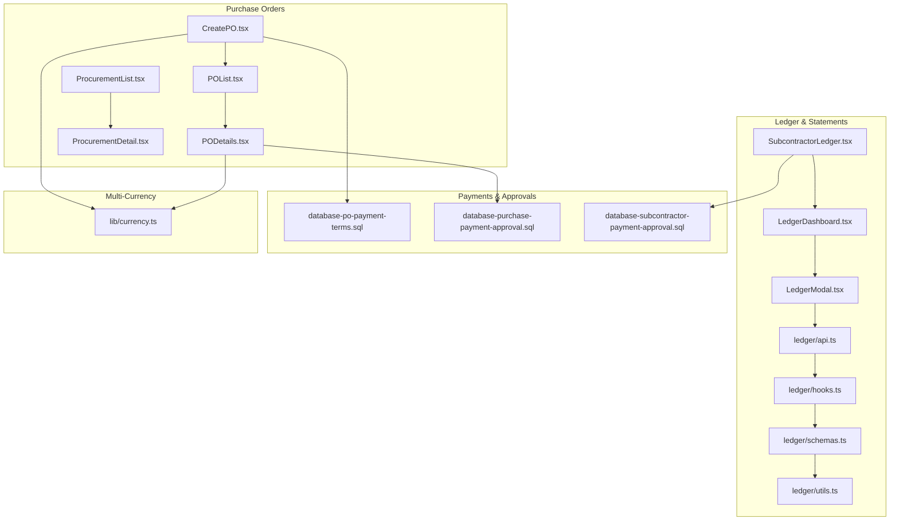
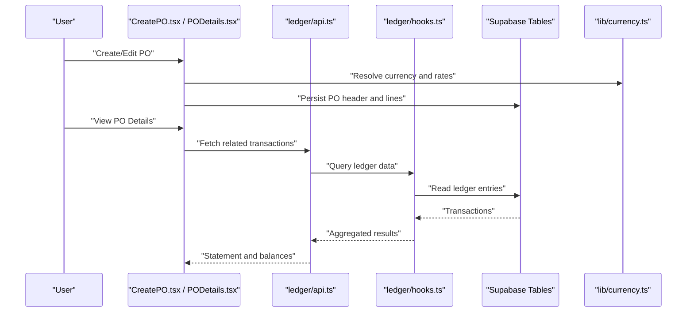
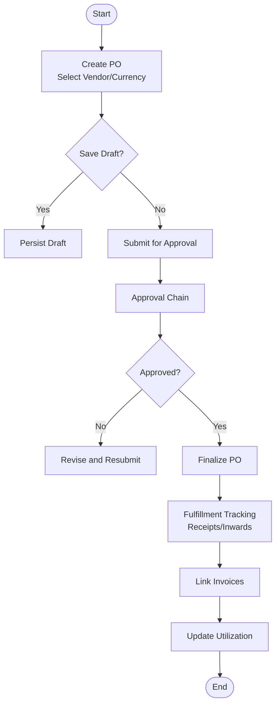
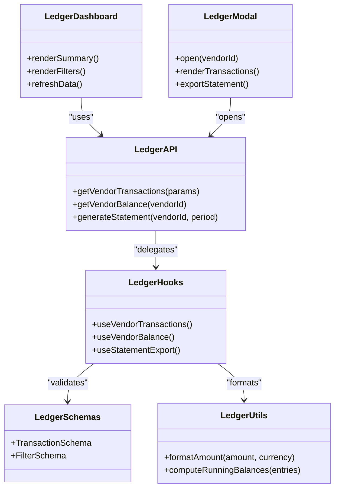
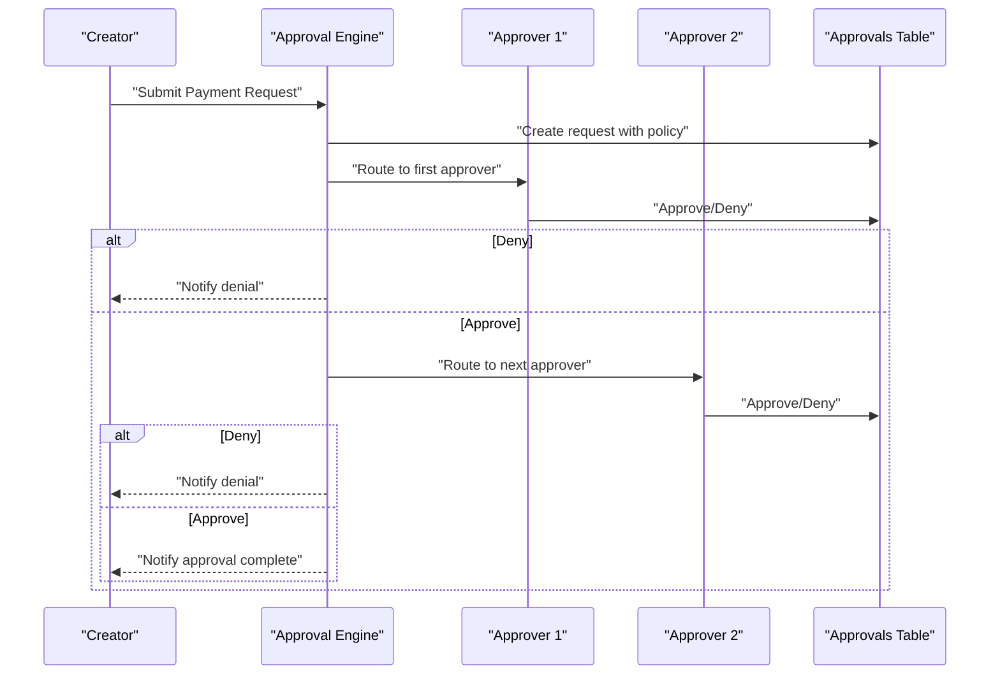
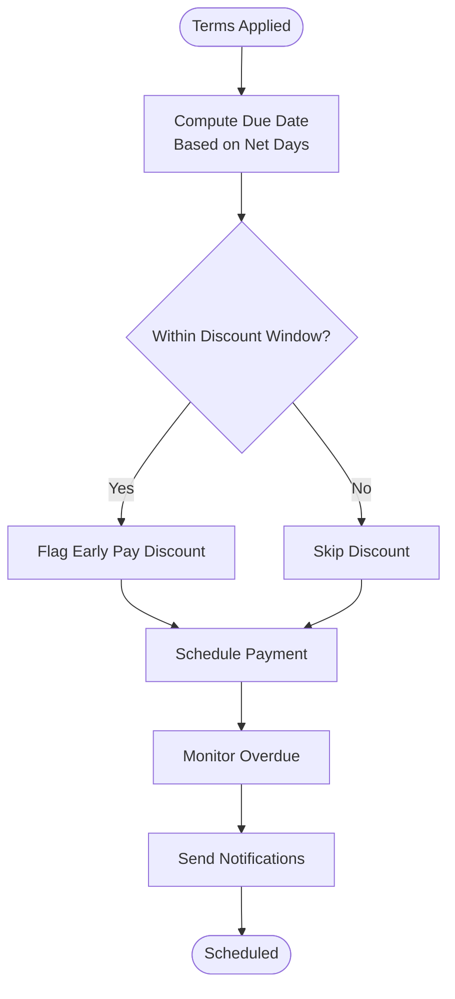
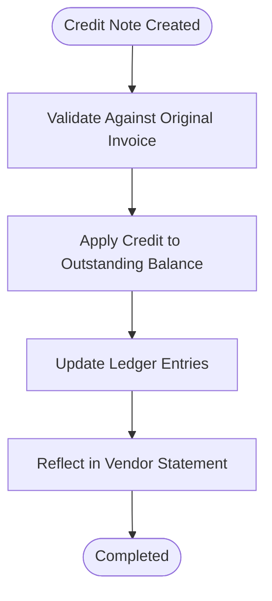
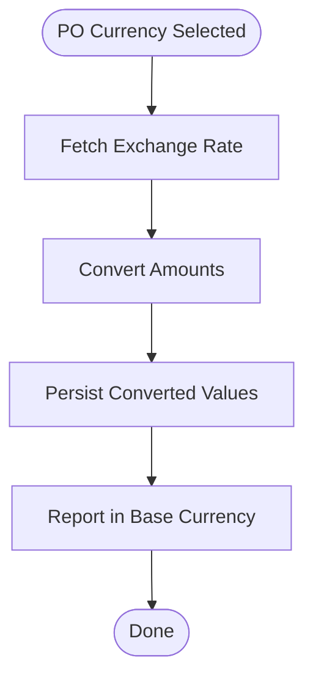
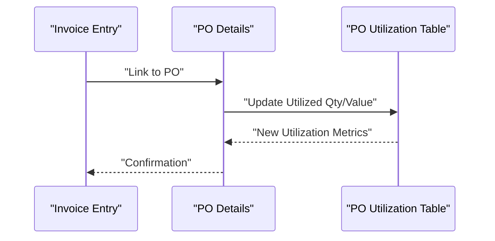
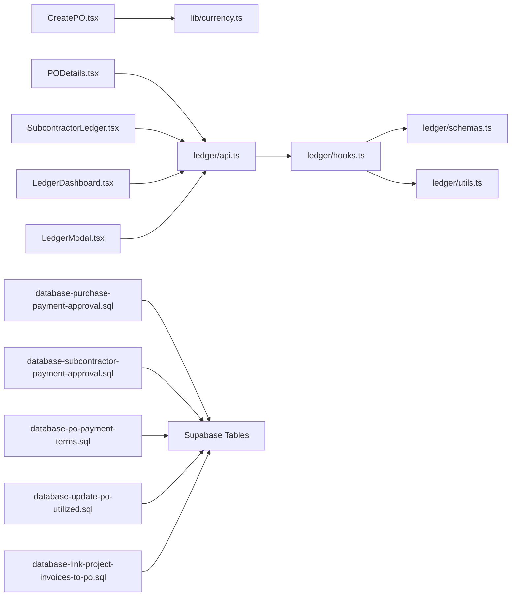

# Vendor Payments & Purchase Orders

<cite>
**Referenced Files in This Document**
- [CreatePO.tsx](file://src/pages/CreatePO.tsx)
- [POList.tsx](file://src/pages/POList.tsx)
- [PODetails.tsx](file://src/pages/PODetails.tsx)
- [ProcurementDetail.tsx](file://src/pages/ProcurementDetail.tsx)
- [ProcurementList.tsx](file://src/pages/ProcurementList.tsx)
- [SubcontractorLedger.tsx](file://src/components/SubcontractorLedger.tsx)
- [ledger/LedgerDashboard.tsx](file://src/ledger/LedgerDashboard.tsx)
- [ledger/LedgerModal.tsx](file://src/ledger/LedgerModal.tsx)
- [ledger/api.ts](file://src/ledger/api.ts)
- [ledger/hooks.ts](file://src/ledger/hooks.ts)
- [ledger/schemas.ts](file://src/ledger/schemas.ts)
- [ledger/utils.ts](file://src/ledger/utils.ts)
- [lib/currency.ts](file://src/lib/currency.ts)
- [database-po-payment-terms.sql](file://src/database-po-payment-terms.sql)
- [database-purchase-payment-approval.sql](file://src/database-purchase-payment-approval.sql)
- [database-subcontractor-payment-approval.sql](file://src/database-subcontractor-payment-approval.sql)
- [database-purchase-enhancements-v2.sql](file://src/database-purchase-enhancements-v2.sql)
- [database-link-project-invoices-to-po.sql](file://src/database-link-project-invoices-to-po.sql)
- [database-update-po-utilized.sql](file://src/database-update-po-utilized.sql)
- [modules/Purchase](file://src/modules/Purchase)
</cite>

## Table of Contents
1. [Introduction](#introduction)
2. [Project Structure](#project-structure)
3. [Core Components](#core-components)
4. [Architecture Overview](#architecture-overview)
5. [Detailed Component Analysis](#detailed-component-analysis)
6. [Dependency Analysis](#dependency-analysis)
7. [Performance Considerations](#performance-considerations)
8. [Troubleshooting Guide](#troubleshooting-guide)
9. [Conclusion](#conclusion)
10. [Appendices](#appendices)

## Introduction
This document explains vendor payment processing and purchase order management across the application. It covers:
- Payment approval workflows and chains
- Vendor ledger management and statements
- Purchase order creation, fulfillment tracking, and utilization
- Payment scheduling and terms enforcement
- Vendor credit management (credit notes and adjustments)
- Multi-currency support for POs and payments
- Automated notifications and compliance considerations

The goal is to provide both a high-level understanding and detailed implementation references so stakeholders can operate, extend, and troubleshoot these features effectively.

## Project Structure
Vendor and purchase-related functionality spans UI pages, shared ledger components, hooks and APIs, and database migrations that define schemas and constraints. The key areas are:
- Purchase Order UI: Create, list, detail views
- Procurement overview and drill-down
- Ledger dashboards and modals for vendor balances and transactions
- Currency utilities and multi-currency handling
- Database schema and rules for payment terms, approvals, and PO utilization

**Diagram sources**
- [CreatePO.tsx](file://src/pages/CreatePO.tsx)
- [POList.tsx](file://src/pages/POList.tsx)
- [PODetails.tsx](file://src/pages/PODetails.tsx)
- [ProcurementList.tsx](file://src/pages/ProcurementList.tsx)
- [ProcurementDetail.tsx](file://src/pages/ProcurementDetail.tsx)
- [SubcontractorLedger.tsx](file://src/components/SubcontractorLedger.tsx)
- [ledger/LedgerDashboard.tsx](file://src/ledger/LedgerDashboard.tsx)
- [ledger/LedgerModal.tsx](file://src/ledger/LedgerModal.tsx)
- [ledger/api.ts](file://src/ledger/api.ts)
- [ledger/hooks.ts](file://src/ledger/hooks.ts)
- [ledger/schemas.ts](file://src/ledger/schemas.ts)
- [ledger/utils.ts](file://src/ledger/utils.ts)
- [database-po-payment-terms.sql](file://src/database-po-payment-terms.sql)
- [database-purchase-payment-approval.sql](file://src/database-purchase-payment-approval.sql)
- [database-subcontractor-payment-approval.sql](file://src/database-subcontractor-payment-approval.sql)
- [lib/currency.ts](file://src/lib/currency.ts)

**Section sources**
- [CreatePO.tsx](file://src/pages/CreatePO.tsx)
- [POList.tsx](file://src/pages/POList.tsx)
- [PODetails.tsx](file://src/pages/PODetails.tsx)
- [ProcurementList.tsx](file://src/pages/ProcurementList.tsx)
- [ProcurementDetail.tsx](file://src/pages/ProcurementDetail.tsx)
- [SubcontractorLedger.tsx](file://src/components/SubcontractorLedger.tsx)
- [ledger/LedgerDashboard.tsx](file://src/ledger/LedgerDashboard.tsx)
- [ledger/LedgerModal.tsx](file://src/ledger/LedgerModal.tsx)
- [ledger/api.ts](file://src/ledger/api.ts)
- [ledger/hooks.ts](file://src/ledger/hooks.ts)
- [ledger/schemas.ts](file://src/ledger/schemas.ts)
- [ledger/utils.ts](file://src/ledger/utils.ts)
- [database-po-payment-terms.sql](file://src/database-po-payment-terms.sql)
- [database-purchase-payment-approval.sql](file://src/database-purchase-payment-approval.sql)
- [database-subcontractor-payment-approval.sql](file://src/database-subcontractor-payment-approval.sql)
- [lib/currency.ts](file://src/lib/currency.ts)

## Core Components
- Purchase Order Creation and Management
  - Create, edit, and list purchase orders with vendor selection, line items, and totals.
  - Reference: [CreatePO.tsx](file://src/pages/CreatePO.tsx), [POList.tsx](file://src/pages/POList.tsx)
- Purchase Order Fulfillment Tracking
  - View details, track receipt/inward status, link to invoices, and monitor utilization.
  - Reference: [PODetails.tsx](file://src/pages/PODetails.tsx), [ProcurementDetail.tsx](file://src/pages/ProcurementDetail.tsx), [ProcurementList.tsx](file://src/pages/ProcurementList.tsx)
- Vendor Ledger and Statements
  - Unified ledger view, transaction history, opening balances, and statement generation.
  - Reference: [SubcontractorLedger.tsx](file://src/components/SubcontractorLedger.tsx), [ledger/LedgerDashboard.tsx](file://src/ledger/LedgerDashboard.tsx), [ledger/LedgerModal.tsx](file://src/ledger/LedgerModal.tsx), [ledger/api.ts](file://src/ledger/api.ts), [ledger/hooks.ts](file://src/ledger/hooks.ts), [ledger/schemas.ts](file://src/ledger/schemas.ts), [ledger/utils.ts](file://src/ledger/utils.ts)
- Payment Terms and Scheduling
  - Enforce due dates, discount windows, and schedule payments based on PO terms.
  - Reference: [database-po-payment-terms.sql](file://src/database-po-payment-terms.sql)
- Payment Approval Workflows
  - Define approval chains for purchases and subcontractor payments; enforce policy-based routing.
  - Reference: [database-purchase-payment-approval.sql](file://src/database-purchase-payment-approval.sql), [database-subcontractor-payment-approval.sql](file://src/database-subcontractor-payment-approval.sql)
- Multi-Currency Support
  - Handle currency selection, conversion, and display for POs and payments.
  - Reference: [lib/currency.ts](file://src/lib/currency.ts)
- Credit Notes and Vendor Credits
  - Manage credits against vendors and reconcile them with payments and invoices.
  - Reference: [database-purchase-enhancements-v2.sql](file://src/database-purchase-enhancements-v2.sql)
- Invoice Linking and Utilization
  - Link project invoices to POs and update utilization metrics.
  - Reference: [database-link-project-invoices-to-po.sql](file://src/database-link-project-invoices-to-po.sql), [database-update-po-utilized.sql](file://src/database-update-po-utilized.sql)

**Section sources**
- [CreatePO.tsx](file://src/pages/CreatePO.tsx)
- [POList.tsx](file://src/pages/POList.tsx)
- [PODetails.tsx](file://src/pages/PODetails.tsx)
- [ProcurementList.tsx](file://src/pages/ProcurementList.tsx)
- [ProcurementDetail.tsx](file://src/pages/ProcurementDetail.tsx)
- [SubcontractorLedger.tsx](file://src/components/SubcontractorLedger.tsx)
- [ledger/LedgerDashboard.tsx](file://src/ledger/LedgerDashboard.tsx)
- [ledger/LedgerModal.tsx](file://src/ledger/LedgerModal.tsx)
- [ledger/api.ts](file://src/ledger/api.ts)
- [ledger/hooks.ts](file://src/ledger/hooks.ts)
- [ledger/schemas.ts](file://src/ledger/schemas.ts)
- [ledger/utils.ts](file://src/ledger/utils.ts)
- [database-po-payment-terms.sql](file://src/database-po-payment-terms.sql)
- [database-purchase-payment-approval.sql](file://src/database-purchase-payment-approval.sql)
- [database-subcontractor-payment-approval.sql](file://src/database-subcontractor-payment-approval.sql)
- [lib/currency.ts](file://src/lib/currency.ts)
- [database-purchase-enhancements-v2.sql](file://src/database-purchase-enhancements-v2.sql)
- [database-link-project-invoices-to-po.sql](file://src/database-link-project-invoices-to-po.sql)
- [database-update-po-utilized.sql](file://src/database-update-po-utilized.sql)

## Architecture Overview
The system integrates purchase order entry, procurement tracking, vendor ledgering, and payment approvals. Data flows from UI interactions into API/hook layers, which persist changes via Supabase-backed tables defined by SQL migrations. Currency utilities ensure consistent multi-currency behavior.

**Diagram sources**
- [CreatePO.tsx](file://src/pages/CreatePO.tsx)
- [PODetails.tsx](file://src/pages/PODetails.tsx)
- [ledger/api.ts](file://src/ledger/api.ts)
- [ledger/hooks.ts](file://src/ledger/hooks.ts)
- [lib/currency.ts](file://src/lib/currency.ts)

## Detailed Component Analysis

### Purchase Order Lifecycle
- Creation: Select vendor, set currency, add line items, apply tax/discount, save draft or submit for approval.
- Approval: If enabled, route through configured approval chain before finalization.
- Fulfillment: Track receipts/inwards, partial/full completion, and link to invoices.
- Utilization: Update used quantities and values against PO limits.

**Diagram sources**
- [CreatePO.tsx](file://src/pages/CreatePO.tsx)
- [PODetails.tsx](file://src/pages/PODetails.tsx)
- [ProcurementDetail.tsx](file://src/pages/ProcurementDetail.tsx)
- [ProcurementList.tsx](file://src/pages/ProcurementList.tsx)
- [database-purchase-payment-approval.sql](file://src/database-purchase-payment-approval.sql)
- [database-update-po-utilized.sql](file://src/database-update-po-utilized.sql)

**Section sources**
- [CreatePO.tsx](file://src/pages/CreatePO.tsx)
- [PODetails.tsx](file://src/pages/PODetails.tsx)
- [ProcurementList.tsx](file://src/pages/ProcurementList.tsx)
- [ProcurementDetail.tsx](file://src/pages/ProcurementDetail.tsx)
- [database-purchase-payment-approval.sql](file://src/database-purchase-payment-approval.sql)
- [database-update-po-utilized.sql](file://src/database-update-po-utilized.sql)

### Vendor Ledger and Statement Generation
- Dashboard: Summarizes vendor balances, open items, aging buckets.
- Modal: Displays detailed transactions, filters by date range, type, and reference.
- API/Hooks: Provide paginated queries and aggregations for performance.
- Utilities: Format amounts, currencies, and compute running balances.

**Diagram sources**
- [ledger/LedgerDashboard.tsx](file://src/ledger/LedgerDashboard.tsx)
- [ledger/LedgerModal.tsx](file://src/ledger/LedgerModal.tsx)
- [ledger/api.ts](file://src/ledger/api.ts)
- [ledger/hooks.ts](file://src/ledger/hooks.ts)
- [ledger/schemas.ts](file://src/ledger/schemas.ts)
- [ledger/utils.ts](file://src/ledger/utils.ts)

**Section sources**
- [SubcontractorLedger.tsx](file://src/components/SubcontractorLedger.tsx)
- [ledger/LedgerDashboard.tsx](file://src/ledger/LedgerDashboard.tsx)
- [ledger/LedgerModal.tsx](file://src/ledger/LedgerModal.tsx)
- [ledger/api.ts](file://src/ledger/api.ts)
- [ledger/hooks.ts](file://src/ledger/hooks.ts)
- [ledger/schemas.ts](file://src/ledger/schemas.ts)
- [ledger/utils.ts](file://src/ledger/utils.ts)

### Payment Approval Chains
- Policy-driven routing based on amount thresholds, vendor risk, department, or project.
- Sequential or parallel approvers; escalation and reassignment supported.
- Audit trail captures decisions and timestamps.

**Diagram sources**
- [database-purchase-payment-approval.sql](file://src/database-purchase-payment-approval.sql)
- [database-subcontractor-payment-approval.sql](file://src/database-subcontractor-payment-approval.sql)

**Section sources**
- [database-purchase-payment-approval.sql](file://src/database-purchase-payment-approval.sql)
- [database-subcontractor-payment-approval.sql](file://src/database-subcontractor-payment-approval.sql)

### Payment Terms Enforcement and Scheduling
- Terms include net days, early payment discounts, late fees, and grace periods.
- Scheduler computes due dates and flags overdue items.
- UI surfaces upcoming payments and allows manual rescheduling within policy.

**Diagram sources**
- [database-po-payment-terms.sql](file://src/database-po-payment-terms.sql)

**Section sources**
- [database-po-payment-terms.sql](file://src/database-po-payment-terms.sql)

### Vendor Credit Management
- Credit notes reduce outstanding balances and can be applied to future payments.
- Reconciliation ensures credits match original invoices or returns.
- Statement reflects credit applications and remaining balance.

**Diagram sources**
- [database-purchase-enhancements-v2.sql](file://src/database-purchase-enhancements-v2.sql)

**Section sources**
- [database-purchase-enhancements-v2.sql](file://src/database-purchase-enhancements-v2.sql)

### Multi-Currency Support
- Currency selection at PO level; conversions applied consistently across ledger and reports.
- Exchange rates stored and referenced for accurate reporting.
- Display formatting respects locale and currency conventions.

**Diagram sources**
- [lib/currency.ts](file://src/lib/currency.ts)

**Section sources**
- [lib/currency.ts](file://src/lib/currency.ts)

### Invoice Linking and Utilization
- Link invoices to POs to track spend against commitments.
- Update utilized quantities/values to prevent over-ordering.
- Reports show utilization percentages and remaining capacity.

**Diagram sources**
- [database-link-project-invoices-to-po.sql](file://src/database-link-project-invoices-to-po.sql)
- [database-update-po-utilized.sql](file://src/database-update-po-utilized.sql)

**Section sources**
- [database-link-project-invoices-to-po.sql](file://src/database-link-project-invoices-to-po.sql)
- [database-update-po-utilized.sql](file://src/database-update-po-utilized.sql)

## Dependency Analysis
Key dependencies between modules and files:
- UI pages depend on ledger APIs and hooks for real-time data.
- Ledger components rely on schemas for validation and utils for formatting.
- Payment approvals depend on database policies and RLS rules.
- Currency utilities are consumed by PO creation and ledger displays.

**Diagram sources**
- [CreatePO.tsx](file://src/pages/CreatePO.tsx)
- [PODetails.tsx](file://src/pages/PODetails.tsx)
- [SubcontractorLedger.tsx](file://src/components/SubcontractorLedger.tsx)
- [ledger/LedgerDashboard.tsx](file://src/ledger/LedgerDashboard.tsx)
- [ledger/LedgerModal.tsx](file://src/ledger/LedgerModal.tsx)
- [ledger/api.ts](file://src/ledger/api.ts)
- [ledger/hooks.ts](file://src/ledger/hooks.ts)
- [ledger/schemas.ts](file://src/ledger/schemas.ts)
- [ledger/utils.ts](file://src/ledger/utils.ts)
- [database-purchase-payment-approval.sql](file://src/database-purchase-payment-approval.sql)
- [database-subcontractor-payment-approval.sql](file://src/database-subcontractor-payment-approval.sql)
- [database-po-payment-terms.sql](file://src/database-po-payment-terms.sql)
- [database-update-po-utilized.sql](file://src/database-update-po-utilized.sql)
- [database-link-project-invoices-to-po.sql](file://src/database-link-project-invoices-to-po.sql)
- [lib/currency.ts](file://src/lib/currency.ts)

**Section sources**
- [CreatePO.tsx](file://src/pages/CreatePO.tsx)
- [PODetails.tsx](file://src/pages/PODetails.tsx)
- [SubcontractorLedger.tsx](file://src/components/SubcontractorLedger.tsx)
- [ledger/LedgerDashboard.tsx](file://src/ledger/LedgerDashboard.tsx)
- [ledger/LedgerModal.tsx](file://src/ledger/LedgerModal.tsx)
- [ledger/api.ts](file://src/ledger/api.ts)
- [ledger/hooks.ts](file://src/ledger/hooks.ts)
- [ledger/schemas.ts](file://src/ledger/schemas.ts)
- [ledger/utils.ts](file://src/ledger/utils.ts)
- [database-purchase-payment-approval.sql](file://src/database-purchase-payment-approval.sql)
- [database-subcontractor-payment-approval.sql](file://src/database-subcontractor-payment-approval.sql)
- [database-po-payment-terms.sql](file://src/database-po-payment-terms.sql)
- [database-update-po-utilized.sql](file://src/database-update-po-utilized.sql)
- [database-link-project-invoices-to-po.sql](file://src/database-link-project-invoices-to-po.sql)
- [lib/currency.ts](file://src/lib/currency.ts)

## Performance Considerations
- Use pagination and filtering in ledger queries to handle large datasets efficiently.
- Cache exchange rates and vendor master data where appropriate to reduce repeated lookups.
- Defer heavy computations (aging buckets, running balances) to server-side hooks and utilities.
- Index frequently queried columns in database tables for faster retrieval.

[No sources needed since this section provides general guidance]

## Troubleshooting Guide
Common issues and resolutions:
- Approval not routing correctly: Verify policy configuration and user roles; check approval table entries for missing steps.
- Payment due date mismatch: Confirm terms settings and base invoice dates; ensure timezone consistency.
- Multi-currency discrepancies: Validate exchange rate source and timestamp; confirm currency code mapping.
- Utilization not updating: Ensure invoice-to-PO linking exists and triggers are active; check constraint violations.

**Section sources**
- [database-purchase-payment-approval.sql](file://src/database-purchase-payment-approval.sql)
- [database-po-payment-terms.sql](file://src/database-po-payment-terms.sql)
- [database-update-po-utilized.sql](file://src/database-update-po-utilized.sql)
- [lib/currency.ts](file://src/lib/currency.ts)

## Conclusion
The vendor payment and purchase order subsystem integrates robust UI flows, ledgering, approvals, and multi-currency capabilities. By enforcing payment terms, maintaining clear approval chains, and tracking PO utilization, the system supports compliant and efficient procurement operations. Extensibility points exist in ledger APIs, hooks, and database policies to accommodate evolving business requirements.

[No sources needed since this section summarizes without analyzing specific files]

## Appendices
- Example: Payment approval chain
  - Scenario: High-value PO requires two sequential approvals; if denied at any step, creator is notified and must revise.
  - References: [database-purchase-payment-approval.sql](file://src/database-purchase-payment-approval.sql)
- Example: Vendor statement generation
  - Action: Open ledger modal for a vendor, filter by period, export statement PDF.
  - References: [ledger/LedgerModal.tsx](file://src/ledger/LedgerModal.tsx), [ledger/api.ts](file://src/ledger/api.ts)
- Example: Automated payment notifications
  - Mechanism: Scheduler flags upcoming due dates and sends alerts to responsible users.
  - References: [database-po-payment-terms.sql](file://src/database-po-payment-terms.sql)

**Section sources**
- [database-purchase-payment-approval.sql](file://src/database-purchase-payment-approval.sql)
- [ledger/LedgerModal.tsx](file://src/ledger/LedgerModal.tsx)
- [ledger/api.ts](file://src/ledger/api.ts)
- [database-po-payment-terms.sql](file://src/database-po-payment-terms.sql)