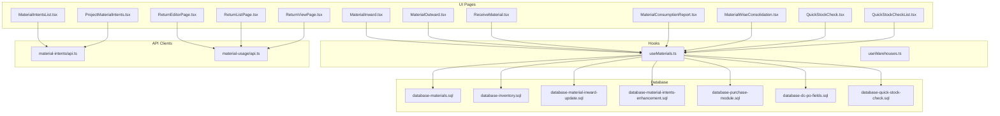
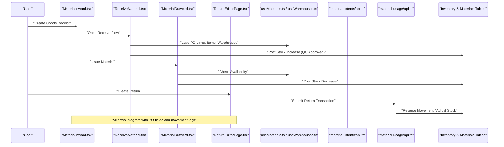
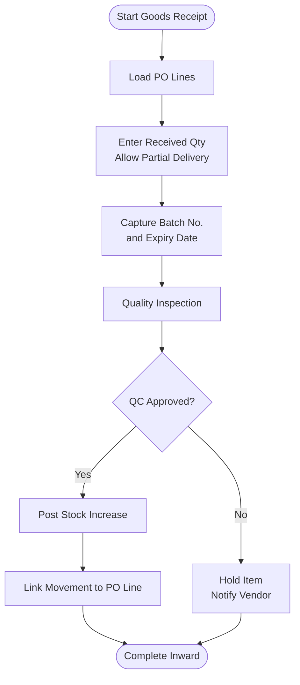
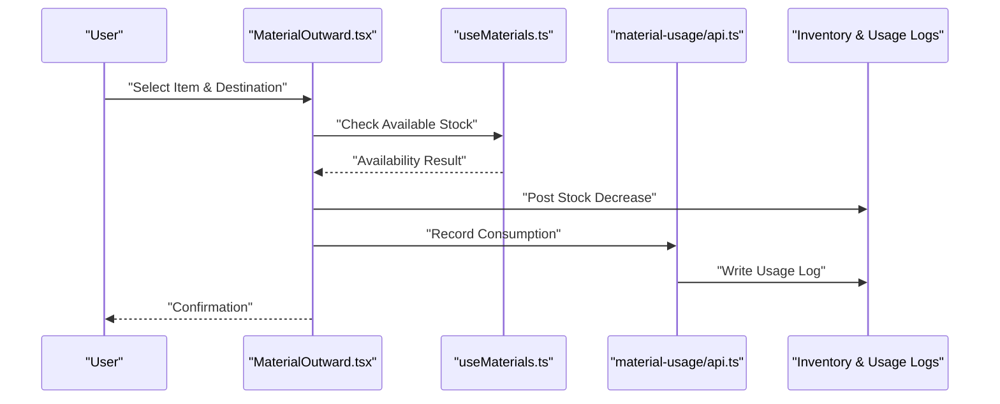
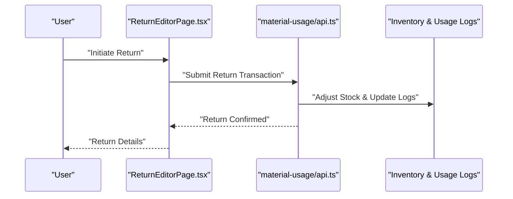
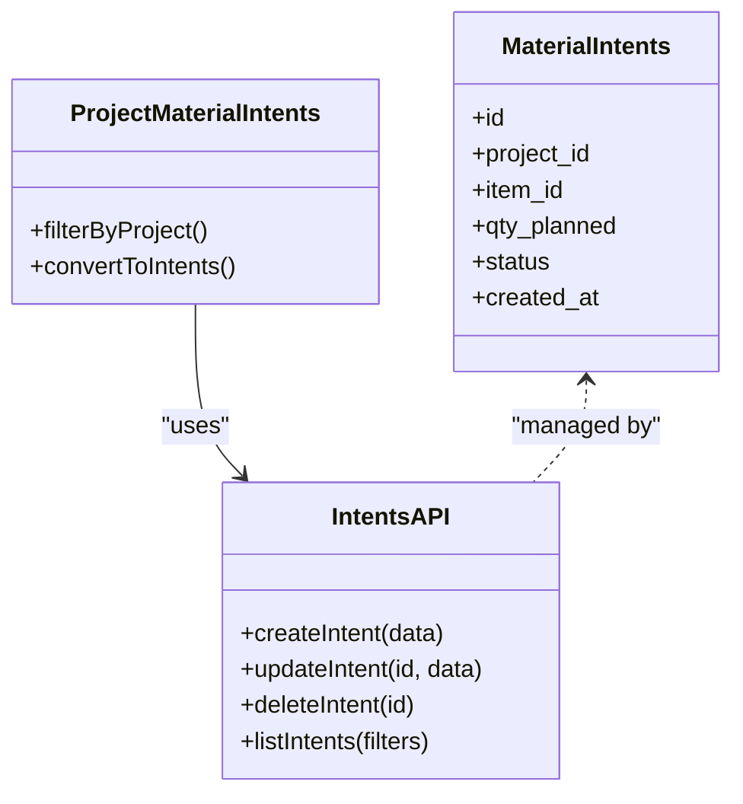
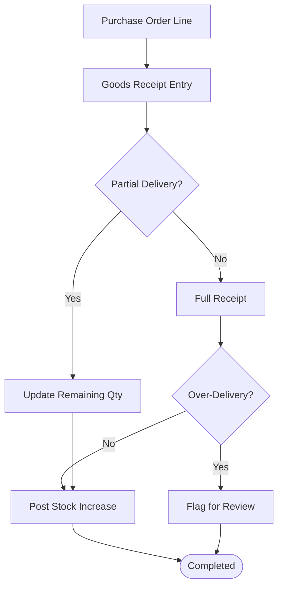
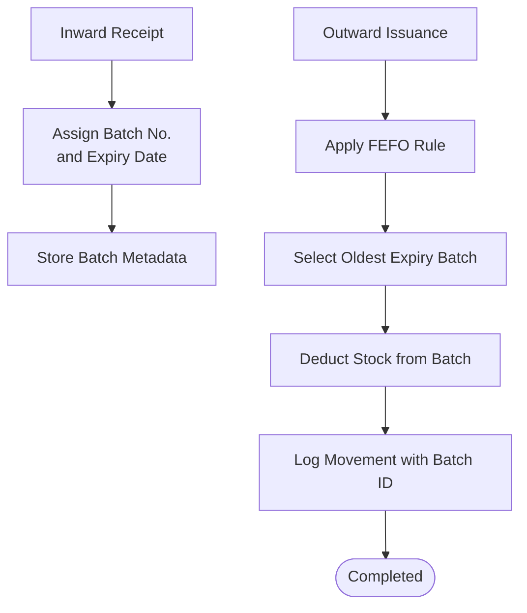
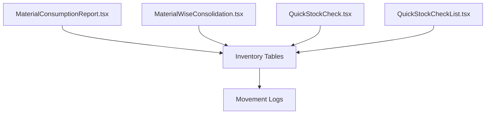
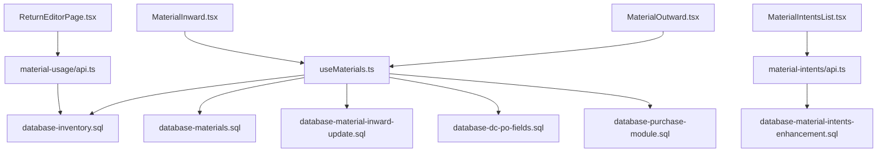

# Material Inward & Outward

<cite>
**Referenced Files in This Document**
- [MaterialInward.tsx](file://src/pages/MaterialInward.tsx)
- [MaterialOutward.tsx](file://src/pages/MaterialOutward.tsx)
- [ReceiveMaterial.tsx](file://src/pages/ReceiveMaterial.tsx)
- [MaterialIntentsList.tsx](file://src/pages/MaterialIntentsList.tsx)
- [ProjectMaterialIntents.tsx](file://src/pages/ProjectMaterialIntents.tsx)
- [ReturnEditorPage.tsx](file://src/pages/ReturnEditorPage.tsx)
- [ReturnListPage.tsx](file://src/pages/ReturnListPage.tsx)
- [ReturnViewPage.tsx](file://src/pages/ReturnViewPage.tsx)
- [material-intents/api.ts](file://src/material-intents/api.ts)
- [material-usage/api.ts](file://src/material-usage/api.ts)
- [useMaterials.ts](file://src/hooks/useMaterials.ts)
- [useWarehouses.ts](file://src/hooks/useWarehouses.ts)
- [database-materials.sql](file://src/database-materials.sql)
- [database-inventory.sql](file://src/database-inventory.sql)
- [database-material-inward-update.sql](file://src/database-material-inward-update.sql)
- [database-material-intents-enhancement.sql](file://src/database-material-intents-enhancement.sql)
- [database-purchase-module.sql](file://src/database-purchase-module.sql)
- [database-dc-po-fields.sql](file://src/database-dc-po-fields.sql)
- [database-quick-stock-check.sql](file://src/database-quick-stock-check.sql)
- [MaterialConsumptionReport.tsx](file://src/pages/MaterialConsumptionReport.tsx)
- [MaterialWiseConsolidation.tsx](file://src/pages/MaterialWiseConsolidation.tsx)
- [QuickStockCheck.tsx](file://src/pages/QuickStockCheck.tsx)
- [QuickStockCheckList.tsx](file://src/pages/QuickStockCheckList.tsx)
</cite>

## Table of Contents
1. [Introduction](#introduction)
2. [Project Structure](#project-structure)
3. [Core Components](#core-components)
4. [Architecture Overview](#architecture-overview)
5. [Detailed Component Analysis](#detailed-component-analysis)
6. [Dependency Analysis](#dependency-analysis)
7. [Performance Considerations](#performance-considerations)
8. [Troubleshooting Guide](#troubleshooting-guide)
9. [Conclusion](#conclusion)
10. [Appendices](#appendices)

## Introduction
This document explains the material inward and outward processing systems, including goods receipt workflows, quality inspection processes, stock updates upon arrival, outward issuance, consumption tracking, returns, integration with purchase orders (including partial and over-delivery handling), transaction queries, stock reconciliation, variance reporting, barcode scanning integration, batch tracking, and expiry date management. The content is derived from the repository’s pages, hooks, API modules, and database migrations that implement these capabilities.

## Project Structure
The material module spans UI pages, hooks for data access, API clients for backend operations, and SQL migrations defining schemas and stored procedures. Key areas include:
- Inward flows: Goods receipt, quality inspection, stock posting, and PO linkage
- Outward flows: Issuance to projects/consumers, consumption tracking, and returns
- Reporting and reconciliation: Consumption reports, consolidation views, quick stock checks
- Data model: Inventory tables, movement logs, PO linkage fields, and enhancements for intents and QC

**Diagram sources**
- [MaterialInward.tsx](file://src/pages/MaterialInward.tsx)
- [MaterialOutward.tsx](file://src/pages/MaterialOutward.tsx)
- [ReceiveMaterial.tsx](file://src/pages/ReceiveMaterial.tsx)
- [MaterialIntentsList.tsx](file://src/pages/MaterialIntentsList.tsx)
- [ProjectMaterialIntents.tsx](file://src/pages/ProjectMaterialIntents.tsx)
- [ReturnEditorPage.tsx](file://src/pages/ReturnEditorPage.tsx)
- [ReturnListPage.tsx](file://src/pages/ReturnListPage.tsx)
- [ReturnViewPage.tsx](file://src/pages/ReturnViewPage.tsx)
- [MaterialConsumptionReport.tsx](file://src/pages/MaterialConsumptionReport.tsx)
- [MaterialWiseConsolidation.tsx](file://src/pages/MaterialWiseConsolidation.tsx)
- [QuickStockCheck.tsx](file://src/pages/QuickStockCheck.tsx)
- [QuickStockCheckList.tsx](file://src/pages/QuickStockCheckList.tsx)
- [useMaterials.ts](file://src/hooks/useMaterials.ts)
- [useWarehouses.ts](file://src/hooks/useWarehouses.ts)
- [material-intents/api.ts](file://src/material-intents/api.ts)
- [material-usage/api.ts](file://src/material-usage/api.ts)
- [database-materials.sql](file://src/database-materials.sql)
- [database-inventory.sql](file://src/database-inventory.sql)
- [database-material-inward-update.sql](file://src/database-material-inward-update.sql)
- [database-material-intents-enhancement.sql](file://src/database-material-intents-enhancement.sql)
- [database-purchase-module.sql](file://src/database-purchase-module.sql)
- [database-dc-po-fields.sql](file://src/database-dc-po-fields.sql)
- [database-quick-stock-check.sql](file://src/database-quick-stock-check.sql)

**Section sources**
- [MaterialInward.tsx](file://src/pages/MaterialInward.tsx)
- [MaterialOutward.tsx](file://src/pages/MaterialOutward.tsx)
- [ReceiveMaterial.tsx](file://src/pages/ReceiveMaterial.tsx)
- [MaterialIntentsList.tsx](file://src/pages/MaterialIntentsList.tsx)
- [ProjectMaterialIntents.tsx](file://src/pages/ProjectMaterialIntents.tsx)
- [ReturnEditorPage.tsx](file://src/pages/ReturnEditorPage.tsx)
- [ReturnListPage.tsx](file://src/pages/ReturnListPage.tsx)
- [ReturnViewPage.tsx](file://src/pages/ReturnViewPage.tsx)
- [MaterialConsumptionReport.tsx](file://src/pages/MaterialConsumptionReport.tsx)
- [MaterialWiseConsolidation.tsx](file://src/pages/MaterialWiseConsolidation.tsx)
- [QuickStockCheck.tsx](file://src/pages/QuickStockCheck.tsx)
- [QuickStockCheckList.tsx](file://src/pages/QuickStockCheckList.tsx)
- [useMaterials.ts](file://src/hooks/useMaterials.ts)
- [useWarehouses.ts](file://src/hooks/useWarehouses.ts)
- [material-intents/api.ts](file://src/material-intents/api.ts)
- [material-usage/api.ts](file://src/material-usage/api.ts)
- [database-materials.sql](file://src/database-materials.sql)
- [database-inventory.sql](file://src/database-inventory.sql)
- [database-material-inward-update.sql](file://src/database-material-inward-update.sql)
- [database-material-intents-enhancement.sql](file://src/database-material-intents-enhancement.sql)
- [database-purchase-module.sql](file://src/database-purchase-module.sql)
- [database-dc-po-fields.sql](file://src/database-dc-po-fields.sql)
- [database-quick-stock-check.sql](file://src/database-quick-stock-check.sql)

## Core Components
- Material Inward Page: Orchestrates goods receipt entry, links to purchase orders, supports partial deliveries, and posts stock increases after quality approval.
- Receive Material Page: Dedicated flow for receiving items against PO lines, capturing batch/expiry details, and initiating quality inspection.
- Material Outward Page: Manages issuance of materials to projects or consumers, tracks consumption, and enforces availability checks.
- Returns Module: Provides creation, listing, and viewing of return transactions, reversing stock movements where applicable.
- Intent Management: Tracks planned material needs at project level and converts them into actual inward/outward movements.
- Hooks and APIs: Centralized data access for materials, warehouses, intents, and usage; encapsulates calls to backend services.
- Database Schema and Enhancements: Defines inventory tables, movement logs, PO linkage fields, and improvements for intent-driven workflows.

**Section sources**
- [MaterialInward.tsx](file://src/pages/MaterialInward.tsx)
- [ReceiveMaterial.tsx](file://src/pages/ReceiveMaterial.tsx)
- [MaterialOutward.tsx](file://src/pages/MaterialOutward.tsx)
- [ReturnEditorPage.tsx](file://src/pages/ReturnEditorPage.tsx)
- [ReturnListPage.tsx](file://src/pages/ReturnListPage.tsx)
- [ReturnViewPage.tsx](file://src/pages/ReturnViewPage.tsx)
- [MaterialIntentsList.tsx](file://src/pages/MaterialIntentsList.tsx)
- [ProjectMaterialIntents.tsx](file://src/pages/ProjectMaterialIntents.tsx)
- [useMaterials.ts](file://src/hooks/useMaterials.ts)
- [useWarehouses.ts](file://src/hooks/useWarehouses.ts)
- [material-intents/api.ts](file://src/material-intents/api.ts)
- [material-usage/api.ts](file://src/material-usage/api.ts)
- [database-materials.sql](file://src/database-materials.sql)
- [database-inventory.sql](file://src/database-inventory.sql)
- [database-material-inward-update.sql](file://src/database-material-inward-update.sql)
- [database-material-intents-enhancement.sql](file://src/database-material-intents-enhancement.sql)
- [database-purchase-module.sql](file://src/database-purchase-module.sql)
- [database-dc-po-fields.sql](file://src/database-dc-po-fields.sql)

## Architecture Overview
The system follows a layered architecture:
- UI Layer: React pages for inward, outward, returns, and reporting
- Hook Layer: useMaterials and useWarehouses provide typed data access and caching
- API Layer: material-intents and material-usage clients call backend endpoints
- Data Layer: Supabase tables and migrations define inventory, movements, PO linkage, and enhancements

**Diagram sources**
- [MaterialInward.tsx](file://src/pages/MaterialInward.tsx)
- [ReceiveMaterial.tsx](file://src/pages/ReceiveMaterial.tsx)
- [MaterialOutward.tsx](file://src/pages/MaterialOutward.tsx)
- [ReturnEditorPage.tsx](file://src/pages/ReturnEditorPage.tsx)
- [useMaterials.ts](file://src/hooks/useMaterials.ts)
- [useWarehouses.ts](file://src/hooks/useWarehouses.ts)
- [material-intents/api.ts](file://src/material-intents/api.ts)
- [material-usage/api.ts](file://src/material-usage/api.ts)
- [database-inventory.sql](file://src/database-inventory.sql)
- [database-materials.sql](file://src/database-materials.sql)

## Detailed Component Analysis

### Inward Processing: Goods Receipt and Quality Inspection
- Entry points: Material Inward page and Receive Material page
- Workflow:
  - Select Purchase Order and line items
  - Enter received quantities, allowing partial deliveries
  - Capture batch number and expiry date per lot
  - Initiate quality inspection; upon approval, post stock increase
  - Link movements back to PO for traceability and utilization tracking
- Integration points:
  - PO linkage via DC/PO fields migration
  - Inventory updates through inventory schema
  - Intent conversion from planned needs to actual receipts

**Diagram sources**
- [MaterialInward.tsx](file://src/pages/MaterialInward.tsx)
- [ReceiveMaterial.tsx](file://src/pages/ReceiveMaterial.tsx)
- [database-dc-po-fields.sql](file://src/database-dc-po-fields.sql)
- [database-inventory.sql](file://src/database-inventory.sql)
- [database-material-inward-update.sql](file://src/database-material-inward-update.sql)

**Section sources**
- [MaterialInward.tsx](file://src/pages/MaterialInward.tsx)
- [ReceiveMaterial.tsx](file://src/pages/ReceiveMaterial.tsx)
- [database-dc-po-fields.sql](file://src/database-dc-po-fields.sql)
- [database-inventory.sql](file://src/database-inventory.sql)
- [database-material-inward-update.sql](file://src/database-material-inward-update.sql)

### Outward Processing: Issuance and Consumption Tracking
- Entry point: Material Outward page
- Workflow:
  - Select item, warehouse, and destination (project/consumer)
  - Validate available stock considering batches and expiry constraints
  - Issue material and record consumption
  - Update inventory decrease and link to project/intent if applicable
- Integration points:
  - Availability checks via hooks and inventory tables
  - Consumption logging via material-usage API

**Diagram sources**
- [MaterialOutward.tsx](file://src/pages/MaterialOutward.tsx)
- [useMaterials.ts](file://src/hooks/useMaterials.ts)
- [material-usage/api.ts](file://src/material-usage/api.ts)
- [database-inventory.sql](file://src/database-inventory.sql)

**Section sources**
- [MaterialOutward.tsx](file://src/pages/MaterialOutward.tsx)
- [useMaterials.ts](file://src/hooks/useMaterials.ts)
- [material-usage/api.ts](file://src/material-usage/api.ts)
- [database-inventory.sql](file://src/database-inventory.sql)

### Returns Procedures
- Entry points: Return Editor, Return List, Return View pages
- Workflow:
  - Create return against original outward movement
  - Reverse stock adjustments and update usage logs
  - Provide visibility into return history and status

**Diagram sources**
- [ReturnEditorPage.tsx](file://src/pages/ReturnEditorPage.tsx)
- [ReturnListPage.tsx](file://src/pages/ReturnListPage.tsx)
- [ReturnViewPage.tsx](file://src/pages/ReturnViewPage.tsx)
- [material-usage/api.ts](file://src/material-usage/api.ts)
- [database-inventory.sql](file://src/database-inventory.sql)

**Section sources**
- [ReturnEditorPage.tsx](file://src/pages/ReturnEditorPage.tsx)
- [ReturnListPage.tsx](file://src/pages/ReturnListPage.tsx)
- [ReturnViewPage.tsx](file://src/pages/ReturnViewPage.tsx)
- [material-usage/api.ts](file://src/material-usage/api.ts)
- [database-inventory.sql](file://src/database-inventory.sql)

### Intent Management and Conversion to Movements
- Entry points: Material Intents List and Project Material Intents pages
- Purpose: Track planned material requirements at project level and convert them into actual inward/outward movements
- Integration:
  - Intent API client manages CRUD and lifecycle
  - Links to PO and inventory updates when converted

**Diagram sources**
- [MaterialIntentsList.tsx](file://src/pages/MaterialIntentsList.tsx)
- [ProjectMaterialIntents.tsx](file://src/pages/ProjectMaterialIntents.tsx)
- [material-intents/api.ts](file://src/material-intents/api.ts)
- [database-material-intents-enhancement.sql](file://src/database-material-intents-enhancement.sql)

**Section sources**
- [MaterialIntentsList.tsx](file://src/pages/MaterialIntentsList.tsx)
- [ProjectMaterialIntents.tsx](file://src/pages/ProjectMaterialIntents.tsx)
- [material-intents/api.ts](file://src/material-intents/api.ts)
- [database-material-intents-enhancement.sql](file://src/database-material-intents-enhancement.sql)

### Purchase Order Integration: Partial Deliveries and Over-Delivery Handling
- Linkage: DC/PO fields migration enables linking delivery challans and receipts to PO lines
- Partial deliveries: Allowed during goods receipt; each receipt updates remaining balance on PO line
- Over-delivery handling: Enforced by validation rules and movement logs; excess quantities flagged for review

**Diagram sources**
- [database-dc-po-fields.sql](file://src/database-dc-po-fields.sql)
- [database-purchase-module.sql](file://src/database-purchase-module.sql)
- [database-material-inward-update.sql](file://src/database-material-inward-update.sql)

**Section sources**
- [database-dc-po-fields.sql](file://src/database-dc-po-fields.sql)
- [database-purchase-module.sql](file://src/database-purchase-module.sql)
- [database-material-inward-update.sql](file://src/database-material-inward-update.sql)

### Barcode Scanning Integration
- Conceptual integration points:
  - Scan barcodes on inbound items to auto-populate item identifiers, batch numbers, and expiry dates
  - Use scanned data to reduce manual entry errors and speed up goods receipt
- Implementation guidance:
  - Integrate scanner input events into Receive Material form fields
  - Map barcode payloads to item master attributes and batch metadata
  - Validate scanned data against item catalog before posting

[No sources needed since this section provides general guidance]

### Batch Tracking and Expiry Date Management
- Capabilities:
  - Capture batch number and expiry date per lot during inward receipt
  - Enforce FEFO (First Expired, First Out) logic during outward issuance
  - Maintain batch-level inventory balances and movement history
- Data model alignment:
  - Inventory tables store batch and expiry attributes
  - Movement logs reference batch IDs for traceability

**Diagram sources**
- [database-inventory.sql](file://src/database-inventory.sql)
- [database-materials.sql](file://src/database-materials.sql)

**Section sources**
- [database-inventory.sql](file://src/database-inventory.sql)
- [database-materials.sql](file://src/database-materials.sql)

### Material Transaction Queries, Stock Reconciliation, and Variance Reporting
- Transaction queries:
  - Use Material Consumption Report and Material Wise Consolidation pages to list movements, filter by date/item/project, and export summaries
- Stock reconciliation:
  - Quick Stock Check and its list view enable comparing system stock vs. physical counts
  - Variance reporting highlights discrepancies for investigation
- Data sources:
  - Inventory tables and movement logs
  - Reports aggregate data across inward/outward/returns

**Diagram sources**
- [MaterialConsumptionReport.tsx](file://src/pages/MaterialConsumptionReport.tsx)
- [MaterialWiseConsolidation.tsx](file://src/pages/MaterialWiseConsolidation.tsx)
- [QuickStockCheck.tsx](file://src/pages/QuickStockCheck.tsx)
- [QuickStockCheckList.tsx](file://src/pages/QuickStockCheckList.tsx)
- [database-inventory.sql](file://src/database-inventory.sql)
- [database-quick-stock-check.sql](file://src/database-quick-stock-check.sql)

**Section sources**
- [MaterialConsumptionReport.tsx](file://src/pages/MaterialConsumptionReport.tsx)
- [MaterialWiseConsolidation.tsx](file://src/pages/MaterialWiseConsolidation.tsx)
- [QuickStockCheck.tsx](file://src/pages/QuickStockCheck.tsx)
- [QuickStockCheckList.tsx](file://src/pages/QuickStockCheckList.tsx)
- [database-inventory.sql](file://src/database-inventory.sql)
- [database-quick-stock-check.sql](file://src/database-quick-stock-check.sql)

## Dependency Analysis
- UI components depend on hooks for data fetching and mutations
- Hooks depend on API clients for backend communication
- API clients interact with database tables defined in migrations
- Cross-cutting concerns:
  - PO linkage fields connect procurement to inventory movements
  - Intent enhancements support planning-to-execution conversion
  - Quick stock check schema supports reconciliation workflows

**Diagram sources**
- [MaterialInward.tsx](file://src/pages/MaterialInward.tsx)
- [MaterialOutward.tsx](file://src/pages/MaterialOutward.tsx)
- [ReturnEditorPage.tsx](file://src/pages/ReturnEditorPage.tsx)
- [MaterialIntentsList.tsx](file://src/pages/MaterialIntentsList.tsx)
- [useMaterials.ts](file://src/hooks/useMaterials.ts)
- [material-intents/api.ts](file://src/material-intents/api.ts)
- [material-usage/api.ts](file://src/material-usage/api.ts)
- [database-inventory.sql](file://src/database-inventory.sql)
- [database-materials.sql](file://src/database-materials.sql)
- [database-material-inward-update.sql](file://src/database-material-inward-update.sql)
- [database-dc-po-fields.sql](file://src/database-dc-po-fields.sql)
- [database-purchase-module.sql](file://src/database-purchase-module.sql)
- [database-material-intents-enhancement.sql](file://src/database-material-intents-enhancement.sql)

**Section sources**
- [MaterialInward.tsx](file://src/pages/MaterialInward.tsx)
- [MaterialOutward.tsx](file://src/pages/MaterialOutward.tsx)
- [ReturnEditorPage.tsx](file://src/pages/ReturnEditorPage.tsx)
- [MaterialIntentsList.tsx](file://src/pages/MaterialIntentsList.tsx)
- [useMaterials.ts](file://src/hooks/useMaterials.ts)
- [material-intents/api.ts](file://src/material-intents/api.ts)
- [material-usage/api.ts](file://src/material-usage/api.ts)
- [database-inventory.sql](file://src/database-inventory.sql)
- [database-materials.sql](file://src/database-materials.sql)
- [database-material-inward-update.sql](file://src/database-material-inward-update.sql)
- [database-dc-po-fields.sql](file://src/database-dc-po-fields.sql)
- [database-purchase-module.sql](file://src/database-purchase-module.sql)
- [database-material-intents-enhancement.sql](file://src/database-material-intents-enhancement.sql)

## Performance Considerations
- Batch operations: Prefer bulk posting for large receipts or issuances to reduce round trips
- Indexing: Ensure indexes on frequently queried columns (item_id, warehouse_id, batch_no, po_line_id)
- Pagination: Use paginated lists for consumption reports and consolidation views
- Caching: Leverage hook-level caching to avoid redundant fetches
- Validation: Perform server-side validations for partial/over-delivery to prevent costly rollbacks

[No sources needed since this section provides general guidance]

## Troubleshooting Guide
- Common issues:
  - Stock mismatch: Verify movement logs and reconcile using Quick Stock Check
  - QC hold items: Confirm QC approval status before posting stock increases
  - Over-delivery flags: Review PO line balances and adjust receipts accordingly
  - Missing PO linkage: Ensure DC/PO fields are populated correctly
- Debugging steps:
  - Inspect inventory balances per batch and warehouse
  - Trace movement entries linked to PO lines and project intents
  - Validate API responses from material-intents and material-usage clients

**Section sources**
- [QuickStockCheck.tsx](file://src/pages/QuickStockCheck.tsx)
- [QuickStockCheckList.tsx](file://src/pages/QuickStockCheckList.tsx)
- [database-dc-po-fields.sql](file://src/database-dc-po-fields.sql)
- [database-inventory.sql](file://src/database-inventory.sql)

## Conclusion
The material inward and outward systems provide comprehensive workflows for goods receipt, quality inspection, stock updates, issuance, consumption tracking, and returns. Integration with purchase orders supports partial and over-delivery scenarios, while intent management bridges planning and execution. Robust reporting and reconciliation tools ensure accuracy and traceability. Barcode scanning, batch tracking, and expiry date management enhance operational efficiency and compliance.

[No sources needed since this section summarizes without analyzing specific files]

## Appendices
- Example query patterns:
  - List all inward movements for an item within a date range
  - Summarize outward consumption by project and month
  - Identify batches nearing expiry and their current stock levels
- Best practices:
  - Always capture batch and expiry on receipt
  - Enforce FEFO during issuance
  - Keep PO linkage consistent for full traceability
  - Regularly reconcile stock using Quick Stock Check

[No sources needed since this section provides general guidance]