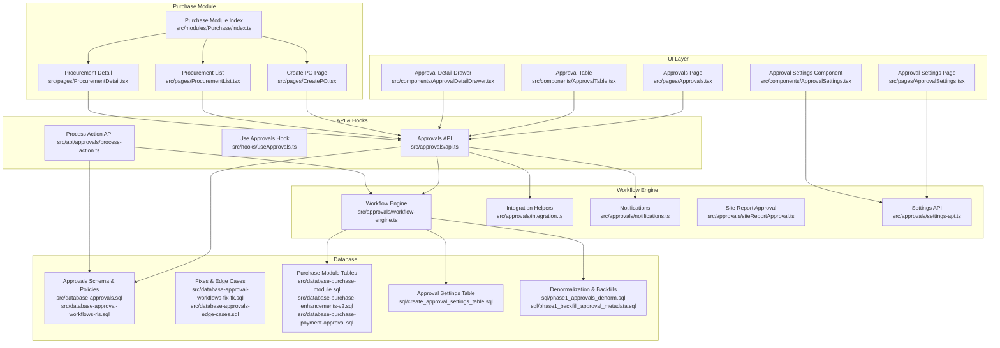
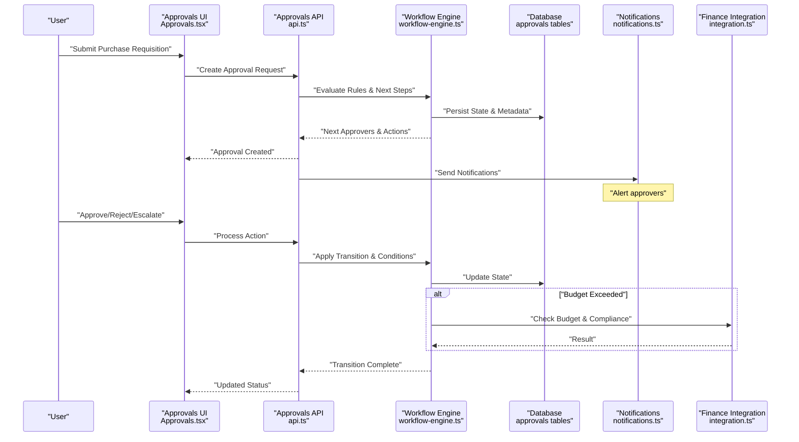
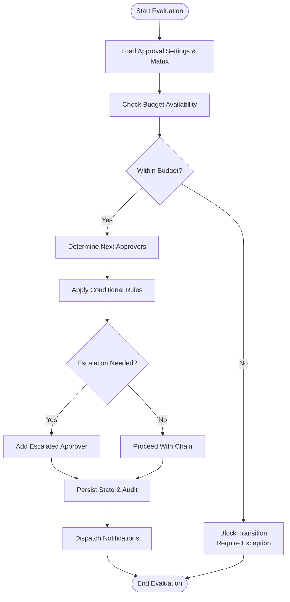
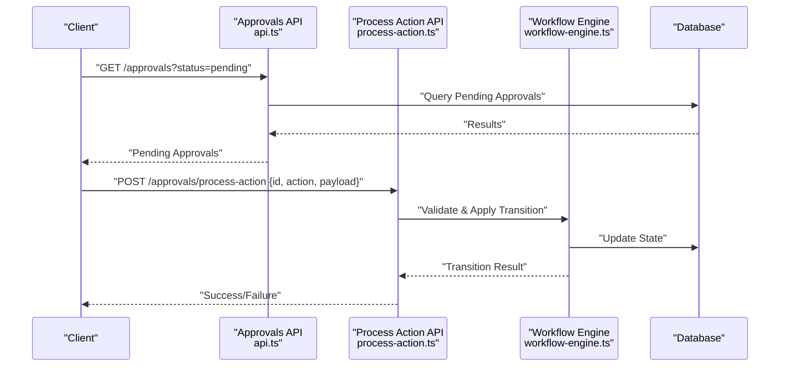
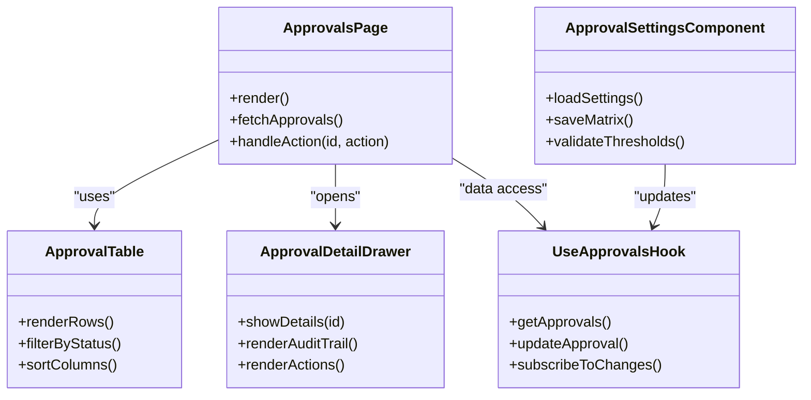
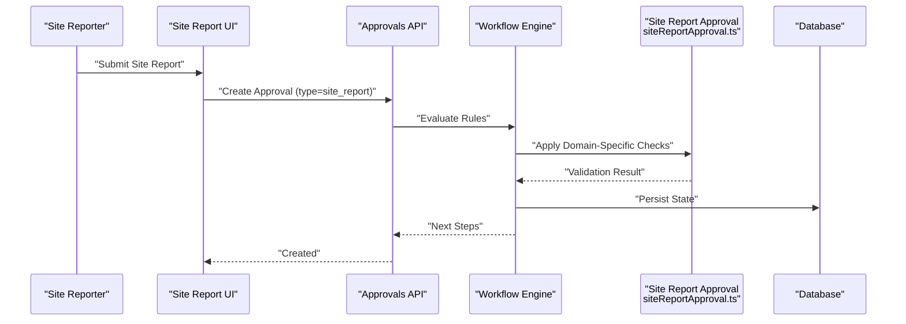
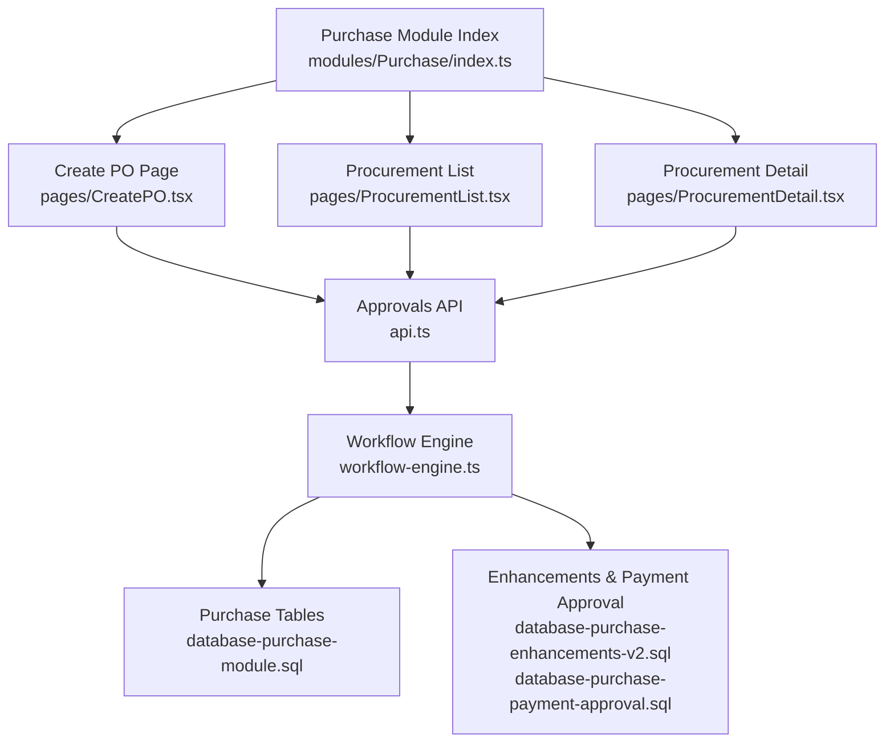
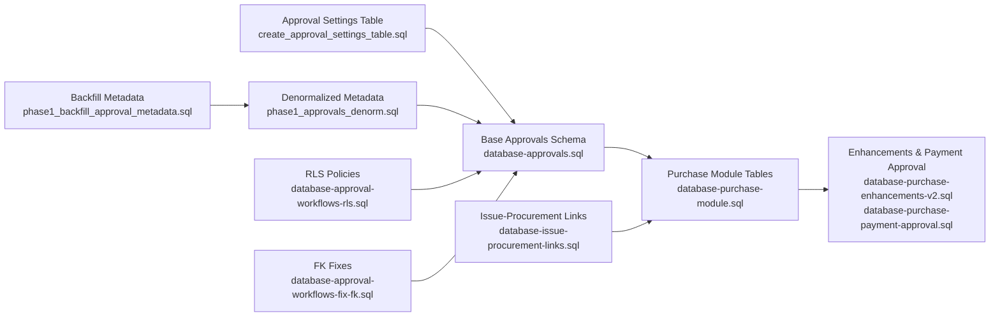

# Procurement Workflows

<cite>
**Referenced Files in This Document**
- [workflow-engine.ts](file://src/approvals/workflow-engine.ts)
- [api.ts](file://src/approvals/api.ts)
- [integration.ts](file://src/approvals/integration.ts)
- [notifications.ts](file://src/approvals/notifications.ts)
- [settings-api.ts](file://src/approvals/settings-api.ts)
- [siteReportApproval.ts](file://src/approvals/siteReportApproval.ts)
- [process-action.ts](file://src/api/approvals/process-action.ts)
- [useApprovals.ts](file://src/hooks/useApprovals.ts)
- [ApprovalSettings.tsx](file://src/components/ApprovalSettings.tsx)
- [ApprovalTable.tsx](file://src/components/ApprovalTable.tsx)
- [ApprovalDetailDrawer.tsx](file://src/components/ApprovalDetailDrawer.tsx)
- [Approvals.tsx](file://src/pages/Approvals.tsx)
- [ApprovalSettings.tsx](file://src/pages/ApprovalSettings.tsx)
- [create_approval_settings_table.sql](file://sql/create_approval_settings_table.sql)
- [phase1_approvals_denorm.sql](file://sql/phase1_approvals_denorm.sql)
- [phase1_backfill_approval_metadata.sql](file://sql/phase1_backfill_approval_metadata.sql)
- [database-approval-workflows-fix-fk.sql](file://src/database-approval-workflows-fix-fk.sql)
- [database-approval-workflows-rls.sql](file://src/database-approval-workflows-rls.sql)
- [database-approval.sql](file://src/database-approval.sql)
- [database-approvals-edge-cases.sql](file://src/database-approvals-edge-cases.sql)
- [database-approvals.sql](file://src/database-approvals.sql)
- [database-issue-procurement-links.sql](file://src/database-issue-procurement-links.sql)
- [database-purchase-module.sql](file://src/database-purchase-module.sql)
- [database-purchase-enhancements-v2.sql](file://src/database-purchase-enhancements-v2.sql)
- [database-purchase-payment-approval.sql](file://src/database-purchase-payment-approval.sql)
- [modules/Purchase/index.ts](file://src/modules/Purchase/index.ts)
- [pages/CreatePO.tsx](file://src/pages/CreatePO.tsx)
- [pages/ProcurementList.tsx](file://src/pages/ProcurementList.tsx)
- [pages/ProcurementDetail.tsx](file://src/pages/ProcurementDetail.tsx)
</cite>

## Table of Contents
1. [Introduction](#introduction)
2. [Project Structure](#project-structure)
3. [Core Components](#core-components)
4. [Architecture Overview](#architecture-overview)
5. [Detailed Component Analysis](#detailed-component-analysis)
6. [Dependency Analysis](#dependency-analysis)
7. [Performance Considerations](#performance-considerations)
8. [Troubleshooting Guide](#troubleshooting-guide)
9. [Conclusion](#conclusion)
10. [Appendices](#appendices)

## Introduction
This document explains the procurement workflow automation and business process management implemented in the application. It covers multi-stage approval workflows, budget controls, authorization matrices, automated purchase requisition generation, vendor selection algorithms, price comparison tools, customization options, conditional approvals, escalation procedures, configuration examples, exception handling, and integration with financial systems for budget monitoring and compliance enforcement.

The system is centered around a configurable approval engine that orchestrates state transitions, enforces policy rules (budget and authorization), and integrates with notifications and downstream financial modules.

## Project Structure
The procurement and approval capabilities are implemented across several layers:
- Approval engine and API layer for orchestration and persistence
- UI components and pages for configuring and operating approvals
- Database migrations defining schemas, constraints, and RLS policies
- Purchase module integration linking procurement documents to approvals

**Diagram sources**
- [workflow-engine.ts](file://src/approvals/workflow-engine.ts)
- [api.ts](file://src/approvals/api.ts)
- [integration.ts](file://src/approvals/integration.ts)
- [notifications.ts](file://src/approvals/notifications.ts)
- [settings-api.ts](file://src/approvals/settings-api.ts)
- [siteReportApproval.ts](file://src/approvals/siteReportApproval.ts)
- [process-action.ts](file://src/api/approvals/process-action.ts)
- [useApprovals.ts](file://src/hooks/useApprovals.ts)
- [ApprovalSettings.tsx](file://src/components/ApprovalSettings.tsx)
- [ApprovalTable.tsx](file://src/components/ApprovalTable.tsx)
- [ApprovalDetailDrawer.tsx](file://src/components/ApprovalDetailDrawer.tsx)
- [Approvals.tsx](file://src/pages/Approvals.tsx)
- [ApprovalSettings.tsx](file://src/pages/ApprovalSettings.tsx)
- [create_approval_settings_table.sql](file://sql/create_approval_settings_table.sql)
- [phase1_approvals_denorm.sql](file://sql/phase1_approvals_denorm.sql)
- [phase1_backfill_approval_metadata.sql](file://sql/phase1_backfill_approval_metadata.sql)
- [database-approval-workflows-fix-fk.sql](file://src/database-approval-workflows-fix-fk.sql)
- [database-approval-workflows-rls.sql](file://src/database-approval-workflows-rls.sql)
- [database-approval.sql](file://src/database-approval.sql)
- [database-approvals-edge-cases.sql](file://src/database-approvals-edge-cases.sql)
- [database-approvals.sql](file://src/database-approvals.sql)
- [database-issue-procurement-links.sql](file://src/database-issue-procurement-links.sql)
- [database-purchase-module.sql](file://src/database-purchase-module.sql)
- [database-purchase-enhancements-v2.sql](file://src/database-purchase-enhancements-v2.sql)
- [database-purchase-payment-approval.sql](file://src/database-purchase-payment-approval.sql)
- [modules/Purchase/index.ts](file://src/modules/Purchase/index.ts)
- [pages/CreatePO.tsx](file://src/pages/CreatePO.tsx)
- [pages/ProcurementList.tsx](file://src/pages/ProcurementList.tsx)
- [pages/ProcurementDetail.tsx](file://src/pages/ProcurementDetail.tsx)

**Section sources**
- [workflow-engine.ts](file://src/approvals/workflow-engine.ts)
- [api.ts](file://src/approvals/api.ts)
- [integration.ts](file://src/approvals/integration.ts)
- [notifications.ts](file://src/approvals/notifications.ts)
- [settings-api.ts](file://src/approvals/settings-api.ts)
- [siteReportApproval.ts](file://src/approvals/siteReportApproval.ts)
- [process-action.ts](file://src/api/approvals/process-action.ts)
- [useApprovals.ts](file://src/hooks/useApprovals.ts)
- [ApprovalSettings.tsx](file://src/components/ApprovalSettings.tsx)
- [ApprovalTable.tsx](file://src/components/ApprovalTable.tsx)
- [ApprovalDetailDrawer.tsx](file://src/components/ApprovalDetailDrawer.tsx)
- [Approvals.tsx](file://src/pages/Approvals.tsx)
- [ApprovalSettings.tsx](file://src/pages/ApprovalSettings.tsx)
- [create_approval_settings_table.sql](file://sql/create_approval_settings_table.sql)
- [phase1_approvals_denorm.sql](file://sql/phase1_approvals_denorm.sql)
- [phase1_backfill_approval_metadata.sql](file://sql/phase1_backfill_approval_metadata.sql)
- [database-approval-workflows-fix-fk.sql](file://src/database-approval-workflows-fix-fk.sql)
- [database-approval-workflows-rls.sql](file://src/database-approval-workflows-rls.sql)
- [database-approval.sql](file://src/database-approval.sql)
- [database-approvals-edge-cases.sql](file://src/database-approvals-edge-cases.sql)
- [database-approvals.sql](file://src/database-approvals.sql)
- [database-issue-procurement-links.sql](file://src/database-issue-procurement-links.sql)
- [database-purchase-module.sql](file://src/database-purchase-module.sql)
- [database-purchase-enhancements-v2.sql](file://src/database-purchase-enhancements-v2.sql)
- [database-purchase-payment-approval.sql](file://src/database-purchase-payment-approval.sql)
- [modules/Purchase/index.ts](file://src/modules/Purchase/index.ts)
- [pages/CreatePO.tsx](file://src/pages/CreatePO.tsx)
- [pages/ProcurementList.tsx](file://src/pages/ProcurementList.tsx)
- [pages/ProcurementDetail.tsx](file://src/pages/ProcurementDetail.tsx)

## Core Components
- Approval Workflow Engine: Central logic for evaluating conditions, determining next steps, enforcing budget checks, and transitioning states.
- Approvals API: Endpoints to create, query, update, and process approvals; integrates with the workflow engine.
- Integration Helpers: Utilities for connecting approvals to external or internal systems (e.g., ERP, finance).
- Notifications: Dispatching alerts and messages when approvals are created, updated, escalated, or completed.
- Settings API: CRUD operations for approval settings and authorization matrices.
- Site Report Approval: Specialized workflow for site report approvals, demonstrating domain-specific rules.
- Process Action API: Dedicated endpoint to execute user actions (approve/reject/escalate) with validation and side effects.
- UI Components and Pages: Interfaces for viewing pending approvals, reviewing details, and configuring approval settings.

Key responsibilities:
- Multi-stage approvals with configurable chains
- Budget control checks before transitions
- Authorization matrix evaluation by role, department, amount thresholds
- Automated triggers for purchase requisitions and PO creation
- Vendor selection and price comparison hooks
- Escalation and conditional routing
- Auditability and compliance logging

**Section sources**
- [workflow-engine.ts](file://src/approvals/workflow-engine.ts)
- [api.ts](file://src/approvals/api.ts)
- [integration.ts](file://src/approvals/integration.ts)
- [notifications.ts](file://src/approvals/notifications.ts)
- [settings-api.ts](file://src/approvals/settings-api.ts)
- [siteReportApproval.ts](file://src/approvals/siteReportApproval.ts)
- [process-action.ts](file://src/api/approvals/process-action.ts)
- [useApprovals.ts](file://src/hooks/useApprovals.ts)
- [ApprovalSettings.tsx](file://src/components/ApprovalSettings.tsx)
- [ApprovalTable.tsx](file://src/components/ApprovalTable.tsx)
- [ApprovalDetailDrawer.tsx](file://src/components/ApprovalDetailDrawer.tsx)
- [Approvals.tsx](file://src/pages/Approvals.tsx)
- [ApprovalSettings.tsx](file://src/pages/ApprovalSettings.tsx)

## Architecture Overview
The procurement workflow architecture separates concerns between UI, API, workflow engine, integrations, and data. The workflow engine acts as the central coordinator, applying policy rules and orchestrating transitions while persisting state and emitting events for notifications and downstream processes.

**Diagram sources**
- [api.ts](file://src/approvals/api.ts)
- [workflow-engine.ts](file://src/approvals/workflow-engine.ts)
- [notifications.ts](file://src/approvals/notifications.ts)
- [integration.ts](file://src/approvals/integration.ts)
- [Approvals.tsx](file://src/pages/Approvals.tsx)
- [database-approvals.sql](file://src/database-approvals.sql)

## Detailed Component Analysis

### Approval Workflow Engine
Responsibilities:
- Evaluate authorization matrices and budget thresholds
- Determine next approver(s) based on configured chains
- Enforce conditional approvals and escalation rules
- Persist audit trails and metadata
- Trigger downstream actions (e.g., create PO, notify stakeholders)

**Diagram sources**
- [workflow-engine.ts](file://src/approvals/workflow-engine.ts)
- [settings-api.ts](file://src/approvals/settings-api.ts)
- [notifications.ts](file://src/approvals/notifications.ts)
- [create_approval_settings_table.sql](file://sql/create_approval_settings_table.sql)

**Section sources**
- [workflow-engine.ts](file://src/approvals/workflow-engine.ts)
- [settings-api.ts](file://src/approvals/settings-api.ts)
- [notifications.ts](file://src/approvals/notifications.ts)
- [create_approval_settings_table.sql](file://sql/create_approval_settings_table.sql)

### Approvals API and Process Action Endpoint
Responsibilities:
- Create, read, update, and delete approval requests
- Validate inputs and enforce RBAC
- Execute transitions via the workflow engine
- Return actionable metadata (next steps, required fields)
- Provide dedicated action processing with idempotency and error handling

**Diagram sources**
- [api.ts](file://src/approvals/api.ts)
- [process-action.ts](file://src/api/approvals/process-action.ts)
- [workflow-engine.ts](file://src/approvals/workflow-engine.ts)
- [database-approvals.sql](file://src/database-approvals.sql)

**Section sources**
- [api.ts](file://src/approvals/api.ts)
- [process-action.ts](file://src/api/approvals/process-action.ts)
- [workflow-engine.ts](file://src/approvals/workflow-engine.ts)
- [database-approvals.sql](file://src/database-approvals.sql)

### UI Components and Pages
Responsibilities:
- Display pending approvals and details
- Allow users to approve, reject, escalate, or request changes
- Configure approval settings and authorization matrices
- Integrate with hooks for real-time updates

**Diagram sources**
- [Approvals.tsx](file://src/pages/Approvals.tsx)
- [ApprovalTable.tsx](file://src/components/ApprovalTable.tsx)
- [ApprovalDetailDrawer.tsx](file://src/components/ApprovalDetailDrawer.tsx)
- [ApprovalSettings.tsx](file://src/components/ApprovalSettings.tsx)
- [useApprovals.ts](file://src/hooks/useApprovals.ts)

**Section sources**
- [Approvals.tsx](file://src/pages/Approvals.tsx)
- [ApprovalTable.tsx](file://src/components/ApprovalTable.tsx)
- [ApprovalDetailDrawer.tsx](file://src/components/ApprovalDetailDrawer.tsx)
- [ApprovalSettings.tsx](file://src/components/ApprovalSettings.tsx)
- [useApprovals.ts](file://src/hooks/useApprovals.ts)

### Site Report Approval
Specialized workflow for site reports:
- Applies domain-specific rules (e.g., safety checks, photo attachments)
- Integrates with general approval engine for routing and escalation
- Ensures compliance with project-level policies

**Diagram sources**
- [siteReportApproval.ts](file://src/approvals/siteReportApproval.ts)
- [workflow-engine.ts](file://src/approvals/workflow-engine.ts)
- [api.ts](file://src/approvals/api.ts)
- [database-approvals.sql](file://src/database-approvals.sql)

**Section sources**
- [siteReportApproval.ts](file://src/approvals/siteReportApproval.ts)
- [workflow-engine.ts](file://src/approvals/workflow-engine.ts)
- [api.ts](file://src/approvals/api.ts)
- [database-approvals.sql](file://src/database-approvals.sql)

### Purchase Module Integration
Responsibilities:
- Link procurement documents (requisitions, POs) to approval workflows
- Automate PO creation upon final approval
- Enforce payment approval workflows and budget checks
- Provide list and detail views for procurement items

**Diagram sources**
- [modules/Purchase/index.ts](file://src/modules/Purchase/index.ts)
- [pages/CreatePO.tsx](file://src/pages/CreatePO.tsx)
- [pages/ProcurementList.tsx](file://src/pages/ProcurementList.tsx)
- [pages/ProcurementDetail.tsx](file://src/pages/ProcurementDetail.tsx)
- [api.ts](file://src/approvals/api.ts)
- [workflow-engine.ts](file://src/approvals/workflow-engine.ts)
- [database-purchase-module.sql](file://src/database-purchase-module.sql)
- [database-purchase-enhancements-v2.sql](file://src/database-purchase-enhancements-v2.sql)
- [database-purchase-payment-approval.sql](file://src/database-purchase-payment-approval.sql)

**Section sources**
- [modules/Purchase/index.ts](file://src/modules/Purchase/index.ts)
- [pages/CreatePO.tsx](file://src/pages/CreatePO.tsx)
- [pages/ProcurementList.tsx](file://src/pages/ProcurementList.tsx)
- [pages/ProcurementDetail.tsx](file://src/pages/ProcurementDetail.tsx)
- [api.ts](file://src/approvals/api.ts)
- [workflow-engine.ts](file://src/approvals/workflow-engine.ts)
- [database-purchase-module.sql](file://src/database-purchase-module.sql)
- [database-purchase-enhancements-v2.sql](file://src/database-purchase-enhancements-v2.sql)
- [database-purchase-payment-approval.sql](file://src/database-purchase-payment-approval.sql)

## Dependency Analysis
The procurement workflow depends on:
- Approval settings and authorization matrices stored in database tables
- Denormalized approval metadata for performance
- RLS policies ensuring secure access
- Purchase module tables for linking procurement documents
- Issue-to-procurement links for traceability

**Diagram sources**
- [create_approval_settings_table.sql](file://sql/create_approval_settings_table.sql)
- [phase1_approvals_denorm.sql](file://sql/phase1_approvals_denorm.sql)
- [phase1_backfill_approval_metadata.sql](file://sql/phase1_backfill_approval_metadata.sql)
- [database-approval-workflows-rls.sql](file://src/database-approval-workflows-rls.sql)
- [database-approval-workflows-fix-fk.sql](file://src/database-approval-workflows-fix-fk.sql)
- [database-approvals.sql](file://src/database-approvals.sql)
- [database-purchase-module.sql](file://src/database-purchase-module.sql)
- [database-purchase-enhancements-v2.sql](file://src/database-purchase-enhancements-v2.sql)
- [database-purchase-payment-approval.sql](file://src/database-purchase-payment-approval.sql)
- [database-issue-procurement-links.sql](file://src/database-issue-procurement-links.sql)

**Section sources**
- [create_approval_settings_table.sql](file://sql/create_approval_settings_table.sql)
- [phase1_approvals_denorm.sql](file://sql/phase1_approvals_denorm.sql)
- [phase1_backfill_approval_metadata.sql](file://sql/phase1_backfill_approval_metadata.sql)
- [database-approval-workflows-rls.sql](file://src/database-approval-workflows-rls.sql)
- [database-approval-workflows-fix-fk.sql](file://src/database-approval-workflows-fix-fk.sql)
- [database-approvals.sql](file://src/database-approvals.sql)
- [database-purchase-module.sql](file://src/database-purchase-module.sql)
- [database-purchase-enhancements-v2.sql](file://src/database-purchase-enhancements-v2.sql)
- [database-purchase-payment-approval.sql](file://src/database-purchase-payment-approval.sql)
- [database-issue-procurement-links.sql](file://src/database-issue-procurement-links.sql)

## Performance Considerations
- Denormalized approval metadata improves query performance for listing and filtering approvals.
- Backfill scripts ensure consistency of denormalized fields after schema changes.
- RLS policies reduce unnecessary data exposure and improve security without heavy client-side filtering.
- Pagination and selective field retrieval in UI components minimize payload sizes.
- Idempotent action processing prevents duplicate transitions and reduces retry overhead.

[No sources needed since this section provides general guidance]

## Troubleshooting Guide
Common issues and resolutions:
- Missing foreign key references: Ensure FK fixes are applied to maintain referential integrity.
- Incorrect RLS policies: Verify policies allow intended roles to read/write approvals.
- Inconsistent denormalized fields: Run backfill scripts to synchronize metadata.
- Action failures: Inspect process-action logs and validate transition conditions.
- Notification delivery problems: Check notification service connectivity and templates.

**Section sources**
- [database-approval-workflows-fix-fk.sql](file://src/database-approval-workflows-fix-fk.sql)
- [database-approval-workflows-rls.sql](file://src/database-approval-workflows-rls.sql)
- [phase1_backfill_approval_metadata.sql](file://sql/phase1_backfill_approval_metadata.sql)
- [process-action.ts](file://src/api/approvals/process-action.ts)
- [notifications.ts](file://src/approvals/notifications.ts)

## Conclusion
The procurement workflow system provides a robust, configurable foundation for multi-stage approvals, budget controls, and authorization matrices. It integrates seamlessly with the purchase module, supports conditional approvals and escalations, and includes mechanisms for notifications and compliance enforcement. By leveraging denormalized metadata and strong RLS policies, the system balances performance and security while remaining extensible for future enhancements.

[No sources needed since this section summarizes without analyzing specific files]

## Appendices

### Example Workflow Configurations
- Approval Chains: Define sequential or parallel approvers based on amount thresholds and departments.
- Conditional Approvals: Route to additional reviewers if certain criteria are met (e.g., high-risk vendors).
- Escalation Procedures: Automatically escalate to higher authorities if approvals are not acted upon within SLAs.

[No sources needed since this section doesn't analyze specific files]

### Integration with Financial Systems
- Budget Monitoring: Real-time checks against available budgets before transitions.
- Compliance Enforcement: Policy checks for regulatory requirements and internal controls.
- Downstream Actions: Automatic creation of POs and payment approvals upon final approval.

[No sources needed since this section doesn't analyze specific files]