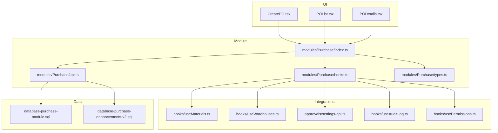
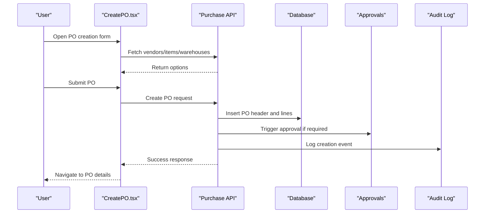
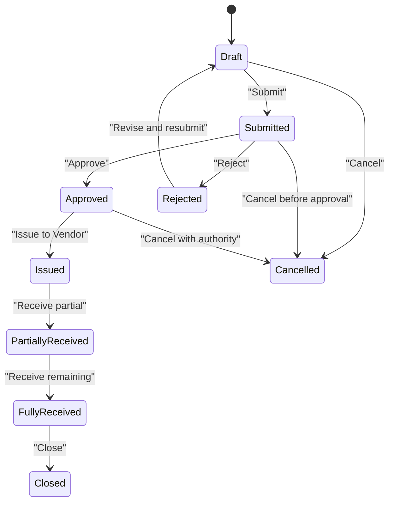
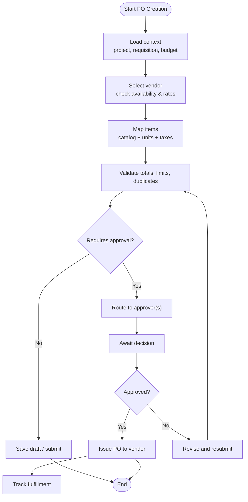
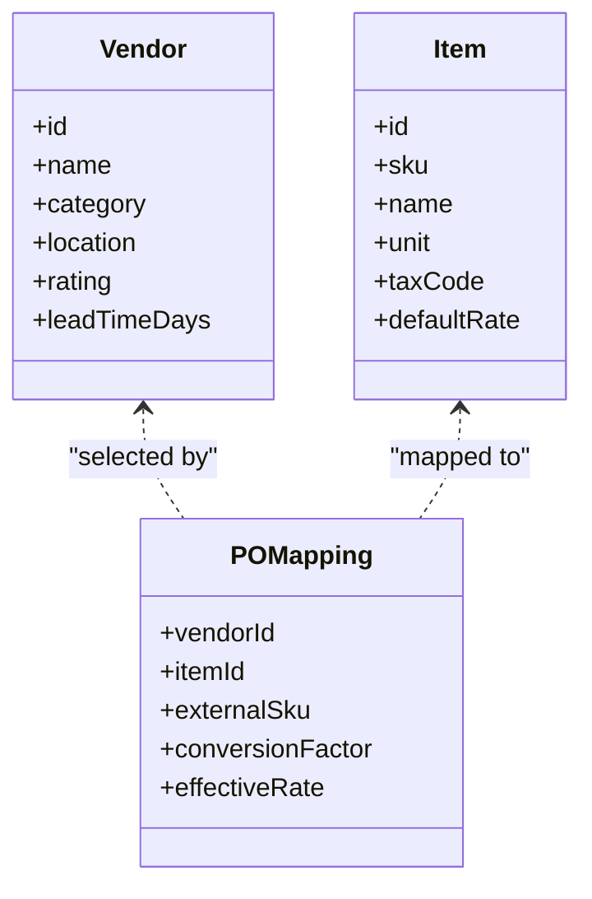
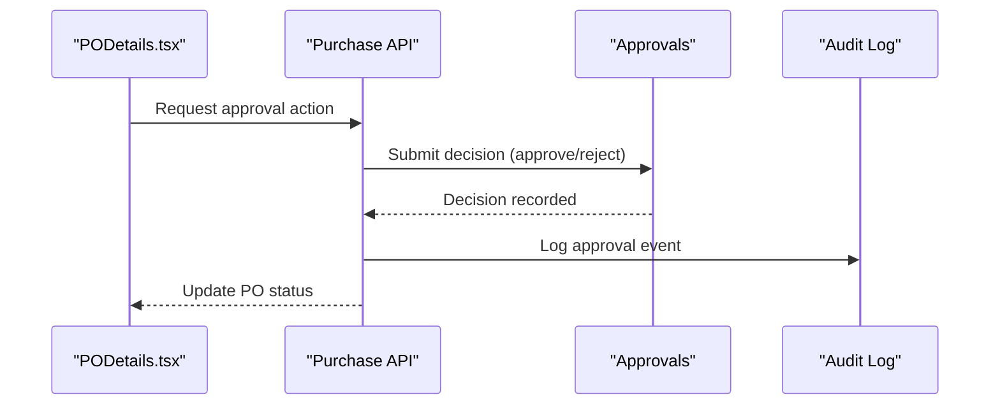
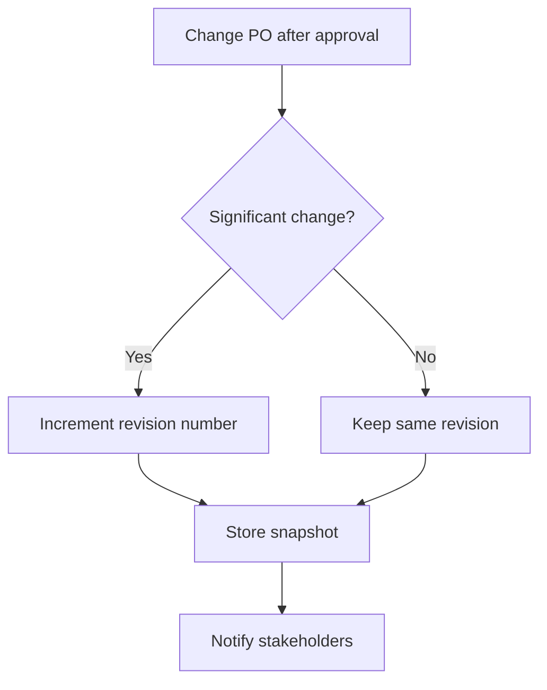
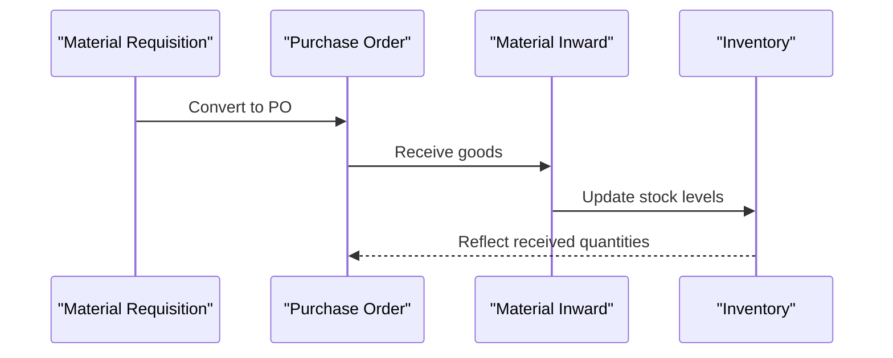
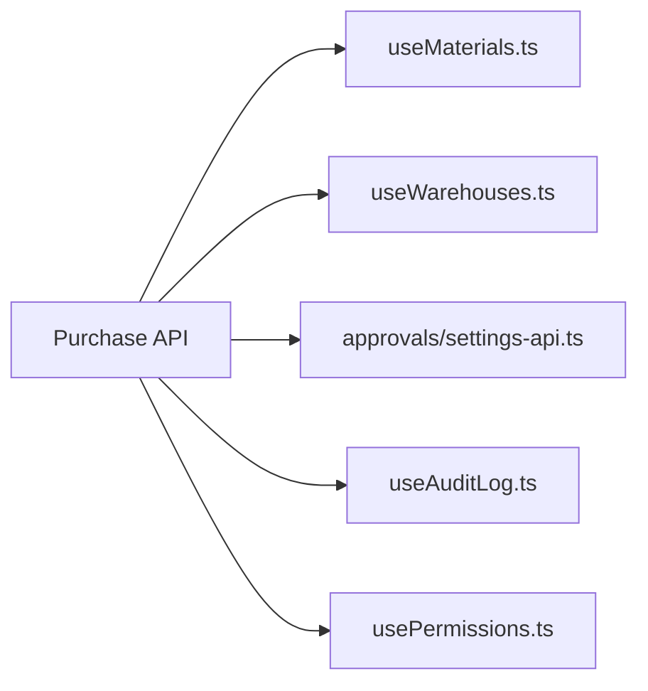

# Purchase Order Management

<cite>
**Referenced Files in This Document**
- [CreatePO.tsx](file://src/pages/CreatePO.tsx)
- [POList.tsx](file://src/pages/POList.tsx)
- [PODetails.tsx](file://src/pages/PODetails.tsx)
- [Purchase Module Index](file://src/modules/Purchase/index.ts)
- [Purchase API](file://src/modules/Purchase/api.ts)
- [Purchase Hooks](file://src/modules/Purchase/hooks.ts)
- [Purchase Types](file://src/modules/Purchase/types.ts)
- [Database Setup](file://src/database-setup.sql)
- [Purchase Module SQL](file://src/database-purchase-module.sql)
- [Purchase Enhancements V2](file://src/database-purchase-enhancements-v2.sql)
- [Material Inward](file://src/pages/MaterialInward.tsx)
- [Material Usage Tracker](file://src/pages/MaterialUsageTracker.tsx)
- [Use Materials Hook](file://src/hooks/useMaterials.ts)
- [Use Warehouses Hook](file://src/hooks/useWarehouses.ts)
- [Approval Settings](file://src/approvals/settings-api.ts)
- [Audit Log Hook](file://src/hooks/useAuditLog.ts)
- [Permissions Hook](file://src/hooks/usePermissions.ts)
</cite>

## Table of Contents
1. [Introduction](#introduction)
2. [Project Structure](#project-structure)
3. [Core Components](#core-components)
4. [Architecture Overview](#architecture-overview)
5. [Detailed Component Analysis](#detailed-component-analysis)
6. [Dependency Analysis](#dependency-analysis)
7. [Performance Considerations](#performance-considerations)
8. [Troubleshooting Guide](#troubleshooting-guide)
9. [Conclusion](#conclusion)

## Introduction
This document describes the end-to-end purchase order (PO) management system, covering creation workflows, vendor selection, item mapping, approval processes, status management, revision tracking, and integration with material requisitions and inventory. It also details user interface components for editing and validation, bulk operations, queries, reporting, error handling, audit trails, and compliance requirements.

## Project Structure
The PO feature spans UI pages, a dedicated module, hooks, types, and database migrations:
- Pages: Create, List, Details
- Module: API, hooks, types, and shared logic
- Database: schema and enhancements for POs, approvals, and integrations
- Integrations: materials, warehouses, approvals, audit logs, permissions

**Diagram sources**
- [CreatePO.tsx](file://src/pages/CreatePO.tsx)
- [POList.tsx](file://src/pages/POList.tsx)
- [PODetails.tsx](file://src/pages/PODetails.tsx)
- [Purchase Module Index](file://src/modules/Purchase/index.ts)
- [Purchase API](file://src/modules/Purchase/api.ts)
- [Purchase Hooks](file://src/modules/Purchase/hooks.ts)
- [Purchase Types](file://src/modules/Purchase/types.ts)
- [Purchase Module SQL](file://src/database-purchase-module.sql)
- [Purchase Enhancements V2](file://src/database-purchase-enhancements-v2.sql)
- [Use Materials Hook](file://src/hooks/useMaterials.ts)
- [Use Warehouses Hook](file://src/hooks/useWarehouses.ts)
- [Approval Settings](file://src/approvals/settings-api.ts)
- [Audit Log Hook](file://src/hooks/useAuditLog.ts)
- [Permissions Hook](file://src/hooks/usePermissions.ts)

**Section sources**
- [CreatePO.tsx](file://src/pages/CreatePO.tsx)
- [POList.tsx](file://src/pages/POList.tsx)
- [PODetails.tsx](file://src/pages/PODetails.tsx)
- [Purchase Module Index](file://src/modules/Purchase/index.ts)
- [Purchase API](file://src/modules/Purchase/api.ts)
- [Purchase Hooks](file://src/modules/Purchase/hooks.ts)
- [Purchase Types](file://src/modules/Purchase/types.ts)
- [Purchase Module SQL](file://src/database-purchase-module.sql)
- [Purchase Enhancements V2](file://src/database-purchase-enhancements-v2.sql)

## Core Components
- PO Creation Page: Orchestrates form state, validations, vendor/item selection, and submission to the backend via the module API.
- PO List Page: Provides filtering, sorting, pagination, and bulk actions (approve, submit, cancel).
- PO Details Page: Displays full PO data, line items, approvals, revisions, and links to related documents (material inward, usage).
- Module API: Encapsulates CRUD operations, status transitions, and approval triggers.
- Module Hooks: Provide typed access to PO data, caching, optimistic updates, and integration with materials/warehouses.
- Types: Centralized TypeScript definitions for PO headers, lines, statuses, and relations.
- Database Schemas: Define tables, constraints, indexes, and relationships for POs, approvals, and integrations.

Key responsibilities:
- Validation rules enforced at UI and API layers
- Status lifecycle enforcement with permission checks
- Audit logging on critical mutations
- Approval workflow integration
- Material requisition linkage and fulfillment tracking

**Section sources**
- [CreatePO.tsx](file://src/pages/CreatePO.tsx)
- [POList.tsx](file://src/pages/POList.tsx)
- [PODetails.tsx](file://src/pages/PODetails.tsx)
- [Purchase API](file://src/modules/Purchase/api.ts)
- [Purchase Hooks](file://src/modules/Purchase/hooks.ts)
- [Purchase Types](file://src/modules/Purchase/types.ts)
- [Purchase Module SQL](file://src/database-purchase-module.sql)
- [Purchase Enhancements V2](file://src/database-purchase-enhancements-v2.sql)

## Architecture Overview
The PO system follows a layered architecture:
- Presentation Layer: React pages for create, list, and detail views
- Domain Layer: Module index coordinating API, hooks, and types
- Integration Layer: External services for materials, warehouses, approvals, audit logs, and permissions
- Data Layer: Database schemas and migrations defining entities and relationships

**Diagram sources**
- [CreatePO.tsx](file://src/pages/CreatePO.tsx)
- [Purchase API](file://src/modules/Purchase/api.ts)
- [Purchase Module SQL](file://src/database-purchase-module.sql)
- [Approval Settings](file://src/approvals/settings-api.ts)
- [Audit Log Hook](file://src/hooks/useAuditLog.ts)

## Detailed Component Analysis

### PO Lifecycle and State Machine
The PO lifecycle includes states such as Draft, Submitted, Approved, Issued, Partially Received, Fully Received, Cancelled, and Rejected. Transitions are governed by permissions and approval outcomes.

**Diagram sources**
- [Purchase Types](file://src/modules/Purchase/types.ts)
- [Purchase API](file://src/modules/Purchase/api.ts)
- [Purchase Enhancements V2](file://src/database-purchase-enhancements-v2.sql)

**Section sources**
- [Purchase Types](file://src/modules/Purchase/types.ts)
- [Purchase API](file://src/modules/Purchase/api.ts)
- [Purchase Enhancements V2](file://src/database-purchase-enhancements-v2.sql)

### PO Creation Workflow
- Pre-population from material requisitions or project scopes
- Vendor selection with rate history and performance indicators
- Item mapping to internal catalog with unit conversions and GST settings
- Line-level calculations (qty, rate, taxes, discounts)
- Approval routing based on thresholds and roles
- Audit trail entry on creation

**Diagram sources**
- [CreatePO.tsx](file://src/pages/CreatePO.tsx)
- [Purchase API](file://src/modules/Purchase/api.ts)
- [Approval Settings](file://src/approvals/settings-api.ts)

**Section sources**
- [CreatePO.tsx](file://src/pages/CreatePO.tsx)
- [Purchase API](file://src/modules/Purchase/api.ts)
- [Approval Settings](file://src/approvals/settings-api.ts)

### Vendor Selection and Item Mapping
- Vendor selection supports filters by category, location, lead time, and rating
- Item mapping aligns external SKUs to internal catalogs, handles variants, and applies default pricing and tax codes
- Bulk import/export supported for item lists and vendor mappings

**Diagram sources**
- [Purchase Types](file://src/modules/Purchase/types.ts)
- [Purchase API](file://src/modules/Purchase/api.ts)

**Section sources**
- [Purchase Types](file://src/modules/Purchase/types.ts)
- [Purchase API](file://src/modules/Purchase/api.ts)

### Approval Processes
- Configurable approval matrices by amount, department, and risk
- Multi-step approvals with delegation and escalation
- Notifications and reminders integrated with the approvals subsystem

**Diagram sources**
- [PODetails.tsx](file://src/pages/PODetails.tsx)
- [Purchase API](file://src/modules/Purchase/api.ts)
- [Approval Settings](file://src/approvals/settings-api.ts)
- [Audit Log Hook](file://src/hooks/useAuditLog.ts)

**Section sources**
- [PODetails.tsx](file://src/pages/PODetails.tsx)
- [Purchase API](file://src/modules/Purchase/api.ts)
- [Approval Settings](file://src/approvals/settings-api.ts)
- [Audit Log Hook](file://src/hooks/useAuditLog.ts)

### Status Management and Revision Tracking
- Status transitions enforced by role-based permissions
- Revision numbers auto-incremented on significant changes after approval
- Versioned snapshots stored for auditability

**Diagram sources**
- [Purchase Types](file://src/modules/Purchase/types.ts)
- [Purchase API](file://src/modules/Purchase/api.ts)

**Section sources**
- [Purchase Types](file://src/modules/Purchase/types.ts)
- [Purchase API](file://src/modules/Purchase/api.ts)

### Integration with Material Requisitions and Inventory
- Link POs to material requisitions for traceability
- Fulfillment tracked via material inward entries
- Inventory updates upon receipt confirmation

**Diagram sources**
- [Material Inward](file://src/pages/MaterialInward.tsx)
- [Material Usage Tracker](file://src/pages/MaterialUsageTracker.tsx)
- [Use Materials Hook](file://src/hooks/useMaterials.ts)
- [Use Warehouses Hook](file://src/hooks/useWarehouses.ts)

**Section sources**
- [Material Inward](file://src/pages/MaterialInward.tsx)
- [Material Usage Tracker](file://src/pages/MaterialUsageTracker.tsx)
- [Use Materials Hook](file://src/hooks/useMaterials.ts)
- [Use Warehouses Hook](file://src/hooks/useWarehouses.ts)

### User Interface Components and Validation Rules
- Form fields include vendor, dates, delivery terms, payment terms, and notes
- Line items support quantity, rate, discount, tax, and extended amount
- Validation rules:
  - Required fields: vendor, date, at least one line item
  - Numeric constraints: positive qty/rate, valid currency formatting
  - Duplicate prevention: unique SKU per vendor per PO
  - Budget checks against project allocations
  - Approval threshold checks

Bulk operations:
- Batch approve/reject multiple POs
- Export/import POs in CSV/Excel formats
- Mass update statuses for approved batches

**Section sources**
- [CreatePO.tsx](file://src/pages/CreatePO.tsx)
- [POList.tsx](file://src/pages/POList.tsx)
- [PODetails.tsx](file://src/pages/PODetails.tsx)

### Queries and Reporting
Common query patterns:
- Filter by status, vendor, date range, project, warehouse
- Aggregate totals by vendor and month
- Track fulfillment progress per PO and line item
- Identify overdue deliveries and pending approvals

Reporting capabilities:
- Spend analysis by vendor and category
- PO cycle time metrics
- Utilization vs. budget
- Compliance reports for approvals and audit trails

**Section sources**
- [POList.tsx](file://src/pages/POList.tsx)
- [Purchase API](file://src/modules/Purchase/api.ts)
- [Purchase Enhancements V2](file://src/database-purchase-enhancements-v2.sql)

### Error Handling, Audit Trails, and Compliance
Error handling:
- Client-side validation errors surfaced inline
- Server-side errors mapped to user-friendly messages
- Retry mechanisms for network failures with backoff

Audit trails:
- Immutable log entries for create/update/approve/cancel actions
- Actor identification and timestamps
- Change diffs for significant edits

Compliance:
- Role-based access control enforced at UI and API layers
- Approval matrix adherence and escalation policies
- Data retention and export for audits

**Section sources**
- [Audit Log Hook](file://src/hooks/useAuditLog.ts)
- [Permissions Hook](file://src/hooks/usePermissions.ts)
- [Approval Settings](file://src/approvals/settings-api.ts)
- [Purchase API](file://src/modules/Purchase/api.ts)

## Dependency Analysis
The PO module depends on:
- Materials and warehouses for item and location data
- Approvals for workflow orchestration
- Audit logs for compliance
- Permissions for access control

**Diagram sources**
- [Purchase API](file://src/modules/Purchase/api.ts)
- [Use Materials Hook](file://src/hooks/useMaterials.ts)
- [Use Warehouses Hook](file://src/hooks/useWarehouses.ts)
- [Approval Settings](file://src/approvals/settings-api.ts)
- [Audit Log Hook](file://src/hooks/useAuditLog.ts)
- [Permissions Hook](file://src/hooks/usePermissions.ts)

**Section sources**
- [Purchase API](file://src/modules/Purchase/api.ts)
- [Use Materials Hook](file://src/hooks/useMaterials.ts)
- [Use Warehouses Hook](file://src/hooks/useWarehouses.ts)
- [Approval Settings](file://src/approvals/settings-api.ts)
- [Audit Log Hook](file://src/hooks/useAuditLog.ts)
- [Permissions Hook](file://src/hooks/usePermissions.ts)

## Performance Considerations
- Use pagination and server-side filtering for large PO lists
- Cache vendor and item lookups to reduce repeated requests
- Debounce search inputs in vendor/item selectors
- Optimize bulk operations with batch endpoints
- Leverage optimistic UI updates for better responsiveness

## Troubleshooting Guide
Common issues and resolutions:
- Approval not triggered: Verify approval settings and thresholds; check permissions
- Duplicate item errors: Ensure unique SKU per vendor per PO; review mapping rules
- Inventory mismatch: Confirm material inward entries and receipt confirmations
- Audit gaps: Inspect audit log hook configuration and write permissions

Diagnostic steps:
- Review client-side validation messages and console logs
- Inspect API responses and error codes
- Check audit trail entries for recent changes
- Validate RBAC roles and approval matrix configurations

**Section sources**
- [Audit Log Hook](file://src/hooks/useAuditLog.ts)
- [Permissions Hook](file://src/hooks/usePermissions.ts)
- [Approval Settings](file://src/approvals/settings-api.ts)
- [Purchase API](file://src/modules/Purchase/api.ts)

## Conclusion
The purchase order management system provides a robust, auditable, and compliant workflow from creation through fulfillment. It integrates closely with materials and inventory, enforces approval policies, and offers comprehensive reporting and bulk operations. The layered architecture ensures maintainability and scalability while supporting complex business rules and user needs.