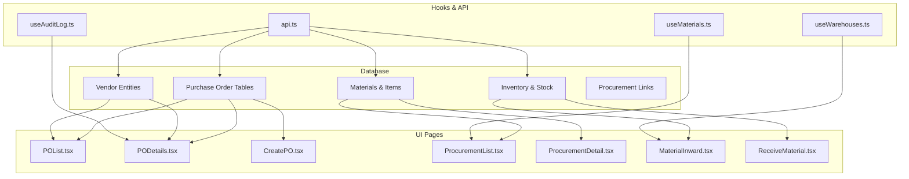
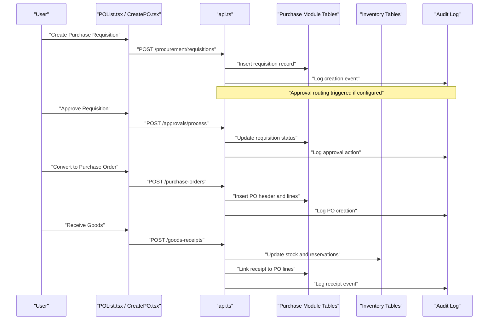
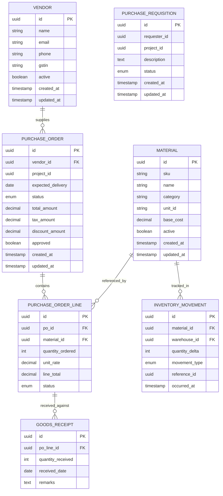
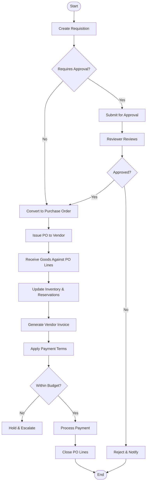
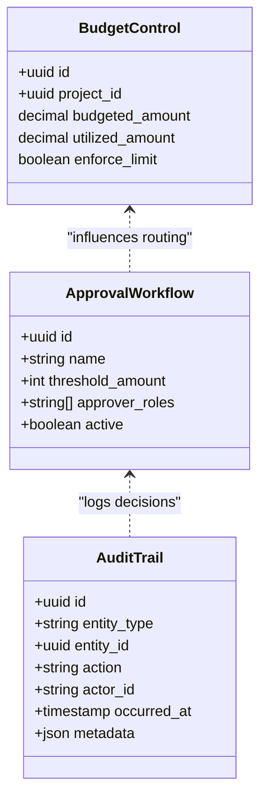
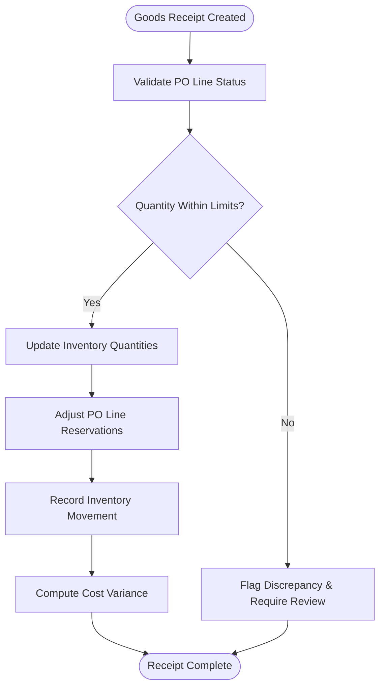
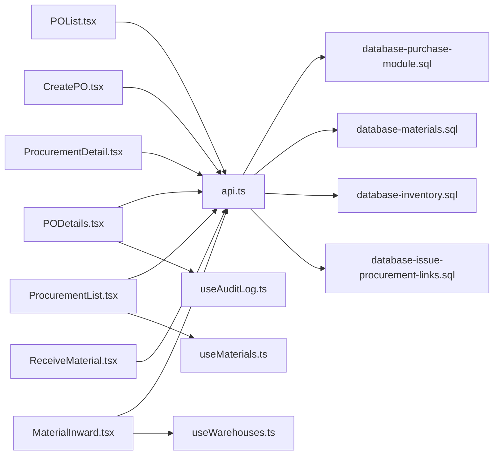

# Purchase Orders & Procurement

<cite>
**Referenced Files in This Document**
- [database-purchase-module.sql](file://src/database-purchase-module.sql)
- [database-purchase-enhancements-v2.sql](file://src/database-purchase-enhancements-v2.sql)
- [database-po-payment-terms.sql](file://src/database-po-payment-terms.sql)
- [database-materials.sql](file://src/database-materials.sql)
- [database-inventory.sql](file://src/database-inventory.sql)
- [database-issue-procurement-links.sql](file://src/database-issue-procurement-links.sql)
- [database-update-po-utilized.sql](file://src/database-update-po-utilized.sql)
- [update_po_tables.sql](file://update_po_tables.sql)
- [migrate_create_po.cjs](file://migrate_create_po.cjs)
- [migrate_vendor.cjs](file://migrate_vendor.cjs)
- [POList.tsx](file://src/pages/POList.tsx)
- [PODetails.tsx](file://src/pages/PODetails.tsx)
- [CreatePO.tsx](file://src/pages/CreatePO.tsx)
- [ProcurementList.tsx](file://src/pages/ProcurementList.tsx)
- [ProcurementDetail.tsx](file://src/pages/ProcurementDetail.tsx)
- [MaterialInward.tsx](file://src/pages/MaterialInward.tsx)
- [ReceiveMaterial.tsx](file://src/pages/ReceiveMaterial.tsx)
- [useMaterials.ts](file://src/hooks/useMaterials.ts)
- [useWarehouses.ts](file://src/hooks/useWarehouses.ts)
- [useAuditLog.ts](file://src/hooks/useAuditLog.ts)
- [api.ts](file://src/api.ts)
- [supabase-tables.sql](file://supabase-tables.sql)
- [supabase/migrations/001_initial_schema.sql](file://supabase/migrations/001_initial_schema.sql)
</cite>

## Table of Contents
1. [Introduction](#introduction)
2. [Project Structure](#project-structure)
3. [Core Components](#core-components)
4. [Architecture Overview](#architecture-overview)
5. [Detailed Component Analysis](#detailed-component-analysis)
6. [Dependency Analysis](#dependency-analysis)
7. [Performance Considerations](#performance-considerations)
8. [Troubleshooting Guide](#troubleshooting-guide)
9. [Conclusion](#conclusion)
10. [Appendices](#appendices)

## Introduction
This document provides a comprehensive data model and workflow guide for the purchase order and procurement system. It covers:
- Purchase order tables, vendor relationships, and material requisitions
- Goods receipt processes and inventory integration
- End-to-end procurement workflows from requisition to payment
- Approval chains and budget controls
- Inventory updates, stock tracking, and cost tracking
- Example queries for procurement analytics and vendor performance
- Compliance requirements, audit trails, and accounting integrations

The goal is to make the system understandable for both technical and non-technical stakeholders while providing actionable references to source files for deeper investigation.

## Project Structure
The procurement domain spans database migrations, UI pages, hooks, and utilities. Key areas include:
- Database schema definitions for purchase orders, vendors, materials, inventory, and related entities
- UI pages for creating, viewing, and managing purchase orders and procurement activities
- Hooks for data access and business logic orchestration
- Migration scripts that evolve the schema over time

**Diagram sources**
- [POList.tsx](file://src/pages/POList.tsx)
- [PODetails.tsx](file://src/pages/PODetails.tsx)
- [CreatePO.tsx](file://src/pages/CreatePO.tsx)
- [ProcurementList.tsx](file://src/pages/ProcurementList.tsx)
- [ProcurementDetail.tsx](file://src/pages/ProcurementDetail.tsx)
- [MaterialInward.tsx](file://src/pages/MaterialInward.tsx)
- [ReceiveMaterial.tsx](file://src/pages/ReceiveMaterial.tsx)
- [useMaterials.ts](file://src/hooks/useMaterials.ts)
- [useWarehouses.ts](file://src/hooks/useWarehouses.ts)
- [useAuditLog.ts](file://src/hooks/useAuditLog.ts)
- [api.ts](file://src/api.ts)
- [database-purchase-module.sql](file://src/database-purchase-module.sql)
- [database-materials.sql](file://src/database-materials.sql)
- [database-inventory.sql](file://src/database-inventory.sql)
- [database-issue-procurement-links.sql](file://src/database-issue-procurement-links.sql)

**Section sources**
- [database-purchase-module.sql](file://src/database-purchase-module.sql)
- [database-materials.sql](file://src/database-materials.sql)
- [database-inventory.sql](file://src/database-inventory.sql)
- [database-issue-procurement-links.sql](file://src/database-issue-procurement-links.sql)
- [POList.tsx](file://src/pages/POList.tsx)
- [PODetails.tsx](file://src/pages/PODetails.tsx)
- [CreatePO.tsx](file://src/pages/CreatePO.tsx)
- [ProcurementList.tsx](file://src/pages/ProcurementList.tsx)
- [ProcurementDetail.tsx](file://src/pages/ProcurementDetail.tsx)
- [MaterialInward.tsx](file://src/pages/MaterialInward.tsx)
- [ReceiveMaterial.tsx](file://src/pages/ReceiveMaterial.tsx)
- [useMaterials.ts](file://src/hooks/useMaterials.ts)
- [useWarehouses.ts](file://src/hooks/useWarehouses.ts)
- [useAuditLog.ts](file://src/hooks/useAuditLog.ts)
- [api.ts](file://src/api.ts)

## Core Components
This section outlines the primary data entities and their roles in the procurement lifecycle.

- Vendor
  - Represents suppliers with contact details, tax identifiers, and status flags.
  - Used across purchase orders, quotations, and payments.

- Material/Item
  - Catalog entries for goods/services including units, categories, and default pricing.
  - Referenced by purchase requisitions, purchase orders, and inventory movements.

- Purchase Requisition
  - Internal request to procure materials or services, often linked to projects or departments.
  - May trigger approvals before conversion into a purchase order.

- Purchase Order (PO)
  - Formal commitment to a vendor with line items, quantities, rates, taxes, and terms.
  - Tracks approval state, utilization against budgets, and linkage to receipts/payments.

- Goods Receipt
  - Records actual delivery of goods/services against a PO line item.
  - Updates inventory levels and triggers downstream accounting entries.

- Inventory & Warehouse
  - Tracks stock on hand, reservations, and movements across locations.
  - Integrates with goods receipt and consumption.

- Payment Terms & Approvals
  - Defines payment schedules, discounts, and conditions.
  - Enforces multi-step approvals based on thresholds and policies.

- Audit Trail
  - Immutable log of critical actions and changes for compliance and traceability.

**Section sources**
- [database-purchase-module.sql](file://src/database-purchase-module.sql)
- [database-materials.sql](file://src/database-materials.sql)
- [database-inventory.sql](file://src/database-inventory.sql)
- [database-po-payment-terms.sql](file://src/database-po-payment-terms.sql)
- [database-issue-procurement-links.sql](file://src/database-issue-procurement-links.sql)
- [database-update-po-utilized.sql](file://src/database-update-po-utilized.sql)

## Architecture Overview
The procurement architecture connects UI components to backend APIs and database layers, enforcing workflows via approvals and audit logging.

**Diagram sources**
- [POList.tsx](file://src/pages/POList.tsx)
- [CreatePO.tsx](file://src/pages/CreatePO.tsx)
- [api.ts](file://src/api.ts)
- [database-purchase-module.sql](file://src/database-purchase-module.sql)
- [database-inventory.sql](file://src/database-inventory.sql)
- [useAuditLog.ts](file://src/hooks/useAuditLog.ts)

## Detailed Component Analysis

### Data Model: Purchase Orders & Vendors
This diagram maps core purchase order entities and their relationships to vendors, materials, and inventory.

**Diagram sources**
- [database-purchase-module.sql](file://src/database-purchase-module.sql)
- [database-materials.sql](file://src/database-materials.sql)
- [database-inventory.sql](file://src/database-inventory.sql)
- [database-issue-procurement-links.sql](file://src/database-issue-procurement-links.sql)

**Section sources**
- [database-purchase-module.sql](file://src/database-purchase-module.sql)
- [database-materials.sql](file://src/database-materials.sql)
- [database-inventory.sql](file://src/database-inventory.sql)
- [database-issue-procurement-links.sql](file://src/database-issue-procurement-links.sql)

### Workflow: From Requisition to Payment
This sequence illustrates the end-to-end procurement flow, including approvals and goods receipt.

**Diagram sources**
- [ProcurementList.tsx](file://src/pages/ProcurementList.tsx)
- [ProcurementDetail.tsx](file://src/pages/ProcurementDetail.tsx)
- [CreatePO.tsx](file://src/pages/CreatePO.tsx)
- [MaterialInward.tsx](file://src/pages/MaterialInward.tsx)
- [ReceiveMaterial.tsx](file://src/pages/ReceiveMaterial.tsx)
- [database-po-payment-terms.sql](file://src/database-po-payment-terms.sql)
- [database-update-po-utilized.sql](file://src/database-update-po-utilized.sql)

**Section sources**
- [ProcurementList.tsx](file://src/pages/ProcurementList.tsx)
- [ProcurementDetail.tsx](file://src/pages/ProcurementDetail.tsx)
- [CreatePO.tsx](file://src/pages/CreatePO.tsx)
- [MaterialInward.tsx](file://src/pages/MaterialInward.tsx)
- [ReceiveMaterial.tsx](file://src/pages/ReceiveMaterial.tsx)
- [database-po-payment-terms.sql](file://src/database-po-payment-terms.sql)
- [database-update-po-utilized.sql](file://src/database-update-po-utilized.sql)

### Approval Chains & Budget Controls
- Approval Chains
  - Configurable multi-level approvals based on amount thresholds, project codes, or department ownership.
  - Actions recorded in audit logs with timestamps and actor identities.

- Budget Controls
  - Utilization tracking against budgeted amounts per project or cost center.
  - Pre-allocation checks prevent overspending; holds are raised when limits are exceeded.

**Diagram sources**
- [database-purchase-module.sql](file://src/database-purchase-module.sql)
- [database-update-po-utilized.sql](file://src/database-update-po-utilized.sql)
- [useAuditLog.ts](file://src/hooks/useAuditLog.ts)

**Section sources**
- [database-purchase-module.sql](file://src/database-purchase-module.sql)
- [database-update-po-utilized.sql](file://src/database-update-po-utilized.sql)
- [useAuditLog.ts](file://src/hooks/useAuditLog.ts)

### Inventory Integration & Cost Tracking
- Stock Updates
  - Goods receipt increments available stock and adjusts reservations tied to PO lines.
  - Movement types capture inbound/outbound flows with reference IDs for traceability.

- Cost Tracking
  - Unit rates and line totals persist at PO creation; variance analysis compares planned vs actual costs.
  - Weighted average or FIFO methods can be applied depending on configuration.

**Diagram sources**
- [MaterialInward.tsx](file://src/pages/MaterialInward.tsx)
- [ReceiveMaterial.tsx](file://src/pages/ReceiveMaterial.tsx)
- [database-inventory.sql](file://src/database-inventory.sql)
- [database-purchase-module.sql](file://src/database-purchase-module.sql)

**Section sources**
- [MaterialInward.tsx](file://src/pages/MaterialInward.tsx)
- [ReceiveMaterial.tsx](file://src/pages/ReceiveMaterial.tsx)
- [database-inventory.sql](file://src/database-inventory.sql)
- [database-purchase-module.sql](file://src/database-purchase-module.sql)

### UI Components & Data Access
- PO List and Detail
  - Lists purchase orders with filters and drill-down details.
  - Displays vendor info, line items, statuses, and links to receipts.

- Create PO
  - Orchestrates requisition conversion, vendor selection, and line item entry.
  - Validates budget availability and enforces approval rules.

- Procurement List and Detail
  - Aggregates requisitions, POs, and receipts for end-to-end visibility.
  - Supports export and reporting features.

- Material Inward and Receive Material
  - Guides receiving clerks through validation, inspection, and posting.
  - Integrates with warehouses and stock adjustments.

- Hooks
  - useMaterials: fetches catalog data and search capabilities.
  - useWarehouses: manages location context for inventory operations.
  - useAuditLog: retrieves audit events for compliance reviews.

**Section sources**
- [POList.tsx](file://src/pages/POList.tsx)
- [PODetails.tsx](file://src/pages/PODetails.tsx)
- [CreatePO.tsx](file://src/pages/CreatePO.tsx)
- [ProcurementList.tsx](file://src/pages/ProcurementList.tsx)
- [ProcurementDetail.tsx](file://src/pages/ProcurementDetail.tsx)
- [MaterialInward.tsx](file://src/pages/MaterialInward.tsx)
- [ReceiveMaterial.tsx](file://src/pages/ReceiveMaterial.tsx)
- [useMaterials.ts](file://src/hooks/useMaterials.ts)
- [useWarehouses.ts](file://src/hooks/useWarehouses.ts)
- [useAuditLog.ts](file://src/hooks/useAuditLog.ts)

## Dependency Analysis
This diagram shows how UI components depend on hooks and APIs, which in turn interact with database modules.

**Diagram sources**
- [POList.tsx](file://src/pages/POList.tsx)
- [PODetails.tsx](file://src/pages/PODetails.tsx)
- [CreatePO.tsx](file://src/pages/CreatePO.tsx)
- [ProcurementList.tsx](file://src/pages/ProcurementList.tsx)
- [ProcurementDetail.tsx](file://src/pages/ProcurementDetail.tsx)
- [MaterialInward.tsx](file://src/pages/MaterialInward.tsx)
- [ReceiveMaterial.tsx](file://src/pages/ReceiveMaterial.tsx)
- [api.ts](file://src/api.ts)
- [database-purchase-module.sql](file://src/database-purchase-module.sql)
- [database-materials.sql](file://src/database-materials.sql)
- [database-inventory.sql](file://src/database-inventory.sql)
- [database-issue-procurement-links.sql](file://src/database-issue-procurement-links.sql)
- [useMaterials.ts](file://src/hooks/useMaterials.ts)
- [useWarehouses.ts](file://src/hooks/useWarehouses.ts)
- [useAuditLog.ts](file://src/hooks/useAuditLog.ts)

**Section sources**
- [api.ts](file://src/api.ts)
- [database-purchase-module.sql](file://src/database-purchase-module.sql)
- [database-materials.sql](file://src/database-materials.sql)
- [database-inventory.sql](file://src/database-inventory.sql)
- [database-issue-procurement-links.sql](file://src/database-issue-procurement-links.sql)
- [useMaterials.ts](file://src/hooks/useMaterials.ts)
- [useWarehouses.ts](file://src/hooks/useWarehouses.ts)
- [useAuditLog.ts](file://src/hooks/useAuditLog.ts)

## Performance Considerations
- Indexing
  - Ensure indexes on foreign keys (vendor_id, material_id, warehouse_id) and frequently filtered columns (status, project_id).
- Query Optimization
  - Use pagination and selective column projection for large lists.
  - Avoid N+1 queries by batching lookups for vendor and material details.
- Concurrency
  - Apply optimistic locking or row-level locks during goods receipt posting to prevent double-counting.
- Caching
  - Cache catalog and vendor master data where appropriate to reduce repeated reads.

[No sources needed since this section provides general guidance]

## Troubleshooting Guide
Common issues and resolutions:
- Duplicate Goods Receipts
  - Verify unique constraints on receipt references and validate PO line status before posting.
- Budget Overruns
  - Check budget utilization calculations and ensure pre-allocation checks run prior to PO issuance.
- Missing Audit Entries
  - Confirm audit logging middleware is enabled and permissions allow write access to audit tables.
- Inventory Mismatches
  - Cross-check inventory movements against receipts and adjust with documented corrections.

**Section sources**
- [database-purchase-module.sql](file://src/database-purchase-module.sql)
- [database-inventory.sql](file://src/database-inventory.sql)
- [useAuditLog.ts](file://src/hooks/useAuditLog.ts)

## Conclusion
The procurement system integrates purchase orders, vendor management, material catalogs, and inventory with robust approval and audit mechanisms. By following the defined workflows and leveraging the provided data model, organizations can maintain control over spending, ensure compliance, and achieve accurate financial reporting.

[No sources needed since this section summarizes without analyzing specific files]

## Appendices

### Example Queries
- Purchase Orders by Vendor and Date Range
  - Retrieve all POs issued to a specific vendor within a given period, including totals and statuses.
- Vendor Performance Metrics
  - Calculate on-time delivery rate, defect rate, and price variance per vendor using receipts and PO lines.
- Procurement Analytics
  - Aggregate spend by category, project, and month; identify top vendors and slow-moving items.

[No sources needed since this section provides conceptual examples]

### Compliance Requirements & Accounting Integration
- Compliance
  - Maintain immutable audit trails for all procurement actions.
  - Enforce segregation of duties via role-based approvals.
- Accounting Integration
  - Map PO receipts and payments to general ledger accounts.
  - Support tax handling (GST/HST/VAT) and discount postings.

[No sources needed since this section provides conceptual guidance]

### Schema Evolution & Migrations
Key migration and utility scripts involved in evolving the purchase module:
- Initial schema setup and table definitions
- Enhancements for purchase enhancements v2
- Payment terms configuration
- Procurement linking improvements
- Utilization tracking updates
- Migration utilities for creating PO structures and vendor data

**Section sources**
- [supabase-tables.sql](file://supabase-tables.sql)
- [supabase/migrations/001_initial_schema.sql](file://supabase/migrations/001_initial_schema.sql)
- [database-purchase-enhancements-v2.sql](file://src/database-purchase-enhancements-v2.sql)
- [database-po-payment-terms.sql](file://src/database-po-payment-terms.sql)
- [database-issue-procurement-links.sql](file://src/database-issue-procurement-links.sql)
- [database-update-po-utilized.sql](file://src/database-update-po-utilized.sql)
- [update_po_tables.sql](file://update_po_tables.sql)
- [migrate_create_po.cjs](file://migrate_create_po.cjs)
- [migrate_vendor.cjs](file://migrate_vendor.cjs)