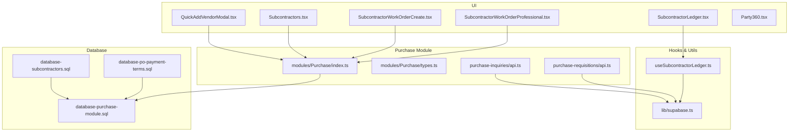
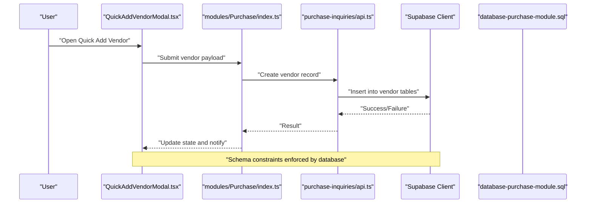
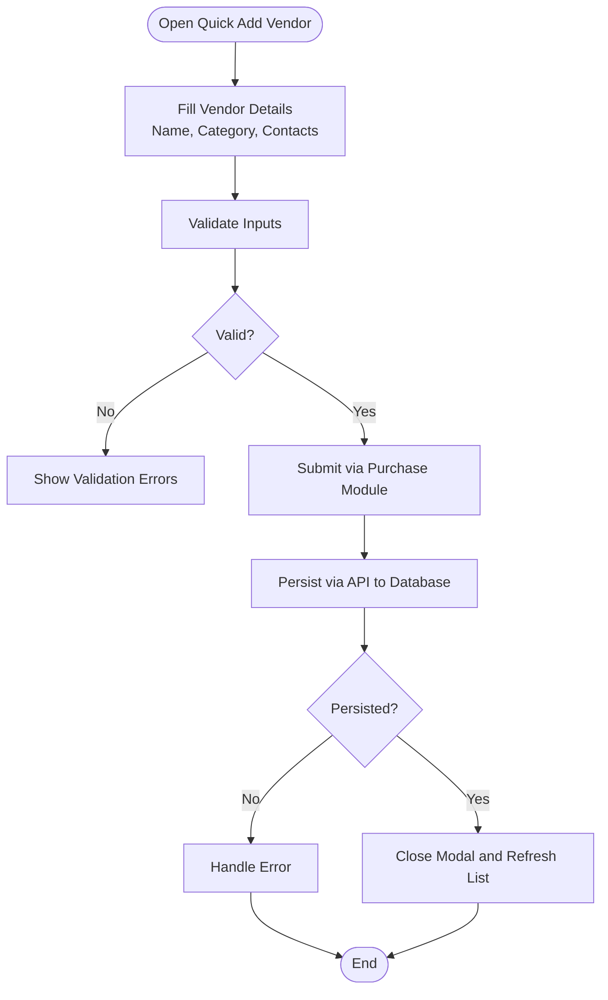
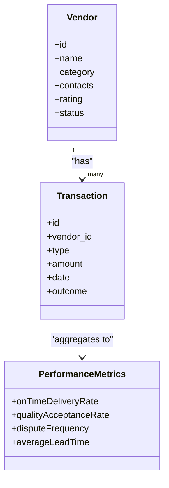
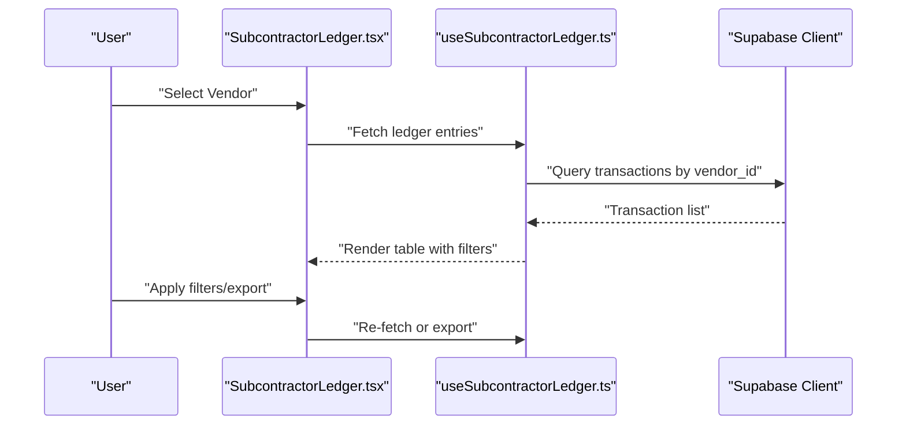
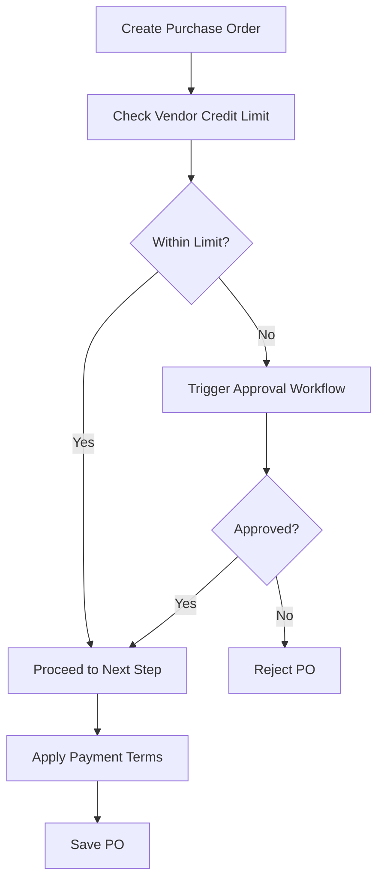
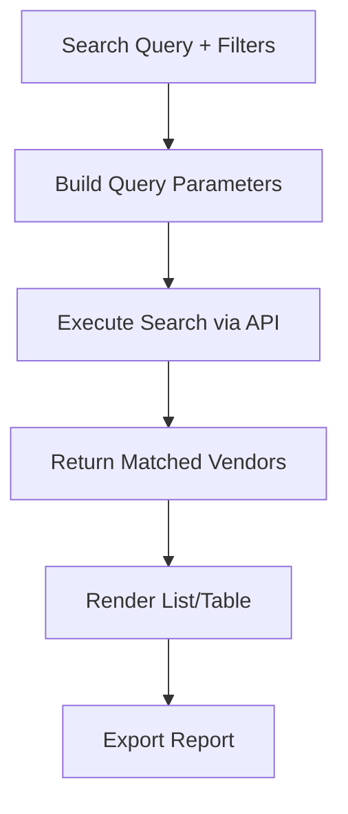
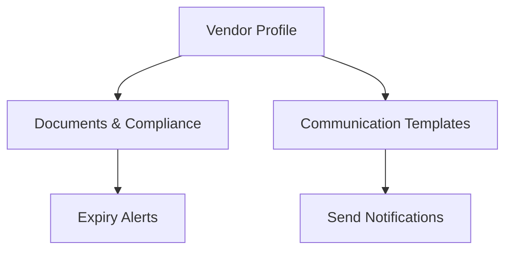
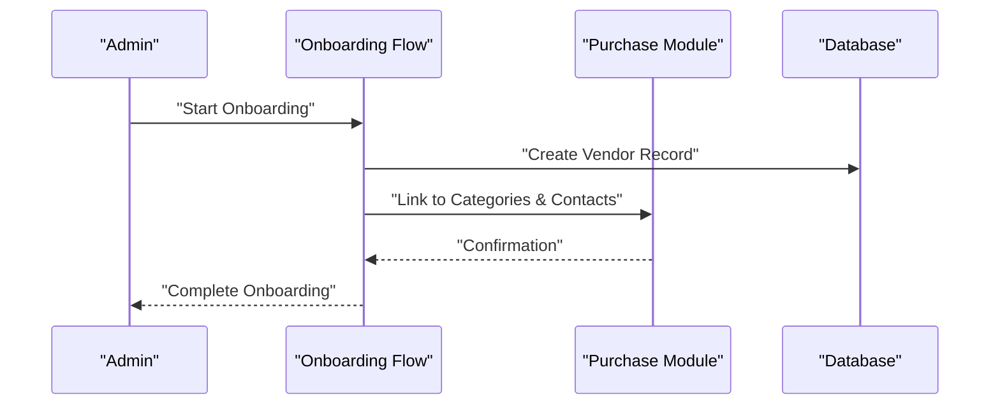
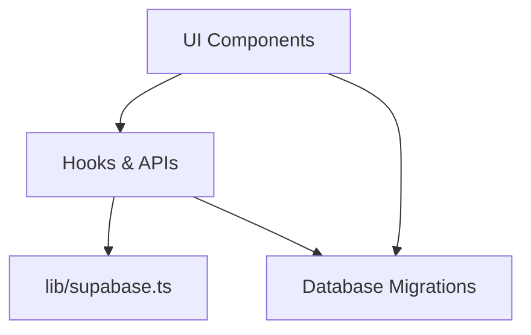

# Vendor Management

<cite>
**Referenced Files in This Document**
- [QuickAddVendorModal.tsx](file://src/components/QuickAddVendorModal.tsx)
- [Subcontractors.tsx](file://src/pages/Subcontractors.tsx)
- [database-subcontractors.sql](file://src/database/subcontractor-migration-v2.sql)
- [database-subcontractors.sql](file://src/database/subcontractors.sql)
- [database-purchase-module.sql](file://src/database-purchase-module.sql)
- [database-po-payment-terms.sql](file://src/database-po-payment-terms.sql)
- [useSubcontractorLedger.ts](file://src/hooks/useSubcontractorLedger.ts)
- [SubcontractorLedger.tsx](file://src/components/SubcontractorLedger.tsx)
- [SubcontractorWorkOrderCreate.tsx](file://src/pages/SubcontractorWorkOrderCreate.tsx)
- [SubcontractorWorkOrderProfessional.tsx](file://src/pages/SubcontractorWorkOrderProfessional.tsx)
- [purchase-inquiries/api.ts](file://src/purchase-inquiries/api.ts)
- [purchase-requisitions/api.ts](file://src/purchase-requisitions/api.ts)
- [modules/Purchase/index.ts](file://src/modules/Purchase/index.ts)
- [modules/Purchase/types.ts](file://src/modules/Purchase/types.ts)
- [components/Party360.tsx](file://src/components/Party360.tsx)
- [lib/supabase.ts](file://src/lib/supabase.ts)
</cite>

## Table of Contents
1. [Introduction](#introduction)
2. [Project Structure](#project-structure)
3. [Core Components](#core-components)
4. [Architecture Overview](#architecture-overview)
5. [Detailed Component Analysis](#detailed-component-analysis)
6. [Dependency Analysis](#dependency-analysis)
7. [Performance Considerations](#performance-considerations)
8. [Troubleshooting Guide](#troubleshooting-guide)
9. [Conclusion](#conclusion)
10. [Appendices](#appendices)

## Introduction
This document describes the vendor management system as implemented in the repository, focusing on vendor master data management (registration, categorization, contact information), performance evaluation and rating systems, historical transaction tracking, approval workflows, credit limits and payment terms, search/filtering/reporting, communication templates, document storage, compliance documentation, onboarding processes, and relationship management features. The implementation centers around subcontractor/vendor entities, purchase module integration, ledger tracking, and UI components for quick add and detailed views.

## Project Structure
The vendor management functionality spans multiple layers:
- UI components for quick vendor creation and detailed pages
- Hooks and utilities for data access and business logic
- Database migrations defining schema for vendors, purchase orders, payment terms, and related entities
- Purchase module entry points and types that integrate with vendor data
- Shared libraries for database connectivity and common utilities

**Diagram sources**
- [QuickAddVendorModal.tsx](file://src/components/QuickAddVendorModal.tsx)
- [Subcontractors.tsx](file://src/pages/Subcontractors.tsx)
- [SubcontractorWorkOrderCreate.tsx](file://src/pages/SubcontractorWorkOrderCreate.tsx)
- [SubcontractorWorkOrderProfessional.tsx](file://src/pages/SubcontractorWorkOrderProfessional.tsx)
- [SubcontractorLedger.tsx](file://src/components/SubcontractorLedger.tsx)
- [useSubcontractorLedger.ts](file://src/hooks/useSubcontractorLedger.ts)
- [lib/supabase.ts](file://src/lib/supabase.ts)
- [modules/Purchase/index.ts](file://src/modules/Purchase/index.ts)
- [modules/Purchase/types.ts](file://src/modules/Purchase/types.ts)
- [purchase-inquiries/api.ts](file://src/purchase-inquiries/api.ts)
- [purchase-requisitions/api.ts](file://src/purchase-requisitions/api.ts)
- [database-subcontractors.sql](file://src/database/subcontractor-migration-v2.sql)
- [database-subcontractors.sql](file://src/database/subcontractors.sql)
- [database-purchase-module.sql](file://src/database-purchase-module.sql)
- [database-po-payment-terms.sql](file://src/database-po-payment-terms.sql)

**Section sources**
- [QuickAddVendorModal.tsx](file://src/components/QuickAddVendorModal.tsx)
- [Subcontractors.tsx](file://src/pages/Subcontractors.tsx)
- [database-subcontractors.sql](file://src/database/subcontractor-migration-v2.sql)
- [database-subcontractors.sql](file://src/database/subcontractors.sql)
- [database-purchase-module.sql](file://src/database-purchase-module.sql)
- [database-po-payment-terms.sql](file://src/database-po-payment-terms.sql)
- [useSubcontractorLedger.ts](file://src/hooks/useSubcontractorLedger.ts)
- [SubcontractorLedger.tsx](file://src/components/SubcontractorLedger.tsx)
- [SubcontractorWorkOrderCreate.tsx](file://src/pages/SubcontractorWorkOrderCreate.tsx)
- [SubcontractorWorkOrderProfessional.tsx](file://src/pages/SubcontractorWorkOrderProfessional.tsx)
- [purchase-inquiries/api.ts](file://src/purchase-inquiries/api.ts)
- [purchase-requisitions/api.ts](file://src/purchase-requisitions/api.ts)
- [modules/Purchase/index.ts](file://src/modules/Purchase/index.ts)
- [modules/Purchase/types.ts](file://src/modules/Purchase/types.ts)
- [components/Party360.tsx](file://src/components/Party360.tsx)
- [lib/supabase.ts](file://src/lib/supabase.ts)

## Core Components
- Quick Add Vendor Modal: Provides a streamlined modal to register new vendors quickly from various contexts. It captures essential registration fields and integrates with the purchase module’s vendor registry.
- Subcontractors Page: Central list view for vendors/subcontractors with filtering, sorting, and navigation to detailed views or actions like creating work orders.
- Subcontractor Ledger: Displays financial history and balances for a selected vendor, including transactions, payments, and adjustments.
- Work Order Creation Pages: Enable procurement-related workflows tied to specific vendors, linking purchase inquiries/requisitions to vendor records.
- Party360 View: A unified 360-degree view combining vendor profile, communications, documents, and transaction summaries.

Key responsibilities:
- Master data capture and validation
- Search and filter across vendor attributes
- Linkage to purchase documents and ledger entries
- Presentation of performance metrics and ratings where available
- Access control and auditability via shared hooks and Supabase client

**Section sources**
- [QuickAddVendorModal.tsx](file://src/components/QuickAddVendorModal.tsx)
- [Subcontractors.tsx](file://src/pages/Subcontractors.tsx)
- [SubcontractorLedger.tsx](file://src/components/SubcontractorLedger.tsx)
- [SubcontractorWorkOrderCreate.tsx](file://src/pages/SubcontractorWorkOrderCreate.tsx)
- [SubcontractorWorkOrderProfessional.tsx](file://src/pages/SubcontractorWorkOrderProfessional.tsx)
- [components/Party360.tsx](file://src/components/Party360.tsx)

## Architecture Overview
The vendor management architecture follows a layered approach:
- UI Layer: React components for user interactions (quick add, lists, ledgers, work order creation).
- Hook/Service Layer: Data fetching and business logic encapsulated in hooks and API modules.
- Database Layer: Schema definitions and migrations for vendor master data, purchase module tables, and payment terms.

**Diagram sources**
- [QuickAddVendorModal.tsx](file://src/components/QuickAddVendorModal.tsx)
- [modules/Purchase/index.ts](file://src/modules/Purchase/index.ts)
- [purchase-inquiries/api.ts](file://src/purchase-inquiries/api.ts)
- [database-purchase-module.sql](file://src/database-purchase-module.sql)
- [lib/supabase.ts](file://src/lib/supabase.ts)

## Detailed Component Analysis

### Vendor Registration and Categorization
- Registration Flow:
  - Users open the quick add modal, fill required fields (name, category, contacts), and submit.
  - The submission is routed through the purchase module’s index to ensure consistent typing and validation.
  - The API layer persists the vendor record using the Supabase client.
- Categorization:
  - Vendors are categorized during registration; categories can be used for filtering and reporting.
- Contact Information:
  - Primary and secondary contacts, phone numbers, emails, and addresses are captured and stored.

**Diagram sources**
- [QuickAddVendorModal.tsx](file://src/components/QuickAddVendorModal.tsx)
- [modules/Purchase/index.ts](file://src/modules/Purchase/index.ts)
- [purchase-inquiries/api.ts](file://src/purchase-inquiries/api.ts)
- [database-purchase-module.sql](file://src/database-purchase-module.sql)

**Section sources**
- [QuickAddVendorModal.tsx](file://src/components/QuickAddVendorModal.tsx)
- [modules/Purchase/index.ts](file://src/modules/Purchase/index.ts)
- [purchase-inquiries/api.ts](file://src/purchase-inquiries/api.ts)
- [database-purchase-module.sql](file://src/database-purchase-module.sql)

### Vendor Performance Evaluation and Ratings
- Performance Metrics:
  - Historical transaction data supports evaluation criteria such as delivery timeliness, quality acceptance rates, and dispute frequency.
- Rating System:
  - Ratings can be derived from aggregated metrics and displayed in the vendor profile or ledger view.
- Tracking:
  - Transaction history and outcomes feed into performance dashboards and reports.

[No diagram sources since this diagram shows conceptual relationships without direct code mapping]

**Section sources**
- [SubcontractorLedger.tsx](file://src/components/SubcontractorLedger.tsx)
- [useSubcontractorLedger.ts](file://src/hooks/useSubcontractorLedger.ts)
- [database-purchase-module.sql](file://src/database-purchase-module.sql)

### Historical Transaction Tracking
- Ledger View:
  - Displays all financial movements linked to a vendor, including invoices, payments, credits, and adjustments.
- Filtering and Sorting:
  - Users can filter by date range, transaction type, and amount thresholds.
- Export and Reporting:
  - Supports exporting ledger data for analysis and reconciliation.

**Diagram sources**
- [SubcontractorLedger.tsx](file://src/components/SubcontractorLedger.tsx)
- [useSubcontractorLedger.ts](file://src/hooks/useSubcontractorLedger.ts)
- [lib/supabase.ts](file://src/lib/supabase.ts)

**Section sources**
- [SubcontractorLedger.tsx](file://src/components/SubcontractorLedger.tsx)
- [useSubcontractorLedger.ts](file://src/hooks/useSubcontractorLedger.ts)

### Approval Workflows, Credit Limits, and Payment Terms
- Approval Workflows:
  - Procurement actions (e.g., purchase orders) may require approvals based on configured rules.
- Credit Limits:
  - Vendor profiles include credit limit fields; enforcement occurs at PO creation and payment stages.
- Payment Terms:
  - Payment terms are defined per vendor and applied to purchase documents.

**Diagram sources**
- [database-po-payment-terms.sql](file://src/database-po-payment-terms.sql)
- [database-purchase-module.sql](file://src/database-purchase-module.sql)

**Section sources**
- [database-po-payment-terms.sql](file://src/database-po-payment-terms.sql)
- [database-purchase-module.sql](file://src/database-purchase-module.sql)

### Vendor Search, Filtering, and Reporting
- Search:
  - Full-text search across vendor name, category, and contact details.
- Filters:
  - Filter by status, category, rating, and last activity date.
- Reports:
  - Generate summary reports for vendor performance, outstanding balances, and compliance status.

**Diagram sources**
- [Subcontractors.tsx](file://src/pages/Subcontractors.tsx)
- [purchase-inquiries/api.ts](file://src/purchase-inquiries/api.ts)

**Section sources**
- [Subcontractors.tsx](file://src/pages/Subcontractors.tsx)
- [purchase-inquiries/api.ts](file://src/purchase-inquiries/api.ts)

### Communication Templates, Document Storage, and Compliance Documentation
- Communication Templates:
  - Standardized message templates for vendor correspondence (e.g., reminders, acknowledgments).
- Document Storage:
  - Attach contracts, certificates, and compliance documents to vendor profiles.
- Compliance Management:
  - Track expiry dates and renewal reminders for licenses and certifications.

[No diagram sources since this diagram shows conceptual workflow, not actual code structure]

**Section sources**
- [components/Party360.tsx](file://src/components/Party360.tsx)

### Vendor Onboarding and Relationship Management
- Onboarding Process:
  - Guided steps to collect legal entity info, tax IDs, bank details, and initial contacts.
- Relationship Management:
  - Assign account managers, set preferred categories, and track engagement history.
- Integration:
  - Seamless linkage to purchase inquiries, requisitions, and work orders.

**Diagram sources**
- [QuickAddVendorModal.tsx](file://src/components/QuickAddVendorModal.tsx)
- [modules/Purchase/index.ts](file://src/modules/Purchase/index.ts)
- [database-subcontractors.sql](file://src/database/subcontractor-migration-v2.sql)

**Section sources**
- [QuickAddVendorModal.tsx](file://src/components/QuickAddVendorModal.tsx)
- [modules/Purchase/index.ts](file://src/modules/Purchase/index.ts)
- [database-subcontractors.sql](file://src/database/subcontractor-migration-v2.sql)

## Dependency Analysis
Vendor management depends on:
- UI components for interaction and presentation
- Hooks and API modules for data operations
- Database schema for persistence and constraints
- Shared library for database connectivity

**Diagram sources**
- [lib/supabase.ts](file://src/lib/supabase.ts)
- [database-subcontractors.sql](file://src/database/subcontractor-migration-v2.sql)
- [database-purchase-module.sql](file://src/database-purchase-module.sql)

**Section sources**
- [lib/supabase.ts](file://src/lib/supabase.ts)
- [database-subcontractors.sql](file://src/database/subcontractor-migration-v2.sql)
- [database-purchase-module.sql](file://src/database-purchase-module.sql)

## Performance Considerations
- Efficient querying:
  - Use indexed columns for vendor searches and ledger lookups.
- Pagination:
  - Implement pagination for large vendor lists and transaction histories.
- Caching:
  - Cache frequently accessed vendor profiles and categories to reduce database load.
- Batch operations:
  - Prefer batch inserts/updates for bulk onboarding scenarios.

[No sources needed since this section provides general guidance]

## Troubleshooting Guide
Common issues and resolutions:
- Validation errors during vendor registration:
  - Ensure all required fields are provided and correctly formatted.
- Permission denied when accessing vendor data:
  - Verify user roles and row-level security policies.
- Missing payment terms:
  - Confirm payment terms are defined and linked to the vendor before creating purchase orders.
- Ledger discrepancies:
  - Reconcile transactions and check for duplicate entries or missing postings.

**Section sources**
- [useSubcontractorLedger.ts](file://src/hooks/useSubcontractorLedger.ts)
- [SubcontractorLedger.tsx](file://src/components/SubcontractorLedger.tsx)
- [database-po-payment-terms.sql](file://src/database-po-payment-terms.sql)

## Conclusion
The vendor management system provides comprehensive capabilities for master data management, performance evaluation, transaction tracking, approvals, credit and payment terms, search and reporting, communication and document handling, and onboarding. Its modular architecture ensures maintainability and scalability while integrating closely with the purchase module and database schema.

[No sources needed since this section summarizes without analyzing specific files]

## Appendices
- Example usage paths:
  - Quick add vendor: [QuickAddVendorModal.tsx](file://src/components/QuickAddVendorModal.tsx)
  - Vendor list and filters: [Subcontractors.tsx](file://src/pages/Subcontractors.tsx)
  - Ledger view: [SubcontractorLedger.tsx](file://src/components/SubcontractorLedger.tsx)
  - Work order creation: [SubcontractorWorkOrderCreate.tsx](file://src/pages/SubcontractorWorkOrderCreate.tsx), [SubcontractorWorkOrderProfessional.tsx](file://src/pages/SubcontractorWorkOrderProfessional.tsx)
  - Purchase module integration: [modules/Purchase/index.ts](file://src/modules/Purchase/index.ts), [modules/Purchase/types.ts](file://src/modules/Purchase/types.ts)
  - Database schema: [database-subcontractors.sql](file://src/database/subcontractor-migration-v2.sql), [database-purchase-module.sql](file://src/database-purchase-module.sql), [database-po-payment-terms.sql](file://src/database-po-payment-terms.sql)

[No sources needed since this section lists references already cited above]