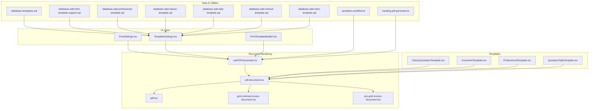
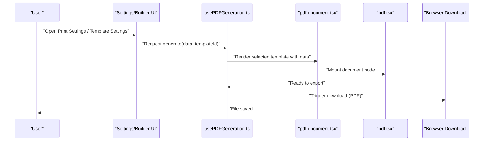
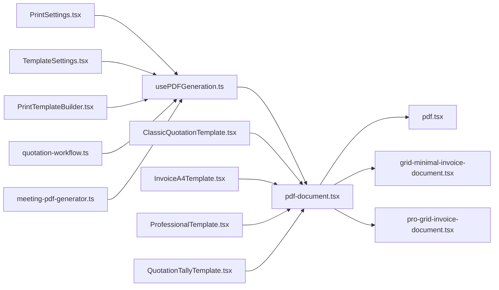

# Document Generation & Templates

<cite>
**Referenced Files in This Document**
- [usePDFGeneration.ts](file://src/hooks/usePDFGeneration.ts)
- [pdf-document.tsx](file://src/invoices/pdf-document.tsx)
- [pdf.tsx](file://src/invoices/pdf.tsx)
- [pdf-types.ts](file://src/invoices/pdf-types.ts)
- [grid-minimal-invoice-document.tsx](file://src/invoices/grid-minimal-invoice-document.tsx)
- [pro-grid-invoice-document.tsx](file://src/invoices/pro-grid-invoice-document.tsx)
- [ClassicQuotationTemplate.tsx](file://src/pages/ClassicQuotationTemplate.tsx)
- [InvoiceA4Template.tsx](file://src/pages/InvoiceA4Template.tsx)
- [ProfessionalTemplate.tsx](file://src/pages/ProfessionalTemplate.tsx)
- [QuotationTallyTemplate.tsx](file://src/pages/QuotationTallyTemplate.tsx)
- [PrintSettings.tsx](file://src/pages/PrintSettings.tsx)
- [TemplateSettings.tsx](file://src/pages/TemplateSettings.tsx)
- [PrintTemplateBuilder.tsx](file://src/pages/PrintTemplateBuilder.tsx)
- [quotation-workflow.ts](file://src/lib/quotation-workflow.ts)
- [meeting-pdf-generator.ts](file://src/lib/meeting-pdf-generator.ts)
- [database-add-html-template-support.sql](file://src/database-add-html-template-support.sql)
- [database-add-professional-template.sql](file://src/database-add-professional-template.sql)
- [database-add-classic-template.sql](file://src/database-add-classic-template.sql)
- [database-add-tally-template.sql](file://src/database-add-tally-template.sql)
- [database-add-vertical-template.sql](file://src/database-add-vertical-template.sql)
- [database-add-zoho-template.sql](file://src/database-add-zoho-template.sql)
- [database-templates.sql](file://src/database-templates.sql)
</cite>

## Table of Contents
1. [Introduction](#introduction)
2. [Project Structure](#project-structure)
3. [Core Components](#core-components)
4. [Architecture Overview](#architecture-overview)
5. [Detailed Component Analysis](#detailed-component-analysis)
6. [Dependency Analysis](#dependency-analysis)
7. [Performance Considerations](#performance-considerations)
8. [Troubleshooting Guide](#troubleshooting-guide)
9. [Conclusion](#conclusion)
10. [Appendices](#appendices)

## Introduction
This document explains the quotation document generation and template system, focusing on how React components render to PDFs, how templates are structured and customized, and how print layouts are configured. It covers the template architecture, the PDF generation pipeline, available template types, customization hooks, styling capabilities, integration between React and PDF rendering engines, responsive design considerations, accessibility compliance, and export format options.

## Project Structure
The document generation feature spans several areas:
- Hooks for orchestrating PDF generation
- Reusable PDF document components (used by invoices and adaptable for quotations)
- Page-level templates for different visual styles
- Settings pages for managing templates and print behavior
- Database migrations that introduce template storage and type support
- Utility generators for other documents (e.g., meeting minutes)

**Diagram sources**
- [usePDFGeneration.ts](file://src/hooks/usePDFGeneration.ts)
- [pdf-document.tsx](file://src/invoices/pdf-document.tsx)
- [pdf.tsx](file://src/invoices/pdf.tsx)
- [grid-minimal-invoice-document.tsx](file://src/invoices/grid-minimal-invoice-document.tsx)
- [pro-grid-invoice-document.tsx](file://src/invoices/pro-grid-invoice-document.tsx)
- [ClassicQuotationTemplate.tsx](file://src/pages/ClassicQuotationTemplate.tsx)
- [InvoiceA4Template.tsx](file://src/pages/InvoiceA4Template.tsx)
- [ProfessionalTemplate.tsx](file://src/pages/ProfessionalTemplate.tsx)
- [QuotationTallyTemplate.tsx](file://src/pages/QuotationTallyTemplate.tsx)
- [PrintSettings.tsx](file://src/pages/PrintSettings.tsx)
- [TemplateSettings.tsx](file://src/pages/TemplateSettings.tsx)
- [PrintTemplateBuilder.tsx](file://src/pages/PrintTemplateBuilder.tsx)
- [quotation-workflow.ts](file://src/lib/quotation-workflow.ts)
- [meeting-pdf-generator.ts](file://src/lib/meeting-pdf-generator.ts)
- [database-templates.sql](file://src/database-templates.sql)
- [database-add-html-template-support.sql](file://src/database-add-html-template-support.sql)
- [database-add-professional-template.sql](file://src/database-add-professional-template.sql)
- [database-add-classic-template.sql](file://src/database-add-classic-template.sql)
- [database-add-tally-template.sql](file://src/database-add-tally-template.sql)
- [database-add-vertical-template.sql](file://src/database-add-vertical-template.sql)
- [database-add-zoho-template.sql](file://src/database-add-zoho-template.sql)

**Section sources**
- [usePDFGeneration.ts](file://src/hooks/usePDFGeneration.ts)
- [pdf-document.tsx](file://src/invoices/pdf-document.tsx)
- [pdf.tsx](file://src/invoices/pdf.tsx)
- [grid-minimal-invoice-document.tsx](file://src/invoices/grid-minimal-invoice-document.tsx)
- [pro-grid-invoice-document.tsx](file://src/invoices/pro-grid-invoice-document.tsx)
- [ClassicQuotationTemplate.tsx](file://src/pages/ClassicQuotationTemplate.tsx)
- [InvoiceA4Template.tsx](file://src/pages/InvoiceA4Template.tsx)
- [ProfessionalTemplate.tsx](file://src/pages/ProfessionalTemplate.tsx)
- [QuotationTallyTemplate.tsx](file://src/pages/QuotationTallyTemplate.tsx)
- [PrintSettings.tsx](file://src/pages/PrintSettings.tsx)
- [TemplateSettings.tsx](file://src/pages/TemplateSettings.tsx)
- [PrintTemplateBuilder.tsx](file://src/pages/PrintTemplateBuilder.tsx)
- [quotation-workflow.ts](file://src/lib/quotation-workflow.ts)
- [meeting-pdf-generator.ts](file://src/lib/meeting-pdf-generator.ts)
- [database-templates.sql](file://src/database-templates.sql)
- [database-add-html-template-support.sql](file://src/database-add-html-template-support.sql)
- [database-add-professional-template.sql](file://src/database-add-professional-template.sql)
- [database-add-classic-template.sql](file://src/database-add-classic-template.sql)
- [database-add-tally-template.sql](file://src/database-add-tally-template.sql)
- [database-add-vertical-template.sql](file://src/database-add-vertical-template.sql)
- [database-add-zoho-template.sql](file://src/database-add-zoho-template.sql)

## Core Components
- PDF orchestration hook: Centralizes data preparation, template selection, and rendering triggers.
- PDF document component: Encapsulates page layout, headers/footers, margins, and content composition.
- Template variants: Provide distinct visual styles and structural layouts for different business needs.
- Settings and builder UI: Allow users to manage templates, adjust print settings, and preview outputs.
- Data utilities: Provide workflow helpers and cross-domain PDF generation patterns.

Key responsibilities:
- Hook manages state and lifecycle around generating a PDF from React components.
- Document component defines the printable surface and integrates with the underlying renderer.
- Templates implement consistent structure and branding while allowing customization points.
- Settings pages persist user preferences and template metadata.

**Section sources**
- [usePDFGeneration.ts](file://src/hooks/usePDFGeneration.ts)
- [pdf-document.tsx](file://src/invoices/pdf-document.tsx)
- [pdf.tsx](file://src/invoices/pdf.tsx)
- [pdf-types.ts](file://src/invoices/pdf-types.ts)
- [grid-minimal-invoice-document.tsx](file://src/invoices/grid-minimal-invoice-document.tsx)
- [pro-grid-invoice-document.tsx](file://src/invoices/pro-grid-invoice-document.tsx)
- [ClassicQuotationTemplate.tsx](file://src/pages/ClassicQuotationTemplate.tsx)
- [InvoiceA4Template.tsx](file://src/pages/InvoiceA4Template.tsx)
- [ProfessionalTemplate.tsx](file://src/pages/ProfessionalTemplate.tsx)
- [QuotationTallyTemplate.tsx](file://src/pages/QuotationTallyTemplate.tsx)
- [PrintSettings.tsx](file://src/pages/PrintSettings.tsx)
- [TemplateSettings.tsx](file://src/pages/TemplateSettings.tsx)
- [PrintTemplateBuilder.tsx](file://src/pages/PrintTemplateBuilder.tsx)
- [quotation-workflow.ts](file://src/lib/quotation-workflow.ts)
- [meeting-pdf-generator.ts](file://src/lib/meeting-pdf-generator.ts)

## Architecture Overview
The PDF generation pipeline connects UI actions to a React-based rendering engine, which serializes the DOM into a downloadable file. The flow is driven by a hook that prepares data, selects a template, renders it within a controlled container, and then triggers export.

**Diagram sources**
- [usePDFGeneration.ts](file://src/hooks/usePDFGeneration.ts)
- [pdf-document.tsx](file://src/invoices/pdf-document.tsx)
- [pdf.tsx](file://src/invoices/pdf.tsx)

## Detailed Component Analysis

### PDF Orchestration Hook
Responsibilities:
- Accepts document data and template identifier
- Renders the chosen template inside a hidden or preview container
- Coordinates with the renderer to produce an exportable artifact
- Exposes callbacks for success, error, and progress

Integration points:
- Consumed by settings pages and builders to trigger generation
- Works with template components that conform to expected props and structure

Customization hooks:
- Provide callback interfaces for pre/post processing
- Allow injecting custom styles or assets before rendering

**Section sources**
- [usePDFGeneration.ts](file://src/hooks/usePDFGeneration.ts)

### PDF Document Container
Responsibilities:
- Defines page size, orientation, margins, and header/footer regions
- Composes reusable sections (header, body, footer)
- Ensures consistent spacing and pagination behavior
- Bridges template-specific content with global layout rules

Styling capabilities:
- Supports theme-aware styles via CSS variables or Tailwind classes
- Provides breakpoints for responsive adjustments when applicable

Accessibility:
- Uses semantic HTML elements and ARIA attributes where appropriate
- Ensures sufficient color contrast and readable font sizes

**Section sources**
- [pdf-document.tsx](file://src/invoices/pdf-document.tsx)
- [pdf.tsx](file://src/invoices/pdf.tsx)
- [pdf-types.ts](file://src/invoices/pdf-types.ts)

### Template Variants
Available template types:
- Classic Quotation Template: Traditional layout with clear sections and tables
- Professional Template: Modern, branded look with refined typography
- Invoice A4 Template: Compact A4-friendly layout optimized for printing
- Tally-style Template: Structured for accounting systems compatibility

Each template:
- Implements a consistent interface for data binding
- Allows logo insertion and brand colors
- Offers configurable sections (items, totals, notes, terms)

Examples of usage:
- Selecting a template in settings
- Passing quotation data to the template component
- Rendering within the document container

**Section sources**
- [ClassicQuotationTemplate.tsx](file://src/pages/ClassicQuotationTemplate.tsx)
- [ProfessionalTemplate.tsx](file://src/pages/ProfessionalTemplate.tsx)
- [InvoiceA4Template.tsx](file://src/pages/InvoiceA4Template.tsx)
- [QuotationTallyTemplate.tsx](file://src/pages/QuotationTallyTemplate.tsx)

### Grid-Based Document Components
These components provide grid-oriented layouts suitable for dense tabular data:
- Minimal grid document: Lightweight table-focused layout
- Pro grid document: Enhanced features such as grouping, summaries, and conditional formatting

Use cases:
- Complex item lists with multiple columns
- Conditional row highlighting based on status or values
- Grouped sections with subtotals

**Section sources**
- [grid-minimal-invoice-document.tsx](file://src/invoices/grid-minimal-invoice-document.tsx)
- [pro-grid-invoice-document.tsx](file://src/invoices/pro-grid-invoice-document.tsx)

### Settings and Builder UI
- Print Settings: Controls default paper size, orientation, margins, and whether to include headers/footers
- Template Settings: Manages available templates, assigns defaults, and previews outputs
- Print Template Builder: Visual tool to assemble and customize templates without deep coding

Workflow:
- Users select a template and configure options
- System persists choices and applies them during generation
- Preview mode helps validate layout before export

**Section sources**
- [PrintSettings.tsx](file://src/pages/PrintSettings.tsx)
- [TemplateSettings.tsx](file://src/pages/TemplateSettings.tsx)
- [PrintTemplateBuilder.tsx](file://src/pages/PrintTemplateBuilder.tsx)

### Data Utilities and Cross-Domain Generators
- Quotation workflow helper: Prepares quotation data structures and transformations prior to rendering
- Meeting PDF generator: Demonstrates a reusable pattern for generating non-quotation documents using the same pipeline

Benefits:
- Consistent data shaping across modules
- Shared rendering logic reduces duplication

**Section sources**
- [quotation-workflow.ts](file://src/lib/quotation-workflow.ts)
- [meeting-pdf-generator.ts](file://src/lib/meeting-pdf-generator.ts)

## Dependency Analysis
The following diagram shows key dependencies among core files involved in document generation and templates.

**Diagram sources**
- [usePDFGeneration.ts](file://src/hooks/usePDFGeneration.ts)
- [pdf-document.tsx](file://src/invoices/pdf-document.tsx)
- [pdf.tsx](file://src/invoices/pdf.tsx)
- [grid-minimal-invoice-document.tsx](file://src/invoices/grid-minimal-invoice-document.tsx)
- [pro-grid-invoice-document.tsx](file://src/invoices/pro-grid-invoice-document.tsx)
- [ClassicQuotationTemplate.tsx](file://src/pages/ClassicQuotationTemplate.tsx)
- [InvoiceA4Template.tsx](file://src/pages/InvoiceA4Template.tsx)
- [ProfessionalTemplate.tsx](file://src/pages/ProfessionalTemplate.tsx)
- [QuotationTallyTemplate.tsx](file://src/pages/QuotationTallyTemplate.tsx)
- [PrintSettings.tsx](file://src/pages/PrintSettings.tsx)
- [TemplateSettings.tsx](file://src/pages/TemplateSettings.tsx)
- [PrintTemplateBuilder.tsx](file://src/pages/PrintTemplateBuilder.tsx)
- [quotation-workflow.ts](file://src/lib/quotation-workflow.ts)
- [meeting-pdf-generator.ts](file://src/lib/meeting-pdf-generator.ts)

**Section sources**
- [usePDFGeneration.ts](file://src/hooks/usePDFGeneration.ts)
- [pdf-document.tsx](file://src/invoices/pdf-document.tsx)
- [pdf.tsx](file://src/invoices/pdf.tsx)
- [grid-minimal-invoice-document.tsx](file://src/invoices/grid-minimal-invoice-document.tsx)
- [pro-grid-invoice-document.tsx](file://src/invoices/pro-grid-invoice-document.tsx)
- [ClassicQuotationTemplate.tsx](file://src/pages/ClassicQuotationTemplate.tsx)
- [InvoiceA4Template.tsx](file://src/pages/InvoiceA4Template.tsx)
- [ProfessionalTemplate.tsx](file://src/pages/ProfessionalTemplate.tsx)
- [QuotationTallyTemplate.tsx](file://src/pages/QuotationTallyTemplate.tsx)
- [PrintSettings.tsx](file://src/pages/PrintSettings.tsx)
- [TemplateSettings.tsx](file://src/pages/TemplateSettings.tsx)
- [PrintTemplateBuilder.tsx](file://src/pages/PrintTemplateBuilder.tsx)
- [quotation-workflow.ts](file://src/lib/quotation-workflow.ts)
- [meeting-pdf-generator.ts](file://src/lib/meeting-pdf-generator.ts)

## Performance Considerations
- Prefer minimal re-renders by memoizing heavy components and stable data references
- Use virtualized lists for large item sets in grid templates
- Avoid embedding large images directly; prefer external URLs or optimized assets
- Batch operations and debounce user interactions in settings to reduce unnecessary regenerations
- Keep CSS simple and avoid expensive filters or shadows for better print fidelity

[No sources needed since this section provides general guidance]

## Troubleshooting Guide
Common issues and resolutions:
- Blank or truncated PDF: Verify page size and margins; ensure content fits within bounds
- Missing logos or fonts: Confirm asset paths and availability at render time
- Incorrect totals or formatting: Validate data transformation steps in workflow utilities
- Slow generation: Profile component rendering and consider simplifying complex layouts

Debugging tips:
- Enable preview mode to inspect rendered output before export
- Log data shapes passed to templates to catch mismatches
- Test with small datasets first, then scale up

**Section sources**
- [usePDFGeneration.ts](file://src/hooks/usePDFGeneration.ts)
- [pdf-document.tsx](file://src/invoices/pdf-document.tsx)
- [quotation-workflow.ts](file://src/lib/quotation-workflow.ts)

## Conclusion
The quotation document generation system leverages React components for flexible, customizable templates and a robust PDF rendering pipeline. With dedicated settings and builder tools, teams can tailor layouts, branding, and print behavior to meet diverse requirements. By adhering to performance best practices and accessibility guidelines, the system delivers high-quality, reliable exports across scenarios.

[No sources needed since this section summarizes without analyzing specific files]

## Appendices

### Template Types and Capabilities
- Classic Quotation Template: Standard layout with clear sections and tables
- Professional Template: Branded, modern appearance with refined typography
- Invoice A4 Template: Compact A4-friendly layout optimized for printing
- Tally-style Template: Accounting-system-friendly structure

Customization hooks:
- Logo insertion and brand color configuration
- Section toggles (items, totals, notes, terms)
- Header/footer customization and page numbering

Styling capabilities:
- Theme-aware styles via CSS variables or utility classes
- Responsive adjustments for varied screen sizes and print media

**Section sources**
- [ClassicQuotationTemplate.tsx](file://src/pages/ClassicQuotationTemplate.tsx)
- [ProfessionalTemplate.tsx](file://src/pages/ProfessionalTemplate.tsx)
- [InvoiceA4Template.tsx](file://src/pages/InvoiceA4Template.tsx)
- [QuotationTallyTemplate.tsx](file://src/pages/QuotationTallyTemplate.tsx)
- [pdf-document.tsx](file://src/invoices/pdf-document.tsx)

### Creating Custom Templates
Steps:
- Create a new template component conforming to the expected data shape
- Integrate with the document container for consistent layout and pagination
- Register the template in settings and provide a preview
- Add any required assets (logos, fonts) and ensure they load reliably

Best practices:
- Keep markup semantic and accessible
- Use consistent spacing and typography scales
- Validate edge cases (empty rows, long text, currency formatting)

**Section sources**
- [PrintTemplateBuilder.tsx](file://src/pages/PrintTemplateBuilder.tsx)
- [TemplateSettings.tsx](file://src/pages/TemplateSettings.tsx)
- [pdf-document.tsx](file://src/invoices/pdf-document.tsx)

### Adding Company Logos
Guidelines:
- Store logos in a publicly accessible location or embed via base64 if small
- Ensure aspect ratio and resolution are appropriate for print
- Provide fallbacks if assets fail to load

**Section sources**
- [ClassicQuotationTemplate.tsx](file://src/pages/ClassicQuotationTemplate.tsx)
- [ProfessionalTemplate.tsx](file://src/pages/ProfessionalTemplate.tsx)
- [InvoiceA4Template.tsx](file://src/pages/InvoiceA4Template.tsx)
- [QuotationTallyTemplate.tsx](file://src/pages/QuotationTallyTemplate.tsx)

### Configuring Print Layouts
Options:
- Paper size (A4, Letter, etc.)
- Orientation (portrait, landscape)
- Margins (customizable per template)
- Include/exclude headers and footers

Persistence:
- Default settings stored in user preferences
- Per-template overrides supported through settings

**Section sources**
- [PrintSettings.tsx](file://src/pages/PrintSettings.tsx)
- [TemplateSettings.tsx](file://src/pages/TemplateSettings.tsx)

### Integration Between React Components and PDF Rendering Engines
Flow:
- Hook mounts the template within a controlled container
- Document component handles layout and pagination
- Renderer serializes the DOM to a downloadable file

Considerations:
- Ensure deterministic rendering for consistent exports
- Handle asynchronous assets carefully to avoid incomplete output

**Section sources**
- [usePDFGeneration.ts](file://src/hooks/usePDFGeneration.ts)
- [pdf-document.tsx](file://src/invoices/pdf-document.tsx)
- [pdf.tsx](file://src/invoices/pdf.tsx)

### Responsive Design Considerations
- Use relative units and scalable typography
- Provide print-specific styles to optimize for physical media
- Avoid fixed widths that may overflow on smaller pages

**Section sources**
- [pdf-document.tsx](file://src/invoices/pdf-document.tsx)

### Accessibility Compliance
- Use semantic elements and proper headings
- Maintain sufficient color contrast
- Provide alt text for images and descriptive labels for controls

**Section sources**
- [pdf-document.tsx](file://src/invoices/pdf-document.tsx)

### Export Format Options
- Primary format: PDF
- Optional formats depend on renderer capabilities and browser support

**Section sources**
- [pdf.tsx](file://src/invoices/pdf.tsx)

### Database Schema for Templates
Migrations introduce template storage and type support, enabling dynamic template management and versioning.

Key additions:
- Template metadata and content storage
- Type flags for classic, professional, vertical, tally, Zoho-compatible templates
- HTML template support for advanced customization

**Section sources**
- [database-templates.sql](file://src/database-templates.sql)
- [database-add-html-template-support.sql](file://src/database-add-html-template-support.sql)
- [database-add-professional-template.sql](file://src/database-add-professional-template.sql)
- [database-add-classic-template.sql](file://src/database-add-classic-template.sql)
- [database-add-tally-template.sql](file://src/database-add-tally-template.sql)
- [database-add-vertical-template.sql](file://src/database-add-vertical-template.sql)
- [database-add-zoho-template.sql](file://src/database-add-zoho-template.sql)