# Quotation Data Model

<cite>
**Referenced Files in This Document**
- [database-quotation.sql](file://src/database-quotation.sql)
- [database-boq.sql](file://src/database-boq.sql)
- [database-items.sql](file://src/database-items.sql)
- [database-materials.sql](file://src/database-materials.sql)
- [database-inventory.sql](file://src/database-inventory.sql)
- [database-hsn-tax.sql](file://src/database-hsn-tax.sql)
- [database-variant-discount.sql](file://src/database-variant-discount.sql)
- [database-add-variant-id.sql](file://src/database-add-variant-id.sql)
- [database-add-variant-to-client-mappings.sql](file://src/database-add-variant-to-client-mappings.sql)
- [database-add-organisation-id-quotation-header.sql](file://src/database-add-organisation-id-quotation-header.sql)
- [database-add-quotation-revision.sql](file://src/database-add-quotation-revision.sql)
- [database-quotation-revisions.sql](file://src/database-quotation-revisions.sql)
- [database-document-series.sql](file://src/database-document-series.sql)
- [database-document-settings.sql](file://src/database-document-settings.sql)
- [database-templates.sql](file://src/database-templates.sql)
- [database-add-html-template-support.sql](file://src/database-add-html-template-support.sql)
- [database-add-professional-template.sql](file://src/database-add-professional-template.sql)
- [database-add-tally-template.sql](file://src/database-add-tally-template.sql)
- [database-add-zoho-template.sql](file://src/database-add-vertical-template.sql](file://src/database-add-vertical-template.sql)
- [database-add-subtotal.sql](file://src/database-add-subtotal.sql)
- [database-new-discount-logic.sql](file://src/database-new-discount-logic.sql)
- [database-client-custom-discounts.sql](file://src/database-client-custom-discounts.sql)
- [database-discount-categories.sql](file://src/database-discount-categories.sql)
- [database-approval.sql](file://src/database-approval.sql)
- [database-approvals-edge-cases.sql](file://src/database-approvals-edge-cases.sql)
- [database-approval-workflows-fix-fk.sql](file://src/database-approval-workflows-fix-fk.sql)
- [database-approval-workflows-rls.sql](file://src/database-approval-workflows-rls.sql)
- [create_approval_settings_table.sql](file://sql/create_approval_settings_table.sql)
- [phase1_approvals_denorm.sql](file://sql/phase1_approvals_denorm.sql)
- [fix_approvals_requested_by_fk.sql](file://sql/fix_approvals_requested_by_fk.sql)
- [database-item-audit.sql](file://src/database-item-audit.sql)
- [database-add-audit-log.sql](file://src/database-add-audit-log.sql)
- [useAuditLog.ts](file://src/hooks/useAuditLog.ts)
- [quotation-workflow.ts](file://src/lib/quotation-workflow.ts)
- [CreateQuotation.tsx](file://src/pages/CreateQuotation.tsx)
- [CreateQuotationV2.tsx](file://src/pages/CreateQuotationV2.tsx)
- [QuotationList.tsx](file://src/pages/QuotationList.tsx)
- [QuotationView.tsx](file://src/pages/QuotationView.tsx)
- [ClassicQuotationTemplate.tsx](file://src/pages/ClassicQuotationTemplate.tsx)
- [InvoiceA4Template.tsx](file://src/pages/InvoiceA4Template.tsx)
- [QuotationTallyTemplate.tsx](file://src/pages/QuotationTallyTemplate.tsx)
- [PrintSettings.tsx](file://src/pages/PrintSettings.tsx)
- [TemplateSettings.tsx](file://src/pages/TemplateSettings.tsx)
- [usePDFGeneration.ts](file://src/hooks/usePDFGeneration.ts)
- [currency.ts](file://src/lib/currency.ts)
- [useVariants.ts](file://src/hooks/useVariants.ts)
- [useMaterials.ts](file://src/hooks/useMaterials.ts)
- [useWarehouses.ts](file://src/hooks/useWarehouses.ts)
</cite>

## Table of Contents
1. [Introduction](#introduction)
2. [Project Structure](#project-structure)
3. [Core Components](#core-components)
4. [Architecture Overview](#architecture-overview)
5. [Detailed Component Analysis](#detailed-component-analysis)
6. [Dependency Analysis](#dependency-analysis)
7. [Performance Considerations](#performance-considerations)
8. [Troubleshooting Guide](#troubleshooting-guide)
9. [Conclusion](#conclusion)
10. [Appendices](#appendices)

## Introduction
This document describes the quotation data model and its relationships to BOQ, materials, variants, pricing, taxes, approvals, versioning, audit trails, multi-currency support, discounts, and template-based document generation. It also provides example queries, status transitions, and integration points with inventory management.

## Project Structure
The quotation system spans database migrations (schema), UI pages for creation and viewing, templates for PDF generation, hooks for workflows and audit logging, and utilities for currency handling. The key areas are:
- Schema definitions for quotations, lines, revisions, BOQ, items/materials, inventory, taxes, discounts, variants, approvals, and templates
- Pages for creating, listing, and viewing quotations
- Template files for rendering quotations as PDFs
- Hooks and libraries for workflow states, audit logs, and currency operations

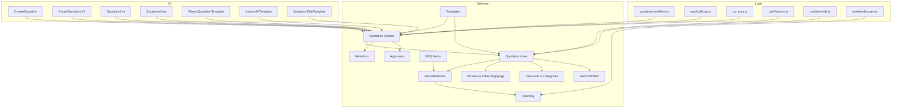

[No sources needed since this diagram shows conceptual structure]

## Core Components
- Quotation header tables capture document metadata, client/project linkage, series numbers, currency, totals, and approval state.
- Line items represent individual quoted goods/services with quantities, unit prices, discounts, taxes, and variant mappings.
- Pricing calculations aggregate line-level amounts into subtotal, discount, tax, and grand total fields at both header and line levels.
- Tax handling uses HSN/SAC codes and tax rates per line or header, with support for inclusive/exclusive tax modes.
- BOQ relationship allows quotations to be derived from or linked to a Bill of Quantities, enabling reuse of item descriptions and quantities.
- Material mappings connect quotation lines to catalog items and warehouse stock for availability checks and conversions.
- Variant pricing supports different price tiers based on product variants and client-specific mappings.
- Approval workflow states govern transitions such as Draft, Submitted, Approved, Rejected, and Closed, with settings controlling rules and roles.
- Version control mechanisms track revisions of quotations, preserving history and enabling rollback or comparison.
- Audit trail tracking records changes to quotations and related entities for compliance and traceability.

**Section sources**
- [database-quotation.sql](file://src/database-quotation.sql)
- [database-add-subtotal.sql](file://src/database-add-subtotal.sql)
- [database-hsn-tax.sql](file://src/database-hsn-tax.sql)
- [database-boq.sql](file://src/database-boq.sql)
- [database-items.sql](file://src/database-items.sql)
- [database-materials.sql](file://src/database-materials.sql)
- [database-inventory.sql](file://src/database-inventory.sql)
- [database-variant-discount.sql](file://src/database-variant-discount.sql)
- [database-add-variant-id.sql](file://src/database-add-variant-id.sql)
- [database-add-variant-to-client-mappings.sql](file://src/database-add-variant-to-client-mappings.sql)
- [database-approval.sql](file://src/database-approval.sql)
- [database-approvals-edge-cases.sql](file://src/database-approvals-edge-cases.sql)
- [database-approval-workflows-fix-fk.sql](file://src/database-approval-workflows-fix-fk.sql)
- [database-approval-workflows-rls.sql](file://src/database-approval-workflows-rls.sql)
- [create_approval_settings_table.sql](file://sql/create_approval_settings_table.sql)
- [phase1_approvals_denorm.sql](file://sql/phase1_approvals_denorm.sql)
- [fix_approvals_requested_by_fk.sql](file://sql/fix_approvals_requested_by_fk.sql)
- [database-add-quotation-revision.sql](file://src/database-add-quotation-revision.sql)
- [database-quotation-revisions.sql](file://src/database-quotation-revisions.sql)
- [database-add-audit-log.sql](file://src/database-add-audit-log.sql)
- [database-item-audit.sql](file://src/database-item-audit.sql)
- [useAuditLog.ts](file://src/hooks/useAuditLog.ts)
- [quotation-workflow.ts](file://src/lib/quotation-workflow.ts)

## Architecture Overview
The quotation architecture integrates schema-driven data persistence with UI components and logic modules:
- Schema layer defines core entities and relationships
- UI layer provides creation, listing, and viewing experiences
- Logic layer implements workflow transitions, audit logging, and currency operations
- Templates render final documents for export/printing

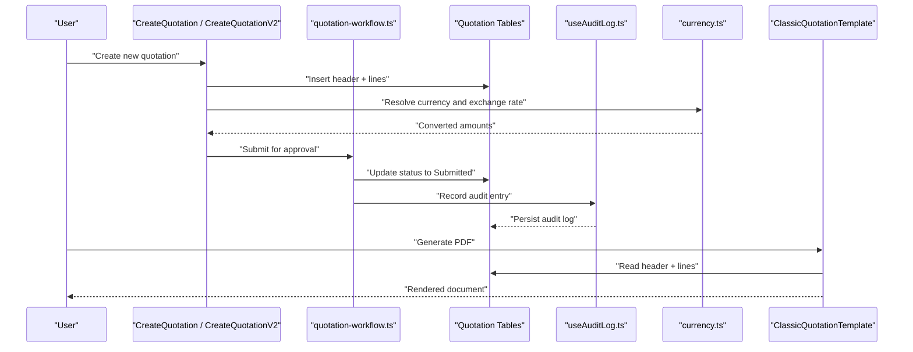

**Diagram sources**
- [CreateQuotation.tsx](file://src/pages/CreateQuotation.tsx)
- [CreateQuotationV2.tsx](file://src/pages/CreateQuotationV2.tsx)
- [quotation-workflow.ts](file://src/lib/quotation-workflow.ts)
- [useAuditLog.ts](file://src/hooks/useAuditLog.ts)
- [currency.ts](file://src/lib/currency.ts)
- [ClassicQuotationTemplate.tsx](file://src/pages/ClassicQuotationTemplate.tsx)

**Section sources**
- [CreateQuotation.tsx](file://src/pages/CreateQuotation.tsx)
- [CreateQuotationV2.tsx](file://src/pages/CreateQuotationV2.tsx)
- [quotation-workflow.ts](file://src/lib/quotation-workflow.ts)
- [useAuditLog.ts](file://src/hooks/useAuditLog.ts)
- [currency.ts](file://src/lib/currency.ts)
- [ClassicQuotationTemplate.tsx](file://src/pages/ClassicQuotationTemplate.tsx)

## Detailed Component Analysis

### Quotation Header and Line Items
- Header captures identification, client/project references, series number, currency, dates, totals, and approval state.
- Lines include item references, quantities, unit prices, discounts, taxes, and variant IDs.
- Subtotals and totals are maintained at header level to simplify reporting and printing.

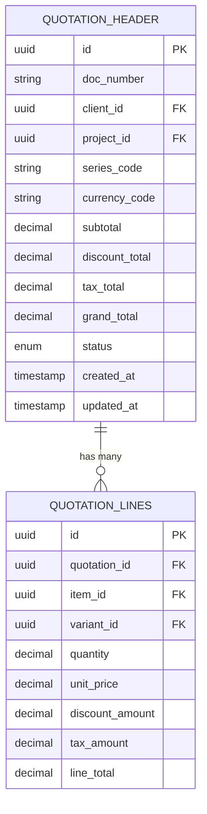

**Diagram sources**
- [database-quotation.sql](file://src/database-quotation.sql)
- [database-add-subtotal.sql](file://src/database-add-subtotal.sql)

**Section sources**
- [database-quotation.sql](file://src/database-quotation.sql)
- [database-add-subtotal.sql](file://src/database-add-subtotal.sql)

### Pricing Calculations and Discount Applications
- Discounts can be applied at line or header level via categories and client-specific profiles.
- Variant pricing enables tiered or conditional pricing based on selected variants.
- Currency conversion ensures consistent totals across multiple currencies using exchange rates.

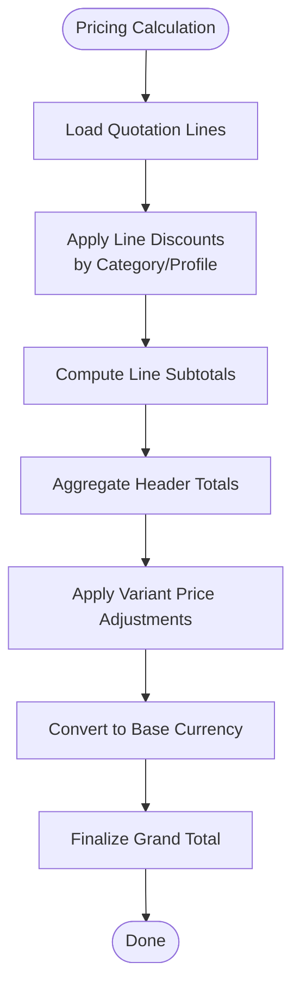

**Diagram sources**
- [database-variant-discount.sql](file://src/database-variant-discount.sql)
- [database-add-variant-id.sql](file://src/database-add-variant-id.sql)
- [database-add-variant-to-client-mappings.sql](file://src/database-add-variant-to-client-mappings.sql)
- [database-client-custom-discounts.sql](file://src/database-client-custom-discounts.sql)
- [database-discount-categories.sql](file://src/database-discount-categories.sql)
- [currency.ts](file://src/lib/currency.ts)

**Section sources**
- [database-variant-discount.sql](file://src/database-variant-discount.sql)
- [database-add-variant-id.sql](file://src/database-add-variant-id.sql)
- [database-add-variant-to-client-mappings.sql](file://src/database-add-variant-to-client-mappings.sql)
- [database-client-custom-discounts.sql](file://src/database-client-custom-discounts.sql)
- [database-discount-categories.sql](file://src/database-discount-categories.sql)
- [currency.ts](file://src/lib/currency.ts)

### Tax Handling (HSN/SAC)
- Taxes are modeled with HSN/SAC codes and rates, applied per line or aggregated at header.
- Inclusive and exclusive tax modes are supported to match regional requirements.

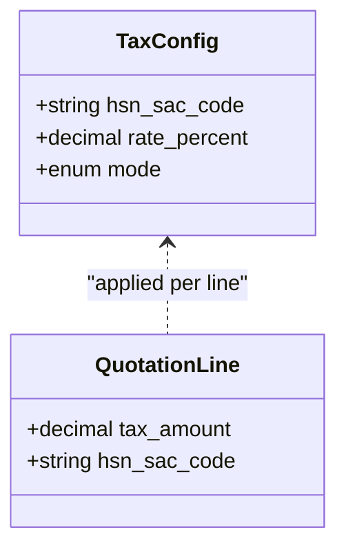

**Diagram sources**
- [database-hsn-tax.sql](file://src/database-hsn-tax.sql)

**Section sources**
- [database-hsn-tax.sql](file://src/database-hsn-tax.sql)

### Relationship Between Quotations and BOQ
- Quotations can be linked to BOQ items to reuse descriptions and quantities.
- Mapping preserves lineage between BOQ entries and quotation lines for traceability.

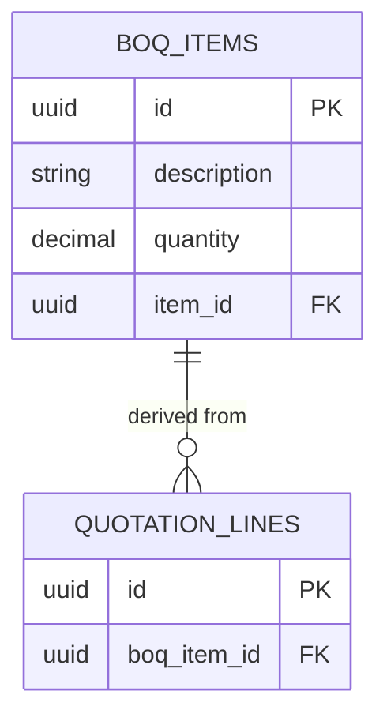

**Diagram sources**
- [database-boq.sql](file://src/database-boq.sql)

**Section sources**
- [database-boq.sql](file://src/database-boq.sql)

### Material Mappings and Inventory Integration
- Quotation lines map to catalog items and materials, enabling stock checks and conversions.
- Warehouse context influences availability and allocation during quoting.

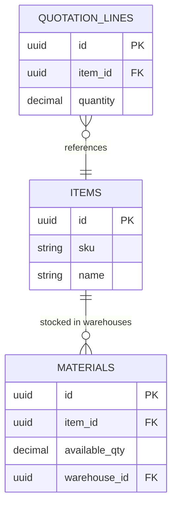

**Diagram sources**
- [database-items.sql](file://src/database-items.sql)
- [database-materials.sql](file://src/database-materials.sql)
- [database-inventory.sql](file://src/database-inventory.sql)

**Section sources**
- [database-items.sql](file://src/database-items.sql)
- [database-materials.sql](file://src/database-materials.sql)
- [database-inventory.sql](file://src/database-inventory.sql)
- [useMaterials.ts](file://src/hooks/useMaterials.ts)
- [useWarehouses.ts](file://src/hooks/useWarehouses.ts)

### Variant Pricing and Client-Specific Mappings
- Variants allow differentiated pricing and attributes per product.
- Client mappings enable tailored pricing rules and discounts.

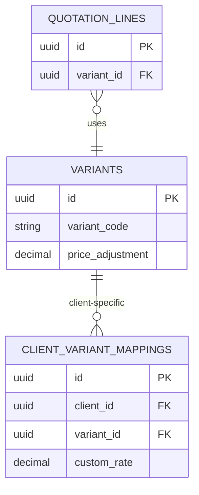

**Diagram sources**
- [database-add-variant-id.sql](file://src/database-add-variant-id.sql)
- [database-add-variant-to-client-mappings.sql](file://src/database-add-variant-to-client-mappings.sql)
- [database-variant-discount.sql](file://src/database-variant-discount.sql)

**Section sources**
- [database-add-variant-id.sql](file://src/database-add-variant-id.sql)
- [database-add-variant-to-client-mappings.sql](file://src/database-add-variant-to-client-mappings.sql)
- [database-variant-discount.sql](file://src/database-variant-discount.sql)
- [useVariants.ts](file://src/hooks/useVariants.ts)

### Approval Workflow States
- States include Draft, Submitted, Approved, Rejected, Closed.
- Settings define roles, thresholds, and escalation rules.
- Denormalized fields optimize read performance for approval dashboards.

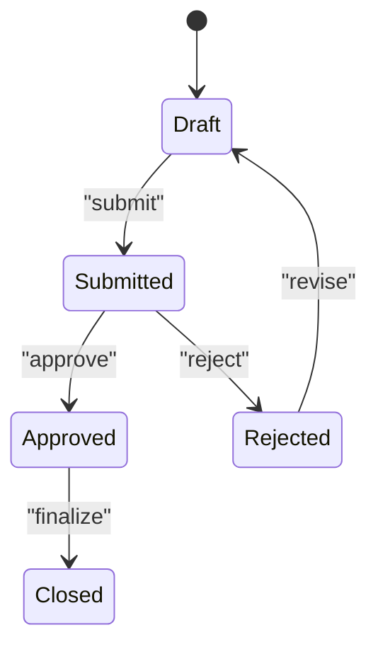

**Diagram sources**
- [database-approval.sql](file://src/database-approval.sql)
- [database-approvals-edge-cases.sql](file://src/database-approvals-edge-cases.sql)
- [database-approval-workflows-fix-fk.sql](file://src/database-approval-workflows-fix-fk.sql)
- [database-approval-workflows-rls.sql](file://src/database-approval-workflows-rls.sql)
- [create_approval_settings_table.sql](file://sql/create_approval_settings_table.sql)
- [phase1_approvals_denorm.sql](file://sql/phase1_approvals_denorm.sql)
- [fix_approvals_requested_by_fk.sql](file://sql/fix_approvals_requested_by_fk.sql)
- [quotation-workflow.ts](file://src/lib/quotation-workflow.ts)

**Section sources**
- [database-approval.sql](file://src/database-approval.sql)
- [database-approvals-edge-cases.sql](file://src/database-approvals-edge-cases.sql)
- [database-approval-workflows-fix-fk.sql](file://src/database-approval-workflows-fix-fk.sql)
- [database-approval-workflows-rls.sql](file://src/database-approval-workflows-rls.sql)
- [create_approval_settings_table.sql](file://sql/create_approval_settings_table.sql)
- [phase1_approvals_denorm.sql](file://sql/phase1_approvals_denorm.sql)
- [fix_approvals_requested_by_fk.sql](file://sql/fix_approvals_requested_by_fk.sql)
- [quotation-workflow.ts](file://src/lib/quotation-workflow.ts)

### Version Control Mechanisms
- Revisions table stores snapshots of quotation headers and lines upon significant changes.
- Series numbering and revision counters ensure unique historical references.

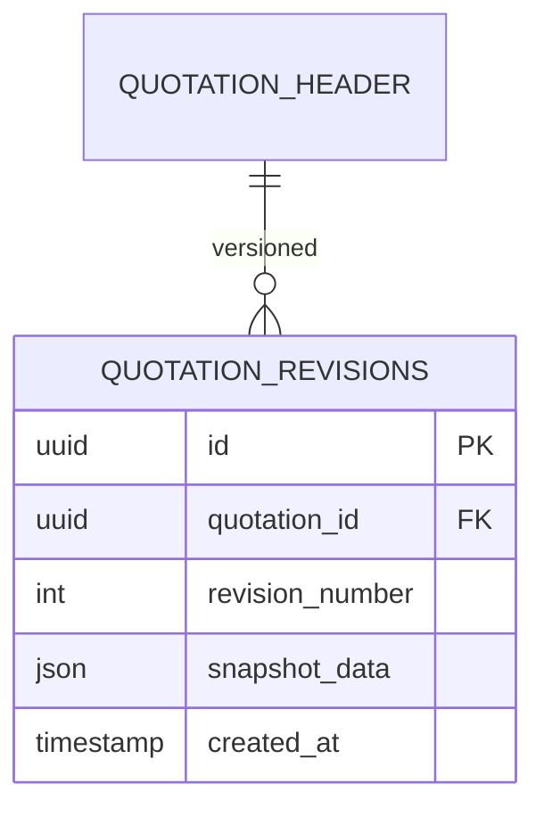

**Diagram sources**
- [database-add-quotation-revision.sql](file://src/database-add-quotation-revision.sql)
- [database-quotation-revisions.sql](file://src/database-quotation-revisions.sql)
- [database-document-series.sql](file://src/database-document-series.sql)

**Section sources**
- [database-add-quotation-revision.sql](file://src/database-add-quotation-revision.sql)
- [database-quotation-revisions.sql](file://src/database-quotation-revisions.sql)
- [database-document-series.sql](file://src/database-document-series.sql)

### Audit Trail Tracking
- Audit logs record create/update/delete actions on quotations and related entities.
- Item-level audits provide granular change history for compliance.

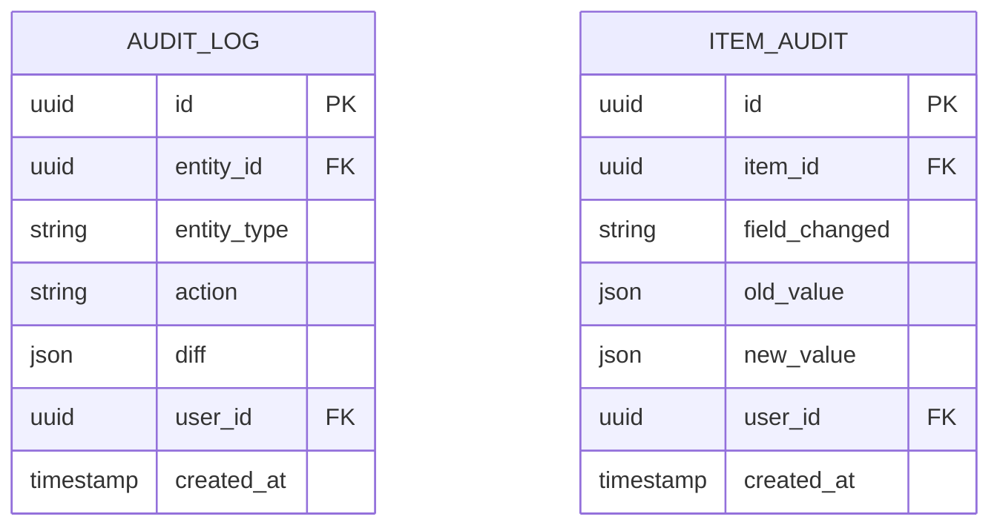

**Diagram sources**
- [database-add-audit-log.sql](file://src/database-add-audit-log.sql)
- [database-item-audit.sql](file://src/database-item-audit.sql)
- [useAuditLog.ts](file://src/hooks/useAuditLog.ts)

**Section sources**
- [database-add-audit-log.sql](file://src/database-add-audit-log.sql)
- [database-item-audit.sql](file://src/database-item-audit.sql)
- [useAuditLog.ts](file://src/hooks/useAuditLog.ts)

### Multi-Currency Support
- Currency code stored at header; exchange rates used for conversion to base currency.
- Utilities handle formatting and rounding consistently across UI and reports.

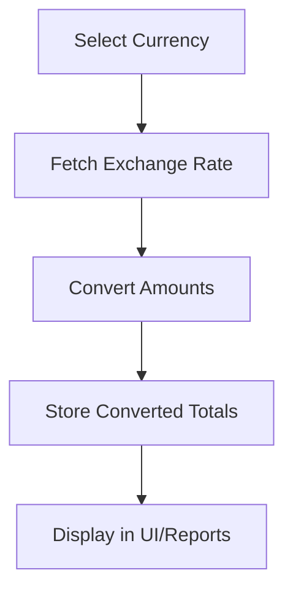

**Diagram sources**
- [currency.ts](file://src/lib/currency.ts)

**Section sources**
- [currency.ts](file://src/lib/currency.ts)

### Template-Based Document Generation
- Templates define layouts for PDF generation, including classic, professional, tally, and vertical formats.
- HTML template support enables flexible styling and branding.

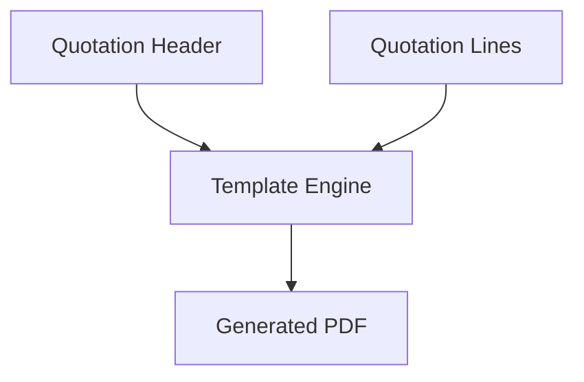

**Diagram sources**
- [ClassicQuotationTemplate.tsx](file://src/pages/ClassicQuotationTemplate.tsx)
- [InvoiceA4Template.tsx](file://src/pages/InvoiceA4Template.tsx)
- [QuotationTallyTemplate.tsx](file://src/pages/QuotationTallyTemplate.tsx)
- [database-templates.sql](file://src/database-templates.sql)
- [database-add-html-template-support.sql](file://src/database-add-html-template-support.sql)
- [database-add-professional-template.sql](file://src/database-add-professional-template.sql)
- [database-add-tally-template.sql](file://src/database-add-tally-template.sql)
- [database-add-vertical-template.sql](file://src/database-add-vertical-template.sql)
- [TemplateSettings.tsx](file://src/pages/TemplateSettings.tsx)
- [PrintSettings.tsx](file://src/pages/PrintSettings.tsx)
- [usePDFGeneration.ts](file://src/hooks/usePDFGeneration.ts)

**Section sources**
- [ClassicQuotationTemplate.tsx](file://src/pages/ClassicQuotationTemplate.tsx)
- [InvoiceA4Template.tsx](file://src/pages/InvoiceA4Template.tsx)
- [QuotationTallyTemplate.tsx](file://src/pages/QuotationTallyTemplate.tsx)
- [database-templates.sql](file://src/database-templates.sql)
- [database-add-html-template-support.sql](file://src/database-add-html-template-support.sql)
- [database-add-professional-template.sql](file://src/database-add-professional-template.sql)
- [database-add-tally-template.sql](file://src/database-add-tally-template.sql)
- [database-add-vertical-template.sql](file://src/database-add-vertical-template.sql)
- [TemplateSettings.tsx](file://src/pages/TemplateSettings.tsx)
- [PrintSettings.tsx](file://src/pages/PrintSettings.tsx)
- [usePDFGeneration.ts](file://src/hooks/usePDFGeneration.ts)

## Dependency Analysis
Key dependencies among components:
- UI pages depend on schema tables and logic modules
- Logic modules depend on utilities (currency, audit) and schema
- Templates depend on header and line data structures

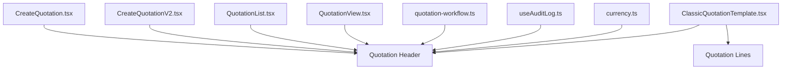

**Diagram sources**
- [CreateQuotation.tsx](file://src/pages/CreateQuotation.tsx)
- [CreateQuotationV2.tsx](file://src/pages/CreateQuotationV2.tsx)
- [QuotationList.tsx](file://src/pages/QuotationList.tsx)
- [QuotationView.tsx](file://src/pages/QuotationView.tsx)
- [quotation-workflow.ts](file://src/lib/quotation-workflow.ts)
- [useAuditLog.ts](file://src/hooks/useAuditLog.ts)
- [currency.ts](file://src/lib/currency.ts)
- [ClassicQuotationTemplate.tsx](file://src/pages/ClassicQuotationTemplate.tsx)

**Section sources**
- [CreateQuotation.tsx](file://src/pages/CreateQuotation.tsx)
- [CreateQuotationV2.tsx](file://src/pages/CreateQuotationV2.tsx)
- [QuotationList.tsx](file://src/pages/QuotationList.tsx)
- [QuotationView.tsx](file://src/pages/QuotationView.tsx)
- [quotation-workflow.ts](file://src/lib/quotation-workflow.ts)
- [useAuditLog.ts](file://src/hooks/useAuditLog.ts)
- [currency.ts](file://src/lib/currency.ts)
- [ClassicQuotationTemplate.tsx](file://src/pages/ClassicQuotationTemplate.tsx)

## Performance Considerations
- Use denormalized approval fields for dashboard reads to reduce joins.
- Index frequently queried columns such as doc_number, client_id, and status.
- Cache exchange rates and template configurations to minimize repeated lookups.
- Paginate list views and defer heavy computations until necessary.

[No sources needed since this section provides general guidance]

## Troubleshooting Guide
Common issues and resolutions:
- Approval state mismatches: verify workflow transitions and RLS policies.
- Currency conversion errors: confirm exchange rates exist for selected date and currency.
- Template rendering failures: validate HTML template syntax and required fields.
- Audit log gaps: ensure audit triggers or hooks are invoked on all mutation paths.

**Section sources**
- [database-approval-workflows-rls.sql](file://src/database-approval-workflows-rls.sql)
- [currency.ts](file://src/lib/currency.ts)
- [database-add-html-template-support.sql](file://src/database-add-html-template-support.sql)
- [database-add-audit-log.sql](file://src/database-add-audit-log.sql)

## Conclusion
The quotation data model is designed for flexibility and compliance, supporting multi-currency pricing, variant-based discounts, robust tax handling, structured approvals, versioning, and comprehensive audit trails. Integration with BOQ, materials, and inventory ensures accurate quoting and downstream fulfillment. Template-based generation provides customizable outputs for various business needs.

[No sources needed since this section summarizes without analyzing specific files]

## Appendices

### Example Queries
- List active quotations for a client with totals:
  - Select header rows where client_id matches and status is not closed, ordering by updated_at descending.
- Retrieve lines with variant pricing and tax breakdown:
  - Join lines to items and variants, compute line totals after discounts and taxes.
- Fetch latest revision for a quotation:
  - Select max revision_number grouped by quotation_id and join snapshot data.

[No sources needed since this section provides general guidance]

### Status Transitions
- Draft to Submitted: initiate approval workflow.
- Submitted to Approved: authorized by designated role.
- Submitted to Rejected: requires revision and resubmission.
- Approved to Closed: finalize and lock for reference.

**Section sources**
- [quotation-workflow.ts](file://src/lib/quotation-workflow.ts)
- [database-approval.sql](file://src/database-approval.sql)

### Integration with Inventory Management
- Check material availability before confirming quotes.
- Reserve stock upon approval if policy dictates.
- Update reservation status when quotation is closed or rejected.

**Section sources**
- [database-materials.sql](file://src/database-materials.sql)
- [database-inventory.sql](file://src/database-inventory.sql)
- [useMaterials.ts](file://src/hooks/useMaterials.ts)
- [useWarehouses.ts](file://src/hooks/useWarehouses.ts)