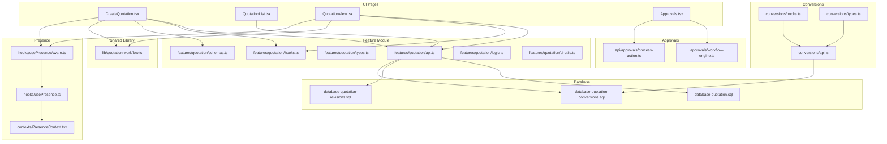
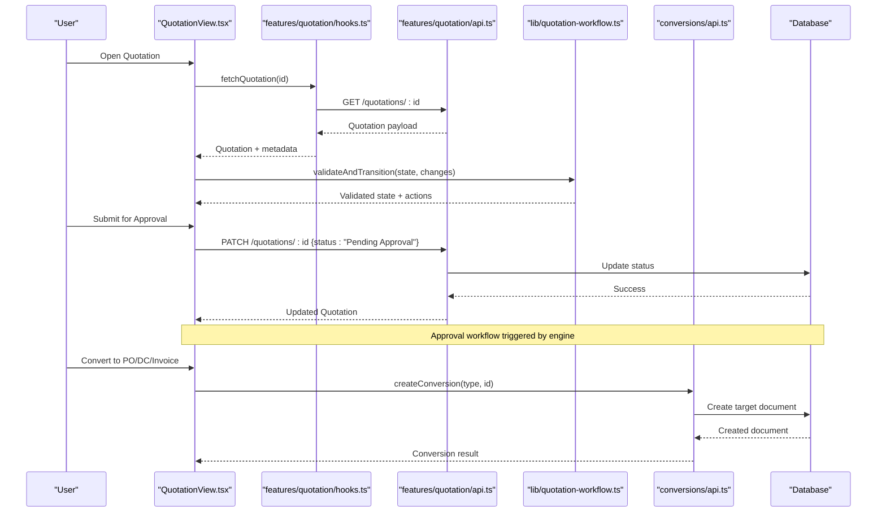
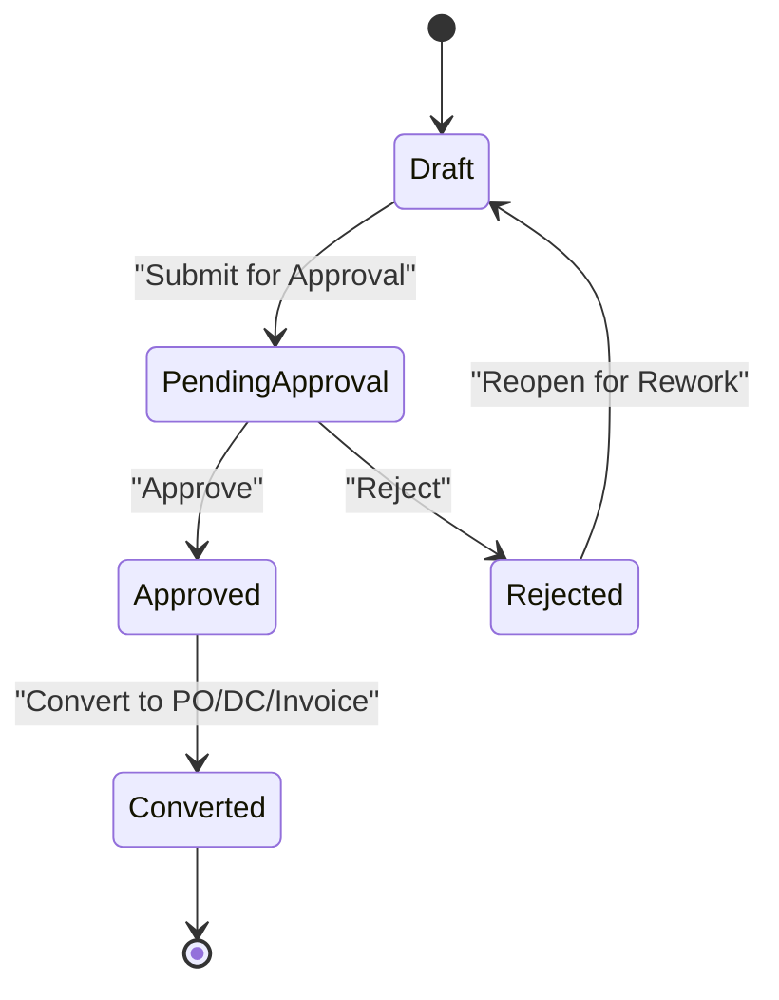
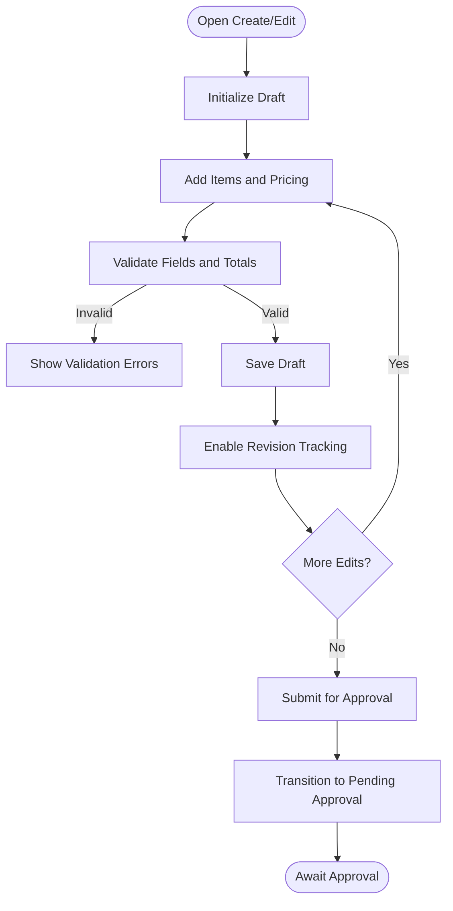
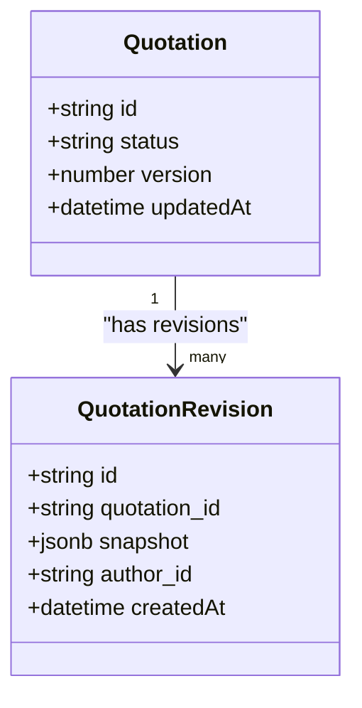
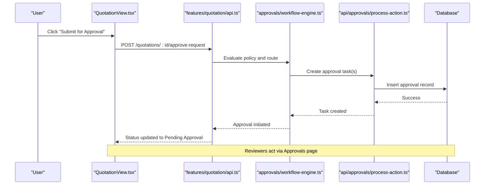
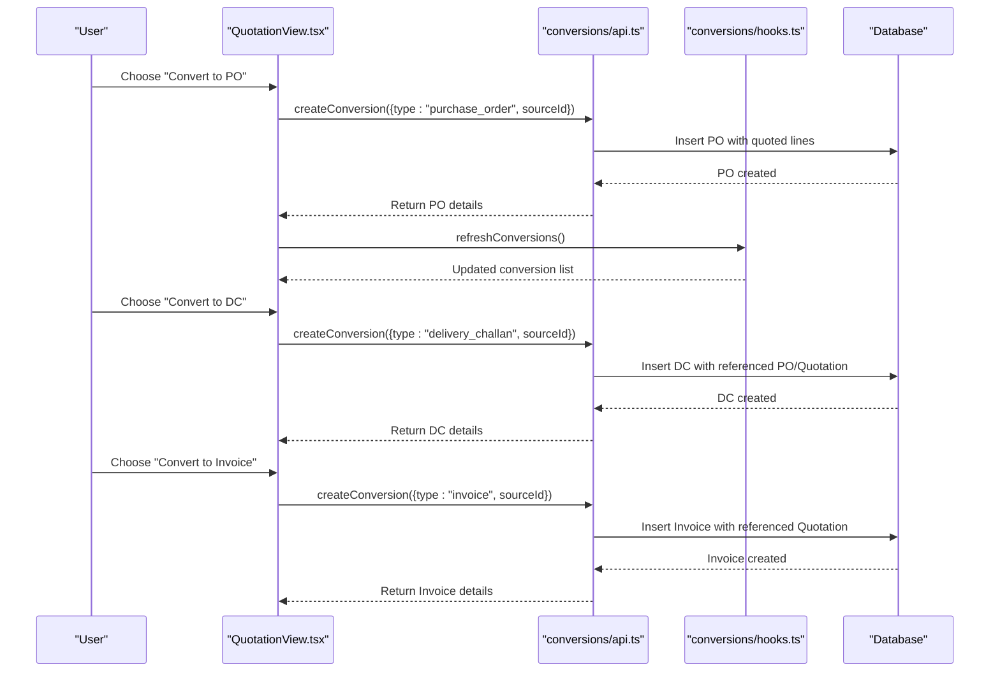
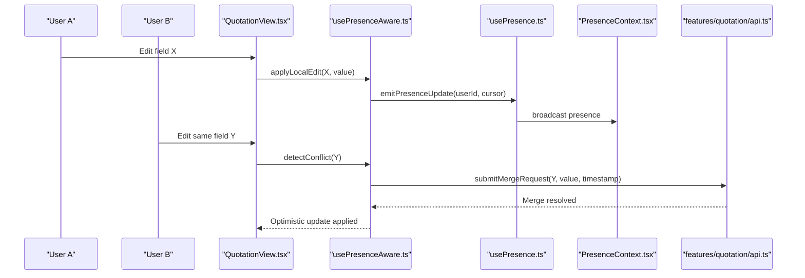
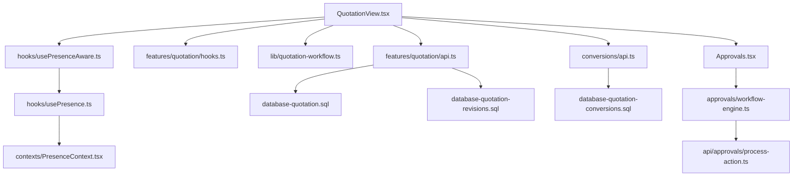

# Quotation Workflow & Lifecycle

<cite>
**Referenced Files in This Document**
- [quotation-workflow.ts](file://src/lib/quotation-workflow.ts)
- [CreateQuotation.tsx](file://src/pages/CreateQuotation.tsx)
- [CreateQuotationV2.tsx](file://src/pages/CreateQuotationV2.tsx)
- [QuotationList.tsx](file://src/pages/QuotationList.tsx)
- [QuotationView.tsx](file://src/pages/QuotationView.tsx)
- [api.ts](file://src/features/quotation/api.ts)
- [hooks.ts](file://src/features/quotation/hooks.ts)
- [types.ts](file://src/features/quotation/types.ts)
- [logic.ts](file://src/features/quotation/logic.ts)
- [schemas.ts](file://src/features/quotation/schemas.ts)
- [ui-utils.ts](file://src/features/quotation/ui-utils.ts)
- [database-quotation.sql](file://src/database-quotation.sql)
- [database-quotation-revisions.sql](file://src/database-quotation-revisions.sql)
- [database-quotation-conversions.sql](file://src/database-quotation-conversions.sql)
- [database-add-quotation-revision.sql](file://src/database-add-quotation-revision.sql)
- [api.ts](file://src/conversions/api.ts)
- [hooks.ts](file://src/conversions/hooks.ts)
- [types.ts](file://src/conversions/types.ts)
- [usePresence.ts](file://src/hooks/usePresence.ts)
- [PresenceContext.tsx](file://src/contexts/PresenceContext.tsx)
- [usePresenceAware.ts](file://src/hooks/usePresenceAware.ts)
- [PresenceAwareExample.tsx](file://src/examples/PresenceAwareExample.tsx)
- [Approvals.tsx](file://src/pages/Approvals.tsx)
- [ApprovalDetailDrawer.tsx](file://src/components/ApprovalDetailDrawer.tsx)
- [ApprovalDetailsSidebar.tsx](file://src/components/ApprovalDetailsSidebar.tsx)
- [ApprovalSettings.tsx](file://src/components/ApprovalSettings.tsx)
- [workflow-engine.ts](file://src/approvals/workflow-engine.ts)
- [process-action.ts](file://src/api/approvals/process-action.ts)
- [PODetails.tsx](file://src/pages/PODetails.tsx)
- [POList.tsx](file://src/pages/POList.tsx)
- [CreatePO.tsx](file://src/pages/CreatePO.tsx)
- [DCList.tsx](file://src/pages/DCList.tsx)
- [DCView.tsx](file://src/pages/DCView.tsx)
- [CreateDC.tsx](file://src/pages/CreateDC.tsx)
- [DCEdit.tsx](file://src/pages/DCEdit.tsx)
- [InvoiceList.tsx](file://src/invoices/pages/InvoiceList.tsx)
- [InvoiceView.tsx](file://src/invoices/pages/InvoiceView.tsx)
- [CreateProjectInvoiceModal.tsx](file://src/components/CreateProjectInvoiceModal.tsx)
</cite>

## Table of Contents
1. [Introduction](#introduction)
2. [Project Structure](#project-structure)
3. [Core Components](#core-components)
4. [Architecture Overview](#architecture-overview)
5. [Detailed Component Analysis](#detailed-component-analysis)
6. [Dependency Analysis](#dependency-analysis)
7. [Performance Considerations](#performance-considerations)
8. [Troubleshooting Guide](#troubleshooting-guide)
9. [Conclusion](#conclusion)
10. [Appendices](#appendices)

## Introduction
This document explains the end-to-end quotation workflow and lifecycle management, from creation through approval to conversion into purchase orders, delivery challans, and invoices. It covers state transitions, validation rules, business logic at each stage, revision management, collaboration features (presence awareness), and conflict resolution during concurrent editing. Concrete examples are provided for editing quotations, managing revisions, and executing approvals. The conversion pipeline is mapped to downstream documents with clear sequence flows.

## Project Structure
The quotation feature spans UI pages, feature modules, shared libraries, database migrations, and cross-cutting services such as approvals and presence. Key areas:
- Pages: Create, List, View, Approvals
- Feature module: API, hooks, types, schemas, logic, UI utilities
- Shared library: Quotation workflow engine
- Conversions: API, hooks, types for converting quotations to other documents
- Presence: Hooks and context for real-time collaboration
- Database: Schema and migrations for quotations, revisions, and conversions
- Approvals: Workflow engine and action processing

**Diagram sources**
- [CreateQuotation.tsx](file://src/pages/CreateQuotation.tsx)
- [QuotationList.tsx](file://src/pages/QuotationList.tsx)
- [QuotationView.tsx](file://src/pages/QuotationView.tsx)
- [api.ts](file://src/features/quotation/api.ts)
- [hooks.ts](file://src/features/quotation/hooks.ts)
- [schemas.ts](file://src/features/quotation/schemas.ts)
- [logic.ts](file://src/features/quotation/logic.ts)
- [ui-utils.ts](file://src/features/quotation/ui-utils.ts)
- [quotation-workflow.ts](file://src/lib/quotation-workflow.ts)
- [api.ts](file://src/conversions/api.ts)
- [hooks.ts](file://src/conversions/hooks.ts)
- [types.ts](file://src/conversions/types.ts)
- [usePresence.ts](file://src/hooks/usePresence.ts)
- [PresenceContext.tsx](file://src/contexts/PresenceContext.tsx)
- [usePresenceAware.ts](file://src/hooks/usePresenceAware.ts)
- [database-quotation.sql](file://src/database-quotation.sql)
- [database-quotation-revisions.sql](file://src/database-quotation-revisions.sql)
- [database-quotation-conversions.sql](file://src/database-quotation-conversions.sql)
- [workflow-engine.ts](file://src/approvals/workflow-engine.ts)
- [process-action.ts](file://src/api/approvals/process-action.ts)

**Section sources**
- [CreateQuotation.tsx](file://src/pages/CreateQuotation.tsx)
- [CreateQuotationV2.tsx](file://src/pages/CreateQuotationV2.tsx)
- [QuotationList.tsx](file://src/pages/QuotationList.tsx)
- [QuotationView.tsx](file://src/pages/QuotationView.tsx)
- [api.ts](file://src/features/quotation/api.ts)
- [hooks.ts](file://src/features/quotation/hooks.ts)
- [types.ts](file://src/features/quotation/types.ts)
- [schemas.ts](file://src/features/quotation/schemas.ts)
- [logic.ts](file://src/features/quotation/logic.ts)
- [ui-utils.ts](file://src/features/quotation/ui-utils.ts)
- [quotation-workflow.ts](file://src/lib/quotation-workflow.ts)
- [api.ts](file://src/conversions/api.ts)
- [hooks.ts](file://src/conversions/hooks.ts)
- [types.ts](file://src/conversions/types.ts)
- [usePresence.ts](file://src/hooks/usePresence.ts)
- [PresenceContext.tsx](file://src/contexts/PresenceContext.tsx)
- [usePresenceAware.ts](file://src/hooks/usePresenceAware.ts)
- [database-quotation.sql](file://src/database-quotation.sql)
- [database-quotation-revisions.sql](file://src/database-quotation-revisions.sql)
- [database-quotation-conversions.sql](file://src/database-quotation-conversions.sql)
- [workflow-engine.ts](file://src/approvals/workflow-engine.ts)
- [process-action.ts](file://src/api/approvals/process-action.ts)

## Core Components
- Quotation Workflow Engine: Centralizes state machine transitions, validation, and business rules for quotations.
- Quotation Feature Module: Encapsulates API calls, data fetching hooks, type definitions, schema validations, domain logic, and UI helpers.
- Conversion Layer: Provides APIs and hooks to convert approved quotations into purchase orders, delivery challans, and invoices.
- Presence System: Real-time presence context and hooks to support collaborative editing and conflict resolution.
- Approval Integration: Connects quotations to the approval workflow engine and action processing endpoints.

Key responsibilities:
- State transitions: Draft → Pending Approval → Approved → Rejected → Converted
- Validation: Required fields, pricing integrity, item completeness, approval gating
- Revisioning: Versioned snapshots on edits before approval
- Collaboration: Presence-aware editing with conflict detection and resolution strategies
- Conversion: One-click or guided conversion to PO/DC/Invoice with audit trails

**Section sources**
- [quotation-workflow.ts](file://src/lib/quotation-workflow.ts)
- [api.ts](file://src/features/quotation/api.ts)
- [hooks.ts](file://src/features/quotation/hooks.ts)
- [types.ts](file://src/features/quotation/types.ts)
- [schemas.ts](file://src/features/quotation/schemas.ts)
- [logic.ts](file://src/features/quotation/logic.ts)
- [ui-utils.ts](file://src/features/quotation/ui-utils.ts)
- [api.ts](file://src/conversions/api.ts)
- [hooks.ts](file://src/conversions/hooks.ts)
- [types.ts](file://src/conversions/types.ts)
- [usePresence.ts](file://src/hooks/usePresence.ts)
- [PresenceContext.tsx](file://src/contexts/PresenceContext.tsx)
- [usePresenceAware.ts](file://src/hooks/usePresenceAware.ts)
- [workflow-engine.ts](file://src/approvals/workflow-engine.ts)
- [process-action.ts](file://src/api/approvals/process-action.ts)

## Architecture Overview
The system follows a layered architecture:
- UI layer: Pages orchestrate user interactions and render views
- Feature layer: Business logic, validation, and API integration
- Shared library: Cross-cutting workflow engine
- Persistence: Database via Supabase migrations
- Cross-cutting: Presence, approvals, conversions

**Diagram sources**
- [QuotationView.tsx](file://src/pages/QuotationView.tsx)
- [hooks.ts](file://src/features/quotation/hooks.ts)
- [api.ts](file://src/features/quotation/api.ts)
- [quotation-workflow.ts](file://src/lib/quotation-workflow.ts)
- [api.ts](file://src/conversions/api.ts)
- [database-quotation.sql](file://src/database-quotation.sql)
- [database-quotation-conversions.sql](file://src/database-quotation-conversions.sql)

## Detailed Component Analysis

### Quotation State Machine and Transitions
The workflow engine defines allowed transitions and guards:
- Draft → Pending Approval: Requires valid header, items, totals, and approver selection if configured
- Pending Approval → Approved: Requires successful approval action
- Pending Approval → Rejected: Requires rejection reason and optional comments
- Approved → Converted: Only one active conversion per document type; conversion creates linked records
- Any non-final state → Draft: Allowed for rework when not converted

Validation rules enforced by the engine include:
- Mandatory client/project linkage
- Item list completeness and pricing consistency
- Tax calculations and discount application
- Approval policy adherence (thresholds, roles)

**Diagram sources**
- [quotation-workflow.ts](file://src/lib/quotation-workflow.ts)

**Section sources**
- [quotation-workflow.ts](file://src/lib/quotation-workflow.ts)
- [logic.ts](file://src/features/quotation/logic.ts)
- [schemas.ts](file://src/features/quotation/schemas.ts)

### Creation and Editing Flow
Creation flow:
- Initialize draft with defaults (client, currency, terms)
- Add line items with rates, taxes, discounts
- Validate totals and required fields
- Persist draft and enable revision tracking

Editing flow:
- Load latest version and presence info
- Apply local edits with optimistic updates
- On save, create a new revision snapshot and update current state
- Conflict resolution merges based on timestamps and presence locks

**Diagram sources**
- [CreateQuotation.tsx](file://src/pages/CreateQuotation.tsx)
- [CreateQuotationV2.tsx](file://src/pages/CreateQuotationV2.tsx)
- [schemas.ts](file://src/features/quotation/schemas.ts)
- [logic.ts](file://src/features/quotation/logic.ts)
- [database-quotation-revisions.sql](file://src/database-quotation-revisions.sql)

**Section sources**
- [CreateQuotation.tsx](file://src/pages/CreateQuotation.tsx)
- [CreateQuotationV2.tsx](file://src/pages/CreateQuotationV2.tsx)
- [schemas.ts](file://src/features/quotation/schemas.ts)
- [logic.ts](file://src/features/quotation/logic.ts)
- [database-quotation-revisions.sql](file://src/database-quotation-revisions.sql)

### Revision Management
Revisions capture snapshots of quotation content upon significant edits:
- Each revision includes timestamp, author, and change summary
- Users can compare versions and restore previous states
- Revisions are immutable and auditable

**Diagram sources**
- [database-quotation-revisions.sql](file://src/database-quotation-revisions.sql)
- [database-add-quotation-revision.sql](file://src/database-add-quotation-revision.sql)

**Section sources**
- [database-quotation-revisions.sql](file://src/database-quotation-revisions.sql)
- [database-add-quotation-revision.sql](file://src/database-add-quotation-revision.sql)

### Approval Process
Approval integrates with the central workflow engine:
- Trigger approval submission from Quotation view
- Route to appropriate reviewers based on policies
- Record approval decisions and reasons
- Enforce transition to Approved or Rejected

**Diagram sources**
- [QuotationView.tsx](file://src/pages/QuotationView.tsx)
- [api.ts](file://src/features/quotation/api.ts)
- [workflow-engine.ts](file://src/approvals/workflow-engine.ts)
- [process-action.ts](file://src/api/approvals/process-action.ts)
- [Approvals.tsx](file://src/pages/Approvals.tsx)

**Section sources**
- [QuotationView.tsx](file://src/pages/QuotationView.tsx)
- [api.ts](file://src/features/quotation/api.ts)
- [workflow-engine.ts](file://src/approvals/workflow-engine.ts)
- [process-action.ts](file://src/api/approvals/process-action.ts)
- [Approvals.tsx](file://src/pages/Approvals.tsx)
- [ApprovalDetailDrawer.tsx](file://src/components/ApprovalDetailDrawer.tsx)
- [ApprovalDetailsSidebar.tsx](file://src/components/ApprovalDetailsSidebar.tsx)
- [ApprovalSettings.tsx](file://src/components/ApprovalSettings.tsx)

### Conversion Pipeline (Quotation → PO/DC/Invoice)
Approved quotations can be converted into:
- Purchase Orders (PO): For procurement against vendor quotes
- Delivery Challans (DC): For goods dispatch tracking
- Invoices: For billing customers

Conversion rules:
- Only Approved quotations are convertible
- Conversion preserves line items, pricing, taxes, and references
- Creates linked records with audit trail and status propagation

**Diagram sources**
- [QuotationView.tsx](file://src/pages/QuotationView.tsx)
- [api.ts](file://src/conversions/api.ts)
- [hooks.ts](file://src/conversions/hooks.ts)
- [types.ts](file://src/conversions/types.ts)
- [database-quotation-conversions.sql](file://src/database-quotation-conversions.sql)

**Section sources**
- [api.ts](file://src/conversions/api.ts)
- [hooks.ts](file://src/conversions/hooks.ts)
- [types.ts](file://src/conversions/types.ts)
- [database-quotation-conversions.sql](file://src/database-quotation-conversions.sql)
- [PODetails.tsx](file://src/pages/PODetails.tsx)
- [POList.tsx](file://src/pages/POList.tsx)
- [CreatePO.tsx](file://src/pages/CreatePO.tsx)
- [DCList.tsx](file://src/pages/DCList.tsx)
- [DCView.tsx](file://src/pages/DCView.tsx)
- [CreateDC.tsx](file://src/pages/CreateDC.tsx)
- [DCEdit.tsx](file://src/pages/DCEdit.tsx)
- [InvoiceList.tsx](file://src/invoices/pages/InvoiceList.tsx)
- [InvoiceView.tsx](file://src/invoices/pages/InvoiceView.tsx)
- [CreateProjectInvoiceModal.tsx](file://src/components/CreateProjectInvoiceModal.tsx)

### Collaboration Features, Presence Awareness, and Conflict Resolution
Presence system enables multi-user editing:
- PresenceContext tracks active users and cursors
- usePresence hook subscribes to presence events
- usePresenceAware provides conflict detection and merge strategies

Conflict resolution strategy:
- Last-write-wins with timestamp checks
- Field-level locking for critical sections
- Merge suggestions for overlapping edits

**Diagram sources**
- [QuotationView.tsx](file://src/pages/QuotationView.tsx)
- [usePresenceAware.ts](file://src/hooks/usePresenceAware.ts)
- [usePresence.ts](file://src/hooks/usePresence.ts)
- [PresenceContext.tsx](file://src/contexts/PresenceContext.tsx)
- [api.ts](file://src/features/quotation/api.ts)

**Section sources**
- [usePresence.ts](file://src/hooks/usePresence.ts)
- [PresenceContext.tsx](file://src/contexts/PresenceContext.tsx)
- [usePresenceAware.ts](file://src/hooks/usePresenceAware.ts)
- [PresenceAwareExample.tsx](file://src/examples/PresenceAwareExample.tsx)

## Dependency Analysis
The following diagram shows key dependencies between components involved in the quotation lifecycle:

**Diagram sources**
- [QuotationView.tsx](file://src/pages/QuotationView.tsx)
- [api.ts](file://src/features/quotation/api.ts)
- [hooks.ts](file://src/features/quotation/hooks.ts)
- [quotation-workflow.ts](file://src/lib/quotation-workflow.ts)
- [api.ts](file://src/conversions/api.ts)
- [usePresenceAware.ts](file://src/hooks/usePresenceAware.ts)
- [usePresence.ts](file://src/hooks/usePresence.ts)
- [PresenceContext.tsx](file://src/contexts/PresenceContext.tsx)
- [database-quotation.sql](file://src/database-quotation.sql)
- [database-quotation-revisions.sql](file://src/database-quotation-revisions.sql)
- [database-quotation-conversions.sql](file://src/database-quotation-conversions.sql)
- [Approvals.tsx](file://src/pages/Approvals.tsx)
- [workflow-engine.ts](file://src/approvals/workflow-engine.ts)
- [process-action.ts](file://src/api/approvals/process-action.ts)

**Section sources**
- [QuotationView.tsx](file://src/pages/QuotationView.tsx)
- [api.ts](file://src/features/quotation/api.ts)
- [hooks.ts](file://src/features/quotation/hooks.ts)
- [quotation-workflow.ts](file://src/lib/quotation-workflow.ts)
- [api.ts](file://src/conversions/api.ts)
- [usePresenceAware.ts](file://src/hooks/usePresenceAware.ts)
- [usePresence.ts](file://src/hooks/usePresence.ts)
- [PresenceContext.tsx](file://src/contexts/PresenceContext.tsx)
- [database-quotation.sql](file://src/database-quotation.sql)
- [database-quotation-revisions.sql](file://src/database-quotation-revisions.sql)
- [database-quotation-conversions.sql](file://src/database-quotation-conversions.sql)
- [Approvals.tsx](file://src/pages/Approvals.tsx)
- [workflow-engine.ts](file://src/approvals/workflow-engine.ts)
- [process-action.ts](file://src/api/approvals/process-action.ts)

## Performance Considerations
- Use optimistic updates for edits to improve responsiveness
- Debounce heavy computations like tax recalculations
- Paginate lists and lazy-load large item tables
- Cache approval settings and policies to reduce repeated queries
- Minimize network round-trips by batching conversion requests where possible

[No sources needed since this section provides general guidance]

## Troubleshooting Guide
Common issues and resolutions:
- Approval stuck in Pending: Verify workflow engine routing and reviewer assignments; check process-action logs
- Conversion fails after approval: Ensure quotation status is Approved and no prior conversion exists for the same target type
- Presence conflicts: Inspect timestamps and lock fields; revert to last known good revision if necessary
- Validation errors on submit: Check schema constraints and required fields; review error messages from schemas and logic modules

**Section sources**
- [workflow-engine.ts](file://src/approvals/workflow-engine.ts)
- [process-action.ts](file://src/api/approvals/process-action.ts)
- [schemas.ts](file://src/features/quotation/schemas.ts)
- [logic.ts](file://src/features/quotation/logic.ts)

## Conclusion
The quotation workflow integrates creation, validation, revisioning, approvals, and conversion into a cohesive lifecycle. The workflow engine enforces robust state transitions and business rules, while the presence system supports collaborative editing with conflict resolution. The conversion pipeline ensures traceability from quotations to downstream documents, maintaining data integrity and auditability across the system.

[No sources needed since this section summarizes without analyzing specific files]

## Appendices

### Example Scenarios
- Editing a Quotation:
  - Open QuotationView, make changes, save draft, create revision snapshot
  - Reference: [QuotationView.tsx](file://src/pages/QuotationView.tsx), [database-quotation-revisions.sql](file://src/database-quotation-revisions.sql)
- Managing Revisions:
  - Compare versions, restore previous state, maintain immutability
  - Reference: [database-quotation-revisions.sql](file://src/database-quotation-revisions.sql), [database-add-quotation-revision.sql](file://src/database-add-quotation-revision.sql)
- Approval Submission and Actions:
  - Submit for approval, route to reviewers, approve/reject with reasons
  - Reference: [QuotationView.tsx](file://src/pages/QuotationView.tsx), [Approvals.tsx](file://src/pages/Approvals.tsx), [workflow-engine.ts](file://src/approvals/workflow-engine.ts), [process-action.ts](file://src/api/approvals/process-action.ts)
- Converting to PO/DC/Invoice:
  - Select conversion type, create linked document, propagate status
  - Reference: [api.ts](file://src/conversions/api.ts), [hooks.ts](file://src/conversions/hooks.ts), [types.ts](file://src/conversions/types.ts), [database-quotation-conversions.sql](file://src/database-quotation-conversions.sql)

[No sources needed since this section aggregates previously referenced files]