# Sales Documents & Quotations

<cite>
**Referenced Files in This Document**
- [database-quotation.sql](file://src/database-quotation.sql)
- [database-quotation-conversions.sql](file://src/database-quotation-conversions.sql)
- [database-quotation-revisions.sql](file://src/database-quotation-revisions.sql)
- [database-document-series.sql](file://src/database-document-series.sql)
- [database-hsn-tax.sql](file://src/database-hsn-tax.sql)
- [database-discount-settings.sql](file://src/database-discount-settings.sql)
- [database-templates.sql](file://src/database-templates.sql)
- [database-inventory.sql](file://src/database-inventory.sql)
- [database-approval.sql](file://src/database-approval.sql)
- [database-item-audit.sql](file://src/database-item-audit.sql)
- [quotation-workflow.ts](file://src/lib/quotation-workflow.ts)
- [CreateQuotation.tsx](file://src/pages/CreateQuotation.tsx)
- [CreateQuotationV2.tsx](file://src/pages/CreateQuotationV2.tsx)
- [QuotationList.tsx](file://src/pages/QuotationList.tsx)
- [QuotationView.tsx](file://src/pages/QuotationView.tsx)
- [api.ts](file://src/features/quotation/api.ts)
- [hooks.ts](file://src/features/quotation/hooks.ts)
- [types.ts](file://src/features/quotation/types.ts)
- [logic.ts](file://src/features/quotation/logic.ts)
- [pdf.tsx](file://src/invoices/pdf.tsx)
- [grid-minimal-mapper.ts](file://src/invoices/grid-minimal-mapper.ts)
- [currency.ts](file://src/lib/currency.ts)
- [usePDFGeneration.ts](file://src/hooks/usePDFGeneration.ts)
</cite>

## Table of Contents
1. Introduction
2. Project Structure
3. Core Components
4. Architecture Overview
5. Detailed Component Analysis
6. Dependency Analysis
7. Performance Considerations
8. Troubleshooting Guide
9. Conclusion
10. Appendices

## Introduction
This document describes the data model and workflows for sales documents with a focus on quotations. It covers quotation headers and line items, pricing calculations (taxes, discounts), approval workflows, template-based document generation, multi-currency support, version control, and integration with inventory management. It also explains the end-to-end lifecycle from quotation creation through conversion into orders or invoices, including status transitions and audit trail tracking.

## Project Structure
The quotation system spans database schema definitions, feature modules, UI pages, PDF generation, and utility libraries:
- Database schemas define core entities and relationships for quotations, conversions, revisions, series, taxes, discounts, templates, inventory, approvals, and audits.
- Feature module provides API hooks, types, and business logic for quotations.
- UI pages implement creation, listing, viewing, and editing flows.
- PDF and grid mappers handle template rendering and export.
- Utility libraries provide currency handling and PDF generation hooks.

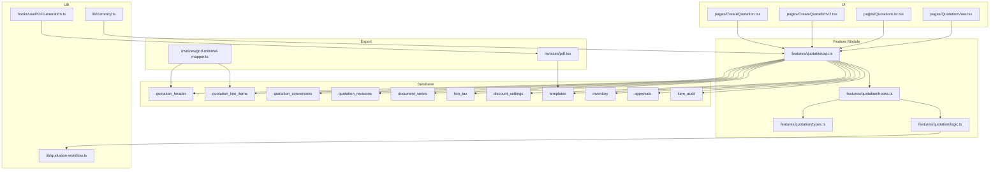

**Diagram sources**
- [database-quotation.sql](file://src/database-quotation.sql)
- [database-quotation-conversions.sql](file://src/database-quotation-conversions.sql)
- [database-quotation-revisions.sql](file://src/database-quotation-revisions.sql)
- [database-document-series.sql](file://src/database-document-series.sql)
- [database-hsn-tax.sql](file://src/database-hsn-tax.sql)
- [database-discount-settings.sql](file://src/database-discount-settings.sql)
- [database-templates.sql](file://src/database-templates.sql)
- [database-inventory.sql](file://src/database-inventory.sql)
- [database-approval.sql](file://src/database-approval.sql)
- [database-item-audit.sql](file://src/database-item-audit.sql)
- [api.ts](file://src/features/quotation/api.ts)
- [hooks.ts](file://src/features/quotation/hooks.ts)
- [types.ts](file://src/features/quotation/types.ts)
- [logic.ts](file://src/features/quotation/logic.ts)
- [quotation-workflow.ts](file://src/lib/quotation-workflow.ts)
- [CreateQuotation.tsx](file://src/pages/CreateQuotation.tsx)
- [CreateQuotationV2.tsx](file://src/pages/CreateQuotationV2.tsx)
- [QuotationList.tsx](file://src/pages/QuotationList.tsx)
- [QuotationView.tsx](file://src/pages/QuotationView.tsx)
- [pdf.tsx](file://src/invoices/pdf.tsx)
- [grid-minimal-mapper.ts](file://src/invoices/grid-minimal-mapper.ts)
- [currency.ts](file://src/lib/currency.ts)
- [usePDFGeneration.ts](file://src/hooks/usePDFGeneration.ts)

**Section sources**
- [database-quotation.sql](file://src/database-quotation.sql)
- [database-quotation-conversions.sql](file://src/database-quotation-conversions.sql)
- [database-quotation-revisions.sql](file://src/database-quotation-revisions.sql)
- [database-document-series.sql](file://src/database-document-series.sql)
- [database-hsn-tax.sql](file://src/database-hsn-tax.sql)
- [database-discount-settings.sql](file://src/database-discount-settings.sql)
- [database-templates.sql](file://src/database-templates.sql)
- [database-inventory.sql](file://src/database-inventory.sql)
- [database-approval.sql](file://src/database-approval.sql)
- [database-item-audit.sql](file://src/database-item-audit.sql)
- [api.ts](file://src/features/quotation/api.ts)
- [hooks.ts](file://src/features/quotation/hooks.ts)
- [types.ts](file://src/features/quotation/types.ts)
- [logic.ts](file://src/features/quotation/logic.ts)
- [quotation-workflow.ts](file://src/lib/quotation-workflow.ts)
- [CreateQuotation.tsx](file://src/pages/CreateQuotation.tsx)
- [CreateQuotationV2.tsx](file://src/pages/CreateQuotationV2.tsx)
- [QuotationList.tsx](file://src/pages/QuotationList.tsx)
- [QuotationView.tsx](file://src/pages/QuotationView.tsx)
- [pdf.tsx](file://src/invoices/pdf.tsx)
- [grid-minimal-mapper.ts](file://src/invoices/grid-minimal-mapper.ts)
- [currency.ts](file://src/lib/currency.ts)
- [usePDFGeneration.ts](file://src/hooks/usePDFGeneration.ts)

## Core Components
- Quotation Header: Stores document metadata, client details, currency, exchange rate, totals, tax summary, discount summary, status, and versioning fields.
- Quotation Line Items: Stores per-line product/service details, quantities, unit prices, discounts, taxes, and extended amounts.
- Conversions: Tracks downstream documents created from a quotation (e.g., order, invoice), preserving linkage and quantities.
- Revisions: Captures version snapshots to support change history and rollback.
- Series: Manages numbering sequences for consistent document IDs.
- Taxes: Defines tax rules (HSN/SAC, rates, applicability).
- Discounts: Configures discount categories and application rules.
- Templates: Holds HTML/CSS templates for generating PDFs and printed outputs.
- Inventory: Provides stock levels and availability checks during quotation creation and conversion.
- Approvals: Enforces workflow states and permissions before publishing or converting quotations.
- Audit: Records changes to items and documents for traceability.

Key responsibilities:
- Pricing engine computes line totals, applies discounts, calculates taxes, and aggregates totals at header level.
- Workflow engine validates state transitions and enforces approval gates.
- Template engine renders final documents using configured templates.
- Currency utilities ensure correct formatting and conversion across multi-currency scenarios.

**Section sources**
- [database-quotation.sql](file://src/database-quotation.sql)
- [database-quotation-conversions.sql](file://src/database-quotation-conversions.sql)
- [database-quotation-revisions.sql](file://src/database-quotation-revisions.sql)
- [database-document-series.sql](file://src/database-document-series.sql)
- [database-hsn-tax.sql](file://src/database-hsn-tax.sql)
- [database-discount-settings.sql](file://src/database-discount-settings.sql)
- [database-templates.sql](file://src/database-templates.sql)
- [database-inventory.sql](file://src/database-inventory.sql)
- [database-approval.sql](file://src/database-approval.sql)
- [database-item-audit.sql](file://src/database-item-audit.sql)
- [logic.ts](file://src/features/quotation/logic.ts)
- [quotation-workflow.ts](file://src/lib/quotation-workflow.ts)
- [currency.ts](file://src/lib/currency.ts)

## Architecture Overview
The system follows a layered architecture:
- Data Layer: SQL migrations define relational tables and constraints.
- Service Layer: Feature APIs and hooks encapsulate business logic and orchestrate operations.
- Presentation Layer: Pages render forms, lists, and views; PDF generator produces printable documents.
- Utilities: Currency handling and workflow validation support cross-cutting concerns.

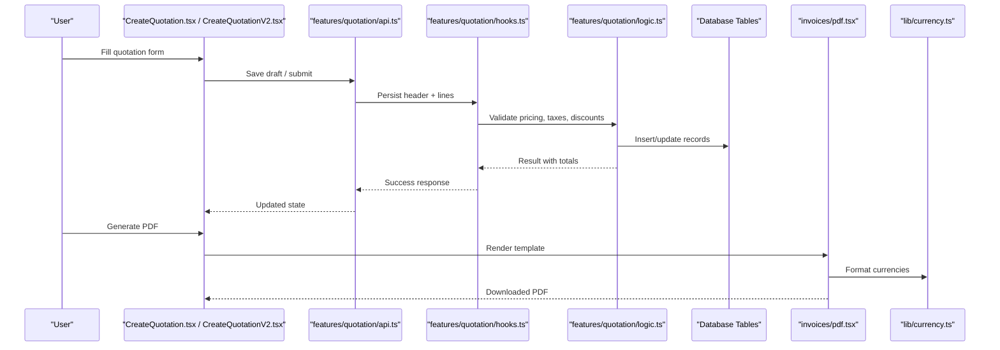

**Diagram sources**
- [CreateQuotation.tsx](file://src/pages/CreateQuotation.tsx)
- [CreateQuotationV2.tsx](file://src/pages/CreateQuotationV2.tsx)
- [api.ts](file://src/features/quotation/api.ts)
- [hooks.ts](file://src/features/quotation/hooks.ts)
- [logic.ts](file://src/features/quotation/logic.ts)
- [pdf.tsx](file://src/invoices/pdf.tsx)
- [currency.ts](file://src/lib/currency.ts)

## Detailed Component Analysis

### Data Model: Quotation Header and Line Items
- Quotation Header includes identifiers, client info, dates, currency, exchange rate, totals, tax summary, discount summary, status, and version fields.
- Quotation Line Items include item references, descriptions, quantities, unit prices, discounts, taxes, and extended amounts.

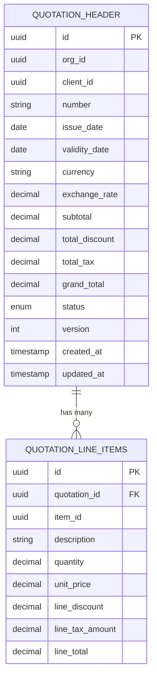

**Diagram sources**
- [database-quotation.sql](file://src/database-quotation.sql)

**Section sources**
- [database-quotation.sql](file://src/database-quotation.sql)

### Pricing Calculations: Taxes and Discounts
- Tax configuration is defined via HSN/SAC and rate settings.
- Discount settings allow category-level and client-specific rules.
- Pricing logic computes line totals, applies discounts, calculates taxes, and aggregates header totals.

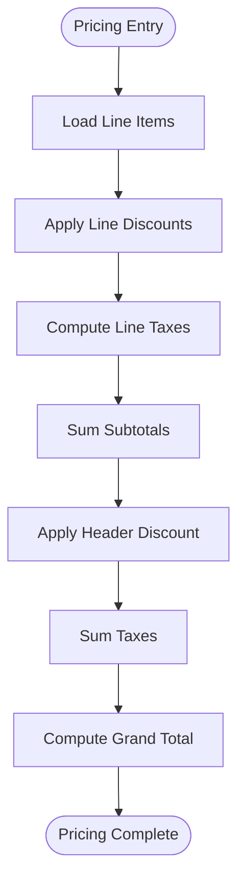

**Diagram sources**
- [database-hsn-tax.sql](file://src/database-hsn-tax.sql)
- [database-discount-settings.sql](file://src/database-discount-settings.sql)
- [logic.ts](file://src/features/quotation/logic.ts)

**Section sources**
- [database-hsn-tax.sql](file://src/database-hsn-tax.sql)
- [database-discount-settings.sql](file://src/database-discount-settings.sql)
- [logic.ts](file://src/features/quotation/logic.ts)

### Approval Workflows and Status Transitions
- Approval settings enforce workflow rules and permissions.
- Status transitions are validated by the workflow engine before allowing actions like publish or convert.

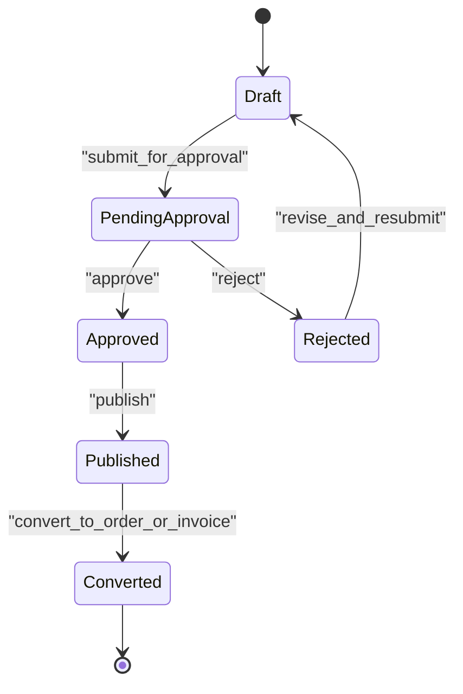

**Diagram sources**
- [database-approval.sql](file://src/database-approval.sql)
- [quotation-workflow.ts](file://src/lib/quotation-workflow.ts)

**Section sources**
- [database-approval.sql](file://src/database-approval.sql)
- [quotation-workflow.ts](file://src/lib/quotation-workflow.ts)

### Version Control and Revisions
- Revisions capture snapshots of quotation state to support change history and rollback.
- Each revision links back to the parent quotation and stores version metadata.

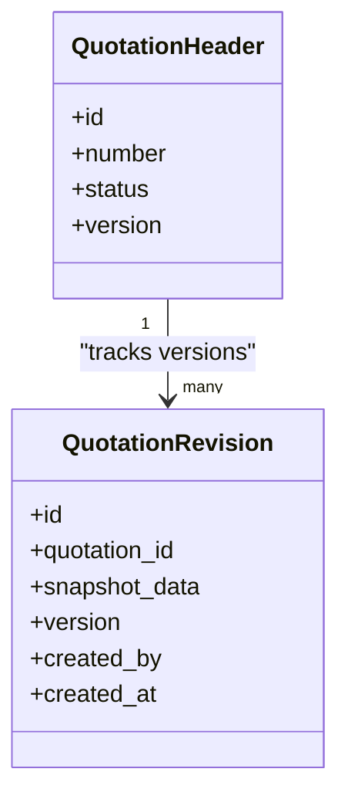

**Diagram sources**
- [database-quotation-revisions.sql](file://src/database-quotation-revisions.sql)

**Section sources**
- [database-quotation-revisions.sql](file://src/database-quotation-revisions.sql)

### Conversion to Orders or Invoices
- Conversion records link quotations to downstream documents, preserving quantities and pricing context.
- Conversion flow ensures referential integrity and supports partial/full conversions.

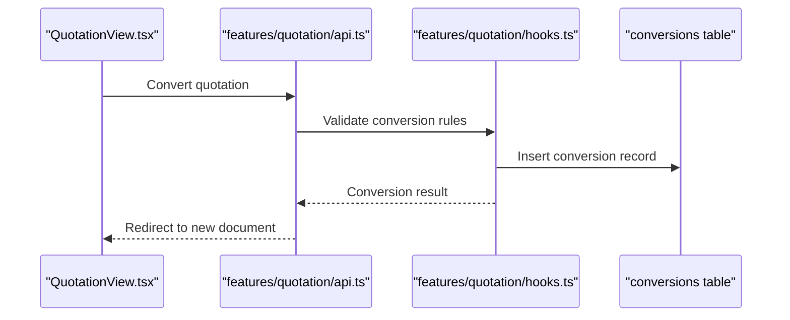

**Diagram sources**
- [database-quotation-conversions.sql](file://src/database-quotation-conversions.sql)
- [api.ts](file://src/features/quotation/api.ts)
- [hooks.ts](file://src/features/quotation/hooks.ts)

**Section sources**
- [database-quotation-conversions.sql](file://src/database-quotation-conversions.sql)
- [api.ts](file://src/features/quotation/api.ts)
- [hooks.ts](file://src/features/quotation/hooks.ts)

### Template-Based Document Generation
- Templates store HTML/CSS for rendering quotations, orders, and invoices.
- PDF generation uses templates and formats currencies consistently.

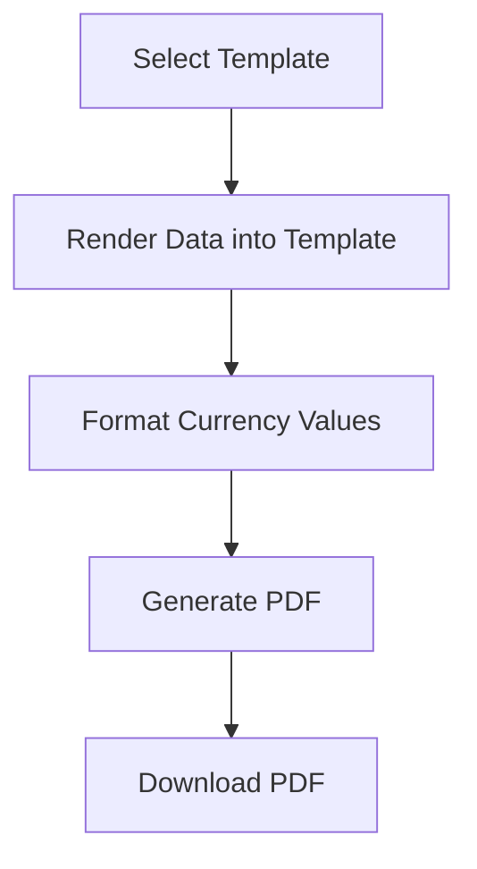

**Diagram sources**
- [database-templates.sql](file://src/database-templates.sql)
- [pdf.tsx](file://src/invoices/pdf.tsx)
- [currency.ts](file://src/lib/currency.ts)
- [usePDFGeneration.ts](file://src/hooks/usePDFGeneration.ts)

**Section sources**
- [database-templates.sql](file://src/database-templates.sql)
- [pdf.tsx](file://src/invoices/pdf.tsx)
- [currency.ts](file://src/lib/currency.ts)
- [usePDFGeneration.ts](file://src/hooks/usePDFGeneration.ts)

### Multi-Currency Support
- Currency field and exchange rate enable multi-currency quotations.
- Formatting utilities ensure consistent display and calculation across currencies.

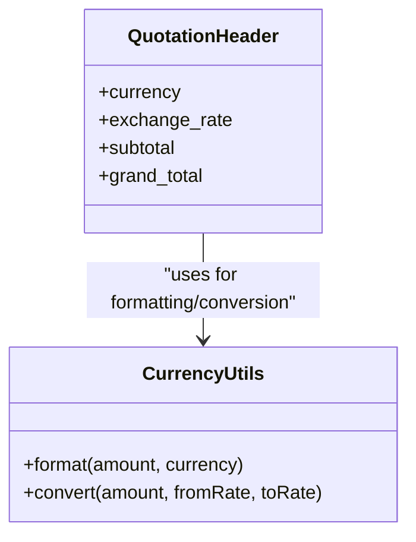

**Diagram sources**
- [currency.ts](file://src/lib/currency.ts)
- [database-quotation.sql](file://src/database-quotation.sql)

**Section sources**
- [currency.ts](file://src/lib/currency.ts)
- [database-quotation.sql](file://src/database-quotation.sql)

### Integration with Inventory Management
- Inventory tables provide stock levels and availability checks during quotation creation and conversion.
- Conversion may reserve or deduct stock depending on business rules.

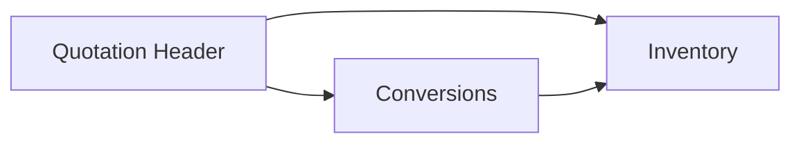

**Diagram sources**
- [database-inventory.sql](file://src/database-inventory.sql)
- [database-quotation-conversions.sql](file://src/database-quotation-conversions.sql)

**Section sources**
- [database-inventory.sql](file://src/database-inventory.sql)
- [database-quotation-conversions.sql](file://src/database-quotation-conversions.sql)

### Audit Trail Tracking
- Item audit captures changes to items and related documents for traceability.
- Supports compliance and debugging needs.

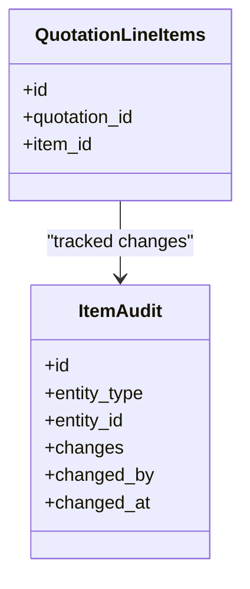

**Diagram sources**
- [database-item-audit.sql](file://src/database-item-audit.sql)

**Section sources**
- [database-item-audit.sql](file://src/database-item-audit.sql)

## Dependency Analysis
- UI components depend on feature APIs and hooks for data persistence and state updates.
- Business logic depends on workflow validation and currency utilities.
- Database layers are accessed via APIs and hooks; templates and PDF generation rely on stored templates and currency formatting.

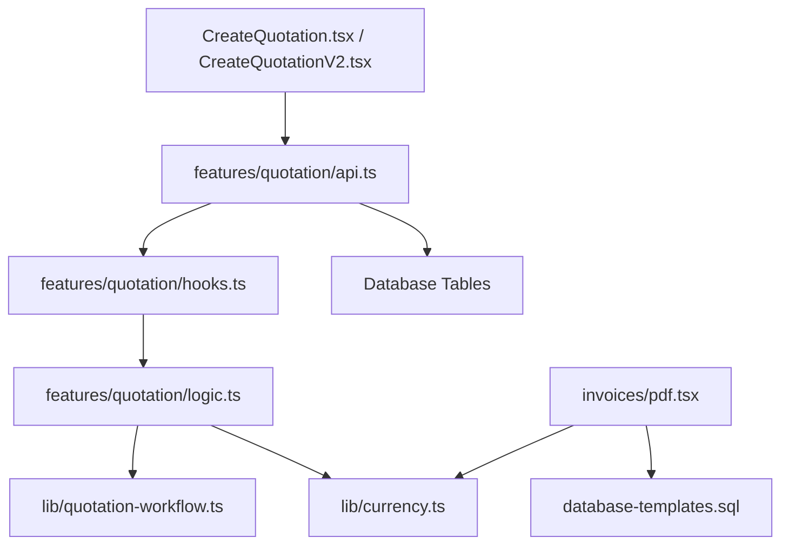

**Diagram sources**
- [CreateQuotation.tsx](file://src/pages/CreateQuotation.tsx)
- [CreateQuotationV2.tsx](file://src/pages/CreateQuotationV2.tsx)
- [api.ts](file://src/features/quotation/api.ts)
- [hooks.ts](file://src/features/quotation/hooks.ts)
- [logic.ts](file://src/features/quotation/logic.ts)
- [quotation-workflow.ts](file://src/lib/quotation-workflow.ts)
- [currency.ts](file://src/lib/currency.ts)
- [pdf.tsx](file://src/invoices/pdf.tsx)
- [database-templates.sql](file://src/database-templates.sql)

**Section sources**
- [api.ts](file://src/features/quotation/api.ts)
- [hooks.ts](file://src/features/quotation/hooks.ts)
- [logic.ts](file://src/features/quotation/logic.ts)
- [quotation-workflow.ts](file://src/lib/quotation-workflow.ts)
- [currency.ts](file://src/lib/currency.ts)
- [pdf.tsx](file://src/invoices/pdf.tsx)
- [database-templates.sql](file://src/database-templates.sql)

## Performance Considerations
- Use efficient queries for list views and filters to reduce latency.
- Cache frequently accessed templates and currency configurations.
- Batch insertions for line items when creating quotations to minimize round trips.
- Avoid heavy computations in UI threads; delegate pricing and tax calculations to backend services where possible.

[No sources needed since this section provides general guidance]

## Troubleshooting Guide
Common issues and resolutions:
- Pricing mismatches: Verify discount and tax rules; re-run pricing logic and compare against expected values.
- Approval failures: Check workflow state and permissions; ensure required approvals are completed before conversion.
- PDF generation errors: Validate template syntax and currency formatting; confirm template exists and is active.
- Conversion errors: Ensure referenced items exist and have sufficient stock if reservation is enforced.

**Section sources**
- [logic.ts](file://src/features/quotation/logic.ts)
- [quotation-workflow.ts](file://src/lib/quotation-workflow.ts)
- [pdf.tsx](file://src/invoices/pdf.tsx)
- [currency.ts](file://src/lib/currency.ts)

## Conclusion
The quotation system provides a robust data model and workflow for managing sales documents. With clear separation between data, logic, and presentation layers, it supports flexible pricing, multi-currency operations, template-driven document generation, and comprehensive audit trails. Proper use of approvals, versioning, and inventory integration ensures reliability and traceability throughout the quotation lifecycle.

[No sources needed since this section summarizes without analyzing specific files]

## Appendices

### Example Queries and Operations
- List quotations with filters: Use list endpoints to retrieve quotations by status, client, date range, and currency.
- View quotation details: Fetch header and line items for a given ID.
- Create revision: Submit changes to create a new version snapshot.
- Convert quotation: Trigger conversion to order or invoice with validation and stock checks.

[No sources needed since this section provides general guidance]

### Status Transitions Reference
- Draft: Initial state after creation.
- PendingApproval: Submitted for review.
- Approved: Passed approval workflow.
- Published: Finalized and visible to clients.
- Converted: Downstream document created.

**Section sources**
- [quotation-workflow.ts](file://src/lib/quotation-workflow.ts)