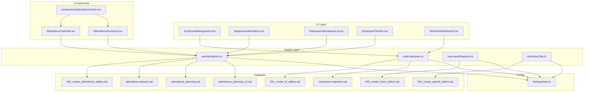
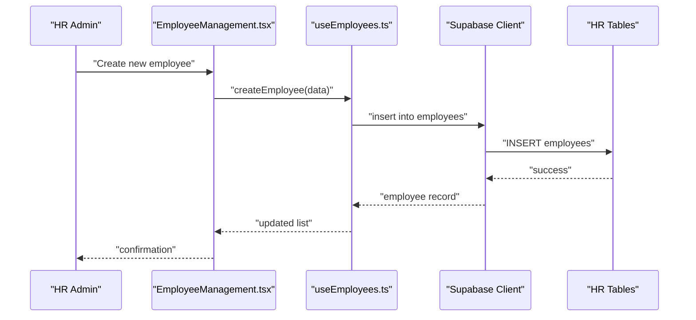
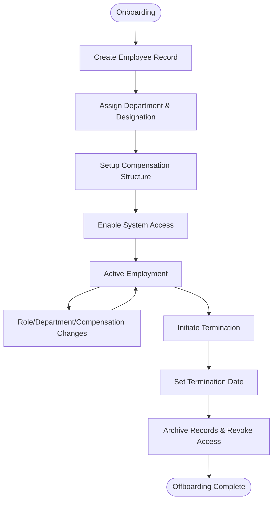
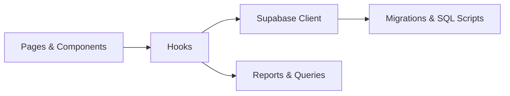

# Human Resources & Payroll

<cite>
**Referenced Files in This Document**
- [src/pages/hr/EmployeeManagement.tsx](file://src/pages/hr/EmployeeManagement.tsx)
- [src/hooks/useEmployees.ts](file://src/hooks/useEmployees.ts)
- [src/hooks/useAttendance.ts](file://src/hooks/useAttendance.ts)
- [src/hooks/useLeaveRequests.ts](file://src/hooks/useLeaveRequests.ts)
- [src/hooks/useSalarySlip.ts](file://src/hooks/useSalarySlip.ts)
- [sql/attendance-phase2.sql](file://sql/attendance-phase2.sql)
- [sql/attendance_planning.sql](file://sql/attendance_planning.sql)
- [sql/attendance_planning_v2.sql](file://sql/attendance_planning_v2.sql)
- [src/database/manpower-migration.sql](file://src/database/manpower-migration.sql)
- [src/pages/ManpowerAttendance.tsx](file://src/pages/ManpowerAttendance.tsx)
- [src/pages/ManpowerAttendanceList.tsx](file://src/pages/ManpowerAttendanceList.tsx)
- [src/components/attendance/index.tsx](file://src/components/attendance/index.tsx)
- [src/components/attendance/AttendanceCalendar.tsx](file://src/components/attendance/AttendanceCalendar.tsx)
- [src/components/attendance/AttendanceSummary.tsx](file://src/components/attendance/AttendanceSummary.tsx)
- [src/pages/HRAdminDashboard.tsx](file://src/pages/HRAdminDashboard.tsx)
- [src/pages/EmployeeCheckIn.tsx](file://src/pages/EmployeeCheckIn.tsx)
- [src/lib/supabase.ts](file://src/lib/supabase.ts)
- [supabase/migrations/001_create_hr_tables.sql](file://supabase/migrations/001_create_hr_tables.sql)
- [supabase/migrations/002_create_attendance_tables.sql](file://supabase/migrations/002_create_attendance_tables.sql)
- [supabase/migrations/003_create_leave_tables.sql](file://supabase/migrations/003_create_leave_tables.sql)
- [supabase/migrations/004_create_payroll_tables.sql](file://supabase/migrations/004_create_payroll_tables.sql)
</cite>

## Table of Contents
1. [Introduction](#introduction)
2. [Project Structure](#project-structure)
3. [Core Components](#core-components)
4. [Architecture Overview](#architecture-overview)
5. [Detailed Component Analysis](#detailed-component-analysis)
6. [Dependency Analysis](#dependency-analysis)
7. [Performance Considerations](#performance-considerations)
8. [Troubleshooting Guide](#troubleshooting-guide)
9. [Conclusion](#conclusion)
10. [Appendices](#appendices)

## Introduction
This document provides comprehensive data model documentation for the human resources and payroll management system. It covers employee records, attendance tracking, leave management, and salary processing tables. It explains the complete HR lifecycle from onboarding to offboarding, details attendance patterns, leave balances, and payroll calculations, and documents relationships between employees, departments, designations, and compensation structures. The document also includes examples of HR queries, attendance reports, and payroll processing scripts, while addressing data privacy requirements, compliance regulations, and performance considerations for large workforce datasets.

## Project Structure
The HR and payroll functionality is implemented across UI pages, hooks, components, SQL migrations, and database schema definitions:
- Pages provide user interfaces for HR administration, attendance, and payroll operations.
- Hooks encapsulate data fetching and business logic for employees, attendance, leaves, and salary slips.
- Components render attendance-related views such as calendars and summaries.
- SQL files define database schemas and migrations for HR entities.
- Supabase client configuration centralizes database connectivity.

**Diagram sources**
- [src/pages/hr/EmployeeManagement.tsx](file://src/pages/hr/EmployeeManagement.tsx)
- [src/hooks/useEmployees.ts](file://src/hooks/useEmployees.ts)
- [src/hooks/useAttendance.ts](file://src/hooks/useAttendance.ts)
- [src/hooks/useLeaveRequests.ts](file://src/hooks/useLeaveRequests.ts)
- [src/hooks/useSalarySlip.ts](file://src/hooks/useSalarySlip.ts)
- [src/pages/ManpowerAttendance.tsx](file://src/pages/ManpowerAttendance.tsx)
- [src/pages/ManpowerAttendanceList.tsx](file://src/pages/ManpowerAttendanceList.tsx)
- [src/pages/EmployeeCheckIn.tsx](file://src/pages/EmployeeCheckIn.tsx)
- [src/pages/HRAdminDashboard.tsx](file://src/pages/HRAdminDashboard.tsx)
- [src/components/attendance/AttendanceCalendar.tsx](file://src/components/attendance/AttendanceCalendar.tsx)
- [src/components/attendance/AttendanceSummary.tsx](file://src/components/attendance/AttendanceSummary.tsx)
- [src/components/attendance/index.tsx](file://src/components/attendance/index.tsx)
- [supabase/migrations/001_create_hr_tables.sql](file://supabase/migrations/001_create_hr_tables.sql)
- [supabase/migrations/002_create_attendance_tables.sql](file://supabase/migrations/002_create_attendance_tables.sql)
- [supabase/migrations/003_create_leave_tables.sql](file://supabase/migrations/003_create_leave_tables.sql)
- [supabase/migrations/004_create_payroll_tables.sql](file://supabase/migrations/004_create_payroll_tables.sql)
- [src/database/manpower-migration.sql](file://src/database/manpower-migration.sql)
- [sql/attendance-phase2.sql](file://sql/attendance-phase2.sql)
- [sql/attendance_planning.sql](file://sql/attendance_planning.sql)
- [sql/attendance_planning_v2.sql](file://sql/attendance_planning_v2.sql)
- [src/lib/supabase.ts](file://src/lib/supabase.ts)

**Section sources**
- [src/pages/hr/EmployeeManagement.tsx](file://src/pages/hr/EmployeeManagement.tsx)
- [src/hooks/useEmployees.ts](file://src/hooks/useEmployees.ts)
- [src/hooks/useAttendance.ts](file://src/hooks/useAttendance.ts)
- [src/hooks/useLeaveRequests.ts](file://src/hooks/useLeaveRequests.ts)
- [src/hooks/useSalarySlip.ts](file://src/hooks/useSalarySlip.ts)
- [src/pages/ManpowerAttendance.tsx](file://src/pages/ManpowerAttendance.tsx)
- [src/pages/ManpowerAttendanceList.tsx](file://src/pages/ManpowerAttendanceList.tsx)
- [src/pages/EmployeeCheckIn.tsx](file://src/pages/EmployeeCheckIn.tsx)
- [src/pages/HRAdminDashboard.tsx](file://src/pages/HRAdminDashboard.tsx)
- [src/components/attendance/AttendanceCalendar.tsx](file://src/components/attendance/AttendanceCalendar.tsx)
- [src/components/attendance/AttendanceSummary.tsx](file://src/components/attendance/AttendanceSummary.tsx)
- [src/components/attendance/index.tsx](file://src/components/attendance/index.tsx)
- [supabase/migrations/001_create_hr_tables.sql](file://supabase/migrations/001_create_hr_tables.sql)
- [supabase/migrations/002_create_attendance_tables.sql](file://supabase/migrations/002_create_attendance_tables.sql)
- [supabase/migrations/003_create_leave_tables.sql](file://supabase/migrations/003_create_leave_tables.sql)
- [supabase/migrations/004_create_payroll_tables.sql](file://supabase/migrations/004_create_payroll_tables.sql)
- [src/database/manpower-migration.sql](file://src/database/manpower-migration.sql)
- [sql/attendance-phase2.sql](file://sql/attendance-phase2.sql)
- [sql/attendance_planning.sql](file://sql/attendance_planning.sql)
- [sql/attendance_planning_v2.sql](file://sql/attendance_planning_v2.sql)
- [src/lib/supabase.ts](file://src/lib/supabase.ts)

## Core Components
- Employee Management: Provides CRUD operations for employee records, including personal information, department assignment, designation, employment status, and dates (join date, termination date).
- Attendance Tracking: Captures check-in/check-out events, daily attendance summaries, planning entries, and supports phase-based enhancements and planning v2 features.
- Leave Management: Manages leave requests, approvals, and balances; integrates with employee records and organizational policies.
- Salary Processing: Generates salary slips, computes earnings and deductions based on attendance and leave, and links to compensation structures.

Key responsibilities:
- Data access via hooks using a centralized Supabase client.
- UI orchestration through pages and reusable components.
- Database schema evolution via migrations and SQL scripts.

**Section sources**
- [src/hooks/useEmployees.ts](file://src/hooks/useEmployees.ts)
- [src/hooks/useAttendance.ts](file://src/hooks/useAttendance.ts)
- [src/hooks/useLeaveRequests.ts](file://src/hooks/useLeaveRequests.ts)
- [src/hooks/useSalarySlip.ts](file://src/hooks/useSalarySlip.ts)
- [src/pages/hr/EmployeeManagement.tsx](file://src/pages/hr/EmployeeManagement.tsx)
- [src/pages/ManpowerAttendance.tsx](file://src/pages/ManpowerAttendance.tsx)
- [src/pages/ManpowerAttendanceList.tsx](file://src/pages/ManpowerAttendanceList.tsx)
- [src/pages/EmployeeCheckIn.tsx](file://src/pages/EmployeeCheckIn.tsx)
- [src/pages/HRAdminDashboard.tsx](file://src/pages/HRAdminDashboard.tsx)
- [src/components/attendance/index.tsx](file://src/components/attendance/index.tsx)
- [src/components/attendance/AttendanceCalendar.tsx](file://src/components/attendance/AttendanceCalendar.tsx)
- [src/components/attendance/AttendanceSummary.tsx](file://src/components/attendance/AttendanceSummary.tsx)
- [supabase/migrations/001_create_hr_tables.sql](file://supabase/migrations/001_create_hr_tables.sql)
- [supabase/migrations/002_create_attendance_tables.sql](file://supabase/migrations/002_create_attendance_tables.sql)
- [supabase/migrations/003_create_leave_tables.sql](file://supabase/migrations/003_create_leave_tables.sql)
- [supabase/migrations/004_create_payroll_tables.sql](file://supabase/migrations/004_create_payroll_tables.sql)

## Architecture Overview
The system follows a layered architecture:
- Presentation layer: React pages and components render HR workflows.
- Business logic layer: Hooks implement data fetching, validation, and transformations.
- Persistence layer: Supabase client connects to relational tables defined by migrations and SQL scripts.

**Diagram sources**
- [src/pages/hr/EmployeeManagement.tsx](file://src/pages/hr/EmployeeManagement.tsx)
- [src/hooks/useEmployees.ts](file://src/hooks/useEmployees.ts)
- [src/lib/supabase.ts](file://src/lib/supabase.ts)
- [supabase/migrations/001_create_hr_tables.sql](file://supabase/migrations/001_create_hr_tables.sql)

## Detailed Component Analysis

### Employee Records Model
Employee records capture core identity and employment attributes:
- Employee ID (primary key)
- Personal details (name, contact, DOB, gender)
- Employment metadata (department_id, designation_id, employment_type, status, join_date, termination_date)
- Compensation linkage (salary_structure_id or equivalent)
- Audit fields (created_at, updated_at)

Relationships:
- Department: Many-to-one (employees.department_id -> departments.id)
- Designation: Many-to-one (employees.designation_id -> designations.id)
- Compensation structure: One-to-one or many-to-one depending on policy granularity

Lifecycle:
- Onboarding: Create employee, assign department/designation, set compensation structure, configure access.
- Active: Update role, department changes, compensation adjustments.
- Offboarding: Set termination_date, archive records, revoke access.

Example HR queries:
- List active employees by department and designation.
- Retrieve employees whose compensation structure changed within a period.
- Compute headcount trends by joining employees with departments.

**Section sources**
- [supabase/migrations/001_create_hr_tables.sql](file://supabase/migrations/001_create_hr_tables.sql)
- [src/hooks/useEmployees.ts](file://src/hooks/useEmployees.ts)
- [src/pages/hr/EmployeeManagement.tsx](file://src/pages/hr/EmployeeManagement.tsx)

### Attendance Tracking Model
Attendance captures time-based presence and planning:
- Attendance entries: employee_id, date, check_in_time, check_out_time, status (present/absent/half-day), notes
- Attendance planning: planned_working_days, shift assignments, exceptions
- Phase enhancements: additional validations, bulk operations, reporting improvements
- Planning v2: advanced scheduling, multi-shift support, integration with leave and overtime

Patterns:
- Daily aggregation: compute total hours, late arrivals, early departures
- Exception handling: missed punches, manual corrections
- Reporting: monthly summaries, department-wise attendance rates

Example attendance reports:
- Monthly attendance summary per employee
- Late arrival frequency by department
- Absence rate trends over quarters

**Section sources**
- [supabase/migrations/002_create_attendance_tables.sql](file://supabase/migrations/002_create_attendance_tables.sql)
- [sql/attendance-phase2.sql](file://sql/attendance-phase2.sql)
- [sql/attendance_planning.sql](file://sql/attendance_planning.sql)
- [sql/attendance_planning_v2.sql](file://sql/attendance_planning_v2.sql)
- [src/hooks/useAttendance.ts](file://src/hooks/useAttendance.ts)
- [src/pages/ManpowerAttendance.tsx](file://src/pages/ManpowerAttendance.tsx)
- [src/pages/ManpowerAttendanceList.tsx](file://src/pages/ManpowerAttendanceList.tsx)
- [src/components/attendance/AttendanceCalendar.tsx](file://src/components/attendance/AttendanceCalendar.tsx)
- [src/components/attendance/AttendanceSummary.tsx](file://src/components/attendance/AttendanceSummary.tsx)
- [src/components/attendance/index.tsx](file://src/components/attendance/index.tsx)

### Leave Management Model
Leave management tracks requests, approvals, and balances:
- Leave types: annual, sick, casual, maternity/paternity, unpaid
- Leave requests: employee_id, leave_type, start_date, end_date, reason, status (pending/approved/rejected)
- Balances: accrual rules, carry-forward, utilization tracking
- Approvals workflow: manager review, policy enforcement, notifications

Balances calculation:
- Accrue leave days based on tenure and type
- Deduct approved leaves from balance
- Handle partial days and pro-rata allocations

Example leave queries:
- Remaining leave balance per employee by type
- Pending leave requests awaiting approval
- Leave utilization report by department

**Section sources**
- [supabase/migrations/003_create_leave_tables.sql](file://supabase/migrations/003_create_leave_tables.sql)
- [src/hooks/useLeaveRequests.ts](file://src/hooks/useLeaveRequests.ts)

### Salary Processing Model
Payroll processes earnings, deductions, and net pay:
- Earnings: base salary, allowances, bonuses, overtime
- Deductions: taxes, provident fund, insurance, advances
- Attendance integration: prorate based on working days and absences
- Leave impact: unpaid leaves reduce payable amounts
- Payslip generation: itemized breakdown per pay period

Calculation flow:
- Gather base compensation from structure
- Adjust for attendance and leave
- Apply statutory and company-specific deductions
- Generate payslip records and summaries

Example payroll scripts:
- Batch process monthly payroll for all active employees
- Re-run payroll for corrected attendance entries
- Export payroll summaries for accounting integration

**Section sources**
- [supabase/migrations/004_create_payroll_tables.sql](file://supabase/migrations/004_create_payroll_tables.sql)
- [src/hooks/useSalarySlip.ts](file://src/hooks/useSalarySlip.ts)

### HR Lifecycle Flow
End-to-end lifecycle from onboarding to offboarding:

[No sources needed since this diagram shows conceptual workflow, not actual code structure]

## Dependency Analysis
The HR module depends on:
- UI components for rendering and interaction
- Hooks for data access and business logic
- Supabase client for database operations
- Migrations and SQL scripts for schema definition and enhancements

**Diagram sources**
- [src/pages/hr/EmployeeManagement.tsx](file://src/pages/hr/EmployeeManagement.tsx)
- [src/pages/ManpowerAttendance.tsx](file://src/pages/ManpowerAttendance.tsx)
- [src/pages/ManpowerAttendanceList.tsx](file://src/pages/ManpowerAttendanceList.tsx)
- [src/pages/EmployeeCheckIn.tsx](file://src/pages/EmployeeCheckIn.tsx)
- [src/pages/HRAdminDashboard.tsx](file://src/pages/HRAdminDashboard.tsx)
- [src/components/attendance/index.tsx](file://src/components/attendance/index.tsx)
- [src/hooks/useEmployees.ts](file://src/hooks/useEmployees.ts)
- [src/hooks/useAttendance.ts](file://src/hooks/useAttendance.ts)
- [src/hooks/useLeaveRequests.ts](file://src/hooks/useLeaveRequests.ts)
- [src/hooks/useSalarySlip.ts](file://src/hooks/useSalarySlip.ts)
- [src/lib/supabase.ts](file://src/lib/supabase.ts)
- [supabase/migrations/001_create_hr_tables.sql](file://supabase/migrations/001_create_hr_tables.sql)
- [supabase/migrations/002_create_attendance_tables.sql](file://supabase/migrations/002_create_attendance_tables.sql)
- [supabase/migrations/003_create_leave_tables.sql](file://supabase/migrations/003_create_leave_tables.sql)
- [supabase/migrations/004_create_payroll_tables.sql](file://supabase/migrations/004_create_payroll_tables.sql)
- [sql/attendance-phase2.sql](file://sql/attendance-phase2.sql)
- [sql/attendance_planning.sql](file://sql/attendance_planning.sql)
- [sql/attendance_planning_v2.sql](file://sql/attendance_planning_v2.sql)

**Section sources**
- [src/hooks/useEmployees.ts](file://src/hooks/useEmployees.ts)
- [src/hooks/useAttendance.ts](file://src/hooks/useAttendance.ts)
- [src/hooks/useLeaveRequests.ts](file://src/hooks/useLeaveRequests.ts)
- [src/hooks/useSalarySlip.ts](file://src/hooks/useSalarySlip.ts)
- [src/lib/supabase.ts](file://src/lib/supabase.ts)
- [supabase/migrations/001_create_hr_tables.sql](file://supabase/migrations/001_create_hr_tables.sql)
- [supabase/migrations/002_create_attendance_tables.sql](file://supabase/migrations/002_create_attendance_tables.sql)
- [supabase/migrations/003_create_leave_tables.sql](file://supabase/migrations/003_create_leave_tables.sql)
- [supabase/migrations/004_create_payroll_tables.sql](file://supabase/migrations/004_create_payroll_tables.sql)
- [sql/attendance-phase2.sql](file://sql/attendance-phase2.sql)
- [sql/attendance_planning.sql](file://sql/attendance_planning.sql)
- [sql/attendance_planning_v2.sql](file://sql/attendance_planning_v2.sql)

## Performance Considerations
For large workforce datasets:
- Indexing: Ensure indexes on frequently queried columns (employee_id, date, department_id, designation_id, leave_type, status).
- Pagination: Implement server-side pagination for lists and reports.
- Caching: Cache static reference data (departments, designations, leave types).
- Query optimization: Use selective joins, avoid SELECT *, leverage computed columns where appropriate.
- Batch operations: Process payroll and attendance updates in batches to reduce transaction overhead.
- Monitoring: Track query execution times and optimize slow-running reports.

[No sources needed since this section provides general guidance]

## Troubleshooting Guide
Common issues and resolutions:
- Missing punch records: Validate attendance entries and allow manual corrections with audit trails.
- Leave balance discrepancies: Reconcile accrual rules and approved leave deductions.
- Payroll calculation errors: Verify attendance integration and deduction policies; re-run payroll for affected periods.
- Access control problems: Review RLS policies and user permissions for sensitive HR data.

Operational checks:
- Validate foreign key constraints between employees, departments, and designations.
- Ensure migration consistency across environments.
- Confirm Supabase client configuration and connection health.

**Section sources**
- [src/hooks/useAttendance.ts](file://src/hooks/useAttendance.ts)
- [src/hooks/useLeaveRequests.ts](file://src/hooks/useLeaveRequests.ts)
- [src/hooks/useSalarySlip.ts](file://src/hooks/useSalarySlip.ts)
- [src/lib/supabase.ts](file://src/lib/supabase.ts)

## Conclusion
The HR and payroll system provides a robust foundation for managing employee records, attendance, leave, and salary processing. Its layered architecture ensures clear separation of concerns, while migrations and SQL scripts maintain schema integrity. By adhering to best practices in indexing, caching, and query optimization, the system can scale effectively for large workforces. Comprehensive auditing and access controls support compliance and data privacy requirements.

[No sources needed since this section summarizes without analyzing specific files]

## Appendices

### Data Privacy and Compliance
- Data minimization: Collect only necessary employee information.
- Consent and purpose limitation: Document reasons for data collection and usage.
- Retention policies: Define retention periods for employee records and attendance logs.
- Access controls: Enforce role-based access and audit logging for sensitive operations.
- Regulatory alignment: Align with local labor laws and data protection regulations.

[No sources needed since this section provides general guidance]

### Example Queries and Scripts
- HR queries:
  - Headcount by department and designation
  - Employees with upcoming contract renewals
  - Leave utilization by team
- Attendance reports:
  - Monthly attendance summary
  - Late arrival analysis
  - Absence trend reports
- Payroll scripts:
  - Monthly payroll batch processor
  - Payslip generator
  - Payroll reconciliation tool

[No sources needed since this section provides general guidance]