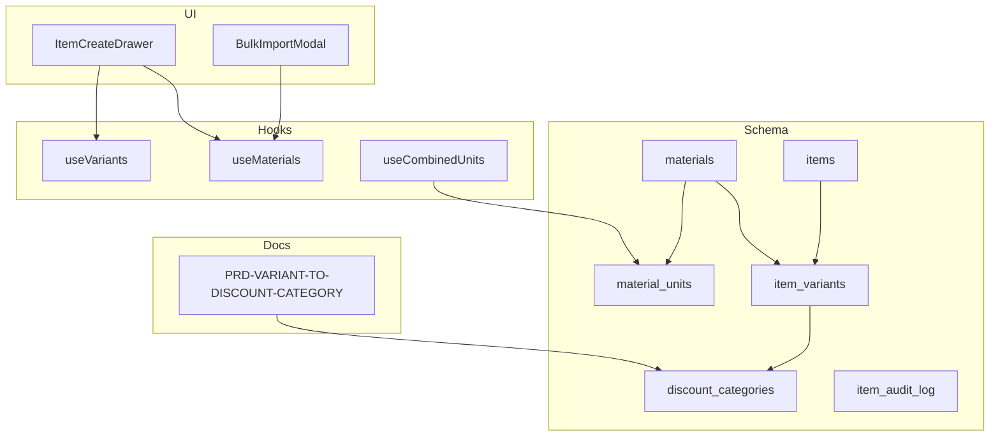
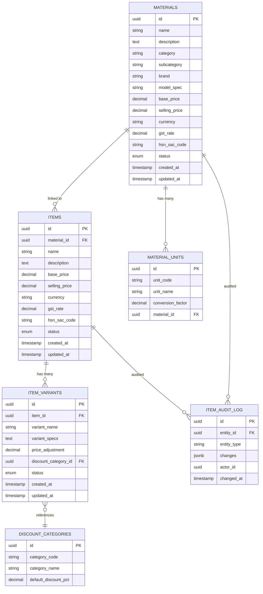
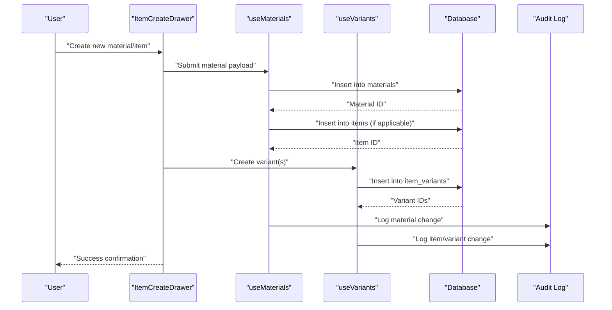
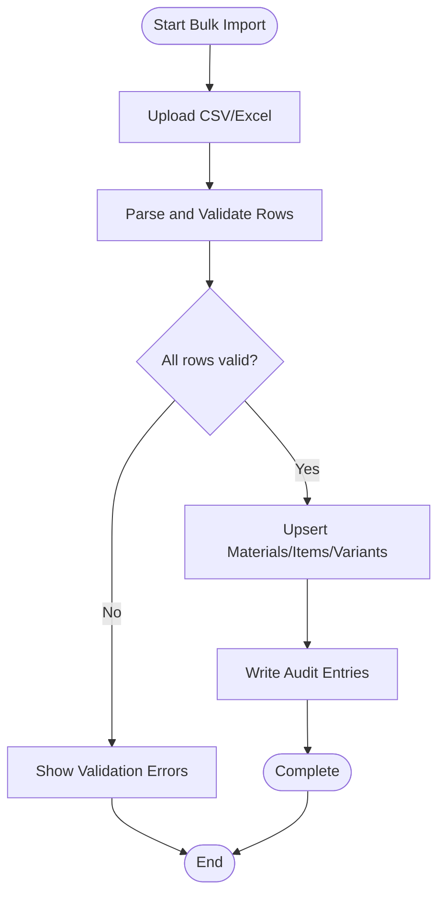
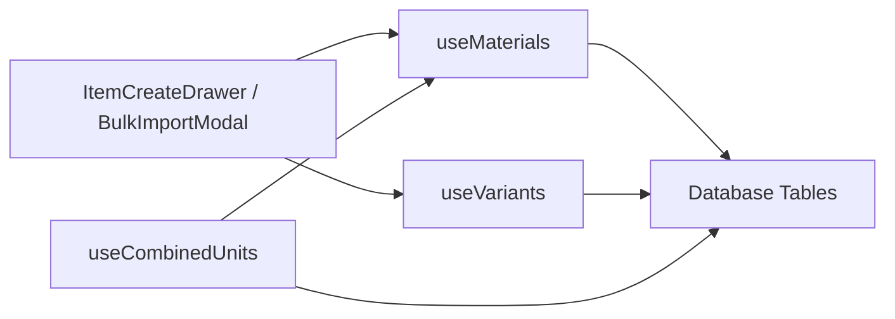

# Material Catalog & Item Management

<cite>
**Referenced Files in This Document**
- [database-materials.sql](file://src/database-materials.sql)
- [database-items.sql](file://src/database-items.sql)
- [database-items-variants.sql](file://src/database-items-variants.sql)
- [database-add-variant.sql](file://src/database-add-variant.sql)
- [database-hsn-tax.sql](file://src/database-hsn-tax.sql)
- [database-discount-categories.sql](file://src/database-discount-categories.sql)
- [database-variant-discount.sql](file://src/database-variant-discount.sql)
- [create_material_units.sql](file://sql/create_material_units.sql)
- [database-item-audit.sql](file://src/database-item-audit.sql)
- [useMaterials.ts](file://src/hooks/useMaterials.ts)
- [useVariants.ts](file://src/hooks/useVariants.ts)
- [useCombinedUnits.ts](file://src/hooks/useCombinedUnits.ts)
- [ItemCreateDrawer.tsx](file://src/components/ItemCreateDrawer.tsx)
- [BulkImportModal.tsx](file://src/components/BulkImportModal.tsx)
- [PRD-VARIANT-TO-DISCOUNT-CATEGORY.md](file://docs/PRD-VARIANT-TO-DISCOUNT-CATEGORY.md)
</cite>

## Table of Contents
1. [Introduction](#introduction)
2. [Project Structure](#project-structure)
3. [Core Components](#core-components)
4. [Architecture Overview](#architecture-overview)
5. [Detailed Component Analysis](#detailed-component-analysis)
6. [Dependency Analysis](#dependency-analysis)
7. [Performance Considerations](#performance-considerations)
8. [Troubleshooting Guide](#troubleshooting-guide)
9. [Conclusion](#conclusion)
10. [Appendices](#appendices)

## Introduction
This document provides comprehensive data model documentation for the material catalog and item management system. It covers the core materials table structure, item master data fields, categorization system, variant management, units of measurement, discount categories, pricing and tax attributes (including GST and HSN/SAC codes), relationships between entities, status lifecycle and approval workflows, audit trails, examples of creation/update/bulk operations, validation rules, business constraints, and performance considerations for large catalogs.

## Project Structure
The material catalog and item management domain spans database migrations, hooks, UI components, and product requirements documents:
- Database schema definitions and enhancements are primarily under src/*.sql and sql/*.sql.
- Frontend hooks encapsulate data access patterns for materials, variants, and units.
- UI components provide creation and bulk import flows.
- Product requirements clarify variant-to-discount category mapping.

[No sources needed since this diagram shows conceptual workflow, not actual code structure]

## Core Components
This section outlines the primary data entities and their responsibilities:
- materials: The central catalog entry for a purchasable or sellable good. Holds descriptive, classification, tax, and pricing metadata.
- items: Master records that represent distinct sellable products, often linked to a material and carrying additional commercial details.
- item_variants: Variants of an item (e.g., size, color, grade) with variant-specific attributes and optional discount category linkage.
- material_units: Units of measure for materials (base and conversion factors).
- discount_categories: Categories used to apply discounts at the variant level.
- item_audit_log: Audit trail capturing changes to item-related records.

Key attribute groups across these tables include:
- Descriptions and specifications: name, description, brand, model/spec, dimensions, weight, images.
- Classification: category, subcategory, tags, HSN/SAC codes.
- Pricing and taxes: base price, selling price, currency, GST rate, HSN/SAC.
- Status and lifecycle: active/inactive/archived, approval state, versioning.
- Relationships: links to units, variants, discount categories, and parent materials/items.

**Section sources**
- [database-materials.sql](file://src/database-materials.sql)
- [database-items.sql](file://src/database-items.sql)
- [database-items-variants.sql](file://src/database-items-variants.sql)
- [database-add-variant.sql](file://src/database-add-variant.sql)
- [database-hsn-tax.sql](file://src/database-hsn-tax.sql)
- [database-discount-categories.sql](file://src/database-discount-categories.sql)
- [database-variant-discount.sql](file://src/database-variant-discount.sql)
- [create_material_units.sql](file://sql/create_material_units.sql)
- [database-item-audit.sql](file://src/database-item-audit.sql)

## Architecture Overview
The data architecture centers on a canonical material entity with rich attributes, extended by item masters and variants. Units of measurement and discount categories are referenced from materials and variants respectively. An audit log captures changes for traceability.

**Diagram sources**
- [database-materials.sql](file://src/database-materials.sql)
- [database-items.sql](file://src/database-items.sql)
- [database-items-variants.sql](file://src/database-items-variants.sql)
- [database-add-variant.sql](file://src/database-add-variant.sql)
- [database-hsn-tax.sql](file://src/database-hsn-tax.sql)
- [database-discount-categories.sql](file://src/database-discount-categories.sql)
- [database-variant-discount.sql](file://src/database-variant-discount.sql)
- [create_material_units.sql](file://sql/create_material_units.sql)
- [database-item-audit.sql](file://src/database-item-audit.sql)

## Detailed Component Analysis

### Materials Table
Responsibilities:
- Canonical catalog entry for goods/services.
- Stores descriptive, classification, tax, and pricing information.
- Serves as a reference for items and variants.

Key attributes:
- Identification: unique ID, name, description.
- Classification: category, subcategory, brand, model/spec.
- Taxation: GST rate, HSN/SAC code.
- Pricing: base price, selling price, currency.
- Lifecycle: status (e.g., active/inactive/archived), timestamps.

Validation and constraints:
- Non-empty name and mandatory classification fields.
- Numeric validations for prices and GST rates.
- Referential integrity when linking to units.

Relationships:
- One-to-many with material_units.
- One-to-many with items.
- Auditable via item_audit_log.

**Section sources**
- [database-materials.sql](file://src/database-materials.sql)
- [create_material_units.sql](file://sql/create_material_units.sql)
- [database-item-audit.sql](file://src/database-item-audit.sql)

### Items Table
Responsibilities:
- Master record representing a sellable product, typically derived from a material.
- Carries commercial details such as pricing and tax specifics.

Key attributes:
- Identification: unique ID, name, description.
- Linkage: foreign key to materials.
- Pricing and tax: base price, selling price, currency, GST rate, HSN/SAC code.
- Lifecycle: status and timestamps.

Validation and constraints:
- Required linkage to a valid material.
- Price and tax validations consistent with materials.

Relationships:
- Many-to-one with materials.
- One-to-many with item_variants.
- Auditable via item_audit_log.

**Section sources**
- [database-items.sql](file://src/database-items.sql)
- [database-item-audit.sql](file://src/database-item-audit.sql)

### Item Variants
Responsibilities:
- Represent specific permutations of an item (size, color, grade, etc.).
- Allow variant-specific adjustments and discount category association.

Key attributes:
- Identification: unique ID, variant name, specs.
- Linkage: foreign key to items.
- Pricing: optional price adjustment relative to item base.
- Discount: foreign key to discount_categories.
- Lifecycle: status and timestamps.

Validation and constraints:
- Unique variant naming within an item context.
- Valid discount category reference if provided.

Relationships:
- Many-to-one with items.
- Many-to-one with discount_categories.

**Section sources**
- [database-items-variants.sql](file://src/database-items-variants.sql)
- [database-add-variant.sql](file://src/database-add-variant.sql)
- [database-discount-categories.sql](file://src/database-discount-categories.sql)
- [database-variant-discount.sql](file://src/database-variant-discount.sql)

### Units of Measurement
Responsibilities:
- Define units for materials and conversions.

Key attributes:
- Unit code and human-readable name.
- Conversion factor relative to a base unit.
- Association to a material.

Validation and constraints:
- Positive conversion factors.
- Unique unit codes per material.

Relationships:
- Many-to-one with materials.

**Section sources**
- [create_material_units.sql](file://sql/create_material_units.sql)

### Discount Categories
Responsibilities:
- Provide reusable discount groupings applied to variants.

Key attributes:
- Category code and name.
- Default discount percentage.

Validation and constraints:
- Unique category codes.
- Percentage within allowed bounds.

Relationships:
- Referenced by item_variants.

**Section sources**
- [database-discount-categories.sql](file://src/database-discount-categories.sql)
- [database-variant-discount.sql](file://src/database-variant-discount.sql)

### Tax and HSN/SAC Codes
Responsibilities:
- Capture GST rates and HSN/SAC codes at both materials and items levels.

Key attributes:
- GST rate (decimal).
- HSN/SAC code (string).

Validation and constraints:
- GST rate within regulatory bounds.
- HSN/SAC format validation where applicable.

**Section sources**
- [database-hsn-tax.sql](file://src/database-hsn-tax.sql)
- [database-materials.sql](file://src/database-materials.sql)
- [database-items.sql](file://src/database-items.sql)

### Audit Trail
Responsibilities:
- Record changes to materials and items for compliance and traceability.

Key attributes:
- Entity type and identifier.
- Changes captured as structured JSON.
- Actor and timestamp.

Validation and constraints:
- Immutable entries once created.
- Indexed for efficient querying.

**Section sources**
- [database-item-audit.sql](file://src/database-item-audit.sql)

## Architecture Overview

### Data Flow: Material Creation and Variant Assignment

**Diagram sources**
- [ItemCreateDrawer.tsx](file://src/components/ItemCreateDrawer.tsx)
- [useMaterials.ts](file://src/hooks/useMaterials.ts)
- [useVariants.ts](file://src/hooks/useVariants.ts)
- [database-item-audit.sql](file://src/database-item-audit.sql)

### Bulk Import Flow

**Diagram sources**
- [BulkImportModal.tsx](file://src/components/BulkImportModal.tsx)
- [useMaterials.ts](file://src/hooks/useMaterials.ts)
- [database-item-audit.sql](file://src/database-item-audit.sql)

## Dependency Analysis
Frontend hooks orchestrate data access and composition:
- useMaterials: Encapsulates CRUD operations for materials and related items.
- useVariants: Manages variant lifecycle and discount category associations.
- useCombinedUnits: Aggregates unit definitions and conversions for display and calculations.

**Diagram sources**
- [ItemCreateDrawer.tsx](file://src/components/ItemCreateDrawer.tsx)
- [BulkImportModal.tsx](file://src/components/BulkImportModal.tsx)
- [useMaterials.ts](file://src/hooks/useMaterials.ts)
- [useVariants.ts](file://src/hooks/useVariants.ts)
- [useCombinedUnits.ts](file://src/hooks/useCombinedUnits.ts)

**Section sources**
- [useMaterials.ts](file://src/hooks/useMaterials.ts)
- [useVariants.ts](file://src/hooks/useVariants.ts)
- [useCombinedUnits.ts](file://src/hooks/useCombinedUnits.ts)

## Performance Considerations
For large catalogs:
- Indexing: Ensure indexes on frequently filtered columns (name, category, status, hsn_sac_code, material_id, item_id).
- Pagination and virtualization: Use paginated queries and virtualized lists for heavy datasets.
- Denormalization: Consider denormalizing frequently accessed fields (e.g., current price) to reduce joins.
- Batch operations: Prefer batch upserts for bulk imports to minimize round-trips.
- Query optimization: Select only required columns; avoid SELECT *; leverage server-side filtering and sorting.
- Caching: Cache lookup tables (units, discount categories) and static references.
- Concurrency control: Use optimistic locking or version fields to prevent conflicting updates.

[No sources needed since this section provides general guidance]

## Troubleshooting Guide
Common issues and resolutions:
- Missing HSN/SAC or invalid GST rate: Validate inputs before submission; enforce ranges and formats.
- Duplicate variants: Enforce uniqueness constraints on variant names within an item.
- Orphaned records: Ensure referential integrity checks and cascade behaviors are configured appropriately.
- Audit gaps: Verify audit triggers or explicit logging calls are invoked on all mutation paths.
- Bulk import failures: Inspect row-level validation errors and partial success logs; reprocess failed rows after corrections.

**Section sources**
- [database-hsn-tax.sql](file://src/database-hsn-tax.sql)
- [database-items-variants.sql](file://src/database-items-variants.sql)
- [database-item-audit.sql](file://src/database-item-audit.sql)

## Conclusion
The material catalog and item management system is built around a robust materials foundation, extended by items and variants, with clear support for units of measurement, discount categories, taxation, and auditing. The frontend hooks and UI components provide intuitive workflows for creation, updates, and bulk operations. Adhering to the documented validation rules, constraints, and performance strategies will ensure scalability and reliability for large catalogs.

[No sources needed since this section summarizes without analyzing specific files]

## Appendices

### Examples: Material Creation, Updates, and Bulk Operations
- Create material: Submit a payload with name, description, category, pricing, GST, and HSN/SAC via useMaterials.
- Update material: Patch fields selectively; ensure audit logging captures changes.
- Create item and variant: Link item to material; create variant(s) with optional discount category; persist via useVariants.
- Bulk import: Use BulkImportModal to upload a file; validate rows; perform batch upserts; write audit entries.

**Section sources**
- [ItemCreateDrawer.tsx](file://src/components/ItemCreateDrawer.tsx)
- [BulkImportModal.tsx](file://src/components/BulkImportModal.tsx)
- [useMaterials.ts](file://src/hooks/useMaterials.ts)
- [useVariants.ts](file://src/hooks/useVariants.ts)
- [database-item-audit.sql](file://src/database-item-audit.sql)

### Business Rules and Constraints
- Pricing must be non-negative; GST rates within legal limits.
- HSN/SAC codes must conform to standard formats.
- Variants must be unique within an item context.
- Discount categories must exist before assignment to variants.
- Status transitions should follow defined lifecycles (e.g., draft -> active -> archived).

**Section sources**
- [database-hsn-tax.sql](file://src/database-hsn-tax.sql)
- [database-items-variants.sql](file://src/database-items-variants.sql)
- [database-discount-categories.sql](file://src/database-discount-categories.sql)

### Variant-to-Discount Category Mapping
Product requirements define how variants map to discount categories, enabling flexible discount policies at the variant level.

**Section sources**
- [PRD-VARIANT-TO-DISCOUNT-CATEGORY.md](file://docs/PRD-VARIANT-TO-DISCOUNT-CATEGORY.md)