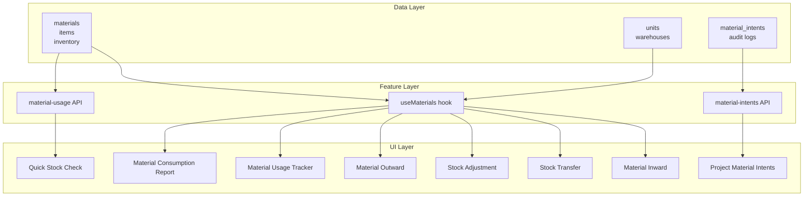
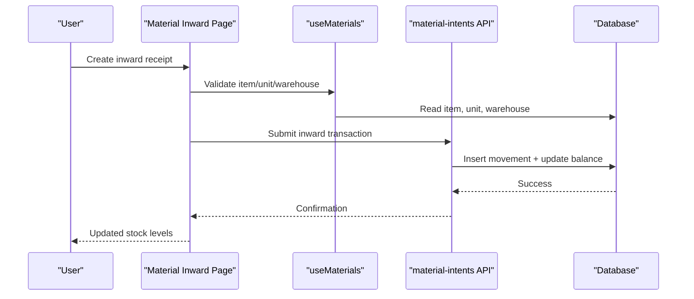
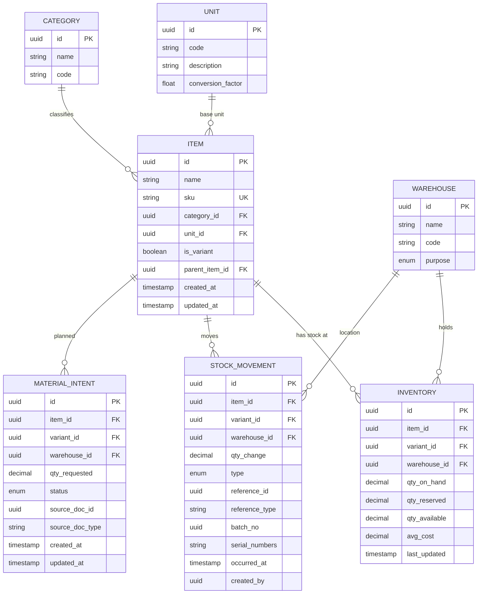
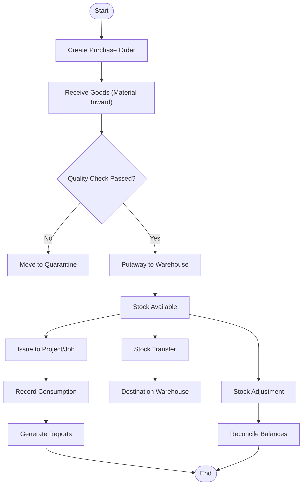
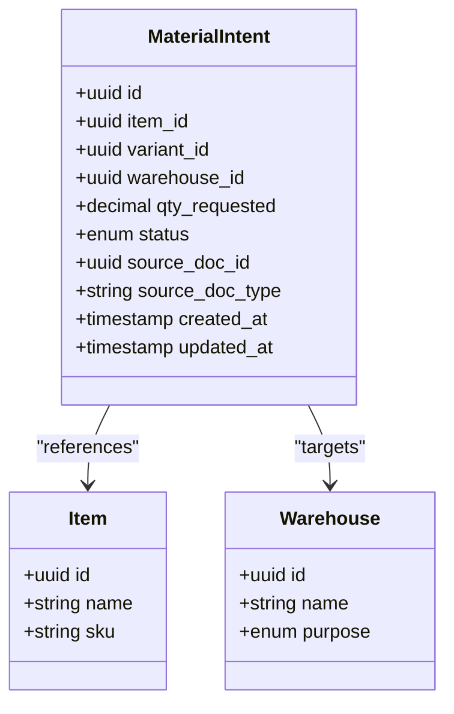
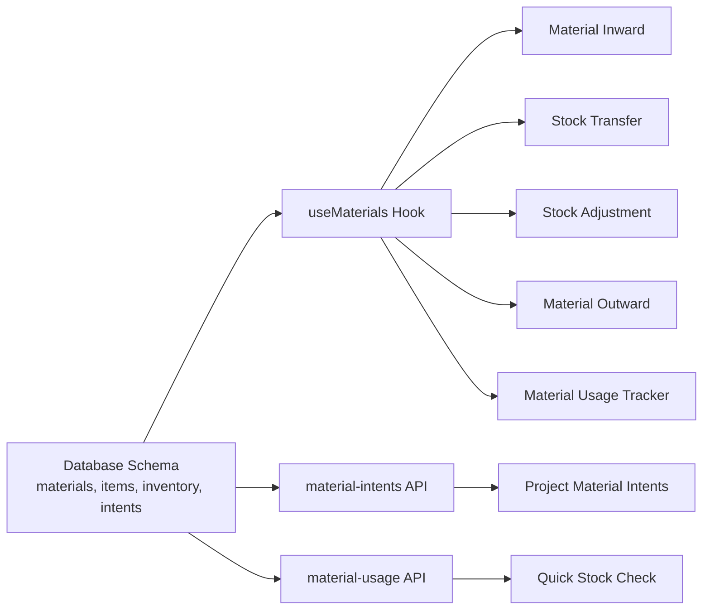

# Materials & Inventory Management

<cite>
**Referenced Files in This Document**
- [database-materials.sql](file://src/database-materials.sql)
- [database-items.sql](file://src/database-items.sql)
- [database-inventory.sql](file://src/database-inventory.sql)
- [database-material-intents-enhancement.sql](file://src/database-material-intents-enhancement.sql)
- [create_material_units.sql](file://sql/create_material_units.sql)
- [database-warehouse-purpose.sql](file://src/database-warehouse-purpose.sql)
- [material-intents/api.ts](file://src/material-intents/api.ts)
- [material-usage/api.ts](file://src/material-usage/api.ts)
- [features/materials/hooks/useMaterials.ts](file://src/features/materials/hooks/useMaterials.ts)
- [hooks/useWarehouses.ts](file://src/hooks/useWarehouses.ts)
- [pages/MaterialInward.tsx](file://src/pages/MaterialInward.tsx)
- [pages/StockTransfer.tsx](file://src/pages/StockTransfer.tsx)
- [pages/StockAdjustment.tsx](file://src/pages/StockAdjustment.tsx)
- [pages/MaterialOutward.tsx](file://src/pages/MaterialOutward.tsx)
- [pages/MaterialUsageTracker.tsx](file://src/pages/MaterialUsageTracker.tsx)
- [pages/MaterialConsumptionReport.tsx](file://src/pages/MaterialConsumptionReport.tsx)
- [pages/ProjectMaterialIntents.tsx](file://src/pages/ProjectMaterialIntents.tsx)
- [pages/QuickStockCheck.tsx](file://src/pages/QuickStockCheck.tsx)
- [scratch/backfill-stock.js](file://scratch/backfill-stock.js)
- [scratch/check-stock.js](file://scratch/check-stock.js)
</cite>

## Table of Contents
1. [Introduction](#introduction)
2. [Project Structure](#project-structure)
3. [Core Components](#core-components)
4. [Architecture Overview](#architecture-overview)
5. [Detailed Component Analysis](#detailed-component-analysis)
6. [Dependency Analysis](#dependency-analysis)
7. [Performance Considerations](#performance-considerations)
8. [Troubleshooting Guide](#troubleshooting-guide)
9. [Conclusion](#conclusion)
10. [Appendices](#appendices)

## Introduction
This document provides a comprehensive data model and lifecycle guide for the materials and inventory management system. It covers material catalog, item master data, warehouse management, stock tracking, and material intents. It explains the end-to-end inventory lifecycle from procurement to consumption, including stock transfers, adjustments, and audit trails. The document also details relationships between materials, variants, units, categories, and warehouses; stock valuation methods; batch and serial number management; complex reporting queries; integrity constraints; business rules; and performance optimization strategies for large inventories.

## Project Structure
The materials and inventory domain spans database migrations, feature hooks, API clients, and UI pages:
- Database schema definitions define core entities and relationships.
- Feature hooks and API clients encapsulate data access patterns.
- Pages implement user workflows for inward, outward, transfer, adjustment, usage, and reporting.

[No sources needed since this diagram shows conceptual workflow, not actual code structure]

## Core Components
- Material Catalog and Item Master Data: Central definitions for items, variants, units, and categories that drive all downstream inventory operations.
- Warehouse Management: Definition of locations and purposes to support multi-location stock control.
- Stock Tracking: Real-time and historical stock levels per item, variant, unit, and warehouse with movement history.
- Material Intents: Planned or requested quantities before physical receipt or consumption.
- Audit Trails: Immutable records of stock movements and adjustments for traceability.

Key responsibilities:
- Maintain canonical item definitions and conversions.
- Enforce valid stock movements across warehouses.
- Provide accurate stock balances and reports.
- Support planning via material intents.

**Section sources**
- [database-materials.sql](file://src/database-materials.sql)
- [database-items.sql](file://src/database-items.sql)
- [database-inventory.sql](file://src/database-inventory.sql)
- [database-material-intents-enhancement.sql](file://src/database-material-intents-enhancement.sql)
- [create_material_units.sql](file://sql/create_material_units.sql)
- [database-warehouse-purpose.sql](file://src/database-warehouse-purpose.sql)

## Architecture Overview
The system follows a layered architecture:
- Data layer: Relational tables for items, units, warehouses, inventory, and intents.
- Feature layer: Hooks and API clients abstracting data access and business logic.
- UI layer: Pages orchestrating user workflows for procurement, storage, issuance, and reporting.

**Diagram sources**
- [pages/MaterialInward.tsx](file://src/pages/MaterialInward.tsx)
- [features/materials/hooks/useMaterials.ts](file://src/features/materials/hooks/useMaterials.ts)
- [material-intents/api.ts](file://src/material-intents/api.ts)
- [database-inventory.sql](file://src/database-inventory.sql)

## Detailed Component Analysis

### Data Model: Entities and Relationships
This section documents the primary entities and their relationships.

**Diagram sources**
- [database-materials.sql](file://src/database-materials.sql)
- [database-items.sql](file://src/database-items.sql)
- [database-inventory.sql](file://src/database-inventory.sql)
- [database-material-intents-enhancement.sql](file://src/database-material-intents-enhancement.sql)
- [create_material_units.sql](file://sql/create_material_units.sql)
- [database-warehouse-purpose.sql](file://src/database-warehouse-purpose.sql)

**Section sources**
- [database-materials.sql](file://src/database-materials.sql)
- [database-items.sql](file://src/database-items.sql)
- [database-inventory.sql](file://src/database-inventory.sql)
- [database-material-intents-enhancement.sql](file://src/database-material-intents-enhancement.sql)
- [create_material_units.sql](file://sql/create_material_units.sql)
- [database-warehouse-purpose.sql](file://src/database-warehouse-purpose.sql)

### Inventory Lifecycle: Procurement to Consumption
End-to-end flow from purchase to consumption with supporting controls.

**Diagram sources**
- [pages/MaterialInward.tsx](file://src/pages/MaterialInward.tsx)
- [pages/StockTransfer.tsx](file://src/pages/StockTransfer.tsx)
- [pages/StockAdjustment.tsx](file://src/pages/StockAdjustment.tsx)
- [pages/MaterialOutward.tsx](file://src/pages/MaterialOutward.tsx)
- [pages/MaterialUsageTracker.tsx](file://src/pages/MaterialUsageTracker.tsx)
- [database-inventory.sql](file://src/database-inventory.sql)

**Section sources**
- [pages/MaterialInward.tsx](file://src/pages/MaterialInward.tsx)
- [pages/StockTransfer.tsx](file://src/pages/StockTransfer.tsx)
- [pages/StockAdjustment.tsx](file://src/pages/StockAdjustment.tsx)
- [pages/MaterialOutward.tsx](file://src/pages/MaterialOutward.tsx)
- [pages/MaterialUsageTracker.tsx](file://src/pages/MaterialUsageTracker.tsx)
- [database-inventory.sql](file://src/database-inventory.sql)

### Material Catalog and Item Master Data
- Items represent products or services with attributes such as SKU, category, base unit, and optional variant flags.
- Variants extend items with specific characteristics while inheriting common attributes.
- Units define measurement systems and conversion factors to normalize quantities.
- Categories group items for reporting and filtering.

Key considerations:
- Enforce unique SKUs and consistent unit usage.
- Maintain hierarchical relationships for variants.
- Use conversion factors to handle multiple units per item.

**Section sources**
- [database-items.sql](file://src/database-items.sql)
- [database-materials.sql](file://src/database-materials.sql)
- [create_material_units.sql](file://sql/create_material_units.sql)

### Warehouse Management
- Warehouses capture location metadata and purpose (e.g., main store, site, quarantine).
- Purpose supports specialized handling flows like quarantine or transit.
- Multi-warehouse stock tracking ensures precise allocation and availability.

Operational implications:
- Movement types must respect warehouse purposes.
- Transfers require source and destination validation.

**Section sources**
- [database-warehouse-purpose.sql](file://src/database-warehouse-purpose.sql)
- [hooks/useWarehouses.ts](file://src/hooks/useWarehouses.ts)

### Stock Tracking and Valuation
- Stock balances are maintained per item, variant, unit, and warehouse.
- Average cost valuation updates on inbound receipts based on weighted averages.
- Reserved quantities prevent double allocation against planned demands.

Valuation method:
- Weighted average cost recalculated upon each inward movement using quantity and cost inputs.

Audit trail:
- Every movement creates an immutable record with type, reference, timestamps, and actor.

**Section sources**
- [database-inventory.sql](file://src/database-inventory.sql)

### Batch Tracking and Serial Number Management
- Batch numbers link movements to production batches or supplier lots for traceability.
- Serial numbers enable item-level tracking for high-value or regulated goods.
- Both fields are recorded in movement entries and can be used in reporting and reconciliation.

Constraints:
- Ensure uniqueness where required by business policy.
- Validate format and length for compliance.

**Section sources**
- [database-inventory.sql](file://src/database-inventory.sql)

### Material Intents
Material intents capture planned or requested quantities prior to physical transactions.

**Diagram sources**
- [database-material-intents-enhancement.sql](file://src/database-material-intents-enhancement.sql)
- [material-intents/api.ts](file://src/material-intents/api.ts)
- [pages/ProjectMaterialIntents.tsx](file://src/pages/ProjectMaterialIntents.tsx)

**Section sources**
- [database-material-intents-enhancement.sql](file://src/database-material-intents-enhancement.sql)
- [material-intents/api.ts](file://src/material-intents/api.ts)
- [pages/ProjectMaterialIntents.tsx](file://src/pages/ProjectMaterialIntents.tsx)

### Business Rules for Stock Movements
- Validity checks:
  - Item, variant, unit, and warehouse must exist and be active.
  - Quantity must be positive unless explicitly allowed for returns.
- Movement types:
  - Inward increases stock; outward decreases stock.
  - Transfers decrement source and increment destination.
  - Adjustments correct discrepancies with approval.
- Reservation:
  - Reserved quantities reduce available stock but remain part of on-hand.
- Auditability:
  - All movements must include reference identifiers and timestamps.

**Section sources**
- [database-inventory.sql](file://src/database-inventory.sql)
- [pages/StockTransfer.tsx](file://src/pages/StockTransfer.tsx)
- [pages/StockAdjustment.tsx](file://src/pages/StockAdjustment.tsx)

### Complex Queries for Reporting and Analysis
Below are representative query patterns for inventory reporting and analysis. Replace placeholders with actual column names as defined in your schema.

- Current stock levels by item and warehouse:
  - Select item identifiers, warehouse identifiers, on-hand, reserved, and available quantities.
  - Filter by active items and relevant warehouses.
  - Order by availability for prioritization.

- Stock movement history with valuation impact:
  - Join movements with items and warehouses.
  - Include movement type, quantity change, reference, batch, and serial numbers.
  - Aggregate by date ranges for trend analysis.

- Material usage analysis by project/job:
  - Link outward movements to project/job references.
  - Sum consumed quantities over time periods.
  - Compare against planned intents to identify variances.

- Batch and serial traceability report:
  - Filter movements by batch or serial numbers.
  - Trace full path from receipt to consumption.
  - Include timestamps and responsible actors.

- Quick stock check across warehouses:
  - Retrieve current balances for selected items.
  - Highlight low stock thresholds and out-of-stock conditions.

Implementation guidance:
- Use indexes on foreign keys and frequently filtered columns.
- Apply pagination and server-side filtering for large datasets.
- Cache frequent aggregations if supported by your platform.

**Section sources**
- [database-inventory.sql](file://src/database-inventory.sql)
- [pages/MaterialConsumptionReport.tsx](file://src/pages/MaterialConsumptionReport.tsx)
- [pages/QuickStockCheck.tsx](file://src/pages/QuickStockCheck.tsx)

### Data Integrity Constraints
- Referential integrity:
  - Foreign keys enforce valid item, variant, unit, and warehouse references.
- Uniqueness:
  - Unique constraints on SKU and other business keys prevent duplicates.
- Non-negative quantities:
  - On-hand and reserved quantities must remain non-negative.
- Consistency:
  - Available equals on-hand minus reserved.
  - Movement totals reconcile with balance changes.

Validation strategy:
- Enforce constraints at the database level.
- Add application-level validations before submission.
- Use transactions to ensure atomic updates.

**Section sources**
- [database-materials.sql](file://src/database-materials.sql)
- [database-items.sql](file://src/database-items.sql)
- [database-inventory.sql](file://src/database-inventory.sql)

### Performance Optimization Strategies
- Indexing:
  - Create indexes on item_id, variant_id, warehouse_id, movement_type, and occurred_at.
  - Composite indexes for common filter combinations (item + warehouse + date range).
- Partitioning:
  - Partition movement history by date to improve query performance.
- Denormalization:
  - Maintain derived columns like available quantity to avoid expensive calculations.
- Caching:
  - Cache current stock snapshots for dashboards and quick checks.
- Pagination and Filtering:
  - Implement server-side pagination and selective field retrieval.
- Archival:
  - Archive old movements to separate tables or schemas.

**Section sources**
- [database-inventory.sql](file://src/database-inventory.sql)
- [scratch/backfill-stock.js](file://scratch/backfill-stock.js)
- [scratch/check-stock.js](file://scratch/check-stock.js)

## Dependency Analysis
The following diagram illustrates dependencies among key components involved in inventory operations.

**Diagram sources**
- [database-materials.sql](file://src/database-materials.sql)
- [database-items.sql](file://src/database-items.sql)
- [database-inventory.sql](file://src/database-inventory.sql)
- [database-material-intents-enhancement.sql](file://src/database-material-intents-enhancement.sql)
- [features/materials/hooks/useMaterials.ts](file://src/features/materials/hooks/useMaterials.ts)
- [material-intents/api.ts](file://src/material-intents/api.ts)
- [material-usage/api.ts](file://src/material-usage/api.ts)
- [pages/MaterialInward.tsx](file://src/pages/MaterialInward.tsx)
- [pages/StockTransfer.tsx](file://src/pages/StockTransfer.tsx)
- [pages/StockAdjustment.tsx](file://src/pages/StockAdjustment.tsx)
- [pages/MaterialOutward.tsx](file://src/pages/MaterialOutward.tsx)
- [pages/MaterialUsageTracker.tsx](file://src/pages/MaterialUsageTracker.tsx)
- [pages/ProjectMaterialIntents.tsx](file://src/pages/ProjectMaterialIntents.tsx)
- [pages/QuickStockCheck.tsx](file://src/pages/QuickStockCheck.tsx)

**Section sources**
- [features/materials/hooks/useMaterials.ts](file://src/features/materials/hooks/useMaterials.ts)
- [material-intents/api.ts](file://src/material-intents/api.ts)
- [material-usage/api.ts](file://src/material-usage/api.ts)
- [pages/MaterialInward.tsx](file://src/pages/MaterialInward.tsx)
- [pages/StockTransfer.tsx](file://src/pages/StockTransfer.tsx)
- [pages/StockAdjustment.tsx](file://src/pages/StockAdjustment.tsx)
- [pages/MaterialOutward.tsx](file://src/pages/MaterialOutward.tsx)
- [pages/MaterialUsageTracker.tsx](file://src/pages/MaterialUsageTracker.tsx)
- [pages/ProjectMaterialIntents.tsx](file://src/pages/ProjectMaterialIntents.tsx)
- [pages/QuickStockCheck.tsx](file://src/pages/QuickStockCheck.tsx)

## Performance Considerations
- Prefer indexed lookups for item, warehouse, and date filters.
- Use batch operations for bulk stock updates during backfills or migrations.
- Limit payload sizes by selecting only necessary fields for list views.
- Monitor slow queries and add targeted indexes based on execution plans.
- Consider read replicas for heavy reporting workloads.

[No sources needed since this section provides general guidance]

## Troubleshooting Guide
Common issues and resolutions:
- Negative stock detected:
  - Investigate recent outward movements and reservations.
  - Verify movement types and quantities.
  - Reconcile with audit logs and adjust if necessary.
- Discrepancies after transfers:
  - Confirm both source and destination movements were recorded.
  - Check warehouse IDs and item mappings.
- Slow reports:
  - Review missing indexes and add composite indexes for frequent filters.
  - Archive historical movements and partition by date.
- Backfill failures:
  - Validate input data and run incremental updates.
  - Log partial progress and resume safely.

Diagnostic utilities:
- Backfill stock balances for consistency.
- Check stock counts and reconcile differences.

**Section sources**
- [scratch/backfill-stock.js](file://scratch/backfill-stock.js)
- [scratch/check-stock.js](file://scratch/check-stock.js)

## Conclusion
The materials and inventory management system provides a robust foundation for managing item masters, warehouses, stock levels, and planned demands. By enforcing strong data integrity, maintaining detailed audit trails, and optimizing performance through indexing and partitioning, the system supports accurate reporting and efficient operations at scale. Material intents bridge planning and execution, while batch and serial tracking enhance traceability and compliance.

[No sources needed since this section summarizes without analyzing specific files]

## Appendices

### Appendix A: Key Tables and Columns Summary
- Items and Materials:
  - Identifiers, names, SKUs, categories, units, variant flags, hierarchy links.
- Units:
  - Codes, descriptions, conversion factors.
- Warehouses:
  - Names, codes, purposes.
- Inventory:
  - Per-item, per-variant, per-warehouse balances and costs.
- Stock Movements:
  - Types, quantities, references, batch/serial numbers, timestamps, actors.
- Material Intents:
  - Requested quantities, statuses, source documents, targets.

**Section sources**
- [database-materials.sql](file://src/database-materials.sql)
- [database-items.sql](file://src/database-items.sql)
- [create_material_units.sql](file://sql/create_material_units.sql)
- [database-warehouse-purpose.sql](file://src/database-warehouse-purpose.sql)
- [database-inventory.sql](file://src/database-inventory.sql)
- [database-material-intents-enhancement.sql](file://src/database-material-intents-enhancement.sql)