# Goods Receipt & Inspection

<cite>
**Referenced Files in This Document**
- [MaterialInward.tsx](file://src/pages/MaterialInward.tsx)
- [ReceiveMaterial.tsx](file://src/pages/ReceiveMaterial.tsx)
- [ReturnListPage.tsx](file://src/pages/ReturnListPage.tsx)
- [ReturnEditorPage.tsx](file://src/pages/ReturnEditorPage.tsx)
- [ReturnViewPage.tsx](file://src/pages/ReturnViewPage.tsx)
- [stock-adjustment.ts](file://src/credit-notes/stock-adjustment.ts)
- [database-material-inward-update.sql](file://src/database-material-inward-update.sql)
- [database-materials.sql](file://src/database-materials.sql)
- [database-inventory.sql](file://src/database-inventory.sql)
- [useMaterials.ts](file://src/hooks/useMaterials.ts)
- [useWarehouses.ts](file://src/hooks/useWarehouses.ts)
- [api.ts](file://src/features/materials/api.ts)
- [hooks.ts](file://src/features/materials/hooks.ts)
- [types.ts](file://src/features/materials/types.ts)
</cite>

## Table of Contents
1. [Introduction](#introduction)
2. [Project Structure](#project-structure)
3. [Core Components](#core-components)
4. [Architecture Overview](#architecture-overview)
5. [Detailed Component Analysis](#detailed-component-analysis)
6. [Dependency Analysis](#dependency-analysis)
7. [Performance Considerations](#performance-considerations)
8. [Troubleshooting Guide](#troubleshooting-guide)
9. [Conclusion](#conclusion)
10. [Appendices](#appendices)

## Introduction
This document describes the data model and workflows for goods receipt, quality inspection, stock updates, partial receipts, damage reporting, rejection handling, discrepancy resolution, vendor performance tracking, returns processing, and integration with payment workflows. It focuses on how receiving events are captured, validated, inspected, and reflected in inventory and downstream processes such as payments and vendor scorecards.

## Project Structure
The goods receipt and inspection workflow spans UI pages, feature modules, hooks, database migrations, and shared utilities:
- Pages: Material inward entry, receiving, returns list/editor/view
- Feature module: Materials API, hooks, types
- Hooks: Materials and warehouses accessors
- Database: Inventory schema, materials schema, inward update logic
- Utilities: Stock adjustment helpers used by credit notes and related flows

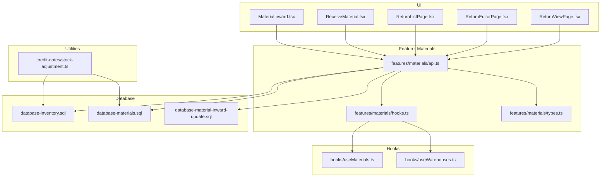

**Diagram sources**
- [MaterialInward.tsx](file://src/pages/MaterialInward.tsx)
- [ReceiveMaterial.tsx](file://src/pages/ReceiveMaterial.tsx)
- [ReturnListPage.tsx](file://src/pages/ReturnListPage.tsx)
- [ReturnEditorPage.tsx](file://src/pages/ReturnEditorPage.tsx)
- [ReturnViewPage.tsx](file://src/pages/ReturnViewPage.tsx)
- [api.ts](file://src/features/materials/api.ts)
- [hooks.ts](file://src/features/materials/hooks.ts)
- [types.ts](file://src/features/materials/types.ts)
- [useMaterials.ts](file://src/hooks/useMaterials.ts)
- [useWarehouses.ts](file://src/hooks/useWarehouses.ts)
- [database-inventory.sql](file://src/database-inventory.sql)
- [database-materials.sql](file://src/database-materials.sql)
- [database-material-inward-update.sql](file://src/database-material-inward-update.sql)
- [stock-adjustment.ts](file://src/credit-notes/stock-adjustment.ts)

**Section sources**
- [MaterialInward.tsx](file://src/pages/MaterialInward.tsx)
- [ReceiveMaterial.tsx](file://src/pages/ReceiveMaterial.tsx)
- [ReturnListPage.tsx](file://src/pages/ReturnListPage.tsx)
- [ReturnEditorPage.tsx](file://src/pages/ReturnEditorPage.tsx)
- [ReturnViewPage.tsx](file://src/pages/ReturnViewPage.tsx)
- [api.ts](file://src/features/materials/api.ts)
- [hooks.ts](file://src/features/materials/hooks.ts)
- [types.ts](file://src/features/materials/types.ts)
- [useMaterials.ts](file://src/hooks/useMaterials.ts)
- [useWarehouses.ts](file://src/hooks/useWarehouses.ts)
- [database-inventory.sql](file://src/database-inventory.sql)
- [database-materials.sql](file://src/database-materials.sql)
- [database-material-inward-update.sql](file://src/database-material-inward-update.sql)
- [stock-adjustment.ts](file://src/credit-notes/stock-adjustment.ts)

## Core Components
- Receiving Entry (Material Inward): Captures incoming goods against purchase orders or ad-hoc receipts, including line-level quantities, batches, and lot details. Supports partial receipts and split deliveries.
- Receiving Execution (Receive Material): Validates received quantities vs ordered, records damage, and triggers inspection if required.
- Quality Inspection: Records inspection results per line or batch, including pass/fail, defect codes, and acceptance criteria. Drives disposition decisions (accept, reject, return).
- Returns Processing: Handles full/partial returns due to damage or non-conformance; integrates with stock adjustments and potential credit notes.
- Stock Updates: Applies net accepted quantities to inventory, manages location/warehouse assignments, and maintains audit trails.
- Vendor Performance Tracking: Aggregates acceptance rates, defect counts, and return ratios per vendor and item.
- Payment Integration: Links approved receipts and inspection outcomes to payable creation and approval workflows.

**Section sources**
- [MaterialInward.tsx](file://src/pages/MaterialInward.tsx)
- [ReceiveMaterial.tsx](file://src/pages/ReceiveMaterial.tsx)
- [ReturnListPage.tsx](file://src/pages/ReturnListPage.tsx)
- [ReturnEditorPage.tsx](file://src/pages/ReturnEditorPage.tsx)
- [ReturnViewPage.tsx](file://src/pages/ReturnViewPage.tsx)
- [api.ts](file://src/features/materials/api.ts)
- [hooks.ts](file://src/features/materials/hooks.ts)
- [types.ts](file://src/features/materials/types.ts)
- [useMaterials.ts](file://src/hooks/useMaterials.ts)
- [useWarehouses.ts](file://src/hooks/useWarehouses.ts)
- [database-inventory.sql](file://src/database-inventory.sql)
- [database-materials.sql](file://src/database-materials.sql)
- [database-material-inward-update.sql](file://src/database-material-inward-update.sql)
- [stock-adjustment.ts](file://src/credit-notes/stock-adjustment.ts)

## Architecture Overview
End-to-end flow from receipt to stock and downstream processes:

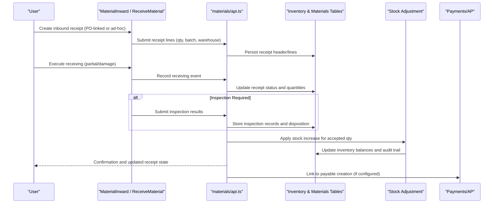

**Diagram sources**
- [MaterialInward.tsx](file://src/pages/MaterialInward.tsx)
- [ReceiveMaterial.tsx](file://src/pages/ReceiveMaterial.tsx)
- [api.ts](file://src/features/materials/api.ts)
- [database-inventory.sql](file://src/database-inventory.sql)
- [database-materials.sql](file://src/database-materials.sql)
- [database-material-inward-update.sql](file://src/database-material-inward-update.sql)
- [stock-adjustment.ts](file://src/credit-notes/stock-adjustment.ts)

## Detailed Component Analysis

### Data Model: Goods Receipt and Inspection
Key entities and relationships:
- Purchase Order Header/Lines: Source of expected items, quantities, and pricing.
- Inbound Receipt Header/Lines: Captures actual delivery events, including partials and splits.
- Inspection Records: Per-line or per-batch inspection results, defect codes, and dispositions.
- Inventory Transactions: Audit-backed movements reflecting accepted quantities into stock.
- Returns: Outward movements linked to inbound receipts for rejected/damaged items.
- Vendors and Warehouses: Dimensional attributes for traceability and performance metrics.

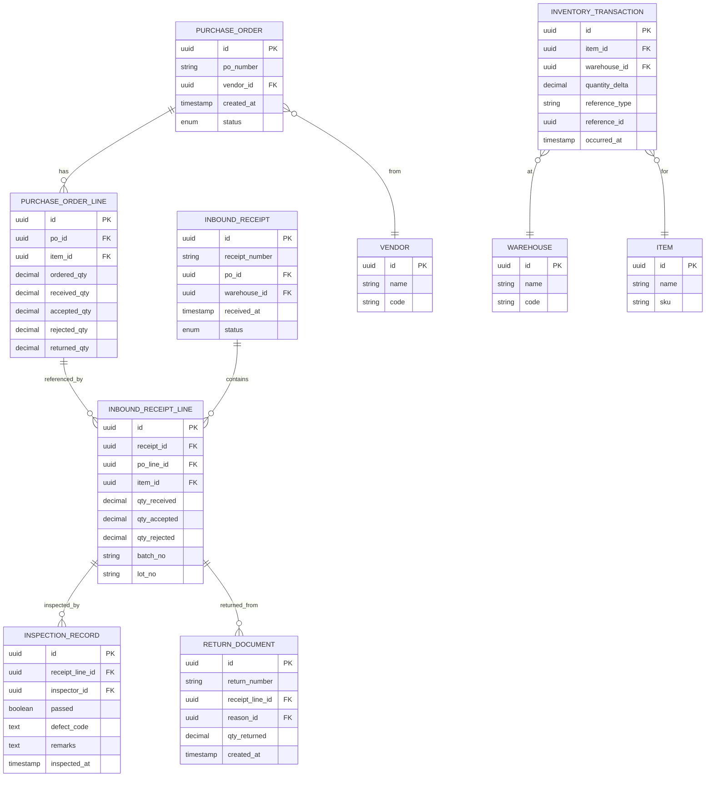

**Diagram sources**
- [database-materials.sql](file://src/database-materials.sql)
- [database-inventory.sql](file://src/database-inventory.sql)
- [database-material-inward-update.sql](file://src/database-material-inward-update.sql)

**Section sources**
- [database-materials.sql](file://src/database-materials.sql)
- [database-inventory.sql](file://src/database-inventory.sql)
- [database-material-inward-update.sql](file://src/database-material-inward-update.sql)

### Receiving Process
- Creation: Users create an inbound receipt linked to a PO or ad-hoc. Line-level fields include item, expected qty, and optional batch/lot.
- Partial Receipts: Multiple receipts can be posted against a single PO line until fully received. System tracks cumulative received quantities.
- Damage Reporting: At receiving, users can mark damaged units and specify defect categories. Damaged units may be routed to inspection or direct rejection.
- Disposition: After inspection, lines are marked accepted/rejected. Accepted quantities drive stock increases; rejected quantities trigger returns or scrap.

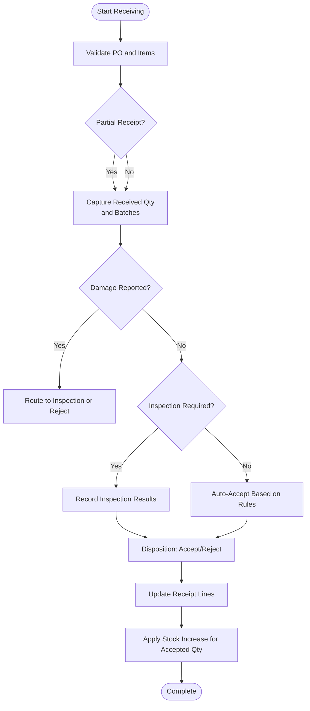

**Diagram sources**
- [MaterialInward.tsx](file://src/pages/MaterialInward.tsx)
- [ReceiveMaterial.tsx](file://src/pages/ReceiveMaterial.tsx)
- [api.ts](file://src/features/materials/api.ts)
- [database-material-inward-update.sql](file://src/database-material-inward-update.sql)

**Section sources**
- [MaterialInward.tsx](file://src/pages/MaterialInward.tsx)
- [ReceiveMaterial.tsx](file://src/pages/ReceiveMaterial.tsx)
- [api.ts](file://src/features/materials/api.ts)
- [database-material-inward-update.sql](file://src/database-material-inward-update.sql)

### Quality Inspection
- Criteria: Inspection rules can be defined per item or category (e.g., dimensions, visual checks, functional tests).
- Metrics: Pass/fail rate, defect codes, average defects per batch, time-to-inspect.
- Compliance: Mandatory inspections for regulated items; audit trail of inspectors and timestamps.
- Outcomes: Acceptance drives stock updates; rejection triggers returns or quarantine.

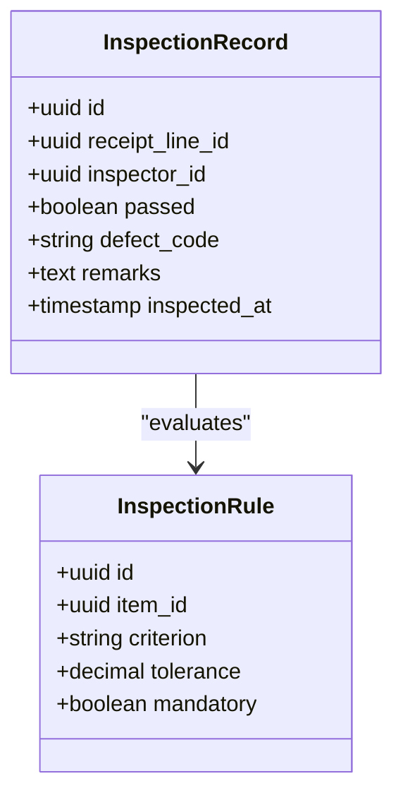

**Diagram sources**
- [database-materials.sql](file://src/database-materials.sql)
- [database-material-inward-update.sql](file://src/database-material-inward-update.sql)

**Section sources**
- [database-materials.sql](file://src/database-materials.sql)
- [database-material-inward-update.sql](file://src/database-material-inward-update.sql)

### Stock Update Mechanisms
- Net Accepted Quantity: Only accepted quantities increment stock. Rejected/damaged quantities do not affect available stock unless reworked and re-inspected.
- Location/Warehouse: Stock is credited to the specified warehouse/location at receipt time.
- Audit Trail: All inventory transactions are recorded with reference IDs linking back to receipts and inspection records.

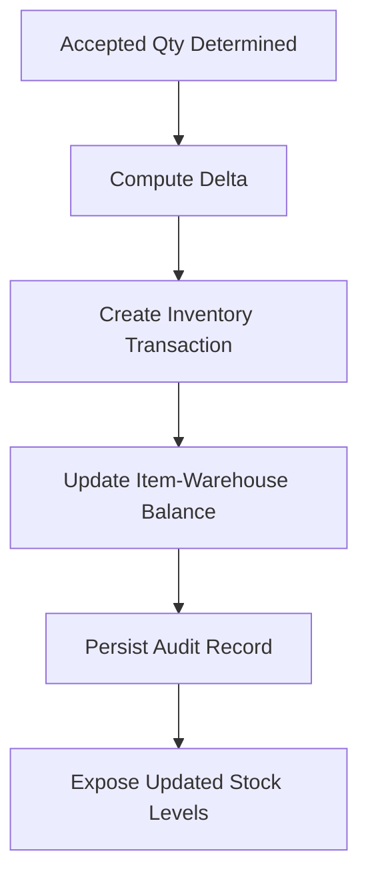

**Diagram sources**
- [database-inventory.sql](file://src/database-inventory.sql)
- [database-material-inward-update.sql](file://src/database-material-inward-update.sql)

**Section sources**
- [database-inventory.sql](file://src/database-inventory.sql)
- [database-material-inward-update.sql](file://src/database-material-inward-update.sql)

### Partial Receipts, Damage Reporting, and Rejection Handling
- Partial Receipts: Multiple receipt lines can reference the same PO line; system enforces that total received does not exceed ordered unless over-receipt is allowed by policy.
- Damage Reporting: Damage flags and defect categories are recorded at receiving or inspection; these influence disposition and return processing.
- Rejection Handling: Rejected lines can be directly returned or sent to inspection first; returns generate outward movements and link to credit notes when applicable.

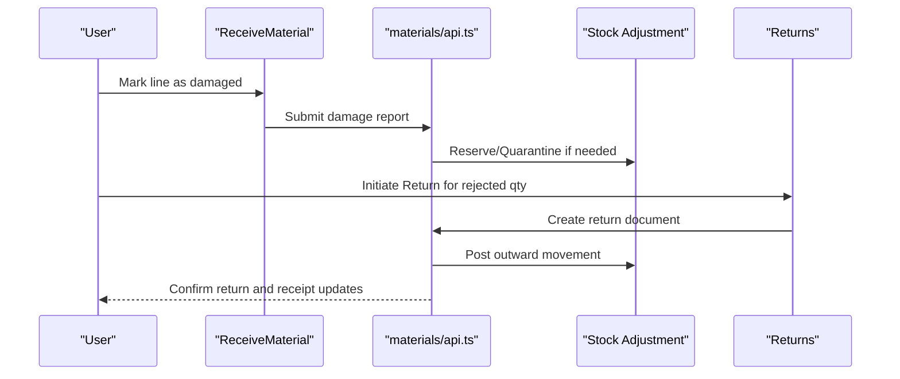

**Diagram sources**
- [ReceiveMaterial.tsx](file://src/pages/ReceiveMaterial.tsx)
- [ReturnListPage.tsx](file://src/pages/ReturnListPage.tsx)
- [ReturnEditorPage.tsx](file://src/pages/ReturnEditorPage.tsx)
- [ReturnViewPage.tsx](file://src/pages/ReturnViewPage.tsx)
- [api.ts](file://src/features/materials/api.ts)
- [stock-adjustment.ts](file://src/credit-notes/stock-adjustment.ts)

**Section sources**
- [ReceiveMaterial.tsx](file://src/pages/ReceiveMaterial.tsx)
- [ReturnListPage.tsx](file://src/pages/ReturnListPage.tsx)
- [ReturnEditorPage.tsx](file://src/pages/ReturnEditorPage.tsx)
- [ReturnViewPage.tsx](file://src/pages/ReturnViewPage.tsx)
- [api.ts](file://src/features/materials/api.ts)
- [stock-adjustment.ts](file://src/credit-notes/stock-adjustment.ts)

### Examples: Receipt Confirmation, Inventory Updates, Discrepancy Resolution
- Receipt Confirmation: After posting a receipt, the system confirms quantities, inspection outcomes, and updated PO fulfillment status.
- Inventory Updates: Accepted quantities appear in item availability for the selected warehouse; transactions are auditable.
- Discrepancy Resolution: If received qty differs from PO, users can log discrepancies, route to inspection, and adjust acceptance accordingly.

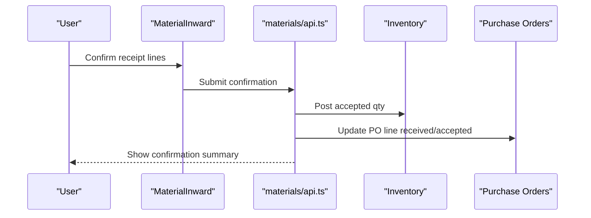

**Diagram sources**
- [MaterialInward.tsx](file://src/pages/MaterialInward.tsx)
- [api.ts](file://src/features/materials/api.ts)
- [database-inventory.sql](file://src/database-inventory.sql)
- [database-materials.sql](file://src/database-materials.sql)

**Section sources**
- [MaterialInward.tsx](file://src/pages/MaterialInward.tsx)
- [api.ts](file://src/features/materials/api.ts)
- [database-inventory.sql](file://src/database-inventory.sql)
- [database-materials.sql](file://src/database-materials.sql)

### Vendor Performance Tracking
- Metrics: Acceptance rate, defect density, return ratio, on-time delivery (linked to receipt dates), and repeat defect frequency.
- Aggregation: Computed per vendor and item over rolling periods; supports dashboards and alerts.
- Actions: Low-performing vendors can be flagged for review, additional inspections, or sourcing changes.

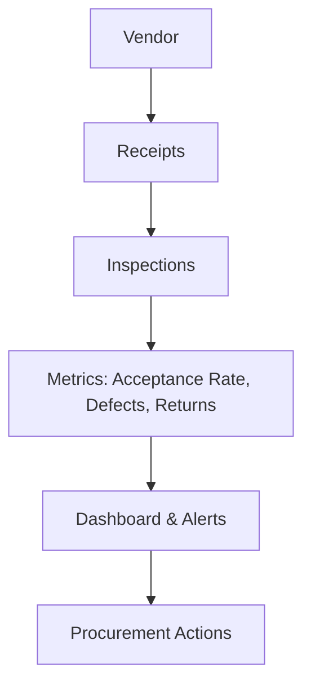

[No sources needed since this diagram shows conceptual workflow, not actual code structure]

### Returns Processing and Credit Notes Integration
- Returns: Generated from rejected/damaged receipt lines; includes reason codes and quantities.
- Credit Notes: Optional linkage to financial adjustments; stock-out movements are recorded.
- Workflow: Return creation, approval (if required), posting, and reconciliation with AP.

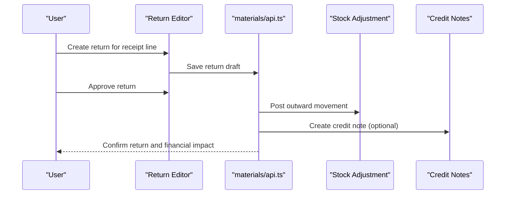

**Diagram sources**
- [ReturnEditorPage.tsx](file://src/pages/ReturnEditorPage.tsx)
- [ReturnListPage.tsx](file://src/pages/ReturnListPage.tsx)
- [ReturnViewPage.tsx](file://src/pages/ReturnViewPage.tsx)
- [api.ts](file://src/features/materials/api.ts)
- [stock-adjustment.ts](file://src/credit-notes/stock-adjustment.ts)

**Section sources**
- [ReturnEditorPage.tsx](file://src/pages/ReturnEditorPage.tsx)
- [ReturnListPage.tsx](file://src/pages/ReturnListPage.tsx)
- [ReturnViewPage.tsx](file://src/pages/ReturnViewPage.tsx)
- [api.ts](file://src/features/materials/api.ts)
- [stock-adjustment.ts](file://src/credit-notes/stock-adjustment.ts)

### Integration with Payment Workflows
- Payable Creation: Approved receipts and inspection outcomes can trigger payable creation against the vendor.
- Approval Gates: Payments may require approvals based on thresholds, discrepancies, or inspection failures.
- Auditability: Payment references link back to receipts and inspection records for traceability.

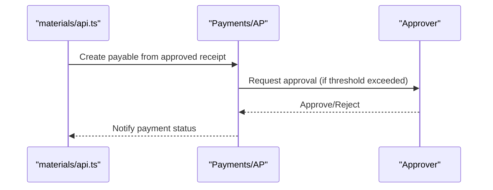

[No sources needed since this diagram shows conceptual workflow, not actual code structure]

## Dependency Analysis
Component coupling and cohesion:
- UI pages depend on feature APIs for CRUD operations and business logic.
- Feature APIs coordinate with database schemas and stock adjustment utilities.
- Hooks abstract data fetching and caching for materials and warehouses.
- Database migrations define constraints and indexes supporting performance and integrity.

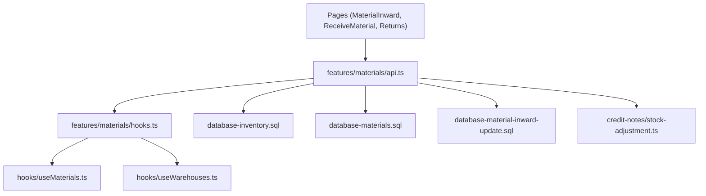

**Diagram sources**
- [MaterialInward.tsx](file://src/pages/MaterialInward.tsx)
- [ReceiveMaterial.tsx](file://src/pages/ReceiveMaterial.tsx)
- [ReturnListPage.tsx](file://src/pages/ReturnListPage.tsx)
- [ReturnEditorPage.tsx](file://src/pages/ReturnEditorPage.tsx)
- [ReturnViewPage.tsx](file://src/pages/ReturnViewPage.tsx)
- [api.ts](file://src/features/materials/api.ts)
- [hooks.ts](file://src/features/materials/hooks.ts)
- [useMaterials.ts](file://src/hooks/useMaterials.ts)
- [useWarehouses.ts](file://src/hooks/useWarehouses.ts)
- [database-inventory.sql](file://src/database-inventory.sql)
- [database-materials.sql](file://src/database-materials.sql)
- [database-material-inward-update.sql](file://src/database-material-inward-update.sql)
- [stock-adjustment.ts](file://src/credit-notes/stock-adjustment.ts)

**Section sources**
- [api.ts](file://src/features/materials/api.ts)
- [hooks.ts](file://src/features/materials/hooks.ts)
- [useMaterials.ts](file://src/hooks/useMaterials.ts)
- [useWarehouses.ts](file://src/hooks/useWarehouses.ts)
- [database-inventory.sql](file://src/database-inventory.sql)
- [database-materials.sql](file://src/database-materials.sql)
- [database-material-inward-update.sql](file://src/database-material-inward-update.sql)
- [stock-adjustment.ts](file://src/credit-notes/stock-adjustment.ts)

## Performance Considerations
- Indexing: Ensure indexes on foreign keys (po_id, item_id, warehouse_id, receipt_id) and frequently filtered columns (status, created_at).
- Batch Operations: For large receipts, prefer batch inserts/updates to reduce round-trips.
- Caching: Use hooks to cache materials and warehouses lists; invalidate on mutations.
- Concurrency: Implement optimistic locking or versioning on PO lines to prevent race conditions during partial receipts.
- Audit Trails: Keep transaction logs append-only to maintain query performance and integrity.

[No sources needed since this section provides general guidance]

## Troubleshooting Guide
Common issues and resolutions:
- Over-receipt Errors: Enforce ordered qty limits; allow configurable over-receipt policies with warnings.
- Missing Inspection Records: Require inspection before acceptance for regulated items; surface validation errors early.
- Stock Imbalances: Cross-check inventory transactions against receipt lines; reconcile discrepancies via audit logs.
- Return Linkage Failures: Validate receipt line existence and status before creating returns; ensure proper referential integrity.

**Section sources**
- [database-material-inward-update.sql](file://src/database-material-inward-update.sql)
- [database-inventory.sql](file://src/database-inventory.sql)
- [database-materials.sql](file://src/database-materials.sql)

## Conclusion
The goods receipt and inspection workflow integrates receiving, inspection, stock updates, returns, and payment linkages into a cohesive process. The data model supports partial receipts, damage reporting, and rejection handling while maintaining robust auditability. Vendor performance metrics enable continuous improvement, and clear integration points facilitate downstream financial processes.

## Appendices
- Best Practices:
  - Always record batch/lot numbers for traceability.
  - Define mandatory inspection rules for high-risk items.
  - Maintain consistent defect coding standards across teams.
  - Regularly reconcile inventory transactions with physical counts.

[No sources needed since this section provides general guidance]