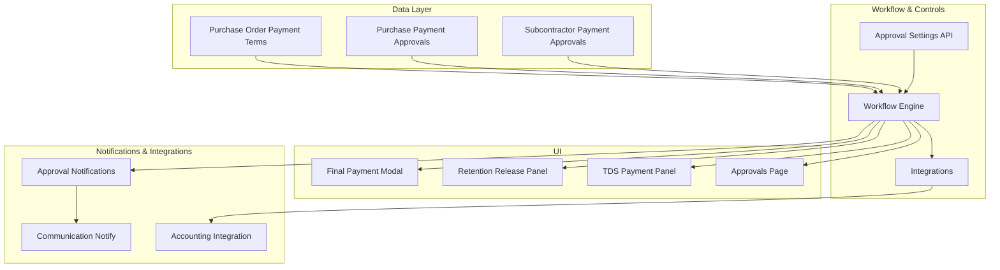
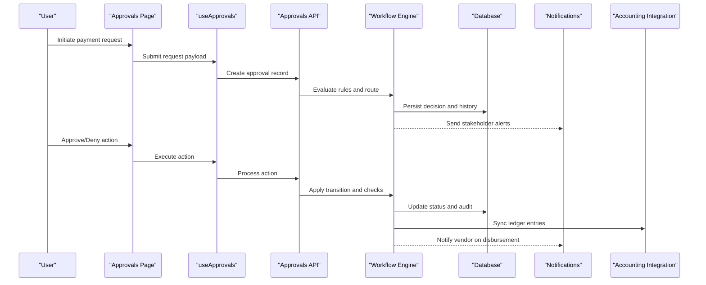
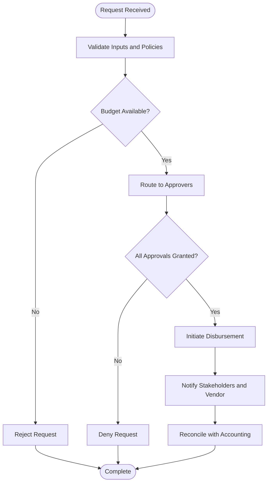
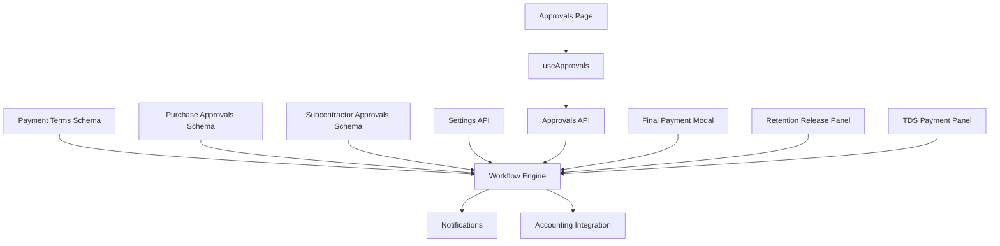

# Payment Processing & Approval

<cite>
**Referenced Files in This Document**
- [PAYMENT-APPROVAL-PLAN.md](file://PAYMENT-APPROVAL-PLAN.md)
- [database-po-payment-terms.sql](file://src/database-po-payment-terms.sql)
- [database-purchase-payment-approval.sql](file://src/database-purchase-payment-approval.sql)
- [database-subcontractor-payment-approval.sql](file://src/database-subcontractor-payment-approval.sql)
- [components/FinalPaymentModal.tsx](file://src/components/FinalPaymentModal.tsx)
- [components/RetentionReleasePanel.tsx](file://src/components/RetentionReleasePanel.tsx)
- [components/TDSPaymentPanel.tsx](file://src/components/TDSPaymentPanel.tsx)
- [approvals/workflow-engine.ts](file://src/approvals/workflow-engine.ts)
- [approvals/api.ts](file://src/approvals/api.ts)
- [approvals/integration.ts](file://src/approvals/integration.ts)
- [approvals/notifications.ts](file://src/approvals/notifications.ts)
- [approvals/settings-api.ts](file://src/approvals/settings-api.ts)
- [approvals/siteReportApproval.ts](file://src/approvals/siteReportApproval.ts)
- [hooks/useApprovals.ts](file://src/hooks/useApprovals.ts)
- [pages/Approvals.tsx](file://src/pages/Approvals.tsx)
- [api/comm-notify.ts](file://api/comm-notify.ts)
</cite>

## Table of Contents
1. [Introduction](#introduction)
2. [Project Structure](#project-structure)
3. [Core Components](#core-components)
4. [Architecture Overview](#architecture-overview)
5. [Detailed Component Analysis](#detailed-component-analysis)
6. [Dependency Analysis](#dependency-analysis)
7. [Performance Considerations](#performance-considerations)
8. [Troubleshooting Guide](#troubleshooting-guide)
9. [Conclusion](#conclusion)
10. [Appendices](#appendices)

## Introduction
This document provides a comprehensive data model and workflow reference for the payment processing and approval system. It covers payment initiation, multi-level approvals, disbursement tracking, payment terms (including advance payments and retention), budget controls, compliance checks, partial payments, reconciliation, status tracking, vendor notifications, and integration with accounting systems. The content is grounded in the repository’s database migrations, approval workflows, UI components, and API modules related to purchase orders, subcontractors, and general approvals.

## Project Structure
The payment and approval capabilities are implemented across several layers:
- Data layer: SQL migrations define tables and constraints for payment terms, purchase and subcontractor payment approvals, and related metadata.
- Workflow and approvals: A workflow engine orchestrates approval routing, settings, and integrations.
- UI components: Panels and modals support final payments, retention release, and TDS handling.
- Hooks and pages: Client-side hooks and pages expose approval operations and dashboards.
- Notifications and integrations: Communication and integration utilities support vendor notifications and downstream accounting sync.

**Diagram sources**
- [database-po-payment-terms.sql](file://src/database-po-payment-terms.sql)
- [database-purchase-payment-approval.sql](file://src/database-purchase-payment-approval.sql)
- [database-subcontractor-payment-approval.sql](file://src/database-subcontractor-payment-approval.sql)
- [approvals/workflow-engine.ts](file://src/approvals/workflow-engine.ts)
- [approvals/settings-api.ts](file://src/approvals/settings-api.ts)
- [approvals/integration.ts](file://src/approvals/integration.ts)
- [components/FinalPaymentModal.tsx](file://src/components/FinalPaymentModal.tsx)
- [components/RetentionReleasePanel.tsx](file://src/components/RetentionReleasePanel.tsx)
- [components/TDSPaymentPanel.tsx](file://src/components/TDSPaymentPanel.tsx)
- [pages/Approvals.tsx](file://src/pages/Approvals.tsx)
- [approvals/notifications.ts](file://src/approvals/notifications.ts)
- [api/comm-notify.ts](file://api/comm-notify.ts)

**Section sources**
- [PAYMENT-APPROVAL-PLAN.md](file://PAYMENT-APPROVAL-PLAN.md)
- [database-po-payment-terms.sql](file://src/database-po-payment-terms.sql)
- [database-purchase-payment-approval.sql](file://src/database-purchase-payment-approval.sql)
- [database-subcontractor-payment-approval.sql](file://src/database-subcontractor-payment-approval.sql)
- [approvals/workflow-engine.ts](file://src/approvals/workflow-engine.ts)
- [approvals/settings-api.ts](file://src/approvals/settings-api.ts)
- [approvals/integration.ts](file://src/approvals/integration.ts)
- [components/FinalPaymentModal.tsx](file://src/components/FinalPaymentModal.tsx)
- [components/RetentionReleasePanel.tsx](file://src/components/RetentionReleasePanel.tsx)
- [components/TDSPaymentPanel.tsx](file://src/components/TDSPaymentPanel.tsx)
- [pages/Approvals.tsx](file://src/pages/Approvals.tsx)
- [approvals/notifications.ts](file://src/approvals/notifications.ts)
- [api/comm-notify.ts](file://api/comm-notify.ts)

## Core Components
- Payment terms and schedules: Defined via database schema supporting milestones, percentages, and conditions that drive payment cycles and partial payments.
- Purchase payment approvals: Multi-step approval records tied to purchase orders, capturing requested amounts, budgets, and approver chains.
- Subcontractor payment approvals: Similar structure tailored for subcontractor engagements, including retention and milestone-based releases.
- Final payment modal: Orchestrates final settlement calculations, including deductions and retention release logic.
- Retention release panel: Manages release of retained amounts upon completion or milestone achievement.
- TDS payment panel: Handles tax deduction at source computations and documentation linkage.
- Approval workflow engine: Evaluates rules, routes requests, enforces hierarchy, and persists decisions.
- Approval settings API: Configures thresholds, roles, and policy parameters.
- Notifications: Emits alerts and messages to stakeholders and vendors.
- Integrations: Bridges to external accounting systems for ledger entries and reconciliations.

**Section sources**
- [database-po-payment-terms.sql](file://src/database-po-payment-terms.sql)
- [database-purchase-payment-approval.sql](file://src/database-purchase-payment-approval.sql)
- [database-subcontractor-payment-approval.sql](file://src/database-subcontractor-payment-approval.sql)
- [components/FinalPaymentModal.tsx](file://src/components/FinalPaymentModal.tsx)
- [components/RetentionReleasePanel.tsx](file://src/components/RetentionReleasePanel.tsx)
- [components/TDSPaymentPanel.tsx](file://src/components/TDSPaymentPanel.tsx)
- [approvals/workflow-engine.ts](file://src/approvals/workflow-engine.ts)
- [approvals/settings-api.ts](file://src/approvals/settings-api.ts)
- [approvals/notifications.ts](file://src/approvals/notifications.ts)
- [approvals/integration.ts](file://src/approvals/integration.ts)

## Architecture Overview
The system follows a layered architecture:
- Data persistence: SQL schemas define entities for payment terms, approvals, and audit trails.
- Workflow orchestration: Centralized engine evaluates policies, manages state transitions, and coordinates actions.
- User interfaces: Focused panels and modals guide users through complex payment scenarios.
- External integrations: Accounting and communication services receive updates post-approval.

**Diagram sources**
- [pages/Approvals.tsx](file://src/pages/Approvals.tsx)
- [hooks/useApprovals.ts](file://src/hooks/useApprovals.ts)
- [approvals/api.ts](file://src/approvals/api.ts)
- [approvals/workflow-engine.ts](file://src/approvals/workflow-engine.ts)
- [approvals/notifications.ts](file://src/approvals/notifications.ts)
- [approvals/integration.ts](file://src/approvals/integration.ts)

## Detailed Component Analysis

### Payment Terms and Schedules
- Purpose: Define how payments are split across milestones, percentages, and conditions.
- Key concepts:
  - Milestone-based triggers (e.g., delivery, acceptance).
  - Percentage allocations per milestone.
  - Advance payment configuration and caps.
  - Retention percentage and release conditions.
- Usage examples:
  - Partial payments aligned with milestone completions.
  - Advance payments limited by contract terms.
  - Retention held until final acceptance and defect liability period expiry.

**Section sources**
- [database-po-payment-terms.sql](file://src/database-po-payment-terms.sql)

### Purchase Payment Approvals
- Purpose: Manage purchase-related payment requests with hierarchical approvals.
- Key concepts:
  - Requested amount vs. available budget.
  - Multi-level approvers based on thresholds and roles.
  - Status lifecycle (draft, pending, approved, rejected, disbursed).
  - Audit trail for each action.
- Compliance checks:
  - Budget validation against allocated funds.
  - Policy enforcement via settings API.
  - Segregation of duties enforced by workflow engine.

**Section sources**
- [database-purchase-payment-approval.sql](file://src/database-purchase-payment-approval.sql)
- [approvals/settings-api.ts](file://src/approvals/settings-api.ts)
- [approvals/workflow-engine.ts](file://src/approvals/workflow-engine.ts)

### Subcontractor Payment Approvals
- Purpose: Handle subcontractor-specific payment flows including retention and milestone releases.
- Key concepts:
  - Linkage to subcontractor contracts and milestones.
  - Retention hold and conditional release.
  - TDS computation and documentation.
  - Disbursement tracking and reconciliation.

**Section sources**
- [database-subcontractor-payment-approval.sql](file://src/database-subcontractor-payment-approval.sql)
- [components/RetentionReleasePanel.tsx](file://src/components/RetentionReleasePanel.tsx)
- [components/TDSPaymentPanel.tsx](file://src/components/TDSPaymentPanel.tsx)

### Final Payment Modal
- Purpose: Orchestrate final settlement calculations and confirmations.
- Responsibilities:
  - Summarize paid amounts, advances, and retention.
  - Validate remaining balance and compliance.
  - Trigger final approval steps and disbursement.
  - Emit notifications and accounting entries.

**Section sources**
- [components/FinalPaymentModal.tsx](file://src/components/FinalPaymentModal.tsx)
- [approvals/workflow-engine.ts](file://src/approvals/workflow-engine.ts)
- [approvals/notifications.ts](file://src/approvals/notifications.ts)
- [approvals/integration.ts](file://src/approvals/integration.ts)

### Retention Release Panel
- Purpose: Manage release of retained amounts upon meeting conditions.
- Responsibilities:
  - Check milestone completion and acceptance criteria.
  - Compute releaseable retention portion.
  - Route for approvals if exceeding thresholds.
  - Update payment records and notify stakeholders.

**Section sources**
- [components/RetentionReleasePanel.tsx](file://src/components/RetentionReleasePanel.tsx)
- [approvals/workflow-engine.ts](file://src/approvals/workflow-engine.ts)

### TDS Payment Panel
- Purpose: Handle tax deduction at source calculations and documentation.
- Responsibilities:
  - Compute applicable TDS rates and amounts.
  - Attach supporting documents and references.
  - Ensure compliance with regulatory requirements.
  - Integrate with accounting for tax postings.

**Section sources**
- [components/TDSPaymentPanel.tsx](file://src/components/TDSPaymentPanel.tsx)
- [approvals/integration.ts](file://src/approvals/integration.ts)

### Approval Workflow Engine
- Purpose: Centralized engine for evaluating rules, routing requests, and enforcing policies.
- Responsibilities:
  - Determine approver hierarchy based on thresholds and roles.
  - Enforce budget controls and compliance checks.
  - Manage state transitions and audit logging.
  - Coordinate notifications and integrations.

**Diagram sources**
- [approvals/workflow-engine.ts](file://src/approvals/workflow-engine.ts)
- [approvals/settings-api.ts](file://src/approvals/settings-api.ts)
- [approvals/notifications.ts](file://src/approvals/notifications.ts)
- [approvals/integration.ts](file://src/approvals/integration.ts)

**Section sources**
- [approvals/workflow-engine.ts](file://src/approvals/workflow-engine.ts)
- [approvals/settings-api.ts](file://src/approvals/settings-api.ts)
- [approvals/notifications.ts](file://src/approvals/notifications.ts)
- [approvals/integration.ts](file://src/approvals/integration.ts)

### Approval Settings API
- Purpose: Configure thresholds, roles, and policy parameters governing approvals.
- Responsibilities:
  - Define role-based approver hierarchies.
  - Set monetary thresholds for escalation.
  - Enable/disable specific compliance checks.
  - Provide endpoints for runtime policy updates.

**Section sources**
- [approvals/settings-api.ts](file://src/approvals/settings-api.ts)

### Notifications and Vendor Communications
- Purpose: Keep stakeholders and vendors informed throughout the payment lifecycle.
- Responsibilities:
  - Emit alerts on status changes.
  - Send vendor notifications for approvals, rejections, and disbursements.
  - Integrate with communication channels.

**Section sources**
- [approvals/notifications.ts](file://src/approvals/notifications.ts)
- [api/comm-notify.ts](file://api/comm-notify.ts)

### Approvals Page and Hooks
- Purpose: Provide user-facing interfaces and client-side logic for managing approvals.
- Responsibilities:
  - Display approval queues and details.
  - Facilitate approve/deny actions.
  - Refresh states and handle errors gracefully.

**Section sources**
- [pages/Approvals.tsx](file://src/pages/Approvals.tsx)
- [hooks/useApprovals.ts](file://src/hooks/useApprovals.ts)
- [approvals/api.ts](file://src/approvals/api.ts)

## Dependency Analysis
The following diagram illustrates key dependencies among core modules:

**Diagram sources**
- [database-po-payment-terms.sql](file://src/database-po-payment-terms.sql)
- [database-purchase-payment-approval.sql](file://src/database-purchase-payment-approval.sql)
- [database-subcontractor-payment-approval.sql](file://src/database-subcontractor-payment-approval.sql)
- [approvals/workflow-engine.ts](file://src/approvals/workflow-engine.ts)
- [approvals/settings-api.ts](file://src/approvals/settings-api.ts)
- [approvals/api.ts](file://src/approvals/api.ts)
- [approvals/notifications.ts](file://src/approvals/notifications.ts)
- [approvals/integration.ts](file://src/approvals/integration.ts)
- [components/FinalPaymentModal.tsx](file://src/components/FinalPaymentModal.tsx)
- [components/RetentionReleasePanel.tsx](file://src/components/RetentionReleasePanel.tsx)
- [components/TDSPaymentPanel.tsx](file://src/components/TDSPaymentPanel.tsx)
- [pages/Approvals.tsx](file://src/pages/Approvals.tsx)
- [hooks/useApprovals.ts](file://src/hooks/useApprovals.ts)

**Section sources**
- [approvals/workflow-engine.ts](file://src/approvals/workflow-engine.ts)
- [approvals/settings-api.ts](file://src/approvals/settings-api.ts)
- [approvals/api.ts](file://src/approvals/api.ts)
- [approvals/notifications.ts](file://src/approvals/notifications.ts)
- [approvals/integration.ts](file://src/approvals/integration.ts)
- [components/FinalPaymentModal.tsx](file://src/components/FinalPaymentModal.tsx)
- [components/RetentionReleasePanel.tsx](file://src/components/RetentionReleasePanel.tsx)
- [components/TDSPaymentPanel.tsx](file://src/components/TDSPaymentPanel.tsx)
- [pages/Approvals.tsx](file://src/pages/Approvals.tsx)
- [hooks/useApprovals.ts](file://src/hooks/useApprovals.ts)

## Performance Considerations
- Batch operations: Group multiple approval actions where possible to reduce network overhead.
- Caching: Cache static settings and policy configurations to minimize repeated fetches.
- Pagination: Use paginated queries for large approval queues to improve UI responsiveness.
- Idempotency: Ensure idempotent actions to prevent duplicate disbursements or ledger entries.
- Indexing: Leverage database indexes on frequently queried fields (e.g., status, org_id, entity_id).

[No sources needed since this section provides general guidance]

## Troubleshooting Guide
Common issues and resolutions:
- Approval stuck in pending:
  - Verify approver assignments and thresholds configured in settings.
  - Check workflow engine logs for rule evaluation failures.
- Budget exceeded:
  - Confirm budget allocation and utilization; adjust requests or reallocate funds.
- Retention not releasing:
  - Ensure milestone completion and acceptance criteria are met; review retention release panel validations.
- TDS discrepancies:
  - Validate tax rates and documentation; cross-check with accounting integration outputs.
- Vendor notification delays:
  - Inspect communication service connectivity and retry policies.

**Section sources**
- [approvals/settings-api.ts](file://src/approvals/settings-api.ts)
- [approvals/workflow-engine.ts](file://src/approvals/workflow-engine.ts)
- [components/RetentionReleasePanel.tsx](file://src/components/RetentionReleasePanel.tsx)
- [components/TDSPaymentPanel.tsx](file://src/components/TDSPaymentPanel.tsx)
- [api/comm-notify.ts](file://api/comm-notify.ts)

## Conclusion
The payment processing and approval system integrates robust data models, configurable workflows, and focused UI components to manage complex payment scenarios. By leveraging milestone-based terms, hierarchical approvals, retention controls, and TDS handling, the system ensures compliance, transparency, and efficient disbursement tracking. Notifications and accounting integrations close the loop, enabling accurate reconciliation and vendor communication.

[No sources needed since this section summarizes without analyzing specific files]

## Appendices

### Example Scenarios
- Payment cycles:
  - Advance payment triggered at contract signing, followed by milestone-driven partial payments, and final settlement after acceptance.
- Partial payments:
  - Split invoices aligned with delivered quantities or completed milestones; each segment routed through approvals independently.
- Payment reconciliation:
  - Match disbursements against approved requests, retention releases, and TDS deductions; reconcile with accounting ledger entries.

[No sources needed since this section provides conceptual examples]