# Procurement & Purchase Workflows

<cite>
**Referenced Files in This Document**
- [ProcurementList.tsx](file://src/pages/ProcurementList.tsx)
- [ProcurementDetail.tsx](file://src/pages/ProcurementDetail.tsx)
- [CreatePO.tsx](file://src/pages/CreatePO.tsx)
- [POList.tsx](file://src/pages/POList.tsx)
- [MaterialInward.tsx](file://src/pages/MaterialInward.tsx)
- [ReceiveMaterial.tsx](file://src/pages/ReceiveMaterial.tsx)
- [database-purchase-module.sql](file://src/database-purchase-module.sql)
- [database-purchase-enhancements-v2.sql](file://src/database-purchase-enhancements-v2.sql)
- [database-po-payment-terms.sql](file://src/database-po-payment-terms.sql)
- [database-material-inward-update.sql](file://src/database-material-inward-update.sql)
- [modules/Purchase/index.tsx](file://src/modules/Purchase/index.tsx)
- [modules/Purchase/api.ts](file://src/modules/Purchase/api.ts)
- [modules/Purchase/types.ts](file://src/modules/Purchase/types.ts)
- [useMaterials.ts](file://src/hooks/useMaterials.ts)
- [useWarehouses.ts](file://src/hooks/useWarehouses.ts)
- [lib/supabase.ts](file://src/lib/supabase.ts)
</cite>

## Table of Contents
1. [Introduction](#introduction)
2. [Project Structure](#project-structure)
3. [Core Components](#core-components)
4. [Architecture Overview](#architecture-overview)
5. [Detailed Component Analysis](#detailed-component-analysis)
6. [Dependency Analysis](#dependency-analysis)
7. [Performance Considerations](#performance-considerations)
8. [Troubleshooting Guide](#troubleshooting-guide)
9. [Conclusion](#conclusion)
10. [Appendices](#appendices)

## Introduction
This document provides a comprehensive data model and workflow reference for the procurement and purchase system. It covers purchase requisitions, purchase orders, goods receipts, and payment processing; vendor management integration; price history tracking; supplier evaluation metrics; approval workflows; budget controls; compliance checks; material requisition-to-order conversion; backorder handling; drop shipment scenarios; end-to-end procurement cycles; exception handling; integrations with inventory and accounting systems; vendor performance tracking; contract management; and procurement analytics.

The content is grounded in the repository’s UI pages, modules, hooks, and SQL migrations that define the data structures and flows for procurement operations.

## Project Structure
The procurement functionality spans UI pages, module definitions, hooks, and database migrations:
- Pages implement user-facing screens for procurement lists, details, order creation, and goods receipt.
- The Purchase module encapsulates API interactions and types.
- Hooks provide access to materials and warehouses.
- SQL migrations define core tables and relationships for procurement, payments, and inward processes.

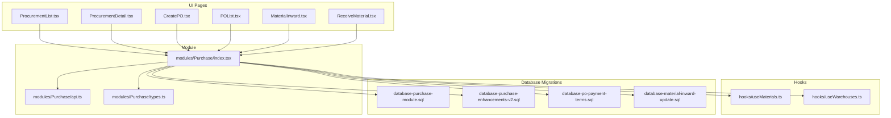

**Diagram sources**
- [ProcurementList.tsx](file://src/pages/ProcurementList.tsx)
- [ProcurementDetail.tsx](file://src/pages/ProcurementDetail.tsx)
- [CreatePO.tsx](file://src/pages/CreatePO.tsx)
- [POList.tsx](file://src/pages/POList.tsx)
- [MaterialInward.tsx](file://src/pages/MaterialInward.tsx)
- [ReceiveMaterial.tsx](file://src/pages/ReceiveMaterial.tsx)
- [modules/Purchase/index.tsx](file://src/modules/Purchase/index.tsx)
- [modules/Purchase/api.ts](file://src/modules/Purchase/api.ts)
- [modules/Purchase/types.ts](file://src/modules/Purchase/types.ts)
- [database-purchase-module.sql](file://src/database-purchase-module.sql)
- [database-purchase-enhancements-v2.sql](file://src/database-purchase-enhancements-v2.sql)
- [database-po-payment-terms.sql](file://src/database-po-payment-terms.sql)
- [database-material-inward-update.sql](file://src/database-material-inward-update.sql)

**Section sources**
- [ProcurementList.tsx](file://src/pages/ProcurementList.tsx)
- [ProcurementDetail.tsx](file://src/pages/ProcurementDetail.tsx)
- [CreatePO.tsx](file://src/pages/CreatePO.tsx)
- [POList.tsx](file://src/pages/POList.tsx)
- [MaterialInward.tsx](file://src/pages/MaterialInward.tsx)
- [ReceiveMaterial.tsx](file://src/pages/ReceiveMaterial.tsx)
- [modules/Purchase/index.tsx](file://src/modules/Purchase/index.tsx)
- [modules/Purchase/api.ts](file://src/modules/Purchase/api.ts)
- [modules/Purchase/types.ts](file://src/modules/Purchase/types.ts)
- [database-purchase-module.sql](file://src/database-purchase-module.sql)
- [database-purchase-enhancements-v2.sql](file://src/database/database-purchase-enhancements-v2.sql)
- [database-po-payment-terms.sql](file://src/database-po-payment-terms.sql)
- [database-material-inward-update.sql](file://src/database-material-inward-update.sql)

## Core Components
- Purchase Requisition: Captures internal demand for materials or services, including item references, quantities, requested dates, and project/cost center context.
- Purchase Order: Formalizes vendor commitments with line items, pricing, taxes, delivery terms, and approvals.
- Goods Receipt: Records inbound deliveries against PO lines, supporting partial receipts and quality acceptance.
- Payment Processing: Manages invoice matching, payment terms, and disbursements linked to POs and receipts.
- Vendor Management: Maintains vendor master data, ratings, contracts, and performance metrics.
- Price History Tracking: Stores historical pricing per vendor/item to support negotiation and forecasting.
- Supplier Evaluation Metrics: Tracks on-time delivery, quality acceptance rates, and defect ratios.
- Approval Workflows: Enforces multi-step approvals based on thresholds, roles, and policies.
- Budget Controls: Validates requests against budgets and reserves funds upon approvals.
- Compliance Checks: Ensures adherence to tax rules, vendor eligibility, and policy constraints.
- Material Requisition-to-Order Conversion: Automates PR to PO generation with validation and mapping.
- Backorder Handling: Supports partial fulfillment and rescheduling when stock is unavailable.
- Drop Shipment Scenarios: Enables direct vendor-to-customer shipments without intermediate warehousing.

**Section sources**
- [database-purchase-module.sql](file://src/database-purchase-module.sql)
- [database-purchase-enhancements-v2.sql](file://src/database-purchase-enhancements-v2.sql)
- [database-po-payment-terms.sql](file://src/database-po-payment-terms.sql)
- [database-material-inward-update.sql](file://src/database-material-inward-update.sql)
- [modules/Purchase/types.ts](file://src/modules/Purchase/types.ts)

## Architecture Overview
The procurement architecture integrates UI pages with a centralized Purchase module, which coordinates API calls and type definitions. Data persistence is managed via Supabase through shared configuration. Database migrations define the schema for procurement entities and related processes.

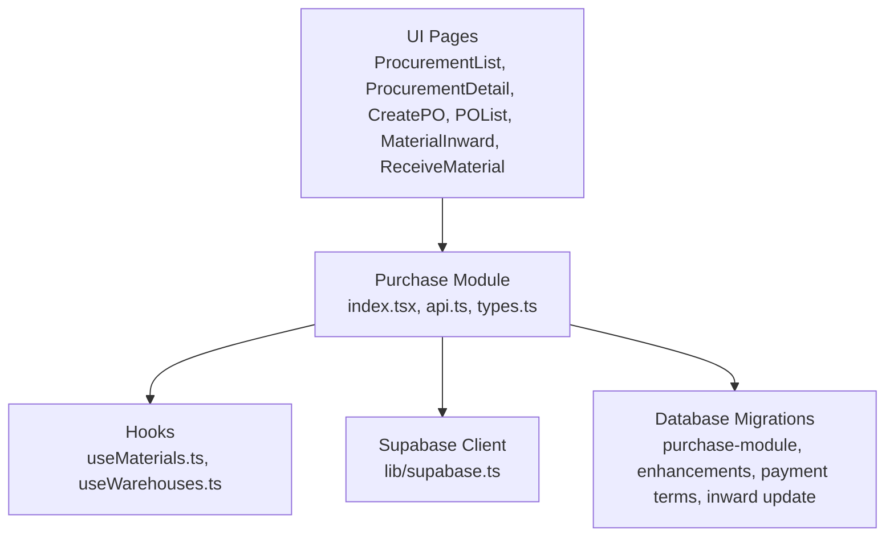

**Diagram sources**
- [ProcurementList.tsx](file://src/pages/ProcurementList.tsx)
- [ProcurementDetail.tsx](file://src/pages/ProcurementDetail.tsx)
- [CreatePO.tsx](file://src/pages/CreatePO.tsx)
- [POList.tsx](file://src/pages/POList.tsx)
- [MaterialInward.tsx](file://src/pages/MaterialInward.tsx)
- [ReceiveMaterial.tsx](file://src/pages/ReceiveMaterial.tsx)
- [modules/Purchase/index.tsx](file://src/modules/Purchase/index.tsx)
- [modules/Purchase/api.ts](file://src/modules/Purchase/api.ts)
- [modules/Purchase/types.ts](file://src/modules/Purchase/types.ts)
- [database-purchase-module.sql](file://src/database-purchase-module.sql)
- [database-purchase-enhancements-v2.sql](file://src/database-purchase-enhancements-v2.sql)
- [database-po-payment-terms.sql](file://src/database-po-payment-terms.sql)
- [database-material-inward-update.sql](file://src/database-material-inward-update.sql)
- [lib/supabase.ts](file://src/lib/supabase.ts)

## Detailed Component Analysis

### Purchase Requisition Data Model
- Purpose: Capture demand for materials/services with item, quantity, date, and organizational context.
- Key fields: ID, organization, requester, item reference, quantity, unit, requested date, status, notes, project/cost center linkage.
- Relationships: Links to item master and organizational units; supports multiple requisitions per project.

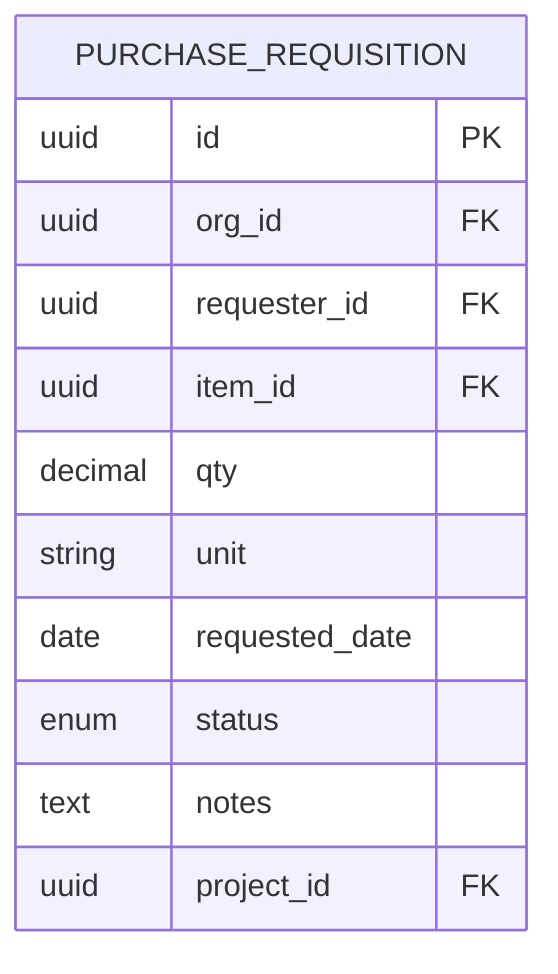

**Diagram sources**
- [database-purchase-module.sql](file://src/database-purchase-module.sql)

**Section sources**
- [database-purchase-module.sql](file://src/database-purchase-module.sql)

### Purchase Order Data Model
- Purpose: Formalize vendor commitments with line items, pricing, taxes, and delivery terms.
- Key fields: Header (ID, vendor, dates, terms, status), Lines (item, qty, rate, tax, amount), Approvals, Notes.
- Relationships: Vendor master, item master, project/cost center, approval workflow, payment terms.

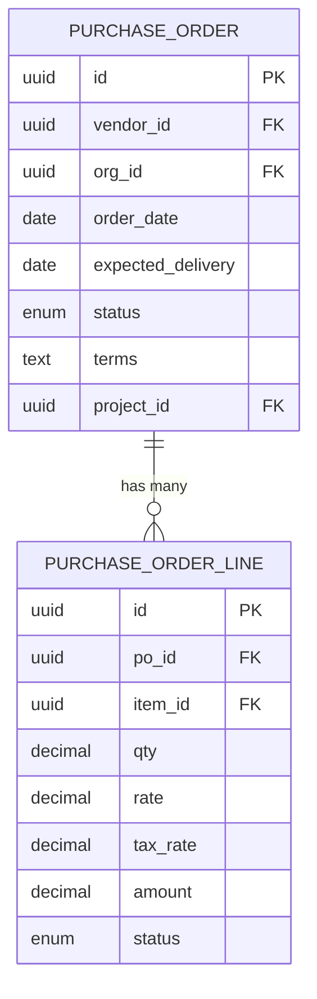

**Diagram sources**
- [database-purchase-module.sql](file://src/database-purchase-module.sql)
- [database-purchase-enhancements-v2.sql](file://src/database-purchase-enhancements-v2.sql)

**Section sources**
- [database-purchase-module.sql](file://src/database-purchase-module.sql)
- [database-purchase-enhancements-v2.sql](file://src/database-purchase-enhancements-v2.sql)

### Goods Receipt Data Model
- Purpose: Record inbound deliveries against PO lines, supporting partial receipts and acceptance.
- Key fields: Header (ID, PO link, receipt date, warehouse), Lines (item, received qty, accepted qty, rejected qty).
- Relationships: PO lines, item master, warehouse, quality inspection flags.

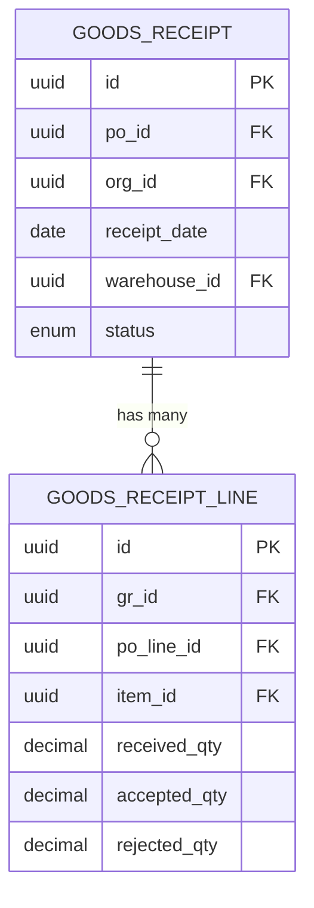

**Diagram sources**
- [database-material-inward-update.sql](file://src/database-material-inward-update.sql)

**Section sources**
- [database-material-inward-update.sql](file://src/database-material-inward-update.sql)

### Payment Processing Data Model
- Purpose: Manage invoices, payment terms, and disbursements linked to POs and receipts.
- Key fields: Invoice header (ID, PO link, vendor, amounts, due date), Payments (ID, invoice link, amount, method, date).
- Relationships: PO, vendor, invoice lines, payment methods, accounting entries.

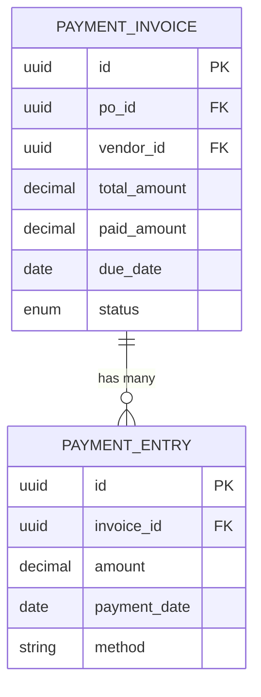

**Diagram sources**
- [database-po-payment-terms.sql](file://src/database-po-payment-terms.sql)

**Section sources**
- [database-po-payment-terms.sql](file://src/database-po-payment-terms.sql)

### Vendor Management Integration
- Vendor Master: Stores contact info, categories, tax IDs, bank details, and compliance flags.
- Performance Metrics: On-time delivery %, acceptance rate, defect ratio, lead time variance.
- Contract Management: Agreements with validity periods, pricing schedules, SLAs, and renewal alerts.
- Price History: Historical rates per vendor/item with effective dates and currency.

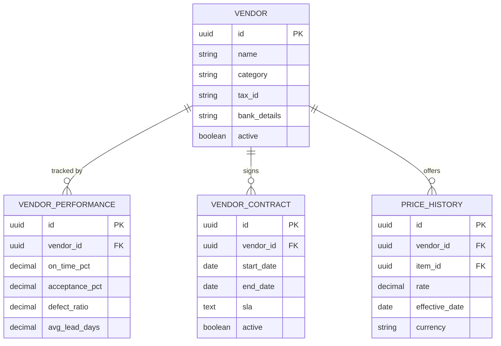

**Diagram sources**
- [database-purchase-module.sql](file://src/database-purchase-module.sql)
- [database-purchase-enhancements-v2.sql](file://src/database-purchase-enhancements-v2.sql)

**Section sources**
- [database-purchase-module.sql](file://src/database-purchase-module.sql)
- [database-purchase-enhancements-v2.sql](file://src/database-purchase-enhancements-v2.sql)

### Approval Workflows, Budget Controls, and Compliance Checks
- Approval Workflows: Multi-step approvals based on thresholds, roles, and policies; supports conditional routing and escalations.
- Budget Controls: Pre-approval validation against budgets; reservation of funds upon approval; post-approval reconciliation.
- Compliance Checks: Tax rule validation, vendor eligibility verification, policy constraint enforcement, audit logging.

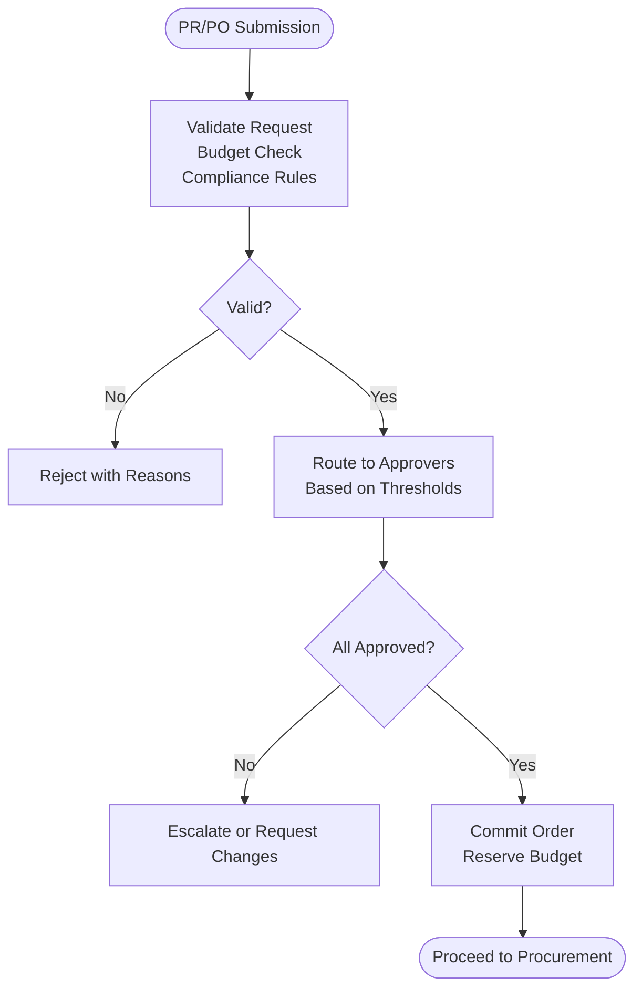

**Diagram sources**
- [database-purchase-enhancements-v2.sql](file://src/database-purchase-enhancements-v2.sql)

**Section sources**
- [database-purchase-enhancements-v2.sql](file://src/database-purchase-enhancements-v2.sql)

### Material Requisition-to-Order Conversion
- Conversion Logic: Maps PR lines to PO lines with validated quantities, pricing, and vendor selection.
- Validation: Checks item availability, vendor eligibility, and policy constraints before conversion.
- Outcome: Creates PO with linked PR references for traceability.

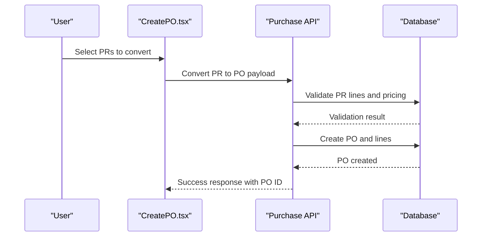

**Diagram sources**
- [CreatePO.tsx](file://src/pages/CreatePO.tsx)
- [modules/Purchase/api.ts](file://src/modules/Purchase/api.ts)
- [database-purchase-module.sql](file://src/database-purchase-module.sql)

**Section sources**
- [CreatePO.tsx](file://src/pages/CreatePO.tsx)
- [modules/Purchase/api.ts](file://src/modules/Purchase/api.ts)
- [database-purchase-module.sql](file://src/database-purchase-module.sql)

### Backorder Handling
- Partial Fulfillment: Allows receiving less than ordered with remaining quantities marked as backordered.
- Rescheduling: Updates expected delivery dates and notifies stakeholders.
- Status Tracking: Tracks backorder status across PO lines and receipts.

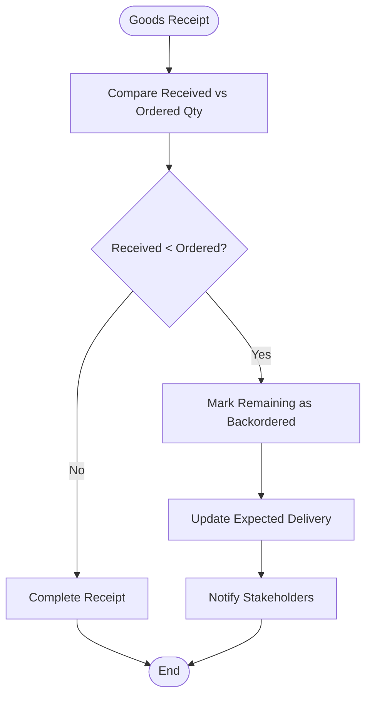

**Diagram sources**
- [MaterialInward.tsx](file://src/pages/MaterialInward.tsx)
- [ReceiveMaterial.tsx](file://src/pages/ReceiveMaterial.tsx)
- [database-material-inward-update.sql](file://src/database-material-inward-update.sql)

**Section sources**
- [MaterialInward.tsx](file://src/pages/MaterialInward.tsx)
- [ReceiveMaterial.tsx](file://src/pages/ReceiveMaterial.tsx)
- [database-material-inward-update.sql](file://src/database-material-inward-update.sql)

### Drop Shipment Scenarios
- Direct Vendor-to-Customer: Bypasses warehouse receipt; links PO directly to customer delivery.
- Documentation: Generates delivery challans and invoices aligned with drop shipment flow.
- Tracking: Monitors vendor dispatch and customer receipt status.

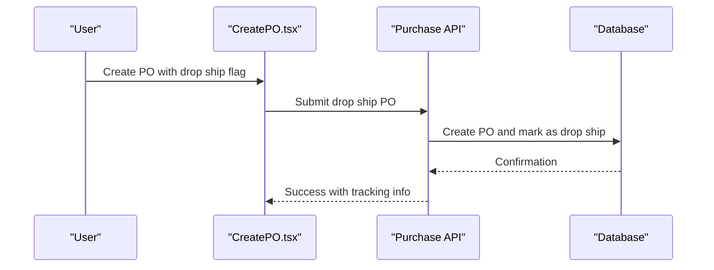

**Diagram sources**
- [CreatePO.tsx](file://src/pages/CreatePO.tsx)
- [modules/Purchase/api.ts](file://src/modules/Purchase/api.ts)
- [database-purchase-module.sql](file://src/database-purchase-module.sql)

**Section sources**
- [CreatePO.tsx](file://src/pages/CreatePO.tsx)
- [modules/Purchase/api.ts](file://src/modules/Purchase/api.ts)
- [database-purchase-module.sql](file://src/database-purchase-module.sql)

### End-to-End Procurement Cycle Example
- Steps: PR creation → Approval → PO issuance → Goods receipt → Invoice matching → Payment → Closure.
- Integrations: Inventory updates on receipt; accounting entries on payment; vendor performance updates.

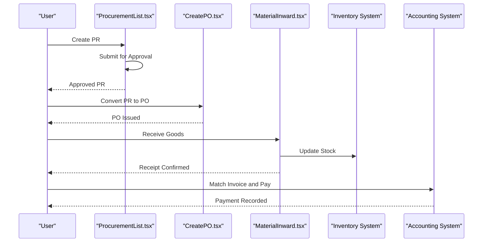

**Diagram sources**
- [ProcurementList.tsx](file://src/pages/ProcurementList.tsx)
- [CreatePO.tsx](file://src/pages/CreatePO.tsx)
- [MaterialInward.tsx](file://src/pages/MaterialInward.tsx)
- [database-purchase-module.sql](file://src/database-purchase-module.sql)

**Section sources**
- [ProcurementList.tsx](file://src/pages/ProcurementList.tsx)
- [CreatePO.tsx](file://src/pages/CreatePO.tsx)
- [MaterialInward.tsx](file://src/pages/MaterialInward.tsx)
- [database-purchase-module.sql](file://src/database-purchase-module.sql)

### Exception Handling
- Common Exceptions: Invalid vendor, insufficient budget, compliance failures, partial receipts discrepancies.
- Handling Strategy: Clear error messages, rollback on failure, audit logs, and escalation paths.
- Recovery: Retry mechanisms, manual overrides with approvals, and corrective actions.

**Section sources**
- [database-purchase-enhancements-v2.sql](file://src/database-purchase-enhancements-v2.sql)

### Integration with Inventory and Accounting Systems
- Inventory: Goods receipt triggers stock updates; reservations and allocations are enforced.
- Accounting: Payment entries create ledger postings; tax calculations align with accounting standards.
- Sync: Real-time synchronization ensures consistency across systems.

**Section sources**
- [database-material-inward-update.sql](file://src/database-material-inward-update.sql)
- [database-po-payment-terms.sql](file://src/database-po-payment-terms.sql)

### Vendor Performance Tracking, Contract Management, and Procurement Analytics
- Vendor Performance: Metrics computed from receipts, defects, and delivery times; dashboards for trends.
- Contract Management: Centralized agreements with alerts for renewals and compliance.
- Analytics: Spend analysis, vendor comparison, and forecast models using price history and PO data.

**Section sources**
- [database-purchase-module.sql](file://src/database-purchase-module.sql)
- [database-purchase-enhancements-v2.sql](file://src/database-purchase-enhancements-v2.sql)

## Dependency Analysis
The procurement module depends on UI pages for user interaction, hooks for data access, and database migrations for schema definition. The Supabase client centralizes data persistence.

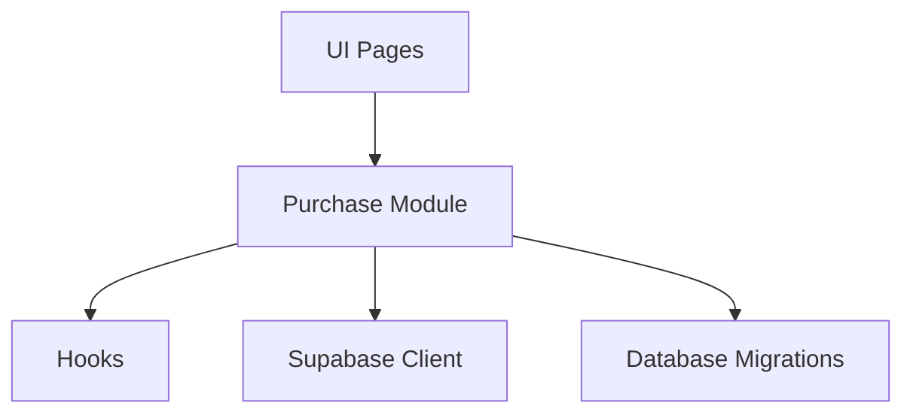

**Diagram sources**
- [modules/Purchase/index.tsx](file://src/modules/Purchase/index.tsx)
- [modules/Purchase/api.ts](file://src/modules/Purchase/api.ts)
- [modules/Purchase/types.ts](file://src/modules/Purchase/types.ts)
- [useMaterials.ts](file://src/hooks/useMaterials.ts)
- [useWarehouses.ts](file://src/hooks/useWarehouses.ts)
- [lib/supabase.ts](file://src/lib/supabase.ts)
- [database-purchase-module.sql](file://src/database-purchase-module.sql)

**Section sources**
- [modules/Purchase/index.tsx](file://src/modules/Purchase/index.tsx)
- [modules/Purchase/api.ts](file://src/modules/Purchase/api.ts)
- [modules/Purchase/types.ts](file://src/modules/Purchase/types.ts)
- [useMaterials.ts](file://src/hooks/useMaterials.ts)
- [useWarehouses.ts](file://src/hooks/useWarehouses.ts)
- [lib/supabase.ts](file://src/lib/supabase.ts)
- [database-purchase-module.sql](file://src/database-purchase-module.sql)

## Performance Considerations
- Query Optimization: Indexes on frequently queried fields (vendor_id, item_id, po_id).
- Pagination: Implement pagination for large lists (POs, receipts).
- Caching: Cache vendor and item master data to reduce load.
- Batch Operations: Use batch inserts for bulk PR/PO conversions.
- Async Processing: Offload heavy tasks (analytics, reports) to background jobs.

[No sources needed since this section provides general guidance]

## Troubleshooting Guide
- Common Issues:
  - Approval failures: Check thresholds and role assignments.
  - Budget errors: Verify budget limits and fund reservations.
  - Receipt mismatches: Compare PO lines with received quantities.
  - Payment delays: Confirm invoice matching and due dates.
- Debugging Steps:
  - Review audit logs for transaction history.
  - Validate vendor eligibility and tax settings.
  - Inspect database constraints and foreign key relationships.
- Resolution Strategies:
  - Correct invalid data and retry operations.
  - Escalate approvals with proper authorization.
  - Reconcile inventory and accounting discrepancies.

**Section sources**
- [database-purchase-enhancements-v2.sql](file://src/database-purchase-enhancements-v2.sql)
- [database-purchase-module.sql](file://src/database-purchase-module.sql)

## Conclusion
The procurement and purchase workflow system provides a robust framework for managing end-to-end procurement processes. With well-defined data models, approval workflows, and integrations, it supports efficient vendor management, price tracking, and compliance. The modular architecture ensures scalability and maintainability, while performance optimizations and troubleshooting guides enhance operational reliability.

[No sources needed since this section summarizes without analyzing specific files]

## Appendices
- Glossary: Definitions of key terms (PR, PO, GR, AP, etc.).
- Migration Scripts: References to SQL files for schema setup and updates.
- API Endpoints: List of endpoints used by the Purchase module.

[No sources needed since this section provides general guidance]