# Purchase Orders

<cite>
**Referenced Files in This Document**
- [CreatePO.tsx](file://src/pages/CreatePO.tsx)
- [POList.tsx](file://src/pages/POList.tsx)
- [PODetails.tsx](file://src/pages/PODetails.tsx)
- [modules/Purchase/index.ts](file://src/modules/Purchase/index.ts)
- [modules/Purchase/api.ts](file://src/modules/Purchase/api.ts)
- [modules/Purchase/types.ts](file://src/modules/Purchase/types.ts)
- [database-purchase-module.sql](file://src/database-purchase-module.sql)
- [database-purchase-enhancements-v2.sql](file://src/database-purchase-enhancements-v2.sql)
- [database-po-payment-terms.sql](file://src/database-po-payment-terms.sql)
- [database-update-po-utilized.sql](file://src/database-update-po-utilized.sql)
- [fix-po-line-items-gst-column.sql](file://src/fix-po-line-items-gst-column.sql)
- [migrate_create_po.cjs](file://migrate_create_po.cjs)
- [migrate_ui.cjs](file://migrate_ui.cjs)
- [migrate_vendor.cjs](file://migrate_vendor.cjs)
</cite>

## Table of Contents
1. [Introduction](#introduction)
2. [Project Structure](#project-structure)
3. [Core Components](#core-components)
4. [Architecture Overview](#architecture-overview)
5. [Detailed Component Analysis](#detailed-component-analysis)
6. [Dependency Analysis](#dependency-analysis)
7. [Performance Considerations](#performance-considerations)
8. [Troubleshooting Guide](#troubleshooting-guide)
9. [Conclusion](#conclusion)
10. [Appendices](#appendices)

## Introduction
This document provides a comprehensive data model and workflow guide for the Purchase Order (PO) management system. It explains how POs are created from requisitions, managed at line-item level, priced using vendor contracts, scheduled for delivery, tracked by quantity, approved via workflows, versioned and amended, and integrated with goods receipt and partial deliveries. The goal is to make the domain clear for both technical and non-technical readers while remaining grounded in the repository’s implementation.

## Project Structure
The PO feature spans UI pages, module APIs, types, database migrations, and migration scripts:
- UI pages: Create, list, and detail views for POs
- Module layer: API calls, type definitions, and module registration
- Database schema: Core tables, enhancements, payment terms, utilization tracking, and fixes
- Migration utilities: Scripts that bootstrap or update PO-related structures and UI scaffolding

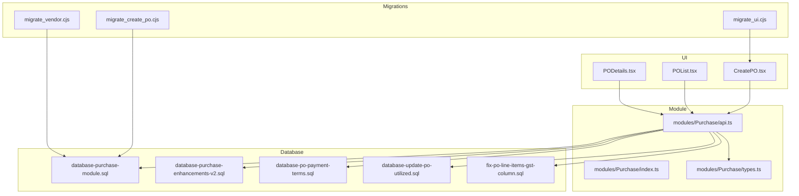

**Diagram sources**
- [CreatePO.tsx](file://src/pages/CreatePO.tsx)
- [POList.tsx](file://src/pages/POList.tsx)
- [PODetails.tsx](file://src/pages/PODetails.tsx)
- [modules/Purchase/index.ts](file://src/modules/Purchase/index.ts)
- [modules/Purchase/api.ts](file://src/modules/Purchase/api.ts)
- [modules/Purchase/types.ts](file://src/modules/Purchase/types.ts)
- [database-purchase-module.sql](file://src/database-purchase-module.sql)
- [database-purchase-enhancements-v2.sql](file://src/database-purchase-enhancements-v2.sql)
- [database-po-payment-terms.sql](file://src/database-po-payment-terms.sql)
- [database-update-po-utilized.sql](file://src/database-update-po-utilized.sql)
- [fix-po-line-items-gst-column.sql](file://src/fix-po-line-items-gst-column.sql)
- [migrate_create_po.cjs](file://migrate_create_po.cjs)
- [migrate_ui.cjs](file://migrate_ui.cjs)
- [migrate_vendor.cjs](file://migrate_vendor.cjs)

**Section sources**
- [CreatePO.tsx](file://src/pages/CreatePO.tsx)
- [POList.tsx](file://src/pages/POList.tsx)
- [PODetails.tsx](file://src/pages/PODetails.tsx)
- [modules/Purchase/index.ts](file://src/modules/Purchase/index.ts)
- [modules/Purchase/api.ts](file://src/modules/Purchase/api.ts)
- [modules/Purchase/types.ts](file://src/modules/Purchase/types.ts)
- [database-purchase-module.sql](file://src/database-purchase-module.sql)
- [database-purchase-enhancements-v2.sql](file://src/database-purchase-enhancements-v2.sql)
- [database-po-payment-terms.sql](file://src/database-po-payment-terms.sql)
- [database-update-po-utilized.sql](file://src/database-update-po-utilized.sql)
- [fix-po-line-items-gst-column.sql](file://src/fix-po-line-items-gst-column.sql)
- [migrate_create_po.cjs](file://migrate_create_po.cjs)
- [migrate_ui.cjs](file://migrate_ui.cjs)
- [migrate_vendor.cjs](file://migrate_vendor.cjs)

## Core Components
- PO Header: Identifies the order, vendor, project, dates, status, and totals.
- PO Line Items: Each item references an item master, vendor contract pricing, quantities, taxes, and delivery scheduling.
- Vendor Contracts: Pricing rules and terms associated with vendors and items.
- Delivery Scheduling: Planned delivery dates per line item and overall PO.
- Quantity Tracking: Ordered vs delivered vs received vs returned quantities.
- Approval Workflow: Multi-step approvals tied to PO creation and amendments.
- Versioning and Amendments: New versions when POs change; audit trail preserved.
- Goods Receipt Integration: Linking receipts to PO lines and updating utilization.

Key responsibilities:
- CreatePO.tsx orchestrates PO creation from requisitions and manages line items and pricing.
- POList.tsx lists POs with filters and actions.
- PODetails.tsx shows full PO context including approvals, amendments, and receipts.
- modules/Purchase/* encapsulates API interactions and shared types.
- SQL migrations define and evolve the data model.

**Section sources**
- [CreatePO.tsx](file://src/pages/CreatePO.tsx)
- [POList.tsx](file://src/pages/POList.tsx)
- [PODetails.tsx](file://src/pages/PODetails.tsx)
- [modules/Purchase/api.ts](file://src/modules/Purchase/api.ts)
- [modules/Purchase/types.ts](file://src/modules/Purchase/types.ts)
- [database-purchase-module.sql](file://src/database-purchase-module.sql)
- [database-purchase-enhancements-v2.sql](file://src/database-purchase-enhancements-v2.sql)
- [database-po-payment-terms.sql](file://src/database-po-payment-terms.sql)
- [database-update-po-utilized.sql](file://src/database-update-po-utilized.sql)
- [fix-po-line-items-gst-column.sql](file://src/fix-po-line-items-gst-column.sql)

## Architecture Overview
The PO subsystem follows a layered architecture:
- UI Layer: Pages render forms, lists, and details.
- Module Layer: API client functions call backend endpoints and manage state.
- Data Layer: Relational tables store PO headers, lines, contracts, schedules, and receipts.
- Migrations: Scripts initialize and evolve schemas and UI scaffolding.

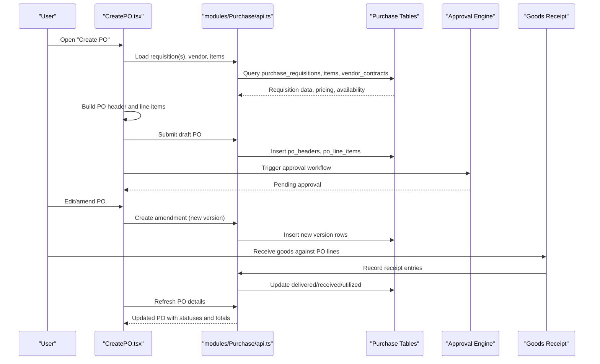

**Diagram sources**
- [CreatePO.tsx](file://src/pages/CreatePO.tsx)
- [modules/Purchase/api.ts](file://src/modules/Purchase/api.ts)
- [database-purchase-module.sql](file://src/database-purchase-module.sql)
- [database-purchase-enhancements-v2.sql](file://src/database-purchase-enhancements-v2.sql)
- [database-update-po-utilized.sql](file://src/database-update-po-utilized.sql)

## Detailed Component Analysis

### Data Model Entities
The following entities form the core of the PO system. Relationships reflect typical procurement flows: requisitions feed POs; POs have line items; line items reference vendor contracts for pricing; deliveries and receipts update quantities; approvals govern lifecycle transitions.

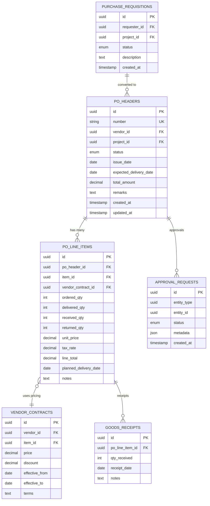

**Diagram sources**
- [database-purchase-module.sql](file://src/database-purchase-module.sql)
- [database-purchase-enhancements-v2.sql](file://src/database-purchase-enhancements-v2.sql)
- [database-po-payment-terms.sql](file://src/database-po-payment-terms.sql)
- [database-update-po-utilized.sql](file://src/database-update-po-utilized.sql)

**Section sources**
- [database-purchase-module.sql](file://src/database-purchase-module.sql)
- [database-purchase-enhancements-v2.sql](file://src/database-purchase-enhancements-v2.sql)
- [database-po-payment-terms.sql](file://src/database-po-payment-terms.sql)
- [database-update-po-utilized.sql](file://src/database-update-po-utilized.sql)

### PO Creation from Requisitions
- Entry point: CreatePO.tsx loads requisitions and prepopulates PO header and line items.
- Pricing: Line items pull prices from vendor contracts; discounts and taxes are applied.
- Validation: Required fields, available stock, and budget checks are enforced before submission.
- Submission: Draft PO is persisted; approval workflow is triggered.

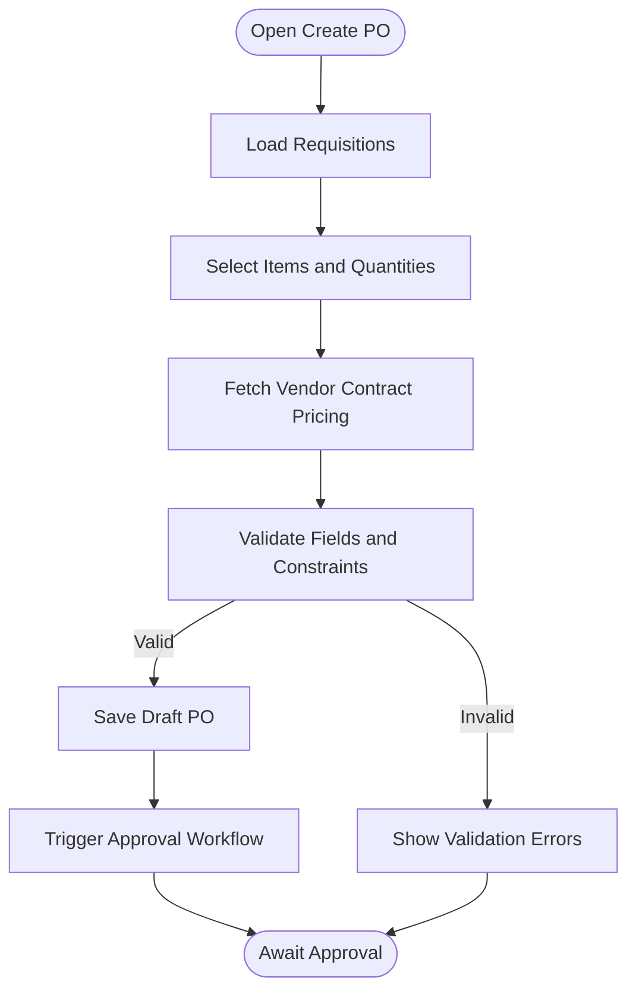

**Diagram sources**
- [CreatePO.tsx](file://src/pages/CreatePO.tsx)
- [modules/Purchase/api.ts](file://src/modules/Purchase/api.ts)
- [database-purchase-module.sql](file://src/database-purchase-module.sql)

**Section sources**
- [CreatePO.tsx](file://src/pages/CreatePO.tsx)
- [modules/Purchase/api.ts](file://src/modules/Purchase/api.ts)
- [database-purchase-module.sql](file://src/database-purchase-module.sql)

### Line Item Management and Pricing Calculations
- Line items track ordered, delivered, received, and returned quantities.
- Unit price sourced from vendor contracts; tax rate applied per line.
- Line total computed as (unit_price * ordered_qty) adjusted by discount and tax.
- Planned delivery date per line supports scheduling granularity.

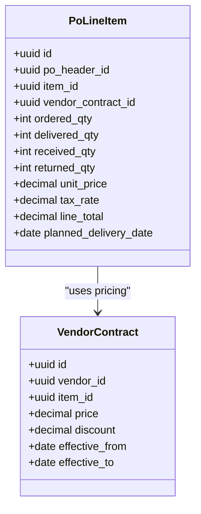

**Diagram sources**
- [database-purchase-module.sql](file://src/database-purchase-module.sql)
- [database-purchase-enhancements-v2.sql](file://src/database-purchase-enhancements-v2.sql)
- [fix-po-line-items-gst-column.sql](file://src/fix-po-line-items-gst-column.sql)

**Section sources**
- [database-purchase-module.sql](file://src/database-purchase-module.sql)
- [database-purchase-enhancements-v2.sql](file://src/database-purchase-enhancements-v2.sql)
- [fix-po-line-items-gst-column.sql](file://src/fix-po-line-items-gst-column.sql)

### Vendor Contract Integration
- Vendor contracts bind items to vendors with pricing, discounts, and validity windows.
- When creating PO lines, the system selects the applicable contract based on vendor, item, and effective dates.
- Changes to contracts do not retroactively alter existing PO lines unless explicitly amended.

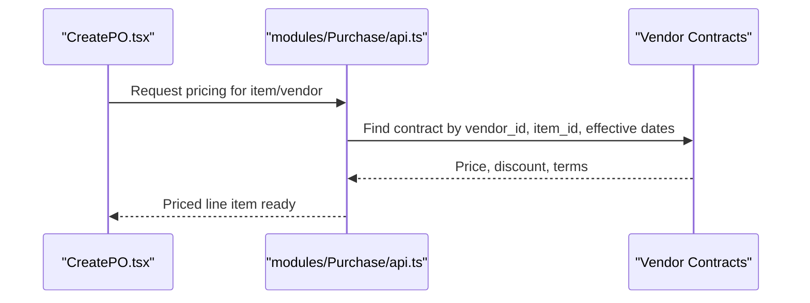

**Diagram sources**
- [modules/Purchase/api.ts](file://src/modules/Purchase/api.ts)
- [database-purchase-module.sql](file://src/database-purchase-module.sql)
- [migrate_vendor.cjs](file://migrate_vendor.cjs)

**Section sources**
- [modules/Purchase/api.ts](file://src/modules/Purchase/api.ts)
- [database-purchase-module.sql](file://src/database-purchase-module.sql)
- [migrate_vendor.cjs](file://migrate_vendor.cjs)

### Delivery Scheduling and Quantity Tracking
- Planned delivery dates per line item enable granular scheduling.
- Delivered and received quantities are updated upon goods receipt.
- Utilization metrics reflect how much of the ordered quantity has been fulfilled.

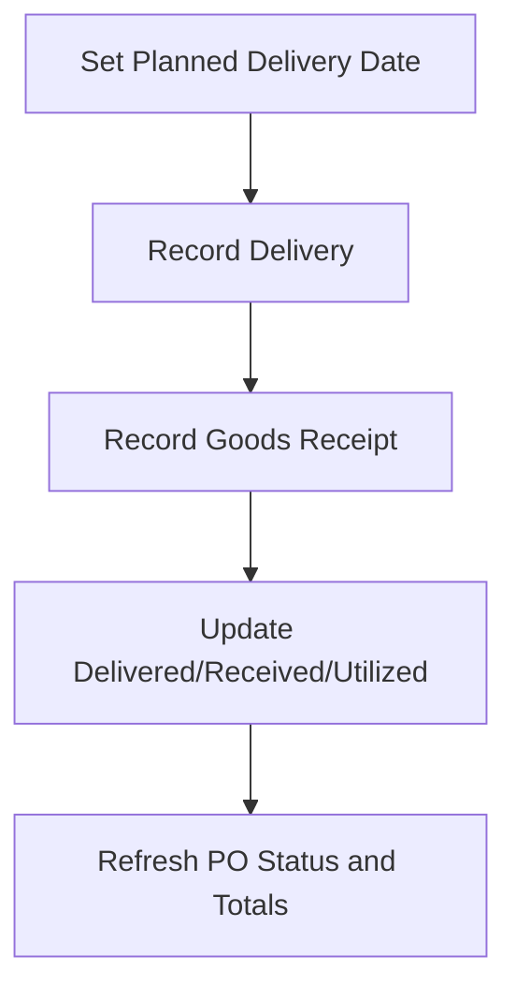

**Diagram sources**
- [database-purchase-module.sql](file://src/database-purchase-module.sql)
- [database-update-po-utilized.sql](file://src/database-update-po-utilized.sql)

**Section sources**
- [database-purchase-module.sql](file://src/database-purchase-module.sql)
- [database-update-po-utilized.sql](file://src/database-update-po-utilized.sql)

### PO Approval Workflows
- Upon submission, an approval request is created for the PO.
- Approvers review and act (approve/deny); status updates propagate to the PO header.
- Amendments trigger new approval requests tied to the new version.

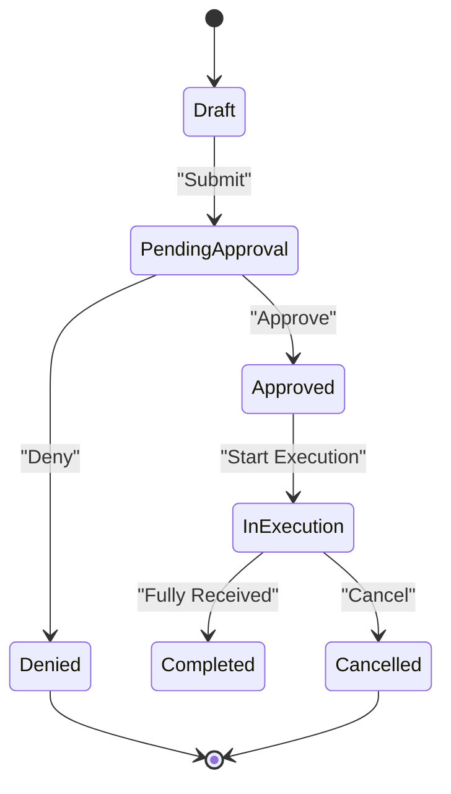

**Diagram sources**
- [PODetails.tsx](file://src/pages/PODetails.tsx)
- [database-purchase-module.sql](file://src/database-purchase-module.sql)

**Section sources**
- [PODetails.tsx](file://src/pages/PODetails.tsx)
- [database-purchase-module.sql](file://src/database-purchase-module.sql)

### Version Control and Amendment Processes
- Amendments create new versions of POs, preserving history.
- UI surfaces version differences and requires re-approval for significant changes.
- Audit trails capture who changed what and when.

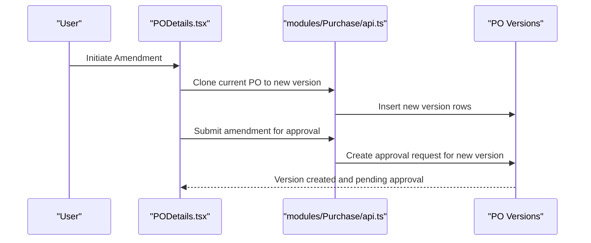

**Diagram sources**
- [PODetails.tsx](file://src/pages/PODetails.tsx)
- [modules/Purchase/api.ts](file://src/modules/Purchase/api.ts)
- [database-purchase-enhancements-v2.sql](file://src/database-purchase-enhancements-v2.sql)

**Section sources**
- [PODetails.tsx](file://src/pages/PODetails.tsx)
- [modules/Purchase/api.ts](file://src/modules/Purchase/api.ts)
- [database-purchase-enhancements-v2.sql](file://src/database-purchase-enhancements-v2.sql)

### Complete PO Lifecycle Example
- Create from requisition, add line items, set delivery dates, submit for approval.
- After approval, execute orders and receive goods partially or fully.
- Close PO once all lines are received or cancel if needed.

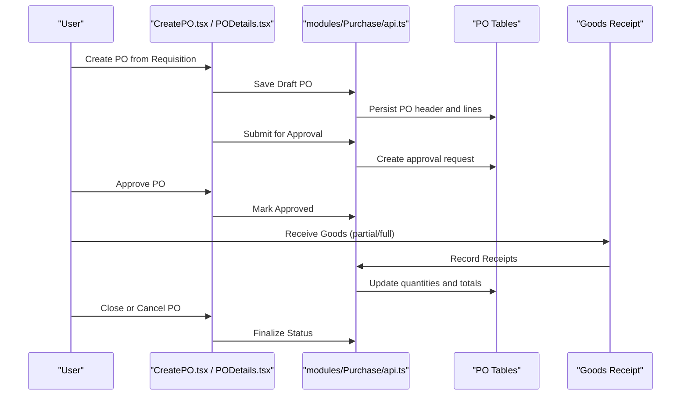

**Diagram sources**
- [CreatePO.tsx](file://src/pages/CreatePO.tsx)
- [PODetails.tsx](file://src/pages/PODetails.tsx)
- [modules/Purchase/api.ts](file://src/modules/Purchase/api.ts)
- [database-purchase-module.sql](file://src/database-purchase-module.sql)

**Section sources**
- [CreatePO.tsx](file://src/pages/CreatePO.tsx)
- [PODetails.tsx](file://src/pages/PODetails.tsx)
- [modules/Purchase/api.ts](file://src/modules/Purchase/api.ts)
- [database-purchase-module.sql](file://src/database-purchase-module.sql)

### Partial Deliveries and Cancellation Handling
- Partial deliveries increment delivered/received quantities without closing the PO.
- Cancellation halts further deliveries and may require approval depending on policy.
- Returned quantities adjust net received totals and can trigger credit processes.

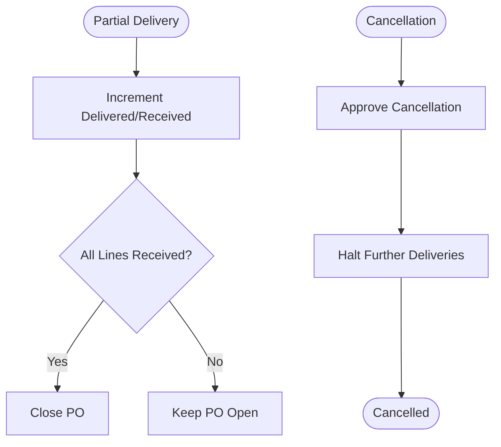

**Diagram sources**
- [database-update-po-utilized.sql](file://src/database-update-po-utilized.sql)
- [database-purchase-module.sql](file://src/database-purchase-module.sql)

**Section sources**
- [database-update-po-utilized.sql](file://src/database-update-po-utilized.sql)
- [database-purchase-module.sql](file://src/database-purchase-module.sql)

### PO Status Tracking, Delivery Confirmations, and Goods Receipt Integration
- Status reflects lifecycle stage (draft, pending approval, approved, in execution, completed, cancelled).
- Delivery confirmations update planned vs actual delivery metrics.
- Goods receipt integration ensures accurate inventory and financial postings.

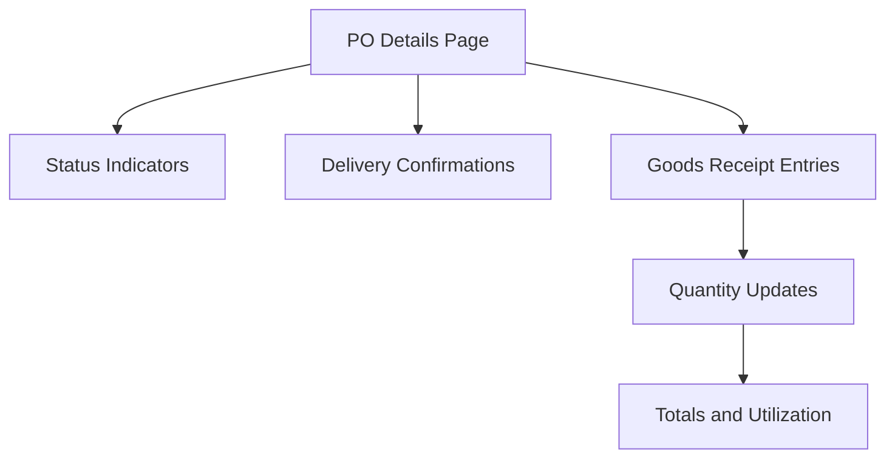

**Diagram sources**
- [PODetails.tsx](file://src/pages/PODetails.tsx)
- [database-purchase-module.sql](file://src/database-purchase-module.sql)
- [database-update-po-utilized.sql](file://src/database-update-po-utilized.sql)

**Section sources**
- [PODetails.tsx](file://src/pages/PODetails.tsx)
- [database-purchase-module.sql](file://src/database-purchase-module.sql)
- [database-update-po-utilized.sql](file://src/database-update-po-utilized.sql)

## Dependency Analysis
- UI components depend on module API functions for data operations.
- Module API depends on database tables defined by migrations.
- Migrations introduce schema changes and seed data necessary for features.

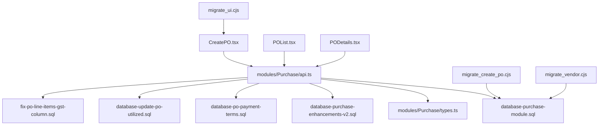

**Diagram sources**
- [CreatePO.tsx](file://src/pages/CreatePO.tsx)
- [POList.tsx](file://src/pages/POList.tsx)
- [PODetails.tsx](file://src/pages/PODetails.tsx)
- [modules/Purchase/api.ts](file://src/modules/Purchase/api.ts)
- [modules/Purchase/types.ts](file://src/modules/Purchase/types.ts)
- [database-purchase-module.sql](file://src/database-purchase-module.sql)
- [database-purchase-enhancements-v2.sql](file://src/database-purchase-enhancements-v2.sql)
- [database-po-payment-terms.sql](file://src/database-po-payment-terms.sql)
- [database-update-po-utilized.sql](file://src/database-update-po-utilized.sql)
- [fix-po-line-items-gst-column.sql](file://src/fix-po-line-items-gst-column.sql)
- [migrate_create_po.cjs](file://migrate_create_po.cjs)
- [migrate_ui.cjs](file://migrate_ui.cjs)
- [migrate_vendor.cjs](file://migrate_vendor.cjs)

**Section sources**
- [modules/Purchase/api.ts](file://src/modules/Purchase/api.ts)
- [modules/Purchase/types.ts](file://src/modules/Purchase/types.ts)
- [database-purchase-module.sql](file://src/database-purchase-module.sql)
- [database-purchase-enhancements-v2.sql](file://src/database-purchase-enhancements-v2.sql)
- [database-po-payment-terms.sql](file://src/database-po-payment-terms.sql)
- [database-update-po-utilized.sql](file://src/database-update-po-utilized.sql)
- [fix-po-line-items-gst-column.sql](file://src/fix-po-line-items-gst-column.sql)
- [migrate_create_po.cjs](file://migrate_create_po.cjs)
- [migrate_ui.cjs](file://migrate_ui.cjs)
- [migrate_vendor.cjs](file://migrate_vendor.cjs)

## Performance Considerations
- Batch load requisitions and vendor contracts to reduce round trips.
- Cache frequently accessed vendor contracts keyed by vendor and item.
- Paginate PO lists and use selective field queries for large datasets.
- Defer heavy calculations (totals, taxes) until necessary and cache results.
- Optimize indexes on foreign keys (vendor_id, item_id, po_header_id) and status columns.

[No sources needed since this section provides general guidance]

## Troubleshooting Guide
Common issues and resolutions:
- Missing vendor contract pricing: Ensure effective dates cover the PO date and that the vendor-item mapping exists.
- Incorrect tax rates: Verify GST column presence and values in line items; apply fix migration if needed.
- Approval stuck: Check approval request status and metadata; ensure approver permissions and workflow rules are configured.
- Quantity mismatches: Review goods receipt entries and delivered/received counts; reconcile with PO lines.

**Section sources**
- [fix-po-line-items-gst-column.sql](file://src/fix-po-line-items-gst-column.sql)
- [database-purchase-module.sql](file://src/database-purchase-module.sql)
- [database-update-po-utilized.sql](file://src/database-update-po-utilized.sql)

## Conclusion
The PO management system integrates requisitions, vendor contracts, line-item pricing, delivery scheduling, approvals, versioning, and goods receipt into a cohesive workflow. The data model emphasizes traceability and accuracy through explicit quantity tracking and version control. By adhering to the documented processes and leveraging the provided diagrams, teams can implement consistent purchasing practices and maintain reliable financial and inventory records.

[No sources needed since this section summarizes without analyzing specific files]

## Appendices
- Migration utilities:
  - migrate_create_po.cjs: Bootstraps PO creation logic and related structures.
  - migrate_ui.cjs: Initializes UI scaffolding for PO pages.
  - migrate_vendor.cjs: Sets up vendor contract mappings and defaults.

**Section sources**
- [migrate_create_po.cjs](file://migrate_create_po.cjs)
- [migrate_ui.cjs](file://migrate_ui.cjs)
- [migrate_vendor.cjs](file://migrate_vendor.cjs)