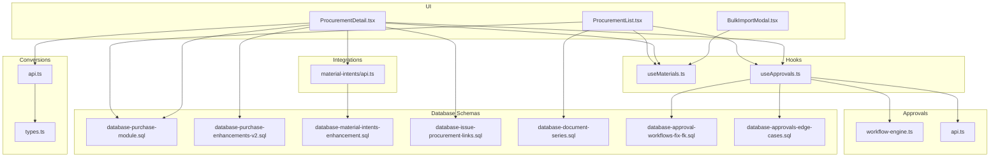
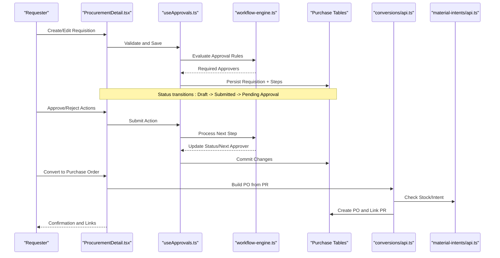
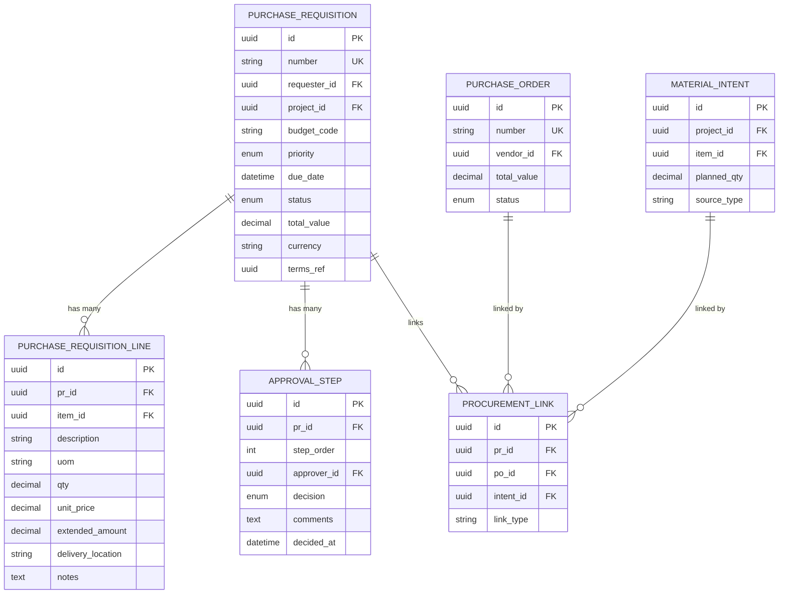
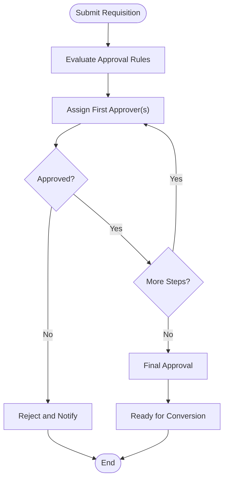
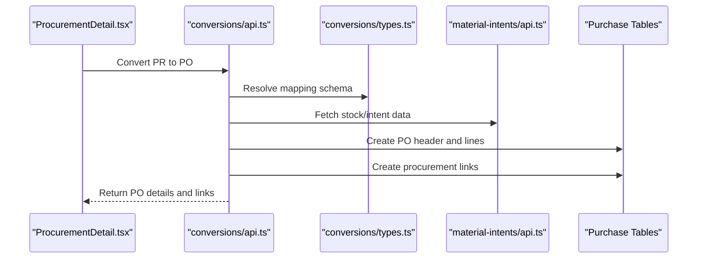
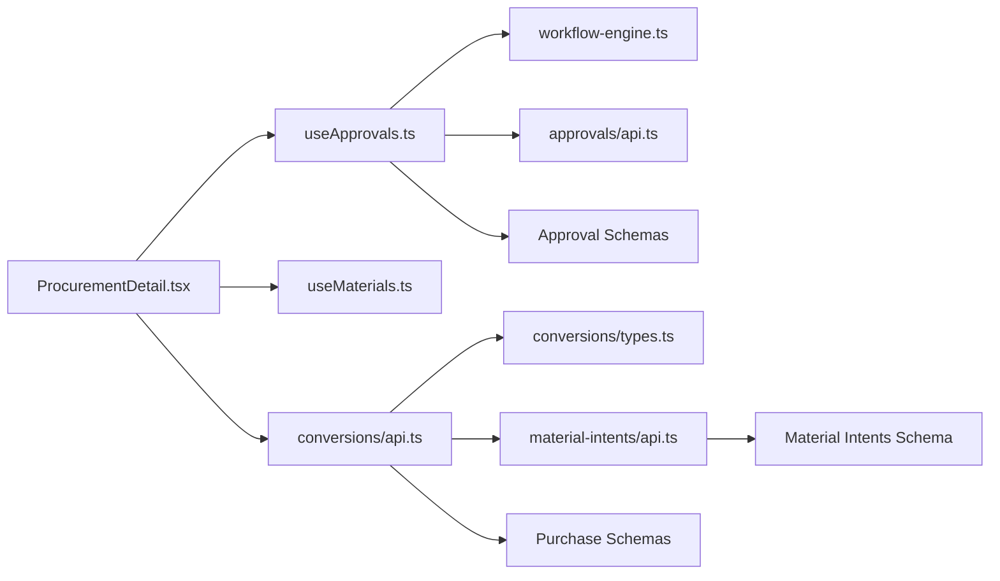
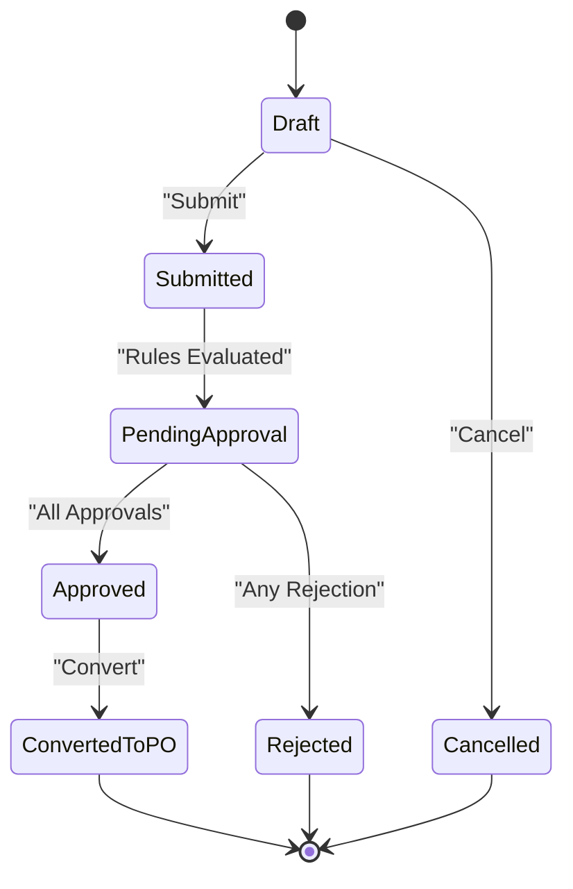
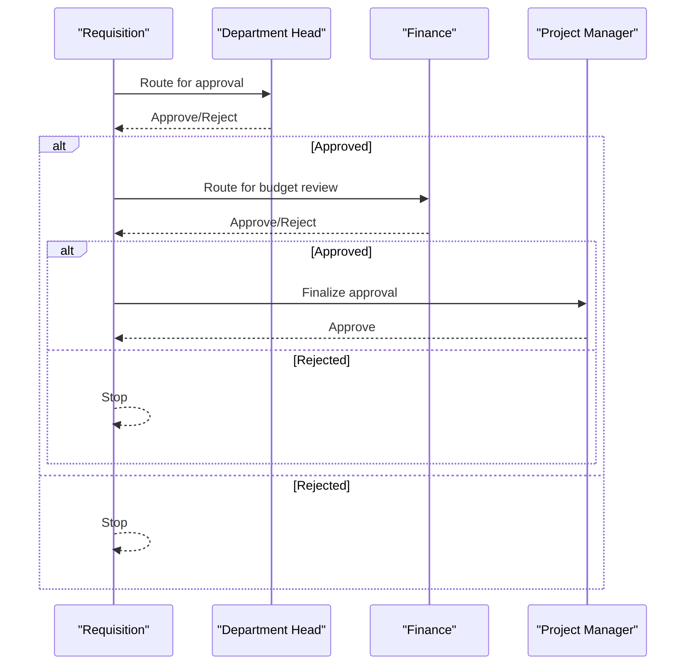

# Purchase Requisitions

<cite>
**Referenced Files in This Document**
- [modules/Purchase](file://src/modules/Purchase)
- [purchase-requisitions](file://src/purchase-requisitions)
- [database-purchase-module.sql](file://src/database-purchase-module.sql)
- [database-purchase-enhancements-v2.sql](file://src/database-purchase-enhancements-v2.sql)
- [database-material-intents-enhancement.sql](file://src/database-material-intents-enhancement.sql)
- [database-issue-procurement-links.sql](file://src/database-issue-procurement-links.sql)
- [database-document-series.sql](file://src/database-document-series.sql)
- [database-approval-workflows-fix-fk.sql](file://src/database-approval-workflows-fix-fk.sql)
- [database-approvals-edge-cases.sql](file://src/database-approvals-edge-cases.sql)
- [database-terms-conditions-sample-data-fixed.sql](file://src/database-terms-conditions-sample-data-fixed.sql)
- [pages/ProcurementList.tsx](file://src/pages/ProcurementList.tsx)
- [pages/ProcurementDetail.tsx](file://src/pages/ProcurementDetail.tsx)
- [components/BulkImportModal.tsx](file://src/components/BulkImportModal.tsx)
- [hooks/useMaterials.ts](file://src/hooks/useMaterials.ts)
- [hooks/useApprovals.ts](file://src/hooks/useApprovals.ts)
- [approvals/workflow-engine.ts](file://src/approvals/workflow-engine.ts)
- [approvals/api.ts](file://src/approvals/api.ts)
- [conversions/types.ts](file://src/conversions/types.ts)
- [conversions/api.ts](file://src/conversions/api.ts)
- [material-intents/api.ts](file://src/material-intents/api.ts)
</cite>

## Table of Contents
1. [Introduction](#introduction)
2. [Project Structure](#project-structure)
3. [Core Components](#core-components)
4. [Architecture Overview](#architecture-overview)
5. [Detailed Component Analysis](#detailed-component-analysis)
6. [Dependency Analysis](#dependency-analysis)
7. [Performance Considerations](#performance-considerations)
8. [Troubleshooting Guide](#troubleshooting-guide)
9. [Conclusion](#conclusion)
10. [Appendices](#appendices)

## Introduction
This document provides a comprehensive data model and workflow guide for the Purchase Requisition system. It explains how requisitions are created, approved, converted to purchase orders, validated against budgets, and integrated with inventory planning. It also covers vendor selection criteria, status tracking, priority handling, escalation procedures, templates, bulk requests, and emergency procurement scenarios.

## Project Structure
The purchase requisition feature spans UI pages, hooks, approval workflows, conversion utilities, and database schemas:
- UI and flows: Procurement list and detail pages
- Approval engine and API integration
- Conversion types and APIs for PR-to-PO
- Material intents and procurement links
- Database schemas defining core entities and relationships

**Diagram sources**
- [pages/ProcurementList.tsx](file://src/pages/ProcurementList.tsx)
- [pages/ProcurementDetail.tsx](file://src/pages/ProcurementDetail.tsx)
- [components/BulkImportModal.tsx](file://src/components/BulkImportModal.tsx)
- [hooks/useMaterials.ts](file://src/hooks/useMaterials.ts)
- [hooks/useApprovals.ts](file://src/hooks/useApprovals.ts)
- [approvals/workflow-engine.ts](file://src/approvals/workflow-engine.ts)
- [approvals/api.ts](file://src/approvals/api.ts)
- [conversions/types.ts](file://src/conversions/types.ts)
- [conversions/api.ts](file://src/conversions/api.ts)
- [material-intents/api.ts](file://src/material-intents/api.ts)
- [database-purchase-module.sql](file://src/database-purchase-module.sql)
- [database-purchase-enhancements-v2.sql](file://src/database-purchase-enhancements-v2.sql)
- [database-material-intents-enhancement.sql](file://src/database-material-intents-enhancement.sql)
- [database-issue-procurement-links.sql](file://src/database-issue-procurement-links.sql)
- [database-document-series.sql](file://src/database-document-series.sql)
- [database-approval-workflows-fix-fk.sql](file://src/database-approval-workflows-fix-fk.sql)
- [database-approvals-edge-cases.sql](file://src/database-approvals-edge-cases.sql)

**Section sources**
- [pages/ProcurementList.tsx](file://src/pages/ProcurementList.tsx)
- [pages/ProcurementDetail.tsx](file://src/pages/ProcurementDetail.tsx)
- [components/BulkImportModal.tsx](file://src/components/BulkImportModal.tsx)
- [hooks/useMaterials.ts](file://src/hooks/useMaterials.ts)
- [hooks/useApprovals.ts](file://src/hooks/useApprovals.ts)
- [approvals/workflow-engine.ts](file://src/approvals/workflow-engine.ts)
- [approvals/api.ts](file://src/approvals/api.ts)
- [conversions/types.ts](file://src/conversions/types.ts)
- [conversions/api.ts](file://src/conversions/api.ts)
- [material-intents/api.ts](file://src/material-intents/api.ts)
- [database-purchase-module.sql](file://src/database-purchase-module.sql)
- [database-purchase-enhancements-v2.sql](file://src/database-purchase-enhancements-v2.sql)
- [database-material-intents-enhancement.sql](file://src/database-material-intents-enhancement.sql)
- [database-issue-procurement-links.sql](file://src/database-issue-procurement-links.sql)
- [database-document-series.sql](file://src/database-document-series.sql)
- [database-approval-workflows-fix-fk.sql](file://src/database-approval-workflows-fix-fk.sql)
- [database-approvals-edge-cases.sql](file://src/database-approvals-edge-cases.sql)

## Core Components
- Requisition Header and Lines: Define requester, project, budget code, priority, due date, and line items (item, quantity, UoM, estimated cost).
- Approval Workflow: Multi-step approvals based on amount thresholds, department, or project rules; supports reviewer chains and escalations.
- Budget Validation: Pre-approval checks against budget codes and available balances; blocks creation or requires override.
- Vendor Selection: Preferred vendors per item/category, rate history, lead time, and compliance flags influence selection during PO conversion.
- Status Tracking: Draft, Submitted, Pending Approval, Approved, Rejected, Converted to PO, Cancelled.
- Priority Handling: Low, Normal, High, Urgent; affects SLA and escalation timing.
- Templates: Saved templates for recurring needs (e.g., consumables, safety gear).
- Bulk Requests: Import via spreadsheet to create multiple lines or full requisitions.
- Emergency Procurement: Fast-track path bypassing some steps with post-facto approvals.

Key implementation anchors:
- Data model and constraints: [database-purchase-module.sql](file://src/database-purchase-module.sql), [database-purchase-enhancements-v2.sql](file://src/database-purchase-enhancements-v2.sql)
- Approval orchestration: [approvals/workflow-engine.ts](file://src/approvals/workflow-engine.ts), [approvals/api.ts](file://src/approvals/api.ts), [hooks/useApprovals.ts](file://src/hooks/useApprovals.ts)
- Conversion logic: [conversions/types.ts](file://src/conversions/types.ts), [conversions/api.ts](file://src/conversions/api.ts)
- Inventory integration: [material-intents/api.ts](file://src/material-intents/api.ts), [database-material-intents-enhancement.sql](file://src/database-material-intents-enhancement.sql)
- Procurement links: [database-issue-procurement-links.sql](file://src/database-issue-procurement-links.sql)
- Document series: [database-document-series.sql](file://src/database-document-series.sql)

**Section sources**
- [database-purchase-module.sql](file://src/database-purchase-module.sql)
- [database-purchase-enhancements-v2.sql](file://src/database-purchase-enhancements-v2.sql)
- [approvals/workflow-engine.ts](file://src/approvals/workflow-engine.ts)
- [approvals/api.ts](file://src/approvals/api.ts)
- [hooks/useApprovals.ts](file://src/hooks/useApprovals.ts)
- [conversions/types.ts](file://src/conversions/types.ts)
- [conversions/api.ts](file://src/conversions/api.ts)
- [material-intents/api.ts](file://src/material-intents/api.ts)
- [database-material-intents-enhancement.sql](file://src/database-material-intents-enhancement.sql)
- [database-issue-procurement-links.sql](file://src/database-issue-procurement-links.sql)
- [database-document-series.sql](file://src/database-document-series.sql)

## Architecture Overview
End-to-end flow from creation to order conversion:

**Diagram sources**
- [pages/ProcurementDetail.tsx](file://src/pages/ProcurementDetail.tsx)
- [hooks/useApprovals.ts](file://src/hooks/useApprovals.ts)
- [approvals/workflow-engine.ts](file://src/approvals/workflow-engine.ts)
- [conversions/api.ts](file://src/conversions/api.ts)
- [material-intents/api.ts](file://src/material-intents/api.ts)
- [database-purchase-module.sql](file://src/database-purchase-module.sql)

## Detailed Component Analysis

### Data Model
Core entities and relationships:
- Requisition Header: ID, number (series-driven), requester, department, project, budget code, priority, due date, status, total value, currency, terms reference.
- Requisition Line Items: Item master link, description, UoM, qty, unit price, extended amount, tax info, delivery location, notes.
- Approvals: Step sequence, approver roles/users, decision, comments, timestamps.
- Conversions: PR-to-PO mapping, partial conversions, audit trail.
- Material Intents: Planned needs linked to projects/tasks; used for demand aggregation.
- Procurement Links: Cross-references between PRs, POs, material intents, and related issues.

**Diagram sources**
- [database-purchase-module.sql](file://src/database-purchase-module.sql)
- [database-purchase-enhancements-v2.sql](file://src/database-purchase-enhancements-v2.sql)
- [database-material-intents-enhancement.sql](file://src/database-material-intents-enhancement.sql)
- [database-issue-procurement-links.sql](file://src/database-issue-procurement-links.sql)

**Section sources**
- [database-purchase-module.sql](file://src/database-purchase-module.sql)
- [database-purchase-enhancements-v2.sql](file://src/database-purchase-enhancements-v2.sql)
- [database-material-intents-enhancement.sql](file://src/database-material-intents-enhancement.sql)
- [database-issue-procurement-links.sql](file://src/database-issue-procurement-links.sql)

### Requisition Creation and Validation
- Inputs: Requester, project, budget code, priority, due date, and one or more line items.
- Validation:
  - Mandatory fields and numeric checks.
  - Budget availability pre-check using budget code and current balances.
  - Duplicate detection across open PRs.
- Output: Draft saved locally; upon submission, triggers approval evaluation.

Implementation anchors:
- UI entry points: [pages/ProcurementDetail.tsx](file://src/pages/ProcurementDetail.tsx)
- Validation and persistence: [hooks/useApprovals.ts](file://src/hooks/useApprovals.ts)
- Approval rule evaluation: [approvals/workflow-engine.ts](file://src/approvals/workflow-engine.ts)

**Section sources**
- [pages/ProcurementDetail.tsx](file://src/pages/ProcurementDetail.tsx)
- [hooks/useApprovals.ts](file://src/hooks/useApprovals.ts)
- [approvals/workflow-engine.ts](file://src/approvals/workflow-engine.ts)

### Approval Workflows and Escalation
- Rule-based routing: Amount thresholds, department/project context determine required approvers.
- Step management: Sequential or parallel steps; decisions recorded with comments and timestamps.
- Escalation: Time-based escalation if no action taken; configurable fallback approvers.
- Edge cases: Delegation, reassignment, and conflict resolution handled by workflow engine.

**Diagram sources**
- [approvals/workflow-engine.ts](file://src/approvals/workflow-engine.ts)
- [database-approval-workflows-fix-fk.sql](file://src/database-approval-workflows-fix-fk.sql)
- [database-approvals-edge-cases.sql](file://src/database-approvals-edge-cases.sql)

**Section sources**
- [approvals/workflow-engine.ts](file://src/approvals/workflow-engine.ts)
- [approvals/api.ts](file://src/approvals/api.ts)
- [hooks/useApprovals.ts](file://src/hooks/useApprovals.ts)
- [database-approval-workflows-fix-fk.sql](file://src/database-approval-workflows-fix-fk.sql)
- [database-approvals-edge-cases.sql](file://src/database-approvals-edge-cases.sql)

### Requisition-to-Order Conversion Logic
- Mapping: Each PR line maps to PO line; quantities can be partially converted.
- Vendor selection: Uses preferred vendor per item/category, historical rates, lead times, and compliance flags.
- Pricing: Pulls last quoted rates or catalog prices; allows manual overrides with justification.
- Audit: Conversion creates links between PR and PO; preserves original values and changes.

**Diagram sources**
- [pages/ProcurementDetail.tsx](file://src/pages/ProcurementDetail.tsx)
- [conversions/types.ts](file://src/conversions/types.ts)
- [conversions/api.ts](file://src/conversions/api.ts)
- [material-intents/api.ts](file://src/material-intents/api.ts)
- [database-issue-procurement-links.sql](file://src/database-issue-procurement-links.sql)

**Section sources**
- [conversions/types.ts](file://src/conversions/types.ts)
- [conversions/api.ts](file://src/conversions/api.ts)
- [material-intents/api.ts](file://src/material-intents/api.ts)
- [database-issue-procurement-links.sql](file://src/database-issue-procurement-links.sql)

### Budget Validation
- Checks budget code validity and remaining balance before approval.
- Blocks conversion if insufficient funds unless overridden by authorized role.
- Records validation results and reasons for overrides.

Implementation anchors:
- Validation hooks: [hooks/useApprovals.ts](file://src/hooks/useApprovals.ts)
- Schema references: [database-purchase-module.sql](file://src/database-purchase-module.sql)

**Section sources**
- [hooks/useApprovals.ts](file://src/hooks/useApprovals.ts)
- [database-purchase-module.sql](file://src/database-purchase-module.sql)

### Vendor Selection Criteria
- Preferred vendor per item/category.
- Historical performance: on-time delivery, quality ratings.
- Compliance flags: certifications, blacklist status.
- Cost competitiveness: last quoted rates vs market benchmarks.

Implementation anchors:
- Conversion logic: [conversions/api.ts](file://src/conversions/api.ts)
- Types and mappings: [conversions/types.ts](file://src/conversions/types.ts)

**Section sources**
- [conversions/api.ts](file://src/conversions/api.ts)
- [conversions/types.ts](file://src/conversions/types.ts)

### Status Tracking and Priority Handling
- Statuses: Draft, Submitted, Pending Approval, Approved, Rejected, Converted to PO, Cancelled.
- Priorities: Low, Normal, High, Urgent; influences SLA timers and escalation.
- Visibility: List and detail views show current status, next actions, and approver chain.

Implementation anchors:
- List view: [pages/ProcurementList.tsx](file://src/pages/ProcurementList.tsx)
- Detail view: [pages/ProcurementDetail.tsx](file://src/pages/ProcurementDetail.tsx)
- Status transitions: [approvals/workflow-engine.ts](file://src/approvals/workflow-engine.ts)

**Section sources**
- [pages/ProcurementList.tsx](file://src/pages/ProcurementList.tsx)
- [pages/ProcurementDetail.tsx](file://src/pages/ProcurementDetail.tsx)
- [approvals/workflow-engine.ts](file://src/approvals/workflow-engine.ts)

### Requisition Templates
- Saved templates for recurring needs (consumables, safety gear).
- Template population: Pre-fills items, quantities, default vendors, and budget codes.
- Versioning: Track template revisions and effective dates.

Implementation anchors:
- UI interactions: [pages/ProcurementDetail.tsx](file://src/pages/ProcurementDetail.tsx)
- Terms and conditions references: [database-terms-conditions-sample-data-fixed.sql](file://src/database-terms-conditions-sample-data-fixed.sql)

**Section sources**
- [pages/ProcurementDetail.tsx](file://src/pages/ProcurementDetail.tsx)
- [database-terms-conditions-sample-data-fixed.sql](file://src/database-terms-conditions-sample-data-fixed.sql)

### Bulk Requests
- Spreadsheet import to create multiple line items or full requisitions.
- Validation feedback: Row-level errors and suggestions.
- Preview and confirm before commit.

Implementation anchors:
- Import modal: [components/BulkImportModal.tsx](file://src/components/BulkImportModal.tsx)
- Materials data access: [hooks/useMaterials.ts](file://src/hooks/useMaterials.ts)

**Section sources**
- [components/BulkImportModal.tsx](file://src/components/BulkImportModal.tsx)
- [hooks/useMaterials.ts](file://src/hooks/useMaterials.ts)

### Emergency Procurement Scenarios
- Fast-track path: Bypass certain approval steps with post-facto review.
- Risk controls: Require justification, higher authority sign-off, and audit logging.
- Integration: Still links to material intents and budget codes for traceability.

Implementation anchors:
- Approval edge cases: [database-approvals-edge-cases.sql](file://src/database-approvals-edge-cases.sql)
- Workflow engine: [approvals/workflow-engine.ts](file://src/approvals/workflow-engine.ts)

**Section sources**
- [database-approvals-edge-cases.sql](file://src/database-approvals-edge-cases.sql)
- [approvals/workflow-engine.ts](file://src/approvals/workflow-engine.ts)

### Integration with Inventory Planning
- Material intents capture planned needs at project/task level.
- PRs aggregate demand; conversion considers existing stock and pending receipts.
- Procurement links connect PRs, POs, and intents for end-to-end visibility.

Implementation anchors:
- Intent API: [material-intents/api.ts](file://src/material-intents/api.ts)
- Enhancement schema: [database-material-intents-enhancement.sql](file://src/database-material-intents-enhancement.sql)
- Procurement links: [database-issue-procurement-links.sql](file://src/database-issue-procurement-links.sql)

**Section sources**
- [material-intents/api.ts](file://src/material-intents/api.ts)
- [database-material-intents-enhancement.sql](file://src/database-material-intents-enhancement.sql)
- [database-issue-procurement-links.sql](file://src/database-issue-procurement-links.sql)

## Dependency Analysis
Inter-module dependencies and coupling:
- UI depends on hooks for state and actions.
- Hooks depend on approval workflow engine and API.
- Conversion module depends on types and material intents.
- Database schemas define contracts enforced by all layers.

**Diagram sources**
- [pages/ProcurementDetail.tsx](file://src/pages/ProcurementDetail.tsx)
- [hooks/useApprovals.ts](file://src/hooks/useApprovals.ts)
- [hooks/useMaterials.ts](file://src/hooks/useMaterials.ts)
- [approvals/workflow-engine.ts](file://src/approvals/workflow-engine.ts)
- [approvals/api.ts](file://src/approvals/api.ts)
- [conversions/api.ts](file://src/conversions/api.ts)
- [conversions/types.ts](file://src/conversions/types.ts)
- [material-intents/api.ts](file://src/material-intents/api.ts)
- [database-purchase-module.sql](file://src/database-purchase-module.sql)
- [database-material-intents-enhancement.sql](file://src/database-material-intents-enhancement.sql)

**Section sources**
- [pages/ProcurementDetail.tsx](file://src/pages/ProcurementDetail.tsx)
- [hooks/useApprovals.ts](file://src/hooks/useApprovals.ts)
- [hooks/useMaterials.ts](file://src/hooks/useMaterials.ts)
- [approvals/workflow-engine.ts](file://src/approvals/workflow-engine.ts)
- [approvals/api.ts](file://src/approvals/api.ts)
- [conversions/api.ts](file://src/conversions/api.ts)
- [conversions/types.ts](file://src/conversions/types.ts)
- [material-intents/api.ts](file://src/material-intents/api.ts)
- [database-purchase-module.sql](file://src/database-purchase-module.sql)
- [database-material-intents-enhancement.sql](file://src/database-material-intents-enhancement.sql)

## Performance Considerations
- Batch operations: Use bulk import for large sets of line items; validate row-by-row and commit in transactions.
- Indexing: Ensure indexes on frequently queried columns (budget_code, project_id, status, priority).
- Caching: Cache item catalogs and vendor preferences to reduce lookup latency.
- Pagination: Implement server-side pagination for large PR lists.
- Concurrency: Use optimistic locking or versioned rows to prevent conflicting edits.

[No sources needed since this section provides general guidance]

## Troubleshooting Guide
Common issues and resolutions:
- Approval stuck: Verify workflow rules and approver assignments; check escalation settings.
- Budget exceeded: Review budget code and balances; authorize override with documented justification.
- Conversion failures: Inspect procurement links and PO creation logs; ensure item-master and vendor mappings exist.
- Bulk import errors: Correct row-level validation messages; re-upload corrected file.

Implementation anchors:
- Approval API and engine: [approvals/api.ts](file://src/approvals/api.ts), [approvals/workflow-engine.ts](file://src/approvals/workflow-engine.ts)
- Conversion API: [conversions/api.ts](file://src/conversions/api.ts)
- Bulk import modal: [components/BulkImportModal.tsx](file://src/components/BulkImportModal.tsx)

**Section sources**
- [approvals/api.ts](file://src/approvals/api.ts)
- [approvals/workflow-engine.ts](file://src/approvals/workflow-engine.ts)
- [conversions/api.ts](file://src/conversions/api.ts)
- [components/BulkImportModal.tsx](file://src/components/BulkImportModal.tsx)

## Conclusion
The Purchase Requisition system integrates creation, approval, budget validation, vendor selection, and conversion into a cohesive workflow. Its data model supports robust tracking, prioritization, and escalation, while integrations with material intents and procurement links enable effective inventory planning. Templates and bulk imports streamline repetitive tasks, and emergency procurement paths ensure responsiveness under pressure.

[No sources needed since this section summarizes without analyzing specific files]

## Appendices

### Example Requisition Lifecycle
- Draft: Created with items and budget code.
- Submitted: Triggers approval evaluation.
- Pending Approval: Assigned to approvers; escalates if idle.
- Approved: Ready for conversion.
- Converted to PO: Linked to PO with audit trail.
- Cancelled: Terminated with reason logged.

[No sources needed since this diagram shows conceptual lifecycle]

### Approval Chain Example
- Step 1: Department Head approves if amount > threshold.
- Step 2: Finance reviews budget impact.
- Step 3: Project Manager finalizes for project-bound purchases.

[No sources needed since this diagram shows conceptual approval chain]