# Vendor Management

<cite>
**Referenced Files in This Document**
- [QuickAddVendorModal.tsx](file://src/components/QuickAddVendorModal.tsx)
- [Subcontractors.tsx](file://src/pages/Subcontractors.tsx)
- [database-subcontractors.sql](file://src/database/subcontractors-migration-v2.sql)
- [database-subcontractor-ledger-complete.sql](file://src/database/subcontractor_ledger_complete.sql)
- [useSubcontractorLedger.ts](file://src/hooks/useSubcontractorLedger.ts)
- [SubcontractorLedger.tsx](file://src/components/SubcontractorLedger.tsx)
- [SubcontractorErrorBoundary.tsx](file://src/components/SubcontractorErrorBoundary.tsx)
- [migrate_vendor.cjs](file://migrate_vendor.cjs)
- [migrate_vendor_fixed.cjs](file://migrate_vendor_fixed.cjs)
- [inject_vendor_mapping.cjs](file://inject_vendor_mapping.cjs)
- [client_communication.sql](file://sql/client_communication.sql)
- [client_communication_entries.sql](file://sql/client_communication_entries.sql)
- [client_communication_linked_items.sql](file://sql/client_communication_linked_items.sql)
- [database-add-columns-document-series.sql](file://src/database-add-columns-document-series.sql)
- [database-purchase-module.sql](file://src/database-purchase-module.sql)
- [database-po-payment-terms.sql](file://src/database-po-payment-terms.sql)
- [database-materials.sql](file://src/database-materials.sql)
- [database-item-audit.sql](file://src/database-item-audit.sql)
- [database-communication-sla.sql](file://src/database-communication-sla.sql)
- [database-communication-storage.sql](file://src/database-communication-storage.sql)
- [database-communication-tier2.sql](file://src/database-communication-tier2.sql)
- [database-signatory.sql](file://src/database-signatory.sql)
- [database-terms-conditions.sql](file://src/database-terms-conditions.sql)
- [database-terms-conditions-sample-data.sql](file://src/database-terms-conditions-sample-data.sql)
- [database-terms-conditions-simple.sql](file://src/database-terms-conditions-simple.sql)
- [database-terms-conditions-fix-rls.sql](file://src/database-terms-conditions-fix-rls.sql)
- [database-terms-conditions-reset-sample.sql](file://src/database-terms-conditions-reset-sample.sql)
- [database-terms-conditions-clear-and-sample.sql](file://src/database-terms-conditions-clear-and-sample.sql)
- [database-terms-conditions-default-data-fixed.sql](file://src/database-terms-conditions-default-data-fixed.sql)
- [database-terms-conditions-default-data.sql](file://src/database-terms-conditions-default-data.sql)
- [database-terms-conditions-auto-sample.sql](file://src/database-terms-conditions-auto-sample.sql)
- [database-issue-procurement-links.sql](file://src/database-issue-procurement-links.sql)
- [database-make-pricing.sql](file://src/database-make-pricing.sql)
- [database-reports-schema.sql](file://src/database-reports-schema.sql)
- [database-setup.sql](file://src/database-setup.sql)
- [database-tables.sql](file://src/database-tables.sql)
</cite>

## Table of Contents
1. [Introduction](#introduction)
2. [Project Structure](#project-structure)
3. [Core Components](#core-components)
4. [Architecture Overview](#architecture-overview)
5. [Detailed Component Analysis](#detailed-component-analysis)
6. [Dependency Analysis](#dependency-analysis)
7. [Performance Considerations](#performance-considerations)
8. [Troubleshooting Guide](#troubleshooting-guide)
9. [Conclusion](#conclusion)
10. [Appendices](#appendices)

## Introduction
This document provides a comprehensive data model and process documentation for the Vendor Management system within the application. It covers vendor registration, qualification, evaluation, categorization, rating systems, performance metrics, contract management, pricing agreements, compliance documentation, onboarding workflows, periodic reviews, deactivation procedures, communication logs, audit trails, and integration with procurement analytics. The content is derived from the repository’s UI components, hooks, SQL migrations, and related scripts that implement or support vendor-related functionality.

## Project Structure
The vendor management feature spans multiple layers:
- UI components for quick vendor creation and ledger views
- Hooks for data access and operations
- Database migrations defining schemas for vendors, ledgers, communications, contracts, pricing, and audit
- Scripts for migration and data injection to bootstrap vendor mappings and sample data

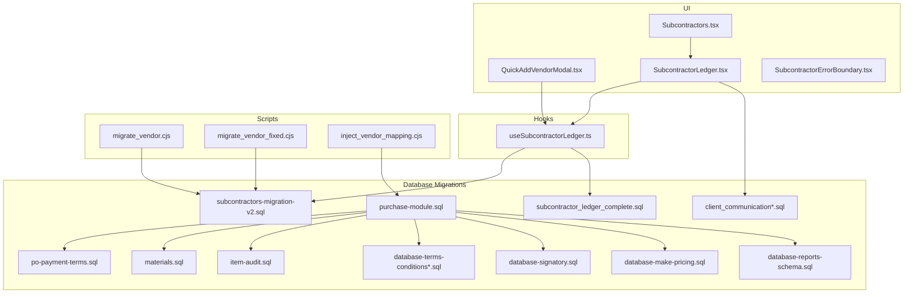

**Diagram sources**
- [QuickAddVendorModal.tsx](file://src/components/QuickAddVendorModal.tsx)
- [SubcontractorLedger.tsx](file://src/components/SubcontractorLedger.tsx)
- [SubcontractorErrorBoundary.tsx](file://src/components/SubcontractorErrorBoundary.tsx)
- [Subcontractors.tsx](file://src/pages/Subcontractors.tsx)
- [useSubcontractorLedger.ts](file://src/hooks/useSubcontractorLedger.ts)
- [database-subcontractors.sql](file://src/database/subcontractors-migration-v2.sql)
- [database-subcontractor-ledger-complete.sql](file://src/database/subcontractor_ledger_complete.sql)
- [client_communication.sql](file://sql/client_communication.sql)
- [client_communication_entries.sql](file://sql/client_communication_entries.sql)
- [client_communication_linked_items.sql](file://sql/client_communication_linked_items.sql)
- [database-purchase-module.sql](file://src/database-purchase-module.sql)
- [database-po-payment-terms.sql](file://src/database-po-payment-terms.sql)
- [database-materials.sql](file://src/database-materials.sql)
- [database-item-audit.sql](file://src/database-item-audit.sql)
- [database-terms-conditions.sql](file://src/database-terms-conditions.sql)
- [database-signatory.sql](file://src/database-signatory.sql)
- [database-make-pricing.sql](file://src/database-make-pricing.sql)
- [database-reports-schema.sql](file://src/database-reports-schema.sql)
- [migrate_vendor.cjs](file://migrate_vendor.cjs)
- [migrate_vendor_fixed.cjs](file://migrate_vendor_fixed.cjs)
- [inject_vendor_mapping.cjs](file://inject_vendor_mapping.cjs)

**Section sources**
- [QuickAddVendorModal.tsx](file://src/components/QuickAddVendorModal.tsx)
- [Subcontractors.tsx](file://src/pages/Subcontractors.tsx)
- [database-subcontractors.sql](file://src/database/subcontractors-migration-v2.sql)
- [database-subcontractor-ledger-complete.sql](file://src/database/subcontractor_ledger_complete.sql)
- [useSubcontractorLedger.ts](file://src/hooks/useSubcontractorLedger.ts)
- [client_communication.sql](file://sql/client_communication.sql)
- [client_communication_entries.sql](file://sql/client_communication_entries.sql)
- [client_communication_linked_items.sql](file://sql/client_communication_linked_items.sql)
- [database-purchase-module.sql](file://src/database-purchase-module.sql)
- [database-po-payment-terms.sql](file://src/database-po-payment-terms.sql)
- [database-materials.sql](file://src/database-materials.sql)
- [database-item-audit.sql](file://src/database-item-audit.sql)
- [database-terms-conditions.sql](file://src/database-terms-conditions.sql)
- [database-signatory.sql](file://src/database-signatory.sql)
- [database-make-pricing.sql](file://src/database-make-pricing.sql)
- [database-reports-schema.sql](file://src/database-reports-schema.sql)
- [migrate_vendor.cjs](file://migrate_vendor.cjs)
- [migrate_vendor_fixed.cjs](file://migrate_vendor_fixed.cjs)
- [inject_vendor_mapping.cjs](file://inject_vendor_mapping.cjs)

## Core Components
- Quick Add Vendor Modal: Provides a streamlined UI for creating new vendors quickly, capturing essential registration fields and initiating onboarding steps.
- Subcontractor Ledger: Displays vendor financial and operational history, supporting periodic reviews and performance tracking.
- Subcontractors Page: Central hub for vendor lifecycle management including listing, filtering, and actions like activation/deactivation.
- useSubcontractorLedger Hook: Encapsulates data fetching and mutations for vendor ledger operations, enabling consistent state management across UI.

These components collectively enable vendor registration, qualification checks, evaluation workflows, and ongoing performance monitoring.

**Section sources**
- [QuickAddVendorModal.tsx](file://src/components/QuickAddVendorModal.tsx)
- [SubcontractorLedger.tsx](file://src/components/SubcontractorLedger.tsx)
- [Subcontractors.tsx](file://src/pages/Subcontractors.tsx)
- [useSubcontractorLedger.ts](file://src/hooks/useSubcontractorLedger.ts)

## Architecture Overview
The vendor management architecture integrates UI, hooks, database schemas, and scripts to support end-to-end vendor lifecycle processes. Key interactions include:
- Vendor creation via modal triggers hook-based data operations
- Ledger operations fetch and update vendor records and transactions
- Purchase module references vendor entities for procurement workflows
- Communication tables log vendor interactions and attachments
- Audit tables record changes for compliance and traceability
- Pricing and terms tables govern agreements and compliance documentation
- Reports schema supports analytics integration

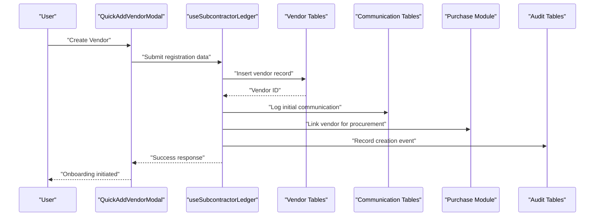

**Diagram sources**
- [QuickAddVendorModal.tsx](file://src/components/QuickAddVendorModal.tsx)
- [useSubcontractorLedger.ts](file://src/hooks/useSubcontractorLedger.ts)
- [database-subcontractors.sql](file://src/database/subcontractors-migration-v2.sql)
- [client_communication.sql](file://sql/client_communication.sql)
- [database-purchase-module.sql](file://src/database-purchase-module.sql)
- [database-item-audit.sql](file://src/database-item-audit.sql)

## Detailed Component Analysis

### Vendor Registration and Onboarding
Vendor registration is facilitated through the Quick Add Vendor Modal, which captures core vendor details and initiates onboarding workflows. The process includes validation, persistence, and linking to procurement modules.

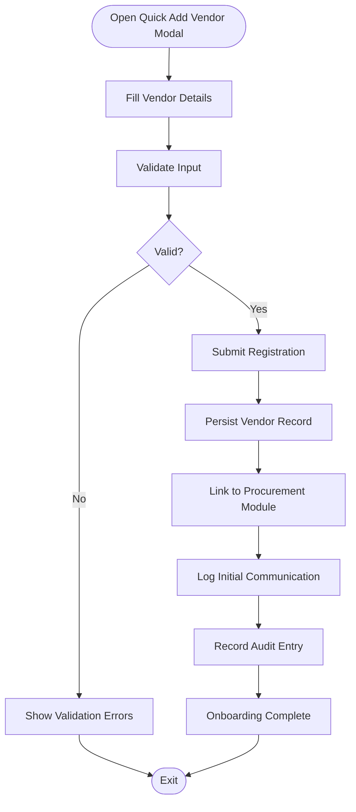

**Diagram sources**
- [QuickAddVendorModal.tsx](file://src/components/QuickAddVendorModal.tsx)
- [database-subcontractors.sql](file://src/database/subcontractors-migration-v2.sql)
- [database-purchase-module.sql](file://src/database-purchase-module.sql)
- [client_communication.sql](file://sql/client_communication.sql)
- [database-item-audit.sql](file://src/database-item-audit.sql)

**Section sources**
- [QuickAddVendorModal.tsx](file://src/components/QuickAddVendorModal.tsx)
- [database-subcontractors.sql](file://src/database/subcontractors-migration-v2.sql)
- [database-purchase-module.sql](file://src/database-purchase-module.sql)
- [client_communication.sql](file://sql/client_communication.sql)
- [database-item-audit.sql](file://src/database-item-audit.sql)

### Vendor Qualification and Evaluation
Qualification involves verifying vendor credentials, compliance documents, and performance criteria. Evaluation tracks historical performance metrics and ratings.

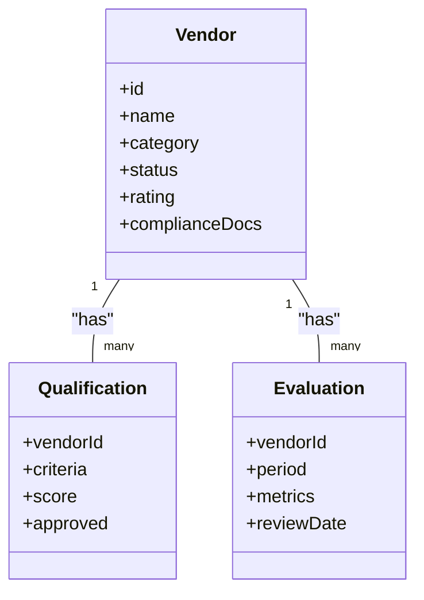

**Diagram sources**
- [database-subcontractors.sql](file://src/database/subcontractors-migration-v2.sql)
- [database-subcontractor-ledger-complete.sql](file://src/database/subcontractor_ledger_complete.sql)

**Section sources**
- [database-subcontractors.sql](file://src/database/subcontractors-migration-v2.sql)
- [database-subcontractor-ledger-complete.sql](file://src/database/subcontractor_ledger_complete.sql)

### Vendor Categorization and Rating Systems
Vendors are categorized by type (e.g., supplier, contractor) and rated based on performance metrics such as delivery timeliness, quality, and compliance. Ratings influence procurement decisions and periodic reviews.

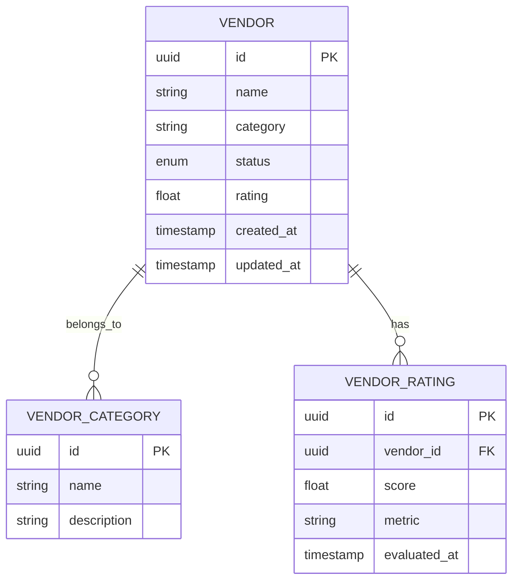

**Diagram sources**
- [database-subcontractors.sql](file://src/database/subcontractors-migration-v2.sql)
- [database-subcontractor-ledger-complete.sql](file://src/database/subcontractor_ledger_complete.sql)

**Section sources**
- [database-subcontractors.sql](file://src/database/subcontractors-migration-v2.sql)
- [database-subcontractor-ledger-complete.sql](file://src/database/subcontractor_ledger_complete.sql)

### Performance Metrics and Periodic Reviews
Performance metrics are tracked through ledger entries and evaluation records. Periodic reviews assess vendor performance against KPIs and update ratings accordingly.

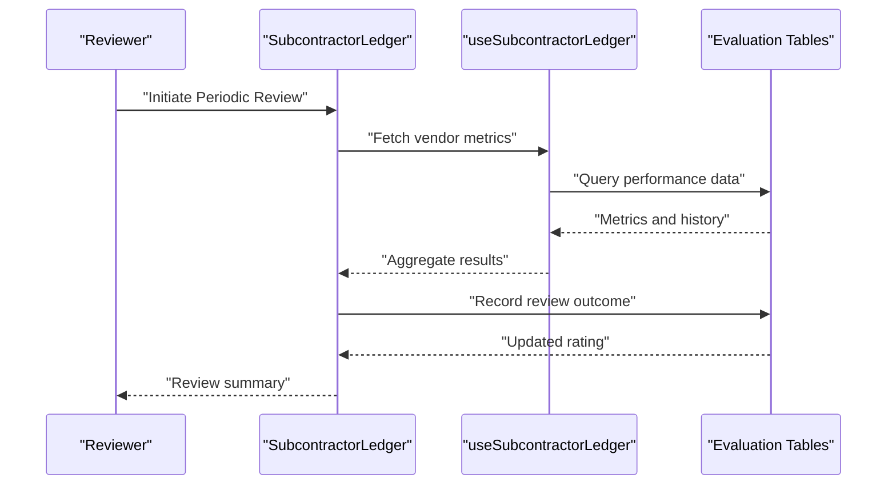

**Diagram sources**
- [SubcontractorLedger.tsx](file://src/components/SubcontractorLedger.tsx)
- [useSubcontractorLedger.ts](file://src/hooks/useSubcontractorLedger.ts)
- [database-subcontractor-ledger-complete.sql](file://src/database/subcontractor_ledger_complete.sql)

**Section sources**
- [SubcontractorLedger.tsx](file://src/components/SubcontractorLedger.tsx)
- [useSubcontractorLedger.ts](file://src/hooks/useSubcontractorLedger.ts)
- [database-subcontractor-ledger-complete.sql](file://src/database/subcontractor_ledger_complete.sql)

### Contract Management and Pricing Agreements
Contracts and pricing agreements are managed through dedicated tables linked to vendors. These include payment terms, signatories, and compliance documentation.

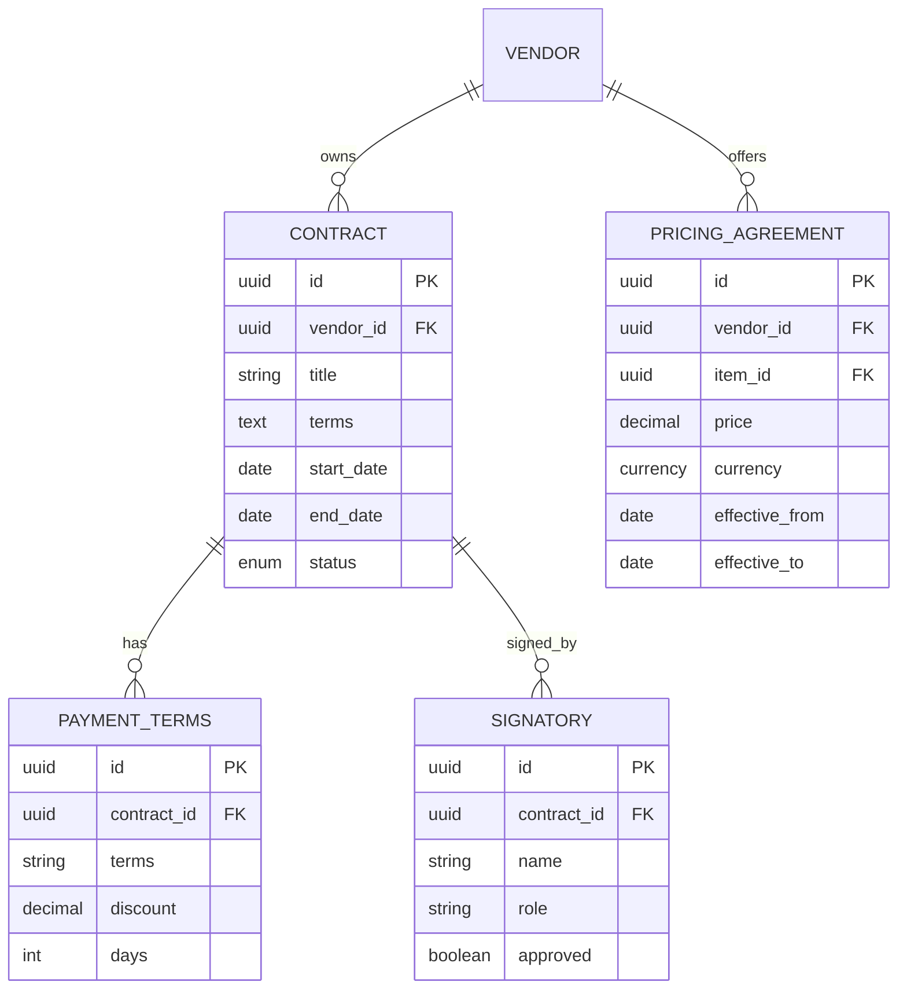

**Diagram sources**
- [database-purchase-module.sql](file://src/database-purchase-module.sql)
- [database-po-payment-terms.sql](file://src/database-po-payment-terms.sql)
- [database-signatory.sql](file://src/database-signatory.sql)
- [database-make-pricing.sql](file://src/database-make-pricing.sql)

**Section sources**
- [database-purchase-module.sql](file://src/database-purchase-module.sql)
- [database-po-payment-terms.sql](file://src/database-po-payment-terms.sql)
- [database-signatory.sql](file://src/database-signatory.sql)
- [database-make-pricing.sql](file://src/database-make-pricing.sql)

### Compliance Documentation and Terms
Compliance documentation is stored alongside vendor records and contracts. Terms and conditions ensure legal adherence and standardize vendor interactions.

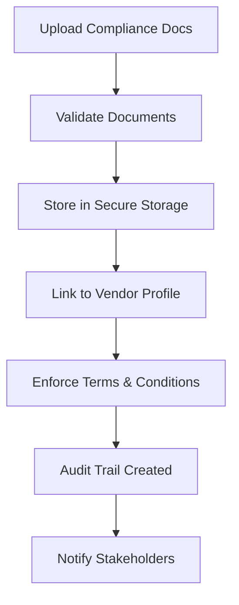

**Diagram sources**
- [client_communication_storage.sql](file://src/database-communication-storage.sql)
- [database-terms-conditions.sql](file://src/database-terms-conditions.sql)
- [database-item-audit.sql](file://src/database-item-audit.sql)

**Section sources**
- [client_communication_storage.sql](file://src/database-communication-storage.sql)
- [database-terms-conditions.sql](file://src/database-terms-conditions.sql)
- [database-item-audit.sql](file://src/database-item-audit.sql)

### Deactivation Procedures
Vendor deactivation involves updating status, revoking access, and archiving records while maintaining audit trails for compliance.

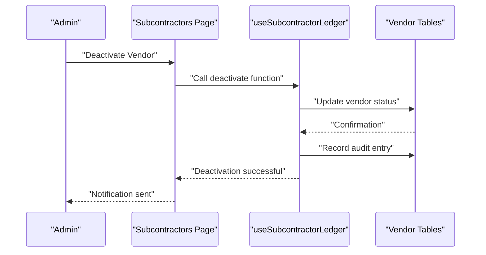

**Diagram sources**
- [Subcontractors.tsx](file://src/pages/Subcontractors.tsx)
- [useSubcontractorLedger.ts](file://src/hooks/useSubcontractorLedger.ts)
- [database-subcontractors.sql](file://src/database/subcontractors-migration-v2.sql)
- [database-item-audit.sql](file://src/database-item-audit.sql)

**Section sources**
- [Subcontractors.tsx](file://src/pages/Subcontractors.tsx)
- [useSubcontractorLedger.ts](file://src/hooks/useSubcontractorLedger.ts)
- [database-subcontractors.sql](file://src/database/subcontractors-migration-v2.sql)
- [database-item-audit.sql](file://src/database-item-audit.sql)

### Vendor Communication Logs
Communication logs capture all interactions with vendors, including messages, attachments, and follow-ups. These logs support transparency and accountability.

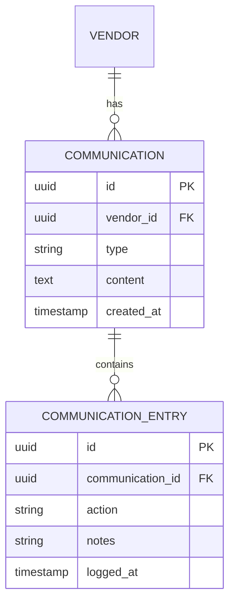

**Diagram sources**
- [client_communication.sql](file://sql/client_communication.sql)
- [client_communication_entries.sql](file://sql/client_communication_entries.sql)
- [client_communication_linked_items.sql](file://sql/client_communication_linked_items.sql)

**Section sources**
- [client_communication.sql](file://sql/client_communication.sql)
- [client_communication_entries.sql](file://sql/client_communication_entries.sql)
- [client_communication_linked_items.sql](file://sql/client_communication_linked_items.sql)

### Integration with Procurement Analytics
Vendor data integrates with procurement analytics through reports schema and purchase module links. This enables insights into vendor performance, spending, and compliance trends.

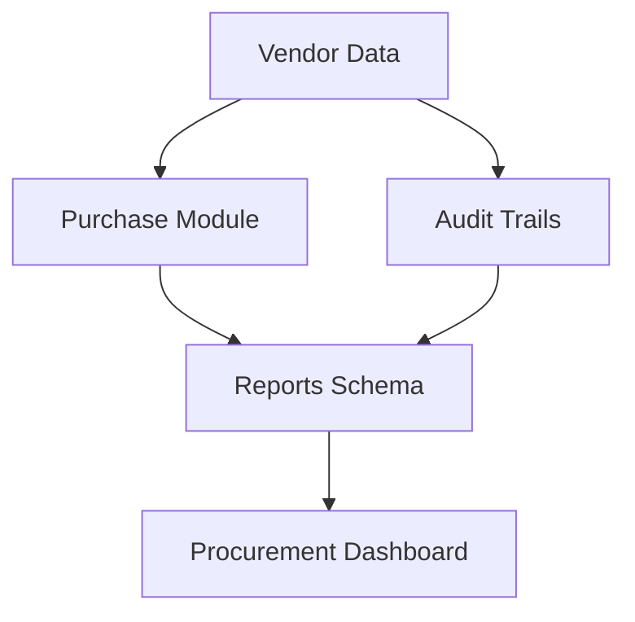

**Diagram sources**
- [database-purchase-module.sql](file://src/database-purchase-module.sql)
- [database-reports-schema.sql](file://src/database-reports-schema.sql)
- [database-item-audit.sql](file://src/database-item-audit.sql)

**Section sources**
- [database-purchase-module.sql](file://src/database-purchase-module.sql)
- [database-reports-schema.sql](file://src/database-reports-schema.sql)
- [database-item-audit.sql](file://src/database-item-audit.sql)

## Dependency Analysis
Vendor management components depend on database schemas for data integrity and consistency. UI components rely on hooks for state management, while scripts facilitate data migration and initialization.

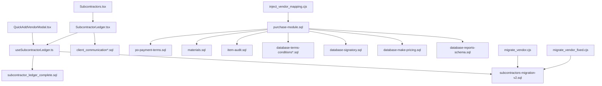

**Diagram sources**
- [QuickAddVendorModal.tsx](file://src/components/QuickAddVendorModal.tsx)
- [SubcontractorLedger.tsx](file://src/components/SubcontractorLedger.tsx)
- [Subcontractors.tsx](file://src/pages/Subcontractors.tsx)
- [useSubcontractorLedger.ts](file://src/hooks/useSubcontractorLedger.ts)
- [database-subcontractors.sql](file://src/database/subcontractors-migration-v2.sql)
- [database-subcontractor-ledger-complete.sql](file://src/database/subcontractor_ledger_complete.sql)
- [client_communication.sql](file://sql/client_communication.sql)
- [client_communication_entries.sql](file://sql/client_communication_entries.sql)
- [client_communication_linked_items.sql](file://sql/client_communication_linked_items.sql)
- [database-purchase-module.sql](file://src/database-purchase-module.sql)
- [database-po-payment-terms.sql](file://src/database-po-payment-terms.sql)
- [database-materials.sql](file://src/database-materials.sql)
- [database-item-audit.sql](file://src/database-item-audit.sql)
- [database-terms-conditions.sql](file://src/database-terms-conditions.sql)
- [database-signatory.sql](file://src/database-signatory.sql)
- [database-make-pricing.sql](file://src/database-make-pricing.sql)
- [database-reports-schema.sql](file://src/database-reports-schema.sql)
- [migrate_vendor.cjs](file://migrate_vendor.cjs)
- [migrate_vendor_fixed.cjs](file://migrate_vendor_fixed.cjs)
- [inject_vendor_mapping.cjs](file://inject_vendor_mapping.cjs)

**Section sources**
- [QuickAddVendorModal.tsx](file://src/components/QuickAddVendorModal.tsx)
- [SubcontractorLedger.tsx](file://src/components/SubcontractorLedger.tsx)
- [Subcontractors.tsx](file://src/pages/Subcontractors.tsx)
- [useSubcontractorLedger.ts](file://src/hooks/useSubcontractorLedger.ts)
- [database-subcontractors.sql](file://src/database/subcontractors-migration-v2.sql)
- [database-subcontractor-ledger-complete.sql](file://src/database/subcontractor_ledger_complete.sql)
- [client_communication.sql](file://sql/client_communication.sql)
- [client_communication_entries.sql](file://sql/client_communication_entries.sql)
- [client_communication_linked_items.sql](file://sql/client_communication_linked_items.sql)
- [database-purchase-module.sql](file://src/database-purchase-module.sql)
- [database-po-payment-terms.sql](file://src/database-po-payment-terms.sql)
- [database-materials.sql](file://src/database-materials.sql)
- [database-item-audit.sql](file://src/database-item-audit.sql)
- [database-terms-conditions.sql](file://src/database-terms-conditions.sql)
- [database-signatory.sql](file://src/database-signatory.sql)
- [database-make-pricing.sql](file://src/database-make-pricing.sql)
- [database-reports-schema.sql](file://src/database-reports-schema.sql)
- [migrate_vendor.cjs](file://migrate_vendor.cjs)
- [migrate_vendor_fixed.cjs](file://migrate_vendor_fixed.cjs)
- [inject_vendor_mapping.cjs](file://inject_vendor_mapping.cjs)

## Performance Considerations
- Efficient data fetching: Use hooks to minimize redundant queries and leverage caching where appropriate.
- Indexed columns: Ensure frequently queried columns (e.g., vendor_id, status) are indexed for faster lookups.
- Batch operations: Group updates and inserts to reduce database load during bulk operations.
- Pagination: Implement pagination for large datasets like communication logs and ledger entries.
- Error boundaries: Utilize error boundaries to handle failures gracefully and maintain UI stability.

[No sources needed since this section provides general guidance]

## Troubleshooting Guide
Common issues and resolutions:
- Vendor creation failures: Check input validation and database constraints. Verify migration scripts have been applied.
- Ledger display errors: Ensure proper hook usage and data binding. Inspect network requests for API errors.
- Communication logs missing: Confirm storage permissions and linkage to vendor records.
- Audit trail gaps: Verify audit logging is enabled and triggered on critical operations.

**Section sources**
- [SubcontractorErrorBoundary.tsx](file://src/components/SubcontractorErrorBoundary.tsx)
- [useSubcontractorLedger.ts](file://src/hooks/useSubcontractorLedger.ts)
- [database-item-audit.sql](file://src/database-item-audit.sql)

## Conclusion
The vendor management system provides a robust framework for handling vendor lifecycle processes, from registration to deactivation. With comprehensive data models, secure communication logs, and integrated analytics, it supports efficient procurement operations and compliance requirements. Continuous monitoring and optimization ensure scalability and reliability.

[No sources needed since this section summarizes without analyzing specific files]

## Appendices
- Migration Scripts: Refer to migrate_vendor.cjs and migrate_vendor_fixed.cjs for vendor setup and fixes.
- Data Injection: Use inject_vendor_mapping.cjs to populate vendor mappings and sample data.
- Database Setup: Consult database-setup.sql and database-tables.sql for foundational schemas.

**Section sources**
- [migrate_vendor.cjs](file://migrate_vendor.cjs)
- [migrate_vendor_fixed.cjs](file://migrate_vendor_fixed.cjs)
- [inject_vendor_mapping.cjs](file://inject_vendor_mapping.cjs)
- [database-setup.sql](file://src/database-setup.sql)
- [database-tables.sql](file://src/database-tables.sql)