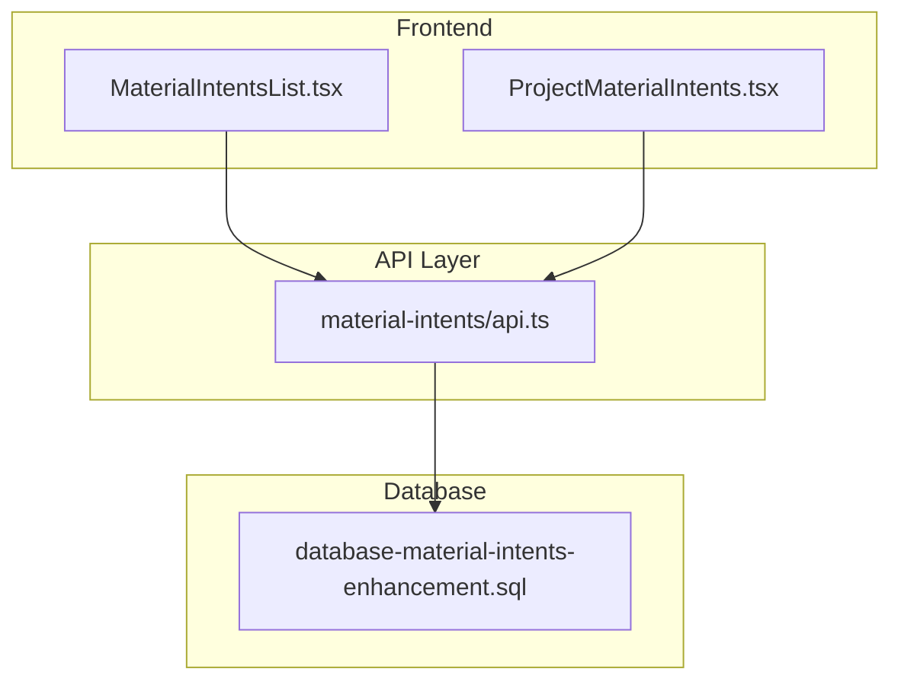
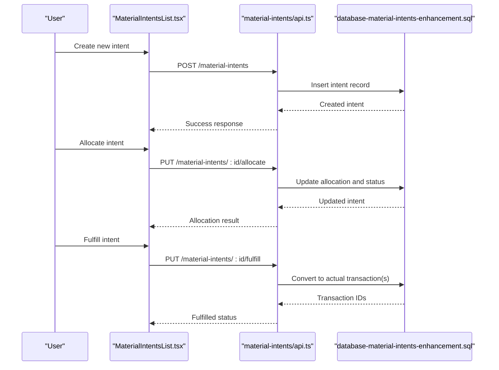
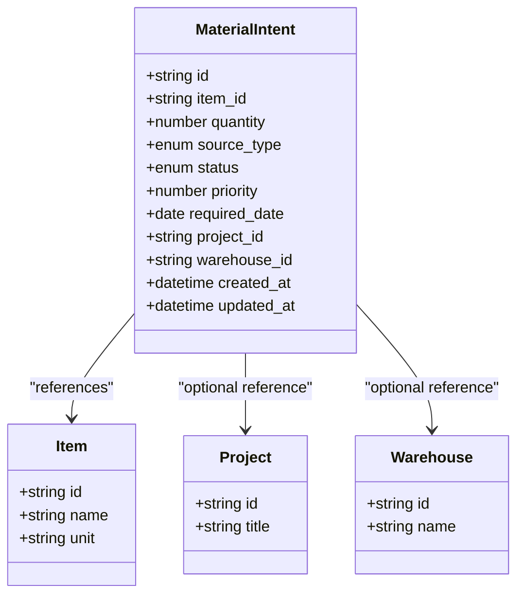
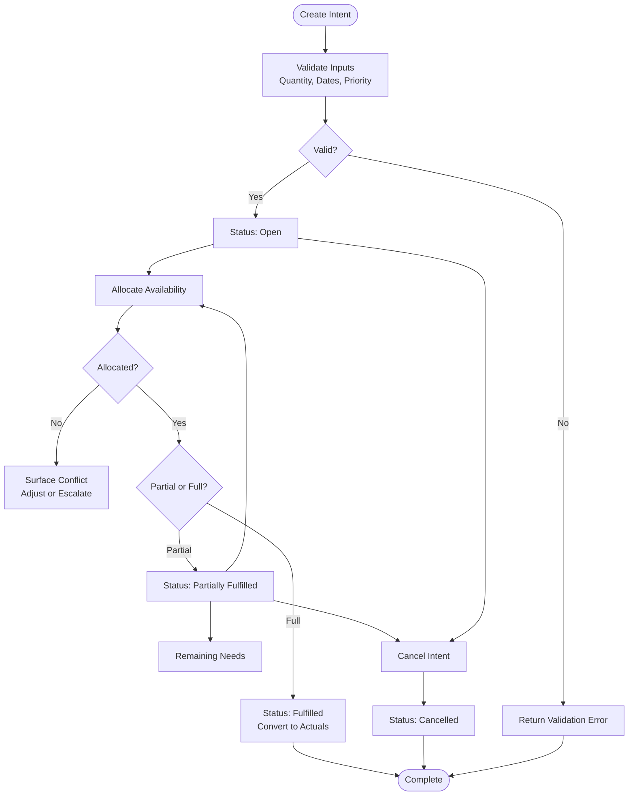
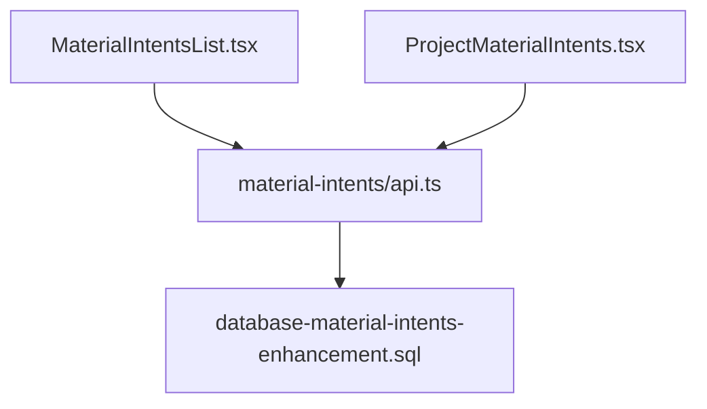

# Material Intents System

<cite>
**Referenced Files in This Document**
- [material-intents/api.ts](file://src/material-intents/api.ts)
- [MaterialIntentsList.tsx](file://src/pages/MaterialIntentsList.tsx)
- [ProjectMaterialIntents.tsx](file://src/pages/ProjectMaterialIntents.tsx)
- [database-material-intents-enhancement.sql](file://src/database-material-intents-enhancement.sql)
</cite>

## Table of Contents
1. [Introduction](#introduction)
2. [Project Structure](#project-structure)
3. [Core Components](#core-components)
4. [Architecture Overview](#architecture-overview)
5. [Detailed Component Analysis](#detailed-component-analysis)
6. [Dependency Analysis](#dependency-analysis)
7. [Performance Considerations](#performance-considerations)
8. [Troubleshooting Guide](#troubleshooting-guide)
9. [Conclusion](#conclusion)

## Introduction
The Material Intents system provides forward-looking planning and reservation capabilities for materials across procurement, production, and projects. It enables teams to express planned demand (intents) before actual transactions occur, improving visibility, conflict resolution, and forecasting accuracy. Intents are distinct from actual stock movements or financial transactions; they represent commitments that can be allocated, fulfilled, converted into actuals, or canceled.

Key benefits:
- Forward-looking planning: capture demand early in the process lifecycle
- Conflict detection and priority handling: avoid overcommitment and resolve contention
- Automatic conversion to actuals: streamline fulfillment into inventory or purchase records
- Demand forecasting input: aggregate intents to inform supply planning and purchasing

## Project Structure
The material intents feature is implemented as a small set of focused files:
- API layer for intent operations
- UI pages for listing and managing intents at organization and project levels
- Database schema enhancements defining the data model and constraints

**Diagram sources**
- [MaterialIntentsList.tsx](file://src/pages/MaterialIntentsList.tsx)
- [ProjectMaterialIntents.tsx](file://src/pages/ProjectMaterialIntents.tsx)
- [material-intents/api.ts](file://src/material-intents/api.ts)
- [database-material-intents-enhancement.sql](file://src/database-material-intents-enhancement.sql)

**Section sources**
- [material-intents/api.ts](file://src/material-intents/api.ts)
- [MaterialIntentsList.tsx](file://src/pages/MaterialIntentsList.tsx)
- [ProjectMaterialIntents.tsx](file://src/pages/ProjectMaterialIntents.tsx)
- [database-material-intents-enhancement.sql](file://src/database-material-intents-enhancement.sql)

## Core Components
- Intent creation: Users create intents to reserve quantities for specific items, locations, and time windows. Intents carry metadata such as source type (procurement, production, project), priority, and target dates.
- Allocation: The system allocates available stock against open intents based on priority and timing rules. Conflicts are surfaced when demand exceeds availability.
- Fulfillment: When stock becomes available or a purchase order is received, intents are fulfilled and automatically converted into actual transactions (e.g., inward receipts or production reservations).
- Lifecycle management: Intents progress through states such as Open, Allocated, Fulfilled, Cancelled, with auditability and traceability.

How intents differ from actual transactions:
- Intents are planning artifacts; they do not change physical stock until fulfilled.
- Actual transactions reflect real movements (inward/outward) and financial impact.
- Intents feed demand forecasts; actuals drive inventory balances and accounting.

Examples:
- Procurement intent: Reserve incoming PO quantity for a project by due date.
- Production reservation: Reserve raw materials for a scheduled job card.
- Project allocation: Allocate materials to a project phase with priority.

Conflict and priority handling:
- Higher-priority intents consume availability first.
- Overallocation triggers warnings and requires manual intervention or policy-driven overrides.
- Time-based precedence ensures earlier-dated intents are considered first.

Automatic conversion:
- Upon fulfillment, the system converts the intent into an actual transaction and updates status accordingly.

**Section sources**
- [material-intents/api.ts](file://src/material-intents/api.ts)
- [MaterialIntentsList.tsx](file://src/pages/MaterialIntentsList.tsx)
- [ProjectMaterialIntents.tsx](file://src/pages/ProjectMaterialIntents.tsx)
- [database-material-intents-enhancement.sql](file://src/database-material-intents-enhancement.sql)

## Architecture Overview
The system follows a layered architecture:
- Presentation layer: Pages render lists and actions for creating, allocating, fulfilling, and canceling intents.
- API layer: Exposes endpoints for CRUD and state transitions, enforcing business rules and validations.
- Data layer: Stores intents and related metadata; supports queries for allocation and conflict checks.

**Diagram sources**
- [MaterialIntentsList.tsx](file://src/pages/MaterialIntentsList.tsx)
- [material-intents/api.ts](file://src/material-intents/api.ts)
- [database-material-intents-enhancement.sql](file://src/database-material-intents-enhancement.sql)

## Detailed Component Analysis

### API Layer: material-intents/api.ts
Responsibilities:
- Define endpoints for creating, updating, allocating, fulfilling, and canceling intents
- Validate inputs (quantities, dates, priorities, references)
- Enforce allocation rules and conflict checks
- Trigger automatic conversion to actual transactions upon fulfillment
- Return structured responses for UI consumption

Implementation patterns:
- State transitions are validated server-side to ensure integrity
- Bulk operations may be supported for batch allocations
- Error codes distinguish between validation failures, conflicts, and system errors

**Section sources**
- [material-intents/api.ts](file://src/material-intents/api.ts)

### UI: MaterialIntentsList.tsx
Responsibilities:
- Display all intents with filters (status, source type, project, date range)
- Provide actions to create, allocate, fulfill, and cancel intents
- Show allocation status and conflicts inline
- Navigate to detailed views and related documents (POs, job cards, projects)

User interactions:
- Create form captures item, quantity, source type, priority, and target dates
- Allocation wizard guides users through partial/full allocation
- Fulfill action prompts confirmation and shows resulting actuals

**Section sources**
- [MaterialIntentsList.tsx](file://src/pages/MaterialIntentsList.tsx)

### UI: ProjectMaterialIntents.tsx
Responsibilities:
- Focus on project-scoped intents and allocations
- Aggregate demand per project and show remaining needs
- Support project-level prioritization and scheduling
- Link intents to project tasks and milestones

Integration points:
- Reads project context and filters intents accordingly
- Updates project dashboards with intent summaries and forecasted requirements

**Section sources**
- [ProjectMaterialIntents.tsx](file://src/pages/ProjectMaterialIntents.tsx)

### Data Model: database-material-intents-enhancement.sql
Responsibilities:
- Define tables and columns for intents, including identifiers, quantities, statuses, priorities, and timestamps
- Establish relationships to items, projects, warehouses, and source documents
- Add indexes for performance-critical queries (by project, item, status, date)
- Enforce constraints to prevent invalid states and duplicate allocations

Data flow considerations:
- Status transitions are constrained to valid paths
- Audit fields track who created/updated and when
- Foreign keys maintain referential integrity with core entities

**Section sources**
- [database-material-intents-enhancement.sql](file://src/database-material-intents-enhancement.sql)

#### Class-like Representation of Intent Entities

**Diagram sources**
- [database-material-intents-enhancement.sql](file://src/database-material-intents-enhancement.sql)

#### Intent Lifecycle Flowchart

**Diagram sources**
- [material-intents/api.ts](file://src/material-intents/api.ts)
- [database-material-intents-enhancement.sql](file://src/database-material-intents-enhancement.sql)

## Dependency Analysis
The material intents feature depends on:
- UI components for user interaction
- API endpoints for business logic and persistence
- Database schema for storage and constraints

**Diagram sources**
- [MaterialIntentsList.tsx](file://src/pages/MaterialIntentsList.tsx)
- [ProjectMaterialIntents.tsx](file://src/pages/ProjectMaterialIntents.tsx)
- [material-intents/api.ts](file://src/material-intents/api.ts)
- [database-material-intents-enhancement.sql](file://src/database-material-intents-enhancement.sql)

**Section sources**
- [material-intents/api.ts](file://src/material-intents/api.ts)
- [MaterialIntentsList.tsx](file://src/pages/MaterialIntentsList.tsx)
- [ProjectMaterialIntents.tsx](file://src/pages/ProjectMaterialIntents.tsx)
- [database-material-intents-enhancement.sql](file://src/database-material-intents-enhancement.sql)

## Performance Considerations
- Indexing: Ensure indexes exist on frequently queried columns such as item_id, project_id, status, and required_date to support fast filtering and allocation checks.
- Batch operations: Use bulk APIs for large-scale allocations to reduce round-trips and improve throughput.
- Pagination: Implement pagination for intent lists to handle large datasets efficiently.
- Concurrency: Apply optimistic locking or versioning to prevent race conditions during concurrent allocations.
- Caching: Cache read-only aggregates (e.g., total open intents per item/project) where appropriate to reduce database load.

[No sources needed since this section provides general guidance]

## Troubleshooting Guide
Common issues and resolutions:
- Validation errors: Check required fields, quantity limits, and date ranges. Review API error messages for specifics.
- Allocation conflicts: Inspect availability and priority settings; adjust plan or escalate for override.
- Fulfillment failures: Verify linked actual transaction creation; check foreign key constraints and permissions.
- State transition errors: Ensure current status allows the requested action; consult lifecycle rules.

Operational tips:
- Use filters to isolate problematic intents (e.g., status=Open, priority=High).
- Review audit logs to trace changes and identify root causes.
- Re-run allocation after resolving upstream issues (e.g., inbound receipts posted).

**Section sources**
- [material-intents/api.ts](file://src/material-intents/api.ts)
- [database-material-intents-enhancement.sql](file://src/database-material-intents-enhancement.sql)

## Conclusion
The Material Intents system enhances supply chain planning by capturing demand early, resolving conflicts proactively, and streamlining fulfillment into actual transactions. Its clear separation between planning (intents) and execution (actuals) improves forecasting accuracy and operational control. With robust lifecycle management, priority handling, and automated conversions, teams can maintain reliable material availability aligned with procurement, production, and project schedules.

[No sources needed since this section summarizes without analyzing specific files]