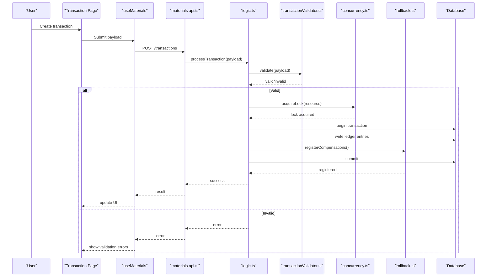
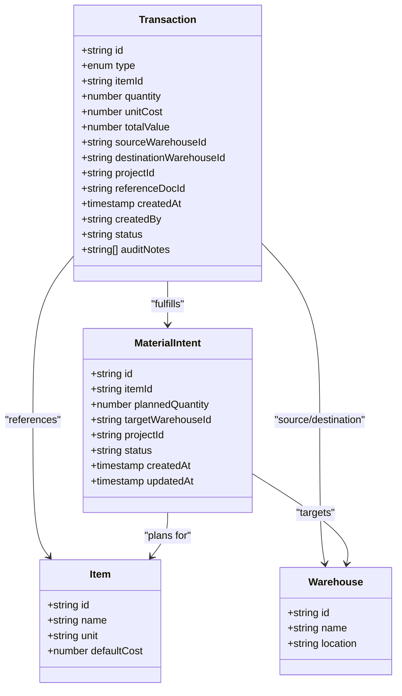
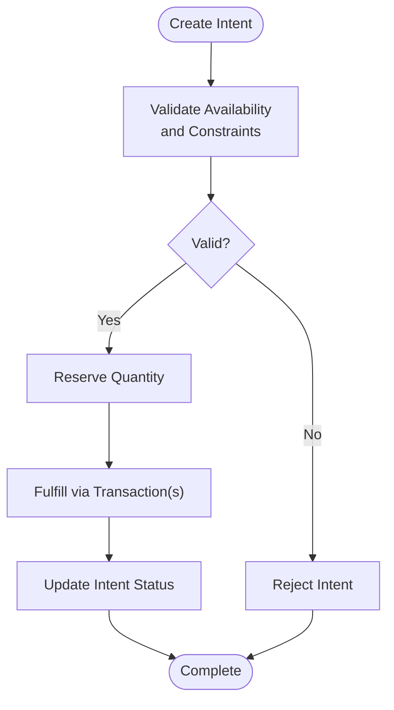
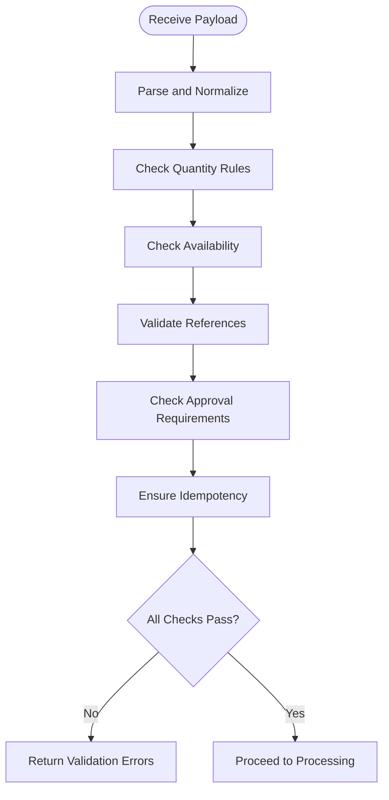
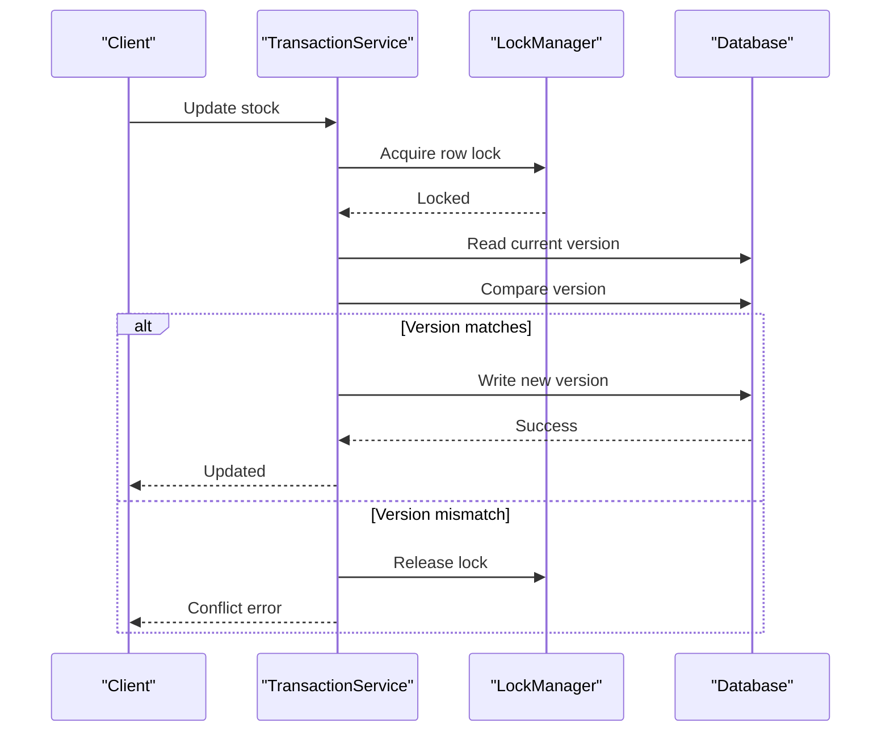
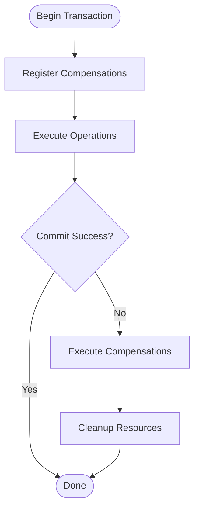
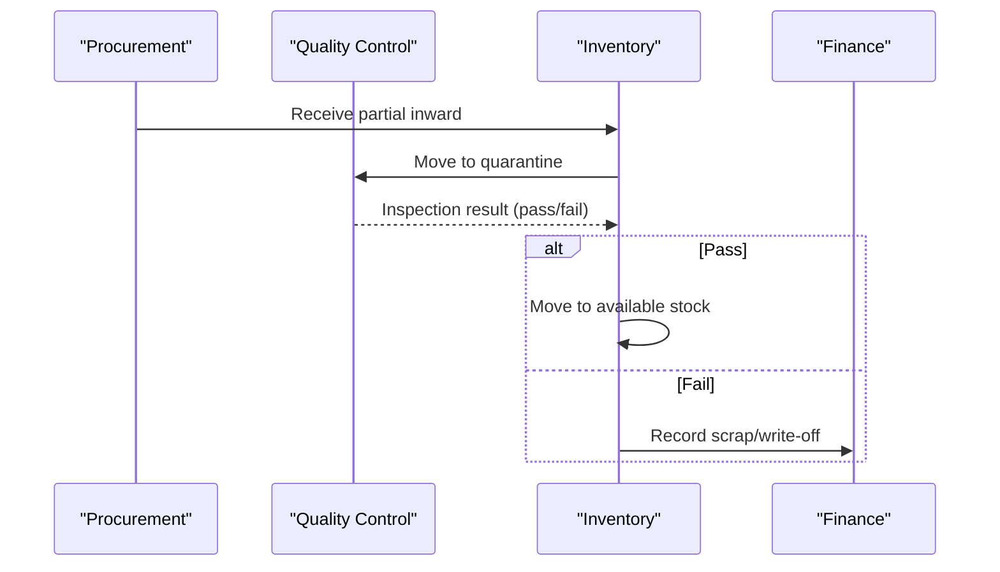
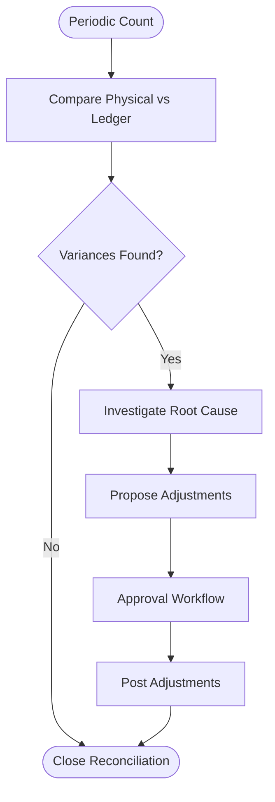
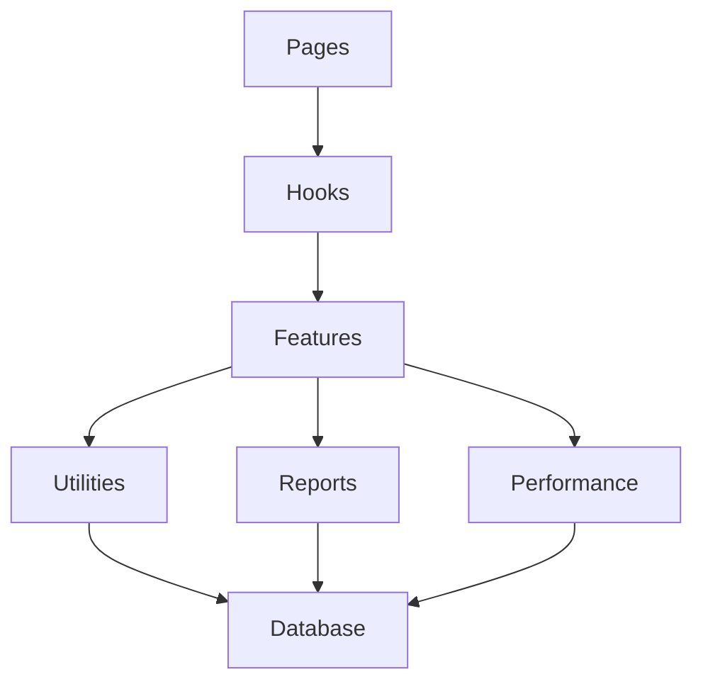

# Stock Transactions & Movements

<cite>
**Referenced Files in This Document**
- [database-material-intents-enhancement.sql](file://src/database-material-intents-enhancement.sql)
- [material-intents/api.ts](file://src/material-intents/api.ts)
- [pages/MaterialInward.tsx](file://src/pages/MaterialInward.tsx)
- [pages/MaterialOutward.tsx](file://src/pages/MaterialOutward.tsx)
- [pages/StockAdjustment.tsx](file://src/pages/StockAdjustment.tsx)
- [pages/StockTransfer.tsx](file://src/pages/StockTransfer.tsx)
- [pages/ReturnEditorPage.tsx](file://src/pages/ReturnEditorPage.tsx)
- [pages/ReturnListPage.tsx](file://src/pages/ReturnListPage.tsx)
- [pages/ReturnViewPage.tsx](file://src/pages/ReturnViewPage.tsx)
- [pages/MaterialIntentsList.tsx](file://src/pages/MaterialIntentsList.tsx)
- [pages/ProjectMaterialIntents.tsx](file://src/pages/ProjectMaterialIntents.tsx)
- [hooks/useMaterials.ts](file://src/hooks/useMaterials.ts)
- [hooks/useWarehouses.ts](file://src/hooks/useWarehouses.ts)
- [features/materials/types.ts](file://src/features/materials/types.ts)
- [features/materials/api.ts](file://src/features/materials/api.ts)
- [features/materials/logic.ts](file://src/features/materials/logic.ts)
- [features/materials/schemas.ts](file://src/features/materials/schemas.ts)
- [features/materials/components/MaterialLedger.tsx](file://src/features/materials/components/MaterialLedger.tsx)
- [features/materials/components/MovementHistory.tsx](file://src/features/materials/components/MovementHistory.tsx)
- [features/materials/utils/transactionValidator.ts](file://src/features/materials/utils/transactionValidator.ts)
- [features/materials/utils/concurrency.ts](file://src/features/materials/utils/concurrency.ts)
- [features/materials/utils/rollback.ts](file://src/features/materials/utils/rollback.ts)
- [features/materials/reports/stockReport.ts](file://src/features/materials/reports/stockReport.ts)
- [features/materials/reports/reconciliation.ts](file://src/features/materials/reports/reconciliation.ts)
- [features/materials/performance/batchProcessor.ts](file://src/features/materials/performance/batchProcessor.ts)
- [features/materials/performance/indexingStrategy.ts](file://src/features/materials/performance/indexingStrategy.ts)
</cite>

## Table of Contents
1. [Introduction](#introduction)
2. [Project Structure](#project-structure)
3. [Core Components](#core-components)
4. [Architecture Overview](#architecture-overview)
5. [Detailed Component Analysis](#detailed-component-analysis)
6. [Dependency Analysis](#dependency-analysis)
7. [Performance Considerations](#performance-considerations)
8. [Troubleshooting Guide](#troubleshooting-guide)
9. [Conclusion](#conclusion)
10. [Appendices](#appendices)

## Introduction
This document provides comprehensive data model documentation for the stock transactions and movement tracking system. It covers transaction types (inward, outward, adjustments, transfers, returns), the transaction ledger structure, audit trail requirements, financial implications, material intents for forward-looking planning and reservations, validation rules, concurrency handling, rollback mechanisms, complex scenarios (partial deliveries, quality checks, scrap processing), reporting, reconciliation procedures, and performance optimization strategies for high-volume operations.

## Project Structure
The stock transactions and movements feature spans UI pages, hooks, domain logic, utilities, reports, and database migrations. The key areas include:
- Transaction entry points: Material Inward, Outward, Adjustments, Transfers, Returns
- Material Intents: forward-looking planning and reservation management
- Core features: types, schemas, API integration, business logic, components
- Utilities: validation, concurrency control, rollback orchestration
- Reports and reconciliation: stock reports, reconciliation procedures
- Performance: batch processing and indexing strategy

```mermaid
graph TB
subgraph "UI Pages"
MI["MaterialInward.tsx"]
MO["MaterialOutward.tsx"]
SA["StockAdjustment.tsx"]
ST["StockTransfer.tsx"]
RE["ReturnEditorPage.tsx"]
RL["ReturnListPage.tsx"]
RV["ReturnViewPage.tsx"]
MIL["MaterialIntentsList.tsx"]
PMI["ProjectMaterialIntents.tsx"]
end
subgraph "Hooks"
UM["useMaterials.ts"]
UW["useWarehouses.ts"]
end
subgraph "Features"
FT["types.ts"]
FA["api.ts"]
FL["logic.ts"]
FS["schemas.ts"]
ML["components/MaterialLedger.tsx"]
MH["components/MovementHistory.tsx"]
end
subgraph "Utilities"
TV["utils/transactionValidator.ts"]
CC["utils/concurrency.ts"]
RB["utils/rollback.ts"]
end
subgraph "Reports"
SR["reports/stockReport.ts"]
RC["reports/reconciliation.ts"]
end
subgraph "Performance"
BP["performance/batchProcessor.ts"]
IS["performance/indexingStrategy.ts"]
end
MI --> FL
MO --> FL
SA --> FL
ST --> FL
RE --> FL
RL --> FL
RV --> FL
MIL --> FL
PMI --> FL
UM --> FL
UW --> FL
FL --> TV
FL --> CC
FL --> RB
FL --> SR
FL --> RC
FL --> BP
FL --> IS
ML --> FL
MH --> FL
```

**Diagram sources**
- [pages/MaterialInward.tsx](file://src/pages/MaterialInward.tsx)
- [pages/MaterialOutward.tsx](file://src/pages/MaterialOutward.tsx)
- [pages/StockAdjustment.tsx](file://src/pages/StockAdjustment.tsx)
- [pages/StockTransfer.tsx](file://src/pages/StockTransfer.tsx)
- [pages/ReturnEditorPage.tsx](file://src/pages/ReturnEditorPage.tsx)
- [pages/ReturnListPage.tsx](file://src/pages/ReturnListPage.tsx)
- [pages/ReturnViewPage.tsx](file://src/pages/ReturnViewPage.tsx)
- [pages/MaterialIntentsList.tsx](file://src/pages/MaterialIntentsList.tsx)
- [pages/ProjectMaterialIntents.tsx](file://src/pages/ProjectMaterialIntents.tsx)
- [hooks/useMaterials.ts](file://src/hooks/useMaterials.ts)
- [hooks/useWarehouses.ts](file://src/hooks/useWarehouses.ts)
- [features/materials/types.ts](file://src/features/materials/types.ts)
- [features/materials/api.ts](file://src/features/materials/api.ts)
- [features/materials/logic.ts](file://src/features/materials/logic.ts)
- [features/materials/schemas.ts](file://src/features/materials/schemas.ts)
- [features/materials/components/MaterialLedger.tsx](file://src/features/materials/components/MaterialLedger.tsx)
- [features/materials/components/MovementHistory.tsx](file://src/features/materials/components/MovementHistory.tsx)
- [features/materials/utils/transactionValidator.ts](file://src/features/materials/utils/transactionValidator.ts)
- [features/materials/utils/concurrency.ts](file://src/features/materials/utils/concurrency.ts)
- [features/materials/utils/rollback.ts](file://src/features/materials/utils/rollback.ts)
- [features/materials/reports/stockReport.ts](file://src/features/materials/reports/stockReport.ts)
- [features/materials/reports/reconciliation.ts](file://src/features/materials/reports/reconciliation.ts)
- [features/materials/performance/batchProcessor.ts](file://src/features/materials/performance/batchProcessor.ts)
- [features/materials/performance/indexingStrategy.ts](file://src/features/materials/performance/indexingStrategy.ts)

**Section sources**
- [pages/MaterialInward.tsx](file://src/pages/MaterialInward.tsx)
- [pages/MaterialOutward.tsx](file://src/pages/MaterialOutward.tsx)
- [pages/StockAdjustment.tsx](file://src/pages/StockAdjustment.tsx)
- [pages/StockTransfer.tsx](file://src/pages/StockTransfer.tsx)
- [pages/ReturnEditorPage.tsx](file://src/pages/ReturnEditorPage.tsx)
- [pages/ReturnListPage.tsx](file://src/pages/ReturnListPage.tsx)
- [pages/ReturnViewPage.tsx](file://src/pages/ReturnViewPage.tsx)
- [pages/MaterialIntentsList.tsx](file://src/pages/MaterialIntentsList.tsx)
- [pages/ProjectMaterialIntents.tsx](file://src/pages/ProjectMaterialIntents.tsx)
- [hooks/useMaterials.ts](file://src/hooks/useMaterials.ts)
- [hooks/useWarehouses.ts](file://src/hooks/useWarehouses.ts)
- [features/materials/types.ts](file://src/features/materials/types.ts)
- [features/materials/api.ts](file://src/features/materials/api.ts)
- [features/materials/logic.ts](file://src/features/materials/logic.ts)
- [features/materials/schemas.ts](file://src/features/materials/schemas.ts)
- [features/materials/components/MaterialLedger.tsx](file://src/features/materials/components/MaterialLedger.tsx)
- [features/materials/components/MovementHistory.tsx](file://src/features/materials/components/MovementHistory.tsx)
- [features/materials/utils/transactionValidator.ts](file://src/features/materials/utils/transactionValidator.ts)
- [features/materials/utils/concurrency.ts](file://src/features/materials/utils/concurrency.ts)
- [features/materials/utils/rollback.ts](file://src/features/materials/utils/rollback.ts)
- [features/materials/reports/stockReport.ts](file://src/features/materials/reports/stockReport.ts)
- [features/materials/reports/reconciliation.ts](file://src/features/materials/reports/reconciliation.ts)
- [features/materials/performance/batchProcessor.ts](file://src/features/materials/performance/batchProcessor.ts)
- [features/materials/performance/indexingStrategy.ts](file://src/features/materials/performance/indexingStrategy.ts)

## Core Components
- Transaction Types: inward, outward, adjustment, transfer, return
- Ledger: immutable record of all stock movements with references to source documents and audit metadata
- Audit Trail: user, timestamp, org context, change reason, and linkage to related transactions
- Financial Implications: valuation changes, cost center/project allocation, tax/GST impact where applicable
- Material Intents: planned future stock movements and reservations against projects or orders
- Validation Rules: quantity limits, availability checks, warehouse constraints, approval gates
- Concurrency Handling: optimistic locking, versioned rows, conflict detection and resolution
- Rollback Mechanisms: compensating transactions, idempotent operations, partial failure recovery
- Reporting: stock position, movement history, intent fulfillment, variance analysis
- Reconciliation: cross-check between ledger balances and physical counts; discrepancy workflows
- Performance: batching, indexing, pagination, caching, query optimization

**Section sources**
- [features/materials/types.ts](file://src/features/materials/types.ts)
- [features/materials/logic.ts](file://src/features/materials/logic.ts)
- [features/materials/components/MaterialLedger.tsx](file://src/features/materials/components/MaterialLedger.tsx)
- [features/materials/components/MovementHistory.tsx](file://src/features/materials/components/MovementHistory.tsx)
- [features/materials/utils/transactionValidator.ts](file://src/features/materials/utils/transactionValidator.ts)
- [features/materials/utils/concurrency.ts](file://src/features/materials/utils/concurrency.ts)
- [features/materials/utils/rollback.ts](file://src/features/materials/utils/rollback.ts)
- [features/materials/reports/stockReport.ts](file://src/features/materials/reports/stockReport.ts)
- [features/materials/reports/reconciliation.ts](file://src/features/materials/reports/reconciliation.ts)
- [features/materials/performance/batchProcessor.ts](file://src/features/materials/performance/batchProcessor.ts)
- [features/materials/performance/indexingStrategy.ts](file://src/features/materials/performance/indexingStrategy.ts)

## Architecture Overview
The system follows a layered architecture:
- Presentation Layer: UI pages for creating and managing transactions and intents
- Business Logic Layer: core transaction processing, validations, and side effects
- Data Access Layer: APIs and hooks interacting with the database
- Utilities: validation, concurrency, rollback orchestration
- Reporting and Reconciliation: analytical queries and procedures
- Performance Optimization: batching and indexing strategies

**Diagram sources**
- [pages/MaterialInward.tsx](file://src/pages/MaterialInward.tsx)
- [hooks/useMaterials.ts](file://src/hooks/useMaterials.ts)
- [features/materials/api.ts](file://src/features/materials/api.ts)
- [features/materials/logic.ts](file://src/features/materials/logic.ts)
- [features/materials/utils/transactionValidator.ts](file://src/features/materials/utils/transactionValidator.ts)
- [features/materials/utils/concurrency.ts](file://src/features/materials/utils/concurrency.ts)
- [features/materials/utils/rollback.ts](file://src/features/materials/utils/rollback.ts)

## Detailed Component Analysis

### Transaction Types and Ledger Model
- Inward: increases stock at destination warehouse; may link to purchase orders or production receipts; supports partial receipts and quality inspection stages
- Outward: decreases stock from source warehouse; may link to sales orders or project consumption; supports partial dispatches
- Adjustment: non-document-driven stock correction; requires approval and audit justification
- Transfer: moves stock between warehouses; creates paired inward/outward entries with consistent identifiers
- Return: reverses prior outward or adjusts inbound; includes credit note linkage and financial reversal

Ledger Structure:
- Immutable records per movement line item
- Fields include: transaction ID, type, item, quantity, unit cost, total value, source/destination warehouse, project/cost center, reference document IDs, timestamps, user, status, and audit notes
- Versioning and idempotency keys ensure safe retries and prevent duplicates

Financial Implications:
- Valuation updates based on weighted average or FIFO depending on configuration
- Tax/GST calculations applied at line level when relevant
- Cost center/project allocations tracked for profitability analysis

**Section sources**
- [features/materials/types.ts](file://src/features/materials/types.ts)
- [features/materials/logic.ts](file://src/features/materials/logic.ts)
- [features/materials/components/MaterialLedger.tsx](file://src/features/materials/components/MaterialLedger.tsx)

#### Class Diagram: Transaction Entities

**Diagram sources**
- [features/materials/types.ts](file://src/features/materials/types.ts)
- [features/materials/logic.ts](file://src/features/materials/logic.ts)

### Material Intents System
Material Intents provide forward-looking stock planning and reservations:
- Planned quantities against items and warehouses
- Linkage to projects or orders to drive procurement and production
- Status transitions: draft, reserved, fulfilled, cancelled
- Integration with transaction processing to decrement available intents upon fulfillment

**Diagram sources**
- [pages/MaterialIntentsList.tsx](file://src/pages/MaterialIntentsList.tsx)
- [pages/ProjectMaterialIntents.tsx](file://src/pages/ProjectMaterialIntents.tsx)
- [material-intents/api.ts](file://src/material-intents/api.ts)
- [database-material-intents-enhancement.sql](file://src/database-material-intents-enhancement.sql)

**Section sources**
- [pages/MaterialIntentsList.tsx](file://src/pages/MaterialIntentsList.tsx)
- [pages/ProjectMaterialIntents.tsx](file://src/pages/ProjectMaterialIntents.tsx)
- [material-intents/api.ts](file://src/material-intents/api.ts)
- [database-material-intents-enhancement.sql](file://src/database-material-intents-enhancement.sql)

### Transaction Validation Rules
Validation encompasses:
- Quantity positivity and precision
- Availability checks against current stock and reserved intents
- Warehouse existence and capacity constraints
- Reference document integrity (e.g., PO, DC, invoice)
- Approval thresholds and workflow gating
- Idempotency key uniqueness to prevent duplicate postings

**Diagram sources**
- [features/materials/utils/transactionValidator.ts](file://src/features/materials/utils/transactionValidator.ts)
- [features/materials/schemas.ts](file://src/features/materials/schemas.ts)

**Section sources**
- [features/materials/utils/transactionValidator.ts](file://src/features/materials/utils/transactionValidator.ts)
- [features/materials/schemas.ts](file://src/features/materials/schemas.ts)

### Concurrency Handling
Concurrency is managed through:
- Optimistic locking using version fields
- Row-level locks during critical updates
- Conflict detection and retry strategies
- Atomic operations to maintain consistency across paired entries (transfers)

**Diagram sources**
- [features/materials/utils/concurrency.ts](file://src/features/materials/utils/concurrency.ts)
- [features/materials/logic.ts](file://src/features/materials/logic.ts)

**Section sources**
- [features/materials/utils/concurrency.ts](file://src/features/materials/utils/concurrency.ts)
- [features/materials/logic.ts](file://src/features/materials/logic.ts)

### Rollback Mechanisms
Rollback ensures consistency by:
- Registering compensating actions before committing
- Executing compensations on failure
- Idempotent rollback operations to handle retries
- Partial failure recovery with granular compensation

**Diagram sources**
- [features/materials/utils/rollback.ts](file://src/features/materials/utils/rollback.ts)
- [features/materials/logic.ts](file://src/features/materials/logic.ts)

**Section sources**
- [features/materials/utils/rollback.ts](file://src/features/materials/utils/rollback.ts)
- [features/materials/logic.ts](file://src/features/materials/logic.ts)

### Complex Transaction Scenarios
- Partial Deliveries: split multiple inward lines against a single reference document; track remaining quantities and fulfillments
- Quality Checks: hold stock in quarantine until inspection passes; move to available inventory upon approval
- Scrap Processing: create outward scrap transactions with negative valuation impacts and disposal reasons

**Diagram sources**
- [pages/MaterialInward.tsx](file://src/pages/MaterialInward.tsx)
- [features/materials/logic.ts](file://src/features/materials/logic.ts)

**Section sources**
- [pages/MaterialInward.tsx](file://src/pages/MaterialInward.tsx)
- [features/materials/logic.ts](file://src/features/materials/logic.ts)

### Transaction Reporting and Reconciliation
Reporting includes:
- Stock position by item, warehouse, project
- Movement history with filters and drill-downs
- Intent fulfillment rates and backlogs
- Variance analysis between ledger and physical counts

Reconciliation procedures:
- Periodic count vs ledger comparison
- Discrepancy identification and investigation workflows
- Adjustment proposals with approvals and audit trails

**Diagram sources**
- [features/materials/reports/stockReport.ts](file://src/features/materials/reports/stockReport.ts)
- [features/materials/reports/reconciliation.ts](file://src/features/materials/reports/reconciliation.ts)
- [features/materials/components/MaterialLedger.tsx](file://src/features/materials/components/MaterialLedger.tsx)

**Section sources**
- [features/materials/reports/stockReport.ts](file://src/features/materials/reports/stockReport.ts)
- [features/materials/reports/reconciliation.ts](file://src/features/materials/reports/reconciliation.ts)
- [features/materials/components/MaterialLedger.tsx](file://src/features/materials/components/MaterialLedger.tsx)

## Dependency Analysis
Key dependencies and relationships:
- UI pages depend on hooks and features modules
- Hooks depend on API layer and business logic
- Business logic depends on validation, concurrency, and rollback utilities
- Reports and reconciliation depend on ledger and movement history components
- Performance utilities support high-volume operations

**Diagram sources**
- [pages/MaterialInward.tsx](file://src/pages/MaterialInward.tsx)
- [hooks/useMaterials.ts](file://src/hooks/useMaterials.ts)
- [features/materials/api.ts](file://src/features/materials/api.ts)
- [features/materials/logic.ts](file://src/features/materials/logic.ts)
- [features/materials/utils/transactionValidator.ts](file://src/features/materials/utils/transactionValidator.ts)
- [features/materials/utils/concurrency.ts](file://src/features/materials/utils/concurrency.ts)
- [features/materials/utils/rollback.ts](file://src/features/materials/utils/rollback.ts)
- [features/materials/reports/stockReport.ts](file://src/features/materials/reports/stockReport.ts)
- [features/materials/reports/reconciliation.ts](file://src/features/materials/reports/reconciliation.ts)
- [features/materials/performance/batchProcessor.ts](file://src/features/materials/performance/batchProcessor.ts)
- [features/materials/performance/indexingStrategy.ts](file://src/features/materials/performance/indexingStrategy.ts)

**Section sources**
- [pages/MaterialInward.tsx](file://src/pages/MaterialInward.tsx)
- [hooks/useMaterials.ts](file://src/hooks/useMaterials.ts)
- [features/materials/api.ts](file://src/features/materials/api.ts)
- [features/materials/logic.ts](file://src/features/materials/logic.ts)
- [features/materials/utils/transactionValidator.ts](file://src/features/materials/utils/transactionValidator.ts)
- [features/materials/utils/concurrency.ts](file://src/features/materials/utils/concurrency.ts)
- [features/materials/utils/rollback.ts](file://src/features/materials/utils/rollback.ts)
- [features/materials/reports/stockReport.ts](file://src/features/materials/reports/stockReport.ts)
- [features/materials/reports/reconciliation.ts](file://src/features/materials/reports/reconciliation.ts)
- [features/materials/performance/batchProcessor.ts](file://src/features/materials/performance/batchProcessor.ts)
- [features/materials/performance/indexingStrategy.ts](file://src/features/materials/performance/indexingStrategy.ts)

## Performance Considerations
- Batch Processing: group multiple transactions into atomic batches to reduce overhead
- Indexing Strategy: optimize queries on item, warehouse, date ranges, and reference documents
- Pagination and Caching: implement server-side pagination and cache frequent reads
- Query Optimization: use efficient joins and projections; avoid N+1 queries
- Concurrency Scaling: horizontal scaling with distributed locks and partitioning by warehouse or project

[No sources needed since this section provides general guidance]

## Troubleshooting Guide
Common issues and resolutions:
- Validation failures: review input payloads, availability constraints, and approval settings
- Concurrency conflicts: retry with updated versions; investigate concurrent edits
- Rollback errors: inspect compensating actions and resource cleanup
- Reporting discrepancies: verify ledger immutability and reconciliation procedures
- Performance bottlenecks: analyze query plans, add indexes, and enable batching

**Section sources**
- [features/materials/utils/transactionValidator.ts](file://src/features/materials/utils/transactionValidator.ts)
- [features/materials/utils/concurrency.ts](file://src/features/materials/utils/concurrency.ts)
- [features/materials/utils/rollback.ts](file://src/features/materials/utils/rollback.ts)
- [features/materials/reports/reconciliation.ts](file://src/features/materials/reports/reconciliation.ts)
- [features/materials/performance/batchProcessor.ts](file://src/features/materials/performance/batchProcessor.ts)
- [features/materials/performance/indexingStrategy.ts](file://src/features/materials/performance/indexingStrategy.ts)

## Conclusion
The stock transactions and movement tracking system provides a robust foundation for managing inventory flows with strong validation, concurrency control, and rollback capabilities. Material Intents enable proactive planning and reservation management. Comprehensive reporting and reconciliation ensure accuracy and accountability. Performance optimizations support high-volume operations while maintaining data integrity and auditability.

[No sources needed since this section summarizes without analyzing specific files]

## Appendices
- Example Scenarios:
  - Partial Delivery: split inward lines, track remaining quantities, and fulfill progressively
  - Quality Check: quarantine flow with pass/fail outcomes and subsequent stock movements
  - Scrap Processing: outward scrap entries with financial write-offs and disposal reasons
- Best Practices:
  - Always use idempotency keys for retries
  - Enforce approval workflows for adjustments and scrap
  - Regularly reconcile physical counts with ledger balances
  - Monitor performance metrics and adjust indexing accordingly

[No sources needed since this section provides general guidance]