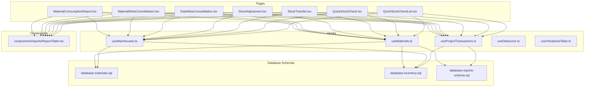
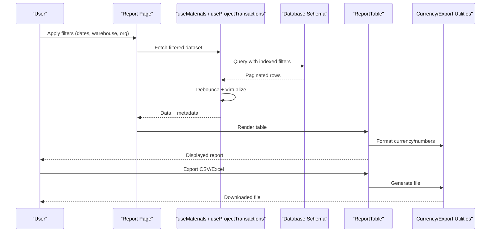
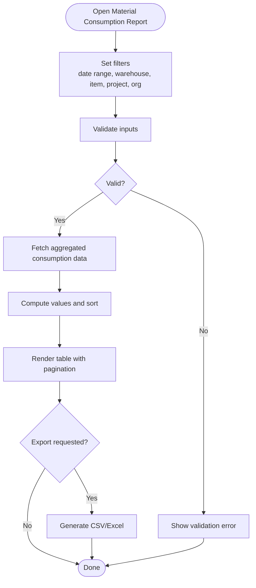
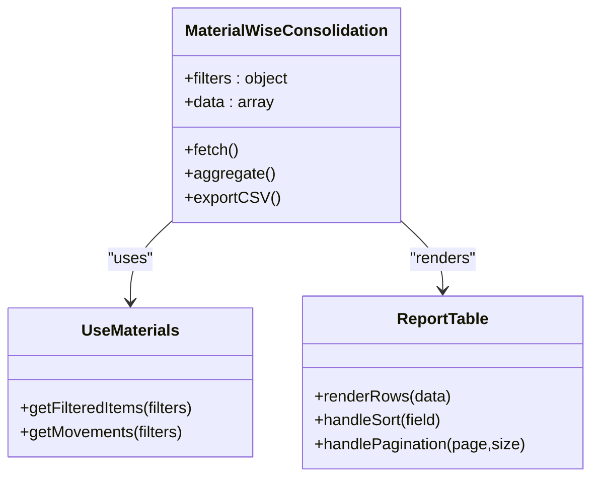
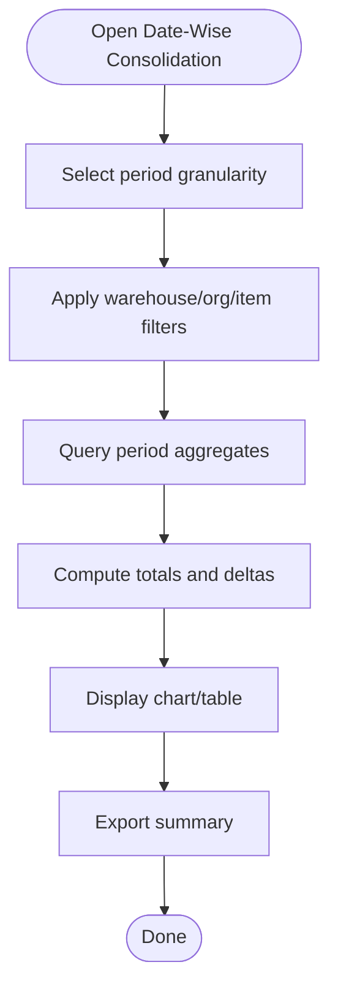
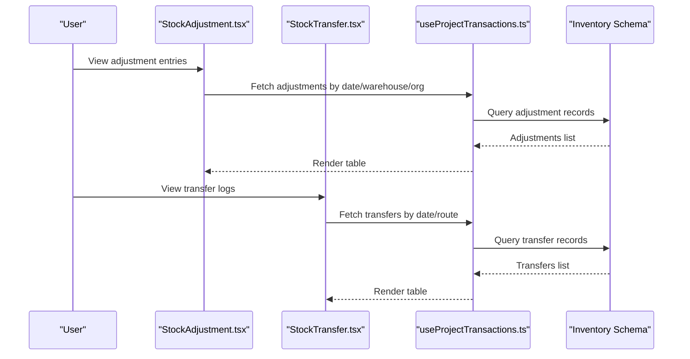
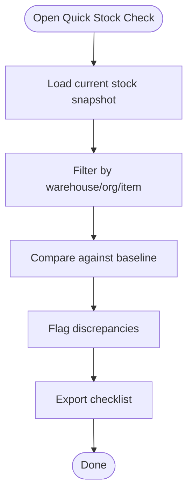
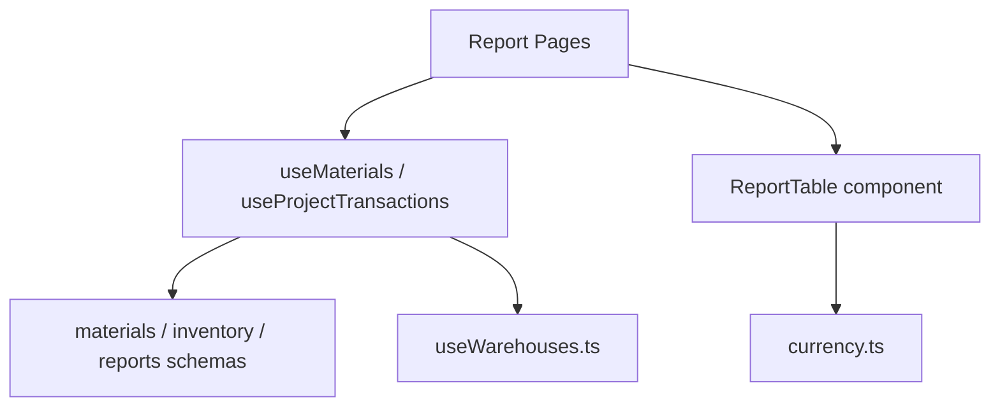

# Transaction Reporting & Analytics

<cite>
**Referenced Files in This Document**
- [MaterialConsumptionReport.tsx](file://src/pages/MaterialConsumptionReport.tsx)
- [MaterialWiseConsolidation.tsx](file://src/pages/MaterialWiseConsolidation.tsx)
- [DateWiseConsolidation.tsx](file://src/pages/DateWiseConsolidation.tsx)
- [StockAdjustment.tsx](file://src/pages/StockAdjustment.tsx)
- [StockTransfer.tsx](file://src/pages/StockTransfer.tsx)
- [QuickStockCheck.tsx](file://src/pages/QuickStockCheck.tsx)
- [QuickStockCheckList.tsx](file://src/pages/QuickStockCheckList.tsx)
- [useMaterials.ts](file://src/hooks/useMaterials.ts)
- [useWarehouses.ts](file://src/hooks/useWarehouses.ts)
- [useProjectTransactions.ts](file://src/hooks/useProjectTransactions.ts)
- [database-materials.sql](file://src/database/materials.sql)
- [database-inventory.sql](file://src/database/inventory.sql)
- [database-reports-schema.sql](file://src/database/reports-schema.sql)
- [reports/index.ts](file://src/reports/index.ts)
- [components/reports/ReportTable.tsx](file://src/components/reports/ReportTable.tsx)
- [hooks/useDebounce.ts](file://src/hooks/useDebounce.ts)
- [hooks/useVirtualizedTable.ts](file://src/hooks/useVirtualizedTable.ts)
- [lib/currency.ts](file://src/lib/currency.ts)
</cite>

## Table of Contents
1. [Introduction](#introduction)
2. [Project Structure](#project-structure)
3. [Core Components](#core-components)
4. [Architecture Overview](#architecture-overview)
5. [Detailed Component Analysis](#detailed-component-analysis)
6. [Dependency Analysis](#dependency-analysis)
7. [Performance Considerations](#performance-considerations)
8. [Troubleshooting Guide](#troubleshooting-guide)
9. [Conclusion](#conclusion)
10. [Appendices](#appendices)

## Introduction
This document explains the transaction reporting and analytics capabilities available in the application, focusing on stock movement history, consumption analysis, valuation reports, and reconciliation statements. It covers filtering options (date ranges, warehouse-specific views, multi-organization), query optimization for large datasets, export formats, integration with business intelligence tools, real-time reporting patterns, caching strategies, and data aggregation techniques. The goal is to help both technical and non-technical users understand how to build, extend, and operate robust reports efficiently.

## Project Structure
The reporting features are implemented across pages, hooks, components, and database schema definitions:
- Pages provide user-facing report screens and dashboards.
- Hooks encapsulate data fetching, filtering, pagination, and virtualization.
- Components standardize table rendering and report layout.
- Database schemas define material, inventory, and reporting structures.

**Diagram sources**
- [MaterialConsumptionReport.tsx](file://src/pages/MaterialConsumptionReport.tsx)
- [MaterialWiseConsolidation.tsx](file://src/pages/MaterialWiseConsolidation.tsx)
- [DateWiseConsolidation.tsx](file://src/pages/DateWiseConsolidation.tsx)
- [StockAdjustment.tsx](file://src/pages/StockAdjustment.tsx)
- [StockTransfer.tsx](file://src/pages/StockTransfer.tsx)
- [QuickStockCheck.tsx](file://src/pages/QuickStockCheck.tsx)
- [QuickStockCheckList.tsx](file://src/pages/QuickStockCheckList.tsx)
- [useMaterials.ts](file://src/hooks/useMaterials.ts)
- [useWarehouses.ts](file://src/hooks/useWarehouses.ts)
- [useProjectTransactions.ts](file://src/hooks/useProjectTransactions.ts)
- [database-materials.sql](file://src/database/materials.sql)
- [database-inventory.sql](file://src/database/inventory.sql)
- [database-reports-schema.sql](file://src/database/reports-schema.sql)
- [components/reports/ReportTable.tsx](file://src/components/reports/ReportTable.tsx)

**Section sources**
- [MaterialConsumptionReport.tsx](file://src/pages/MaterialConsumptionReport.tsx)
- [MaterialWiseConsolidation.tsx](file://src/pages/MaterialWiseConsolidation.tsx)
- [DateWiseConsolidation.tsx](file://src/pages/DateWiseConsolidation.tsx)
- [StockAdjustment.tsx](file://src/pages/StockAdjustment.tsx)
- [StockTransfer.tsx](file://src/pages/StockTransfer.tsx)
- [QuickStockCheck.tsx](file://src/pages/QuickStockCheck.tsx)
- [QuickStockCheckList.tsx](file://src/pages/QuickStockCheckList.tsx)
- [useMaterials.ts](file://src/hooks/useMaterials.ts)
- [useWarehouses.ts](file://src/hooks/useWarehouses.ts)
- [useProjectTransactions.ts](file://src/hooks/useProjectTransactions.ts)
- [database-materials.sql](file://src/database/materials.sql)
- [database-inventory.sql](file://src/database/inventory.sql)
- [database-reports-schema.sql](file://src/database/reports-schema.sql)
- [components/reports/ReportTable.tsx](file://src/components/reports/ReportTable.tsx)

## Core Components
- Material Consumption Report: Provides consumption analysis by item, project, date range, and warehouse. Supports filtering, sorting, and export.
- Material-Wise Consolidation: Aggregates movements per material across time and locations for trend analysis.
- Date-Wise Consolidation: Summarizes daily or period-based totals for inbound/outbound and net changes.
- Stock Adjustment and Transfer Reports: Track adjustments and inter-warehouse transfers for reconciliation.
- Quick Stock Check and List: Snapshot-style checks for current stock levels and discrepancies.

Key capabilities:
- Filtering: date ranges, warehouses, items, projects, organizations.
- Sorting and pagination: optimized for large datasets.
- Export: CSV/Excel via client-side utilities.
- Real-time updates: optional polling or event-driven refresh.
- Multi-org support: scope queries by organization context.

**Section sources**
- [MaterialConsumptionReport.tsx](file://src/pages/MaterialConsumptionReport.tsx)
- [MaterialWiseConsolidation.tsx](file://src/pages/MaterialWiseConsolidation.tsx)
- [DateWiseConsolidation.tsx](file://src/pages/DateWiseConsolidation.tsx)
- [StockAdjustment.tsx](file://src/pages/StockAdjustment.tsx)
- [StockTransfer.tsx](file://src/pages/StockTransfer.tsx)
- [QuickStockCheck.tsx](file://src/pages/QuickStockCheck.tsx)
- [QuickStockCheckList.tsx](file://src/pages/QuickStockCheckList.tsx)

## Architecture Overview
The reporting architecture separates UI presentation from data access and computation:
- Pages orchestrate filters and render results using shared table components.
- Hooks implement data fetching, debounced search, pagination, and virtualization.
- Database schemas define normalized tables and reporting indexes.
- Currency formatting and localization utilities ensure consistent display.

**Diagram sources**
- [MaterialConsumptionReport.tsx](file://src/pages/MaterialConsumptionReport.tsx)
- [useMaterials.ts](file://src/hooks/useMaterials.ts)
- [useProjectTransactions.ts](file://src/hooks/useProjectTransactions.ts)
- [database-materials.sql](file://src/database/materials.sql)
- [database-inventory.sql](file://src/database/inventory.sql)
- [components/reports/ReportTable.tsx](file://src/components/reports/ReportTable.tsx)
- [lib/currency.ts](file://src/lib/currency.ts)

## Detailed Component Analysis

### Material Consumption Report
Purpose: Analyze material consumption over time, grouped by item/project/warehouse.

Key behaviors:
- Filters: date range, warehouse, item, project, organization.
- Aggregation: sum quantities consumed; compute value using latest rates.
- Sorting: by quantity, value, date.
- Pagination: server-side or client-side depending on dataset size.
- Export: CSV/Excel generation.

**Diagram sources**
- [MaterialConsumptionReport.tsx](file://src/pages/MaterialConsumptionReport.tsx)
- [useMaterials.ts](file://src/hooks/useMaterials.ts)
- [components/reports/ReportTable.tsx](file://src/components/reports/ReportTable.tsx)
- [lib/currency.ts](file://src/lib/currency.ts)

**Section sources**
- [MaterialConsumptionReport.tsx](file://src/pages/MaterialConsumptionReport.tsx)
- [useMaterials.ts](file://src/hooks/useMaterials.ts)
- [components/reports/ReportTable.tsx](file://src/components/reports/ReportTable.tsx)
- [lib/currency.ts](file://src/lib/currency.ts)

### Material-Wise Consolidation
Purpose: Aggregate stock movements per material across dates and warehouses to identify trends and anomalies.

Highlights:
- Grouping by material ID and optional warehouse.
- Rolling sums for cumulative stock position.
- Optional project scoping for project-wise consolidation.

**Diagram sources**
- [MaterialWiseConsolidation.tsx](file://src/pages/MaterialWiseConsolidation.tsx)
- [useMaterials.ts](file://src/hooks/useMaterials.ts)
- [components/reports/ReportTable.tsx](file://src/components/reports/ReportTable.tsx)

**Section sources**
- [MaterialWiseConsolidation.tsx](file://src/pages/MaterialWiseConsolidation.tsx)
- [useMaterials.ts](file://src/hooks/useMaterials.ts)
- [components/reports/ReportTable.tsx](file://src/components/reports/ReportTable.tsx)

### Date-Wise Consolidation
Purpose: Provide daily or period-based summaries of inbound/outbound and net changes.

Highlights:
- Time bucketing by day/week/month.
- Summation of quantities and values per period.
- Warehouse and organization filters.

**Diagram sources**
- [DateWiseConsolidation.tsx](file://src/pages/DateWiseConsolidation.tsx)
- [useMaterials.ts](file://src/hooks/useMaterials.ts)
- [components/reports/ReportTable.tsx](file://src/components/reports/ReportTable.tsx)

**Section sources**
- [DateWiseConsolidation.tsx](file://src/pages/DateWiseConsolidation.tsx)
- [useMaterials.ts](file://src/hooks/useMaterials.ts)
- [components/reports/ReportTable.tsx](file://src/components/reports/ReportTable.tsx)

### Stock Adjustment and Transfer Reports
Purpose: Reconcile stock adjustments and inter-warehouse transfers.

Highlights:
- Adjustment entries: reasons, quantities, timestamps, responsible users.
- Transfer logs: source/destination warehouses, quantities, status.
- Reconciliation view: compare expected vs actual stock positions.

**Diagram sources**
- [StockAdjustment.tsx](file://src/pages/StockAdjustment.tsx)
- [StockTransfer.tsx](file://src/pages/StockTransfer.tsx)
- [useProjectTransactions.ts](file://src/hooks/useProjectTransactions.ts)
- [database-inventory.sql](file://src/database/inventory.sql)

**Section sources**
- [StockAdjustment.tsx](file://src/pages/StockAdjustment.tsx)
- [StockTransfer.tsx](file://src/pages/StockTransfer.tsx)
- [useProjectTransactions.ts](file://src/hooks/useProjectTransactions.ts)
- [database-inventory.sql](file://src/database/inventory.sql)

### Quick Stock Check and List
Purpose: Snapshot stock levels and discrepancies for quick audits.

Highlights:
- Current stock snapshot per item/warehouse.
- Discrepancy flags based on last known counts.
- Exportable lists for offline review.

**Diagram sources**
- [QuickStockCheck.tsx](file://src/pages/QuickStockCheck.tsx)
- [QuickStockCheckList.tsx](file://src/pages/QuickStockCheckList.tsx)
- [useMaterials.ts](file://src/hooks/useMaterials.ts)

**Section sources**
- [QuickStockCheck.tsx](file://src/pages/QuickStockCheck.tsx)
- [QuickStockCheckList.tsx](file://src/pages/QuickStockCheckList.tsx)
- [useMaterials.ts](file://src/hooks/useMaterials.ts)

## Dependency Analysis
Reporting components depend on hooks for data access and shared components for rendering. Database schemas provide the foundation for efficient querying.

**Diagram sources**
- [MaterialConsumptionReport.tsx](file://src/pages/MaterialConsumptionReport.tsx)
- [MaterialWiseConsolidation.tsx](file://src/pages/MaterialWiseConsolidation.tsx)
- [DateWiseConsolidation.tsx](file://src/pages/DateWiseConsolidation.tsx)
- [StockAdjustment.tsx](file://src/pages/StockAdjustment.tsx)
- [StockTransfer.tsx](file://src/pages/StockTransfer.tsx)
- [QuickStockCheck.tsx](file://src/pages/QuickStockCheck.tsx)
- [QuickStockCheckList.tsx](file://src/pages/QuickStockCheckList.tsx)
- [useMaterials.ts](file://src/hooks/useMaterials.ts)
- [useProjectTransactions.ts](file://src/hooks/useProjectTransactions.ts)
- [useWarehouses.ts](file://src/hooks/useWarehouses.ts)
- [database-materials.sql](file://src/database/materials.sql)
- [database-inventory.sql](file://src/database/inventory.sql)
- [database-reports-schema.sql](file://src/database/reports-schema.sql)
- [components/reports/ReportTable.tsx](file://src/components/reports/ReportTable.tsx)
- [lib/currency.ts](file://src/lib/currency.ts)

**Section sources**
- [useMaterials.ts](file://src/hooks/useMaterials.ts)
- [useProjectTransactions.ts](file://src/hooks/useProjectTransactions.ts)
- [useWarehouses.ts](file://src/hooks/useWarehouses.ts)
- [database-materials.sql](file://src/database/materials.sql)
- [database-inventory.sql](file://src/database/inventory.sql)
- [database-reports-schema.sql](file://src/database/reports-schema.sql)
- [components/reports/ReportTable.tsx](file://src/components/reports/ReportTable.tsx)
- [lib/currency.ts](file://src/lib/currency.ts)

## Performance Considerations
Optimization strategies for large datasets:
- Debounced input handling: reduce unnecessary re-renders and fetches during typing.
- Virtualized tables: render only visible rows to improve performance.
- Server-side pagination: limit payload sizes and enable deep navigation.
- Indexed queries: leverage database indexes on date, warehouse, item, and organization fields.
- Aggregation at the database layer: precompute summaries where possible.
- Caching: cache frequent queries and snapshots; invalidate on mutations.
- Lazy loading: load heavy charts or exports on demand.

Recommended hooks and utilities:
- Debounce: [useDebounce.ts](file://src/hooks/useDebounce.ts)
- Virtualization: [useVirtualizedTable.ts](file://src/hooks/useVirtualizedTable.ts)
- Currency formatting: [lib/currency.ts](file://src/lib/currency.ts)

[No sources needed since this section provides general guidance]

## Troubleshooting Guide
Common issues and resolutions:
- Slow report loads: verify pagination and virtualization settings; check database indexes.
- Incorrect totals: confirm aggregation logic and currency rounding rules.
- Missing data: validate filter scopes (warehouse, organization); ensure RLS policies allow access.
- Export failures: check browser permissions and file size limits.

Debugging steps:
- Inspect network requests for query parameters and response sizes.
- Log filter states and computed aggregations.
- Validate schema constraints and indexes.

**Section sources**
- [useDebounce.ts](file://src/hooks/useDebounce.ts)
- [useVirtualizedTable.ts](file://src/hooks/useVirtualizedTable.ts)
- [lib/currency.ts](file://src/lib/currency.ts)

## Conclusion
The reporting system provides comprehensive transaction analytics with strong performance characteristics through debouncing, virtualization, and database-level optimizations. Users can generate consumption analyses, consolidations, and reconciliation statements with flexible filters and export capabilities. Extensibility is supported via shared hooks and components, enabling custom reports and BI integrations.

[No sources needed since this section summarizes without analyzing specific files]

## Appendices

### Available Reports Summary
- Stock Movement History: Inbound/outbound logs with details and values.
- Consumption Analysis: Per-item consumption over time and by project.
- Valuation Reports: Quantity and value summaries using latest rates.
- Reconciliation Statements: Adjustments and transfers aligned to expected stock.

**Section sources**
- [MaterialConsumptionReport.tsx](file://src/pages/MaterialConsumptionReport.tsx)
- [MaterialWiseConsolidation.tsx](file://src/pages/MaterialWiseConsolidation.tsx)
- [DateWiseConsolidation.tsx](file://src/pages/DateWiseConsolidation.tsx)
- [StockAdjustment.tsx](file://src/pages/StockAdjustment.tsx)
- [StockTransfer.tsx](file://src/pages/StockTransfer.tsx)

### Filtering Options
- Date ranges: start/end dates with period granularity.
- Warehouse-specific views: single or multiple warehouses.
- Multi-organization reporting: scope by organization context.
- Item/project filters: narrow down to relevant entities.

**Section sources**
- [useMaterials.ts](file://src/hooks/useMaterials.ts)
- [useWarehouses.ts](file://src/hooks/useWarehouses.ts)
- [useProjectTransactions.ts](file://src/hooks/useProjectTransactions.ts)

### Custom Report Generation
Steps:
- Create a new page component that composes filters and renders a ReportTable.
- Implement a hook to fetch and aggregate data based on filters.
- Add export functionality using existing utilities.

**Section sources**
- [components/reports/ReportTable.tsx](file://src/components/reports/ReportTable.tsx)
- [useMaterials.ts](file://src/hooks/useMaterials.ts)
- [lib/currency.ts](file://src/lib/currency.ts)

### Export Formats and BI Integration
- Export formats: CSV/Excel via client-side generation.
- BI integration: schedule periodic exports or expose endpoints for downstream systems.
- Data pipelines: feed aggregated snapshots into BI tools for dashboards.

**Section sources**
- [components/reports/ReportTable.tsx](file://src/components/reports/ReportTable.tsx)
- [lib/currency.ts](file://src/lib/currency.ts)

### Real-Time Reporting and Caching
- Real-time updates: optional polling intervals or event-driven refreshes.
- Caching strategies: cache frequent queries and snapshots; invalidate on mutations.
- Aggregation techniques: precompute summaries at rest for faster retrieval.

**Section sources**
- [useDebounce.ts](file://src/hooks/useDebounce.ts)
- [useVirtualizedTable.ts](file://src/hooks/useVirtualizedTable.ts)